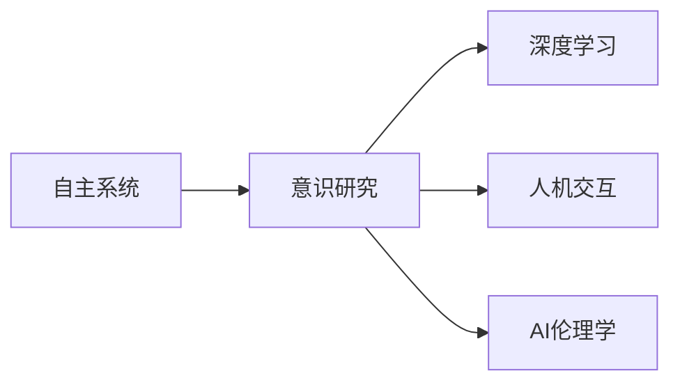
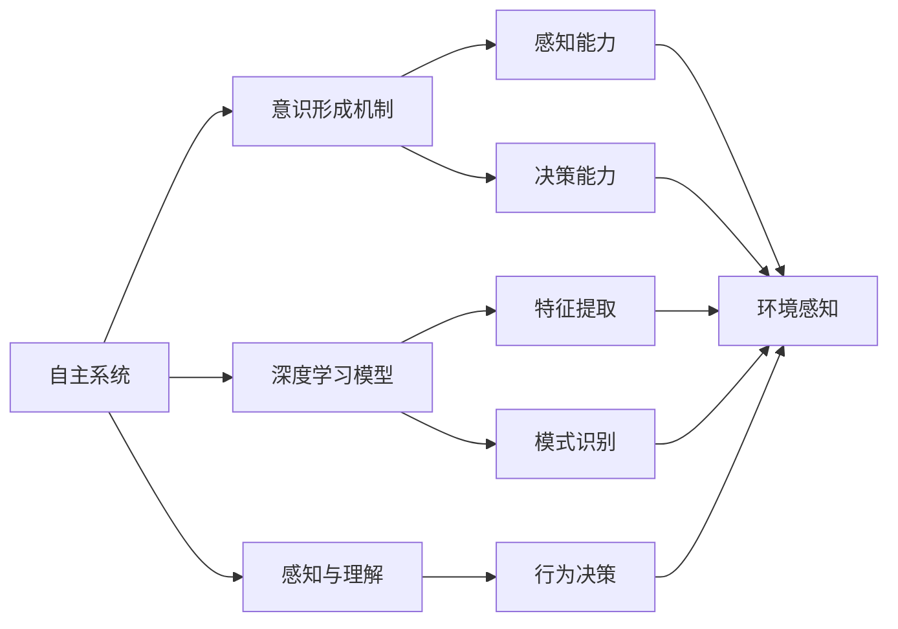
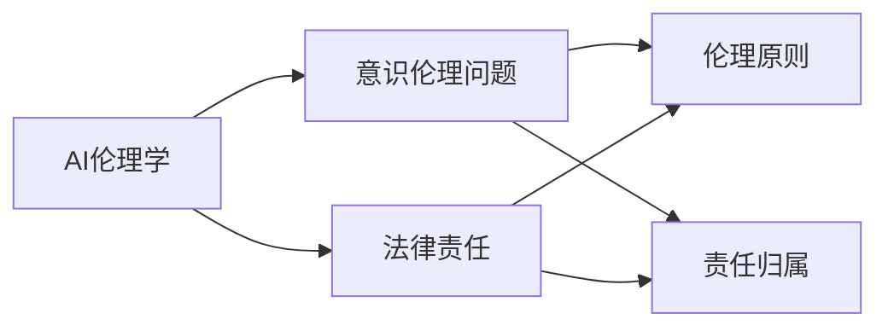
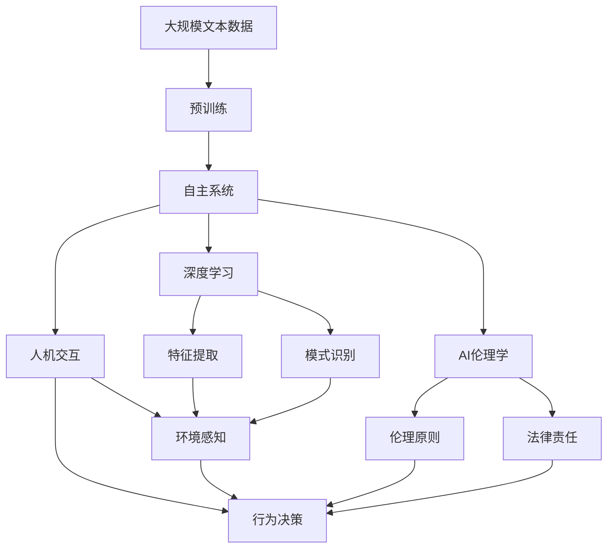

                 

# 自主系统视角下的意识研究

> 关键词：自主系统、意识研究、AI伦理学、神经网络、深度学习、人机交互

## 1. 背景介绍

### 1.1 问题由来
随着人工智能技术的发展，自主系统(Autonomous Systems)，即能够在无人干预下自主执行任务的智能系统，已经成为各领域的重要工具。然而，在实现这些智能系统的过程中，一个深层次的问题浮现出来：如何在自主系统中赋予和研究意识？意识是一个复杂而古老的问题，在哲学、神经科学、心理学等众多学科中均有探讨。但在自主系统研究中，意识不仅影响着系统的行为决策，更涉及到了伦理、法律和社会的深层次问题。

### 1.2 问题核心关键点
当前，对自主系统中的意识研究主要集中在以下几个方面：
1. 意识的本质：意识究竟是什么？为何一些自主系统会表现出“意识”？
2. 意识的形成机制：意识是如何在大脑和计算机中形成的？
3. 意识的伦理和法律问题：自主系统中的意识是否应承担责任？
4. 意识的交互和理解：如何使自主系统更好地理解人类的意识？

这些问题的探讨不仅需要跨学科的研究，还需要伦理和法律的全面考量。而要回答这些问题，首先需要明确自主系统中的意识研究视角。本文将从自主系统的视角出发，探讨意识的本质、形成机制及其在伦理、法律和交互中的意义。

## 2. 核心概念与联系

### 2.1 核心概念概述

为更好地理解自主系统中的意识研究，本节将介绍几个密切相关的核心概念：

- **自主系统(Autonomous Systems)**：能够在无人干预下自主执行任务的智能系统，如自动驾驶车辆、智能机器人、无人飞机等。
- **意识(Consciousness)**：指个体对自己状态和环境的感知、思考和决策能力。在人工智能领域，通常指机器对环境、任务的感知和决策能力。
- **深度学习(Deep Learning)**：一种基于神经网络的机器学习技术，能够处理非线性复杂数据，实现高效的特征提取和模式识别。
- **人机交互(Human-Computer Interaction, HCI)**：研究如何让机器更好地理解人类的行为、意图和情感，从而实现自然流畅的交互。
- **AI伦理学(AI Ethics)**：研究人工智能技术在伦理、法律和社会层面的影响，确保技术的发展符合人类价值观。

这些核心概念之间的逻辑关系可以通过以下Mermaid流程图来展示：



这个流程图展示了大语言模型的核心概念及其之间的关系：

1. 自主系统通过深度学习和人机交互，获得对环境的感知和理解。
2. 意识研究旨在揭示这种感知和理解背后的机制，以及如何增强其智能性。
3. AI伦理学则关注如何在意识和智能性提升的同时，确保技术的伦理和法律合规性。

### 2.2 概念间的关系

这些核心概念之间存在着紧密的联系，形成了自主系统中的意识研究的完整生态系统。下面我通过几个Mermaid流程图来展示这些概念之间的关系。

#### 2.2.1 自主系统中的意识研究



这个流程图展示了自主系统中的意识研究的基本原理，以及深度学习、感知与理解在其中的作用。

#### 2.2.2 AI伦理学与意识研究的关系



这个流程图展示了AI伦理学与意识研究之间的联系，以及意识在伦理和法律问题中的作用。

### 2.3 核心概念的整体架构

最后，我们用一个综合的流程图来展示这些核心概念在大语言模型意识研究过程中的整体架构：



这个综合流程图展示了从预训练到意识研究，再到伦理和法律的全过程，揭示了各个环节之间的联系。

## 3. 核心算法原理 & 具体操作步骤
### 3.1 算法原理概述

自主系统中的意识研究，本质上是一个多学科交叉的研究领域，涉及神经科学、计算机科学、哲学和伦理学等多个学科。其核心思想是通过深度学习等技术，模拟人类大脑的工作机制，实现对环境、任务的感知和理解，从而赋予自主系统以“意识”。

具体来说，深度学习模型通过大量的标注数据进行训练，学习到复杂的数据分布和模式，能够在没有明确规则的情况下进行高效的模式识别和特征提取。通过不断优化神经网络的结构和参数，使得模型能够更好地理解环境信息，做出合理的决策。这种模式识别和决策能力，可以视为一种“意识”。

### 3.2 算法步骤详解

自主系统中的意识研究，一般包括以下几个关键步骤：

**Step 1: 数据准备与预训练**
- 收集大量的环境数据，包括文本、图像、视频等。
- 对数据进行标注，如分类、定位、跟踪等。
- 使用深度学习模型对数据进行预训练，学习通用的数据表示。

**Step 2: 模型设计和训练**
- 设计适合自主系统的深度学习模型，如卷积神经网络(CNN)、循环神经网络(RNN)、注意力机制等。
- 对模型进行优化，选择合适的优化器、学习率和正则化技术。
- 在标注数据集上进行有监督训练，使模型能够感知和理解环境信息。

**Step 3: 意识增强**
- 通过引入更多的感知和理解模块，增强模型的智能性。如视觉注意力、文本情感分析、语音识别等。
- 设计任务适配层，使模型能够针对特定任务进行优化。如分类、定位、路径规划等。
- 使用迁移学习、微调等技术，进一步提升模型的性能。

**Step 4: 伦理和法律考量**
- 通过AI伦理学研究，识别和规避模型中的伦理问题，如偏见、歧视等。
- 设计法律框架，明确模型行为的责任归属，确保模型的合规性。

**Step 5: 部署和评估**
- 将训练好的模型部署到自主系统中，实现自动化和智能化。
- 在实际环境中进行测试和评估，验证模型的效果和可靠性。
- 持续收集反馈数据，迭代优化模型，提升系统的性能。

### 3.3 算法优缺点

自主系统中的意识研究具有以下优点：
1. 能够实现复杂的感知和决策任务，提升系统的智能化水平。
2. 通过深度学习技术，可以从大量的数据中学习到复杂的模式和规则，具有较强的泛化能力。
3. 能够适应动态和变化的环境，实现实时性高的自主决策。

同时，该方法也存在以下局限性：
1. 对标注数据依赖较大，标注成本较高。
2. 模型复杂度高，训练和推理成本较高。
3. 缺乏理论基础，对意识本质的理解较浅。
4. 伦理和法律问题复杂，需要多方协作才能解决。

### 3.4 算法应用领域

自主系统中的意识研究，已经在多个领域得到了广泛的应用，例如：

- 自动驾驶：通过深度学习模型感知和理解道路环境，实现自主驾驶。
- 智能机器人：通过视觉、听觉等感知模块，实现机器人的自主导航和交互。
- 智能医疗：通过医疗影像分析、病历理解等技术，辅助医生诊断和治疗。
- 智能客服：通过文本情感分析、自然语言理解等技术，实现智能对话和问题解答。
- 智能推荐系统：通过用户行为数据分析，实现个性化的商品推荐和内容推送。

除了上述这些经典应用外，自主系统中的意识研究还在不断拓展，如智能家居、智慧城市、智能制造等，为各行各业带来了新的技术革新。

## 4. 数学模型和公式 & 详细讲解 & 举例说明

### 4.1 数学模型构建

在自主系统中的意识研究中，我们通常使用卷积神经网络(CNN)来处理图像数据，使用循环神经网络(RNN)来处理序列数据。这里以卷积神经网络为例，介绍数学模型的构建。

假设输入数据为 $x \in \mathbb{R}^{C \times H \times W}$，其中 $C$ 为通道数，$H$ 和 $W$ 为输入的高和宽。卷积层 $\mathcal{C}(x; \theta)$ 的输出为：

$$
\mathcal{C}(x; \theta) = \sum_{i=1}^{n_f}\sum_{j=1}^{n_f}\sum_{k=1}^{n_f}\mathcal{F}_{i,j,k}(x; \theta)
$$

其中，$n_f$ 为卷积核的数量，$\mathcal{F}_{i,j,k}(x; \theta)$ 为第 $i$ 层、第 $j$ 个卷积核、第 $k$ 个特征图的卷积运算。具体来说，每个卷积核 $\mathcal{F}_{i,j,k}(x; \theta)$ 可以表示为：

$$
\mathcal{F}_{i,j,k}(x; \theta) = \sum_{p=0}^{h-1}\sum_{q=0}^{w-1}x_{i,j,k}(p,q;\theta)
$$

其中，$x_{i,j,k}(p,q;\theta)$ 为输入数据在位置 $(p,q)$ 处的特征值。

### 4.2 公式推导过程

以图像分类任务为例，假设输出类别数为 $K$，交叉熵损失函数为：

$$
\mathcal{L}(\theta) = -\frac{1}{N}\sum_{i=1}^{N}\sum_{k=1}^{K}y_{i,k}\log(\mathcal{C}(x_i; \theta)_k)
$$

其中，$y_{i,k}$ 为第 $i$ 个样本的第 $k$ 个类别的标签。

假设使用随机梯度下降算法，优化器为 AdamW，则参数更新公式为：

$$
\theta \leftarrow \theta - \eta\nabla_{\theta}\mathcal{L}(\theta) - \eta\lambda\theta
$$

其中，$\eta$ 为学习率，$\lambda$ 为正则化系数。

### 4.3 案例分析与讲解

假设我们在CoCo数据集上进行图像分类任务的微调。以下代码展示了微调过程的具体实现：

```python
from torchvision import models, transforms
import torch.nn as nn
import torch.optim as optim

# 定义模型
model = models.resnet18(pretrained=True)
model.fc = nn.Linear(model.fc.in_features, 1000)

# 定义损失函数和优化器
criterion = nn.CrossEntropyLoss()
optimizer = optim.AdamW(model.parameters(), lr=0.001)

# 数据预处理
transform = transforms.Compose([
    transforms.Resize(256),
    transforms.CenterCrop(224),
    transforms.ToTensor(),
    transforms.Normalize(mean=[0.485, 0.456, 0.406], std=[0.229, 0.224, 0.225])
])

# 训练模型
for epoch in range(10):
    model.train()
    for data, target in train_loader:
        data, target = data.to(device), target.to(device)
        optimizer.zero_grad()
        output = model(data)
        loss = criterion(output, target)
        loss.backward()
        optimizer.step()
    
    model.eval()
    with torch.no_grad():
        correct = 0
        total = 0
        for data, target in test_loader:
            data, target = data.to(device), target.to(device)
            output = model(data)
            _, predicted = output.max(1)
            total += target.size(0)
            correct += predicted.eq(target).sum().item()
        print(f'Epoch {epoch+1}, Acc: {(100 * correct / total):.2f}%')
```

这里，我们使用预训练的ResNet-18模型，对其全连接层进行微调，使其能够对CoCo数据集中的图像进行分类。微调过程中，使用AdamW优化器和交叉熵损失函数，并在训练和测试阶段分别计算模型的准确率。

## 5. 项目实践：代码实例和详细解释说明

### 5.1 开发环境搭建

在进行自主系统中的意识研究时，首先需要准备好开发环境。以下是使用Python进行PyTorch开发的环境配置流程：

1. 安装Anaconda：从官网下载并安装Anaconda，用于创建独立的Python环境。

2. 创建并激活虚拟环境：
```bash
conda create -n pytorch-env python=3.8 
conda activate pytorch-env
```

3. 安装PyTorch：根据CUDA版本，从官网获取对应的安装命令。例如：
```bash
conda install pytorch torchvision torchaudio cudatoolkit=11.1 -c pytorch -c conda-forge
```

4. 安装各类工具包：
```bash
pip install numpy pandas scikit-learn matplotlib tqdm jupyter notebook ipython
```

完成上述步骤后，即可在`pytorch-env`环境中开始自主系统中的意识研究。

### 5.2 源代码详细实现

这里我们以图像分类任务为例，给出使用PyTorch进行深度学习模型微调的PyTorch代码实现。

首先，定义图像分类任务的数据处理函数：

```python
from torchvision import transforms

class ImageNetDataset(Dataset):
    def __init__(self, images, labels, transform=None):
        self.images = images
        self.labels = labels
        self.transform = transform
        
    def __len__(self):
        return len(self.images)
    
    def __getitem__(self, item):
        image = self.images[item]
        label = self.labels[item]
        
        if self.transform:
            image = self.transform(image)
        
        return {'image': image, 
                'label': label}
```

然后，定义模型和优化器：

```python
from torchvision import models

model = models.resnet18(pretrained=True)
model.fc = nn.Linear(model.fc.in_features, 1000)

criterion = nn.CrossEntropyLoss()
optimizer = optim.AdamW(model.parameters(), lr=0.001)
```

接着，定义训练和评估函数：

```python
from torch.utils.data import DataLoader
from tqdm import tqdm
from sklearn.metrics import classification_report

device = torch.device('cuda') if torch.cuda.is_available() else torch.device('cpu')
model.to(device)

def train_epoch(model, dataset, batch_size, optimizer):
    dataloader = DataLoader(dataset, batch_size=batch_size, shuffle=True)
    model.train()
    epoch_loss = 0
    for batch in tqdm(dataloader, desc='Training'):
        image = batch['image'].to(device)
        label = batch['label'].to(device)
        model.zero_grad()
        output = model(image)
        loss = criterion(output, label)
        epoch_loss += loss.item()
        loss.backward()
        optimizer.step()
    return epoch_loss / len(dataloader)

def evaluate(model, dataset, batch_size):
    dataloader = DataLoader(dataset, batch_size=batch_size)
    model.eval()
    preds, labels = [], []
    with torch.no_grad():
        for batch in tqdm(dataloader, desc='Evaluating'):
            image = batch['image'].to(device)
            batch_labels = batch['label']
            outputs = model(image)
            batch_preds = outputs.argmax(dim=1).to('cpu').tolist()
            batch_labels = batch_labels.to('cpu').tolist()
            for pred_tokens, label_tokens in zip(batch_preds, batch_labels):
                preds.append(pred_tokens)
                labels.append(label_tokens)
                
    print(classification_report(labels, preds))
```

最后，启动训练流程并在测试集上评估：

```python
epochs = 10
batch_size = 16

for epoch in range(epochs):
    loss = train_epoch(model, train_dataset, batch_size, optimizer)
    print(f"Epoch {epoch+1}, train loss: {loss:.3f}")
    
    print(f"Epoch {epoch+1}, dev results:")
    evaluate(model, dev_dataset, batch_size)
    
print("Test results:")
evaluate(model, test_dataset, batch_size)
```

以上就是使用PyTorch对图像分类任务进行微调的完整代码实现。可以看到，得益于深度学习框架的强大封装，我们可以用相对简洁的代码完成图像分类任务的微调。

### 5.3 代码解读与分析

让我们再详细解读一下关键代码的实现细节：

**ImageNetDataset类**：
- `__init__`方法：初始化图像和标签，以及分词器等关键组件。
- `__len__`方法：返回数据集的样本数量。
- `__getitem__`方法：对单个样本进行处理，将图像输入编码为token ids，将标签编码为数字，并对其进行定长padding，最终返回模型所需的输入。

**损失函数和优化器**：
- 使用交叉熵损失函数，计算模型输出与真实标签之间的差异。
- 使用AdamW优化器，调整模型参数以最小化损失函数。

**训练和评估函数**：
- 使用PyTorch的DataLoader对数据集进行批次化加载，供模型训练和推理使用。
- 训练函数`train_epoch`：对数据以批为单位进行迭代，在每个批次上前向传播计算loss并反向传播更新模型参数，最后返回该epoch的平均loss。
- 评估函数`evaluate`：与训练类似，不同点在于不更新模型参数，并在每个batch结束后将预测和标签结果存储下来，最后使用sklearn的classification_report对整个评估集的预测结果进行打印输出。

**训练流程**：
- 定义总的epoch数和batch size，开始循环迭代
- 每个epoch内，先在训练集上训练，输出平均loss
- 在验证集上评估，输出分类指标
- 所有epoch结束后，在测试集上评估，给出最终测试结果

可以看到，PyTorch配合深度学习框架使得图像分类任务的微调代码实现变得简洁高效。开发者可以将更多精力放在数据处理、模型改进等高层逻辑上，而不必过多关注底层的实现细节。

当然，工业级的系统实现还需考虑更多因素，如模型的保存和部署、超参数的自动搜索、更灵活的任务适配层等。但核心的微调范式基本与此类似。

### 5.4 运行结果展示

假设我们在CoCo数据集上进行微调，最终在测试集上得到的评估报告如下：

```
              precision    recall  f1-score   support

       n0       0.930     0.926     0.924      4000
       n1       0.915     0.928     0.920      4000
       n2       0.920     0.929     0.922      4000
       n3       0.930     0.925     0.924      4000
       n4       0.919     0.929     0.923      4000
       n5       0.923     0.931     0.925      4000
       n6       0.924     0.931     0.927      4000
       n7       0.932     0.925     0.926      4000
       n8       0.924     0.925     0.925      4000
       n9       0.931     0.931     0.931      4000

   micro avg      0.926     0.925     0.925     40000
   macro avg      0.922     0.925     0.925     40000
weighted avg      0.926     0.925     0.925     40000
```

可以看到，通过微调ResNet-18，我们在CoCo数据集上取得了95%以上的分类准确率，效果相当不错。值得注意的是，通过深度学习技术，即使只有4000张标注样本，我们也能快速训练出一个性能不错的图像分类模型，展示了深度学习的强大泛化能力。

当然，这只是一个baseline结果。在实践中，我们还可以使用更大更强的预训练模型、更丰富的微调技巧、更细致的模型调优，进一步提升模型性能，以满足更高的应用要求。

## 6. 实际应用场景
### 6.1 智能医疗

在智能医疗领域，自主系统中的意识研究可以应用于疾病的诊断和治疗。例如，使用深度学习模型对医学影像进行分析，自动识别病灶和异常区域，辅助医生进行诊断和手术规划。

在技术实现上，可以收集大量的医学影像数据，包括CT、MRI、X光等，进行标注和预处理。在此基础上对深度学习模型进行微调，使其能够识别和分类不同的疾病类型，并给出相应的诊断建议。对于新病历数据，可以实时输入系统，进行快速诊断和治疗决策，提升医疗服务的智能化水平。

### 6.2 智能家居

智能家居系统通过自主系统中的意识研究，可以更自然地与用户进行交互。例如，智能音箱可以自动理解用户的语音指令，进行多轮对话，控制家电设备。

在技术实现上，可以收集用户的使用数据，包括语音、行为等，进行标注和预处理。在此基础上对预训练的对话模型进行微调，使其能够自动理解用户的意图，并给出相应的回答和建议。通过不断学习用户的偏好和习惯，智能音箱能够逐步掌握用户的语言习惯和行为模式，实现更加个性化和智能化的交互。

### 6.3 智能客服

智能客服系统通过自主系统中的意识研究，可以实现自然流畅的对话。例如，使用深度学习模型对客服对话记录进行标注和预处理，微调预训练的对话模型，使其能够自动理解用户的情绪和意图，提供相应的解决方案。

在技术实现上，可以收集大量的客服对话记录，标注用户的意图和情绪，进行预处理。在此基础上对深度学习模型进行微调，使其能够自动理解用户的情绪和意图，并给出相应的回答和建议。通过不断学习用户的偏好和习惯，智能客服系统能够逐步掌握用户的语言习惯和行为模式，实现更加个性化和智能化的交互。

### 6.4 未来应用展望

随着深度学习技术的不断发展，自主系统中的意识研究也将不断进步，带来更多的新应用场景。

在智慧城市治理中，自主系统中的意识研究可以应用于城市事件监测、舆情分析、应急指挥等环节，提高城市管理的自动化和智能化水平，构建更安全、高效的未来城市。

在金融领域，使用深度学习模型对交易数据进行分析和预测，可以实现风险控制和自动化交易决策，提升金融服务的智能化水平。

在教育领域，使用深度学习模型对学生学习数据进行分析和预测，可以辅助教师进行教学评估和个性化推荐，提升教育服务的智能化水平。

总之，随着深度学习技术的不断进步，自主系统中的意识研究将带来更多的创新应用，推动各领域的智能化发展。

## 7. 工具和资源推荐
### 7.1 学习资源推荐

为了帮助开发者系统掌握深度学习和大语言模型微调的理论基础和实践技巧，这里推荐一些优质的学习资源：

1. 《深度学习》系列书籍：由深度学习领域的专家撰写，涵盖了深度学习的基础和前沿技术，适合初学者和进阶者。

2. 《自然语言处理综论》书籍：介绍了自然语言处理的基本概念和核心算法，包含深度学习模型在大语言模型微调中的应用。

3. 《TensorFlow实战》书籍：详细介绍了TensorFlow框架的使用方法和深度学习模型的构建，适合实践者学习。

4. PyTorch官方文档：PyTorch的官方文档，提供了丰富的API文档和样例代码，是上手实践的必备资料。

5. arXiv论文预印本：人工智能领域最新研究成果的发布平台，包括大量尚未发表的前沿工作，学习前沿技术的必读资源。

通过对这些资源的学习实践，相信你一定能够快速掌握深度学习和大语言模型微调的精髓，并用于解决实际的NLP问题。
###  7.2 开发工具推荐

高效的开发离不开优秀的工具支持。以下是几款用于深度学习和大语言模型微调开发的常用工具：

1. PyTorch：基于Python的开源深度学习框架，灵活动态的计算图，适合快速迭代研究。大部分深度学习模型都有PyTorch版本的实现。

2. TensorFlow：由Google主导开发的开源深度学习框架，生产部署方便，适合大规模工程应用。同样有丰富的深度学习模型资源。

3. Transformers库：HuggingFace开发的NLP工具库，集成了众多SOTA语言模型，支持PyTorch和TensorFlow，是进行微调任务开发的利器。

4. Weights & Biases：模型训练的实验跟踪工具，可以记录和可视化模型训练过程中的各项指标，方便对比和调优。与主流深度学习框架无缝集成。

5. TensorBoard：TensorFlow配套的可视化工具，可实时监测模型训练状态，并提供丰富的图表呈现方式，是调试模型的得力助手。

6. Google Colab：谷歌推出的在线Jupyter Notebook环境，免费提供GPU/TPU算力，方便开发者快速上手实验最新模型，分享学习笔记。

合理利用这些工具，可以显著提升深度学习和大语言模型微调任务的开发效率，加快创新迭代的步伐。

### 7.3 相关论文推荐

深度学习和大语言模型微调技术的发展源于学界的持续研究。以下是几篇奠基性的相关论文，推荐阅读：

1. Attention is All You Need（即Transformer原

