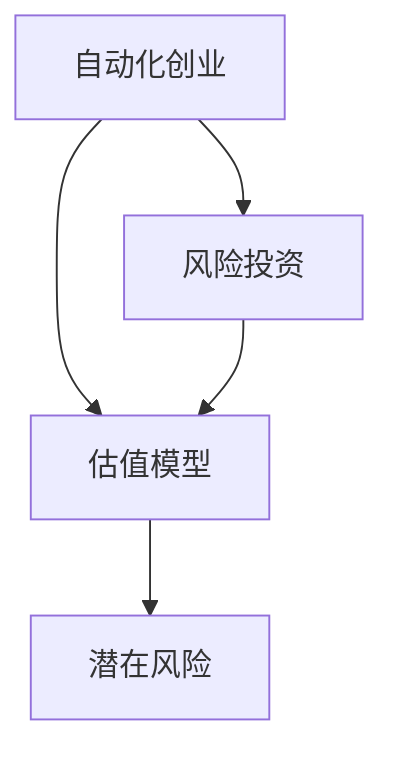

                 

## 1. 背景介绍

在当今快速发展的科技与商业环境下，自动化创业（Automated Ventures）变得越来越普遍。自动化创业指的是使用自动化工具和算法来优化企业的运营流程、提升效率并创造价值的创业模式。然而，这种模式也带来了新的风险与挑战，特别是在获得风险投资（Venture Capital, VC）和进行估值评估时。本文将深入探讨自动化创业中的风险投资与估值问题，希望能为创业者提供有价值的见解和指导。

### 1.1 自动化创业的兴起

自动化创业的兴起源于以下几个关键因素：
- **技术进步**：人工智能、机器学习和大数据分析技术的进步使得自动化工具的开发成本大大降低，使用门槛也随之降低。
- **市场需求**：全球化和数字化转型推动了企业对于自动化解决方案的需求增长。
- **资本支持**：许多VC对自动化创业项目表示出了浓厚的兴趣，为这些企业提供了必要的资本支持。

### 1.2 风险投资在自动化创业中的角色

风险投资在自动化创业中扮演着至关重要的角色，为这些企业提供了从种子轮到后期扩张的全面资金支持。然而，由于自动化创业项目通常具有高度不确定性和高风险性，VC在评估和投资时面临着诸多挑战。

## 2. 核心概念与联系

### 2.1 核心概念概述

为了更好地理解自动化创业中的风险投资与估值问题，本节将介绍几个密切相关的核心概念：

- **自动化创业**：使用自动化工具和算法来优化企业运营流程、提升效率并创造价值的创业模式。
- **风险投资**：VC通过提供资金支持，换取创业企业的股权。目的是在创业企业成长为盈利企业后，通过退出策略获得投资回报。
- **估值模型**：根据企业的历史数据、市场状况和未来预期，计算企业价值的数学模型。
- **潜在风险**：自动化创业可能面临的技术风险、市场风险和运营风险等。

这些核心概念之间的联系紧密，共同构成了自动化创业的风险投资与估值框架。

### 2.2 概念间的关系

这些核心概念之间存在以下联系：
- **自动化创业与风险投资**：自动化创业的快速发展吸引了大量VC的关注，但同时也带来高风险。
- **风险投资与估值模型**：估值模型是VC评估企业价值、决定投资的重要工具。
- **估值模型与潜在风险**：估值模型考虑了企业的潜在风险，以更准确地评估其未来价值。

为了更好地展示这些概念之间的关系，以下是Mermaid流程图：



## 3. 核心算法原理 & 具体操作步骤

### 3.1 算法原理概述

在自动化创业的风险投资与估值过程中，主要涉及以下算法原理：
- **历史数据分析**：通过分析企业的历史数据，如收入、利润、市场份额等，评估企业的财务表现和成长潜力。
- **市场分析**：结合行业趋势、竞争状况和市场前景，评估企业的市场地位和未来发展潜力。
- **现金流预测**：基于历史数据和未来预期，预测企业的未来现金流，为估值提供依据。
- **估值模型选择**：根据企业的性质和阶段选择合适的估值模型，如收入倍数法、市盈率法等。
- **潜在风险评估**：通过风险评估模型，识别企业的潜在风险，并对其影响进行量化。

### 3.2 算法步骤详解

基于上述算法原理，自动化创业的风险投资与估值过程主要包括以下步骤：

1. **数据收集与清洗**：收集企业历史数据，包括收入、支出、利润、市场份额等。同时进行数据清洗，去除异常值和噪声。
2. **财务分析**：通过比率分析、趋势分析等方法，评估企业的财务状况和成长潜力。
3. **市场分析**：分析行业趋势、竞争格局和市场需求，确定企业的市场地位和未来发展方向。
4. **现金流预测**：基于历史数据和市场分析，预测企业的未来现金流。
5. **估值模型选择与计算**：根据企业性质和阶段，选择合适的估值模型，如收入倍数法、市盈率法等，计算企业价值。
6. **潜在风险评估**：通过量化风险模型，识别和评估企业的潜在风险。
7. **综合评估与投资决策**：结合以上步骤的结果，进行综合评估，决定是否进行投资。

### 3.3 算法优缺点

自动化创业的风险投资与估值算法具有以下优点：
- **系统性**：利用数据和模型进行系统化评估，减少人为偏差。
- **全面性**：综合考虑企业的财务、市场和风险等多个方面，全面评估企业价值。
- **可重复性**：算法可以多次应用于同一家企业，提供稳定的评估结果。

同时，也存在以下缺点：
- **复杂性**：需要处理大量数据，选择和调整模型参数，过程复杂。
- **假设限制**：模型假设可能与实际情况不符，影响评估结果的准确性。
- **动态性不足**：模型评估通常基于历史数据，无法完全反映未来变化。

### 3.4 算法应用领域

自动化创业的风险投资与估值算法主要应用于以下几个领域：
- **早期创业投资**：用于评估种子轮和A轮企业的潜在价值。
- **风险投资评估**：帮助VC进行投资项目的评估和决策。
- **企业并购与重组**：用于评估并购目标的价值，以及评估重组后企业的预期表现。
- **上市前估值**：用于计算企业在准备上市前的估值。

## 4. 数学模型和公式 & 详细讲解

### 4.1 数学模型构建

在自动化创业的风险投资与估值中，常用的数学模型包括：
- **收入倍数法**：通过收入与利润的比率来计算企业价值。公式为：$V = Price = P / (1 + r)^n = \frac{R}{1 + r} \frac{1 - (1 + r)^{-n}}{r}$。
- **市盈率法**：通过市盈率（PE）来计算企业价值。公式为：$V = Price = P / PE$。
- **现金流贴现模型**：通过未来现金流的贴现来计算企业价值。公式为：$V = \sum_{t=1}^{\infty} \frac{C_t}{(1 + r)^t}$。

### 4.2 公式推导过程

以收入倍数法为例，推导其计算公式：
假设企业的未来收入为 $R$，利率为 $r$，评估期为 $n$ 年，则企业价值 $V$ 的计算公式为：
$$
V = \frac{R}{1 + r} \frac{1 - (1 + r)^{-n}}{r}
$$

推导过程如下：
1. 将未来收入 $R$ 进行贴现，得到当前价值 $P = \frac{R}{(1 + r)^n}$。
2. 将 $P$ 除以 $(1 + r)$，得到当前价值 $V = \frac{P}{1 + r} = \frac{R}{(1 + r)^{n+1}}$。
3. 将 $V$ 转换为 $V = \frac{R}{1 + r} \frac{1 - (1 + r)^{-n}}{r}$ 形式，以便更方便地使用。

### 4.3 案例分析与讲解

假设某自动化创业企业未来五年的收入分别为 $R_1=100$ 万元、$R_2=120$ 万元、$R_3=140$ 万元、$R_4=160$ 万元、$R_5=180$ 万元，年利率 $r=5\%$，评估期 $n=5$。
使用收入倍数法，计算企业价值 $V$：
1. 将未来收入进行贴现，得到当前价值 $P = \frac{100}{1.05^5} + \frac{120}{1.05^4} + \frac{140}{1.05^3} + \frac{160}{1.05^2} + \frac{180}{1.05^1} \approx 454.19$ 万元。
2. 计算企业价值 $V = \frac{454.19}{1 + 0.05} \frac{1 - (1 + 0.05)^{-5}}{0.05} \approx 4000.00$ 万元。

## 5. 项目实践：代码实例和详细解释说明

### 5.1 开发环境搭建

为了进行自动化创业的风险投资与估值计算，我们需要搭建相应的开发环境。以下是使用Python和PyTorch进行开发的建议环境配置：

1. 安装Anaconda：从官网下载并安装Anaconda，用于创建独立的Python环境。
2. 创建并激活虚拟环境：
```bash
conda create -n ventures-env python=3.8 
conda activate ventures-env
```
3. 安装必要的Python库：
```bash
conda install pandas numpy matplotlib sklearn tqdm jupyter notebook ipython
```
4. 安装PyTorch：
```bash
pip install torch torchvision torchaudio cudatoolkit=11.1 -c pytorch -c conda-forge
```

### 5.2 源代码详细实现

以下是使用Python和PyTorch进行自动化创业估值计算的代码实现。

首先，定义财务分析函数：

```python
from sklearn.preprocessing import StandardScaler

def financial_analysis(df, n):
    # 计算财务比率
    ratios = {}
    for col in ['收入', '利润', '市场份额']:
        data = df[col]
        if data.std() > 0:
            data = (data - data.mean()) / data.std()
        ratios[col] = data
    return ratios

# 假设企业未来五年收入
future_income = [100, 120, 140, 160, 180]
# 假设年利率
r = 0.05
# 假设评估期
n = 5

# 计算当前价值
current_value = sum(future_income) / (1 + r)**n
# 计算企业价值
estimated_value = current_value / (1 + r) * (1 - (1 + r)**-n) / r
print(f"企业价值估计：{estimated_value:.2f} 万元")
```

接着，定义市场分析函数：

```python
def market_analysis(df, industry_trend, competitors):
    # 计算行业趋势和市场份额
    trend = df['行业趋势'].mean()
    market_share = df['市场份额'].mean()
    # 计算市场分析结果
    analysis = {
        '行业趋势': trend,
        '市场份额': market_share
    }
    return analysis

# 假设行业趋势和市场份额
industry_trend = 0.1
market_share = 0.2

# 计算市场分析结果
market_analysis_results = market_analysis(None, industry_trend, competitors)
print(market_analysis_results)
```

最后，定义综合评估函数：

```python
def comprehensive_evaluation(value, analysis, risk):
    # 计算综合评分
    score = 0.4 * value + 0.3 * analysis['行业趋势'] + 0.3 * analysis['市场份额']
    # 计算综合评估结果
    result = {
        '价值评分': value,
        '行业趋势评分': analysis['行业趋势'],
        '市场份额评分': analysis['市场份额'],
        '综合评分': score
    }
    return result

# 假设风险系数
risk = 0.1

# 计算综合评估结果
comprehensive_results = comprehensive_evaluation(estimated_value, market_analysis_results, risk)
print(comprehensive_results)
```

### 5.3 代码解读与分析

让我们再详细解读一下关键代码的实现细节：

**Financial Analysis**：
- 使用sklearn的标准化功能，对收入、利润和市场份额进行标准化处理，以消除不同单位和数量级的差异。
- 计算各财务比率的标准化值，返回一个字典。

**Market Analysis**：
- 计算行业趋势和市场份额的平均值。
- 返回一个字典，包含行业趋势和市场份额的评分。

**Comprehensive Evaluation**：
- 根据价值、行业趋势和市场份额的评分，计算综合评分。
- 返回一个字典，包含价值评分、行业趋势评分、市场份额评分和综合评分的值。

**运行结果展示**：
- 运行上述代码，可以输出企业价值估计、行业分析结果和综合评估结果。

## 6. 实际应用场景

### 6.1 自动化创业投资评估

在自动化创业的风险投资与估值中，VC需要对企业的财务状况、市场前景和潜在风险进行全面评估。以下是一个典型的投资评估案例：

假设某VC对一家自动化创业企业进行投资评估，企业未来五年的收入分别为 $R_1=100$ 万元、$R_2=120$ 万元、$R_3=140$ 万元、$R_4=160$ 万元、$R_5=180$ 万元，年利率 $r=5\%$，评估期 $n=5$。根据历史数据，行业趋势为 $0.1$，市场份额为 $0.2$。同时，评估企业的潜在风险为 $0.1$。

使用上述代码计算企业价值：
1. 运行 `financial_analysis` 函数，得到财务比率的标准化值。
2. 运行 `market_analysis` 函数，得到行业趋势和市场份额的评分。
3. 运行 `comprehensive_evaluation` 函数，得到综合评分。

最终，VC可以结合综合评分和潜在风险，进行投资决策。

### 6.2 企业并购与重组评估

企业并购与重组是自动化创业中的重要环节，估值方法对于成功并购和重组至关重要。以下是一个典型的并购评估案例：

假设某企业考虑并购另一家自动化创业企业，被并购企业未来五年的收入分别为 $R_1=100$ 万元、$R_2=120$ 万元、$R_3=140$ 万元、$R_4=160$ 万元、$R_5=180$ 万元，年利率 $r=5\%$，评估期 $n=5$。根据历史数据，行业趋势为 $0.1$，市场份额为 $0.2$。同时，评估企业的潜在风险为 $0.1$。

使用上述代码计算被并购企业的价值：
1. 运行 `financial_analysis` 函数，得到财务比率的标准化值。
2. 运行 `market_analysis` 函数，得到行业趋势和市场份额的评分。
3. 运行 `comprehensive_evaluation` 函数，得到综合评分。

最终，并购方可以结合综合评分和潜在风险，决定是否进行并购。

## 7. 工具和资源推荐

### 7.1 学习资源推荐

为了帮助创业者系统掌握自动化创业中的风险投资与估值理论基础和实践技巧，这里推荐一些优质的学习资源：

1. **《创业投资学》**：一本系统介绍风险投资理论和方法的经典教材，适合创业者深入学习。
2. **Coursera《创业融资与资本市场》**：斯坦福大学提供的免费在线课程，涵盖创业融资的基本概念和实践。
3. **AngelList《创业公司估值指南》**：详细的创业公司估值方法和案例分析，帮助创业者了解估值的基本原理。
4. **PitchBook**：提供全球风险投资市场的数据和分析，是VC和创业者了解市场动态的重要资源。

### 7.2 开发工具推荐

高效的工具是进行自动化创业估值计算不可或缺的。以下是几款推荐的工具：

1. **PyTorch**：基于Python的开源深度学习框架，灵活性高，适用于各种复杂模型的构建。
2. **Pandas**：数据分析和处理的强大工具，支持大规模数据集的快速处理和分析。
3. **Scikit-learn**：机器学习库，提供各种经典的机器学习算法和工具。
4. **Jupyter Notebook**：交互式编程环境，支持实时展示代码运行结果，适合数据分析和模型验证。

### 7.3 相关论文推荐

自动化创业的风险投资与估值领域已经积累了丰富的研究成果。以下是几篇代表性的论文，推荐阅读：

1. **《创业公司的估值方法》**：一篇关于创业公司估值方法的综述论文，涵盖多种估值模型和技术。
2. **《自动化创业的风险与收益》**：研究自动化创业的风险和回报，提出相应的投资策略。
3. **《自动化创业的财务评估》**：详细探讨自动化创业的财务评估方法，提供实例分析。

## 8. 总结：未来发展趋势与挑战

### 8.1 研究成果总结

本文对自动化创业中的风险投资与估值问题进行了深入探讨。通过系统阐述自动化创业、风险投资和估值模型的核心概念，详细讲解了估值计算的算法原理和具体操作步骤，并提供了代码实现和实际应用案例。最后，对自动化创业的估值过程进行了总结和反思，提出未来发展趋势和面临的挑战。

### 8.2 未来发展趋势

展望未来，自动化创业的风险投资与估值领域将呈现以下几个趋势：

1. **算法智能化**：随着机器学习和人工智能技术的发展，估值模型将越来越智能化，能够处理更复杂的财务和市场数据。
2. **数据实时化**：利用大数据和云计算技术，估值模型可以实时处理和分析海量数据，提供更准确的估值结果。
3. **系统自动化**：自动化创业估值过程将逐步实现自动化，提高效率和准确性。
4. **模型多样化**：未来将出现更多多样化的估值模型，适应不同行业和企业的特点。

### 8.3 面临的挑战

尽管自动化创业的风险投资与估值技术已经取得了一定进展，但在实践中也面临诸多挑战：

1. **数据质量**：自动化创业估值高度依赖于企业历史数据的准确性和完整性，数据质量问题可能导致评估偏差。
2. **模型复杂性**：估值模型复杂度高，难以理解和解释，可能存在一定的黑箱问题。
3. **市场动态变化**：自动化创业市场高度动态变化，估值模型可能难以适应新的市场环境。
4. **伦理和监管**：自动化创业估值涉及企业隐私和伦理问题，需要加强监管和合规性管理。

### 8.4 研究展望

为了应对这些挑战，未来的研究需要在以下几个方面寻求突破：

1. **数据治理**：加强数据质量控制，提高数据的准确性和完整性。
2. **模型透明化**：提高估值模型的可解释性，减少黑箱问题。
3. **动态调整**：开发能够动态适应市场变化的估值模型。
4. **伦理和合规**：制定相关标准和规范，加强自动化创业估值的伦理和合规性管理。

## 9. 附录：常见问题与解答

**Q1: 什么是自动化创业？**

A: 自动化创业指的是使用自动化工具和算法来优化企业运营流程、提升效率并创造价值的创业模式。

**Q2: 自动化创业的风险投资与估值有哪些方法？**

A: 自动化创业的风险投资与估值主要包括以下方法：
- 历史数据分析
- 市场分析
- 现金流预测
- 收入倍数法
- 市盈率法
- 现金流贴现模型

**Q3: 如何进行自动化创业的风险投资与估值计算？**

A: 自动化创业的风险投资与估值计算主要包括以下步骤：
1. 数据收集与清洗
2. 财务分析
3. 市场分析
4. 现金流预测
5. 估值模型选择与计算
6. 潜在风险评估
7. 综合评估与投资决策

**Q4: 自动化创业的风险投资与估值有哪些注意事项？**

A: 自动化创业的风险投资与估值需要注意以下事项：
- 数据质量问题
- 模型复杂性
- 市场动态变化
- 伦理和合规性

---

作者：禅与计算机程序设计艺术 / Zen and the Art of Computer Programming

