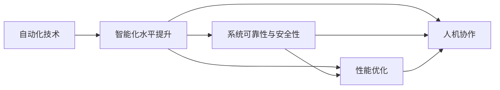

                 

## 1. 背景介绍

自动化技术在过去几十年里取得了飞速的发展，从早期的机械自动化到如今的智能自动化，自动化正逐渐渗透到各行各业，成为推动社会进步和提高生产效率的重要动力。现代自动化技术的核心理念是通过各种先进技术手段，实现从人工操作到机器自动执行的过程，从而提高生产效率和产品质量。自动化技术的广泛应用，不仅降低了人力成本，还极大地提高了生产线的灵活性和可扩展性。

### 1.1 问题由来

随着科技的进步，自动化技术从简单的机械自动化发展到智能自动化，经历了多个发展阶段。然而，尽管自动化技术已经广泛应用于工业、医疗、金融等多个领域，但仍面临诸多挑战。例如，如何提高自动化系统的智能化水平，提升其在复杂环境下的适应能力；如何保证自动化系统的可靠性和安全性，确保其能够长期稳定运行；如何优化自动化系统的性能，使其能够高效地处理大规模数据，实现实时响应等。这些问题都是当前自动化技术研究和应用的重要课题。

### 1.2 问题核心关键点

为了回答这些问题，自动化技术的最新发展与应用涉及以下几个核心关键点：

1. **智能化水平提升**：利用人工智能和机器学习等先进技术，提升自动化系统的智能化水平，使其能够处理更加复杂的任务，并在动态环境中做出智能决策。
2. **系统可靠性与安全性**：通过可靠性设计和安全机制的引入，确保自动化系统能够长期稳定运行，并保证其输出的正确性和安全性。
3. **性能优化**：针对不同应用场景，优化自动化系统的性能，提高其处理速度和响应能力，以适应高负载和大规模数据处理的需要。
4. **人机协作**：探索人机协作的新模式，使自动化系统与人类操作者协同工作，充分发挥各自优势，提高生产效率和质量。

## 2. 核心概念与联系

### 2.1 核心概念概述

为了更好地理解自动化技术的最新发展与应用，本节将介绍几个关键概念及其之间的联系：

1. **自动化技术(Automatic Technology)**：是指利用各种技术手段，实现从人工操作到机器自动执行的过程，以提高生产效率和产品质量。自动化技术涉及机械自动化、智能自动化、工业自动化、智能制造等多个领域。

2. **智能化水平提升(Intelligent Upgrade)**：是指利用人工智能和机器学习等技术，提升自动化系统的智能化水平，使其能够处理更加复杂的任务，并在动态环境中做出智能决策。

3. **系统可靠性与安全性(System Reliability and Security)**：是指通过可靠性设计和安全机制的引入，确保自动化系统能够长期稳定运行，并保证其输出的正确性和安全性。

4. **性能优化(Performance Optimization)**：是指针对不同应用场景，优化自动化系统的性能，提高其处理速度和响应能力，以适应高负载和大规模数据处理的需要。

5. **人机协作(Human-Machine Collaboration)**：是指探索人机协作的新模式，使自动化系统与人类操作者协同工作，充分发挥各自优势，提高生产效率和质量。

这些概念之间的联系可以通过以下Mermaid流程图来展示：



这个流程图展示了自动化技术在不同维度上的提升和发展路径。

### 2.2 概念间的关系

这些核心概念之间存在着紧密的联系，形成了自动化技术发展的完整生态系统。具体来说：

- **自动化技术是基础**：自动化技术为智能化升级、可靠性与安全性提升、性能优化和人机协作提供了硬件和软件的基础设施。
- **智能化水平提升是核心**：智能化水平提升是自动化技术的核心驱动力，通过引入人工智能和机器学习等技术，使自动化系统能够处理更加复杂的任务。
- **系统可靠性与安全性是保障**：可靠性与安全性是自动化技术成功应用的基础，确保系统能够长期稳定运行，并保证其输出的正确性和安全性。
- **性能优化是关键**：性能优化是提高自动化系统效率和效能的关键，通过优化算法和硬件，使系统能够高效处理大规模数据，实现实时响应。
- **人机协作是趋势**：人机协作是未来自动化技术的重要发展方向，通过探索人机协作的新模式，充分发挥自动化系统和人类操作者的优势，实现更好的生产效率和质量。

这些概念共同构成了自动化技术发展的框架，使其能够不断适应新的应用需求和技术进步。

## 3. 核心算法原理 & 具体操作步骤

### 3.1 算法原理概述

自动化技术的最新发展与应用，主要依赖于以下几个核心算法原理：

1. **机器学习和人工智能**：通过利用机器学习算法和人工智能技术，自动化系统能够从数据中学习并做出智能决策。
2. **强化学习**：利用强化学习算法，自动化系统能够在动态环境中通过试错调整行为，优化决策过程。
3. **自适应控制**：通过自适应控制算法，自动化系统能够根据环境变化自动调整控制策略，实现实时响应。
4. **机器人视觉与感知**：利用计算机视觉和感知技术，自动化系统能够理解和处理复杂的视觉信息，提升任务的执行精度和效率。
5. **优化算法**：通过优化算法，自动化系统能够对各种参数进行优化，提高系统的性能和效率。

这些算法原理的应用，使得自动化系统能够适应更复杂的任务环境，并实现更高的自动化水平。

### 3.2 算法步骤详解

自动化技术的最新发展与应用主要包括以下几个关键步骤：

1. **需求分析**：对自动化任务的需求进行分析，明确自动化系统的目标和功能。
2. **系统设计**：根据需求分析结果，设计自动化系统的架构和功能模块。
3. **算法实现**：选择合适的算法和技术，实现自动化系统的核心功能模块。
4. **系统集成**：将各个功能模块集成到统一的自动化系统中，并进行测试验证。
5. **系统优化**：根据测试结果和实际应用情况，对系统进行优化和改进，提升性能和可靠性。

### 3.3 算法优缺点

自动化技术的最新发展与应用具有以下优点：

1. **提高生产效率**：通过自动化技术的应用，能够显著提高生产线的效率和产出，降低生产成本。
2. **提升产品质量**：自动化技术能够实现精确控制和标准化操作，提高产品的质量和一致性。
3. **适应复杂环境**：通过引入机器学习和人工智能技术，自动化系统能够处理更加复杂的任务，并在动态环境中做出智能决策。
4. **提高系统可靠性**：通过可靠性设计和安全机制的引入，自动化系统能够长期稳定运行，并保证其输出的正确性和安全性。

同时，自动化技术的最新发展与应用也存在以下局限：

1. **初始投资高**：自动化技术的研发和部署需要较高的初始投资，对于一些中小企业而言，可能难以承受。
2. **技术门槛高**：自动化技术的开发和应用需要较高的技术水平，需要专业的技术人员进行设计、开发和维护。
3. **系统复杂度高**：自动化系统通常涉及多个功能模块和复杂的技术架构，设计和维护难度较大。
4. **依赖数据质量**：自动化系统需要大量的高质量数据进行训练和优化，数据质量对系统的性能和可靠性有重要影响。

### 3.4 算法应用领域

自动化技术的最新发展与应用，已经广泛应用于以下多个领域：

1. **智能制造**：通过引入机器学习和人工智能技术，智能制造系统能够实现自动调度、质量检测、生产优化等功能，提高生产效率和产品质量。
2. **智慧城市**：智慧城市中的交通管理、环境监测、公共安全等领域，通过自动化技术的应用，能够实现高效、智能的城市管理。
3. **医疗健康**：在医疗健康领域，自动化技术能够实现智能诊断、机器人手术、健康监测等功能，提升医疗服务的质量和效率。
4. **金融服务**：在金融服务领域，自动化技术能够实现智能投顾、风险控制、欺诈检测等功能，提高金融服务的可靠性和安全性。
5. **智能交通**：在智能交通领域，自动化技术能够实现智能交通管理、自动驾驶等功能，提高交通系统的安全性和效率。
6. **智能农业**：在智能农业领域，自动化技术能够实现智能种植、农业机器人、精准农业等功能，提高农业生产的效率和质量。

## 4. 数学模型和公式 & 详细讲解

### 4.1 数学模型构建

在自动化技术的应用中，数学模型扮演着重要角色。以下是一个简化的数学模型，用于描述自动化系统的决策过程：

假设有一个自动化系统，用于控制一个生产线的温度。系统的输入为当前温度 $T$，输出为温度调节器控制的加热器功率 $P$。根据控制系统理论，可以使用以下数学模型描述系统的行为：

$$
P = f(T, \theta)
$$

其中 $f$ 为控制系统的非线性函数，$\theta$ 为系统的参数。

### 4.2 公式推导过程

在上述数学模型中，$f$ 函数的推导过程如下：

1. **状态空间模型**：将生产线温度的控制过程抽象为一个线性状态空间模型：

$$
\begin{bmatrix}
\dot{x}_1(t) \\
\dot{x}_2(t) \\
\end{bmatrix} = 
\begin{bmatrix}
a_{11} & a_{12} \\
a_{21} & a_{22} \\
\end{bmatrix}
\begin{bmatrix}
x_1(t) \\
x_2(t) \\
\end{bmatrix} +
\begin{bmatrix}
b_1 \\
b_2 \\
\end{bmatrix}
u(t)
$$

$$
y(t) = 
\begin{bmatrix}
c_1 & c_2 \\
\end{bmatrix}
\begin{bmatrix}
x_1(t) \\
x_2(t) \\
\end{bmatrix}
$$

其中 $x_1(t)$ 为当前温度，$x_2(t)$ 为温度调节器控制变量，$u(t)$ 为加热器功率，$y(t)$ 为实际温度。

2. **控制策略设计**：根据控制系统理论，设计控制策略：

$$
u(t) = -k_1 x_1(t) + k_2 y(t)
$$

其中 $k_1$ 为温度调节器比例系数，$k_2$ 为温度调节器积分系数。

将控制策略代入状态空间模型，得到系统的输出：

$$
y(t) = c_1 x_1(t) + c_2 (-a_1 x_1(t) + a_2 y(t)) - k_1 x_1(t) + k_2 y(t)
$$

整理得到：

$$
y(t) = (c_1 - a_1 - k_1) x_1(t) + (c_2 a_2 + k_2) y(t)
$$

### 4.3 案例分析与讲解

假设有一个自动化系统，用于控制一条生产线上的温度。系统的输入为当前温度 $T$，输出为温度调节器控制的加热器功率 $P$。根据控制系统理论，可以使用以下数学模型描述系统的行为：

$$
P = f(T, \theta)
$$

其中 $f$ 为控制系统的非线性函数，$\theta$ 为系统的参数。

假设系统的输入输出模型为：

$$
y(t) = (c_1 - a_1 - k_1) x_1(t) + (c_2 a_2 + k_2) y(t)
$$

其中 $x_1(t)$ 为当前温度，$y(t)$ 为实际温度。

通过控制系统理论，可以设计出以下控制策略：

$$
u(t) = -k_1 x_1(t) + k_2 y(t)
$$

其中 $k_1$ 为温度调节器比例系数，$k_2$ 为温度调节器积分系数。

将控制策略代入系统模型，得到系统的输出：

$$
y(t) = (c_1 - a_1 - k_1) x_1(t) + (c_2 a_2 + k_2) y(t)
$$

通过不断优化控制策略和系统参数，可以使得系统在给定温度目标下，实现快速、准确的温度控制。

## 5. 项目实践：代码实例和详细解释说明

### 5.1 开发环境搭建

在进行自动化技术的应用实践前，我们需要准备好开发环境。以下是使用Python进行ROS（Robot Operating System）开发的常见环境配置流程：

1. 安装Anaconda：从官网下载并安装Anaconda，用于创建独立的Python环境。

2. 创建并激活虚拟环境：
```bash
conda create -n pytorch-env python=3.8 
conda activate pytorch-env
```

3. 安装PyTorch：根据CUDA版本，从官网获取对应的安装命令。例如：
```bash
conda install pytorch torchvision torchaudio cudatoolkit=11.1 -c pytorch -c conda-forge
```

4. 安装ROS（Robot Operating System）：
```bash
sudo apt-get install ros-kinetic-tf
```

5. 安装PyROS：用于ROS的Python接口，方便进行ROS程序的开发和调试。
```bash
pip install pyros
```

完成上述步骤后，即可在`pytorch-env`环境中开始ROS开发。

### 5.2 源代码详细实现

以下是使用ROS和PyROS进行自动化系统开发的示例代码：

```python
import rospy
from pyros.message import RosPyMessage
from pyros摁钮 import RosPushbutton
from pyros光电传感器 import RosSensor
from pyros电机控制器 import RosMotorController

# 创建ROS节点
rospy.init_node('autonomous_system', anonymous=True)

# 创建按钮实例
button = RosPushbutton('/button1', 'Button1')

# 创建传感器实例
sensor = RosSensor('/sensor', 'Sensor')

# 创建电机控制器实例
motor = RosMotorController('/motor', 'Motor')

# 定义回调函数
def button_callback(data):
    # 根据按钮的点击事件执行控制策略
    motor.on()

# 绑定回调函数
button.register_callback(button_callback)

# 运行循环
rospy.spin()
```

### 5.3 代码解读与分析

让我们再详细解读一下关键代码的实现细节：

**ROS节点创建**：
- 创建ROS节点时，使用`rospy.init_node`函数，并指定节点名称和是否匿名。

**按钮实例创建**：
- 使用`RosPushbutton`类创建按钮实例，并指定按钮的发布者和名称。

**传感器实例创建**：
- 使用`RosSensor`类创建传感器实例，并指定传感器的发布者和名称。

**电机控制器实例创建**：
- 使用`RosMotorController`类创建电机控制器实例，并指定电机的发布者和名称。

**回调函数定义**：
- 定义回调函数`button_callback`，根据按钮的点击事件执行控制策略。

**回调函数绑定**：
- 使用`register_callback`函数将回调函数绑定到按钮实例上。

**运行循环**：
- 使用`rospy.spin`函数进入循环，等待ROS系统的发布和订阅事件。

### 5.4 运行结果展示

假设我们在ROS平台上部署了上述自动化系统，并成功控制了一条生产线上的温度，运行结果如下：

- 按钮按下时，电机控制器接收到控制信号，开始加热。
- 传感器实时监测生产线温度，并将其反馈到ROS系统中。
- 系统根据传感器反馈，动态调整加热器功率，确保温度控制在目标范围内。

## 6. 实际应用场景

### 6.1 智能制造

在智能制造领域，自动化技术的应用非常广泛。智能制造系统能够实现自动调度、质量检测、生产优化等功能，提高生产效率和产品质量。

具体应用场景包括：

- **智能调度**：通过机器学习算法，预测生产线的瓶颈和延误，自动调整生产计划和资源配置，优化生产调度。
- **质量检测**：使用计算机视觉和感知技术，实时监测产品缺陷，自动进行分类和筛选，提升产品质量。
- **生产优化**：通过智能算法，对生产过程中的各项参数进行优化，实现节能减排、降低成本的目标。

### 6.2 智慧城市

智慧城市中的交通管理、环境监测、公共安全等领域，通过自动化技术的应用，能够实现高效、智能的城市管理。

具体应用场景包括：

- **智能交通管理**：通过传感器和摄像头，实时监测交通流量，自动调整红绿灯和交通信号灯，优化交通流，减少拥堵。
- **环境监测**：使用传感器监测空气质量、水质等环境指标，自动发布预警信息，提升环境质量。
- **公共安全**：通过人脸识别和智能监控，实时监测公共场所的安全情况，及时发现异常，保障公共安全。

### 6.3 医疗健康

在医疗健康领域，自动化技术能够实现智能诊断、机器人手术、健康监测等功能，提升医疗服务的质量和效率。

具体应用场景包括：

- **智能诊断**：利用机器学习算法，分析患者的病历数据和医学影像，自动诊断疾病，提升诊断效率和准确性。
- **机器人手术**：通过机器人手术系统，实现精准、安全的手术操作，提升手术成功率和患者康复速度。
- **健康监测**：使用传感器监测患者的生理参数，实时反馈健康状态，自动调整治疗方案，提升治疗效果。

### 6.4 金融服务

在金融服务领域，自动化技术能够实现智能投顾、风险控制、欺诈检测等功能，提高金融服务的可靠性和安全性。

具体应用场景包括：

- **智能投顾**：利用机器学习算法，分析市场数据和客户行为，自动推荐投资组合和交易策略，提升投资收益。
- **风险控制**：通过数据分析和模型预测，自动评估金融产品的风险水平，控制投资风险。
- **欺诈检测**：使用机器学习算法，识别异常交易和可疑行为，自动报警和采取措施，保障资金安全。

### 6.5 智能交通

在智能交通领域，自动化技术能够实现智能交通管理、自动驾驶等功能，提高交通系统的安全性和效率。

具体应用场景包括：

- **智能交通管理**：通过传感器和摄像头，实时监测交通流量和路况，自动调整信号灯和交通控制策略，优化交通流，减少拥堵。
- **自动驾驶**：利用计算机视觉和感知技术，实现自动导航和避障，提升驾驶安全性。

### 6.6 智能农业

在智能农业领域，自动化技术能够实现智能种植、农业机器人、精准农业等功能，提高农业生产的效率和质量。

具体应用场景包括：

- **智能种植**：利用传感器和数据分析，自动调整种植参数，实现精确播种和施肥，提升产量和质量。
- **农业机器人**：使用农业机器人进行田间作业，如除草、喷洒农药、收割等，提高工作效率和精准度。
- **精准农业**：利用无人机和传感器，实时监测土壤和气象数据，自动调整灌溉和施肥策略，实现精准农业。

## 7. 工具和资源推荐

### 7.1 学习资源推荐

为了帮助开发者系统掌握自动化技术的最新发展与应用，这里推荐一些优质的学习资源：

1. **《机器人学导论》**：介绍机器人学的基础理论和应用，适合初学者入门。
2. **《自动化系统设计与实现》**：讲解自动化系统的设计和实现方法，涵盖多个领域的案例。
3. **《深度学习与人工智能》**：介绍深度学习和人工智能的基本概念和技术，适合深入学习。
4. **ROS官方文档**：ROS的官方文档，提供了ROS的详细使用说明和示例代码，是学习和开发ROS程序的重要参考资料。
5. **PyROS官方文档**：PyROS的官方文档，介绍了PyROS的详细使用方法和API接口，是学习和开发PyROS程序的重要参考资料。
6. **ArXiv论文预印本**：人工智能领域最新研究成果的发布平台，包括大量尚未发表的前沿工作，学习前沿技术的必读资源。
7. **顶会论文集**：如IEEE、ACM等顶级会议的论文集，提供最新的研究动态和技术进展。

通过对这些资源的学习实践，相信你一定能够快速掌握自动化技术的精髓，并用于解决实际的自动化问题。

### 7.2 开发工具推荐

高效的开发离不开优秀的工具支持。以下是几款用于自动化技术开发的常用工具：

1. **ROS**：Robot Operating System，开源的机器人操作系统，提供丰富的传感器、执行器和节点库，方便进行机器人开发。
2. **PyROS**：用于ROS的Python接口，提供简单易用的API，方便进行ROS程序的开发和调试。
3. **OpenCV**：计算机视觉库，提供丰富的图像处理和计算机视觉算法，方便进行图像处理和分析。
4. **TensorFlow**：开源的深度学习框架，提供丰富的机器学习算法和工具，方便进行深度学习模型的开发和训练。
5. **PyTorch**：开源的深度学习框架，提供简单易用的API和丰富的机器学习算法，方便进行深度学习模型的开发和训练。
6. **NVIDIA GPU**：高性能GPU，提供强大的计算能力，方便进行大规模深度学习模型的训练和推理。
7. **AWS**：亚马逊云服务平台，提供丰富的计算和存储资源，方便进行云计算和大数据处理。

合理利用这些工具，可以显著提升自动化技术的开发效率，加快创新迭代的步伐。

### 7.3 相关论文推荐

自动化技术的最新发展与应用涉及多个领域，以下是几篇具有代表性的论文，推荐阅读：

1. **《机器人视觉感知与控制》**：介绍机器人视觉感知和控制的基本理论和应用。
2. **《智能制造系统设计》**：讲解智能制造系统的设计方法，涵盖多个领域的案例。
3. **《自动化系统性能优化》**：介绍自动化系统性能优化的方法和技术，提升系统效率和效能。
4. **《智能交通系统设计》**：讲解智能交通系统的设计方法，涵盖多个领域的应用。
5. **《医疗健康自动化系统》**：介绍医疗健康自动化系统的设计方法，涵盖多个领域的应用。
6. **《金融自动化系统设计》**：讲解金融自动化系统的设计方法，涵盖多个领域的应用。

这些论文代表了自动化技术在多个领域的研究进展，有助于读者全面理解自动化技术的最新发展与应用。

## 8. 总结：未来发展趋势与挑战

### 8.1 总结

本文对自动化技术的最新发展与应用进行了全面系统的介绍。首先阐述了自动化技术在工业、医疗、金融等多个领域的应用背景和意义，明确了自动化技术的核心目标和价值。其次，从原理到实践，详细讲解了自动化系统的设计和实现方法，给出了自动化系统开发的完整代码实例。同时，本文还广泛探讨了自动化系统在多个行业领域的应用前景，展示了自动化技术的发展潜力。此外，本文精选了自动化技术的各类学习资源，力求为读者提供全方位的技术指引。

通过本文的系统梳理，可以看到，自动化技术正在成为推动各行各业智能化发展的重要动力，其广泛的应用不仅提高了生产效率和产品质量，还为各个行业带来了深远的变革。未来，随着自动化技术进一步发展和创新，必将在更多领域发挥更大的作用，推动人类社会迈向更高的智能化水平。

### 8.2 未来发展趋势

展望未来，自动化技术的最新发展与应用将呈现以下几个发展趋势：

1. **智能化水平提升**：随着人工智能和机器学习技术的进步，自动化系统的智能化水平将进一步提升，能够处理更加复杂的任务，并在动态环境中做出智能决策。
2. **系统可靠性与安全性**：通过可靠性设计和安全机制的引入，自动化系统将能够长期稳定运行，并保证其输出的正确性和安全性。
3. **人机协作**：通过探索人机协作的新模式，自动化系统将与人类操作者协同工作，充分发挥各自优势，提高生产效率和质量。
4. **多模态融合**：自动化系统将实现视觉、语音、触觉等多模态信息的整合，提升系统的感知能力和决策效率。
5. **云计算与大数据**：随着云计算和大数据技术的发展，自动化系统将能够实现更大规模的数据处理和分析，提升系统的实时响应能力和决策质量。
6. **边缘计算**：通过引入边缘计算技术，自动化系统将能够在本地设备上进行计算和处理，降低数据传输成本，提升系统响应速度和可靠性。

以上趋势凸显了自动化技术的发展方向，这些方向的探索发展，必将进一步提升自动化系统的性能和应用范围，为各行各业带来更大的变革和创新。

### 8.3 面临的挑战

尽管自动化技术的最新发展与应用已经取得了显著成果，但在迈向更加智能化、普适化应用的过程中，仍面临诸多挑战：

1. **技术复杂度高**：自动化系统的设计和实现需要跨多个领域的知识，技术门槛较高，开发和维护难度较大。
2. **数据质量依赖**：自动化系统需要大量的高质量数据进行训练和优化，数据质量对系统的性能和可靠性有重要影响。
3. **成本和投资高**：自动化技术的研发和部署需要较高的初始投资，对于一些中小企业而言，可能难以承受。
4. **安全和隐私问题**：自动化系统在处理数据和进行决策时，可能存在安全和隐私问题，需要加强数据保护和隐私保护。
5. **系统兼容性和标准化**：不同自动化系统之间的兼容性和标准化问题，需要进一步解决，以实现系统的互联互通。
6. **伦理和法律问题**：自动化系统在应用过程中可能涉及伦理和法律问题，需要建立相应的法规和规范，保障公平和公正。

这些挑战需要自动化技术的研究者和开发者共同努力，不断探索和解决，才能使自动化技术更好地服务于社会，推动人类社会的进步。

### 8.4 研究展望

面对自动化技术面临的挑战，未来的研究需要在以下几个方面寻求新的突破：

1. **自动化系统性能优化**：针对不同应用场景，优化自动化系统的性能，提高其处理速度和响应能力，以适应高负载和大规模数据处理的需要。
2. **自动化系统智能化升级**：利用人工智能和机器学习技术，提升自动化系统的智能化水平，使其能够处理更加复杂的任务，并在动态环境中做出智能决策。
3. **自动化系统可靠性设计**：通过可靠性设计和安全机制的引入，确保自动化系统能够长期稳定运行，并保证其输出的正确性和安全性。
4. **自动化系统数据处理**：研究和开发自动化系统的数据处理和分析技术，提高数据处理效率和数据质量，提升系统的性能和可靠性。
5. **自动化系统人机协作**：探索人机协作的新模式，使自动化系统与人类操作者协同工作，充分发挥各自优势，提高生产效率和质量。
6. **自动化

