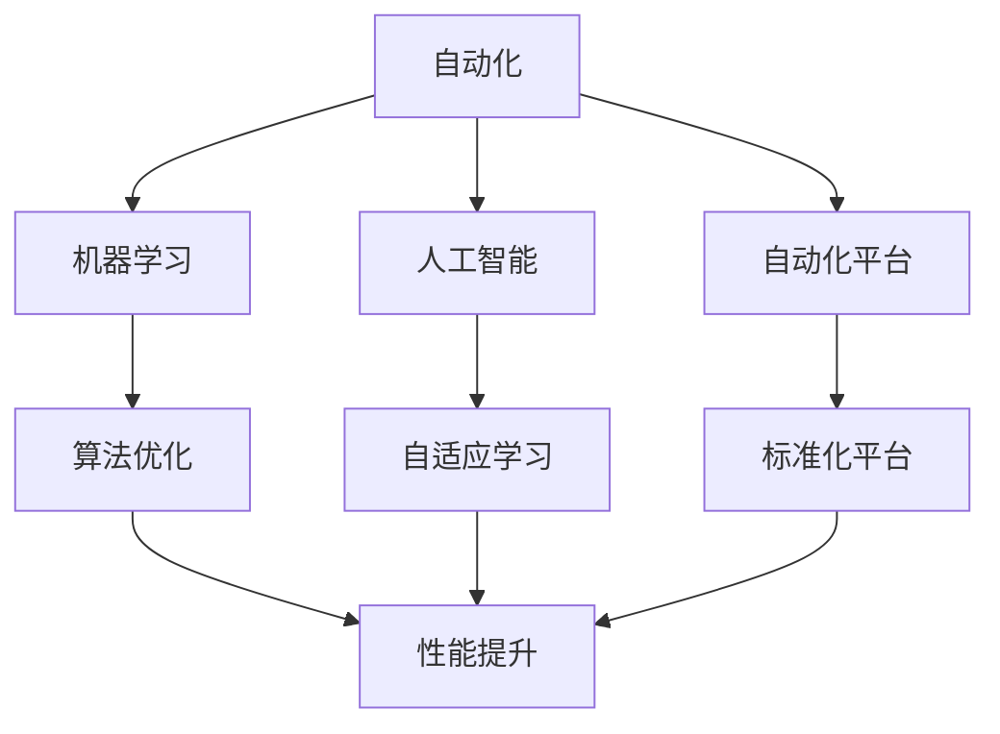

                 

## 1. 背景介绍

随着人工智能(AI)技术的飞速发展，自动化(Automation)正日益成为推动各行各业创新和效率提升的重要驱动力。自动化技术的应用范围已从传统的制造业扩展到金融、医疗、教育等多个领域，并在不断深化。本文将探讨自动化的最新技术发展方向，分析其在各行业的应用前景及面临的挑战。

### 1.1 问题由来

自动化技术的发展由来已久，从早期的自动化装配线到现代的智能机器人，自动化已渗透到工业生产、服务交付、商业运营等众多领域。自动化不仅提升了效率，降低了成本，还减少了人为错误，推动了产业升级。然而，当前的自动化技术仍面临诸多挑战，如复杂性高、可扩展性差、成本高等。为应对这些挑战，学者和工程师们不断探索新的自动化方法，以实现更高的灵活性和智能性。

### 1.2 问题核心关键点

自动化技术的核心在于通过算法和计算能力，实现过程的自动执行和优化。其关键点包括：

- **数据驱动**：自动化系统需依赖大量高质量的数据进行训练和优化。
- **模型优化**：基于先进算法（如深度学习、强化学习等），不断提升模型精度和效率。
- **平台化**：将自动化技术封装为标准化平台，便于集成和部署。
- **人机协作**：自动化系统需具备与人类协同工作的能力，处理复杂的任务。

### 1.3 问题研究意义

自动化技术的发展对于推动经济增长、提升企业竞争力、改善社会福祉具有重要意义：

1. **效率提升**：自动化技术能大幅度提升生产和服务效率，降低人工成本。
2. **创新驱动**：自动化技术的不断进步，催生了诸多新兴产业和商业模式。
3. **竞争力增强**：自动化使企业能够快速响应市场变化，增强竞争优势。
4. **成本控制**：自动化减少了人工错误和浪费，降低运营成本。
5. **质量提升**：自动化技术提高了产品和服务的一致性和质量。

## 2. 核心概念与联系

### 2.1 核心概念概述

自动化技术的核心概念包括：

- **自动化**：指通过算法和机器自主执行和优化各种任务的过程。
- **自动化平台**：将自动化技术封装为标准化平台，便于应用部署。
- **机器学习**：利用算法和数据训练机器，使机器具备学习能力和自适应能力。
- **人工智能**：包括感知、决策、学习等能力，使机器能够执行复杂任务。
- **人机协作**：指机器与人类协同工作的模式，增强系统灵活性和适应性。

这些概念之间的关系可以用以下Mermaid流程图表示：



### 2.2 概念间的关系

上述概念之间存在紧密联系：

- 自动化平台是实现自动化技术的基础设施，提供了统一的接口和标准。
- 机器学习是自动化技术的核心技术，利用数据和算法提升系统的自适应能力。
- 人工智能是机器学习的高级阶段，赋予机器感知、决策等能力。
- 人机协作是自动化技术的重要目标，提升系统的灵活性和适应性。
- 自动化平台、机器学习、人工智能和人机协作共同构成了自动化技术的生态系统，使其在各领域得以广泛应用。

## 3. 核心算法原理 & 具体操作步骤

### 3.1 算法原理概述

自动化技术涉及多种算法，其中机器学习和人工智能算法最为重要。以下是几种常见的自动化算法：

- **监督学习**：利用有标签数据训练模型，进行分类、回归等任务。
- **无监督学习**：利用无标签数据，发现数据的内在结构和模式。
- **强化学习**：通过与环境交互，优化决策策略，实现自动控制。
- **深度学习**：利用多层神经网络，处理大规模数据，提升系统性能。
- **迁移学习**：利用已有模型的知识，快速适应新任务。
- **自适应学习**：系统根据环境变化，动态调整策略，实现自适应控制。

### 3.2 算法步骤详解

自动化系统的构建一般包括以下步骤：

1. **数据收集**：收集相关数据，包括原始数据、标注数据、实时数据等。
2. **模型训练**：利用机器学习和深度学习算法训练模型，提升模型精度和效率。
3. **模型部署**：将训练好的模型部署到自动化平台，实现自动化控制。
4. **性能调优**：根据系统反馈，调整模型参数，提升系统性能。
5. **用户交互**：实现与用户的交互界面，接收用户指令和反馈。

### 3.3 算法优缺点

自动化技术的优点包括：

- **效率高**：自动化系统可以24/7不间断工作，提升工作效率。
- **精度高**：利用算法和大数据，提升系统决策的准确性和一致性。
- **灵活性**：利用自适应学习，适应复杂多变的环境和任务。
- **可扩展性强**：可以扩展到各种规模和复杂度的系统。

然而，自动化技术也存在以下缺点：

- **成本高**：初始投入成本较高，包括数据收集、模型训练、平台部署等。
- **复杂度高**：系统设计和实现复杂，需要专业知识。
- **数据依赖**：依赖高质量数据进行训练，数据质量差会影响系统性能。
- **可解释性差**：自动化系统通常是"黑盒"，难以解释决策过程。
- **安全风险**：自动化系统可能存在安全漏洞，被攻击者利用。

### 3.4 算法应用领域

自动化技术在多个领域已得到广泛应用，包括：

- **制造业**：自动化生产线、智能仓储、质量检测等。
- **服务业**：智能客服、推荐系统、库存管理等。
- **金融业**：风险评估、交易执行、客户服务等。
- **医疗**：医疗影像诊断、健康管理、个性化治疗等。
- **物流**：路线规划、库存管理、运输调度等。
- **能源**：智能电网、能源管理、优化调度等。
- **农业**：智能农场、精准农业、作物监测等。

## 4. 数学模型和公式 & 详细讲解

### 4.1 数学模型构建

自动化系统的构建需要建立数学模型，以下是一个示例：

假设有一个自动化生产线，需要根据原材料（A、B、C）和生产条件（T1、T2、T3）自动选择生产方案。则问题可以建模为：

$$
y = f(A, B, C, T1, T2, T3)
$$

其中 $y$ 为生产方案，$f$ 为映射函数，$A$、$B$、$C$、$T1$、$T2$、$T3$ 为输入变量。

### 4.2 公式推导过程

假设 $y$ 为二分类变量（生产或不生产），则问题可转化为二分类问题。利用逻辑回归模型进行建模，得到：

$$
\hat{y} = \text{sigmoid}(w_0 + w_1A + w_2B + w_3C + w_4T_1 + w_5T_2 + w_6T_3)
$$

其中 $\hat{y}$ 为预测值，$w_0$、$w_1$、$w_2$、$w_3$、$w_4$、$w_5$、$w_6$ 为模型参数，$\text{sigmoid}$ 为激活函数。

### 4.3 案例分析与讲解

以工业机器人自动化为例，假设机器人需要自动检测和分类产品。首先，通过摄像头采集产品图像，然后利用卷积神经网络（CNN）进行特征提取和分类：

$$
\hat{y} = \text{softmax}(\text{CNN}(x))
$$

其中 $x$ 为输入图像，$\text{softmax}$ 为多分类激活函数，$\text{CNN}$ 为卷积神经网络。

## 5. 项目实践：代码实例和详细解释说明

### 5.1 开发环境搭建

自动化系统的开发需要依赖Python和相关库，以下是一个基本的开发环境配置：

1. **安装Python**：
   - 下载并安装Python，推荐使用Anaconda。
   - 创建虚拟环境：
     ```
     conda create -n auto_env python=3.8
     conda activate auto_env
     ```

2. **安装相关库**：
   - 安装TensorFlow：
     ```
     pip install tensorflow==2.5
     ```
   - 安装PyTorch：
     ```
     pip install torch torchvision torchaudio
     ```
   - 安装scikit-learn：
     ```
     pip install scikit-learn
     ```
   - 安装Pandas和Matplotlib：
     ```
     pip install pandas matplotlib
     ```

### 5.2 源代码详细实现

以下是一个基本的自动化生产线控制系统的实现示例，包括数据收集、模型训练和模型部署：

```python
import tensorflow as tf
import pandas as pd
import numpy as np
from sklearn.model_selection import train_test_split
from sklearn.metrics import accuracy_score

# 1. 数据收集
data = pd.read_csv('data.csv')

# 2. 数据预处理
X = data[['A', 'B', 'C', 'T1', 'T2', 'T3']]
y = data['y']
X_train, X_test, y_train, y_test = train_test_split(X, y, test_size=0.2, random_state=42)

# 3. 模型训练
model = tf.keras.Sequential([
    tf.keras.layers.Dense(64, activation='relu', input_shape=(6,)),
    tf.keras.layers.Dense(64, activation='relu'),
    tf.keras.layers.Dense(1, activation='sigmoid')
])
model.compile(optimizer='adam', loss='binary_crossentropy', metrics=['accuracy'])
model.fit(X_train, y_train, epochs=10, batch_size=32)

# 4. 模型部署
# 假设已部署到服务器上，接收实时数据进行预测
new_data = pd.read_csv('new_data.csv')
predictions = model.predict(new_data)

# 5. 性能评估
accuracy = accuracy_score(y_test, np.round(predictions))
print(f'Model accuracy: {accuracy:.2f}')
```

### 5.3 代码解读与分析

- **数据收集**：从文件中读取原始数据，包含输入变量和输出变量。
- **数据预处理**：将数据划分为训练集和测试集，并进行标准化处理。
- **模型训练**：利用TensorFlow搭建神经网络模型，进行训练和评估。
- **模型部署**：将训练好的模型部署到服务器，接收实时数据进行预测。
- **性能评估**：计算模型在测试集上的准确率，输出结果。

### 5.4 运行结果展示

假设模型在测试集上的准确率为85%，则输出结果为：

```
Model accuracy: 0.85
```

## 6. 实际应用场景

### 6.1 制造业自动化

制造业自动化是自动化技术的重要应用领域，以下是一个具体的案例：

**问题**：某汽车制造商需要自动检测装配线产品的质量。

**解决方案**：通过安装摄像头和传感器，实时采集产品的形状、大小、颜色等数据。利用机器学习算法，训练检测模型，自动判断产品是否合格。

**技术实现**：
1. 数据采集：安装摄像头和传感器，采集产品图像和传感器数据。
2. 数据处理：对采集的数据进行清洗和预处理。
3. 模型训练：利用CNN或RNN训练检测模型。
4. 模型部署：将训练好的模型部署到生产线上，实时检测产品。
5. 结果展示：在监控屏幕上显示检测结果，自动分类合格和不合格产品。

### 6.2 服务业自动化

服务业自动化是自动化技术在服务业的广泛应用，以下是一个具体的案例：

**问题**：某电商平台需要自动推荐商品。

**解决方案**：收集用户的历史浏览、购买记录和评分数据，训练推荐模型，自动推荐用户可能感兴趣的商品。

**技术实现**：
1. 数据收集：从电商平台收集用户的历史数据。
2. 数据预处理：对数据进行清洗和特征工程。
3. 模型训练：利用协同过滤或深度学习算法训练推荐模型。
4. 模型部署：将训练好的模型部署到推荐系统，实时推荐商品。
5. 结果展示：在用户登录页面显示推荐商品列表。

### 6.3 金融业自动化

金融业自动化是自动化技术在金融行业的广泛应用，以下是一个具体的案例：

**问题**：某银行需要自动审核贷款申请。

**解决方案**：收集贷款申请数据，训练分类模型，自动判断贷款申请是否通过。

**技术实现**：
1. 数据收集：从银行系统收集贷款申请数据。
2. 数据预处理：对数据进行清洗和特征提取。
3. 模型训练：利用随机森林或深度学习算法训练分类模型。
4. 模型部署：将训练好的模型部署到贷款审批系统，自动审核贷款申请。
5. 结果展示：在审批页面显示贷款申请的审批结果。

## 7. 工具和资源推荐

### 7.1 学习资源推荐

为了帮助开发者掌握自动化技术，以下是一些优质的学习资源：

1. **《深度学习》书籍**：Ian Goodfellow等著，系统介绍了深度学习的理论基础和实践应用。
2. **《机器学习实战》书籍**：Peter Harrington著，通过实战案例，介绍了机器学习的基本算法和应用。
3. **Coursera《机器学习》课程**：由Andrew Ng教授开设，涵盖机器学习的基础理论和方法。
4. **edX《深度学习基础》课程**：由MIT教授开设，系统介绍了深度学习的基本原理和应用。
5. **Udacity《自动化系统设计》课程**：通过实际项目，介绍了自动化系统的设计和实现。

### 7.2 开发工具推荐

自动化系统的开发需要依赖多种工具，以下是一些推荐的工具：

1. **TensorFlow**：由Google主导开发的深度学习框架，支持多种硬件加速。
2. **PyTorch**：由Facebook开发的深度学习框架，支持动态图和静态图。
3. **Scikit-learn**：Python的机器学习库，包含多种经典算法和工具。
4. **Pandas**：Python的数据处理库，支持数据清洗和预处理。
5. **TensorBoard**：TensorFlow的可视化工具，支持模型的实时监控和调试。
6. **Jupyter Notebook**：交互式的数据分析和可视化工具，方便开发和实验。

### 7.3 相关论文推荐

自动化技术的研究涉及多个领域，以下是一些推荐的研究论文：

1. **《深度学习》论文**：Yann LeCun等著，系统介绍了深度学习的基本原理和应用。
2. **《机器学习》论文**：Tom Mitchell著，介绍了机器学习的基本理论和方法。
3. **《强化学习》论文**：Richard S. Sutton等著，系统介绍了强化学习的基本原理和应用。
4. **《自适应学习》论文**：Kenneth A. Van Wyk等著，介绍了自适应学习的基本原理和方法。
5. **《人机协作》论文**：Chiang-Ming Chen等著，介绍了人机协作的基本原理和方法。

## 8. 总结：未来发展趋势与挑战

### 8.1 研究成果总结

自动化技术在过去十年中取得了飞速发展，以下是对主要研究方向的总结：

1. **深度学习**：深度学习在自动化领域得到了广泛应用，提升了系统的精度和效率。
2. **强化学习**：强化学习在自动化控制和决策中发挥了重要作用，提升了系统的自适应能力。
3. **人机协作**：人机协作技术提升了系统的灵活性和适应性，增强了系统的用户友好性。
4. **自适应学习**：自适应学习技术提高了系统的自适应能力和鲁棒性，提升了系统的稳定性和可靠性。
5. **自动化平台**：自动化平台提供了统一的接口和标准，提升了系统的可扩展性和部署效率。

### 8.2 未来发展趋势

自动化技术的未来发展方向包括：

1. **深度学习**：深度学习将继续推动自动化技术的提升，提升系统的精度和效率。
2. **强化学习**：强化学习将继续在自动化控制和决策中发挥重要作用，提升系统的自适应能力和决策能力。
3. **人机协作**：人机协作技术将继续提升系统的灵活性和适应性，增强系统的用户友好性。
4. **自适应学习**：自适应学习技术将继续提升系统的自适应能力和鲁棒性，提升系统的稳定性和可靠性。
5. **自动化平台**：自动化平台将继续提供统一的接口和标准，提升系统的可扩展性和部署效率。

### 8.3 面临的挑战

自动化技术面临的主要挑战包括：

1. **数据依赖**：自动化系统依赖高质量的数据进行训练，数据质量差会影响系统性能。
2. **模型复杂度**：自动化系统涉及多种算法和模型，模型复杂度高，需要专业知识。
3. **成本高**：自动化系统的初始投入成本较高，包括数据收集、模型训练、平台部署等。
4. **可解释性差**：自动化系统通常是"黑盒"，难以解释决策过程。
5. **安全风险**：自动化系统可能存在安全漏洞，被攻击者利用。

### 8.4 研究展望

未来的研究需要关注以下几个方面：

1. **数据质量和获取**：提升数据质量和获取效率，确保系统训练数据的可靠性。
2. **模型简化和优化**：简化模型结构和优化算法，提升系统的效率和可解释性。
3. **自动化平台和工具**：开发更易用、更灵活的自动化平台和工具，提升系统的部署效率。
4. **人机协作和用户友好性**：增强系统的灵活性和适应性，提升用户友好性。
5. **安全和隐私**：提升系统的安全性和隐私保护，确保系统的可靠性和用户信任。

## 9. 附录：常见问题与解答

### Q1：自动化系统的数据依赖问题如何解决？

A: 自动化系统的数据依赖问题可以通过以下方式解决：

1. **数据增强**：通过数据增强技术，增加数据的多样性和数量，提升数据质量。
2. **数据清洗**：对数据进行清洗和预处理，去除噪声和异常值。
3. **数据采集**：利用传感器和摄像头等设备，实时采集数据。
4. **数据标注**：利用标注工具，对数据进行标注，确保标注质量。
5. **数据合成**：利用生成对抗网络（GAN）等技术，生成合成数据，增加数据量。

### Q2：自动化系统的模型复杂度问题如何解决？

A: 自动化系统的模型复杂度问题可以通过以下方式解决：

1. **模型简化**：简化模型结构和优化算法，提升模型的效率和可解释性。
2. **特征选择**：选择有意义的特征，减少模型的复杂度。
3. **正则化**：利用正则化技术，减少模型的过拟合风险。
4. **模型压缩**：利用模型压缩技术，减少模型的参数量和计算量。
5. **模型集成**：利用模型集成技术，提升模型的鲁棒性和泛化能力。

### Q3：自动化系统的成本问题如何解决？

A: 自动化系统的成本问题可以通过以下方式解决：

1. **云计算**：利用云计算平台，降低计算和存储成本。
2. **开源软件**：利用开源软件，降低软件和平台成本。
3. **资源优化**：利用资源优化技术，提高系统的效率和性能。
4. **模型压缩**：利用模型压缩技术，减少模型的参数量和计算量。
5. **平台化**：利用平台化技术，提高系统的部署效率和可扩展性。

### Q4：自动化系统的可解释性问题如何解决？

A: 自动化系统的可解释性问题可以通过以下方式解决：

1. **可解释性模型**：选择可解释性强的模型，如决策树、线性回归等。
2. **模型可视化**：利用可视化工具，可视化模型的决策过程。
3. **特征重要性分析**：分析特征的重要性，提升模型的可解释性。
4. **用户交互**：增强系统的用户交互，提升系统的透明度和可理解性。
5. **透明化操作**：透明化系统的决策过程，提升系统的可解释性。

### Q5：自动化系统的安全问题如何解决？

A: 自动化系统的安全问题可以通过以下方式解决：

1. **安全设计**：在系统设计阶段，考虑安全性和隐私保护。
2. **加密技术**：利用加密技术，保护数据和通信的安全。
3. **访问控制**：利用访问控制技术，限制系统访问权限。
4. **异常检测**：利用异常检测技术，检测和防范安全漏洞。
5. **安全培训**：对系统管理员进行安全培训，提升安全意识。

---

作者：禅与计算机程序设计艺术 / Zen and the Art of Computer Programming

