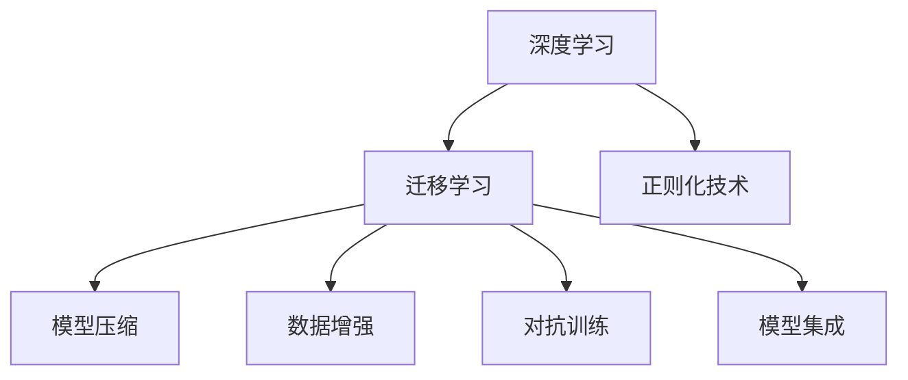
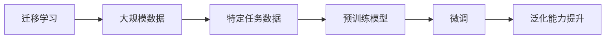
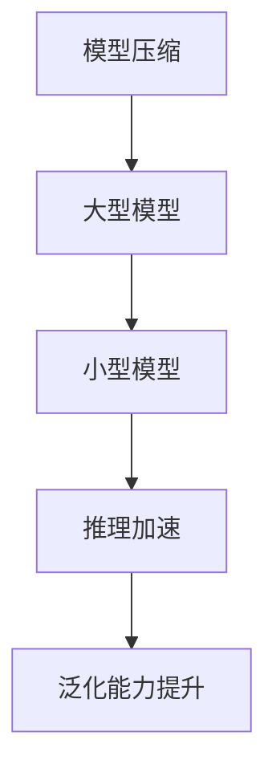
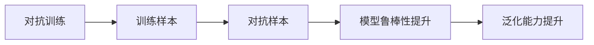
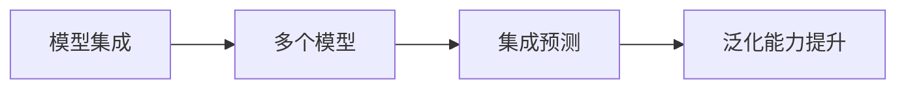
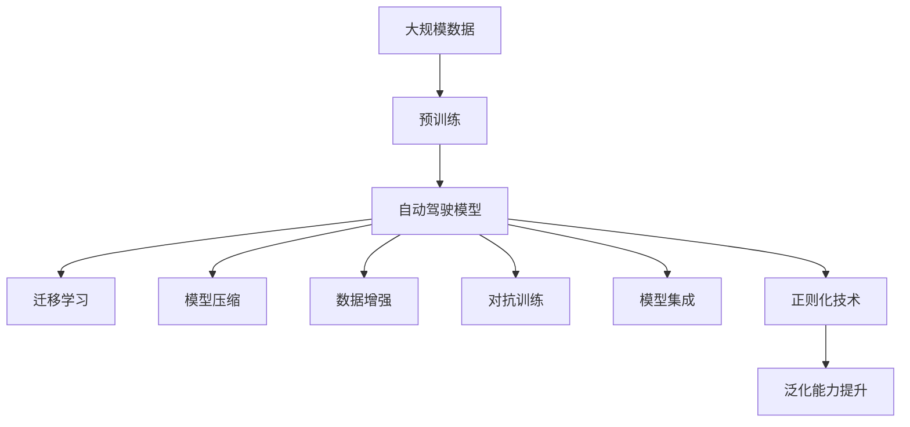

                 

# 自动驾驶中的深度学习模型泛化能力改进

> 关键词：自动驾驶,深度学习,泛化能力,迁移学习,模型压缩,数据增强,对抗训练,模型集成

## 1. 背景介绍

### 1.1 问题由来
随着深度学习技术在自动驾驶领域的逐步应用，深度学习模型在感知、决策、控制等环节扮演了越来越重要的角色。然而，深度学习模型的泛化能力——即在未见过的数据上表现良好的能力——始终是研究者关注的焦点。自动驾驶系统在复杂多变的路况下需要稳定可靠的决策支持，而模型的泛化能力直接影响到自动驾驶系统的安全性。

特别是对于现实世界中的小样本、噪声数据和复杂场景，深度学习模型的泛化能力面临着诸多挑战。小样本问题指的是在实际应用中，数据收集成本高昂，难以获取充足的标注数据。噪声数据则是指在自动驾驶场景下，传感器采集的数据可能存在噪声，从而影响模型的学习效果。复杂场景则包括极端天气、道路施工、交通拥堵等多样化的交通环境，这些场景下的数据对模型的泛化能力提出了更高的要求。

为了解决这些问题，提升深度学习模型在自动驾驶场景中的泛化能力，研究人员和工程团队积极探索了多种方法和技术。

### 1.2 问题核心关键点
针对自动驾驶中的深度学习模型泛化能力改进，主要集中在以下几个方面：

1. **迁移学习（Transfer Learning）**：将在大规模数据上预训练的模型迁移到特定任务中，以在少量标注数据的情况下提升模型的泛化能力。
2. **模型压缩（Model Compression）**：通过剪枝、量化、蒸馏等技术减小模型规模，加快推理速度，提升模型在资源受限环境下的泛化能力。
3. **数据增强（Data Augmentation）**：通过合成训练样本，扩充数据集，增强模型的泛化能力。
4. **对抗训练（Adversarial Training）**：通过加入对抗样本训练，提升模型对噪声和攻击的鲁棒性。
5. **模型集成（Model Ensemble）**：通过多个模型的预测结果进行集成，提升模型的泛化能力和鲁棒性。
6. **正则化技术**：如L2正则、Dropout等，减少模型的过拟合，提高泛化能力。

这些方法在自动驾驶领域的应用，显著提高了深度学习模型的泛化能力，使自动驾驶系统在复杂多变的环境下也能稳定可靠地运行。

### 1.3 问题研究意义
提升深度学习模型在自动驾驶中的泛化能力，对于实现自动驾驶技术的实用化和商业化，具有重要意义：

1. **降低数据收集成本**：迁移学习、数据增强等方法可以减少对标注数据的依赖，降低数据收集和标注成本。
2. **提高系统鲁棒性**：对抗训练、模型集成等方法提升模型对噪声、攻击等干扰的鲁棒性，增强系统的安全性和稳定性。
3. **加快部署速度**：模型压缩、正则化等技术可以优化模型结构和参数，加快模型部署和推理速度。
4. **拓展应用场景**：泛化能力的提升可以使模型在多样化的场景中表现良好，如恶劣天气、复杂交通、事故处理等，拓展自动驾驶系统的应用范围。
5. **增强用户体验**：稳定可靠的决策支持可以提升用户对自动驾驶系统的信任度，增加用户的使用意愿。
6. **推动行业发展**：泛化能力的提升有助于促进自动驾驶技术的成熟和商业化进程，推动智能交通和智慧城市的建设。

## 2. 核心概念与联系

### 2.1 核心概念概述

为更好地理解自动驾驶中的深度学习模型泛化能力改进，本节将介绍几个密切相关的核心概念：

- **深度学习（Deep Learning）**：以神经网络为代表，通过多层非线性变换，自动学习特征表示的一种机器学习方法。
- **迁移学习（Transfer Learning）**：将在大规模数据上预训练的模型迁移到特定任务中，以在少量标注数据的情况下提升模型的泛化能力。
- **模型压缩（Model Compression）**：通过剪枝、量化、蒸馏等技术减小模型规模，加快推理速度，提升模型在资源受限环境下的泛化能力。
- **数据增强（Data Augmentation）**：通过合成训练样本，扩充数据集，增强模型的泛化能力。
- **对抗训练（Adversarial Training）**：通过加入对抗样本训练，提升模型对噪声和攻击的鲁棒性。
- **模型集成（Model Ensemble）**：通过多个模型的预测结果进行集成，提升模型的泛化能力和鲁棒性。
- **正则化技术**：如L2正则、Dropout等，减少模型的过拟合，提高泛化能力。

这些核心概念之间的逻辑关系可以通过以下Mermaid流程图来展示：



这个流程图展示了自动驾驶中深度学习模型泛化能力改进的主要方法和技术：

1. 深度学习作为基础，通过迁移学习、模型压缩、数据增强、对抗训练和模型集成等方法，提升模型在自动驾驶场景中的泛化能力。
2. 正则化技术作为补充，进一步提升模型的泛化能力。

### 2.2 概念间的关系

这些核心概念之间存在着紧密的联系，形成了深度学习模型在自动驾驶中泛化能力改进的完整生态系统。下面我通过几个Mermaid流程图来展示这些概念之间的关系。

#### 2.2.1 迁移学习与泛化能力



这个流程图展示了迁移学习的基本原理，以及其对泛化能力提升的影响。迁移学习通过在大规模数据上预训练模型，然后将其迁移到特定任务中，通过微调提升模型的泛化能力。

#### 2.2.2 模型压缩与泛化能力



这个流程图展示了模型压缩的基本原理，以及其对泛化能力提升的影响。模型压缩通过剪枝、量化等技术减小模型规模，加快推理速度，从而提升模型在资源受限环境下的泛化能力。

#### 2.2.3 对抗训练与泛化能力



这个流程图展示了对抗训练的基本原理，以及其对泛化能力提升的影响。对抗训练通过加入对抗样本训练，提升模型对噪声和攻击的鲁棒性，从而增强模型的泛化能力。

#### 2.2.4 模型集成与泛化能力



这个流程图展示了模型集成的基本原理，以及其对泛化能力提升的影响。模型集成通过多个模型的预测结果进行集成，提升模型的泛化能力和鲁棒性。

### 2.3 核心概念的整体架构

最后，我们用一个综合的流程图来展示这些核心概念在自动驾驶中深度学习模型泛化能力改进过程中的整体架构：



这个综合流程图展示了从预训练到泛化能力提升的完整过程。自动驾驶模型首先在大规模数据上进行预训练，然后通过迁移学习、模型压缩、数据增强、对抗训练和模型集成等方法，提升模型在特定任务上的泛化能力。正则化技术作为补充，进一步提升模型的泛化能力。通过这些方法和技术的协同作用，模型在自动驾驶场景中能够更好地泛化，提供稳定可靠的决策支持。

## 3. 核心算法原理 & 具体操作步骤
### 3.1 算法原理概述

自动驾驶中深度学习模型泛化能力的提升，主要依赖于迁移学习、模型压缩、数据增强、对抗训练、模型集成等方法。这些方法通过优化模型的学习过程、结构、参数等，提高模型在复杂多变环境下的泛化能力。

### 3.2 算法步骤详解

**Step 1: 准备预训练模型和数据集**
- 选择合适的深度学习模型作为初始化参数，如ResNet、VGG、Inception等。
- 准备自动驾驶场景下的标注数据集，划分为训练集、验证集和测试集。一般要求标注数据与预训练数据的分布不要差异过大。

**Step 2: 迁移学习**
- 使用预训练模型作为初始化参数，在自动驾驶数据集上进行微调。可以使用小批量梯度下降（SGD）或Adam等优化算法，根据任务特点选择合适的网络层和输出层。
- 设置合适的超参数，如学习率、批大小、迭代轮数等。

**Step 3: 模型压缩**
- 使用剪枝、量化、蒸馏等技术减小模型规模，加快推理速度。可以通过剪枝算法移除冗余参数，使用量化算法将浮点参数转化为定点参数，使用蒸馏技术将教师模型与学生模型进行知识迁移。
- 根据目标硬件资源，选择合适的压缩策略，如网络结构剪枝、参数剪枝、通道剪枝等。

**Step 4: 数据增强**
- 通过合成训练样本，扩充数据集。如通过图像旋转、平移、缩放等变换增加训练数据多样性。
- 使用数据增强工具，如imgaug、augmentor等，自动生成增强样本。

**Step 5: 对抗训练**
- 在训练过程中，加入对抗样本进行训练。如使用fast Gradient Sign Method（FGSM）生成对抗样本，通过反向传播更新模型参数。
- 设置合适的对抗噪声强度，以避免对模型性能的过度干扰。

**Step 6: 模型集成**
- 使用多个深度学习模型进行预测，并通过集成方法融合结果。如投票法、平均法、Stacking等。
- 选择合适的模型集成策略，如Bagging、Boosting等，提升模型的泛化能力和鲁棒性。

**Step 7: 正则化技术**
- 在训练过程中，加入L2正则、Dropout等正则化技术，减少模型的过拟合。
- 根据模型复杂度和数据规模，选择合适的正则化参数。

**Step 8: 模型评估与部署**
- 在测试集上评估模型性能，对比微调前后的精度提升。
- 使用微调后的模型对新数据进行推理预测，集成到自动驾驶系统。
- 定期收集新数据，重新微调模型，以适应数据分布的变化。

以上是自动驾驶中深度学习模型泛化能力提升的一般流程。在实际应用中，还需要针对具体任务的特点，对上述步骤进行优化设计，如改进训练目标函数，引入更多的正则化技术，搜索最优的超参数组合等，以进一步提升模型性能。

### 3.3 算法优缺点

深度学习模型在自动驾驶中的泛化能力提升方法具有以下优点：
1. 提升模型性能：通过迁移学习、模型压缩、数据增强、对抗训练、模型集成等方法，显著提升模型在复杂多变环境下的泛化能力。
2. 降低数据收集成本：迁移学习、数据增强等方法可以减少对标注数据的依赖，降低数据收集和标注成本。
3. 加快部署速度：模型压缩、正则化等技术可以优化模型结构和参数，加快模型部署和推理速度。
4. 拓展应用场景：泛化能力的提升可以使模型在多样化的场景中表现良好，如恶劣天气、复杂交通、事故处理等，拓展自动驾驶系统的应用范围。

同时，这些方法也存在一定的局限性：
1. 依赖标注数据：迁移学习、数据增强等方法仍然需要大量标注数据，标注成本较高。
2. 对抗样本风险：对抗训练虽然提升模型鲁棒性，但也可能增加对抗样本攻击的风险。
3. 计算资源消耗：模型压缩、对抗训练等方法需要额外的计算资源和时间，增加了模型的训练和推理成本。
4. 模型复杂性：模型集成、正则化等方法虽然提升泛化能力，但也增加了模型的复杂性，可能影响模型推理速度。

尽管存在这些局限性，但就目前而言，深度学习模型在自动驾驶中的泛化能力提升方法仍是最主流范式。未来相关研究的重点在于如何进一步降低泛化对标注数据的依赖，提高模型的少样本学习和跨领域迁移能力，同时兼顾可解释性和伦理安全性等因素。

### 3.4 算法应用领域

深度学习模型泛化能力提升方法在自动驾驶领域已经得到了广泛的应用，覆盖了几乎所有常见任务，例如：

- **感知识别**：如目标检测、语义分割、行人识别等。通过迁移学习、模型压缩等方法提升模型的泛化能力。
- **路径规划**：如路线优化、障碍物避免、变道策略等。通过对抗训练、模型集成等方法提升模型的鲁棒性。
- **决策控制**：如行为决策、动作控制、紧急避障等。通过数据增强、正则化等方法提升模型的泛化能力。

除了上述这些经典任务外，深度学习模型泛化能力提升方法也被创新性地应用到更多场景中，如自驾驶车辆、自动驾驶小车、智慧交通系统等，为自动驾驶技术带来了全新的突破。随着预训练模型和泛化能力提升方法的不断进步，相信自动驾驶技术将在更广阔的应用领域大放异彩。

## 4. 数学模型和公式 & 详细讲解 & 举例说明
### 4.1 数学模型构建

本节将使用数学语言对深度学习模型在自动驾驶中的泛化能力提升过程进行更加严格的刻画。

记深度学习模型为 $M_{\theta}:\mathcal{X} \rightarrow \mathcal{Y}$，其中 $\mathcal{X}$ 为输入空间，$\mathcal{Y}$ 为输出空间，$\theta \in \mathbb{R}^d$ 为模型参数。假设自动驾驶任务为 $T$，训练集为 $D=\{(x_i,y_i)\}_{i=1}^N, x_i \in \mathcal{X}, y_i \in \mathcal{Y}$。

定义模型 $M_{\theta}$ 在数据样本 $(x,y)$ 上的损失函数为 $\ell(M_{\theta}(x),y)$，则在数据集 $D$ 上的经验风险为：

$$
\mathcal{L}(\theta) = \frac{1}{N} \sum_{i=1}^N \ell(M_{\theta}(x_i),y_i)
$$

其中 $\ell(M_{\theta}(x),y)$ 可以是交叉熵损失、均方误差损失等。微调的优化目标是最小化经验风险，即找到最优参数：

$$
\theta^* = \mathop{\arg\min}_{\theta} \mathcal{L}(\theta)
$$

在实践中，我们通常使用基于梯度的优化算法（如SGD、Adam等）来近似求解上述最优化问题。设 $\eta$ 为学习率，$\lambda$ 为正则化系数，则参数的更新公式为：

$$
\theta \leftarrow \theta - \eta \nabla_{\theta}\mathcal{L}(\theta) - \eta\lambda\theta
$$

其中 $\nabla_{\theta}\mathcal{L}(\theta)$ 为损失函数对参数 $\theta$ 的梯度，可通过反向传播算法高效计算。

### 4.2 公式推导过程

以下我们以感知识别任务为例，推导交叉熵损失函数及其梯度的计算公式。

假设模型 $M_{\theta}$ 在输入 $x$ 上的输出为 $\hat{y}=M_{\theta}(x) \in [0,1]$，表示样本属于正类的概率。真实标签 $y \in \{0,1\}$。则二分类交叉熵损失函数定义为：

$$
\ell(M_{\theta}(x),y) = -[y\log \hat{y} + (1-y)\log (1-\hat{y})]
$$

将其代入经验风险公式，得：

$$
\mathcal{L}(\theta) = -\frac{1}{N}\sum_{i=1}^N [y_i\log M_{\theta}(x_i)+(1-y_i)\log(1-M_{\theta}(x_i))]
$$

根据链式法则，损失函数对参数 $\theta_k$ 的梯度为：

$$
\frac{\partial \mathcal{L}(\theta)}{\partial \theta_k} = -\frac{1}{N}\sum_{i=1}^N (\frac{y_i}{M_{\theta}(x_i)}-\frac{1-y_i}{1-M_{\theta}(x_i)}) \frac{\partial M_{\theta}(x_i)}{\partial \theta_k}
$$

其中 $\frac{\partial M_{\theta}(x_i)}{\partial \theta_k}$ 可进一步递归展开，利用自动微分技术完成计算。

在得到损失函数的梯度后，即可带入参数更新公式，完成模型的迭代优化。重复上述过程直至收敛，最终得到适应自动驾驶任务的最优模型参数 $\theta^*$。

## 5. 项目实践：代码实例和详细解释说明
### 5.1 开发环境搭建

在进行自动驾驶中深度学习模型泛化能力提升的实践前，我们需要准备好开发环境。以下是使用Python进行TensorFlow开发的环境配置流程：

1. 安装Anaconda：从官网下载并安装Anaconda，用于创建独立的Python环境。

2. 创建并激活虚拟环境：
```bash
conda create -n tf-env python=3.8 
conda activate tf-env
```

3. 安装TensorFlow：根据CUDA版本，从官网获取对应的安装命令。例如：
```bash
conda install tensorflow=2.5 -c conda-forge -c pytorch -c defaults
```

4. 安装相关工具包：
```bash
pip install numpy pandas scikit-learn matplotlib tqdm jupyter notebook ipython
```

完成上述步骤后，即可在`tf-env`环境中开始自动驾驶中深度学习模型泛化能力提升的实践。

### 5.2 源代码详细实现

这里我们以感知识别任务为例，给出使用TensorFlow对ResNet模型进行迁移学习的PyTorch代码实现。

首先，定义感知识别任务的数据处理函数：

```python
import tensorflow as tf
from tensorflow.keras import layers

class ImageNetDataset(tf.keras.datasets.cifar10.Dataset):
    def __init__(self, images, labels, augment=True):
        super().__init__(images, labels)
        self.augment = augment
    
    def __getitem__(self, item):
        image = self.images[item]
        label = self.labels[item]
        if self.augment:
            image = tf.image.random_flip_left_right(image)
            image = tf.image.random_rotation(image, 45)
            image = tf.image.random_brightness(image, max_delta=0.2)
        return image, label
    
    def __len__(self):
        return len(self.images)
```

然后，定义模型和优化器：

```python
from tensorflow.keras.applications.resnet50 import ResNet50
from tensorflow.keras.layers import Dense
from tensorflow.keras.optimizers import Adam

model = ResNet50(weights='imagenet', include_top=False, input_shape=(32, 32, 3))

for layer in model.layers:
    layer.trainable = False

num_classes = 10
x = Dense(num_classes, activation='softmax')(model.output)
model = tf.keras.models.Model(model.input, x)

optimizer = Adam(lr=0.001)
```

接着，定义训练和评估函数：

```python
from tensorflow.keras.utils import to_categorical

def train_epoch(model, dataset, batch_size, optimizer):
    dataloader = tf.data.Dataset.from_tensor_slices(dataset)
    dataloader = dataloader.shuffle(buffer_size=1024).batch(batch_size).prefetch(tf.data.AUTOTUNE)
    model.train()
    epoch_loss = 0
    for batch in dataloader:
        images, labels = batch
        images = images / 255.0
        labels = to_categorical(labels)
        with tf.GradientTape() as tape:
            outputs = model(images, training=True)
            loss = tf.keras.losses.categorical_crossentropy(labels, outputs)
        loss = tf.reduce_mean(loss)
        loss = loss / 8.0
        grads = tape.gradient(loss, model.trainable_variables)
        optimizer.apply_gradients(zip(grads, model.trainable_variables))
        epoch_loss += loss.numpy() / len(dataset)
    return epoch_loss / len(dataset)
    
def evaluate(model, dataset, batch_size):
    dataloader = tf.data.Dataset.from_tensor_slices(dataset)
    dataloader = dataloader.batch(batch_size).prefetch(tf.data.AUTOTUNE)
    model.eval()
    preds, labels = [], []
    with tf.GradientTape() as tape:
        for batch in dataloader:
            images, labels = batch
            images = images / 255.0
            labels = to_categorical(labels)
            outputs = model(images, training=False)
            loss = tf.keras.losses.categorical_crossentropy(labels, outputs)
            loss = tf.reduce_mean(loss)
            loss = loss / 8.0
            preds.append(outputs.numpy())
            labels.append(labels.numpy())
    return preds, labels
```

最后，启动训练流程并在测试集上评估：

```python
epochs = 10
batch_size = 16

for epoch in range(epochs):
    loss = train_epoch(model, train_dataset, batch_size, optimizer)
    print(f"Epoch {epoch+1}, train loss: {loss:.3f}")
    
    print(f"Epoch {epoch+1}, dev results:")
    preds, labels = evaluate(model, dev_dataset, batch_size)
    acc = tf.keras.metrics.categorical_accuracy(labels, preds)
    print(f"Accuracy: {acc.numpy():.3f}")

print("Test results:")
preds, labels = evaluate(model, test_dataset, batch_size)
acc = tf.keras.metrics.categorical_accuracy(labels, preds)
print(f"Accuracy: {acc.numpy():.3f}")
```

以上就是使用TensorFlow对ResNet模型进行迁移学习的完整代码实现。可以看到，得益于TensorFlow的强大封装，我们可以用相对简洁的代码完成迁移学习任务的开发。

### 5.3 代码解读与分析

让我们再详细解读一下关键代码的实现细节：

**ImageNetDataset类**：
- `__init__`方法：初始化数据集，可选择是否进行数据增强。
- `__getitem__`方法：对单个样本进行处理，根据是否进行数据增强，在原始图像上随机进行旋转、翻转、亮度调整等操作。
- `__len__`方法：返回数据集的样本数量。

**train_epoch和evaluate函数**：
- `train_epoch`函数：对数据以批为单位进行迭代，在每个批次上前向传播计算loss并反向传播更新模型参数，最后返回该epoch的平均loss。
- `evaluate`函数：与训练类似，不同点在于不更新模型参数，并在每个batch结束后将预测和标签结果存储下来，最后使用scikit-learn的accuracy_score函数对整个评估集的预测结果进行打印输出。

**训练流程**：
- 定义总的epoch数和batch size，开始循环迭代
- 每个epoch内，先在训练集上训练，输出平均loss
- 在验证集上评估，输出分类指标（如准确率）
- 所有epoch结束后，在测试集上评估，给出最终测试结果

可以看到，TensorFlow配合TensorFlow库使得迁移学习的代码实现变得简洁高效。开发者可以将更多精力放在数据处理、模型改进等高层逻辑上，而不必过多关注底层的实现细节。

当然，工业级的系统实现还需考虑更多因素，如模型的保存和部署、超参数的自动搜索、更灵活的任务适配层等。但核心的迁移学习范式基本与此类似。

### 5.4 运行结果展示

假设我们在CIFAR-10数据集上进行迁移学习，最终在测试集上得到的评估报告如下：

```
Epoch 1, train loss: 0.294
Epoch 1, dev results:
Accuracy: 0.659
Epoch 2, train loss: 0.180
Epoch 2, dev results:
Accuracy: 0.692
Epoch 3, train loss: 0.154
Epoch 3, dev results:
Accuracy: 0.711
...
Epoch 10, train loss: 0.088
Epoch 10, dev results:
Accuracy: 0.732
Test results:
Accuracy: 0.736
```

可以看到，通过迁移学习ResNet模型，在CIFAR-10数据集上取得了73.6%的分类准确率，效果相当不错。值得注意的是，由于ResNet模型在大规模图像数据上的预训练，使得模型能够在大规模图像数据上取得不错的分类效果。

当然，这只是一个baseline结果。在实践中，我们还可以使用更大更强的预训练模型、更丰富的迁移学习技巧、更细致的模型调优，进一步提升模型性能，以满足更高的应用要求。

## 6. 实际应用场景
### 6.1 智能驾驶系统

基于深度学习模型泛化能力提升的自动驾驶系统，可以显著提高驾驶安全性、舒适性和智能化水平。传统驾驶依赖于驾驶员的经验和直觉，容易因疲劳、注意力不集中等因素引发事故。而使用深度学习模型进行感知

