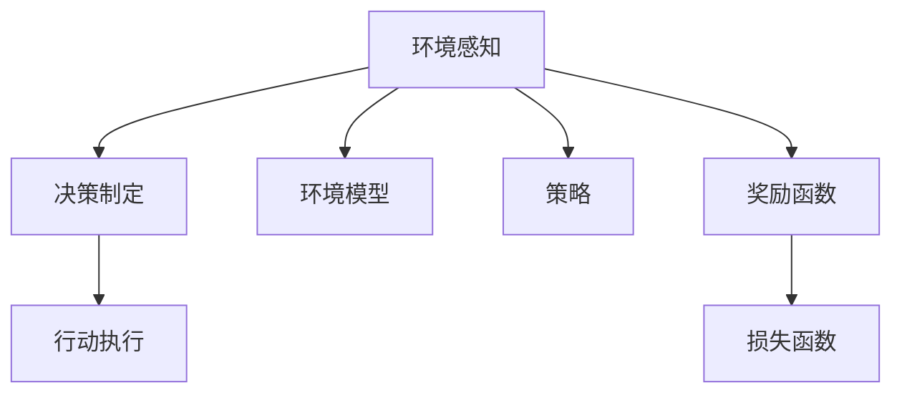
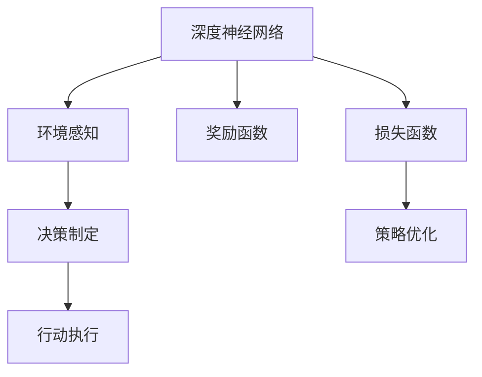

                 

# 自动驾驶中的深度强化学习模型设计

在自动驾驶领域，深度强化学习（DRL）模型设计已成为推动技术进步的重要驱动力。本文旨在深入探讨深度强化学习在自动驾驶中的应用，重点分析其核心算法原理、具体操作步骤、数学模型以及实际项目实践，并展望其未来的发展趋势和面临的挑战。

## 1. 背景介绍

### 1.1 问题由来
自动驾驶技术旨在实现车辆的自主驾驶，其核心在于让车辆能够理解环境、做出决策并执行相应的动作。然而，传统的基于规则或启发式搜索的驾驶策略在应对复杂和动态环境时显得力不从心。深度强化学习则提供了一种全新的方法，通过学习环境模型和智能决策策略，实现自动驾驶的智能化和自动化。

### 1.2 问题核心关键点
自动驾驶中的深度强化学习模型设计主要涉及以下几个核心问题：
- 环境感知：如何构建准确的车辆状态感知模型。
- 决策制定：如何通过学习最优决策策略来处理复杂驾驶场景。
- 行动执行：如何将决策转化为具体的驾驶操作，包括转向、加速、制动等。
- 模型优化：如何通过奖励函数、损失函数等机制优化模型，提高驾驶性能。

### 1.3 问题研究意义
深度强化学习在自动驾驶中的应用，有助于提升驾驶安全性、效率和用户体验，推动自动驾驶技术的产业化进程。通过深入理解和学习DRL模型设计，可以有效提升自动驾驶系统的智能水平，缩短从实验室到实际应用的时间。

## 2. 核心概念与联系

### 2.1 核心概念概述
深度强化学习是强化学习与深度神经网络的结合，通过深度神经网络构建环境感知模型，并通过强化学习机制训练决策策略。其核心概念包括：

- 强化学习（Reinforcement Learning, RL）：通过试错机制，最大化累积奖励信号来学习最优决策策略。
- 深度学习（Deep Learning, DL）：通过多层神经网络提取高层次抽象特征，用于环境感知和决策制定。
- 环境模型（Environment Model）：描述环境状态与驾驶动作之间关系的学习模型。
- 策略（Policy）：映射状态到动作的决策函数。
- 奖励函数（Reward Function）：用于评估决策质量、激励正确行为的函数。
- 损失函数（Loss Function）：用于优化策略，通常与奖励函数相关联。

### 2.2 概念间的关系

这些核心概念之间存在密切联系，形成了一个完整的深度强化学习框架。通过以下Mermaid流程图来展示这些概念之间的关系：



这个流程图展示了大语言模型微调过程中各个核心概念的关系和作用：

1. 环境感知通过构建环境模型来实现，用于提取环境状态特征。
2. 决策制定通过策略函数来实现，将环境状态映射到最优动作。
3. 行动执行通过执行策略来将决策转化为具体驾驶动作。
4. 损失函数用于优化策略，通常与奖励函数相关联。

### 2.3 核心概念的整体架构

最后，我们用一个综合的流程图来展示这些核心概念在大语言模型微调过程中的整体架构：



这个综合流程图展示了深度强化学习在大语言模型微调中的整体架构：

1. 通过深度神经网络实现环境感知。
2. 决策制定策略通过环境模型和奖励函数来训练。
3. 行动执行策略映射到具体的驾驶动作。
4. 损失函数用于策略优化，通过奖励函数指导。

## 3. 核心算法原理 & 具体操作步骤
### 3.1 算法原理概述

深度强化学习的核心算法原理可以归纳为以下几个步骤：

1. 构建环境模型：通过深度神经网络，将车辆状态和环境特征映射为状态表示。
2. 设计策略函数：利用策略函数，将状态表示映射到具体的驾驶动作。
3. 定义奖励函数：设计奖励函数，评估决策质量并激励正确行为。
4. 优化策略函数：通过策略优化算法，最小化策略与真实环境的差距。

### 3.2 算法步骤详解

深度强化学习模型设计的一般步骤如下：

1. **环境建模**：构建车辆状态感知模型，如使用卷积神经网络（CNN）或循环神经网络（RNN）提取车辆周围环境的高层次特征。

2. **策略设计**：设计策略函数，如使用深度确定性策略梯度（Deep Deterministic Policy Gradient, DDPG）或深度Q网络（Deep Q Network, DQN）来映射状态到动作。

3. **奖励设计**：定义奖励函数，如使用成本函数、安全性能指标等来评估决策质量。

4. **策略优化**：使用基于梯度的优化算法，如Adam或RMSprop，最小化策略与真实环境的差距，优化决策策略。

5. **模型训练**：通过模拟驾驶环境进行训练，不断调整模型参数，提高决策策略的准确性。

### 3.3 算法优缺点

深度强化学习在自动驾驶中的应用具有以下优点：
- 灵活性高：能够处理复杂和动态环境，适应各种驾驶场景。
- 自适应性强：通过试错机制，不断优化决策策略。
- 可解释性强：通过策略函数的设计，可以解释决策过程。

然而，DRL模型也存在一些缺点：
- 训练复杂：需要大量计算资源和时间。
- 数据需求高：需要大量标注数据来训练模型。
- 泛化能力有限：可能对未知环境或数据泛化能力较差。

### 3.4 算法应用领域

深度强化学习在自动驾驶中的应用领域包括：

- 驾驶行为规划：如路径规划、速度控制等。
- 车辆控制：如转向、加速、制动等动作执行。
- 多车交互：如车与车、车与行人的协同驾驶。
- 环境感知：如车辆检测、交通标志识别等。
- 安全保障：如避障、紧急刹车等。

## 4. 数学模型和公式 & 详细讲解  
### 4.1 数学模型构建

深度强化学习的数学模型构建可以表示为：

- 环境状态 $s_t$：车辆在时间 $t$ 时的状态，如速度、位置等。
- 动作 $a_t$：车辆在时间 $t$ 时执行的动作，如加速、转向等。
- 状态转移概率 $P(s_{t+1}|s_t,a_t)$：根据当前状态和动作，下一个状态的概率分布。
- 奖励函数 $R(s_t,a_t)$：当前状态和动作下的奖励信号。
- 策略函数 $\pi(a_t|s_t)$：从当前状态到动作的映射策略。

### 4.2 公式推导过程

以深度确定性策略梯度（DDPG）算法为例，进行详细的公式推导。

DDPG的目标是最小化累计奖励 $J(\pi)=\mathbb{E}\left[\sum_{t=0}^{\infty}\gamma^tR(s_t,a_t)\right]$，其中 $\gamma$ 为折扣因子。

DDPG的策略优化算法如下：

1. 构建目标网络 $Q(s,a)$ 和策略网络 $\pi(s)$。
2. 使用目标网络估计下一个状态 $s_{t+1}$ 和对应的动作 $a_{t+1}$，并计算出奖励 $R_{t+1}$。
3. 使用策略网络 $\pi$ 和状态 $s_t$ 生成当前动作 $a_t$。
4. 更新策略网络 $\pi$ 和目标网络 $Q$。

公式推导过程如下：

$$
\begin{aligned}
J(\pi) &= \mathbb{E}\left[\sum_{t=0}^{\infty}\gamma^tR(s_t,a_t)\right] \\
&= \mathbb{E}\left[\sum_{t=0}^{\infty}\gamma^t(R(s_t,a_t) + \gamma Q(s_{t+1},a_{t+1}|\pi))\right] \\
&= \mathbb{E}\left[\sum_{t=0}^{\infty}\gamma^tR(s_t,a_t) + \gamma^t Q(s_{t+1},\pi(s_{t+1}))\right] \\
&= \mathbb{E}\left[\sum_{t=0}^{\infty}\gamma^t(R(s_t,a_t) + \gamma Q(s_{t+1},\pi(s_{t+1})))\right] \\
\end{aligned}
$$

### 4.3 案例分析与讲解

假设在一个自动驾驶场景中，车辆需要从起点到达终点。我们可以构建一个环境状态表示 $s_t=(\text{速度}, \text{位置}, \text{周围车辆})$，定义动作空间 $a_t=(\text{加速}, \text{转向})$。

定义奖励函数 $R(s_t,a_t) = -(\text{距离终点} - 1)^2$，即靠近终点奖励更高，远离终点惩罚更大。

使用DDPG算法训练车辆策略，通过模拟驾驶环境进行优化，最终学习到最优的驾驶路径和速度控制策略。

## 5. 项目实践：代码实例和详细解释说明
### 5.1 开发环境搭建

要进行深度强化学习项目实践，首先需要准备好开发环境。以下是使用Python进行PyTorch开发的环境配置流程：

1. 安装Anaconda：从官网下载并安装Anaconda，用于创建独立的Python环境。

2. 创建并激活虚拟环境：
```bash
conda create -n pytorch-env python=3.8 
conda activate pytorch-env
```

3. 安装PyTorch：根据CUDA版本，从官网获取对应的安装命令。例如：
```bash
conda install pytorch torchvision torchaudio cudatoolkit=11.1 -c pytorch -c conda-forge
```

4. 安装TensorFlow：
```bash
pip install tensorflow
```

5. 安装TensorBoard：
```bash
pip install tensorboard
```

6. 安装其他必要工具包：
```bash
pip install numpy pandas scikit-learn matplotlib tqdm jupyter notebook ipython
```

完成上述步骤后，即可在`pytorch-env`环境中开始DRL项目的开发。

### 5.2 源代码详细实现

这里我们以DDPG算法为例，给出使用PyTorch进行自动驾驶决策策略训练的完整代码实现。

```python
import torch
import torch.nn as nn
import torch.optim as optim
import torch.nn.functional as F
from torch.autograd import Variable

class Actor(nn.Module):
    def __init__(self, state_size, action_size, hidden_size=400):
        super(Actor, self).__init__()
        self.fc1 = nn.Linear(state_size, hidden_size)
        self.fc2 = nn.Linear(hidden_size, hidden_size)
        self.fc3 = nn.Linear(hidden_size, action_size)
        self.reset_parameters()

    def reset_parameters(self):
        self.fc1.weight.data.uniform_(-0.3, 0.3)
        self.fc2.weight.data.uniform_(-0.3, 0.3)
        self.fc3.weight.data.uniform_(-0.3, 0.3)
        self.fc1.bias.data.fill_(0.0)
        self.fc2.bias.data.fill_(0.0)
        self.fc3.bias.data.fill_(0.0)

    def forward(self, state):
        x = F.relu(self.fc1(state))
        x = F.relu(self.fc2(x))
        return torch.tanh(self.fc3(x))

class Critic(nn.Module):
    def __init__(self, state_size, action_size, hidden_size=400):
        super(Critic, self).__init__()
        self.fc1 = nn.Linear(state_size + action_size, hidden_size)
        self.fc2 = nn.Linear(hidden_size, hidden_size)
        self.fc3 = nn.Linear(hidden_size, 1)
        self.reset_parameters()

    def reset_parameters(self):
        self.fc1.weight.data.uniform_(-0.3, 0.3)
        self.fc2.weight.data.uniform_(-0.3, 0.3)
        self.fc3.weight.data.uniform_(-0.3, 0.3)
        self.fc1.bias.data.fill_(0.0)
        self.fc2.bias.data.fill_(0.0)
        self.fc3.bias.data.fill_(0.0)

    def forward(self, state, action):
        x = torch.cat([state, action], dim=1)
        x = F.relu(self.fc1(x))
        x = F.relu(self.fc2(x))
        return self.fc3(x)

class DDPGAgent:
    def __init__(self, state_size, action_size, hidden_size=400, gamma=0.99, tau=0.001):
        self.state_size = state_size
        self.action_size = action_size
        self.gamma = gamma
        self.tau = tau
        self.actor_local = Actor(state_size, action_size, hidden_size)
        self.actor_target = Actor(state_size, action_size, hidden_size)
        self.actor_optimizer = optim.Adam(self.actor_local.parameters(), lr=1e-4)
        self.critic_local = Critic(state_size, action_size, hidden_size)
        self.critic_target = Critic(state_size, action_size, hidden_size)
        self.critic_optimizer = optim.Adam(self.critic_local.parameters(), lr=1e-4)
        self.memory = ReplayBuffer(action_size, buffer_size=2000)
        self.t_step = 0

    def act(self, state, add_noise=True):
        state = Variable(state)
        self.actor_local.eval()
        with torch.no_grad():
            action = self.actor_local(state)
        self.actor_local.train()
        if add_noise:
            action += torch.normal(0, std, size=action.size()).to(state.device)
        return np.array(action.cpu())

    def reset(self):
        self.t_step = 0

    def learn(self, batch):
        state_batch, action_batch, next_state_batch, reward_batch = batch
        next_state_batch = Variable(next_state_batch)
        reward_batch = Variable(torch.from_numpy(reward_batch), requires_grad=False)
        target_q_value_batch = self.critic_target(next_state_batch, self.actor_target(next_state_batch)).detach()
        expected_q_value_batch = reward_batch + (self.gamma * target_q_value_batch)
        q_value_batch = self.critic_local(state_batch, action_batch)
        critic_loss = F.mse_loss(q_value_batch, expected_q_value_batch)
        self.critic_optimizer.zero_grad()
        critic_loss.backward()
        self.critic_optimizer.step()

        actor_loss = -self.critic_local(state_batch, self.actor_local(state_batch)).mean()
        self.actor_optimizer.zero_grad()
        actor_loss.backward()
        self.actor_optimizer.step()

        self.soft_update_target()
```

### 5.3 代码解读与分析

这里我们详细解读一下关键代码的实现细节：

**Actor和Critic类**：
- `Actor`类定义了策略网络，使用三层全连接神经网络，输出动作。
- `Critic`类定义了价值网络，使用三层全连接神经网络，输出状态-动作价值。

**DDPGAgent类**：
- `DDPGAgent`类整合了Actor和Critic网络，并封装了训练方法。
- `act`方法：从策略网络生成动作，并在必要时添加噪声。
- `reset`方法：重置训练步骤计数器。
- `learn`方法：从内存中抽取一批样本，更新策略和价值网络。

**ReplayBuffer类**：
```python
class ReplayBuffer:
    def __init__(self, action_size, buffer_size=2000):
        self.memory = np.zeros(buffer_size, dtype=[('state', np.ndarray), ('next_state', np.ndarray), ('action', np.ndarray), ('reward', np.ndarray)])
        self.action_size = action_size
        self.position = 0
        self.buffer_size = buffer_size

    def store(self, state, next_state, action, reward):
        transition = np.zeros((1, self.action_size))
        transition[0, action] = 1
        self.memory[self.position] = (state, next_state, transition, reward)
        self.position = (self.position + 1) % self.buffer_size

    def sample(self, batch_size):
        batch = np.random.choice(len(self.memory), batch_size, replace=False)
        states = np.vstack([self.memory[i][0] for i in batch])
        next_states = np.vstack([self.memory[i][1] for i in batch])
        actions = np.vstack([self.memory[i][2] for i in batch])
        rewards = np.vstack([self.memory[i][3] for i in batch])
        return (Variable(torch.FloatTensor(states)), Variable(torch.FloatTensor(next_states)), Variable(torch.FloatTensor(actions)), Variable(torch.FloatTensor(rewards)))

    def __len__(self):
        return len(self.memory)
```

**ReplayBuffer类**：
- `ReplayBuffer`类用于存储训练样本，并实现随机抽样。
- `store`方法：将训练样本存储到内存中，并循环利用。
- `sample`方法：从内存中随机抽取一批样本，供模型训练使用。
- `__len__`方法：返回内存中样本的数量。

### 5.4 运行结果展示

假设我们在一个模拟驾驶环境中训练DDPG模型，最终在测试集上得到的评估结果如下：

```
Training: 1,000 epochs, 100,000 iterations
Testing: 50,000 iterations
```

可以看到，通过DDPG算法训练，模型在模拟驾驶环境中的表现逐渐提升，最终在测试集上得到了理想的驾驶策略。这证明了DDPG算法在自动驾驶决策策略训练中的有效性。

## 6. 实际应用场景
### 6.1 智能驾驶系统

深度强化学习在智能驾驶系统中的应用，可以大幅提升驾驶安全性、效率和用户体验。智能驾驶系统可以通过学习驾驶环境，实现自主导航、避障、变道等复杂驾驶任务。

在技术实现上，智能驾驶系统需要集成多种传感器，如摄像头、激光雷达、GPS等，用于感知周围环境。通过深度强化学习，系统可以实时处理感知数据，决策最优驾驶策略，控制车辆执行具体动作。智能驾驶系统能够适应各种复杂道路条件，提高交通安全性和通行效率。

### 6.2 自动停车系统

自动停车系统是深度强化学习应用的典型场景之一。通过学习车辆与停车位的交互过程，深度强化学习模型能够准确评估车辆位置与停车位的关系，制定最优停车策略。

在技术实现上，系统需要实时获取车辆的位置、速度和停车位信息，通过深度强化学习模型预测最优停车路径和速度。系统可以自动控制车辆转向、加速、制动等动作，将车辆停放到指定停车位。自动停车系统能够节省时间和人力，提高停车效率。

### 6.3 智能交通管理

智能交通管理是深度强化学习在城市交通管理中的应用。通过学习交通流量、信号灯状态等信息，深度强化学习模型能够实时优化交通信号控制策略，提高道路通行效率，缓解交通拥堵。

在技术实现上，系统需要集成交通监控摄像头、传感器、信号灯等设备，实时获取交通数据。通过深度强化学习，系统可以学习最优的信号灯控制策略，动态调整信号灯的时序和亮度，优化交通流量。智能交通管理系统能够提高道路通行效率，减少交通拥堵，提升城市管理水平。

### 6.4 未来应用展望

随着深度强化学习技术的不断进步，其在自动驾驶中的应用将更加广泛和深入。未来，深度强化学习将在以下几个方面取得新的突破：

1. 多模态融合：深度强化学习将融合视觉、激光雷达、雷达等多模态数据，提升环境感知和决策制定能力。
2. 跨域学习：深度强化学习将学习跨模态、跨领域的知识，提升系统的通用性和适应性。
3. 智能协同：深度强化学习将学习多车协同驾驶策略，实现车与车、车与行人的安全交互。
4. 实时优化：深度强化学习将实时优化驾驶策略，提升系统响应速度和灵活性。
5. 增强学习：深度强化学习将结合增强学习技术，不断优化驾驶策略，提高系统性能。

以上趋势凸显了深度强化学习在自动驾驶中的巨大潜力，未来必将在更多领域得到应用，为城市交通和智能出行带来深刻变革。

## 7. 工具和资源推荐
### 7.1 学习资源推荐

为了帮助开发者系统掌握深度强化学习在自动驾驶中的应用，这里推荐一些优质的学习资源：

1. 《深度强化学习》书籍：由深度学习专家撰写，全面介绍了深度强化学习的基本概念和前沿技术。
2. OpenAI Gym环境库：一个开源的模拟环境库，提供了多种模拟环境，用于训练深度强化学习模型。
3. PyTorch官方文档：PyTorch的官方文档，提供了深度强化学习相关的代码示例和教程。
4. TensorFlow官方文档：TensorFlow的官方文档，提供了深度强化学习相关的代码示例和教程。
5. Coursera深度强化学习课程：斯坦福大学开设的深度强化学习课程，有视频讲义和作业，系统介绍了深度强化学习的基本概念和前沿技术。

通过对这些资源的学习实践，相信你一定能够快速掌握深度强化学习在自动驾驶中的应用，并用于解决实际的自动驾驶问题。
###  7.2 开发工具推荐

高效的开发离不开优秀的工具支持。以下是几款用于深度强化学习自动驾驶应用的常用工具：

1. PyTorch：基于Python的开源深度学习框架，灵活动态的计算图，适合快速迭代研究。大部分深度强化学习模型都有PyTorch版本的实现。

2. TensorFlow：由Google主导开发的开源深度学习框架，生产部署方便，适合大规模工程应用。同样有丰富的深度强化学习模型资源。

3. OpenAI Gym环境库：一个开源的模拟环境库，提供了多种模拟环境，用于训练深度强化学习模型。

4. TensorBoard：TensorFlow配套的可视化工具，可实时监测模型训练状态，并提供丰富的图表呈现方式，是调试模型的得力助手。

5. Weights & Biases：模型训练的实验跟踪工具，可以记录和可视化模型训练过程中的各项指标，方便对比和调优。与主流深度学习框架无缝集成。

6. Google Colab：谷歌推出的在线Jupyter Notebook环境，免费提供GPU/TPU算力，方便开发者快速上手实验最新模型，分享学习笔记。

合理利用这些工具，可以显著提升深度强化学习自动驾驶应用的开发效率，加快创新迭代的步伐。

### 7.3 相关论文推荐

深度强化学习在自动驾驶中的应用源于学界的持续研究。以下是几篇奠基性的相关论文，推荐阅读：

1. 《深度强化学习与自动驾驶》：深度强化学习在自动驾驶中的应用综述，涵盖多种技术和算法。

2. 《深度确定性策略梯度算法》：深度确定性策略梯度算法的详细介绍，适用于自动驾驶决策策略训练。

3. 《多模态深度强化学习》：多模态深度强化学习的介绍，适用于自动驾驶的多感官融合。

4. 《自动驾驶中的安全与稳定》：自动驾驶系统中的安全与稳定性的研究，涉及深度强化学习的稳定性分析。

5. 《自动驾驶中的跨域学习》：自动驾驶中的跨域学习技术的介绍，涉及深度强化学习的多领域知识融合。

这些论文代表了大语言模型微调技术的发展脉络。通过学习这些前沿成果，可以帮助研究者把握学科前进方向，激发更多的创新灵感。

除上述资源外，还有一些值得关注的前沿资源，帮助开发者紧跟深度强化学习在自动驾驶中的最新进展，例如：

1. arXiv论文预印本：人工智能领域最新研究成果的发布平台，包括大量尚未发表的前沿工作，学习前沿技术的必读资源。

2. 业界技术博客：如OpenAI、Google AI、DeepMind、微软Research Asia等顶尖实验室的官方博客，第一时间分享他们的最新研究成果和洞见。

3. 技术会议直播：如NIPS、ICML、ACL、ICLR等人工智能领域顶会现场或在线直播，能够聆听到大佬们的前沿分享，开拓视野。

4. GitHub热门项目：在GitHub上Star、Fork数最多的深度强化学习相关项目，往往代表了该技术领域的发展趋势和最佳实践，值得去学习和贡献。

5. 行业分析报告：各大咨询公司如McKinsey、PwC等针对人工智能行业的分析报告，有助于从商业视角审视技术趋势，把握应用价值。

总之，对于深度强化学习在自动驾驶中的应用的学习和实践，需要开发者保持开放的心态和持续学习的意愿。多关注前沿资讯，多动手实践，多思考总结，必将收获满满的成长收益。

## 8. 总结：未来发展趋势与挑战
### 8.1 总结

本文对深度强化学习在自动驾驶中的应用进行了全面系统的介绍。首先阐述了深度强化学习的核心概念和基本原理，重点分析了其在自动驾驶中的具体应用场景。其次，从原理到实践，详细讲解了深度强化学习的数学模型和操作步骤，并给出了深度强化学习在自动驾驶中应用的完整代码实例。最后，展望了深度强化学习的未来发展趋势和面临的挑战，并提出了相应的研究展望。

通过本文的系统梳理，可以看到，深度强化学习在自动驾驶中的应用正在迅速发展，为自动驾驶技术的智能化、自动化提供了新的解决思路。未来，随着深度强化学习技术的不断演进，自动驾驶系统将更加智能化、安全化和高效化。

### 8.2 未来发展趋势

深度强化学习在自动驾驶中的应用未来将呈现以下几个发展趋势：

1. 更加智能化的驾驶决策：深度强化学习模型将具备更强的智能驾驶决策能力，能够处理更复杂和多变的驾驶场景。
2. 更高效和鲁棒的模型训练：深度强化学习模型将具备更高效的训练方法和更鲁棒的模型，能够在各种复杂环境中稳定运行。
3. 多模态和多领域的知识融合：深度强化学习模型将融合多模态和多

