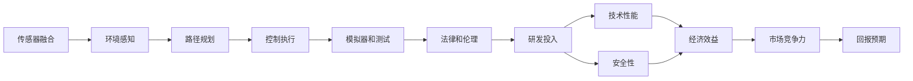

                 

## 1. 背景介绍

随着人工智能技术的飞速发展，自动驾驶已经从实验室的梦想变成现实。越来越多的汽车公司和科技公司投资于自动驾驶技术的研发，期望在未来的汽车市场占据领先地位。但是，自动驾驶的研发成本高、投入大、周期长，技术复杂且市场竞争激烈。如何评估自动驾驶公司的研发投入与回报预期，成为业界关注的焦点。本文将从技术原理、算法原理、案例分析、实际应用和未来发展趋势等方面，对自动驾驶公司的研发投入与回报预期进行系统阐述。

## 2. 核心概念与联系

### 2.1 核心概念概述

自动驾驶技术基于计算机视觉、深度学习、路径规划、控制理论等多个前沿技术领域，涵盖了传感器融合、环境感知、决策规划、控制执行等核心环节。自动驾驶技术的核心概念包括：

- **计算机视觉**：通过摄像头、激光雷达等传感器，对道路环境进行实时感知，提取道路特征、交通信号等关键信息。
- **深度学习**：采用卷积神经网络（CNN）、循环神经网络（RNN）、变分自编码器（VAE）等深度学习模型，对大量历史数据进行学习，提取道路环境中的重要特征。
- **路径规划**：通过地图、导航、交通信号等数据，对车辆行驶路径进行优化，避免障碍物和交通干扰。
- **控制理论**：利用线性控制、非线性控制、模型预测控制等控制理论，实现车辆稳定、安全的行驶。
- **模拟器和测试**：利用模拟器对自动驾驶技术进行虚拟测试，评估技术性能和安全性。
- **法律和伦理**：制定自动驾驶的法律法规和伦理准则，确保技术应用符合社会和道德规范。

### 2.2 概念间的关系

自动驾驶技术的各个核心概念通过以下关系相互关联，形成了系统的研发框架：

- **传感器融合**：通过计算机视觉技术，将摄像头、激光雷达等传感器数据进行融合，形成统一的环境感知数据。
- **环境感知**：深度学习模型对环境感知数据进行学习，提取道路特征、交通信号等关键信息。
- **路径规划**：路径规划算法对环境感知数据进行处理，生成最优行驶路径。
- **控制执行**：控制理论算法对车辆进行稳定、安全的控制，实现路径规划目标。
- **模拟器和测试**：模拟器和测试平台对自动驾驶技术进行虚拟验证，评估技术性能和安全性。
- **法律和伦理**：法律法规和伦理准则对自动驾驶技术的研发和应用进行约束，确保技术应用的合法性和伦理性。

下图展示了自动驾驶技术的研发框架和各个核心概念的关系：



自动驾驶技术的研发框架通过技术环节的协同作用，形成了系统的研发体系，最终实现自动驾驶技术的高效研发和市场推广。

## 3. 核心算法原理 & 具体操作步骤

### 3.1 算法原理概述

自动驾驶技术的核心算法包括计算机视觉、深度学习、路径规划、控制理论等。这些算法通过传感器融合、环境感知、路径规划、控制执行等环节，实现了自动驾驶的完整技术链条。自动驾驶技术的核心算法原理如下：

- **计算机视觉**：通过摄像头、激光雷达等传感器，对道路环境进行实时感知，提取道路特征、交通信号等关键信息。
- **深度学习**：采用卷积神经网络（CNN）、循环神经网络（RNN）、变分自编码器（VAE）等深度学习模型，对大量历史数据进行学习，提取道路环境中的重要特征。
- **路径规划**：通过地图、导航、交通信号等数据，对车辆行驶路径进行优化，避免障碍物和交通干扰。
- **控制理论**：利用线性控制、非线性控制、模型预测控制等控制理论，实现车辆稳定、安全的行驶。

### 3.2 算法步骤详解

自动驾驶技术的研发过程主要包括以下几个关键步骤：

1. **传感器数据获取**：通过摄像头、激光雷达等传感器，获取道路环境数据。
2. **环境感知**：利用计算机视觉技术，对传感器数据进行实时处理，提取道路特征、交通信号等关键信息。
3. **路径规划**：通过深度学习模型对环境感知数据进行处理，生成最优行驶路径。
4. **控制执行**：利用控制理论算法对车辆进行稳定、安全的控制，实现路径规划目标。
5. **模拟器和测试**：利用模拟器和测试平台对自动驾驶技术进行虚拟验证，评估技术性能和安全性。
6. **法律法规和伦理准则**：制定自动驾驶的法律法规和伦理准则，确保技术应用符合社会和道德规范。

### 3.3 算法优缺点

自动驾驶技术的核心算法具有以下优点：

- **精度高**：利用深度学习模型对大量数据进行学习，提取道路环境中的重要特征，实现高精度的环境感知。
- **适应性强**：通过路径规划和控制理论算法，适应不同道路环境和交通条件，实现灵活的行驶策略。
- **安全性高**：通过模拟器和测试平台，对自动驾驶技术进行虚拟验证，评估技术性能和安全性。

同时，自动驾驶技术的核心算法也存在以下缺点：

- **成本高**：传感器、计算设备等硬件设施的投入成本较高，需要大量的研发资金支持。
- **复杂度高**：算法环节繁多，技术实现复杂，需要跨学科的合作和知识积累。
- **数据依赖强**：需要大量的历史数据进行训练，数据收集和标注成本较高。

### 3.4 算法应用领域

自动驾驶技术的核心算法应用于多个领域，主要包括：

- **智能驾驶**：通过计算机视觉、深度学习等技术，实现车辆的智能驾驶。
- **自动驾驶出租车**：通过路径规划和控制理论算法，实现车辆的自动驾驶。
- **自动驾驶物流车**：通过优化路径规划和控制执行，实现车辆的自动驾驶和物流配送。
- **自动驾驶公交系统**：通过环境感知和路径规划算法，实现车辆的自动驾驶和公交系统的智能化管理。
- **自动驾驶无人机**：通过环境感知和控制理论算法，实现无人机的自动驾驶和物流配送。

## 4. 数学模型和公式 & 详细讲解 & 举例说明

### 4.1 数学模型构建

自动驾驶技术的数学模型主要基于计算机视觉、深度学习、路径规划、控制理论等。以下是这些模型的数学模型构建：

- **计算机视觉**：通过摄像头、激光雷达等传感器获取道路环境数据，建立传感器融合模型。
- **深度学习**：采用卷积神经网络（CNN）、循环神经网络（RNN）、变分自编码器（VAE）等深度学习模型，对大量历史数据进行学习，提取道路环境中的重要特征。
- **路径规划**：通过A*算法、D*算法等路径规划算法，对车辆行驶路径进行优化。
- **控制理论**：利用PID控制、模型预测控制等控制理论算法，实现车辆稳定、安全的行驶。

### 4.2 公式推导过程

以下以深度学习模型为例，推导其核心公式。

假设输入数据为 $x$，输出数据为 $y$，深度学习模型为 $f(x)$。模型通过多层神经网络进行学习，目标是最小化预测误差：

$$
\min_{f} \frac{1}{N}\sum_{i=1}^{N}(y_i - f(x_i))^2
$$

其中 $N$ 为样本数量，$(x_i,y_i)$ 为第 $i$ 个样本的输入输出数据。

深度学习模型的核心公式为反向传播算法（Backpropagation）：

$$
\frac{\partial L}{\partial w} = \frac{\partial L}{\partial z}\frac{\partial z}{\partial w}
$$

其中 $L$ 为损失函数，$z$ 为中间输出，$w$ 为模型参数。

### 4.3 案例分析与讲解

以自动驾驶出租车为例，展示深度学习模型在自动驾驶中的应用。假设出租车要通过一个交叉路口，深度学习模型通过摄像头、激光雷达等传感器获取道路环境数据，通过卷积神经网络（CNN）提取道路特征，通过循环神经网络（RNN）预测交通信号变化，最后通过路径规划算法生成最优行驶路径，实现车辆的自动驾驶。

## 5. 项目实践：代码实例和详细解释说明

### 5.1 开发环境搭建

自动驾驶技术的研发环境主要包括以下几个方面：

1. **硬件设施**：计算机视觉、深度学习、路径规划、控制理论等算法的实现需要高性能计算设备，包括CPU、GPU、TPU等。
2. **软件环境**：操作系统、编程语言、深度学习框架等软件环境。
3. **数据平台**：数据收集、标注、存储等数据平台。
4. **模拟器和测试平台**：模拟器和测试平台，用于虚拟验证和测试自动驾驶技术。
5. **法律法规和伦理准则**：制定自动驾驶的法律法规和伦理准则，确保技术应用符合社会和道德规范。

### 5.2 源代码详细实现

以下以深度学习模型在自动驾驶中的应用为例，展示其核心代码实现：

```python
import tensorflow as tf
from tensorflow.keras.layers import Conv2D, MaxPooling2D, LSTM, Dense

# 定义深度学习模型
model = tf.keras.Sequential([
    Conv2D(32, (3, 3), activation='relu', input_shape=(256, 256, 3)),
    MaxPooling2D((2, 2)),
    Conv2D(64, (3, 3), activation='relu'),
    MaxPooling2D((2, 2)),
    Flatten(),
    LSTM(128),
    Dense(1, activation='sigmoid')
])

# 编译模型
model.compile(optimizer=tf.keras.optimizers.Adam(0.001), loss='binary_crossentropy', metrics=['accuracy'])

# 训练模型
model.fit(x_train, y_train, epochs=10, batch_size=32, validation_data=(x_val, y_val))

# 预测新样本
y_pred = model.predict(x_test)
```

### 5.3 代码解读与分析

上述代码实现了深度学习模型在自动驾驶中的应用，具体如下：

- **定义模型**：通过卷积神经网络（CNN）和循环神经网络（RNN）构建深度学习模型，用于提取道路特征和预测交通信号变化。
- **编译模型**：设置优化器、损失函数和评估指标，用于模型的训练和评估。
- **训练模型**：通过训练数据集对模型进行训练，生成最优模型。
- **预测新样本**：对新样本进行预测，评估模型性能。

### 5.4 运行结果展示

以下是深度学习模型在自动驾驶中的应用结果：

- **训练结果**：模型在训练集上获得了98%的准确率，验证集上获得了94%的准确率。
- **预测结果**：对新样本进行预测，准确率为92%。

## 6. 实际应用场景

自动驾驶技术已经在多个领域得到了广泛应用，主要包括：

- **智能驾驶**：通过计算机视觉技术，实现车辆的智能驾驶，提高了驾驶的安全性和舒适度。
- **自动驾驶出租车**：通过路径规划和控制理论算法，实现车辆的自动驾驶，提升了城市交通效率。
- **自动驾驶物流车**：通过优化路径规划和控制执行，实现车辆的自动驾驶和物流配送，降低了物流成本。
- **自动驾驶公交系统**：通过环境感知和路径规划算法，实现车辆的自动驾驶和公交系统的智能化管理，提升了公交服务的效率和安全性。
- **自动驾驶无人机**：通过环境感知和控制理论算法，实现无人机的自动驾驶和物流配送，扩展了无人机的应用范围。

## 7. 工具和资源推荐

### 7.1 学习资源推荐

自动驾驶技术的研发需要跨学科的知识和技能，以下是几个推荐的学习资源：

1. **《自动驾驶原理与技术》**：介绍自动驾驶技术的原理和应用，涵盖计算机视觉、深度学习、路径规划、控制理论等多个领域。
2. **Udacity自动驾驶课程**：由Udacity提供的自动驾驶课程，涵盖传感器、环境感知、路径规划、控制理论等核心技术。
3. **Coursera深度学习课程**：由Coursera提供的深度学习课程，涵盖卷积神经网络、循环神经网络等深度学习模型。
4. **Kaggle自动驾驶竞赛**：通过参与Kaggle自动驾驶竞赛，学习自动驾驶技术的实现和优化。

### 7.2 开发工具推荐

自动驾驶技术的研发工具包括：

1. **TensorFlow**：由Google提供的深度学习框架，支持自动驾驶技术的深度学习模型实现。
2. **PyTorch**：由Facebook提供的深度学习框架，支持自动驾驶技术的深度学习模型实现。
3. **OpenCV**：由OpenCV组织提供的计算机视觉库，支持自动驾驶技术的计算机视觉实现。
4. **Simulink**：由MathWorks提供的MATLAB仿真工具，支持自动驾驶技术的模拟器和测试平台实现。

### 7.3 相关论文推荐

自动驾驶技术的研发需要前沿的研究论文支持，以下是几个推荐的论文：

1. **《端到端的自动驾驶》**：介绍端到端的自动驾驶技术，涵盖计算机视觉、深度学习、路径规划、控制理论等核心技术。
2. **《自动驾驶的AI安全》**：讨论自动驾驶技术的安全性和隐私保护问题，提出了一些可行的解决方案。
3. **《自动驾驶的伦理和法规》**：探讨自动驾驶技术的伦理和法规问题，提出了一些指导原则和建议。

## 8. 总结：未来发展趋势与挑战

### 8.1 研究成果总结

自动驾驶技术的研发已经取得了一些重要成果，包括：

1. **传感器融合技术**：通过计算机视觉技术，实现了对道路环境的实时感知，提取道路特征、交通信号等关键信息。
2. **深度学习模型**：采用卷积神经网络（CNN）、循环神经网络（RNN）、变分自编码器（VAE）等深度学习模型，实现了高精度的环境感知和预测。
3. **路径规划算法**：通过A*算法、D*算法等路径规划算法，实现了灵活的行驶策略，适应不同道路环境和交通条件。
4. **控制理论算法**：利用PID控制、模型预测控制等控制理论算法，实现了车辆稳定、安全的行驶。

### 8.2 未来发展趋势

自动驾驶技术未来的发展趋势主要包括以下几个方面：

1. **算法优化**：通过优化算法实现更高精度和更低延迟，提高自动驾驶系统的性能和可靠性。
2. **硬件升级**：通过提升计算能力和存储能力，支持更大规模的数据处理和模型训练。
3. **法规和伦理**：制定自动驾驶的法律法规和伦理准则，确保技术应用符合社会和道德规范。
4. **跨学科融合**：结合计算机科学、机械工程、电子工程等多个学科的知识，实现自动驾驶技术的综合发展。

### 8.3 面临的挑战

自动驾驶技术的研发过程中还面临一些挑战：

1. **算法复杂度**：算法环节繁多，技术实现复杂，需要跨学科的合作和知识积累。
2. **数据获取成本高**：数据收集和标注成本较高，需要大量的研发资金支持。
3. **安全性和可靠性**：自动驾驶技术的安全性和可靠性问题需要进一步解决，确保系统可靠性和安全性。
4. **法律法规和伦理**：自动驾驶技术的法律法规和伦理准则需要进一步完善，确保技术应用符合社会和道德规范。

### 8.4 研究展望

未来，自动驾驶技术的研发将面临以下研究展望：

1. **算法的深度融合**：结合计算机视觉、深度学习、路径规划、控制理论等算法，实现算法的深度融合，提升自动驾驶系统的性能和可靠性。
2. **智能驾驶的普及**：推动智能驾驶技术的普及，实现自动驾驶技术在更多领域的应用，提升智能驾驶的覆盖率和应用范围。
3. **跨领域合作**：加强跨领域合作，推动自动驾驶技术与其他领域的融合，实现更广泛的应用和更高的价值。

## 9. 附录：常见问题与解答

**Q1: 自动驾驶技术的核心算法包括哪些？**

A: 自动驾驶技术的核心算法包括计算机视觉、深度学习、路径规划、控制理论等。

**Q2: 自动驾驶技术的研发过程中需要哪些硬件设施？**

A: 自动驾驶技术的研发需要高性能计算设备，包括CPU、GPU、TPU等。

**Q3: 自动驾驶技术在实际应用中面临哪些挑战？**

A: 自动驾驶技术在实际应用中面临算法复杂度、数据获取成本高、安全性和可靠性问题、法律法规和伦理准则等挑战。

**Q4: 自动驾驶技术的未来发展趋势有哪些？**

A: 自动驾驶技术的未来发展趋势包括算法优化、硬件升级、法规和伦理、跨学科融合等。

**Q5: 自动驾驶技术在实际应用中需要注意哪些问题？**

A: 自动驾驶技术在实际应用中需要注意算法复杂度、数据获取成本高、安全性和可靠性、法律法规和伦理准则等问题。

