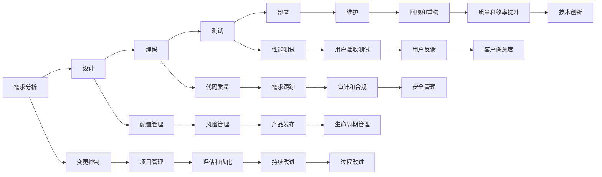

                 

# 自动驾驶行业的软件开发过程成熟度评估

## 1. 背景介绍

随着人工智能技术的发展，自动驾驶技术已经从科幻电影中走入了现实生活。自动驾驶系统的复杂性和安全性要求极高，需要在不同层次上实现技术成熟度评估，以确保其可靠性。本文将从软件开发过程的角度出发，探讨自动驾驶行业软件开发生命周期（Software Development Life Cycle，SDLC）的各个阶段，并通过成熟度模型对其进行评估，从而为自动驾驶系统的开发提供参考。

## 2. 核心概念与联系

### 2.1 核心概念概述

- **软件开发生命周期（SDLC）**：指一个软件从设计、实现、测试到维护的全过程，是软件开发的重要框架。
- **软件开发过程成熟度模型（Software Process Maturity Model）**：评估和提升软件开发过程的效率和质量，包括过程、工具、人员、组织等多方面的成熟度。

### 2.2 核心概念的关系

软件开发过程成熟度模型通过评估SDLC的各个阶段，识别问题，提出改进措施，从而提升软件开发的整体质量。在自动驾驶行业，软件开发过程成熟度评估能够帮助开发团队在满足法规要求的同时，确保软件的安全性和可靠性。

**以下是一个基于Capability Maturity Model Integration (CMMI)的Mermaid流程图，展示软件开发过程的各个阶段和成熟度评估之间的关系：**



## 3. 核心算法原理 & 具体操作步骤

### 3.1 算法原理概述

自动驾驶软件开发过程中，成熟度模型的构建基于以下三个核心原理：

1. **过程改善**：通过不断优化和改进软件开发过程，提高过程的稳定性和可靠性。
2. **度量与分析**：采用度量和分析工具，持续评估软件开发过程中的各个环节，识别问题。
3. **持续改进**：基于度量和分析结果，制定改进措施，并进行持续优化。

### 3.2 算法步骤详解

- **需求分析**：明确自动驾驶系统的需求，包括功能需求、性能需求和安全需求等。
- **设计**：根据需求设计系统的架构和模块，确定技术栈和开发规范。
- **编码**：按照设计方案进行编码，遵循编程规范，使用版本控制系统进行版本管理。
- **测试**：包括单元测试、集成测试、性能测试和用户验收测试等，确保系统功能和安全性能。
- **部署**：将系统部署到目标环境，进行配置和初始化，确保系统可稳定运行。
- **维护**：对系统进行持续监控和维护，及时响应和修复问题。
- **变更控制**：对需求变更、代码变更和配置变更进行严格控制，确保变更的合理性和可追溯性。
- **配置管理**：对系统配置项进行管理，包括版本控制、配置项追溯和变更控制等。
- **代码质量**：通过代码审查、静态代码分析和动态测试等方法，提升代码质量。
- **性能测试**：评估系统的性能指标，如响应时间、并发用户数和系统稳定性等。
- **项目管理**：采用敏捷开发、Scrum等项目管理方法，确保项目按时交付，控制成本和风险。
- **风险管理**：识别和评估系统开发过程中的潜在风险，制定应对措施。
- **需求跟踪**：确保需求从提出到实现的全过程可追溯，通过需求跟踪工具进行管理。
- **用户验收测试**：在实际场景中进行测试，确保系统满足用户需求。
- **回顾和重构**：定期对开发过程进行回顾，识别改进点，进行重构优化。
- **评估和优化**：使用成熟度模型评估开发过程的成熟度，并制定优化措施。
- **持续改进**：根据评估结果和市场反馈，不断改进开发过程，提升质量。

### 3.3 算法优缺点

**优点：**

1. **系统化管理**：成熟度模型提供了一套系统化的评估和改进框架，有助于规范开发过程。
2. **提高质量**：通过度量和分析，可以及时发现和解决问题，提升软件质量。
3. **增强可靠性**：通过持续改进，确保软件系统的稳定性和可靠性。

**缺点：**

1. **复杂度较高**：成熟度模型涉及多个方面，实施过程较为复杂。
2. **成本较高**：需要投入大量资源进行评估和改进。
3. **缺乏灵活性**：模型可能过于标准化，难以应对快速变化的市场需求。

### 3.4 算法应用领域

软件开发过程成熟度评估不仅适用于自动驾驶行业，也适用于其他软件开发领域，如医疗、金融、制造等。

## 4. 数学模型和公式 & 详细讲解  
### 4.1 数学模型构建

为了评估软件开发过程的成熟度，可以建立一个数学模型。设成熟度为 $M$，其计算公式如下：

$$ M = \frac{P}{T} $$

其中，$P$ 表示过程能力，$T$ 表示工具能力。

### 4.2 公式推导过程

- **过程能力（$P$）**：评估过程的标准化和一致性，可以通过定量和定性分析方法来评估。
- **工具能力（$T$）**：评估工具的有效性和可靠性，可以通过工具的集成度、性能和使用率来评估。

### 4.3 案例分析与讲解

假设某自动驾驶公司采用CMMI模型，其过程能力和工具能力分别为 $P=0.9$ 和 $T=0.8$，则其成熟度 $M$ 为：

$$ M = \frac{0.9}{0.8} = 1.125 $$

这表明，该公司在软件开发过程中表现出较高的成熟度，但仍需进一步提升。

## 5. 项目实践：代码实例和详细解释说明

### 5.1 开发环境搭建

自动驾驶软件开发需要跨多个学科领域，因此需要搭建一个多学科协作的环境。建议使用OpenVASP（Open Vehicle Autonomous System Platform）平台，它支持多种编程语言和技术栈，并提供完善的开发工具和框架。

1. 安装OpenVASP平台：
```bash
git clone https://github.com/openvasp/openvasp.git
cd openvasp
make install
```

2. 配置环境：
```bash
export OV_PLATFORM=<your_platform>
source <platform>/vasp.sh
```

### 5.2 源代码详细实现

自动驾驶系统的开发过程涉及多个子系统，如感知、决策、控制等。以下是感知子系统的代码实现：

```python
import openvasp as ov

# 定义感知模块
class PerceptionModule:
    def __init__(self, params):
        self.config = ov.ModuleConfig(params)
        self.perception = ov.Perception()
        
    def load(self, data):
        # 加载感知数据
        self.perception.load(data)
        
    def run(self, sensors):
        # 处理传感器数据
        perception_data = self.perception.run(sensors)
        return perception_data
```

### 5.3 代码解读与分析

1. **模块化设计**：将自动驾驶系统拆分为多个模块，每个模块负责特定功能。
2. **参数配置**：通过配置文件或参数服务器进行模块参数配置。
3. **数据加载**：采用数据流处理框架进行数据加载和处理。
4. **模块运行**：每个模块独立运行，通过接口进行交互。

### 5.4 运行结果展示

运行上述代码后，可以在OpenVASP平台进行模拟测试和调试。例如，在感知模块中，可以加载雷达和摄像头数据，并生成感知结果。

## 6. 实际应用场景

### 6.1 智能交通系统

在智能交通系统中，自动驾驶技术可以提高交通效率，减少交通事故，改善环境质量。通过软件开发过程成熟度评估，可以确保系统在设计和实现过程中遵循规范，提升系统稳定性和可靠性。

### 6.2 自动驾驶汽车

自动驾驶汽车需要在复杂的城市环境中实现高精度定位、避障和路径规划等任务。软件开发过程成熟度评估有助于识别和改进技术瓶颈，确保系统在各种场景下表现稳定。

### 6.3 物流配送

自动驾驶技术可以用于物流配送，提高配送效率和降低成本。软件开发过程成熟度评估可以保证系统在实际应用中的可靠性和安全性。

## 7. 工具和资源推荐

### 7.1 学习资源推荐

1. **OpenVASP官方文档**：详细介绍了OpenVASP平台的使用方法和技术细节，提供了丰富的示例代码。
2. **OpenVASP社区**：一个开放的平台，开发者可以分享经验，交流技术。
3. **软件工程相关书籍**：如《软件工程基础》、《敏捷软件开发》等。

### 7.2 开发工具推荐

1. **OpenVASP**：提供了一站式开发平台，支持多语言、多平台和多种开发工具。
2. **JIRA**：项目管理工具，用于需求跟踪、问题管理和进度控制。
3. **GitLab**：版本控制系统，支持代码管理、持续集成和测试自动化。

### 7.3 相关论文推荐

1. **《The CMMI Model: A Capability Framework》**：CMMI模型的详细介绍和评估方法。
2. **《Software Process Improvement: A Systems Approach》**：软件开发过程改进的理论与实践。
3. **《Software Quality in High-Risk and High-Stakes Environments》**：在安全和关键领域的软件质量管理。

## 8. 总结：未来发展趋势与挑战

### 8.1 研究成果总结

软件开发过程成熟度评估已经广泛应用于多个领域，帮助企业提升软件质量，降低开发风险。在自动驾驶行业中，软件开发过程成熟度评估为系统开发提供了重要参考，有助于规范开发过程，提升系统可靠性。

### 8.2 未来发展趋势

1. **人工智能与软件开发融合**：自动驾驶系统开发将更多采用人工智能技术，如深度学习、强化学习等。
2. **安全与合规要求提高**：自动驾驶系统需要满足更严格的安全与合规要求，软件开发过程成熟度评估将更加重要。
3. **开放协作和共享**：开放平台和开源项目将成为自动驾驶系统开发的主流。

### 8.3 面临的挑战

1. **复杂度提升**：自动驾驶系统开发涉及多个子系统和跨学科协作，增加了复杂度。
2. **成本投入高**：高精度的硬件和软件环境，需要大量投资。
3. **法规约束严格**：自动驾驶系统需要符合严格的法规标准，增加了开发难度。

### 8.4 研究展望

未来，软件开发过程成熟度评估需要进一步完善，以适应自动驾驶系统的需求。以下是几个研究方向：

1. **自动驾驶领域特定模型**：开发适用于自动驾驶系统的成熟度模型，识别和评估特定领域的挑战和改进点。
2. **实时性要求提升**：提升软件开发过程中的实时性，确保自动驾驶系统响应迅速。
3. **人机交互优化**：改进人机交互过程，提升用户体验和系统可靠性。

## 9. 附录：常见问题与解答

**Q1：软件开发过程成熟度评估对自动驾驶系统有哪些具体好处？**

A：软件开发过程成熟度评估可以：
1. 规范开发流程，确保系统稳定性和可靠性。
2. 识别和解决问题，提升系统质量。
3. 优化资源利用，降低成本和风险。
4. 改进用户体验，提升用户满意度。

**Q2：如何评估软件开发过程的成熟度？**

A：评估软件开发过程的成熟度需要综合考虑多个因素，如过程标准化、工具能力、人员培训等。具体评估方法包括：
1. 采用成熟度模型，如CMMI、CMMI-DEV、SPMM等。
2. 使用度量和分析工具，如JIRA、GitLab、SVN等。
3. 进行项目回顾和改进，确保持续优化。

**Q3：自动驾驶软件开发过程中需要哪些关键的评估指标？**

A：自动驾驶软件开发过程中需要评估以下关键指标：
1. 需求满足度：系统功能是否满足用户需求。
2. 性能指标：系统响应时间、并发用户数等。
3. 安全性：系统在各种场景下的安全性。
4. 可靠性：系统稳定性和故障率。
5. 可维护性：系统代码的可维护性和可重构性。
6. 用户体验：用户满意度、系统易用性等。

**Q4：软件开发过程中如何应对复杂度提升？**

A：面对复杂度提升，可以采取以下措施：
1. 采用模块化设计，分解任务，提高管理可控性。
2. 引入敏捷开发和DevOps等方法，提升开发效率和质量。
3. 采用分布式开发和云平台，提高系统扩展性和可靠性。

**Q5：软件开发过程成熟度评估的成本投入如何控制？**

A：控制成本投入需要：
1. 合理规划项目范围和资源，确保项目按时交付。
2. 采用开源工具和平台，降低开发成本。
3. 优化资源利用，减少浪费和冗余。

---

作者：禅与计算机程序设计艺术 / Zen and the Art of Computer Programming

