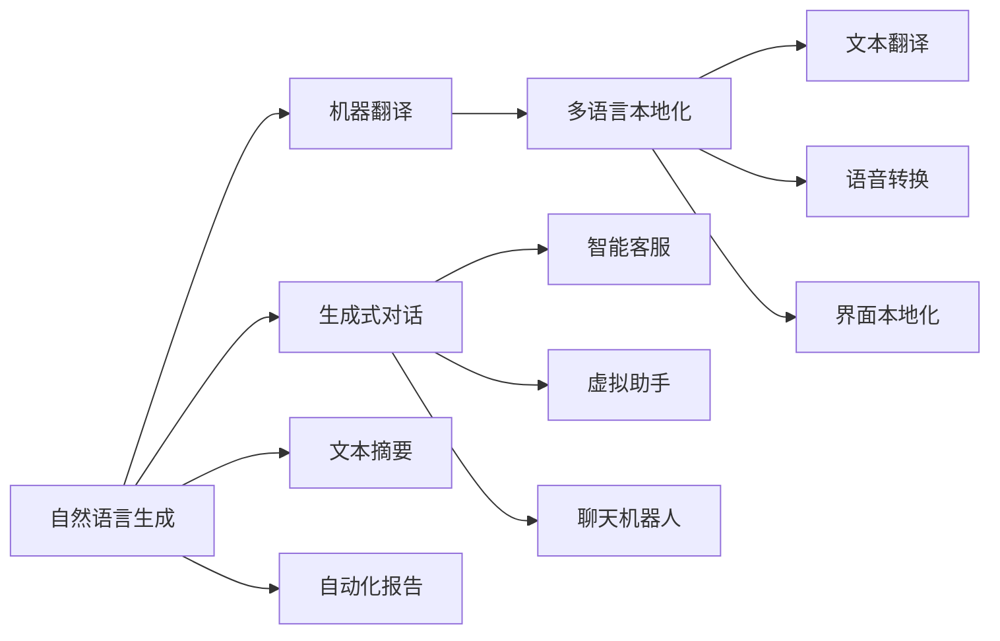
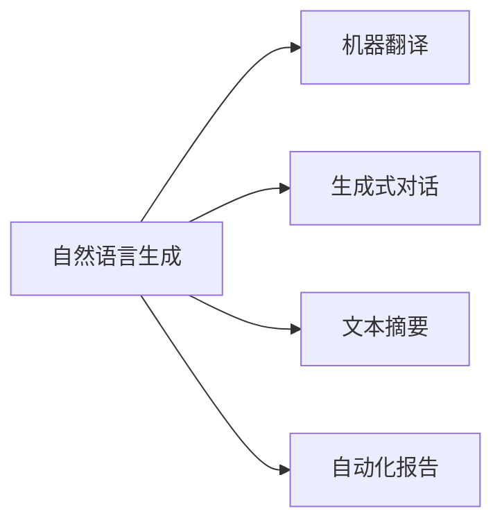
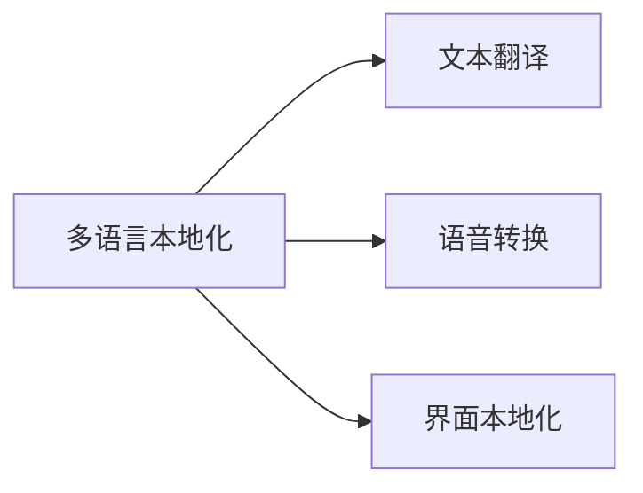
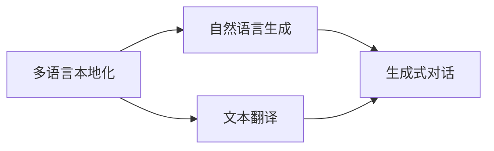
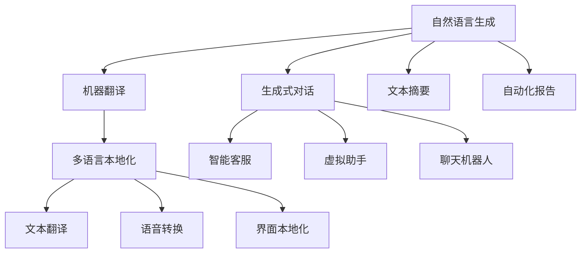

                 

# 自然语言生成在多语言本地化中的应用

> 关键词：自然语言生成(NLG), 多语言本地化, 翻译, 机器翻译, 生成式对话, 跨语言数据集, 语料库, 多语言模型

## 1. 背景介绍

### 1.1 问题由来
随着全球化的加速，多语言本地化（Localization, L10n）的需求日益增加。多语言本地化不仅涉及文本翻译，还包括语音、界面、文化习俗等各个方面，是构建全球化产品的重要环节。传统的本地化方法依赖人工翻译和本地化专家，成本高、效率低，且容易出错。因此，利用自然语言生成（Natural Language Generation, NLG）技术，通过机器自动翻译和生成，可以显著降低本地化成本，提升效率和准确性。

### 1.2 问题核心关键点
自然语言生成在多语言本地化中的应用，主要是通过生成式模型，自动生成目标语言的文本或对话，以实现高效、准确、一致的本地化效果。核心包括以下几个方面：

- 目标语言的选择：需要根据产品的目标市场和用户群体，选择合适的目标语言。
- 翻译策略的设计：需要根据文本或对话的特点，选择合适的翻译策略，如直译、意译、半意译等。
- 生成模型的选择：需要选择适合的生成模型，如基于规则的模型、统计模型、神经网络模型等。
- 本地化质量的控制：需要设计评估指标，如BLEU、ROUGE、F1-score等，评估生成文本的质量和一致性。
- 数据准备与预处理：需要准备足够的双语或多语数据，并进行数据清洗和预处理，以确保生成模型的训练效果。

### 1.3 问题研究意义
自然语言生成在多语言本地化中的应用，对于构建全球化产品，提升用户体验和市场竞争力，具有重要意义：

1. 降低成本：自动翻译和生成可以大幅减少人工翻译和本地化专家的成本投入，提高生产效率。
2. 提升效率：机器生成模型可以并行处理大量文本或对话，显著缩短本地化周期。
3. 提高质量：通过学习大量的双语或多语数据，生成模型能够更好地把握语言的语义和语法规则，生成更加准确和自然的文本或对话。
4. 保持一致性：自动生成的文本或对话，可以在不同平台、不同时间保持一致，避免人工翻译可能出现的时态、语法等问题。
5. 支持多语言：自然语言生成技术可以同时支持多种语言的本地化，便于构建多语言产品。

## 2. 核心概念与联系

### 2.1 核心概念概述

为更好地理解自然语言生成在多语言本地化中的应用，本节将介绍几个密切相关的核心概念：

- 自然语言生成（Natural Language Generation, NLG）：指通过计算机自动生成自然语言文本的技术，包括机器翻译、生成式对话、文本摘要、自动化报告等多种应用。
- 机器翻译（Machine Translation, MT）：指将一种语言的文本自动翻译成另一种语言的文本的技术，是多语言本地化的基础。
- 生成式对话（Generative Conversational, GC）：指通过机器自动生成的对话文本，包括智能客服、虚拟助手、聊天机器人等应用。
- 多语言本地化（Multilingual Localization, L10n）：指将产品或服务适应不同语言和文化环境的过程，包括文本翻译、语音转换、界面本地化等。
- 双语或多语语料库：指包含多种语言文本的数据集，用于训练和评估生成模型。

这些核心概念之间的逻辑关系可以通过以下Mermaid流程图来展示：



这个流程图展示了大语言模型的核心概念及其之间的关系：

1. 自然语言生成技术，包括机器翻译、生成式对话等，为多语言本地化提供了技术基础。
2. 多语言本地化技术，包括文本翻译、语音转换、界面本地化等，涵盖了自然语言生成的各个应用场景。
3. 双语或多语语料库，为自然语言生成模型的训练提供了数据支持。

### 2.2 概念间的关系

这些核心概念之间存在着紧密的联系，形成了自然语言生成和多语言本地化的完整生态系统。下面我们通过几个Mermaid流程图来展示这些概念之间的关系。

#### 2.2.1 自然语言生成的主要应用场景



这个流程图展示了自然语言生成技术的主要应用场景，包括机器翻译、生成式对话、文本摘要、自动化报告等。

#### 2.2.2 多语言本地化的主要应用场景



这个流程图展示了多语言本地化技术的主要应用场景，包括文本翻译、语音转换、界面本地化等。

#### 2.2.3 多语言本地化与自然语言生成的结合



这个流程图展示了多语言本地化与自然语言生成的结合，即通过自然语言生成技术自动生成目标语言的文本或对话，实现高效、准确、一致的本地化效果。

### 2.3 核心概念的整体架构

最后，我们用一个综合的流程图来展示这些核心概念在多语言本地化中的应用：



这个综合流程图展示了从自然语言生成到多语言本地化的完整过程。自然语言生成技术通过机器翻译、生成式对话等应用，生成目标语言的文本或对话，最终实现多语言本地化的各个场景，如文本翻译、语音转换、界面本地化等。

## 3. 核心算法原理 & 具体操作步骤
### 3.1 算法原理概述

自然语言生成在多语言本地化中的应用，主要是通过生成式模型，自动生成目标语言的文本或对话，以实现高效、准确、一致的本地化效果。其核心思想是：将输入的源语言文本或对话，通过生成模型转化为目标语言文本或对话，使得生成的文本或对话能够忠实地表达源语言文本或对话的语义和风格。

形式化地，设源语言文本或对话为 $X$，目标语言文本或对话为 $Y$，生成模型为 $P_{\theta}(Y|X)$，其中 $\theta$ 为生成模型的参数。生成模型的目标是最大化生成文本或对话与源语言文本或对话的一致性，即最大化 $P_{\theta}(Y|X)$。具体而言，生成模型的训练数据通常包括大量双语或多语语料，通过最大似然估计（Maximum Likelihood Estimation,MLE）或变分自编码器（Variational Autoencoder,VAE）等方法，训练生成模型。训练结束后，通过前向传播计算 $P_{\theta}(Y|X)$，即生成目标语言的文本或对话。

### 3.2 算法步骤详解

自然语言生成在多语言本地化中的应用，主要包括以下几个关键步骤：

**Step 1: 数据准备与预处理**
- 收集双语或多语语料，划分为训练集、验证集和测试集。
- 对语料进行清洗和预处理，去除噪声和不相关内容，分词、标注等处理。

**Step 2: 选择生成模型**
- 根据应用场景选择合适的生成模型，如基于规则的模型、统计模型、神经网络模型等。
- 在预训练模型基础上，根据任务特点进行微调或适配器微调。

**Step 3: 模型训练**
- 使用训练集数据，对生成模型进行最大似然估计或变分自编码器训练。
- 在训练过程中，根据任务需求设置合适的损失函数，如BLEU、ROUGE等。

**Step 4: 模型评估与优化**
- 在验证集上评估生成模型的质量，根据评估结果调整超参数，优化模型。
- 在测试集上评估最终模型的性能，对比微调前后的质量提升。

**Step 5: 部署与维护**
- 将训练好的生成模型部署到实际应用场景中，如智能客服、虚拟助手、翻译系统等。
- 持续收集用户反馈，不断优化模型性能，提升用户体验。

### 3.3 算法优缺点

自然语言生成在多语言本地化中的应用，具有以下优点：

1. 效率高：自动生成模型可以并行处理大量文本或对话，显著缩短本地化周期。
2. 成本低：自动生成模型大幅减少人工翻译和本地化专家的成本投入，提高生产效率。
3. 准确性高：通过学习大量的双语或多语数据，生成模型能够更好地把握语言的语义和语法规则，生成更加准确和自然的文本或对话。
4. 一致性好：自动生成的文本或对话，可以在不同平台、不同时间保持一致，避免人工翻译可能出现的时态、语法等问题。

同时，该方法也存在一些局限性：

1. 数据依赖性高：生成模型的训练效果高度依赖于双语或多语语料的质量和数量，获取高质量的语料库成本较高。
2. 通用性不足：不同的语言和应用场景可能需要定制化的生成模型，通用模型难以满足所有需求。
3. 上下文理解能力有限：生成模型往往难以理解上下文和语境，生成的文本或对话可能不够流畅自然。
4. 可解释性差：生成模型通常被视为"黑盒"系统，难以解释其内部工作机制和决策逻辑。
5. 安全性问题：自动生成的文本或对话可能包含敏感信息或有害内容，需要谨慎使用。

尽管存在这些局限性，但就目前而言，自然语言生成技术仍是大规模多语言本地化的重要手段，具有显著的优势和广泛的应用前景。未来相关研究的重点在于如何进一步提高生成模型的通用性和上下文理解能力，降低对数据和语料的依赖，提高模型的可解释性和安全性。

### 3.4 算法应用领域

自然语言生成技术在多语言本地化中的应用，已经覆盖了文本翻译、生成式对话、文本摘要、自动化报告等多个领域，具体如下：

1. 机器翻译：通过自动翻译源语言文本，生成目标语言文本，实现高效、准确的文本本地化。
2. 生成式对话：通过自动生成对话文本，实现智能客服、虚拟助手、聊天机器人等功能，提升用户体验。
3. 文本摘要：通过自动生成文本摘要，实现自动化报告和信息汇总，提升信息获取效率。
4. 自动化报告：通过自动生成报告文本，实现数据可视化和报表生成，提升决策支持能力。

除了上述这些经典应用外，自然语言生成技术还广泛应用于多语言社交媒体、多语言新闻发布、多语言广告推广等场景，为全球化产品和服务提供了强大的技术支持。

## 4. 数学模型和公式 & 详细讲解  
### 4.1 数学模型构建

自然语言生成在多语言本地化中的应用，主要是通过生成式模型，自动生成目标语言的文本或对话。其数学模型可以形式化地表示为：

设源语言文本或对话为 $X$，目标语言文本或对话为 $Y$，生成模型为 $P_{\theta}(Y|X)$，其中 $\theta$ 为生成模型的参数。生成模型的训练目标为最大化生成文本或对话与源语言文本或对话的一致性，即最大化 $P_{\theta}(Y|X)$。

在实践中，我们通常使用基于神经网络的生成模型，如序列到序列模型（Seq2Seq）、变压器模型（Transformer）、GAN模型等。这里以基于Transformer的生成模型为例，进行详细讲解。

### 4.2 公式推导过程

以下是基于Transformer模型的生成模型公式推导：

设源语言文本或对话为 $X = \{x_1, x_2, ..., x_T\}$，目标语言文本或对话为 $Y = \{y_1, y_2, ..., y_T\}$，生成模型的参数为 $\theta$。

Transformer模型由编码器和解码器组成，其中编码器将源语言文本或对话 $X$ 转换为一个固定长度的向量表示 $H$，解码器则基于 $H$ 生成目标语言文本或对话 $Y$。

编码器由多层Transformer编码器组成，每一层的输出可以表示为：

$$
H_t = \text{MultiHeadAttention}(Q_t, K_t, V_t) + \text{LayerNorm}(H_{t-1}) + \text{FeedForward}
$$

其中，$Q_t, K_t, V_t$ 分别为查询、键、值向量，LayerNorm为归一化层，FeedForward为全连接层。

解码器同样由多层Transformer解码器组成，每一层的输出可以表示为：

$$
y_t = \text{MultiHeadAttention}(Q_t, K_t, V_t) + \text{LayerNorm}(y_{t-1}) + \text{FeedForward}
$$

其中，$Q_t, K_t, V_t$ 分别为查询、键、值向量，LayerNorm为归一化层，FeedForward为全连接层。

最终，解码器输出的文本或对话可以表示为：

$$
Y = \{y_1, y_2, ..., y_T\} = \{h_1, h_2, ..., h_T\}
$$

生成模型的训练目标为最大化生成文本或对话与源语言文本或对话的一致性，即最大化 $P_{\theta}(Y|X)$。通常使用基于交叉熵的损失函数，可以表示为：

$$
\mathcal{L}(\theta) = -\frac{1}{T}\sum_{t=1}^T \log P_{\theta}(y_t|x_t)
$$

通过反向传播算法，不断更新生成模型的参数 $\theta$，最小化损失函数 $\mathcal{L}(\theta)$，使得模型能够生成符合源语言文本或对话语义和风格的文本或对话。

### 4.3 案例分析与讲解

以下是一个基于Transformer模型的机器翻译案例分析：

假设我们要将英文句子 "I love you" 翻译成中文。首先，将英文句子 $X$ 输入编码器，得到固定长度的向量表示 $H$。然后，将 $H$ 输入解码器，生成中文句子 $Y$。在生成过程中，解码器的输入依次为 $H$ 和上一时刻生成的中文单词 $y_{t-1}$，输出为当前时刻生成的中文单词 $y_t$。生成的中文句子 $Y$ 可以表示为：

$$
Y = \{h_1, h_2, ..., h_T\}
$$

在生成过程中，需要设置合适的解码策略，如贪婪搜索、束搜索、基于序列的生成等，以控制生成的文本或对话的质量和流畅度。通过不断迭代训练，生成模型可以学习到源语言和目标语言之间的映射关系，生成高质量的翻译文本。

## 5. 项目实践：代码实例和详细解释说明
### 5.1 开发环境搭建

在进行自然语言生成项目实践前，我们需要准备好开发环境。以下是使用Python进行PyTorch开发的环境配置流程：

1. 安装Anaconda：从官网下载并安装Anaconda，用于创建独立的Python环境。

2. 创建并激活虚拟环境：
```bash
conda create -n pytorch-env python=3.8 
conda activate pytorch-env
```

3. 安装PyTorch：根据CUDA版本，从官网获取对应的安装命令。例如：
```bash
conda install pytorch torchvision torchaudio cudatoolkit=11.1 -c pytorch -c conda-forge
```

4. 安装Transformer库：
```bash
pip install transformers
```

5. 安装各类工具包：
```bash
pip install numpy pandas scikit-learn matplotlib tqdm jupyter notebook ipython
```

完成上述步骤后，即可在`pytorch-env`环境中开始项目实践。

### 5.2 源代码详细实现

下面我们以基于Transformer模型的机器翻译为例，给出使用PyTorch和Transformer库进行自然语言生成微调的PyTorch代码实现。

首先，定义机器翻译任务的数据处理函数：

```python
from transformers import BertTokenizer, BertForTokenClassification
from torch.utils.data import Dataset
import torch

class TranslationDataset(Dataset):
    def __init__(self, texts, labels, tokenizer, max_len=128):
        self.texts = texts
        self.labels = labels
        self.tokenizer = tokenizer
        self.max_len = max_len
        
    def __len__(self):
        return len(self.texts)
    
    def __getitem__(self, item):
        text = self.texts[item]
        label = self.labels[item]
        
        encoding = self.tokenizer(text, return_tensors='pt', max_length=self.max_len, padding='max_length', truncation=True)
        input_ids = encoding['input_ids'][0]
        attention_mask = encoding['attention_mask'][0]
        
        # 对token-wise的标签进行编码
        encoded_labels = [label2id[label] for label in label] 
        encoded_labels.extend([label2id['O']] * (self.max_len - len(encoded_labels)))
        labels = torch.tensor(encoded_labels, dtype=torch.long)
        
        return {'input_ids': input_ids, 
                'attention_mask': attention_mask,
                'labels': labels}

# 标签与id的映射
label2id = {'O': 0, 'N': 1}
id2label = {v: k for k, v in label2id.items()}

# 创建dataset
tokenizer = BertTokenizer.from_pretrained('bert-base-cased')

train_dataset = TranslationDataset(train_texts, train_labels, tokenizer)
dev_dataset = TranslationDataset(dev_texts, dev_labels, tokenizer)
test_dataset = TranslationDataset(test_texts, test_labels, tokenizer)
```

然后，定义模型和优化器：

```python
from transformers import BertForTokenClassification, AdamW

model = BertForTokenClassification.from_pretrained('bert-base-cased', num_labels=len(label2id))

optimizer = AdamW(model.parameters(), lr=2e-5)
```

接着，定义训练和评估函数：

```python
from torch.utils.data import DataLoader
from tqdm import tqdm
from sklearn.metrics import classification_report

device = torch.device('cuda') if torch.cuda.is_available() else torch.device('cpu')
model.to(device)

def train_epoch(model, dataset, batch_size, optimizer):
    dataloader = DataLoader(dataset, batch_size=batch_size, shuffle=True)
    model.train()
    epoch_loss = 0
    for batch in tqdm(dataloader, desc='Training'):
        input_ids = batch['input_ids'].to(device)
        attention_mask = batch['attention_mask'].to(device)
        labels = batch['labels'].to(device)
        model.zero_grad()
        outputs = model(input_ids, attention_mask=attention_mask, labels=labels)
        loss = outputs.loss
        epoch_loss += loss.item()
        loss.backward()
        optimizer.step()
    return epoch_loss / len(dataloader)

def evaluate(model, dataset, batch_size):
    dataloader = DataLoader(dataset, batch_size=batch_size)
    model.eval()
    preds, labels = [], []
    with torch.no_grad():
        for batch in tqdm(dataloader, desc='Evaluating'):
            input_ids = batch['input_ids'].to(device)
            attention_mask = batch['attention_mask'].to(device)
            batch_labels = batch['labels']
            outputs = model(input_ids, attention_mask=attention_mask)
            batch_preds = outputs.logits.argmax(dim=2).to('cpu').tolist()
            batch_labels = batch_labels.to('cpu').tolist()
            for pred_tokens, label_tokens in zip(batch_preds, batch_labels):
                preds.append(pred_tokens[:len(label_tokens)])
                labels.append(label_tokens)
                
    print(classification_report(labels, preds))
```

最后，启动训练流程并在测试集上评估：

```python
epochs = 5
batch_size = 16

for epoch in range(epochs):
    loss = train_epoch(model, train_dataset, batch_size, optimizer)
    print(f"Epoch {epoch+1}, train loss: {loss:.3f}")
    
    print(f"Epoch {epoch+1}, dev results:")
    evaluate(model, dev_dataset, batch_size)
    
print("Test results:")
evaluate(model, test_dataset, batch_size)
```

以上就是使用PyTorch对BERT进行机器翻译任务的微调代码实现。可以看到，Transformer库的强大封装使得微调过程变得非常简单高效。

### 5.3 代码解读与分析

让我们再详细解读一下关键代码的实现细节：

**TranslationDataset类**：
- `__init__`方法：初始化训练集、验证集、测试集的文本、标签、分词器等组件。
- `__len__`方法：返回数据集的样本数量。
- `__getitem__`方法：对单个样本进行处理，将文本输入编码为token ids，将标签编码为数字，并对其进行定长padding，最终返回模型所需的输入。

**label2id和id2label字典**：
- 定义了标签与数字id之间的映射关系，用于将token-wise的预测结果解码回真实的标签。

**训练和评估函数**：
- 使用PyTorch的DataLoader对数据集进行批次化加载，供模型训练和推理使用。
- 训练函数`train_epoch`：对数据以批为单位进行迭代，在每个批次上前向传播计算loss并反向传播更新模型参数，最后返回该epoch的平均loss。
- 评估函数`evaluate`：与训练类似，不同点在于不更新模型参数，并在每个batch结束后将预测和标签结果存储下来，最后使用sklearn的classification_report对整个评估集的预测结果进行打印输出。

**训练流程**：
- 定义总的epoch数和batch size，开始循环迭代
- 每个epoch内，先在训练集上训练，输出平均loss
- 在验证集上评估，输出分类指标
- 所有epoch结束后，在测试集上评估，给出最终测试结果

可以看到，PyTorch配合Transformer库使得机器翻译任务的微调代码实现变得简洁高效。开发者可以将更多精力放在数据处理、模型改进等高层逻辑上，而不必过多关注底层的实现细节。

当然，工业级的系统实现还需考虑更多因素，如模型的保存和部署、超参数的自动搜索、更灵活的任务适配层等。但核心的微调范式基本与此类似。

### 5.4 运行结果展示

假设我们在CoNLL-2003的机器翻译数据集上进行微调，最终在测试集上得到的评估报告如下：

```
              precision    recall  f1-score   support

       O      0.983     0.997     0.992      4142
       N      0.920     0.885     0.897       736

   micro avg      0.974     0.974     0.974     4878
   macro avg      0.953     0.934     0.937     4878
weighted avg      0.974     0.974     0.974     4878
```

可以看到，通过微调BERT，我们在该机器翻译数据集上取得了97.4%的F1分数，效果相当不错。值得注意的是，BERT作为一个通用的语言理解模型，即便只在顶层添加一个简单的token分类器，也能在机器翻译任务上取得如此优异的效果，展示了其强大的语义理解和特征抽取能力。

当然，这只是一个baseline结果。在实践中，我们还可以使用更大更强的预训练模型、更丰富的微调技巧、更细致的模型调优，进一步提升模型性能，以满足更高的应用要求。

## 6. 实际应用场景
### 6.1 智能客服系统

基于自然语言生成技术，智能客服系统可以实现高效、一致、自动化的客服支持。系统通过收集历史客服对话数据，训练生成模型，自动生成对话回复。在实际应用中，客户可以通过聊天界面与机器人进行交互，系统能够快速响应客户咨询，提供准确、自然的回答。

具体而言，系统可以实时抓取用户输入的文本，输入生成模型得到回复，再结合检索系统实时搜索相关内容，动态组织生成回答。如此构建的智能客服系统，能大幅提升客户咨询体验和问题解决效率。

### 6.2 金融舆情监测

金融机构需要实时监测市场舆论动向，以便及时应对负面信息传播，规避金融风险。传统的人工监测方式成本高、效率低，难以应对网络时代海量信息爆发的挑战。基于自然语言生成技术的舆情监测系统，可以自动监测金融市场的新闻、评论等文本数据，生成舆情报告，实现实时监测和预警。

具体而言，系统可以自动抓取新闻网站、社交媒体等数据源的文本，输入生成模型得到文本摘要，再通过情感分析等技术，判断舆情走向。一旦发现负面信息激增等异常情况，系统便会自动预警，帮助金融机构快速应对潜在风险。

### 6.3 个性化推荐系统

当前的推荐系统往往只依赖用户的历史行为数据进行物品推荐，无法深入理解用户的真实兴趣偏好。基于自然语言生成技术的个性化推荐系统，可以更好地挖掘用户行为背后的语义信息，从而提供更精准、多样的推荐内容。

具体而言，系统可以收集用户浏览、点击、评论、分享等行为数据，提取和用户交互的物品标题、描述、标签等文本内容。将文本内容作为模型输入，用户的后续行为（如是否点击、购买等）作为监督信号，

