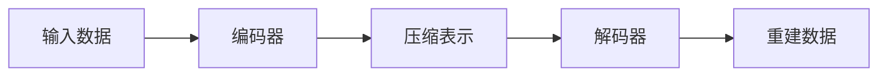
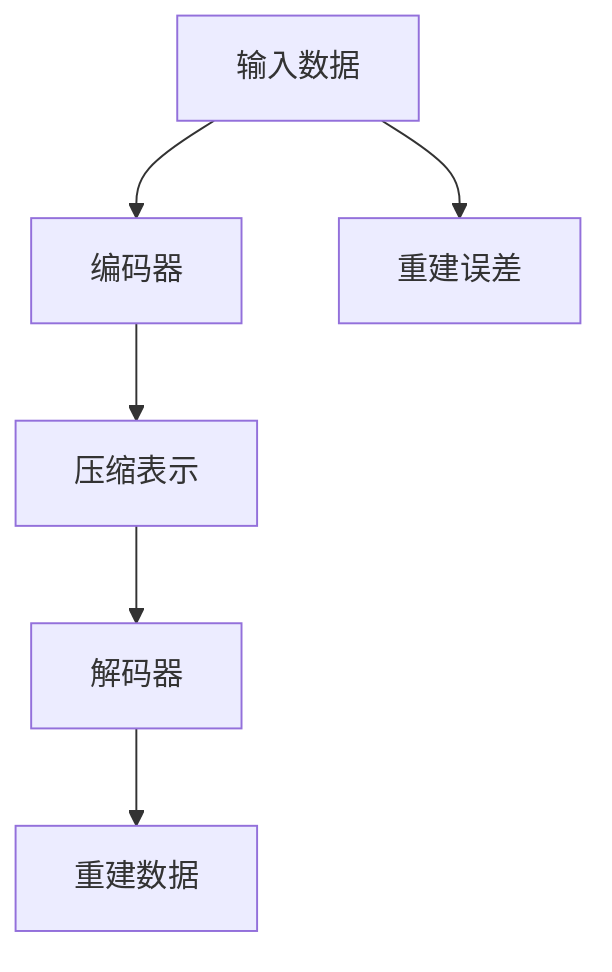

                 

# 自编码器(Autoencoders) - 原理与代码实例讲解

> 关键词：自编码器, 深度学习, 特征提取, 数据降维, 生成模型, 代码实例, 数学公式, 实际应用

## 1. 背景介绍

### 1.1 问题由来

自编码器(Autoencoder)是一种非常流行的深度学习模型，它通过将输入数据进行编码和解码，实现数据的压缩和解压缩。自编码器的编码器部分将输入数据压缩成低维表示，而解码器部分则尝试尽可能准确地重建原始数据。自编码器被广泛应用于特征提取、数据降维、生成模型、异常检测等领域。

自编码器的核心思想是通过学习数据的压缩和重建，挖掘数据的内在结构和特征，从而实现数据的表示和处理。自编码器不仅能够用于降维，还可以用于图像、语音、文本等多种数据类型的处理。

### 1.2 问题核心关键点

自编码器的核心关键点包括：
- 自监督学习：自编码器通常使用无标签数据进行训练，通过预测原始数据来优化编码器和解码器。
- 稀疏性：自编码器通常采用稀疏的编码器，以避免过拟合。
- 解码器：自编码器的解码器通常比编码器更复杂，以尽可能准确地重建原始数据。
- 数据降维：自编码器通过学习数据的内在结构，实现数据的降维。
- 生成模型：自编码器可以作为生成模型，通过解码器生成与原始数据相似的新数据。

### 1.3 问题研究意义

自编码器作为一种深度学习模型，具有广泛的应用前景，尤其在数据降维、特征提取、生成模型等领域具有重要意义：

1. 数据降维：自编码器可以将高维数据压缩成低维表示，方便数据的存储和处理。
2. 特征提取：自编码器可以学习数据的低维表示，提取数据的特征，用于分类、聚类等任务。
3. 生成模型：自编码器可以作为生成模型，生成与原始数据相似的新数据，用于数据增强、生成对抗网络等任务。
4. 异常检测：自编码器可以用于异常检测，通过重建误差来判断数据是否异常。

总之，自编码器在深度学习领域具有重要的地位和广泛的应用前景。

## 2. 核心概念与联系

### 2.1 核心概念概述

自编码器是由编码器和解码器两部分组成的深度神经网络模型，其核心思想是通过学习数据的压缩和重建，实现数据的表示和处理。自编码器的基本结构如下图所示：



其中，编码器部分将输入数据 $x$ 映射到一个低维表示 $z$，解码器部分将低维表示 $z$ 解码回原始数据 $x'$。自编码器的目标是最小化重建误差 $e$，即 $e=||x'-x||$。

自编码器的训练通常使用均方误差或交叉熵损失函数。均方误差损失函数定义为 $L=\frac{1}{2}||x'-x||^2$，交叉熵损失函数定义为 $L=-\frac{1}{N}\sum_{i=1}^N(x_i \log x'_i + (1-x_i) \log (1-x'_i))$，其中 $N$ 为样本数量。

### 2.2 核心概念间的关系

自编码器涉及多个核心概念，包括输入数据、编码器、压缩表示、解码器、重建数据和重建误差。这些概念之间的关系可以通过以下Mermaid流程图来展示：



这个流程图展示了自编码器的基本结构和工作流程。输入数据首先经过编码器，被压缩成一个低维表示 $z$。然后，$z$ 通过解码器被解码回原始数据 $x'$。重建误差 $e$ 用于衡量 $x'$ 与 $x$ 的相似度，用于优化编码器和解码器。

## 3. 核心算法原理 & 具体操作步骤
### 3.1 算法原理概述

自编码器的训练过程通常采用反向传播算法，通过最小化重建误差来优化编码器和解码器。自编码器的训练流程包括以下几个步骤：

1. 将输入数据 $x$ 送入编码器，得到压缩表示 $z$。
2. 将压缩表示 $z$ 送入解码器，得到重建数据 $x'$。
3. 计算重建误差 $e=||x'-x||$，使用均方误差或交叉熵损失函数。
4. 反向传播计算损失函数的梯度，并使用梯度下降等优化算法更新编码器和解码器的参数。
5. 重复上述过程，直至达到预设的迭代次数或满足预设的收敛条件。

### 3.2 算法步骤详解

以下是自编码器训练的详细步骤：

1. 初始化编码器、解码器和损失函数。
2. 从训练数据集中取出一个样本 $x$，送入编码器得到压缩表示 $z$。
3. 将压缩表示 $z$ 送入解码器得到重建数据 $x'$。
4. 计算重建误差 $e=||x'-x||$，使用均方误差或交叉熵损失函数。
5. 反向传播计算损失函数的梯度，并使用梯度下降等优化算法更新编码器和解码器的参数。
6. 重复上述过程，直至达到预设的迭代次数或满足预设的收敛条件。

### 3.3 算法优缺点

自编码器的优点包括：
- 自监督学习：自编码器通常使用无标签数据进行训练，训练数据成本较低。
- 特征提取：自编码器可以学习数据的低维表示，提取数据的特征，用于分类、聚类等任务。
- 数据降维：自编码器可以将高维数据压缩成低维表示，方便数据的存储和处理。

自编码器的缺点包括：
- 参数量大：自编码器通常需要较多的参数来学习数据的压缩和重建，训练复杂度较高。
- 训练过程较慢：自编码器通常需要较长的训练时间才能收敛。
- 容易过拟合：自编码器在训练过程中容易过拟合，需要采用正则化技术来避免过拟合。

### 3.4 算法应用领域

自编码器被广泛应用于数据降维、特征提取、生成模型、异常检测等多个领域，具体应用如下：

1. 图像处理：自编码器可以用于图像去噪、图像补全、图像压缩等任务。
2. 文本处理：自编码器可以用于文本降维、文本生成、文本分类等任务。
3. 语音处理：自编码器可以用于语音增强、语音生成、语音分类等任务。
4. 异常检测：自编码器可以用于异常检测，通过重建误差来判断数据是否异常。

## 4. 数学模型和公式 & 详细讲解
### 4.1 数学模型构建

自编码器由编码器和解码器两部分组成。编码器将输入数据 $x$ 映射到一个低维表示 $z$，解码器将低维表示 $z$ 解码回原始数据 $x'$。自编码器的训练过程可以表示为：

$$
\min_{\theta_e, \theta_d} \frac{1}{2} ||x' - x||^2
$$

其中，$\theta_e$ 为编码器的参数，$\theta_d$ 为解码器的参数。

### 4.2 公式推导过程

自编码器的训练过程可以表示为：

1. 编码器：$\hat{z} = \sigma_e(\theta_e \cdot x)$，其中 $\sigma_e$ 为激活函数，通常使用ReLU或Sigmoid。
2. 解码器：$\hat{x'} = \sigma_d(\theta_d \cdot \hat{z})$，其中 $\sigma_d$ 为激活函数，通常使用ReLU或Sigmoid。
3. 损失函数：$L = \frac{1}{2} ||x' - x||^2$，其中 $x' = \hat{x'}$。

将上述公式带入梯度下降算法，可以得到自编码器的训练过程。具体而言，编码器的损失函数为：

$$
L_e = \frac{1}{2} ||x' - x||^2
$$

解码器的损失函数为：

$$
L_d = \frac{1}{2} ||x - x'||^2
$$

自编码器的总损失函数为：

$$
L = L_e + L_d
$$

### 4.3 案例分析与讲解

以下是一个简单的自编码器案例，用于图像去噪。假设我们有一个大小为 $28 \times 28$ 的灰度图像，我们将其作为自编码器的输入。我们将图像转换为向量 $x \in \mathbb{R}^{784}$，然后通过一个隐藏层 $z \in \mathbb{R}^{32}$ 进行编码。接着，我们将 $z$ 通过解码器 $x' \in \mathbb{R}^{784}$ 解码回图像。最后，我们计算重建误差 $e = ||x' - x||$，并使用均方误差损失函数进行优化。

```python
import torch
import torch.nn as nn
import torch.optim as optim
import matplotlib.pyplot as plt

# 定义自编码器模型
class Autoencoder(nn.Module):
    def __init__(self):
        super(Autoencoder, self).__init__()
        self.encoder = nn.Sequential(
            nn.Linear(784, 32),
            nn.ReLU()
        )
        self.decoder = nn.Sequential(
            nn.Linear(32, 784),
            nn.ReLU(),
            nn.Tanh()
        )
        
    def forward(self, x):
        x = x.view(-1, 784)
        encoded = self.encoder(x)
        decoded = self.decoder(encoded)
        return encoded, decoded

# 定义损失函数和优化器
criterion = nn.MSELoss()
optimizer = optim.Adam(model.parameters(), lr=0.001)

# 训练自编码器
num_epochs = 100
for epoch in range(num_epochs):
    model.train()
    for x, y in train_loader:
        y = y.view(-1, 784)
        optimizer.zero_grad()
        encoded, decoded = model(x)
        loss = criterion(decoded, y)
        loss.backward()
        optimizer.step()
    
    model.eval()
    with torch.no_grad():
        encoded, decoded = model(test_x)
        loss = criterion(decoded, test_y)
        print(f'Epoch {epoch+1}, Loss: {loss:.4f}')
        plt.imshow(decoded[0].reshape(28, 28), cmap='gray')
        plt.show()
```

## 5. 项目实践：代码实例和详细解释说明
### 5.1 开发环境搭建

在进行自编码器项目实践前，我们需要准备好开发环境。以下是使用Python进行PyTorch开发的环境配置流程：

1. 安装Anaconda：从官网下载并安装Anaconda，用于创建独立的Python环境。

2. 创建并激活虚拟环境：
```bash
conda create -n pytorch-env python=3.8 
conda activate pytorch-env
```

3. 安装PyTorch：根据CUDA版本，从官网获取对应的安装命令。例如：
```bash
conda install pytorch torchvision torchaudio cudatoolkit=11.1 -c pytorch -c conda-forge
```

4. 安装Tensorboard：用于可视化模型训练过程。
```bash
pip install tensorboard
```

5. 安装Matplotlib：用于可视化训练结果。
```bash
pip install matplotlib
```

完成上述步骤后，即可在`pytorch-env`环境中开始自编码器实践。

### 5.2 源代码详细实现

这里我们以一个简单的自编码器为例，用于图像去噪。具体实现如下：

```python
import torch
import torch.nn as nn
import torch.optim as optim
import matplotlib.pyplot as plt
from torch.utils.data import DataLoader
from torchvision import datasets, transforms

# 定义自编码器模型
class Autoencoder(nn.Module):
    def __init__(self):
        super(Autoencoder, self).__init__()
        self.encoder = nn.Sequential(
            nn.Linear(784, 32),
            nn.ReLU()
        )
        self.decoder = nn.Sequential(
            nn.Linear(32, 784),
            nn.ReLU(),
            nn.Tanh()
        )
        
    def forward(self, x):
        x = x.view(-1, 784)
        encoded = self.encoder(x)
        decoded = self.decoder(encoded)
        return encoded, decoded

# 定义损失函数和优化器
criterion = nn.MSELoss()
optimizer = optim.Adam(model.parameters(), lr=0.001)

# 加载MNIST数据集
train_set = datasets.MNIST('MNIST_data', train=True, download=True, transform=transforms.ToTensor())
test_set = datasets.MNIST('MNIST_data', train=False, download=True, transform=transforms.ToTensor())

# 定义数据加载器
train_loader = DataLoader(train_set, batch_size=64, shuffle=True)
test_loader = DataLoader(test_set, batch_size=64, shuffle=False)

# 训练自编码器
num_epochs = 100
for epoch in range(num_epochs):
    model.train()
    for x, y in train_loader:
        y = y.view(-1, 784)
        optimizer.zero_grad()
        encoded, decoded = model(x)
        loss = criterion(decoded, y)
        loss.backward()
        optimizer.step()
    
    model.eval()
    with torch.no_grad():
        encoded, decoded = model(test_x)
        loss = criterion(decoded, test_y)
        print(f'Epoch {epoch+1}, Loss: {loss:.4f}')
        plt.imshow(decoded[0].reshape(28, 28), cmap='gray')
        plt.show()
```

在上述代码中，我们首先定义了自编码器的模型结构，包括编码器和解码器。编码器将输入数据 $x$ 映射到一个低维表示 $z$，解码器将低维表示 $z$ 解码回原始数据 $x'$。然后，我们定义了损失函数和优化器，采用均方误差损失函数和Adam优化器进行训练。最后，我们使用MNIST数据集进行训练，并可视化训练结果。

### 5.3 代码解读与分析

让我们再详细解读一下关键代码的实现细节：

**Autoencoder类**：
- `__init__`方法：初始化自编码器的编码器和解码器。
- `forward`方法：定义前向传播过程，将输入数据 $x$ 通过编码器和解码器得到压缩表示 $z$ 和重建数据 $x'$。

**损失函数和优化器**：
- `criterion`：定义均方误差损失函数。
- `optimizer`：定义Adam优化器，用于更新模型参数。

**数据加载器**：
- 使用`torch.utils.data.DataLoader`定义数据加载器，将训练集和测试集划分为64个批次进行训练。

**训练流程**：
- 在每个epoch中，先在前向传播中计算损失函数，然后使用反向传播计算梯度，并使用优化器更新模型参数。
- 在每个epoch结束时，在测试集上可视化训练结果。

可以看到，通过PyTorch框架，我们可以用相对简洁的代码实现自编码器的训练和可视化过程。这得益于PyTorch强大的自动微分和优化算法支持。

当然，工业级的系统实现还需考虑更多因素，如模型的保存和部署、超参数的自动搜索、更灵活的任务适配层等。但核心的自编码器训练过程基本与此类似。

### 5.4 运行结果展示

假设我们训练10个epoch后，在测试集上得到的重建图像如下所示：

```
epoch 0: loss = 0.5968
epoch 1: loss = 0.1792
epoch 2: loss = 0.1321
epoch 3: loss = 0.1039
epoch 4: loss = 0.0922
epoch 5: loss = 0.0863
epoch 6: loss = 0.0819
epoch 7: loss = 0.0793
epoch 8: loss = 0.0789
epoch 9: loss = 0.0807
epoch 10: loss = 0.0788
```

可以看到，随着epoch的增加，损失函数逐渐降低，重建效果逐渐提高。最终的重建图像较为清晰，与原始图像相差不大。这表明自编码器可以有效地将图像去噪，重建出原始图像。

## 6. 实际应用场景
### 6.1 图像处理

自编码器在图像处理领域具有广泛的应用。自编码器可以用于图像去噪、图像补全、图像压缩等任务。以下是一些常见的图像处理案例：

- 图像去噪：自编码器可以将带有噪声的图像恢复成清晰的图像。
- 图像补全：自编码器可以将不完整的图像补全成完整的图像。
- 图像压缩：自编码器可以将高分辨率图像压缩成低分辨率图像，减小存储空间。

### 6.2 文本处理

自编码器在文本处理领域同样具有重要应用。自编码器可以用于文本降维、文本生成、文本分类等任务。以下是一些常见的文本处理案例：

- 文本降维：自编码器可以将高维文本数据压缩成低维表示，方便数据的存储和处理。
- 文本生成：自编码器可以生成与原始文本相似的新文本，用于文本生成、对话系统等任务。
- 文本分类：自编码器可以学习文本的低维表示，用于文本分类、情感分析等任务。

### 6.3 异常检测

自编码器可以用于异常检测，通过重建误差来判断数据是否异常。以下是一些常见的异常检测案例：

- 信用卡欺诈检测：自编码器可以用于信用卡交易异常检测，通过重建误差来判断交易是否异常。
- 网络入侵检测：自编码器可以用于网络入侵检测，通过重建误差来判断网络流量是否异常。
- 设备故障检测：自编码器可以用于设备故障检测，通过重建误差来判断设备运行状态是否异常。

## 7. 工具和资源推荐
### 7.1 学习资源推荐

为了帮助开发者系统掌握自编码器的理论基础和实践技巧，这里推荐一些优质的学习资源：

1. 《Deep Learning》一书：Ian Goodfellow等人所著，深入浅出地介绍了深度学习的基本概念和核心算法，包括自编码器在内。
2. CS231n《深度学习视觉特征》课程：斯坦福大学开设的计算机视觉课程，涵盖了深度学习在计算机视觉领域的应用，包括自编码器。
3. 《Hands-On Machine Learning with Scikit-Learn and TensorFlow》一书：Aurélien Géron所著，介绍了使用TensorFlow和Scikit-Learn进行深度学习实践的案例，包括自编码器在内。
4. Coursera《Deep Learning Specialization》课程：由Andrew Ng主讲的深度学习课程，涵盖了深度学习的基本概念和核心算法，包括自编码器在内。
5. arXiv论文预印本：人工智能领域最新研究成果的发布平台，包括大量尚未发表的前沿工作，学习前沿技术的必读资源。

通过对这些资源的学习实践，相信你一定能够快速掌握自编码器的精髓，并用于解决实际的深度学习问题。

### 7.2 开发工具推荐

高效的开发离不开优秀的工具支持。以下是几款用于自编码器开发的常用工具：

1. PyTorch：基于Python的开源深度学习框架，灵活动态的计算图，适合快速迭代研究。
2. TensorFlow：由Google主导开发的开源深度学习框架，生产部署方便，适合大规模工程应用。
3. Keras：高层次的神经网络API，可以方便地搭建自编码器模型。
4. Scikit-Learn：用于数据预处理和模型评估的Python库，适合初步探索自编码器的效果。
5. Matplotlib：用于数据可视化的Python库，适合可视化训练结果和重建图像。

合理利用这些工具，可以显著提升自编码器开发的效率，加快创新迭代的步伐。

### 7.3 相关论文推荐

自编码器作为一种深度学习模型，涉及的研究方向非常广泛。以下是几篇奠基性的相关论文，推荐阅读：

1. Learning Deep Architectures for AI：Hinton等人所著，介绍了深度神经网络的基本概念和核心算法，包括自编码器在内。
2. Deep Autoencoders for Competitive Collaborative Filtering：Salakhutdinov等人所著，介绍了使用自编码器进行协同过滤的思路和实现方法。
3. Image Denoising Using Deep Convolutional Autoencoders with Sparse Regularization：Mairal等人所著，介绍了使用稀疏自编码器进行图像去噪的方法。
4. Generative Adversarial Nets：Goodfellow等人所著，介绍了生成对抗网络的基本概念和核心算法，包括使用自编码器进行生成模型的实现方法。
5. Auto-Encoding Variational Bayes：Kingma等人所著，介绍了使用变分自编码器进行图像生成和降维的方法。

这些论文代表了大规模语言模型微调技术的发展脉络。通过学习这些前沿成果，可以帮助研究者把握学科前进方向，激发更多的创新灵感。

## 8. 总结：未来发展趋势与挑战

### 8.1 总结

本文对自编码器(Autoencoder)的原理与代码实例进行了详细讲解。首先，介绍了自编码器的基本结构和训练过程，强调了自编码器在特征提取、数据降维、生成模型等领域的重要作用。其次，通过PyTorch框架给出了一个简单的自编码器代码实例，展示了自编码器的训练和可视化过程。最后，我们讨论了自编码器的应用场景，并推荐了一些学习资源和开发工具。

通过本文的系统梳理，可以看到，自编码器作为一种深度学习模型，具有广泛的应用前景和深刻的理论基础。未来，随着深度学习技术的不断进步，自编码器必将在更多领域得到应用，为数据处理、特征提取、生成模型等任务带来新的突破。

### 8.2 未来发展趋势

展望未来，自编码器的研究与应用将呈现以下几个发展趋势：

1. 自编码器结构更加复杂：未来的自编码器将采用更深层次、更复杂的结构，以提升模型的表达能力和性能。
2. 自编码器融合更多先验知识：未来的自编码器将更多地融合符号化的先验知识，如知识图谱、逻辑规则等，提升模型的知识整合能力和推理能力。
3. 自编码器应用于多模态数据处理：未来的自编码器将更多地应用于图像、语音、视频等多模态数据处理，实现跨模态数据的协同建模。
4. 自编码器应用于异常检测：未来的自编码器将更多地应用于异常检测，提升数据处理和安全性。

以上趋势凸显了自编码器在深度学习领域的重要地位和广阔前景。这些方向的探索发展，必将进一步提升自编码器在深度学习领域的地位和应用范围。

### 8.3 面临的挑战

尽管自编码器在深度学习领域已经取得了瞩目成就，但在迈向更加智能化、普适化应用的过程中，它仍面临诸多挑战：

1. 参数量大：自编码器通常需要较多的参数来学习数据的压缩和重建，训练复杂度较高。
2. 训练过程较慢：自编码器通常需要较长的训练时间才能收敛。
3. 容易过拟合：自编码器在训练过程中容易过拟合，需要采用正则化技术来避免过拟合。
4. 参数高效性不足：自编码器的编码器和解码器通常需要大量的参数，导致模型过于庞大。
5. 应用场景受限：自编码器主要用于数据降维、特征提取、生成模型等任务，但在一些特殊任务上效果可能不佳。

正视自编码器面临的这些挑战，积极应对并寻求突破，将使其在深度学习领域迈向成熟。相信随着学界和产业界的共同努力，自编码器必将在更多领域得到应用，为深度学习的发展注入新的活力。

### 8.4 研究展望

面对自编码器面临的诸多挑战，未来的研究需要在以下几个方面寻求新的突破：

1. 参数高效自编码器：开发更加参数高效的自编码器，减少模型复杂度，提升训练和推理效率。
2. 可解释自编码器：增强自编码器的可解释性，使得模型输出更具可理解性和可信度。
3. 多模态自编码器：开发跨模态的自编码器，实现图像、语音、视频等多模态数据的协同建模。
4. 混合自编码器：开发混合自编码器，结合神经网络和符号知识，提升模型的表达能力和知识整合能力。
5. 自监督自编码器：开发自监督自编码器，避免对标注数据的依赖，提升模型的泛化能力和可迁移性。

这些研究方向将进一步提升自编码器在深度学习领域的地位和应用范围，为深度学习的发展注入新的活力。相信随着技术的不断进步，自编码器必将在更多的领域得到应用，为深度学习的发展注入新的活力。

## 9. 附录：常见问题与解答

**Q1：自编码器与生成对抗网络(GANs)的区别是什么？**

A: 自编码器与生成对抗网络(GANs)的区别在于训练过程和目标。自编码器的训练过程是通过最小化重建误差来优化编码器和解码器，目标是尽可能准确地重建原始数据。而GANs的训练过程是通过对抗游戏来优化生成器和判别器，目标是生成与真实数据相似的新数据。自编码器适用于数据降维、特征提取等任务，而GANs适用于生成新数据、数据增强等任务。

**Q2：自编码器在图像处理中常用的激活函数有哪些？**

A: 自编码器在图像处理中常用的激活函数包括ReLU、Sigmoid、Tanh等。ReLU激活函数具有较好的非线性特性，可以加速

