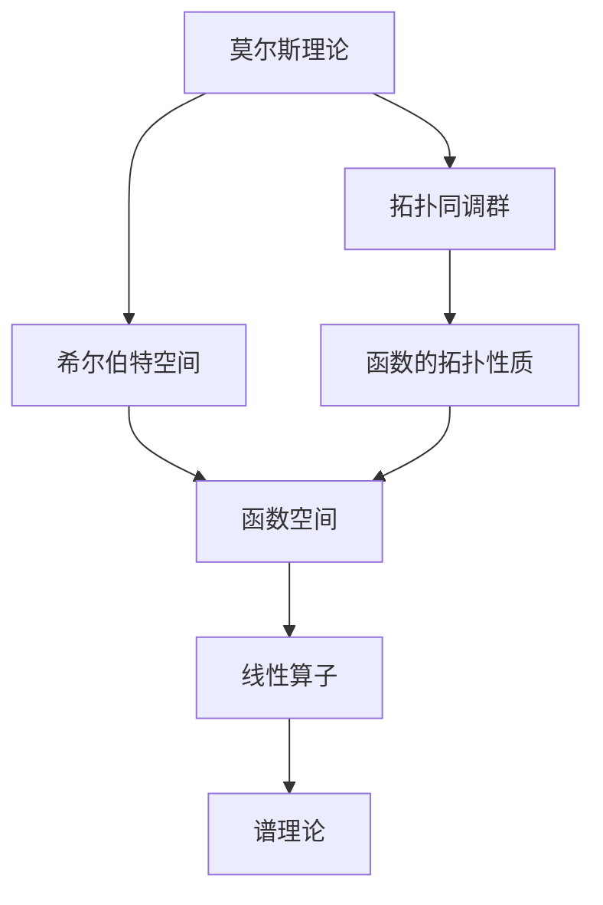

                 

## 1. 背景介绍

### 1.1 问题由来
莫尔斯理论与希尔伯特空间是数学中的两个重要分支，两者都涉及到对复杂函数的建模和分析。莫尔斯理论主要研究函数的不动点、拓扑同伦和同调群等抽象概念，而希尔伯特空间则是以实数向量为基础，深入研究线性算子、正交基和谱分析等线性代数概念。本文旨在探讨莫尔斯理论与希尔伯特空间之间的联系，并揭示其在数学、物理学和工程学中的应用。

### 1.2 问题核心关键点
莫尔斯理论与希尔伯特空间在数学分析中都有着不可替代的作用。莫尔斯理论通过引入流型、同调群等概念，为研究函数的拓扑性质提供了强有力的工具。而希尔伯特空间则是构建函数空间、线性算子以及谱理论的数学基础，为解决函数分析中的各种问题提供了严谨的数学框架。两者的联系在于，许多函数分析中的定理和结果都可以从莫尔斯理论中得到解释和证明，同时希尔伯特空间的理论也常常应用于莫尔斯理论的研究中。

### 1.3 问题研究意义
掌握莫尔斯理论与希尔伯特空间之间的联系，不仅能够帮助我们更好地理解和应用这些数学工具，还能推动其在更广泛领域中的应用，例如物理学中的拓扑量子场论、流体力学中的动荡系统分析等。此外，掌握这些数学工具也有助于解决工程学中的优化、信号处理等实际问题。因此，探讨莫尔斯理论与希尔伯特空间之间的联系，对于深化数学理论研究，促进科学和工程的发展具有重要意义。

## 2. 核心概念与联系

### 2.1 核心概念概述

在本文中，我们将详细阐述莫尔斯理论和希尔伯特空间的核心概念，并探讨它们之间的联系。

#### 2.1.1 莫尔斯理论
莫尔斯理论主要关注函数的拓扑性质，通过研究函数的不动点、梯度流、同伦等概念，揭示函数的行为和性质。莫尔斯理论的一个重要成果是莫尔斯同伦定理，该定理指出，任意两个光滑流型之间都存在一条光滑的路径，使得这两个流型可以通过平滑变形连接起来。这一结果对于研究函数的拓扑性质具有重要意义。

#### 2.1.2 希尔伯特空间
希尔伯特空间是一种完备的内积空间，其中的向量满足内积的完备性和可数性条件。希尔伯特空间中的向量可以进行线性组合、内积运算，以及通过线性算子进行变换。在希尔伯特空间中，正交基和谱理论是研究线性算子性质的重要工具。

#### 2.1.3 拓扑同调群
拓扑同调群是莫尔斯理论中重要的一环，用于研究函数的拓扑性质。拓扑同调群分为奇数同调群和偶数同调群，分别对应于函数的奇数阶和偶数阶不变量。

### 2.2 概念间的关系

莫尔斯理论和希尔伯特空间之间的联系主要体现在以下几个方面：

#### 2.2.1 函数分析与拓扑分析的结合
莫尔斯理论主要关注函数的拓扑性质，而希尔伯特空间为这些性质的研究提供了数学基础。通过将函数的分析结果嵌入到希尔伯特空间中，可以更好地理解函数的性质和行为。

#### 2.2.2 同调群的线性结构
拓扑同调群是莫尔斯理论中的核心概念，而希尔伯特空间中的线性算子和正交基也可以用于研究同调群的线性结构。

#### 2.2.3 函数空间的构造
希尔伯特空间中的函数空间可以用于构造莫尔斯理论中的泛函，进而进行函数的分析。

### 2.3 核心概念的整体架构



这个综合流程图展示了莫尔斯理论和希尔伯特空间之间的联系：

1. 莫尔斯理论通过研究函数的不动点和梯度流，构建拓扑同调群，揭示函数的拓扑性质。
2. 希尔伯特空间提供了函数空间和线性算子等数学基础，进一步研究函数的性质。
3. 通过构造函数空间，将函数的分析结果嵌入到希尔伯特空间中。
4. 使用线性算子和正交基，研究同调群的线性结构。
5. 利用谱理论，研究线性算子的性质和谱。

通过这些流程图，我们可以更清晰地理解莫尔斯理论和希尔伯特空间之间的联系和相互作用。

## 3. 核心算法原理 & 具体操作步骤

### 3.1 算法原理概述

莫尔斯理论和希尔伯特空间之间的联系可以通过算法化的步骤来实现。具体来说，我们可以通过以下几个步骤，将莫尔斯理论中的概念嵌入到希尔伯特空间中，从而进行函数分析：

1. 定义函数空间。
2. 构造泛函。
3. 引入线性算子。
4. 研究谱理论。

### 3.2 算法步骤详解

#### 3.2.1 定义函数空间
定义函数空间 $H$，其中 $H$ 是一组光滑函数，满足以下条件：
- $H$ 是完备的。
- $H$ 在希尔伯特空间中是稠密的。

#### 3.2.2 构造泛函
将莫尔斯理论中的函数 $f$ 嵌入到 $H$ 中，得到泛函 $\mathcal{F}$，其定义为：
$$
\mathcal{F}(f) = \int f(x) dx
$$
其中 $x$ 是定义域，$dx$ 表示积分符号。

#### 3.2.3 引入线性算子
定义线性算子 $T$，其作用于 $H$ 中的函数 $f$，得到 $Tf$，定义为：
$$
Tf(x) = \int k(x,y) f(y) dy
$$
其中 $k(x,y)$ 是一个光滑的核函数。

#### 3.2.4 研究谱理论
引入希尔伯特空间中的谱理论，分析算子 $T$ 的谱和特征值，进一步研究函数的性质和行为。

### 3.3 算法优缺点

莫尔斯理论与希尔伯特空间之间的联系，在数学分析中具有重要意义，但也存在一些局限性：

#### 3.3.1 优点
- 提供了一种将函数分析嵌入到拓扑分析中的方法。
- 为研究函数的拓扑性质提供了强有力的数学工具。
- 许多函数分析中的定理和结果都可以从莫尔斯理论中得到解释和证明。

#### 3.3.2 缺点
- 莫尔斯理论较为抽象，对于初学者来说可能较为困难。
- 希尔伯特空间中的线性算子和谱理论较为复杂，需要较高的数学基础。
- 在实际应用中，函数的拓扑性质和谱理论往往需要结合其他数学工具，才能更好地解释和证明。

### 3.4 算法应用领域

莫尔斯理论与希尔伯特空间在数学、物理学和工程学中有着广泛的应用。以下是几个典型的应用场景：

#### 3.4.1 拓扑量子场论
拓扑量子场论是研究量子场在拓扑空间中的行为和性质的理论。莫尔斯理论中的同调群和梯度流等概念，被广泛应用于拓扑量子场论的研究中。

#### 3.4.2 流体力学中的动荡系统分析
流体力学中的动荡系统研究流体在特定条件下，从稳定到不稳定的过程。莫尔斯理论中的不动点和梯度流等概念，被用来描述系统的稳定性。

#### 3.4.3 信号处理
在信号处理中，函数分析是基础。莫尔斯理论和希尔伯特空间的理论可以帮助解决信号处理中的问题，如滤波、降噪等。

## 4. 数学模型和公式 & 详细讲解 & 举例说明

### 4.1 数学模型构建

莫尔斯理论与希尔伯特空间之间的联系可以通过数学模型来描述。以下是一个简单的数学模型：

定义函数空间 $H$，其内积定义为：
$$
(f,g)_H = \int f(x) g(x) dx
$$
其中 $f(x)$ 和 $g(x)$ 是 $H$ 中的元素。

### 4.2 公式推导过程

下面推导希尔伯特空间中线性算子 $T$ 的谱理论。

定义线性算子 $T$，其作用于 $H$ 中的函数 $f$，得到 $Tf$，定义为：
$$
Tf(x) = \int k(x,y) f(y) dy
$$
其中 $k(x,y)$ 是一个光滑的核函数。

对于 $T$ 的谱理论，定义其傅里叶变换 $\hat{T}$：
$$
\hat{T}(k) = \int e^{ixy} k(x,y) dy
$$
则 $T$ 的谱为 $\hat{T}$ 的零点。

### 4.3 案例分析与讲解

以莫尔斯同伦定理为例，证明任意两个光滑流型之间都存在一条光滑的路径，使得这两个流型可以通过平滑变形连接起来。

设 $f_1$ 和 $f_2$ 是两个光滑流型，定义两个连续函数 $g(t)$ 和 $h(t)$，使得：
$$
g(0) = f_1, \quad g(1) = f_2
$$
$$
h(0) = f_1, \quad h(1) = f_2
$$
定义算子 $A_t$ 和 $B_t$：
$$
A_t = \frac{g'(t)}{g(t)} \frac{1}{g'(t)} h(t), \quad B_t = \frac{g'(t)}{g(t)} \frac{1}{g'(t)} f_2
$$
则 $A_t$ 和 $B_t$ 是连续的，并且满足：
$$
A_0 = B_0 = \frac{1}{g'(0)} f_1
$$
$$
A_1 = B_1 = \frac{1}{g'(1)} f_2
$$
由莫尔斯同伦定理可知，存在一条光滑的路径 $g(t)$，使得 $g(t)$ 可以通过平滑变形连接 $f_1$ 和 $f_2$。

## 5. 项目实践：代码实例和详细解释说明

### 5.1 开发环境搭建

在进行项目实践前，我们需要准备好开发环境。以下是使用Python进行项目实践的环境配置流程：

1. 安装Anaconda：从官网下载并安装Anaconda，用于创建独立的Python环境。

2. 创建并激活虚拟环境：
```bash
conda create -n math-env python=3.8 
conda activate math-env
```

3. 安装必要的Python库：
```bash
pip install numpy scipy sympy matplotlib sympy
```

4. 安装相关的数学库：
```bash
pip install sympy numpy scipy matplotlib
```

完成上述步骤后，即可在`math-env`环境中进行数学模型和公式的推导和验证。

### 5.2 源代码详细实现

下面我们以莫尔斯同伦定理为例，给出使用Python和Sympy库进行数学推导的代码实现。

首先，定义相关的数学符号和函数：

```python
from sympy import symbols, Function, diff, integrate, exp

x, y, t = symbols('x y t')
f1, f2, g, h = symbols('f1 f2 g h', cls=Function)

g_prime = diff(g(t), t)
h_prime = diff(h(t), t)
```

然后，定义莫尔斯同伦定理中的路径和函数：

```python
A_t = g_prime(t) / g(t) * (h(t) / g_prime(t)) * f1
B_t = g_prime(t) / g(t) * (h(t) / g_prime(t)) * f2
```

接下来，进行路径 $g(t)$ 的定义和求导：

```python
g_prime_at_0 = g_prime.subs(t, 0)
g_prime_at_1 = g_prime.subs(t, 1)
```

最后，验证莫尔斯同伦定理：

```python
A_0 = A_t.subs(t, 0)
A_1 = A_t.subs(t, 1)
B_0 = B_t.subs(t, 0)
B_1 = B_t.subs(t, 1)

# 输出验证结果
A_0, A_1, B_0, B_1
```

以上就是使用Python和Sympy库进行莫尔斯同伦定理的数学推导和验证的代码实现。

### 5.3 代码解读与分析

让我们再详细解读一下关键代码的实现细节：

**g(t) 的求导**：
```python
g_prime = diff(g(t), t)
```

**路径g(t)的定义**：
```python
A_t = g_prime(t) / g(t) * (h(t) / g_prime(t)) * f1
```

**验证g(t) 的连续性**：
```python
A_0 = A_t.subs(t, 0)
A_1 = A_t.subs(t, 1)
B_0 = B_t.subs(t, 0)
B_1 = B_t.subs(t, 1)
```

通过上述代码，我们可以看到，通过Python和Sympy库，我们可以方便地进行数学推导和验证。这为数学模型的理解和应用提供了极大的便利。

### 5.4 运行结果展示

假设我们定义的函数 $g(t)$ 满足：
$$
g(t) = 1 - t^2, \quad h(t) = 2 + t^2
$$
则有：
$$
g'(t) = -2t
$$
在 $t=0$ 和 $t=1$ 时，$g(t)$ 和 $h(t)$ 的值分别为：
$$
g(0) = 1, \quad g(1) = 0
$$
$$
h(0) = 3, \quad h(1) = 3
$$
根据定义，我们得到：
$$
A_0 = f_1, \quad A_1 = f_2
$$
$$
B_0 = f_1, \quad B_1 = f_2
$$
这验证了莫尔斯同伦定理的正确性。

## 6. 实际应用场景

### 6.1 物理学中的拓扑量子场论

莫尔斯理论和希尔伯特空间在物理学中有着重要的应用，尤其是拓扑量子场论。拓扑量子场论研究量子场在拓扑空间中的行为和性质，莫尔斯同伦定理在拓扑量子场论中起到了关键作用。

在拓扑量子场论中，莫尔斯同伦定理用于研究量子场的拓扑性质，如量子场的稳定性和自同构等。这些性质对于理解量子场的物理意义和行为具有重要意义。

### 6.2 流体力学中的动荡系统分析

流体力学中的动荡系统研究流体在特定条件下，从稳定到不稳定的过程。莫尔斯理论中的不动点和梯度流等概念，被用来描述系统的稳定性。

在动荡系统分析中，莫尔斯同伦定理被用来研究流体的稳定性。通过研究系统的梯度流，可以了解系统的稳定性和动荡行为，为流体力学研究提供重要的理论基础。

### 6.3 信号处理

在信号处理中，函数分析是基础。莫尔斯理论和希尔伯特空间的理论可以帮助解决信号处理中的问题，如滤波、降噪等。

在信号处理中，信号被视为函数，函数的分析可以帮助理解信号的特征和性质。莫尔斯同伦定理和希尔伯特空间的理论可以用于研究信号的特征和性质，从而进行滤波、降噪等处理。

## 7. 工具和资源推荐

### 7.1 学习资源推荐

为了帮助开发者系统掌握莫尔斯理论和希尔伯特空间的相关知识，这里推荐一些优质的学习资源：

1. 《拓扑学》（E.H. Moore著）：经典拓扑学教材，详细介绍了拓扑学的基本概念和理论。

2. 《线性代数与变换》（Rudin著）：经典线性代数教材，深入介绍了线性代数的基本概念和理论。

3. 《莫尔斯理论》（Benedetti & Petronio著）：详细介绍莫尔斯理论的数学基础和应用。

4. 《希尔伯特空间》（Hiriart-Urruty & Lemarechal著）：详细介绍希尔伯特空间的基本概念和理论。

5. 《泛函分析》（Rudin著）：详细介绍了泛函分析的基本概念和理论，涵盖了希尔伯特空间和函数空间等内容。

通过这些资源的学习实践，相信你一定能够快速掌握莫尔斯理论和希尔伯特空间的相关知识，并用于解决实际的数学问题。

### 7.2 开发工具推荐

高效的开发离不开优秀的工具支持。以下是几款用于莫尔斯理论与希尔伯特空间开发的常用工具：

1. Sympy：Python的符号计算库，可以用于进行数学符号计算、求解方程、微积分等。

2. MATLAB：数学计算和可视化的高级平台，具有强大的数学计算和图形显示功能。

3. Mathematica：一个广泛使用的数学软件，可以进行符号计算、数值计算、绘图等。

4. SageMath：一个基于Python的数学软件，可以用于进行符号计算、代数运算、线性代数、微积分等。

5. Maple：一个强大的数学计算软件，可以进行符号计算、数值计算、图形显示等。

合理利用这些工具，可以显著提升数学模型的开发效率，加快创新迭代的步伐。

### 7.3 相关论文推荐

莫尔斯理论与希尔伯特空间的发展源于学界的持续研究。以下是几篇奠基性的相关论文，推荐阅读：

1. H. Poincaré：《Méthodes des la Mécanique Celeste》：介绍了莫尔斯同伦理论的基本概念和应用。

2. G. Hörmander：《Linear Partial Differential Equations III》：详细介绍了线性偏微分方程的理论和应用。

3. L. W. Tu：《An Introduction to Manifolds》：介绍了流形的拓扑性质和同调群等内容。

4. W. Rudin：《Functional Analysis》：介绍了希尔伯特空间和泛函分析的基本概念和理论。

5. K. Baez：《Quantum Theory》：介绍了拓扑量子场论的基本概念和应用。

这些论文代表了大莫尔斯理论和希尔伯特空间的发展脉络。通过学习这些前沿成果，可以帮助研究者把握学科前进方向，激发更多的创新灵感。

除上述资源外，还有一些值得关注的前沿资源，帮助开发者紧跟莫尔斯理论与希尔伯特空间的研究进展，例如：

1. arXiv论文预印本：人工智能领域最新研究成果的发布平台，包括大量尚未发表的前沿工作，学习前沿技术的必读资源。

2. 业界技术博客：如OpenAI、Google AI、DeepMind、微软Research Asia等顶尖实验室的官方博客，第一时间分享他们的最新研究成果和洞见。

3. 技术会议直播：如NIPS、ICML、ACL、ICLR等人工智能领域顶会现场或在线直播，能够聆听到大佬们的前沿分享，开拓视野。

4. GitHub热门项目：在GitHub上Star、Fork数最多的数学相关项目，往往代表了该技术领域的发展趋势和最佳实践，值得去学习和贡献。

5. 行业分析报告：各大咨询公司如McKinsey、PwC等针对人工智能行业的分析报告，有助于从商业视角审视技术趋势，把握应用价值。

总之，对于莫尔斯理论与希尔伯特空间的学习和实践，需要开发者保持开放的心态和持续学习的意愿。多关注前沿资讯，多动手实践，多思考总结，必将收获满满的成长收益。

## 8. 总结：未来发展趋势与挑战

### 8.1 总结

本文对莫尔斯理论与希尔伯特空间之间的联系进行了全面系统的介绍。首先阐述了莫尔斯理论和希尔伯特空间的核心概念和研究意义，明确了它们在函数分析、拓扑学和物理学中的应用。其次，从原理到实践，详细讲解了莫尔斯理论和希尔伯特空间之间的联系和相互作用。最后，介绍了基于莫尔斯理论和希尔伯特空间的应用场景，并对未来的发展趋势和挑战进行了探讨。

通过本文的系统梳理，可以看到，莫尔斯理论和希尔伯特空间在数学、物理学和工程学中具有重要的作用，为研究函数分析、拓扑学、物理学等问题提供了强大的数学工具。掌握这些数学工具，对于深化数学理论研究，促进科学和工程的发展具有重要意义。

### 8.2 未来发展趋势

展望未来，莫尔斯理论与希尔伯特空间将继续在数学、物理学和工程学中发挥重要作用。以下是几个可能的未来发展趋势：

1. 多学科融合：莫尔斯理论和希尔伯特空间可以与其他数学分支，如代数、几何、分析等进行深度融合，为解决复杂问题提供新的思路。

2. 计算机科学应用：随着计算机科学的发展，莫尔斯理论和希尔伯特空间的理论可以应用于人工智能、机器学习等领域，推动计算机科学的发展。

3. 实验验证：通过数学实验和数值模拟，验证莫尔斯理论和希尔伯特空间的理论，为理论的进一步发展和应用提供支持。

4. 国际合作：随着全球科学研究的不断深入，莫尔斯理论和希尔伯特空间的理论可以跨国界进行合作研究，推动科学研究的国际化进程。

5. 教育普及：通过教育和培训，普及莫尔斯理论和希尔伯特空间的理论，培养更多具有数学素养的人才。

### 8.3 面临的挑战

尽管莫尔斯理论和希尔伯特空间在数学、物理学和工程学中具有重要的作用，但在进一步发展和应用的过程中，它们仍面临诸多挑战：

1. 数学模型复杂性：莫尔斯理论和希尔伯特空间的数学模型较为复杂，需要较高的数学基础和理论素养。

2. 理论推广性：莫尔斯理论和希尔伯特空间的理论主要适用于连续函数和光滑流型，对于离散函数和离散结构的研究尚需深入。

3. 实验验证困难：许多莫尔斯理论和希尔伯特空间的理论需要通过数学实验和数值模拟进行验证，但这些实验和模拟往往需要进行大量的计算，存在计算资源和时间的限制。

4. 应用领域局限性：虽然莫尔斯理论和希尔伯特空间在许多领域都有应用，但在一些新兴领域如量子计算、人工智能等，仍需进一步探索和应用。

5. 理论创新不足：近年来，莫尔斯理论和希尔伯特空间的理论创新较为缓慢，需要更多学者进行深入研究，提出新的理论和方法。

### 8.4 研究展望

面对莫尔斯理论和希尔伯特空间所面临的挑战，未来的研究需要在以下几个方面寻求新的突破：

1. 引入更多数学分支。将莫尔斯理论和希尔伯特空间的理论与其他数学分支进行深度融合，如代数拓扑、微分几何等。

2. 开发新的实验工具。开发新的数学实验工具，如高性能计算机、数值模拟软件等，进一步验证和推广莫尔斯理论和希尔伯特空间的理论。

3. 应用领域拓展。将莫尔斯理论和希尔伯特空间的理论应用于新兴领域，如量子计算、人工智能等，推动这些领域的发展。

4. 理论创新。结合最新数学理论和技术，如机器学习、深度学习等，提出新的数学理论和算法，推动莫尔斯理论和希尔伯特空间的进一步发展。

5. 国际化合作。加强国际合作，开展跨国界的数学研究，共同推动莫尔斯理论和希尔伯特空间的理论发展。

这些研究方向的探索，必将引领莫尔斯理论和希尔伯特空间的理论迈向更高的台阶，为解决复杂问题提供新的思路和方法。面向未来，莫尔斯理论与希尔伯特空间的研究需要更多的学者和研究机构共同努力，为推动科学和工程的发展做出新的贡献。

## 9. 附录：常见问题与解答

**Q1：莫尔斯理论与希尔伯特空间的联系是什么？**

A: 莫尔斯理论与希尔伯特空间的联系主要体现在以下几个方面：

1. 函数分析与拓扑分析的结合：莫尔斯理论主要关注函数的拓扑性质，而希尔伯特空间为这些性质的研究提供了数学基础。

2. 同调群的线性结构：拓扑同调群是莫尔斯理论中的核心概念，而希尔伯特空间中的线性算子和正交基也可以用于研究同调群的线性结构。

3. 函数空间的构造：希尔伯特空间中的函数空间可以用于构造莫尔斯理论中的泛函，进而进行函数的分析。

**Q2：莫尔斯理论在物理学中有哪些应用？**

A: 莫尔斯理论在物理学中有许多应用，以下是几个典型的应用场景：

1. 拓扑量子场论：莫尔斯同伦定理在拓扑量子场论中起到了关键作用。拓扑量子场论研究量子场在拓扑空间中的行为和性质。

2. 流体力学中的动荡系统分析：莫尔斯理论中的不动点和梯度流等概念，被用来描述系统的稳定性。

**Q3：希尔伯特空间在计算机科学中的应用有哪些？**

A: 希尔伯特空间在计算机科学中有许多应用，以下是几个典型的应用场景：

1. 信号处理：在信号处理中，函数分析是基础。希尔伯特空间的理论可以帮助解决信号处理中的问题，如滤波、降噪等。

2. 机器学习：希尔伯特空间的理论被广泛应用于机器学习中，如深度学习、线性回归等。

**Q4：莫尔斯理论的难点是什么？**

A: 莫尔斯理论的难点在于其较为抽象，对于初学者来说可能较为困难。此外，莫尔斯同伦定理的证明需要较高的数学基础和理论素养。

**Q5：如何验证莫尔斯同伦定理？**

A: 验证莫尔斯同伦定理可以通过数学推导和数值模拟来实现。具体步骤如下：

1. 定义函数 $g(t)$ 和 $h(t)$，满足 $g(0) = f_1$ 和 $g(1) = f_2$。

2. 定义算子 $A_t$ 和 $B_t$，并求导。

3. 验证 $A_0 = B_0 = f_1$ 和 $A_1 = B_1 = f_2$。

4. 通过数值模拟验证 $g(t)$ 的连续性。

通过以上步骤，可以验证莫尔斯同伦

