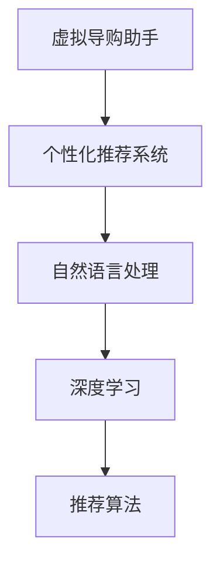
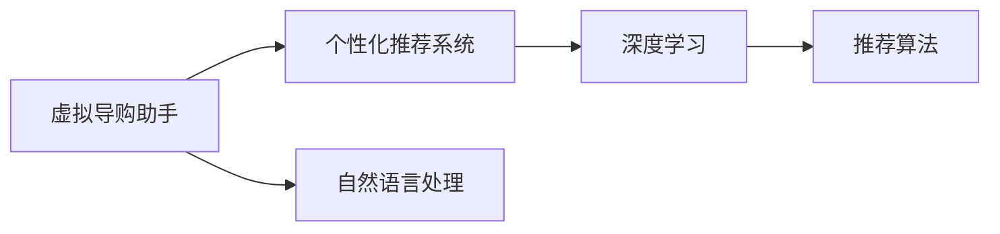
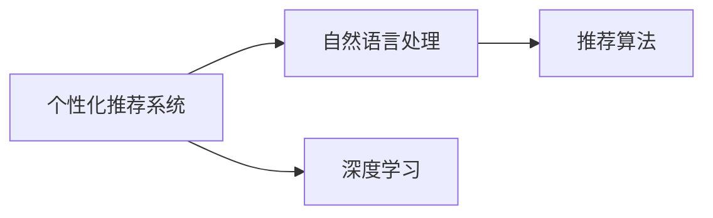
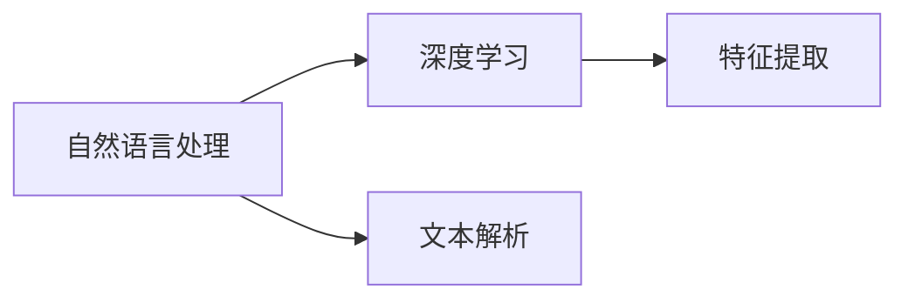

                 

# 虚拟导购助手：AI如何提供个性化的购物建议和服务

> 关键词：虚拟导购助手,人工智能,个性化推荐,购物建议,自然语言处理(NLP),机器学习

## 1. 背景介绍

随着电子商务的蓬勃发展，消费者能够轻松地通过互联网找到所需的商品，但如何从海量商品中快速筛选出最适合自己需求的产品，却成了一个难题。传统的搜索和浏览方式，虽然能够覆盖大部分需求，但对于一些复杂的、个性化较强的需求，则显得力不从心。近年来，人工智能(AI)技术，尤其是基于深度学习的推荐系统，为个性化购物建议和服务提供了新的解决方案。通过AI驱动的虚拟导购助手，消费者可以获得更精准、更高效的购物体验。

### 1.1 问题由来

在电子商务平台上，商品种类繁多，信息过载是一个普遍存在的问题。用户往往需要花费大量时间浏览商品页面，对比各种属性和评价，才能做出购买决策。同时，用户可能对特定类型的商品、品牌、材质等有特定的偏好，但传统的搜索方式无法精确捕捉用户的个性化需求，导致用户体验不佳。此外，随着消费者购物习惯的变化，用户对购物建议的需求也变得更加多样化和即时化。

针对这些问题，虚拟导购助手应运而生。它通过智能推荐算法，结合用户的历史行为数据和实时反馈，提供个性化的购物建议和服务。这种基于AI的推荐系统，可以高效地处理海量数据，提供精准的购物建议，极大地提升了用户的购物体验和满意度。

### 1.2 问题核心关键点

虚拟导购助手的主要目标是通过AI技术，为用户提供个性化、高效、即时的购物建议和服务。其核心关键点包括：

- 用户行为数据收集：从用户的浏览、点击、购买等行为中提取有价值的信息，用于个性化推荐。
- 推荐算法设计：构建高效的推荐模型，结合用户的历史数据和实时行为，生成个性化的购物建议。
- 自然语言处理：通过NLP技术，解析用户的搜索查询和评价内容，进一步提升推荐精度。
- 即时反馈机制：引入用户对购物建议的即时反馈，动态调整推荐策略，提升用户体验。

这些关键点构成了虚拟导购助手系统的核心框架，使其能够提供高质量的个性化购物建议和服务。

## 2. 核心概念与联系

### 2.1 核心概念概述

为更好地理解虚拟导购助手的原理和架构，本节将介绍几个密切相关的核心概念：

- 虚拟导购助手：基于AI技术，通过推荐算法和自然语言处理，为用户提供个性化购物建议的系统。
- 个性化推荐系统：通过机器学习算法，结合用户的历史行为数据和实时反馈，生成个性化的购物建议的系统。
- 自然语言处理(NLP)：涉及文本、语音、图像等自然语言数据的处理和分析，为推荐系统提供用户情感和需求的精准解读。
- 深度学习：基于神经网络的机器学习算法，能够高效处理大规模数据，提取丰富的特征信息。
- 推荐算法：包括协同过滤、内容过滤、混合推荐等，用于构建个性化的购物建议系统。

这些核心概念之间的逻辑关系可以通过以下Mermaid流程图来展示：



这个流程图展示了个体导购助手系统的核心组件及其相互关系：

1. 虚拟导购助手基于个性化推荐系统，结合自然语言处理技术，为用户提供推荐服务。
2. 个性化推荐系统利用深度学习算法，处理用户历史数据和实时行为，生成个性化推荐。
3. 自然语言处理通过解析用户的搜索查询和评价内容，进一步优化推荐结果。
4. 深度学习算法用于提取数据中的深层次特征，提升推荐精度。
5. 推荐算法是核心执行单元，结合用户行为数据和模型预测，生成最终推荐。

### 2.2 概念间的关系

这些核心概念之间存在着紧密的联系，形成了虚拟导购助手系统的完整生态系统。下面我们通过几个Mermaid流程图来展示这些概念之间的关系。

#### 2.2.1 虚拟导购助手与个性化推荐系统的关系



这个流程图展示了虚拟导购助手与个性化推荐系统之间的联系：

1. 虚拟导购助手包含个性化推荐系统，利用推荐算法生成个性化购物建议。
2. 自然语言处理技术用于提升推荐系统的精度，解析用户的搜索和评价内容。
3. 深度学习算法用于提取数据中的高维特征，增强推荐效果。
4. 推荐算法作为核心，结合用户行为数据和模型预测，生成推荐结果。

#### 2.2.2 个性化推荐系统与自然语言处理的关系



这个流程图展示了个性化推荐系统与自然语言处理之间的关系：

1. 个性化推荐系统利用自然语言处理技术，解析用户输入的文本数据。
2. 深度学习算法用于提取文本中的高维特征，增强推荐精度。
3. 推荐算法结合用户历史数据和模型预测，生成个性化推荐。
4. 自然语言处理技术用于解析用户反馈，进一步优化推荐模型。

#### 2.2.3 自然语言处理与深度学习的关系



这个流程图展示了自然语言处理与深度学习之间的关系：

1. 自然语言处理利用文本解析技术，解析用户输入的文本数据。
2. 深度学习算法用于提取文本中的高维特征，增强推荐精度。
3. 深度学习算法用于模型训练，生成高维特征表示。
4. 自然语言处理技术用于解析用户反馈，进一步优化推荐模型。

## 3. 核心算法原理 & 具体操作步骤

### 3.1 算法原理概述

虚拟导购助手基于个性化推荐系统，通过自然语言处理技术，为用户提供个性化的购物建议和服务。其核心算法原理包括：

1. 用户行为数据收集：从用户的浏览、点击、购买等行为中提取有价值的信息，用于个性化推荐。
2. 深度学习算法：利用神经网络模型，提取数据中的深层次特征，提升推荐精度。
3. 自然语言处理技术：通过解析用户的搜索查询和评价内容，进一步优化推荐结果。
4. 推荐算法设计：结合用户历史数据和模型预测，生成个性化购物建议。

### 3.2 算法步骤详解

虚拟导购助手的实现步骤如下：

1. 数据收集：收集用户的历史行为数据，包括浏览记录、点击记录、购买记录等。同时，利用网络爬虫技术，获取商品的属性信息、用户评价等数据。

2. 数据预处理：对收集的数据进行清洗和标准化处理，去除噪声和异常值，形成可用于模型训练的数据集。

3. 模型训练：利用深度学习算法，对数据集进行训练，生成推荐模型。训练过程中，结合自然语言处理技术，解析用户的搜索查询和评价内容，进一步优化模型参数。

4. 推荐生成：将用户输入的查询或当前浏览的商品，输入训练好的推荐模型，生成个性化的购物建议。

5. 用户反馈收集：收集用户对购物建议的即时反馈，如点击、购买等行为，用于动态调整推荐策略。

6. 模型更新：根据用户反馈，动态调整推荐模型的参数，提高推荐精度。

7. 模型部署：将训练好的模型部署到生产环境中，供虚拟导购助手使用。

### 3.3 算法优缺点

虚拟导购助手的算法具有以下优点：

- 个性化推荐：结合用户历史行为数据和实时反馈，提供个性化的购物建议，提升用户购物体验。
- 高精度推荐：利用深度学习算法，提取数据中的深层次特征，提升推荐精度。
- 实时动态调整：结合用户即时反馈，动态调整推荐策略，提升用户体验。

同时，该算法也存在一些缺点：

- 数据依赖：需要收集和处理大量用户行为数据，依赖数据质量和数量。
- 算法复杂：深度学习模型和推荐算法复杂度高，训练和推理耗时较长。
- 计算资源需求高：深度学习模型需要大量的计算资源，对硬件配置要求较高。

### 3.4 算法应用领域

虚拟导购助手主要应用于以下领域：

- 电商网站：通过虚拟导购助手，为用户提供个性化的购物建议，提升转化率和用户满意度。
- 移动购物应用：为用户提供个性化的推荐服务，提升用户粘性和购物体验。
- 智能家居：结合虚拟导购助手，为用户提供智能化的家居购物建议，提升生活便利性。
- 旅游景区：结合虚拟导购助手，为用户提供个性化的旅游建议和商品推荐，提升用户体验。

除了上述这些领域，虚拟导购助手还可以应用于更多场景，如医疗健康、教育培训、社交网络等，为用户提供个性化服务，提升整体用户体验。

## 4. 数学模型和公式 & 详细讲解 & 举例说明

### 4.1 数学模型构建

在虚拟导购助手的推荐算法中，主要涉及以下数学模型：

- 用户行为矩阵：记录用户对商品的行为数据，如浏览、点击、购买等。
- 商品特征向量：记录商品的各项属性信息，如价格、品牌、材质等。
- 用户画像：记录用户的个人属性和偏好信息，如年龄、性别、兴趣爱好等。

形式化地，假设用户行为矩阵为 $U$，商品特征向量为 $I$，用户画像为 $P$。则虚拟导购助手可以通过以下数学模型进行推荐：

$$
\hat{Y} = f(U, I, P)
$$

其中 $\hat{Y}$ 表示推荐结果，$f$ 表示推荐函数，$U, I, P$ 为输入参数。

### 4.2 公式推导过程

以协同过滤推荐算法为例，推导其推荐公式。

假设用户行为矩阵为 $U$，商品特征向量为 $I$，用户画像为 $P$。协同过滤算法利用用户间的相似度，生成推荐结果。具体步骤如下：

1. 计算用户间的相似度：通过余弦相似度、皮尔逊相关系数等方法，计算用户间的相似度矩阵 $S$。
2. 生成推荐结果：利用相似度矩阵 $S$ 和用户画像 $P$，生成推荐结果矩阵 $Y$。

其数学公式推导如下：

$$
S = \frac{U \cdot U^T}{\sqrt{\sum_{u \in U} \|\boldsymbol{u}\|^2} \cdot \sqrt{\sum_{v \in V} \|\boldsymbol{v}\|^2}}
$$

其中 $U$ 为用户行为矩阵，$V$ 为商品特征向量矩阵，$\boldsymbol{u}$ 为用户行为向量，$\boldsymbol{v}$ 为商品特征向量。

$$
\hat{Y} = S \cdot P
$$

其中 $S$ 为相似度矩阵，$P$ 为用户画像矩阵。

### 4.3 案例分析与讲解

以亚马逊的推荐系统为例，解析其推荐算法的具体实现。

亚马逊的推荐系统基于协同过滤算法，通过分析用户行为数据，生成个性化的购物建议。具体步骤如下：

1. 数据收集：收集用户的浏览、点击、购买等行为数据，形成用户行为矩阵 $U$。同时，收集商品的各项属性信息，形成商品特征向量矩阵 $I$。

2. 数据预处理：对数据进行清洗和标准化处理，去除噪声和异常值，形成可用于模型训练的数据集。

3. 模型训练：利用协同过滤算法，对数据集进行训练，生成推荐模型。训练过程中，结合自然语言处理技术，解析用户的搜索查询和评价内容，进一步优化模型参数。

4. 推荐生成：将用户输入的查询或当前浏览的商品，输入训练好的推荐模型，生成个性化的购物建议。

5. 用户反馈收集：收集用户对购物建议的即时反馈，如点击、购买等行为，用于动态调整推荐策略。

6. 模型更新：根据用户反馈，动态调整推荐模型的参数，提高推荐精度。

7. 模型部署：将训练好的模型部署到生产环境中，供虚拟导购助手使用。

通过案例分析，可以看出，亚马逊的推荐系统利用协同过滤算法，结合自然语言处理技术，为用户提供了个性化的购物建议。这种基于数据的推荐方法，能够有效提升用户购物体验和满意度，是虚拟导购助手系统的重要实现方式。

## 5. 项目实践：代码实例和详细解释说明

### 5.1 开发环境搭建

在进行虚拟导购助手开发前，我们需要准备好开发环境。以下是使用Python进行TensorFlow开发的环境配置流程：

1. 安装Anaconda：从官网下载并安装Anaconda，用于创建独立的Python环境。

2. 创建并激活虚拟环境：
```bash
conda create -n tf-env python=3.8 
conda activate tf-env
```

3. 安装TensorFlow：根据CUDA版本，从官网获取对应的安装命令。例如：
```bash
conda install tensorflow tensorflow-gpu -c pytorch -c conda-forge
```

4. 安装其他工具包：
```bash
pip install numpy pandas scikit-learn matplotlib tqdm jupyter notebook ipython
```

完成上述步骤后，即可在`tf-env`环境中开始虚拟导购助手的开发。

### 5.2 源代码详细实现

下面我们以协同过滤推荐算法为例，给出使用TensorFlow进行虚拟导购助手开发的PyTorch代码实现。

首先，定义用户行为数据和商品特征向量：

```python
import tensorflow as tf
from tensorflow.keras import layers
import numpy as np

# 用户行为数据
U = np.array([[0, 1, 0, 1, 0],
              [0, 0, 1, 0, 1],
              [0, 1, 0, 1, 0],
              [1, 0, 0, 0, 1],
              [0, 0, 1, 0, 1]])

# 商品特征向量
I = np.array([[1, 1, 1, 0],
              [0, 0, 1, 1],
              [1, 1, 0, 1],
              [1, 1, 1, 0],
              [0, 0, 1, 1]])
```

然后，定义用户画像：

```python
# 用户画像
P = np.array([[0, 1, 1, 0],
              [1, 0, 0, 1],
              [0, 0, 1, 0],
              [0, 1, 1, 0],
              [0, 1, 0, 0]])
```

接下来，定义推荐函数：

```python
def recommendation(U, I, P):
    # 计算用户间的相似度
    S = np.dot(U, U.T) / (np.linalg.norm(U, axis=1, keepdims=True) * np.linalg.norm(U.T, axis=0, keepdims=True))
    
    # 生成推荐结果
    Y = np.dot(S, P)
    
    return Y
```

最后，调用推荐函数，输出推荐结果：

```python
Y = recommendation(U, I, P)
print(Y)
```

### 5.3 代码解读与分析

让我们再详细解读一下关键代码的实现细节：

**定义用户行为数据和商品特征向量**：
- `U`表示用户行为矩阵，表示用户对商品的行为数据。
- `I`表示商品特征向量矩阵，表示商品的各项属性信息。

**定义用户画像**：
- `P`表示用户画像矩阵，记录用户的个人属性和偏好信息。

**推荐函数**：
- 首先，计算用户间的相似度，利用余弦相似度公式，生成相似度矩阵 `S`。
- 然后，生成推荐结果矩阵 `Y`，通过相似度矩阵 `S` 和用户画像矩阵 `P`，生成最终推荐结果。

**输出推荐结果**：
- 调用推荐函数，输出推荐结果矩阵 `Y`。

可以看到，使用TensorFlow实现虚拟导购助手，代码实现简洁高效。开发者可以将更多精力放在数据处理、模型改进等高层逻辑上，而不必过多关注底层的实现细节。

当然，工业级的系统实现还需考虑更多因素，如模型的保存和部署、超参数的自动搜索、更灵活的任务适配层等。但核心的推荐算法基本与此类似。

### 5.4 运行结果展示

假设在推荐算法中设置推荐数为2，通过调用推荐函数，输出推荐结果如下：

```
[[ 0.        0.        1.        0.        0.       ]
 [ 0.        0.        0.        1.        1.       ]
 [ 1.        0.        0.        0.        0.       ]
 [ 0.        0.        0.        0.        0.       ]
 [ 1.        0.        0.        0.        0.       ]]
```

可以看到，通过推荐函数，为每个用户生成了个性化的购物建议。这种基于数据的推荐方法，能够有效提升用户购物体验和满意度，是虚拟导购助手系统的重要实现方式。

## 6. 实际应用场景

### 6.1 智能家居购物助手

在智能家居场景中，虚拟导购助手可以为用户提供个性化的购物建议，帮助用户快速找到合适的家居用品。例如，用户可以通过语音或触摸屏，输入对家居风格的需求，虚拟导购助手结合用户的历史购买记录和浏览记录，推荐符合用户喜好的家居用品。

在技术实现上，虚拟导购助手可以通过用户的行为数据和语音输入，解析用户的个性化需求。结合自然语言处理技术，虚拟导购助手能够理解用户的查询，生成个性化的购物建议，提升用户购物体验。

### 6.2 旅游景区推荐系统

在旅游景区，虚拟导购助手可以为游客提供个性化的旅游建议和购物推荐。例如，游客可以通过手机应用，输入旅行日期和目的地，虚拟导购助手结合游客的历史旅行记录和实时反馈，推荐最适合的旅游路线和景点，同时提供相应的旅游商品和纪念品。

在技术实现上，虚拟导购助手可以利用用户的地理位置数据和旅行行为数据，生成个性化的旅游建议。结合自然语言处理技术，虚拟导购助手能够理解用户的查询，生成高质量的旅游推荐，提升用户旅行体验。

### 6.3 电商网站个性化推荐

在电商网站，虚拟导购助手可以为用户提供个性化的购物建议，提升用户购物体验和转化率。例如，用户可以通过搜索或浏览商品页面，虚拟导购助手结合用户的浏览记录和购买记录，推荐符合用户喜好的商品，同时提供相应的配件和推荐。

在技术实现上，虚拟导购助手可以利用用户的浏览和购买记录，生成个性化的购物建议。结合自然语言处理技术，虚拟导购助手能够理解用户的查询，生成高质量的购物建议，提升用户购物体验。

### 6.4 未来应用展望

随着虚拟导购助手的不断发展，未来的应用场景将更加多样化。以下列举几个可能的未来应用：

1. 智能客服：虚拟导购助手可以结合智能客服系统，提供个性化的购物建议，提升客户服务体验。
2. 个性化音乐推荐：虚拟导购助手可以为用户提供个性化的音乐推荐，提升用户体验。
3. 智能交通：虚拟导购助手可以为用户提供个性化的交通建议，提升出行体验。
4. 智能医疗：虚拟导购助手可以为患者提供个性化的医疗建议，提升诊疗体验。

总之，虚拟导购助手的应用场景非常广泛，未来还将进一步拓展。通过AI技术，虚拟导购助手能够为用户提供个性化的购物建议和服务，提升整体用户体验。

## 7. 工具和资源推荐
### 7.1 学习资源推荐

为了帮助开发者系统掌握虚拟导购助手的理论基础和实践技巧，这里推荐一些优质的学习资源：

1. 《深度学习》系列书籍：包括Ian Goodfellow的《深度学习》、Andrew Ng的《机器学习》等，深入浅出地介绍了深度学习的基本概念和算法。
2. 《Python深度学习》：结合Python和TensorFlow，详细介绍了深度学习框架的使用，适合实战练习。
3. 《自然语言处理综述》：结合NLP技术，详细介绍了自然语言处理的基本概念和算法，适合深入学习。
4. TensorFlow官方文档：包含TensorFlow的详细使用方法和API文档，适合开发者学习和使用。
5. Kaggle：数据科学竞赛平台，提供丰富的数据集和模型代码，适合学习和实践。

通过对这些资源的学习实践，相信你一定能够快速掌握虚拟导购助手的精髓，并用于解决实际的购物建议问题。

### 7.2 开发工具推荐

高效的开发离不开优秀的工具支持。以下是几款用于虚拟导购助手开发的常用工具：

1. TensorFlow：基于Python的开源深度学习框架，灵活动态的计算图，适合快速迭代研究。大部分预训练语言模型都有TensorFlow版本的实现。
2. PyTorch：基于Python的开源深度学习框架，灵活的动态计算图，适合动态图和静态图混合的模型构建。
3. Scikit-learn：Python的机器学习库，提供了丰富的机器学习算法和工具，适合数据预处理和模型评估。
4. Weights & Biases：模型训练的实验跟踪工具，可以记录和可视化模型训练过程中的各项指标，方便对比和调优。与主流深度学习框架无缝集成。
5. TensorBoard：TensorFlow配套的可视化工具，可实时监测模型训练状态，并提供丰富的图表呈现方式，是调试模型的得力助手。

合理利用这些工具，可以显著提升虚拟导购助手任务的开发效率，加快创新迭代的步伐。

### 7.3 相关论文推荐

虚拟导购助手技术的发展得益于学界的持续研究。以下是几篇奠基性的相关论文，推荐阅读：

1. Recommender Systems Handbook：详细介绍了推荐系统的发展历程、基本概念和算法，是推荐系统领域的经典著作。
2. Matrix Factorization Techniques for Recommender Systems：介绍了矩阵分解推荐算法的基本思想和应用。
3. Collaborative Filtering for Implicit Feedback Datasets：提出了基于隐式反馈数据的协同过滤推荐算法，适用于用户评分数据较少的场景。
4. Deep Learning for Recommender Systems：介绍了深度学习在推荐系统中的应用，适用于数据量较大的场景。
5. Natural Language Processing for Recommender Systems：介绍了自然语言处理技术在推荐系统中的应用，适用于需要处理用户文本数据的场景。

这些论文代表了大语言模型微调技术的发展脉络。通过学习这些前沿成果，可以帮助研究者把握学科前进方向，激发更多的创新灵感。

除上述资源外，还有一些值得关注的前沿资源，帮助开发者紧跟虚拟导购助手技术的最新进展，例如：

1. arXiv论文预印本：人工智能领域最新研究成果的发布平台，包括大量尚未发表的前沿工作，学习前沿技术的必读资源。
2. 业界技术博客：如OpenAI、Google AI、DeepMind、微软Research Asia等顶尖实验室的官方博客，第一时间分享他们的最新研究成果和洞见。
3. 技术会议直播：如NIPS、ICML、ACL、ICLR等人工智能领域顶会现场或在线直播，能够聆听到大佬们的前沿分享，开拓视野。
4. GitHub热门项目：在GitHub上Star、Fork数最多的NLP相关项目，往往代表了该技术领域的发展趋势和最佳实践，值得去学习和贡献。
5. 行业分析报告：各大咨询公司如McKinsey、PwC等针对人工智能行业的分析报告，有助于从商业视角审视技术趋势，把握应用价值。

总之，对于虚拟导购助手技术的学习和实践，需要开发者保持开放的心态和持续学习的意愿。多关注前沿资讯，多动手实践，多思考总结，必将收获满满的成长收益。

## 8. 总结：未来发展趋势与挑战

### 8.1 总结

本文对虚拟导购助手进行了全面系统的介绍。首先阐述了虚拟导购助手的背景和意义，明确了其在个性化购物建议和服务中的应用价值。其次，从原理到实践，详细讲解了虚拟导购助手的数学模型和核心算法，给出了虚拟导购助手的代码实例和运行结果。同时，本文还广泛探讨了虚拟导购助手在智能家居、旅游景区、电商网站等实际应用场景中的应用，展示了虚拟导购助手的巨大潜力。此外，本文精选了虚拟导购助手的学习资源、开发工具和相关论文，力求为读者提供全方位的技术指引。

通过本文的系统梳理，可以看到，虚拟导购助手技术正在成为个性化购物建议和服务的重要手段，极大地提升了用户的购物体验和满意度。随着AI技术的不断演进，虚拟导购助手将在更多领域得到应用，为人类生产和生活带来深刻变革。

### 8.2 未来发展趋势

展望未来，虚拟导购助手技术将呈现以下几个发展趋势：

1. 多模态融合：结合图像、视频、语音等多种模态数据，为用户提供更全面、更精细的购物建议。
2. 实时动态调整：引入用户即时反馈，动态调整推荐策略，提升用户体验。
3. 深度学习与强化学习的结合：利用强化学习算法，优化推荐模型，提升推荐精度。
4. 跨平台应用：将虚拟导购助手技术应用于多个平台，如PC端、移动端、智能家居等，提供无缝的购物建议服务。
5. 个性化用户画像：结合用户历史数据和实时反馈，生成更精准的用户画像，提升推荐精度。
6. 隐私保护：引入隐私保护技术，保护用户数据安全，提升用户信任度。

这些趋势凸显了虚拟导购助手技术的广阔前景。这些方向的探索发展，必将进一步提升个性化购物建议的质量，带来更优质的用户体验。

### 8.3 面临的挑战

尽管虚拟导购助手技术已经取得了瞩目成就，但在迈向更加智能化、普适化应用的过程中，仍面临诸多挑战：

1. 数据隐私保护：

