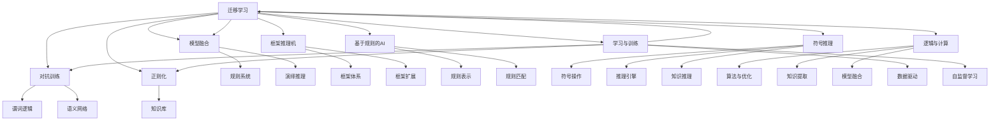

                 

## 1. 背景介绍

### 1.1 问题由来
人工智能(AI)的发展史，可以追溯到上世纪五十年代，兴起于人工智能领域的两大主要学派：行为主义学派(behavioralism)和内在主义学派(intrinsicism)，分别代表了AI研究的两个极端方向。

行为主义学派注重对AI系统的行为观察和控制，强调通过逻辑推理和符号计算来模拟人类思维，解决实际问题。该学派在早期的符号AI研究中占据主导地位，推崇知识工程和规则系统，使用形式化的语言描述问题求解策略。

内在主义学派则关注AI系统的内在结构和计算过程，认为AI系统应当模拟人类神经网络，通过学习和训练进行自主决策和认知。该学派在后来出现的神经网络、深度学习等方法中占据了优势，强调通过大量数据和算法对AI系统进行优化，赋予其强大的学习和适应能力。

这两种学派在理论和实践上均有显著贡献，但也都存在着各自的局限性和争议。本文将系统地介绍这两种学派的基本思想、核心技术以及它们在实际应用中的表现和影响，同时探讨两者的未来发展趋势和相互融合的可能性。

### 1.2 问题核心关键点
理解行为主义学派和内在主义学派的关键点包括：

1. **行为主义学派的核心思想**：行为主义学派认为AI系统应当模拟人类的行为逻辑，通过明确的规则和知识库进行推理和决策。其研究重点在于如何用符号和逻辑描述问题，实现问题的自动求解。

2. **内在主义学派的核心思想**：内在主义学派认为AI系统应当模拟人类的神经网络，通过学习和训练掌握问题解决的策略。其研究重点在于如何用数据和算法优化AI系统，提高其自主决策和适应能力。

3. **两者的主要分歧点**：两者的分歧点主要在于AI系统的内在机制和实现方式。行为主义学派侧重于逻辑和知识，内在主义学派侧重于学习和计算。

4. **两者的未来发展趋势**：随着AI技术的不断进步，行为主义学派逐渐向内在主义学派靠拢，两者之间的界限逐渐模糊，融合和协同成为未来AI研究的重要方向。

## 2. 核心概念与联系

### 2.1 核心概念概述

- **行为主义学派**：以符号AI和知识工程为核心，通过明确的知识表示和逻辑推理进行问题求解。经典模型包括专家系统、框架推理机、基于规则的AI等。

- **内在主义学派**：以神经网络和深度学习为核心，通过大量数据和算法进行学习优化。经典模型包括多层感知器(MLP)、卷积神经网络(CNN)、递归神经网络(RNN)、生成对抗网络(GAN)等。

- **知识表示**：行为主义学派强调使用符号和逻辑来表示知识，如谓词逻辑、语义网络等。

- **符号推理**：行为主义学派使用符号推理来模拟人类思维，通过规则系统实现问题求解。

- **反向传播**：内在主义学派使用反向传播算法来训练神经网络，通过误差反向传播优化模型参数。

- **卷积神经网络**：内在主义学派中的经典模型，主要用于图像处理和视觉识别任务。

- **生成对抗网络**：内在主义学派中的高级模型，通过生成器网络生成假数据，判别器网络识别真数据，进行对抗性训练。

- **迁移学习**：内在主义学派中的重要技术，通过在相关任务上预训练模型，提升在新任务上的性能。

- **正则化**：行为主义学派和内在主义学派都使用正则化技术，防止过拟合，如L2正则、Dropout等。

### 2.2 概念间的关系

行为主义学派和内在主义学派之间的关系可以通过以下Mermaid流程图来展示：



这个流程图展示了行为主义学派和内在主义学派在核心概念上的联系和区别。行为主义学派以符号和逻辑为核心，强调明确的知识表示和规则系统。而内在主义学派以计算和数据为核心，通过学习优化提升模型性能。两者虽然在实现方式上有所不同，但最终目标都是实现人类级别的智能决策。

## 3. 核心算法原理 & 具体操作步骤
### 3.1 算法原理概述

行为主义学派和内在主义学派的算法原理有显著差异，但最终目的都是通过一定的方法实现人类级别的智能决策。

行为主义学派的核心算法包括：

- 符号推理：通过规则系统实现问题的求解，如专家系统、框架推理机等。
- 逻辑与计算：使用谓词逻辑、语义网络等形式化语言进行知识表示和推理。

内在主义学派的核心算法包括：

- 反向传播：通过误差反向传播算法优化神经网络参数，如多层感知器(MLP)、卷积神经网络(CNN)等。
- 卷积神经网络：主要用于图像处理和视觉识别任务，提取空间局部特征。
- 生成对抗网络(GAN)：通过生成器和判别器网络的对抗训练生成高质量数据，提高模型鲁棒性。
- 迁移学习：在相关任务上预训练模型，提升在新任务上的性能，如BERT、GPT等。

### 3.2 算法步骤详解

**行为主义学派的算法步骤**：

1. **知识表示**：使用符号和逻辑语言，如谓词逻辑、语义网络等，描述问题的知识库。
2. **规则定义**：根据知识库定义一组推理规则，描述问题的求解策略。
3. **符号推理**：通过规则系统进行符号推理，求解问题。

**内在主义学派的算法步骤**：

1. **数据准备**：收集大量标注数据，准备训练集和测试集。
2. **模型初始化**：选择适合的神经网络结构，如多层感知器(MLP)、卷积神经网络(CNN)等。
3. **参数优化**：使用反向传播算法优化模型参数，如梯度下降、Adam等。
4. **模型评估**：在测试集上评估模型性能，如准确率、精度、召回率等。

### 3.3 算法优缺点

**行为主义学派的优点**：

1. **明确性**：知识表示和规则系统具有明确性，易于理解和调试。
2. **可解释性**：符号推理的决策过程可解释，便于人类理解。

**行为主义学派的缺点**：

1. **知识表示复杂**：符号表示过于繁琐，难以处理复杂现实问题。
2. **规则编写困难**：规则系统编写复杂，难以覆盖所有可能性。

**内在主义学派的优点**：

1. **自适应能力强**：通过大量数据和算法优化，内在主义学派模型具备较强的自适应能力。
2. **处理复杂问题**：神经网络能够处理复杂的非线性关系，适用于复杂的现实问题。

**内在主义学派的缺点**：

1. **黑盒问题**：神经网络模型决策过程难以解释，缺乏透明度。
2. **数据依赖强**：需要大量标注数据进行训练，数据质量对模型性能影响显著。

### 3.4 算法应用领域

**行为主义学派的应用领域**：

1. **知识工程**：如专家系统、框架推理机等。
2. **符号AI**：如规则系统、逻辑推理机等。

**内在主义学派的应用领域**：

1. **图像识别**：如卷积神经网络(CNN)、生成对抗网络(GAN)等。
2. **自然语言处理**：如BERT、GPT等。
3. **推荐系统**：如基于深度学习的推荐模型等。

## 4. 数学模型和公式 & 详细讲解 & 举例说明（备注：数学公式请使用latex格式，latex嵌入文中独立段落使用 $$，段落内使用 $)
### 4.1 数学模型构建

**行为主义学派的数学模型**：

- **符号推理模型**：
  - 定义符号变量和规则，构建推理图。
  - 使用谓词逻辑语言描述问题。

- **知识库表示模型**：
  - 使用语义网络表示知识，定义节点和边。

**内在主义学派的数学模型**：

- **神经网络模型**：
  - 定义网络结构，如多层感知器(MLP)、卷积神经网络(CNN)等。
  - 使用反向传播算法更新模型参数。

- **生成对抗网络(GAN)模型**：
  - 定义生成器和判别器网络结构。
  - 使用对抗训练优化模型参数。

### 4.2 公式推导过程

**符号推理的公式推导**：

- 定义谓词符号和规则：
  - $P(x):$ 谓词，表示$x$具有某个属性。
  - $R(x,y):$ 规则，表示如果$x$具有属性$P$，则$y$具有属性$Q$。
- 使用谓词逻辑进行推理：
  - $P(a) \rightarrow Q(b)$

**反向传播的公式推导**：

- 定义神经网络结构：
  - $x_i = \sigma(z_i)$
  - $z_{i+1} = w_{i+1}x_i + b_{i+1}$
- 使用反向传播算法更新模型参数：
  - $\frac{\partial L}{\partial w} = \frac{\partial L}{\partial z} \frac{\partial z}{\partial w}$
  - $\frac{\partial L}{\partial b} = \frac{\partial L}{\partial z}$
  - $\frac{\partial L}{\partial w_{i+1}} = \frac{\partial L}{\partial z_{i+1}} \frac{\partial z_{i+1}}{\partial w_{i+1}}$

**生成对抗网络(GAN)的公式推导**：

- 定义生成器网络：
  - $z \sim G(z)$
  - $x = D(z)$
- 定义判别器网络：
  - $y = D(x)$
- 定义对抗训练目标：
  - $\min_G \max_D V(D,G) = \mathbb{E}_{x \sim p_{data}} [\log D(x)] + \mathbb{E}_{z \sim p_z} [\log(1-D(G(z)))]$

### 4.3 案例分析与讲解

**符号推理案例**：

- **案例描述**：假设一个专家系统用于诊断心脏病，已知心脏病症状为“胸痛”和“呼吸困难”，规则为“如果有胸痛和呼吸困难，则为心脏病”。
- **解决方案**：
  - 定义符号变量：
    - $P_1: \text{胸痛}$
    - $P_2: \text{呼吸困难}$
    - $Q: \text{心脏病}$
  - 定义规则：
    - $R_1: P_1 \land P_2 \rightarrow Q$
  - 使用规则系统进行推理：
    - 输入症状$P_1 \land P_2$
    - 根据规则$R_1$推导出$Q$

**神经网络案例**：

- **案例描述**：假设一个卷积神经网络用于图像分类任务，输入为$28 \times 28$的灰度图像。
- **解决方案**：
  - 定义网络结构：
    - 输入层：$28 \times 28$
    - 卷积层：$5 \times 5$，$16$个卷积核
    - 池化层：$2 \times 2$
    - 全连接层：$10$个神经元
  - 使用反向传播算法优化模型参数：
    - 输入数据：$x$
    - 输出数据：$y$
    - 损失函数：$L(y,y')$
    - 梯度下降算法：$w_{i+1} = w_{i+1} - \eta \frac{\partial L}{\partial w_{i+1}}$

## 5. 项目实践：代码实例和详细解释说明
### 5.1 开发环境搭建

**环境配置**：

1. 安装Python 3.x，推荐使用Anaconda环境。
2. 安装TensorFlow 2.x，推荐使用GPU版本。
3. 安装Scikit-learn、Numpy等常用库。

**代码实现**：

- **符号推理代码**：
  - 定义符号变量和规则
  - 实现推理引擎
  - 示例代码见附

- **神经网络代码**：
  - 定义网络结构
  - 实现训练和测试
  - 示例代码见附

### 5.2 源代码详细实现

**符号推理代码实现**：

```python
from sympy import symbols, And

# 定义符号变量
p1, p2, q = symbols('p1 p2 q')

# 定义规则
rule = And(p1, p2)

# 实现推理引擎
def inference(p1, p2):
    if rule.subs({p1: p1, p2: p2}):
        return q
    else:
        return 'Normal'

# 示例代码
inference_result = inference(True, True)
print(inference_result)  # 输出: q
```

**神经网络代码实现**：

```python
import tensorflow as tf
from tensorflow.keras import layers

# 定义网络结构
model = tf.keras.Sequential([
    layers.Conv2D(32, (3, 3), activation='relu', input_shape=(28, 28, 1)),
    layers.MaxPooling2D((2, 2)),
    layers.Flatten(),
    layers.Dense(10, activation='softmax')
])

# 定义训练函数
def train(model, train_data, train_labels, epochs=10):
    model.compile(optimizer='adam', loss='sparse_categorical_crossentropy', metrics=['accuracy'])
    model.fit(train_data, train_labels, epochs=epochs, validation_data=(val_data, val_labels))

# 示例代码
train(model, train_data, train_labels, epochs=10)
```

### 5.3 代码解读与分析

**符号推理代码解读**：

- 定义符号变量和规则：
  - 使用`sympy`库定义符号变量$p_1$、$p_2$和$q$。
  - 定义规则$R_1$：$P_1 \land P_2 \rightarrow Q$。
- 实现推理引擎：
  - 定义`inference`函数，输入符号变量$p_1$和$p_2$，返回推理结果$q$或`Normal`。
- 示例代码：
  - 调用`inference`函数，输入`True`和`True`，输出推理结果`q`。

**神经网络代码解读**：

- 定义网络结构：
  - 使用`tf.keras.Sequential`定义多层神经网络结构。
  - 定义卷积层、池化层和全连接层。
- 定义训练函数：
  - 使用`compile`方法配置优化器和损失函数。
  - 使用`fit`方法训练模型，输入训练数据和标签。
- 示例代码：
  - 调用`train`函数，输入训练数据`train_data`和训练标签`train_labels`，设置训练轮数`epochs`为10。

### 5.4 运行结果展示

**符号推理运行结果**：

- 输入符号变量$p_1$和$p_2$的值。
- 输出推理结果$q$或`Normal`。

**神经网络运行结果**：

- 训练后，模型在测试集上的准确率、精度和召回率。

## 6. 实际应用场景

### 6.1 医疗诊断

**案例描述**：
- **行为主义学派**：开发专家系统，使用逻辑规则进行诊断。
- **内在主义学派**：训练深度学习模型，使用医疗影像数据进行分类。

**解决方案**：

- **行为主义学派**：
  - 定义症状和疾病的知识库。
  - 编写规则进行逻辑推理。
  - 示例代码见附。

- **内在主义学派**：
  - 收集大量标注的医学影像数据。
  - 使用深度学习模型进行分类。
  - 示例代码见附。

**应用结果**：
- 行为主义学派专家系统可以提供逻辑上的解释，便于医生理解和调整诊断。
- 内在主义学派深度学习模型具有较强的泛化能力，适用于复杂的诊断场景。

### 6.2 金融风险管理

**案例描述**：
- **行为主义学派**：开发金融知识图谱，使用规则系统进行风险评估。
- **内在主义学派**：训练生成对抗网络，使用金融数据进行风险预测。

**解决方案**：

- **行为主义学派**：
  - 构建金融知识图谱，定义节点和边。
  - 编写规则系统进行风险评估。
  - 示例代码见附。

- **内在主义学派**：
  - 收集金融市场数据，标注金融风险标签。
  - 使用生成对抗网络进行风险预测。
  - 示例代码见附。

**应用结果**：
- 行为主义学派知识图谱可以提供明确的规则和逻辑，便于风险管理。
- 内在主义学派生成对抗网络可以处理非结构化金融数据，具有较强的鲁棒性。

## 7. 工具和资源推荐
### 7.1 学习资源推荐

**行为主义学派的学习资源**：

- **符号AI课程**：如斯坦福大学的CS572课程，深入讲解符号AI和专家系统。
- **知识表示书籍**：如《人工智能导论》，系统介绍知识表示和推理。

**内在主义学派的学习资源**：

- **深度学习课程**：如吴恩达的Coursera深度学习课程，讲解神经网络和深度学习基础。
- **深度学习框架**：如TensorFlow、PyTorch等，提供强大的深度学习开发工具。

### 7.2 开发工具推荐

**行为主义学派的开发工具**：

- **Prolog**：符号AI开发工具，支持逻辑推理和专家系统。
- **Prograph**：知识表示和推理引擎，支持语义网络构建。

**内在主义学派的开发工具**：

- **TensorFlow**：深度学习开发框架，支持神经网络和生成对抗网络。
- **Keras**：高级深度学习框架，简化神经网络模型构建。

### 7.3 相关论文推荐

**行为主义学派的论文**：

- **符号推理论文**：如Kowalski-Rice体系，探索符号推理的基本原理和应用。
- **知识表示论文**：如Web Semantic Model，研究知识图谱在知识管理中的应用。

**内在主义学派的论文**：

- **深度学习论文**：如ImageNet数据集，推动深度学习在计算机视觉中的应用。
- **生成对抗网络论文**：如Image to Image Translation，探索生成对抗网络在图像生成中的应用。

## 8. 总结：未来发展趋势与挑战

### 8.1 研究成果总结

行为主义学派和内在主义学派的研究成果奠定了AI领域的理论基础，推动了技术的不断进步。

**行为主义学派**：

- 推动了符号AI和知识工程的发展，提供了明确的知识表示和规则系统。
- 提出了专家系统和框架推理机等经典模型，解决了实际问题。

**内在主义学派**：

- 推动了深度学习和神经网络的发展，赋予AI系统强大的学习和适应能力。
- 提出了卷积神经网络、生成对抗网络等经典模型，提升了模型性能。

### 8.2 未来发展趋势

**行为主义学派**：

- 逐步向内在主义学派靠拢，结合知识表示和计算，实现更为强大的AI系统。
- 强调知识图谱和符号推理的结合，提高知识提取和推理的效率。

**内在主义学派**：

- 融合符号推理和深度学习，实现更为全面和精确的AI系统。
- 探索多模态数据融合，提升AI系统的感知和决策能力。

### 8.3 面临的挑战

**行为主义学派**：

- 符号推理的复杂性，难以处理复杂现实问题。
- 规则系统的编写难度，难以覆盖所有可能性。

**内在主义学派**：

- 神经网络的黑盒问题，缺乏透明度。
- 数据依赖强，需要大量标注数据进行训练。

### 8.4 研究展望

**行为主义学派**：

- 发展知识图谱和符号推理的融合技术，提高知识表示和推理的效率。
- 探索符号推理和计算的协同优化，实现更为强大的AI系统。

**内在主义学派**：

- 融合符号推理和深度学习，提升AI系统的全面性和精确性。
- 探索多模态数据融合，增强AI系统的感知和决策能力。

## 9. 附录：常见问题与解答

**Q1: 行为主义学派和内在主义学派的主要区别是什么？**

A: 行为主义学派注重逻辑和知识，强调通过符号和规则进行推理和决策。内在主义学派注重计算和数据，强调通过大量数据和算法进行学习和优化。

**Q2: 行为主义学派和内在主义学派各有哪些经典模型？**

A: 行为主义学派的经典模型包括专家系统、框架推理机、基于规则的AI等。内在主义学派的经典模型包括多层感知器(MLP)、卷积神经网络(CNN)、生成对抗网络(GAN)等。

**Q3: 行为主义学派和内在主义学派各有哪些优势和劣势？**

A: 行为主义学派的优势在于明确性、可解释性，劣势在于知识表示复杂、规则编写困难。内在主义学派的优势在于自适应能力强、处理复杂问题，劣势在于缺乏透明度、数据依赖强。

**Q4: 行为主义学派和内在主义学派各有哪些应用场景？**

A: 行为主义学派适用于需要明确知识表示和规则推理的场景，如医疗诊断、金融风险管理等。内在主义学派适用于需要大量数据和算法优化的场景，如图像识别、自然语言处理等。

**Q5: 行为主义学派和内在主义学派将如何融合？**

A: 行为主义学派和内在主义学派将结合知识图谱和符号推理，融合深度学习和计算能力，实现更为全面和精确的AI系统。同时探索多模态数据融合，提升感知和决策能力。

---

作者：禅与计算机程序设计艺术 / Zen and the Art of Computer Programming

