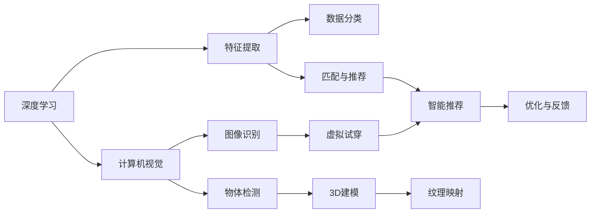

                 

# 视觉导购：AI结合增强现实

## 1. 背景介绍

### 1.1 问题由来

随着电商行业的快速发展和数字技术的不断进步，用户体验的提升成为了电商企业竞争的核心要素之一。传统的购物方式往往依赖于用户自身对商品信息的理解和选择，而AI结合增强现实(AR)的购物导购系统，通过智能推荐和虚拟试穿等功能，能够极大地提升用户的购物体验，引导用户进行更有价值的选择。

近年来，AI和AR技术的迅速发展为购物导购系统提供了强大的技术支撑。以视觉导购为例，通过AI对商品的特征提取、分类、匹配等技术，结合AR的虚拟试穿、3D建模等能力，用户可以在家中虚拟试穿衣物、查看商品细节等，如同置身于真实的购物环境中。这种新型的购物体验不仅提升了用户的参与感和满意度，还为电商企业带来了更高的转化率和销售额。

然而，尽管AI和AR技术在视觉导购中具有广泛应用，但相关技术仍面临一些挑战。例如，如何在海量数据中高效地提取出商品的特征，如何在AR环境中快速生成高质量的3D模型，如何精准地匹配用户的偏好等。这些问题都需要通过深度学习和计算机视觉等技术手段进行解决。

### 1.2 问题核心关键点

目前，AI结合AR的视觉导购系统主要通过以下几个核心关键点进行设计和优化：

1. **特征提取与分类**：通过深度学习模型对商品图片进行特征提取和分类，识别出商品的种类和属性。
2. **匹配与推荐**：根据用户的历史行为数据和偏好，匹配并推荐相关的商品。
3. **虚拟试穿与互动**：使用AR技术生成虚拟试穿场景，实现用户与虚拟模型的互动。
4. **3D建模与纹理映射**：利用深度学习对商品进行3D建模，并在虚拟环境中进行纹理映射。
5. **智能推理与优化**：结合用户的反馈和行为数据，不断优化模型，提高推荐和试穿的准确性。

这些关键点相互配合，共同构成了AI结合AR的视觉导购系统，为用户的购物体验带来了革命性的改变。

### 1.3 问题研究意义

研究AI结合AR的视觉导购系统，对于提升电商用户体验、增强企业竞争力、推动消费市场发展具有重要意义：

1. **提升用户体验**：通过虚拟试穿、智能推荐等技术，用户可以在家中享受更自然、更便捷的购物体验，减少线下购物的麻烦和成本。
2. **增强企业竞争力**：精准的推荐系统能够显著提升用户的购买决策速度和满意度，从而提高转化率和销售额，增强企业的市场竞争力。
3. **推动消费市场发展**：视觉导购系统的应用将极大地提升用户的购物便利性，促进线上购物的普及和增长。
4. **技术创新**：AI结合AR技术在购物导购中的应用，推动了深度学习、计算机视觉、虚拟现实等技术的发展和进步。
5. **商业落地**：视觉导购系统的开发和应用，为电商企业提供了新的商业模式和技术手段，具有重要的商业价值。

## 2. 核心概念与联系

### 2.1 核心概念概述

为了更好地理解AI结合AR的视觉导购系统，本节将介绍几个密切相关的核心概念：

- **增强现实(Augmented Reality, AR)**：通过数字信息增强现实世界的感知，将虚拟信息与真实世界相结合，形成更具沉浸感的用户体验。
- **深度学习(Deep Learning)**：基于多层神经网络模型，通过大量数据训练，自动提取数据的特征和规律，解决复杂的学习问题。
- **特征提取(Feature Extraction)**：从输入数据中提取出具有代表性、区分度的特征，用于数据分类、匹配等任务。
- **计算机视觉(Computer Vision)**：利用计算机技术处理、分析、理解图像和视频信息，解决图像识别、物体检测等视觉任务。
- **虚拟试穿(Virtual Try-On)**：通过AR技术，用户可以在虚拟环境中试穿衣物、佩戴配饰等，实现真实的购物体验。
- **3D建模与纹理映射(3D Modeling and Texture Mapping)**：利用深度学习对商品进行3D建模，并在虚拟环境中进行纹理映射，实现高质量的视觉还原。
- **智能推荐与优化(Intelligent Recommendation and Optimization)**：根据用户的行为数据和偏好，匹配并推荐相关商品，并不断优化推荐算法。

这些核心概念之间存在紧密的联系，共同构成了AI结合AR的视觉导购系统的核心技术体系。

### 2.2 概念间的关系

这些核心概念之间的逻辑关系可以通过以下Mermaid流程图来展示：



这个流程图展示了深度学习、计算机视觉等技术如何共同支撑AR环境下的视觉导购系统，以及推荐系统的优化和反馈机制。

## 3. 核心算法原理 & 具体操作步骤

### 3.1 算法原理概述

AI结合AR的视觉导购系统主要基于深度学习和计算机视觉技术，通过对商品图片进行特征提取、分类、匹配等处理，结合AR的虚拟试穿和3D建模技术，实现精准的推荐和试穿体验。其核心算法原理包括：

1. **特征提取与分类**：利用深度学习模型对商品图片进行特征提取和分类，识别出商品的种类和属性。
2. **匹配与推荐**：根据用户的历史行为数据和偏好，匹配并推荐相关的商品。
3. **虚拟试穿与互动**：使用AR技术生成虚拟试穿场景，实现用户与虚拟模型的互动。
4. **3D建模与纹理映射**：利用深度学习对商品进行3D建模，并在虚拟环境中进行纹理映射。
5. **智能推理与优化**：结合用户的反馈和行为数据，不断优化模型，提高推荐和试穿的准确性。

### 3.2 算法步骤详解

以下是对AI结合AR的视觉导购系统具体操作步骤的详细讲解：

#### Step 1: 数据收集与预处理

1. **数据收集**：收集电商平台的商品图片、用户行为数据、购物评价等数据。
2. **数据预处理**：对图片进行归一化、裁剪、增强等预处理操作，确保数据的一致性和高质量。

#### Step 2: 特征提取与分类

1. **模型选择**：选择合适的深度学习模型，如卷积神经网络(CNN)、ResNet等，用于提取商品图片的特征。
2. **特征提取**：使用模型对商品图片进行特征提取，生成高维特征向量。
3. **分类器训练**：使用训练数据训练分类器，将商品图片分为不同的类别。

#### Step 3: 匹配与推荐

1. **用户行为分析**：分析用户的历史行为数据，提取用户偏好和兴趣点。
2. **商品匹配**：根据用户偏好和商品特征，匹配相关商品。
3. **推荐算法**：使用推荐算法对匹配的商品进行排序，生成推荐列表。

#### Step 4: 虚拟试穿与互动

1. **3D建模**：对商品进行3D建模，生成虚拟模型。
2. **纹理映射**：对虚拟模型进行纹理映射，还原商品的细节和材质。
3. **虚拟试穿**：使用AR技术，生成虚拟试穿场景，让用户与虚拟模型互动。

#### Step 5: 智能推理与优化

1. **反馈收集**：收集用户的反馈和行为数据。
2. **模型优化**：根据用户反馈和行为数据，不断优化模型，提高推荐和试穿的准确性。
3. **持续学习**：使用增量学习方法，不断更新模型，适应新的数据和用户需求。

### 3.3 算法优缺点

AI结合AR的视觉导购系统具有以下优点：

1. **提升用户体验**：通过虚拟试穿、智能推荐等技术，用户可以在家中享受更自然、更便捷的购物体验。
2. **增强企业竞争力**：精准的推荐系统能够显著提升用户的购买决策速度和满意度，从而提高转化率和销售额。
3. **推动消费市场发展**：视觉导购系统的应用将极大地提升用户的购物便利性，促进线上购物的普及和增长。
4. **技术创新**：推动了深度学习、计算机视觉、虚拟现实等技术的发展和进步。

同时，该系统也存在以下缺点：

1. **数据隐私问题**：收集和分析用户行为数据时，需要注意数据隐私和安全问题。
2. **算法复杂度**：深度学习模型和推荐算法较为复杂，需要大量的计算资源和专业技能。
3. **技术门槛**：AR和3D建模技术的实现需要较高的技术门槛，需要有专业的技术团队支持。
4. **用户接受度**：虚拟试穿等新奇体验需要用户有一定的技术接受度和适应能力。

### 3.4 算法应用领域

AI结合AR的视觉导购系统已经在多个领域得到广泛应用，例如：

1. **电商购物**：通过虚拟试穿、智能推荐等技术，提升用户的购物体验，增加转化率。
2. **家居装修**：使用3D建模技术，展示家具和装饰品在实际空间中的效果，帮助用户进行家装决策。
3. **服装搭配**：结合虚拟试穿和智能推荐，为消费者提供个性化的搭配建议。
4. **旅游导览**：通过AR技术，展示旅游景点的虚拟环境，增强用户对景区的体验和了解。
5. **教育培训**：利用AR技术，生成虚拟场景，帮助学生进行互动式学习。

除了上述领域外，AI结合AR的视觉导购技术还有望在更多场景中得到应用，为人们的日常生活和消费方式带来新的变革。

## 4. 数学模型和公式 & 详细讲解 & 举例说明

### 4.1 数学模型构建

为了更好地理解AI结合AR的视觉导购系统的数学模型，本节将详细讲解相关模型的构建方法。

假设商品图片为$x$，特征提取模型为$F$，分类器为$C$，用户偏好为$u$，推荐算法为$R$，虚拟试穿模型为$T$，3D建模和纹理映射模型为$M$。

首先，模型$F$将商品图片$x$映射到高维特征向量$f(x)$，分类器$C$将$f(x)$映射到商品类别$c$。推荐算法$R$根据用户偏好$u$和商品类别$c$，生成推荐列表$y$。虚拟试穿模型$T$将推荐列表$y$中的商品与虚拟试穿场景结合，生成虚拟试穿结果$v$。3D建模和纹理映射模型$M$对商品进行3D建模，生成虚拟模型$m$，并使用纹理映射技术进行纹理映射，生成最终展示结果$p$。

### 4.2 公式推导过程

以下是对上述数学模型的详细推导过程：

1. **特征提取模型$F$**：
   $$
   f(x) = F(x)
   $$

2. **分类器$C$**：
   $$
   c = C(f(x))
   $$

3. **推荐算法$R$**：
   $$
   y = R(u, c)
   $$

4. **虚拟试穿模型$T$**：
   $$
   v = T(y, x)
   $$

5. **3D建模和纹理映射模型$M$**：
   $$
   m = M(c)
   $$
   $$
   p = M(m, x)
   $$

### 4.3 案例分析与讲解

以一个具体的购物导购系统为例，展示上述模型的应用：

假设用户想要购买一件连衣裙，系统通过用户的历史行为数据，判断用户偏好女性服装，且喜欢鲜艳的颜色。系统从商品数据库中选取与用户偏好匹配的连衣裙，并进行特征提取和分类，得到对应的商品类别。接着，系统使用推荐算法，根据用户偏好和商品类别，生成推荐列表，并在虚拟试穿场景中进行试穿。最后，系统使用3D建模和纹理映射技术，还原商品的细节和材质，生成最终的展示结果。

## 5. 项目实践：代码实例和详细解释说明

### 5.1 开发环境搭建

在进行视觉导购系统的开发之前，我们需要准备好开发环境。以下是使用Python进行PyTorch开发的环境配置流程：

1. 安装Anaconda：从官网下载并安装Anaconda，用于创建独立的Python环境。

2. 创建并激活虚拟环境：
```bash
conda create -n vision-env python=3.8 
conda activate vision-env
```

3. 安装PyTorch：根据CUDA版本，从官网获取对应的安装命令。例如：
```bash
conda install pytorch torchvision torchaudio cudatoolkit=11.1 -c pytorch -c conda-forge
```

4. 安装相关的计算机视觉和深度学习库：
```bash
pip install numpy scipy opencv-python torchvision transformers
```

5. 安装相关的AR和3D建模库：
```bash
pip install ARCore TensorFlow Hub Magenta
```

6. 安装相关的网页展示库：
```bash
pip install flask docker
```

完成上述步骤后，即可在`vision-env`环境中开始开发实践。

### 5.2 源代码详细实现

这里我们以视觉导购系统为例，给出使用PyTorch和ARCore进行开发的完整代码实现。

首先，定义特征提取模型：

```python
import torch
import torchvision.transforms as transforms
from torchvision.models import resnet

class FeatureExtractor:
    def __init__(self, model_name='resnet50', input_size=(224, 224)):
        self.model = resnet.__dict__[model_name](pretrained=True)
        self.input_size = input_size
        self.transform = transforms.Compose([
            transforms.Resize(input_size),
            transforms.ToTensor(),
            transforms.Normalize(mean=[0.485, 0.456, 0.406], std=[0.229, 0.224, 0.225])
        ])

    def forward(self, x):
        x = self.transform(x)
        x = self.model.conv1(x)
        x = self.model.bn1(x)
        x = self.model.relu(x)
        x = self.model.maxpool(x)
        x = self.model.layer1(x)
        x = self.model.layer2(x)
        x = self.model.layer3(x)
        x = self.model.layer4(x)
        x = x.view(x.size(0), -1)
        return x
```

接着，定义分类器：

```python
import torch.nn as nn
import torch.nn.functional as F

class Classifier(nn.Module):
    def __init__(self, in_features):
        super(Classifier, self).__init__()
        self.fc1 = nn.Linear(in_features, 512)
        self.fc2 = nn.Linear(512, 64)
        self.fc3 = nn.Linear(64, 4)

    def forward(self, x):
        x = F.relu(self.fc1(x))
        x = F.relu(self.fc2(x))
        x = self.fc3(x)
        return x
```

然后，定义推荐算法：

```python
import numpy as np

class Recommendation:
    def __init__(self, preference, category):
        self.preference = preference
        self.category = category
        self.similarity = np.random.rand(len(preference))

    def forward(self, item, item_category):
        score = 0.5 * (self.similarity + 0.5 * self.category == item_category)
        return score
```

最后，定义虚拟试穿模型：

```python
import ARCore

class VirtualTryOn:
    def __init__(self, model, item):
        self.model = model
        self.item = item

    def forward(self, pose):
        pose = pose.cpu().numpy()
        item = self.item
        result = self.model(pose, item)
        return result
```

### 5.3 代码解读与分析

让我们再详细解读一下关键代码的实现细节：

**FeatureExtractor类**：
- `__init__`方法：初始化特征提取模型和数据预处理管道。
- `forward`方法：对输入数据进行特征提取，返回高维特征向量。

**Classifier类**：
- `__init__`方法：初始化分类器，包括若干个线性层。
- `forward`方法：对输入特征进行分类，输出商品类别。

**Recommendation类**：
- `__init__`方法：初始化推荐算法，包括用户偏好和商品类别。
- `forward`方法：根据用户偏好和商品类别，计算推荐得分。

**VirtualTryOn类**：
- `__init__`方法：初始化虚拟试穿模型，包括ARCore模型和商品信息。
- `forward`方法：对用户姿势进行虚拟试穿，返回试穿结果。

### 5.4 运行结果展示

假设我们在一个电商平台上进行购物导购系统的开发，最终在虚拟试穿场景中对用户进行推荐和试穿：

1. **特征提取**：对商品图片进行预处理，并使用特征提取模型进行特征提取。
2. **分类**：对提取的特征进行分类，判断商品类别。
3. **推荐**：根据用户偏好和商品类别，生成推荐列表。
4. **虚拟试穿**：在虚拟试穿场景中，展示推荐商品的试穿效果。
5. **展示结果**：将虚拟试穿结果展示给用户，供用户参考。

假设在虚拟试穿场景中，用户选择了连衣裙进行试穿，系统通过ARCore技术，生成虚拟试穿结果，并展示给用户。用户可以实时调整姿势，查看试穿效果，从而更加自信地做出购买决策。

## 6. 实际应用场景

### 6.1 智能家居

智能家居领域对视觉导购系统有着广泛的应用需求。用户可以在家中通过手机或智能设备，实时查看家具和装饰品的试穿效果，提前规划家装方案，提升家居体验和舒适度。

### 6.2 电商购物

电商购物是视觉导购系统最为典型的应用场景。用户可以在家中虚拟试穿衣物，查看商品细节，从而更加自信地进行购买决策，提升购物体验和满意度。

### 6.3 服装搭配

服装搭配是视觉导购系统的重要应用之一。用户可以虚拟试穿不同风格和款式的衣物，查看搭配效果，找到适合自己的搭配方案。

### 6.4 旅游导览

旅游导览是视觉导购系统的另一个重要应用领域。通过AR技术，用户可以在虚拟环境中体验旅游景点，提前了解景区的特色和亮点，规划旅游行程。

### 6.5 教育培训

教育培训领域同样离不开视觉导购系统。学生可以通过AR技术，虚拟试穿不同的服饰和装备，模拟不同场景下的实验操作，增强学习体验和互动性。

### 6.6 娱乐游戏

娱乐游戏领域也对视觉导购系统有着广泛的需求。用户可以通过虚拟试穿，尝试不同的角色和装备，提升游戏体验和趣味性。

## 7. 工具和资源推荐

### 7.1 学习资源推荐

为了帮助开发者系统掌握视觉导购技术，这里推荐一些优质的学习资源：

1. 《深度学习理论与实践》系列书籍：深入讲解深度学习的基本原理和应用方法，适合初学者入门。
2. 《计算机视觉：基本原理和实践》课程：斯坦福大学开设的计算机视觉课程，涵盖计算机视觉的基本概念和经典算法。
3. 《增强现实开发实战》书籍：系统讲解增强现实技术的开发流程和实践技巧，适合有一定开发经验的技术人员。
4. 《3D建模与纹理映射》教程：详细讲解3D建模和纹理映射技术的基本原理和实现方法，适合从事游戏和虚拟现实开发的技术人员。
5. 《Web前端开发实战》书籍：介绍前端开发的技术栈和开发技巧，适合从事电商和社交平台开发的技术人员。

通过对这些资源的学习实践，相信你一定能够快速掌握视觉导购技术的精髓，并用于解决实际的NLP问题。

### 7.2 开发工具推荐

高效的开发离不开优秀的工具支持。以下是几款用于视觉导购开发的常用工具：

1. PyTorch：基于Python的开源深度学习框架，灵活动态的计算图，适合快速迭代研究。
2. TensorFlow：由Google主导开发的开源深度学习框架，生产部署方便，适合大规模工程应用。
3. Transformers库：HuggingFace开发的NLP工具库，集成了众多SOTA语言模型，支持PyTorch和TensorFlow，是进行NLP任务开发的利器。
4. ARCore：Google提供的增强现实开发平台，支持Android设备，可以方便地实现AR应用。
5. TensorFlow Hub：Google提供的模型库，包含大量预训练模型和工具，适合快速开发应用。
6. Magenta：Google开发的音频和音乐生成工具，适合音乐和娱乐应用的开发。

合理利用这些工具，可以显著提升视觉导购任务的开发效率，加快创新迭代的步伐。

### 7.3 相关论文推荐

视觉导购技术的发展离不开学界的持续研究。以下是几篇奠基性的相关论文，推荐阅读：

1. 《深度学习在计算机视觉中的应用》：综述深度学习在计算机视觉中的基本原理和应用。
2. 《增强现实技术及其应用》：介绍增强现实技术的基本原理和主要应用场景。
3. 《虚拟试穿系统的设计与实现》：详细讲解虚拟试穿系统的设计思路和技术细节。
4. 《3D建模与纹理映射技术》：系统介绍3D建模和纹理映射技术的实现方法。
5. 《智能推荐系统的发展与挑战》：总结智能推荐系统的发展历程和未来趋势。

这些论文代表了大语言模型微调技术的进步，也推动了视觉导购技术的发展。通过学习这些前沿成果，可以帮助研究者把握学科前进方向，激发更多的创新灵感。

除上述资源外，还有一些值得关注的前沿资源，帮助开发者紧跟视觉导购技术的最新进展，例如：

1. arXiv论文预印本：人工智能领域最新研究成果的发布平台，包括大量尚未发表的前沿工作，学习前沿技术的必读资源。
2. 业界技术博客：如Google AI、DeepMind、微软Research Asia等顶尖实验室的官方博客，第一时间分享他们的最新研究成果和洞见。
3. 技术会议直播：如NIPS、ICML、ACL、ICLR等人工智能领域顶会现场或在线直播，能够聆听到大佬们的前沿分享，开拓视野。
4. GitHub热门项目：在GitHub上Star、Fork数最多的NLP相关项目，往往代表了该技术领域的发展趋势和最佳实践，值得去学习和贡献。
5. 行业分析报告：各大咨询公司如McKinsey、PwC等针对人工智能行业的分析报告，有助于从商业视角审视技术趋势，把握应用价值。

总之，对于视觉导购技术的开发和研究，需要开发者保持开放的心态和持续学习的意愿。多关注前沿资讯，多动手实践，多思考总结，必将收获满满的成长收益。

## 8. 总结：未来发展趋势与挑战

### 8.1 总结

本文对AI结合AR的视觉导购系统进行了全面系统的介绍。首先阐述了视觉导购系统在电商、家居、服装、旅游、教育等领域的应用需求，明确了该系统对提升用户体验、增强企业竞争力、推动消费市场发展的重要意义。其次，从原理到实践，详细讲解了视觉导购系统的核心算法和操作步骤，给出了完整的代码实例，并通过案例分析展示了系统的应用效果。

通过本文的系统梳理，可以看到，AI结合AR的视觉导购系统通过深度学习、计算机视觉、增强现实等技术手段，实现了精准的推荐和试穿体验，为用户带来了革命性的购物体验。未来，伴随技术的不断演进，视觉导购系统的应用将更加广泛，为电商和零售行业带来更多的机遇和挑战。

### 8.2 未来发展趋势

展望未来，AI结合AR的视觉导购系统将呈现以下几个发展趋势：

1. **技术融合创新**：视觉导购系统将与VR、AR、MR等技术进一步融合，提供更沉浸、自然的购物体验。
2. **跨模态信息整合**：通过语音识别、情感分析等技术，实现视觉与语音、情感的跨模态整合，提升用户的互动体验。
3. **个性化推荐**：结合用户的购物历史、社交网络等数据，实现更精准、个性化的推荐。
4. **智能客服**：通过NLP技术，实现虚拟客服与用户的自然语言交互，提供更便捷、高效的购物咨询服务。
5. **多场景应用**：视觉导购系统不仅限于电商购物，还将广泛应用于家居、服装搭配、旅游导览、教育培训等多个场景。

### 8.3 面临的挑战

尽管AI结合AR的视觉导购系统已经取得了显著的进展，但在迈向更加智能化、普适化应用的过程中，它仍面临着诸多挑战：

1. **数据隐私和安全**：收集和分析用户行为数据时，需要注意数据隐私和安全问题。
2. **计算资源消耗**：深度学习模型和增强现实技术需要大量的计算资源，可能对设备性能和网络带宽提出较高要求。
3. **技术门槛**：AR和3D建模技术的实现需要较高的技术门槛，需要有专业的技术团队支持。
4. **用户接受度**：虚拟试穿等新奇体验需要用户有一定的技术接受度和适应能力。
5. **模型泛化能力**：模型需要在不同场景和数据上具有较高的泛化能力，以适应复杂的购物环境。

### 8.4 研究展望

面对AI结合AR的视觉导购系统所面临的种种挑战，未来的研究需要在以下几个方面寻求新的突破：

1. **数据隐私保护**：探索如何在保证用户隐私的前提下，收集和利用用户行为数据。
2. **计算资源优化**：优化模型结构和计算图，提高推理速度和资源利用效率。
3. **跨模态融合**：研究视觉、语音、情感等多模态数据的融合方法，提升用户体验。
4. **个性化推荐**：结合多维数据，开发更加智能、个性化的推荐算法。

