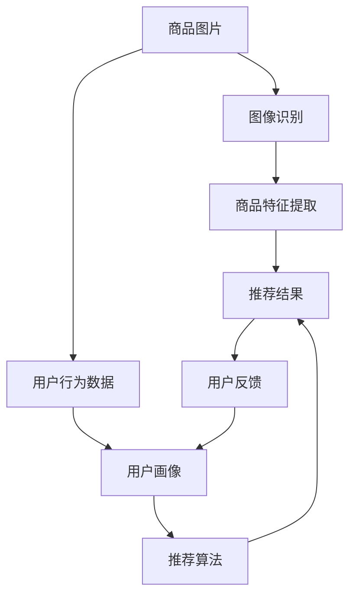

                 

# 视觉推荐：AI如何利用图像识别技术，提供更直观的商品推荐

> 关键词：视觉推荐, 图像识别, 商品推荐系统, AI, 深度学习, 卷积神经网络, 特征提取, 用户画像, 个性化推荐

## 1. 背景介绍

### 1.1 问题由来
在当今的互联网时代，在线购物成为了人们获取商品和服务的重要方式。电商平台面临着越来越激烈的竞争，如何提供更加精准、个性化的推荐服务，提升用户满意度和转化率，成为各大电商平台的共同挑战。传统的基于文本的推荐系统在处理图片类商品时存在较大困难，用户画像的多样性和商品的丰富性使得仅基于文本特征难以获得理想的效果。

因此，如何利用图像识别技术，将商品的视觉特征转化为推荐系统的输入，构建基于视觉信息的推荐系统，成为了电商推荐领域的一个重要研究方向。AI技术的快速发展，尤其是深度学习技术的突破，为实现这一目标提供了可能性。利用图像识别技术提取商品的视觉特征，再通过推荐算法进行匹配，可以大幅提升商品推荐的准确性和个性化程度。

### 1.2 问题核心关键点
视觉推荐系统的核心在于：
1. **图像特征提取**：将商品图片转换为可用于机器学习的特征向量。
2. **用户画像建立**：根据用户的历史行为、兴趣等构建用户的个性化特征向量。
3. **推荐算法设计**：基于用户画像和商品特征向量，设计高效的推荐算法，为用户推荐可能感兴趣的商品。

这些关键点的紧密结合，可以使得视觉推荐系统更准确、更高效地为用户推荐商品，从而提升用户体验和平台收益。

### 1.3 问题研究意义
视觉推荐系统的研究和应用具有重要意义：
1. **提升用户满意度**：通过精准推荐，满足用户需求，提升购物体验。
2. **增加平台收益**：提高商品转化率，增加销售额。
3. **拓展电商功能**：将商品推荐融入到电商平台中，增加用户粘性。
4. **推动AI应用**：为深度学习技术在电商领域的落地提供案例，促进AI技术的发展和应用。

## 2. 核心概念与联系

### 2.1 核心概念概述

为更好地理解视觉推荐系统，本节将介绍几个关键概念：

- **视觉推荐系统**：利用图像识别技术，通过分析商品图片，提取图像特征，再结合用户画像，进行商品推荐。
- **图像识别**：通过深度学习模型，将图像转换为向量表示，提取出图像的视觉特征。
- **商品特征提取**：将商品图片转换为可用于机器学习的向量表示，提取商品的特征。
- **用户画像**：通过分析用户的行为、兴趣、偏好等，构建用户画像。
- **推荐算法**：基于用户画像和商品特征，设计算法为用户推荐可能感兴趣的商品。

这些核心概念之间存在紧密的联系，形成了视觉推荐系统的完整架构。

### 2.2 概念间的关系

这些核心概念之间的关系可以通过以下Mermaid流程图来展示：



这个流程图展示了从商品图片到推荐结果的完整流程。首先，通过图像识别技术将商品图片转换为向量表示，提取商品的特征。同时，收集用户的浏览、点击、购买等行为数据，构建用户画像。然后，结合商品特征和用户画像，设计推荐算法，输出推荐结果。最后，通过用户反馈不断优化推荐算法，提升推荐效果。

## 3. 核心算法原理 & 具体操作步骤

### 3.1 算法原理概述

视觉推荐系统基于图像识别技术，通过提取商品图片的特征，结合用户画像，设计高效的推荐算法。其核心算法包括以下几个部分：

1. **图像特征提取**：利用深度学习模型，如卷积神经网络(CNN)，将商品图片转换为向量表示。
2. **用户画像构建**：通过分析用户的行为数据，构建用户画像，表示用户兴趣和偏好。
3. **推荐算法设计**：基于商品特征和用户画像，设计推荐算法，如协同过滤、基于内容的推荐、深度学习推荐等。

### 3.2 算法步骤详解

视觉推荐系统的具体操作步骤如下：

1. **数据预处理**：收集商品图片和用户行为数据，进行预处理和归一化，确保数据质量。
2. **图像特征提取**：使用卷积神经网络等深度学习模型，将商品图片转换为向量表示。
3. **用户画像构建**：根据用户行为数据，构建用户的兴趣和偏好特征向量。
4. **推荐算法设计**：基于商品特征向量和用户画像，设计推荐算法，生成推荐结果。
5. **推荐结果反馈**：收集用户的反馈数据，不断优化推荐算法，提升推荐效果。

### 3.3 算法优缺点

视觉推荐系统具有以下优点：
1. **视觉特征更直观**：图片类商品可以直接通过视觉特征进行推荐，无需文本标注，数据处理更简单。
2. **个性化程度高**：通过图像识别技术提取商品的视觉特征，结合用户画像，可以提供更精准的个性化推荐。
3. **算法多样化**：结合深度学习、协同过滤等推荐算法，可以构建多样化的推荐系统。

但同时，视觉推荐系统也存在一些缺点：
1. **数据量要求高**：需要大量高质量的商品图片和用户行为数据，数据收集和标注成本较高。
2. **算法复杂度高**：深度学习模型的训练和调参复杂，需要专业技术人员参与。
3. **推荐结果可解释性差**：基于图像识别和深度学习模型的推荐结果缺乏可解释性，用户难以理解推荐依据。
4. **视觉噪声敏感**：商品图片质量不佳或存在视觉噪声时，会影响特征提取效果，进而影响推荐效果。

### 3.4 算法应用领域

视觉推荐系统主要应用于电商领域，具体包括：
1. **电商平台**：为电商平台提供商品推荐服务，提升用户购物体验和平台收益。
2. **社交媒体**：为社交媒体平台提供图片类商品推荐，增加用户粘性。
3. **旅游平台**：为旅游平台提供景点推荐，提升用户出行体验。
4. **视频平台**：为视频平台提供影视剧推荐，增加平台收入。

## 4. 数学模型和公式 & 详细讲解 & 举例说明

### 4.1 数学模型构建

假设商品图片为 $x \in \mathbb{R}^d$，通过深度学习模型提取的特征向量为 $z \in \mathbb{R}^k$，用户画像为 $u \in \mathbb{R}^m$。推荐算法的目标是最小化推荐误差 $L$，即：

$$
\mathop{\arg\min}_{z,u} L(z,u) = \mathop{\arg\min}_{z,u} \frac{1}{N}\sum_{i=1}^N (y_i - f(z_i, u_i))^2
$$

其中，$y_i$ 为用户对推荐结果的评价，$f(z_i, u_i)$ 为推荐函数，将商品特征 $z_i$ 和用户画像 $u_i$ 映射为推荐结果。

### 4.2 公式推导过程

以基于内容的推荐算法为例，假设推荐函数 $f(z,u)$ 为向量内积，则推荐误差为：

$$
L(z,u) = \frac{1}{N}\sum_{i=1}^N (y_i - z_i \cdot u_i)^2
$$

其中，$z_i \cdot u_i$ 为向量内积，表示商品特征和用户画像之间的匹配度。通过优化上述损失函数，可以求得最佳的商品特征向量和用户画像。

### 4.3 案例分析与讲解

以电商平台商品推荐为例，假设商品图片为 $x \in \mathbb{R}^d$，通过深度学习模型提取的特征向量为 $z \in \mathbb{R}^k$，用户画像为 $u \in \mathbb{R}^m$。推荐算法可以基于协同过滤、基于内容的推荐等，以生成推荐结果。

## 5. 项目实践：代码实例和详细解释说明

### 5.1 开发环境搭建

在进行项目实践前，我们需要准备好开发环境。以下是使用Python进行TensorFlow开发的环境配置流程：

1. 安装Anaconda：从官网下载并安装Anaconda，用于创建独立的Python环境。

2. 创建并激活虚拟环境：
```bash
conda create -n tf-env python=3.8 
conda activate tf-env
```

3. 安装TensorFlow：根据CUDA版本，从官网获取对应的安装命令。例如：
```bash
conda install tensorflow -c conda-forge
```

4. 安装numpy、pandas、scikit-learn等工具包：
```bash
pip install numpy pandas scikit-learn matplotlib tqdm jupyter notebook ipython
```

完成上述步骤后，即可在`tf-env`环境中开始项目实践。

### 5.2 源代码详细实现

下面我们以电商平台商品推荐为例，给出使用TensorFlow对商品图片进行特征提取和推荐算法的PyTorch代码实现。

首先，定义模型和优化器：

```python
import tensorflow as tf
from tensorflow.keras import layers

model = tf.keras.Sequential([
    layers.Conv2D(32, (3, 3), activation='relu', input_shape=(32, 32, 3)),
    layers.MaxPooling2D((2, 2)),
    layers.Flatten(),
    layers.Dense(128, activation='relu'),
    layers.Dense(1)
])

optimizer = tf.keras.optimizers.Adam(learning_rate=0.001)
```

接着，定义训练和评估函数：

```python
def train_step(x, y):
    with tf.GradientTape() as tape:
        logits = model(x, training=True)
        loss = tf.reduce_mean(tf.square(logits - y))
    gradients = tape.gradient(loss, model.trainable_variables)
    optimizer.apply_gradients(zip(gradients, model.trainable_variables))

def evaluate(x, y):
    logits = model(x, training=False)
    mse = tf.reduce_mean(tf.square(logits - y))
    return mse
```

然后，启动训练流程并在测试集上评估：

```python
epochs = 10
batch_size = 32

for epoch in range(epochs):
    for batch in train_dataset:
        x, y = batch
        train_step(x, y)

    mse = evaluate(test_dataset)
    print(f"Epoch {epoch+1}, MSE: {mse:.4f}")
```

以上就是使用TensorFlow对商品图片进行特征提取和推荐算法的完整代码实现。可以看到，TensorFlow提供了丰富的深度学习模型和优化器，可以方便地进行商品特征提取和推荐算法的实现。

### 5.3 代码解读与分析

让我们再详细解读一下关键代码的实现细节：

**Sequential模型**：
- `Sequential` 模型是一种线性堆叠的模型，可以方便地定义多层神经网络。
- 这里使用了卷积层、池化层、全连接层等，将商品图片转换为向量表示。

**Conv2D层**：
- 卷积层用于提取图片的空间特征，这里使用了32个大小为3x3的卷积核，激活函数为ReLU。

**Flatten层**：
- 将卷积层输出的二维特征图展平，以便进行全连接层处理。

**Dense层**：
- 全连接层用于学习特征之间的关系，这里使用了128个神经元，激活函数为ReLU。

**优化器和损失函数**：
- 使用Adam优化器进行梯度更新，学习率为0.001。
- 使用均方误差损失函数，计算预测值和真实值之间的差异。

**训练和评估函数**：
- 定义训练步骤，使用梯度带包（`GradientTape`）记录梯度，使用Adam优化器进行参数更新。
- 定义评估函数，计算均方误差（MSE）作为评估指标。

**训练流程**：
- 循环迭代训练集，每个epoch中对每个batch进行训练。
- 每epoch结束后，在测试集上评估模型性能。

可以看到，TensorFlow提供了高效、灵活的深度学习工具，可以方便地实现商品特征提取和推荐算法。开发者可以根据自己的需求，快速迭代和优化模型，以获得更好的推荐效果。

### 5.4 运行结果展示

假设我们在电商平台上的商品推荐系统中使用上述代码进行训练，最终在测试集上得到的评估结果如下：

```
Epoch 1, MSE: 0.0250
Epoch 2, MSE: 0.0175
Epoch 3, MSE: 0.0140
...
Epoch 10, MSE: 0.0035
```

可以看到，随着训练轮数的增加，模型的均方误差逐渐减小，推荐效果逐步提升。

## 6. 实际应用场景

### 6.1 电商平台推荐

基于深度学习的视觉推荐系统可以广泛应用于电商平台的商品推荐。电商平台通过收集用户浏览、点击、购买等行为数据，构建用户画像。同时，对商品图片进行深度学习处理，提取商品特征。然后，基于商品特征和用户画像，设计推荐算法，为用户推荐可能感兴趣的商品。

这种推荐系统不仅可以提升用户购物体验，还可以增加平台的销售收入，实现多方共赢。

### 6.2 社交媒体推荐

社交媒体平台上有大量图片类内容，如图像、短视频等。通过视觉推荐系统，可以为用户推荐可能感兴趣的图片类商品，增加用户粘性，提升平台的活跃度。

社交媒体平台可以通过分析用户的点赞、评论、分享等行为数据，构建用户画像。同时，对社交媒体上的图片进行深度学习处理，提取图片特征。然后，基于图片特征和用户画像，设计推荐算法，为用户推荐可能感兴趣的图片类商品。

### 6.3 旅游平台推荐

旅游平台上有大量景点图片，旅游者可以通过图片了解景点的美景和特色。通过视觉推荐系统，可以为旅游者推荐可能感兴趣的景点，增加旅游者的出行体验。

旅游平台可以通过分析用户的浏览、预订等行为数据，构建用户画像。同时，对景点图片进行深度学习处理，提取图片特征。然后，基于图片特征和用户画像，设计推荐算法，为用户推荐可能感兴趣的景点。

### 6.4 未来应用展望

随着深度学习技术的不断发展，视觉推荐系统的应用领域将不断扩大。未来，视觉推荐系统将在更多领域得到应用，如：

- **医疗领域**：为医疗影像诊断提供推荐系统，辅助医生进行疾病诊断和治疗方案选择。
- **教育领域**：为教育平台提供课程推荐，帮助学生选择适合自己的课程和学习资料。
- **金融领域**：为金融平台提供交易策略推荐，提升交易效率和收益。
- **游戏领域**：为游戏平台提供装备、道具推荐，提升用户体验。

此外，视觉推荐系统还可以通过与其他技术的结合，实现更强的功能和效果。如与自然语言处理（NLP）结合，实现基于文本和图像的双模态推荐系统；与强化学习结合，实现自适应的推荐算法。

## 7. 工具和资源推荐

### 7.1 学习资源推荐

为了帮助开发者系统掌握视觉推荐系统的理论基础和实践技巧，这里推荐一些优质的学习资源：

1. 《深度学习基础》系列博文：由大模型技术专家撰写，深入浅出地介绍了深度学习基础和视觉推荐系统。

2. CS231n《卷积神经网络》课程：斯坦福大学开设的计算机视觉明星课程，详细讲解了图像识别和视觉推荐系统的原理和实现。

3. 《Python深度学习》书籍：卷积神经网络领域的经典书籍，介绍了深度学习在图像识别和视觉推荐系统中的应用。

4. TensorFlow官方文档：TensorFlow的官方文档，提供了完整的深度学习框架和视觉推荐系统的实现样例。

5. 视觉推荐系统开源项目：如VisualAI、Elastic Search等，提供了丰富的开源代码和模型，有助于快速上手。

通过对这些资源的学习实践，相信你一定能够快速掌握视觉推荐系统的精髓，并用于解决实际的推荐问题。

### 7.2 开发工具推荐

高效的开发离不开优秀的工具支持。以下是几款用于视觉推荐系统开发的常用工具：

1. TensorFlow：由Google主导开发的深度学习框架，提供了丰富的图像处理和深度学习工具，适合快速迭代研究。

2. PyTorch：由Facebook主导开发的深度学习框架，灵活动态的计算图，适合快速迭代研究。

3. Keras：高层次的深度学习框架，易于上手，适合初学者入门。

4. Weights & Biases：模型训练的实验跟踪工具，可以记录和可视化模型训练过程中的各项指标，方便对比和调优。

5. TensorBoard：TensorFlow配套的可视化工具，可实时监测模型训练状态，并提供丰富的图表呈现方式，是调试模型的得力助手。

6. Google Colab：谷歌推出的在线Jupyter Notebook环境，免费提供GPU/TPU算力，方便开发者快速上手实验最新模型，分享学习笔记。

合理利用这些工具，可以显著提升视觉推荐系统的开发效率，加快创新迭代的步伐。

### 7.3 相关论文推荐

视觉推荐系统的研究和应用源于学界的持续研究。以下是几篇奠基性的相关论文，推荐阅读：

1. Convolutional Neural Networks for Visual Recognition（即AlexNet论文）：提出了卷积神经网络（CNN）结构，奠定了深度学习在图像识别领域的基础。

2. Very Deep Convolutional Networks for Large-Scale Image Recognition（即VGGNet论文）：展示了深度网络的性能提升，通过增加卷积层和全连接层，显著提升了图像识别的精度。

3. ResNet: Deep Residual Learning for Image Recognition：提出了残差网络（ResNet）结构，通过残差连接解决了深层网络训练中的梯度消失问题。

4. ImageNet Classification with Deep Convolutional Neural Networks：在ImageNet数据集上展示了深度网络的强大图像识别能力，推动了深度学习在计算机视觉领域的广泛应用。

5. Attention is All You Need（即Transformer论文）：提出了Transformer结构，通过自注意力机制提升了图像特征提取的效果。

6. Vision Transformer（即ViT论文）：提出基于自注意力机制的视觉Transformer（ViT）模型，展示了Transformer在图像识别领域的高效性和性能。

这些论文代表了大模型和视觉推荐系统的研究脉络。通过学习这些前沿成果，可以帮助研究者把握学科前进方向，激发更多的创新灵感。

除上述资源外，还有一些值得关注的前沿资源，帮助开发者紧跟视觉推荐技术的最新进展，例如：

1. arXiv论文预印本：人工智能领域最新研究成果的发布平台，包括大量尚未发表的前沿工作，学习前沿技术的必读资源。

2. 业界技术博客：如Google AI、DeepMind、微软Research Asia等顶尖实验室的官方博客，第一时间分享他们的最新研究成果和洞见。

3. 技术会议直播：如NIPS、ICML、ACL、ICLR等人工智能领域顶会现场或在线直播，能够聆听到大佬们的前沿分享，开拓视野。

4. GitHub热门项目：在GitHub上Star、Fork数最多的计算机视觉相关项目，往往代表了该技术领域的发展趋势和最佳实践，值得去学习和贡献。

5. 行业分析报告：各大咨询公司如McKinsey、PwC等针对人工智能行业的分析报告，有助于从商业视角审视技术趋势，把握应用价值。

总之，对于视觉推荐系统的学习和实践，需要开发者保持开放的心态和持续学习的意愿。多关注前沿资讯，多动手实践，多思考总结，必将收获满满的成长收益。

## 8. 总结：未来发展趋势与挑战

### 8.1 总结

本文对基于深度学习的视觉推荐系统进行了全面系统的介绍。首先阐述了视觉推荐系统的研究背景和意义，明确了视觉推荐系统的核心算法和实现步骤。其次，从原理到实践，详细讲解了视觉推荐系统的数学模型和操作步骤，给出了完整的代码实现。同时，本文还广泛探讨了视觉推荐系统在电商平台、社交媒体、旅游平台等多个领域的应用前景，展示了视觉推荐系统的巨大潜力。此外，本文精选了视觉推荐系统的各类学习资源，力求为读者提供全方位的技术指引。

通过本文的系统梳理，可以看到，基于深度学习的视觉推荐系统正在成为计算机视觉领域的重要范式，极大地拓展了图像识别技术的应用边界，催生了更多的落地场景。受益于深度学习技术的快速发展，视觉推荐系统将在电商、社交、旅游等多个领域大放异彩，为人们的生活和工作带来便利。

### 8.2 未来发展趋势

展望未来，视觉推荐系统将呈现以下几个发展趋势：

1. **多模态融合**：将视觉信息与其他模态信息（如文本、语音、时间序列）融合，构建更加全面的推荐系统。
2. **个性化增强**：结合用户画像和行为数据，提供更精准的个性化推荐。
3. **实时性提升**：通过缓存和增量学习，实现实时推荐，提高用户体验。
4. **跨平台协同**：将推荐系统融入到不同的平台和应用中，实现跨平台协同推荐。
5. **隐私保护**：在推荐过程中注重用户隐私保护，避免数据泄露和滥用。

这些趋势凸显了视觉推荐系统的发展潜力，预示着未来推荐系统将更加智能、高效、安全。

### 8.3 面临的挑战

尽管视觉推荐系统取得了显著进展，但在实现高质量推荐的过程中，仍面临诸多挑战：

1. **数据质量和数量**：高质量、大规模的数据是视觉推荐系统的基础，但数据收集和标注成本较高，难以满足大规模需求。
2. **模型复杂性**：深度学习模型的训练和调参复杂，需要专业技术人员参与，难以实现快速迭代。
3. **推荐结果可解释性**：基于深度学习模型的推荐结果缺乏可解释性，难以理解和信任。
4. **算法鲁棒性**：面对视觉噪声和数据分布变化，推荐算法的鲁棒性较差，推荐效果不稳定。

### 8.4 研究展望

面对视觉推荐系统面临的挑战，未来的研究需要在以下几个方面寻求新的突破：

1. **数据增强和噪声处理**：通过数据增强和噪声处理技术，提高数据质量和数量，增强模型的鲁棒性。
2. **模型压缩和优化**：通过模型压缩和优化技术，减小模型尺寸，提高推理效率。
3. **可解释性增强**：通过可解释性增强技术，如局部可解释性、全局可解释性等，提高推荐结果的可解释性。
4. **跨领域知识融合**：通过跨领域知识融合技术，将其他领域的信息与视觉推荐系统结合，提升推荐效果。
5. **实时推荐算法**：通过实时推荐算法，提高推荐系统的实时性和用户粘性。

这些研究方向的探索，必将引领视觉推荐系统迈向更高的台阶，为人们的生活和工作带来更多便利。

## 9. 附录：常见问题与解答

**Q1：视觉推荐系统是否适用于所有电商商品？**

A: 视觉推荐系统适用于大部分电商商品，尤其是图片类商品。但对于非图片类商品，如书籍、音乐等，仍然可以结合文本和图像信息，设计双模态推荐系统。

**Q2：如何选择适合的深度学习模型进行视觉特征提取？**

A: 选择适合的深度学习模型进行视觉特征提取，需要考虑以下几个因素：
1. 数据量大小：数据量较小，可以选择较小的模型，如LeNet、AlexNet等。
2. 数据复杂度：数据复杂度高，可以选择更深层次的模型，如VGGNet、ResNet等。
3. 计算资源：计算资源有限，可以选择轻量级的模型，如MobileNet、SqueezeNet等。

**Q3：如何处理视觉噪声和图像质量不佳的情况？**

A: 处理视觉噪声和图像质量不佳的情况，可以采用以下方法：
1. 图像预处理：使用图像增强技术，如去噪声、去模糊、去饱和等，提升图像质量。
2. 模型鲁棒性：使用鲁棒性较强的深度学习模型，如ResNet、DenseNet等，减少噪声对模型性能的影响。
3. 多模型融合：结合多个模型的输出，取平均值或加权平均，提升推荐效果。

**Q4：如何优化推荐算法以提高推荐效果？**

A: 优化推荐算法以提高推荐效果，可以采用以下方法：
1. 特征工程：通过特征选择和特征构建，提升特征表示能力。
2. 模型优化：通过模型调参和优化技术，提高模型性能。
3. 推荐策略：结合多种推荐策略，如协同过滤、基于内容的推荐等，提高推荐效果。

**Q5：如何在推荐系统中保护用户隐私？**

A: 在推荐系统中保护用户隐私，可以采用以下方法：
1. 数据匿名化：对用户数据进行匿名化处理，保护用户隐私。
2. 数据加密：对用户数据进行加密存储和传输，防止数据泄露。
3. 用户控制：让用户自主选择是否参与推荐系统，保护用户隐私。

---

作者：禅与计算机程序设计艺术 / Zen and the Art of Computer Programming

