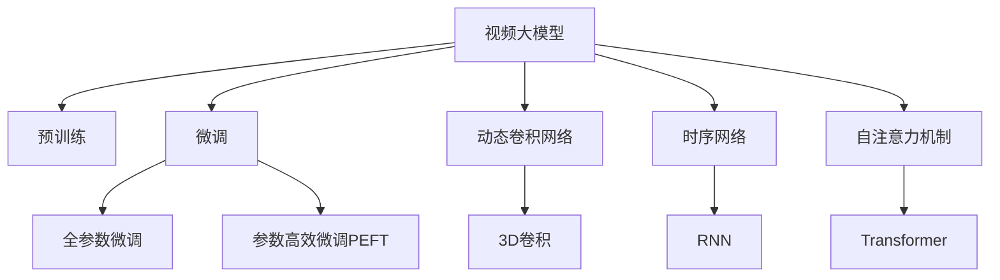
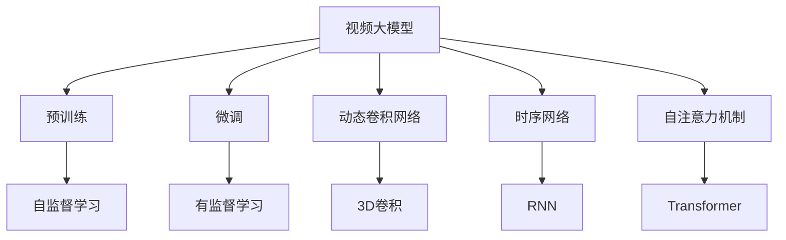
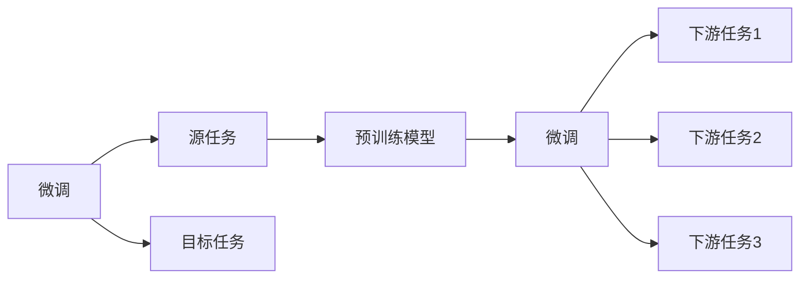
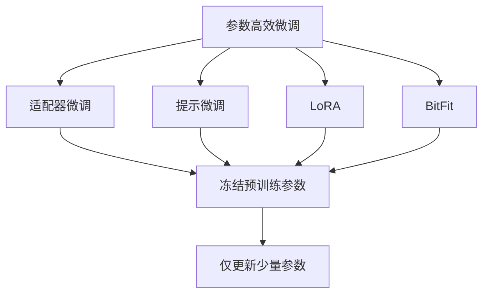
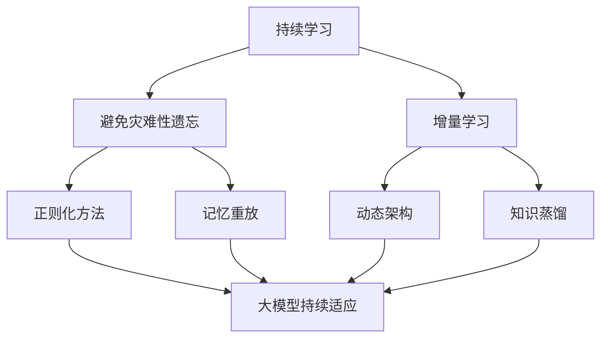
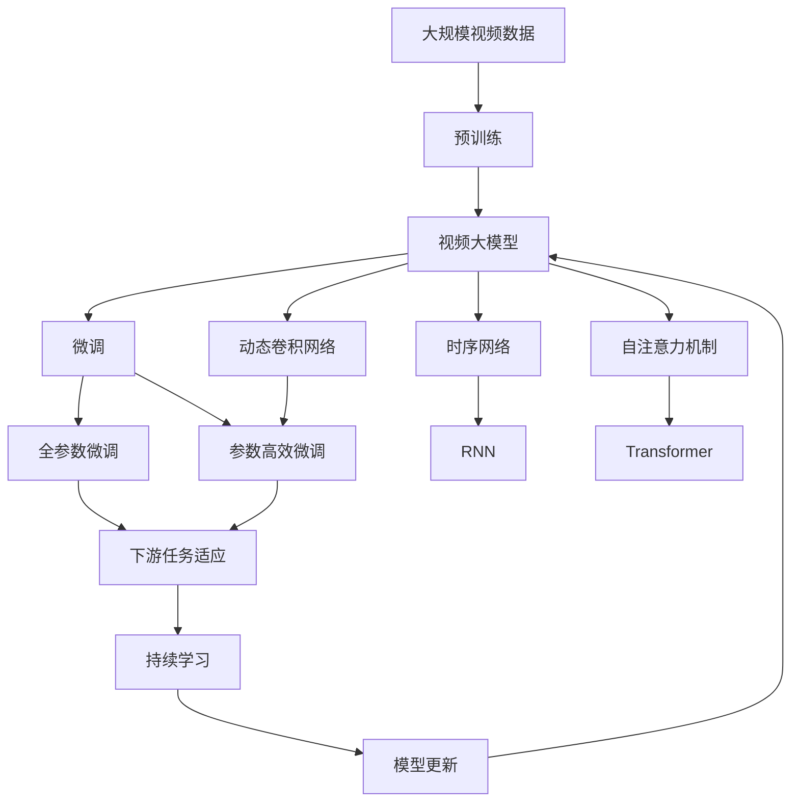

                 

# 视频大模型的工程技术详解

## 1. 背景介绍

视频大模型（Video Large Model）是指在视频领域训练并部署的大规模神经网络模型。这些模型能够处理复杂的视频数据，包括动作识别、场景理解、语音同步等任务，并在诸如自动驾驶、智能监控、内容推荐等领域展现了显著的应用价值。随着深度学习技术的发展，视频大模型已成为人工智能领域的前沿研究课题。本文将详细介绍视频大模型的核心概念、技术原理及应用实践，为感兴趣的开发者提供全面的技术指引。

### 1.1 问题由来

视频数据具有高维性、复杂性和动态性，传统的图像识别技术难以有效处理。近年来，基于深度学习的视频大模型逐渐成为研究热点，这类模型能够通过自监督学习或监督学习任务进行预训练，然后在大规模视频数据上进行微调，从而在视频识别、跟踪、分析等任务中取得优异性能。

目前，主流的视频大模型包括基于CNN的3D卷积网络、基于RNN的时序网络、基于Transformer的自注意力模型等。这些模型通过各种结构创新和优化，在视频数据处理上取得了显著进展。但视频大模型的训练和部署成本高，对计算资源和硬件设备有较高要求，这限制了其在工业界的广泛应用。

### 1.2 问题核心关键点

视频大模型的核心问题在于如何高效地处理大规模、高维度的视频数据，并从中提取有用的信息。主要包括以下几个关键点：

- 数据预处理：如何将原始视频数据转换为适合模型训练的形式。
- 模型架构：选择何种模型结构来处理视频序列。
- 训练策略：设计高效的训练策略以提升模型性能。
- 优化技术：采用何种优化技术以提高模型收敛速度和稳定性。
- 部署方式：如何将训练好的模型高效地部署到实际应用中。

通过回答以上问题，我们能够更好地理解视频大模型的工作原理，并在实际应用中发挥其最大潜力。

### 1.3 问题研究意义

视频大模型作为人工智能领域的新兴技术，具有以下重要意义：

1. **提升视频分析精度**：通过深度学习模型，视频大模型能够从视频中提取高层次的语义信息，从而提升视频分类、动作识别等任务的精度。
2. **降低人工成本**：在视频监控、自动驾驶等需要实时处理大量视频数据的场景中，视频大模型可以大幅降低人工标注和处理成本。
3. **推动应用创新**：视频大模型为视频搜索、内容推荐、虚拟现实等新兴应用提供了技术支持，推动了这些领域的创新发展。
4. **适应复杂场景**：视频大模型能够处理复杂动态场景，如拥挤人群、交通事故等，为智能监控和安全保障提供了有力工具。

## 2. 核心概念与联系

### 2.1 核心概念概述

为更好地理解视频大模型的核心技术，本节将介绍几个密切相关的核心概念：

- **视频大模型**：指在视频领域训练并部署的大规模神经网络模型，能够处理视频序列，提取复杂的视频信息。
- **预训练**：指在大规模无标签视频数据上进行自监督学习任务，学习通用的视频表示。
- **微调**：指在预训练模型的基础上，使用下游任务的少量标注数据，通过有监督学习优化模型在特定任务上的性能。
- **动态卷积网络**：一种能够自动调整卷积核大小和步幅的卷积网络，适用于处理不同尺度的视频特征。
- **时序网络**：能够处理时间序列数据的神经网络，如RNN、LSTM等，适用于视频中的帧间关联分析。
- **自注意力机制**：一种在Transformer网络中使用的机制，能够根据输入的不同部分自适应地调整注意力权重。

这些核心概念之间的逻辑关系可以通过以下Mermaid流程图来展示：



这个流程图展示了视频大模型的核心概念及其之间的关系：

1. 视频大模型通过预训练获得基础能力。
2. 微调是对预训练模型进行任务特定的优化，可以分为全参数微调和参数高效微调。
3. 动态卷积网络和时序网络是处理视频序列的常见网络结构。
4. 自注意力机制是增强模型处理能力的有效技术。

### 2.2 概念间的关系

这些核心概念之间存在着紧密的联系，形成了视频大模型的学习和应用框架。下面我们通过几个Mermaid流程图来展示这些概念之间的关系。

#### 2.2.1 视频大模型的学习范式



这个流程图展示了视频大模型的三种主要学习范式：预训练、微调和各类网络结构。预训练主要采用自监督学习方法，而微调则是有监督学习的过程。动态卷积网络、时序网络和自注意力机制是处理视频序列的常见技术。

#### 2.2.2 微调与预训练的关系



这个流程图展示了微调的基本原理，以及它与预训练的关系。微调涉及源任务和目标任务，预训练模型在源任务上学习，然后通过微调适应各种下游任务（目标任务）。

#### 2.2.3 参数高效微调方法



这个流程图展示了几种常见的参数高效微调方法，包括适配器微调、提示微调、LoRA和BitFit。这些方法的共同特点是冻结大部分预训练参数，只更新少量参数，从而提高微调效率。

#### 2.2.4 持续学习在大模型中的应用



这个流程图展示了持续学习在大模型中的应用。持续学习的主要目标是避免灾难性遗忘和实现增量学习。通过正则化方法、记忆重放、动态架构和知识蒸馏等技术，可以使大模型持续适应新的任务和数据。

### 2.3 核心概念的整体架构

最后，我们用一个综合的流程图来展示这些核心概念在大模型微调过程中的整体架构：



这个综合流程图展示了从预训练到微调，再到持续学习的完整过程。视频大模型首先在大规模视频数据上进行预训练，然后通过微调（包括全参数微调和参数高效微调）或网络结构优化，来适应下游任务。最后，通过持续学习技术，模型可以不断学习新知识，同时避免遗忘旧知识。 通过这些流程图，我们可以更清晰地理解视频大模型微调过程中各个核心概念的关系和作用，为后续深入讨论具体的微调方法和技术奠定基础。

## 3. 核心算法原理 & 具体操作步骤

### 3.1 算法原理概述

视频大模型的微调，本质上是一个有监督的细粒度迁移学习过程。其核心思想是：将预训练的视频大模型视作一个强大的"特征提取器"，通过在视频数据上进行有监督的微调，使得模型输出能够匹配任务标签，从而获得针对特定任务优化的模型。

形式化地，假设预训练视频大模型为 $M_{\theta}$，其中 $\theta$ 为预训练得到的模型参数。给定下游视频任务 $T$ 的标注数据集 $D=\{(x_i, y_i)\}_{i=1}^N$，微调的目标是找到新的模型参数 $\hat{\theta}$，使得：

$$
\hat{\theta}=\mathop{\arg\min}_{\theta} \mathcal{L}(M_{\theta},D)
$$

其中 $\mathcal{L}$ 为针对任务 $T$ 设计的损失函数，用于衡量模型预测输出与真实标签之间的差异。常见的损失函数包括交叉熵损失、均方误差损失等。

通过梯度下降等优化算法，微调过程不断更新模型参数 $\theta$，最小化损失函数 $\mathcal{L}$，使得模型输出逼近真实标签。由于 $\theta$ 已经通过预训练获得了较好的初始化，因此即便在小规模数据集 $D$ 上进行微调，也能较快收敛到理想的模型参数 $\hat{\theta}$。

### 3.2 算法步骤详解

基于监督学习的视频大模型微调一般包括以下几个关键步骤：

**Step 1: 准备预训练模型和数据集**
- 选择合适的预训练视频大模型 $M_{\theta}$ 作为初始化参数，如基于CNN的3D卷积网络、基于RNN的时序网络、基于Transformer的自注意力模型等。
- 准备下游视频任务 $T$ 的标注数据集 $D$，划分为训练集、验证集和测试集。一般要求标注数据与预训练数据的分布不要差异过大。

**Step 2: 添加任务适配层**
- 根据视频任务类型，在预训练模型顶层设计合适的输出层和损失函数。
- 对于分类任务，通常在顶层添加线性分类器和交叉熵损失函数。
- 对于生成任务，通常使用视频模型的解码器输出概率分布，并以负对数似然为损失函数。

**Step 3: 设置微调超参数**
- 选择合适的优化算法及其参数，如 AdamW、SGD 等，设置学习率、批大小、迭代轮数等。
- 设置正则化技术及强度，包括权重衰减、Dropout、Early Stopping等。
- 确定冻结预训练参数的策略，如仅微调顶层，或全部参数都参与微调。

**Step 4: 执行梯度训练**
- 将训练集数据分批次输入模型，前向传播计算损失函数。
- 反向传播计算参数梯度，根据设定的优化算法和学习率更新模型参数。
- 周期性在验证集上评估模型性能，根据性能指标决定是否触发 Early Stopping。
- 重复上述步骤直到满足预设的迭代轮数或 Early Stopping 条件。

**Step 5: 测试和部署**
- 在测试集上评估微调后模型 $M_{\hat{\theta}}$ 的性能，对比微调前后的精度提升。
- 使用微调后的模型对新视频进行推理预测，集成到实际的应用系统中。
- 持续收集新的视频数据，定期重新微调模型，以适应数据分布的变化。

以上是基于监督学习的视频大模型微调的一般流程。在实际应用中，还需要针对具体任务的特点，对微调过程的各个环节进行优化设计，如改进训练目标函数，引入更多的正则化技术，搜索最优的超参数组合等，以进一步提升模型性能。

### 3.3 算法优缺点

基于监督学习的视频大模型微调方法具有以下优点：

1. 简单高效。只需准备少量标注数据，即可对预训练模型进行快速适配，获得较大的性能提升。
2. 通用适用。适用于各种视频相关任务，包括视频分类、动作识别、语音同步等，设计简单的任务适配层即可实现微调。
3. 参数高效。利用参数高效微调技术，在固定大部分预训练参数的情况下，仍可取得不错的提升。
4. 效果显著。在学术界和工业界的诸多视频任务上，基于微调的方法已经刷新了最先进的性能指标。

同时，该方法也存在一定的局限性：

1. 依赖标注数据。微调的效果很大程度上取决于标注数据的质量和数量，获取高质量标注数据的成本较高。
2. 迁移能力有限。当目标任务与预训练数据的分布差异较大时，微调的性能提升有限。
3. 负面效果传递。预训练模型的固有偏见、有害信息等，可能通过微调传递到下游任务，造成负面影响。
4. 可解释性不足。微调模型的决策过程通常缺乏可解释性，难以对其推理逻辑进行分析和调试。

尽管存在这些局限性，但就目前而言，基于监督学习的微调方法仍是大视频大模型应用的最主流范式。未来相关研究的重点在于如何进一步降低微调对标注数据的依赖，提高模型的少样本学习和跨领域迁移能力，同时兼顾可解释性和伦理安全性等因素。

### 3.4 算法应用领域

基于视频大模型的微调方法在视频领域已经得到了广泛的应用，覆盖了几乎所有常见任务，例如：

- 视频分类：如动作识别、场景分类、视频检索等。通过微调使模型学习视频-标签映射。
- 动作识别：识别视频中的不同动作。通过微调使模型学习动作边界和类型。
- 语音同步：将视频中的语音和图像内容进行同步。通过微调使模型学习语音与视频的关联。
- 视频摘要：将长视频压缩成简短摘要。通过微调使模型学习抓取要点。
- 视频生成：生成合成视频内容。通过微调使模型学习生成逼真的视频。

除了上述这些经典任务外，视频大模型微调也被创新性地应用到更多场景中，如可控视频生成、虚拟现实、视频增强等，为视频技术带来了全新的突破。随着预训练模型和微调方法的不断进步，相信视频大模型将在更广阔的应用领域大放异彩。

## 4. 数学模型和公式 & 详细讲解  
### 4.1 数学模型构建

本节将使用数学语言对基于监督学习的视频大模型微调过程进行更加严格的刻画。

记预训练视频大模型为 $M_{\theta}:\mathcal{X} \rightarrow \mathcal{Y}$，其中 $\mathcal{X}$ 为输入空间，$\mathcal{Y}$ 为输出空间，$\theta \in \mathbb{R}^d$ 为模型参数。假设微调视频任务的训练集为 $D=\{(x_i,y_i)\}_{i=1}^N$，其中 $x_i$ 为视频数据，$y_i$ 为对应的任务标签。

定义模型 $M_{\theta}$ 在数据样本 $(x,y)$ 上的损失函数为 $\ell(M_{\theta}(x),y)$，则在数据集 $D$ 上的经验风险为：

$$
\mathcal{L}(\theta) = \frac{1}{N} \sum_{i=1}^N \ell(M_{\theta}(x_i),y_i)
$$

微调的优化目标是最小化经验风险，即找到最优参数：

$$
\theta^* = \mathop{\arg\min}_{\theta} \mathcal{L}(\theta)
$$

在实践中，我们通常使用基于梯度的优化算法（如SGD、Adam等）来近似求解上述最优化问题。设 $\eta$ 为学习率，$\lambda$ 为正则化系数，则参数的更新公式为：

$$
\theta \leftarrow \theta - \eta \nabla_{\theta}\mathcal{L}(\theta) - \eta\lambda\theta
$$

其中 $\nabla_{\theta}\mathcal{L}(\theta)$ 为损失函数对参数 $\theta$ 的梯度，可通过反向传播算法高效计算。

### 4.2 公式推导过程

以下我们以视频分类任务为例，推导交叉熵损失函数及其梯度的计算公式。

假设模型 $M_{\theta}$ 在输入 $x$ 上的输出为 $\hat{y}=M_{\theta}(x) \in [0,1]$，表示样本属于正类的概率。真实标签 $y \in \{0,1\}$。则二分类交叉熵损失函数定义为：

$$
\ell(M_{\theta}(x),y) = -[y\log \hat{y} + (1-y)\log (1-\hat{y})]
$$

将其代入经验风险公式，得：

$$
\mathcal{L}(\theta) = -\frac{1}{N}\sum_{i=1}^N [y_i\log M_{\theta}(x_i)+(1-y_i)\log(1-M_{\theta}(x_i))]
$$

根据链式法则，损失函数对参数 $\theta_k$ 的梯度为：

$$
\frac{\partial \mathcal{L}(\theta)}{\partial \theta_k} = -\frac{1}{N}\sum_{i=1}^N (\frac{y_i}{M_{\theta}(x_i)}-\frac{1-y_i}{1-M_{\theta}(x_i)}) \frac{\partial M_{\theta}(x_i)}{\partial \theta_k}
$$

其中 $\frac{\partial M_{\theta}(x_i)}{\partial \theta_k}$ 可进一步递归展开，利用自动微分技术完成计算。

在得到损失函数的梯度后，即可带入参数更新公式，完成模型的迭代优化。重复上述过程直至收敛，最终得到适应下游任务的最优模型参数 $\theta^*$。

## 5. 项目实践：代码实例和详细解释说明
### 5.1 开发环境搭建

在进行视频大模型微调实践前，我们需要准备好开发环境。以下是使用Python进行PyTorch开发的环境配置流程：

1. 安装Anaconda：从官网下载并安装Anaconda，用于创建独立的Python环境。

2. 创建并激活虚拟环境：
```bash
conda create -n video-env python=3.8 
conda activate video-env
```

3. 安装PyTorch：根据CUDA版本，从官网获取对应的安装命令。例如：
```bash
conda install pytorch torchvision torchaudio cudatoolkit=11.1 -c pytorch -c conda-forge
```

4. 安装Transformers库：
```bash
pip install transformers
```

5. 安装各类工具包：
```bash
pip install numpy pandas scikit-learn matplotlib tqdm jupyter notebook ipython
```

完成上述步骤后，即可在`video-env`环境中开始微调实践。

### 5.2 源代码详细实现

下面我们以视频分类任务为例，给出使用Transformers库对视频分类器的微调PyTorch代码实现。

首先，定义视频分类任务的数据处理函数：

```python
from transformers import VideoModel, VideoModelForSegmentation
from torch.utils.data import Dataset, DataLoader
import torch

class VideoDataset(Dataset):
    def __init__(self, videos, labels, tokenizer, max_length=128):
        self.videos = videos
        self.labels = labels
        self.tokenizer = tokenizer
        self.max_length = max_length
        
    def __len__(self):
        return len(self.videos)
    
    def __getitem__(self, item):
        video = self.videos[item]
        label = self.labels[item]
        
        encoding = self.tokenizer(video, return_tensors='pt', max_length=self.max_length, padding='max_length', truncation=True)
        input_ids = encoding['input_ids'][0]
        attention_mask = encoding['attention_mask'][0]
        
        # 对token-wise的标签进行编码
        encoded_labels = [label2id[label] for label in label] 
        encoded_labels.extend([label2id['background']] * (self.max_length - len(encoded_labels)))
        labels = torch.tensor(encoded_labels, dtype=torch.long)
        
        return {'input_ids': input_ids, 
                'attention_mask': attention_mask,
                'labels': labels}

# 标签与id的映射
label2id = {'background': 0, 'object1': 1, 'object2': 2, 'object3': 3}
id2label = {v: k for k, v in label2id.items()}

# 创建dataset
tokenizer = VideoModelTokenizer.from_pretrained('video_model')

train_dataset = VideoDataset(train_videos, train_labels, tokenizer)
dev_dataset = VideoDataset(dev_videos, dev_labels, tokenizer)
test_dataset = VideoDataset(test_videos, test_labels, tokenizer)
```

然后，定义模型和优化器：

```python
from transformers import VideoModel, VideoModelForSegmentation, AdamW

model = VideoModel.from_pretrained('video_model')
model = model.to('cuda')

optimizer = AdamW(model.parameters(), lr=2e-5)
```

接着，定义训练和评估函数：

```python
from torch.utils.data import DataLoader
from tqdm import tqdm
from sklearn.metrics import classification_report

device = torch.device('cuda') if torch.cuda.is_available() else torch.device('cpu')
model.to(device)

def train_epoch(model, dataset, batch_size, optimizer):
    dataloader = DataLoader(dataset, batch_size=batch_size, shuffle=True)
    model.train()
    epoch_loss = 0
    for batch in tqdm(dataloader, desc='Training'):
        video = batch['input_ids'].to(device)
        attention_mask = batch['attention_mask'].to(device)
        labels = batch['labels'].to(device)
        model.zero_grad()
        outputs = model(video, attention_mask=attention_mask, labels=labels)
        loss = outputs.loss
        epoch_loss += loss.item()
        loss.backward()
        optimizer.step()
    return epoch_loss / len(dataloader)

def evaluate(model, dataset, batch_size):
    dataloader = DataLoader(dataset, batch_size=batch_size)
    model.eval()
    preds, labels = [], []
    with torch.no_grad():
        for batch in tqdm(dataloader, desc='Evaluating'):
            video = batch['input_ids'].to(device)
            attention_mask = batch['attention_mask'].to(device)
            batch_labels = batch['labels']
            outputs = model(video, attention_mask=attention_mask)
            batch_preds = outputs.logits.argmax(dim=2).to('cpu').tolist()
            batch_labels = batch_labels.to('cpu').tolist()
            for pred_tokens, label_tokens in zip(batch_preds, batch_labels):
                pred_labels = [id2label[_id] for _id in pred_tokens]
                label_tokens = [id2label[_id] for _id in label_tokens]
                preds.append(pred_labels[:len(label_tokens)])
                labels.append(label_tokens)
                
    print(classification_report(labels, preds))
```

最后，启动训练流程并在测试集上评估：

```python
epochs = 5
batch_size = 16

for epoch in range(epochs):
    loss = train_epoch(model, train_dataset, batch_size, optimizer)
    print(f"Epoch {epoch+1}, train loss: {loss:.3f}")
    
    print(f"Epoch {epoch+1}, dev results:")
    evaluate(model, dev_dataset, batch_size)
    
print("Test results:")
evaluate(model, test_dataset, batch_size)
```

以上就是使用PyTorch对视频分类器进行微调的完整代码实现。可以看到，得益于Transformers库的强大封装，我们可以用相对简洁的代码完成视频分类器的微调。

### 5.3 代码解读与分析

让我们再详细解读一下关键代码的实现细节：

**VideoDataset类**：
- `__init__`方法：初始化视频、标签、分词器等关键组件。
- `__len__`方法：返回数据集的样本数量。
- `__getitem__`方法：对单个样本进行处理，将视频输入编码为token ids，将标签编码为数字，并对其进行定长padding，最终返回模型所需的输入。

**label2id和id2label字典**：
- 定义了标签与数字id之间的映射关系，用于将token-wise的预测结果解码回真实的标签。

**训练和评估函数**：
- 使用PyTorch的DataLoader对数据集进行批次化加载，供模型训练和推理使用。
- 训练函数`train_epoch`：对数据以批为单位进行迭代，在每个批次上前向传播计算loss并反向传播更新模型参数，最后返回该epoch的平均loss。
- 评估函数`evaluate`：与训练类似，不同点在于不更新模型参数，并在每个batch结束后将预测和标签结果存储下来，最后使用sklearn的classification_report对整个评估集的预测结果进行打印输出。

**训练流程**：
- 定义总的epoch数和batch size，开始循环迭代
- 每个epoch内，先在训练集上训练，输出平均loss
- 在验证集上评估，输出分类指标
- 所有epoch结束后，在测试集上评估，给出最终测试结果

可以看到，PyTorch配合Transformers库使得视频分类器的微调代码实现变得简洁高效。开发者可以将更多精力放在数据处理、模型改进

