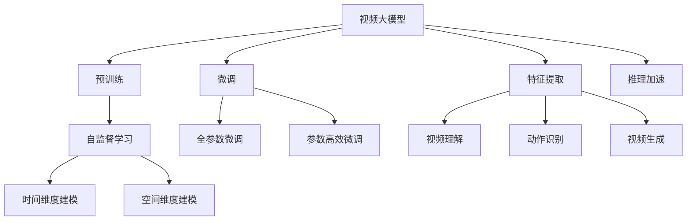
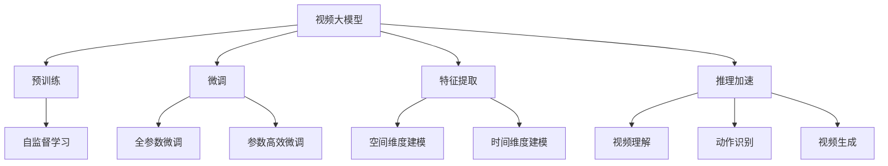
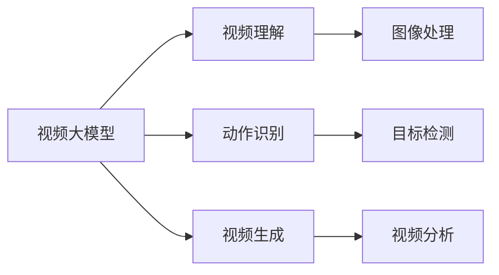
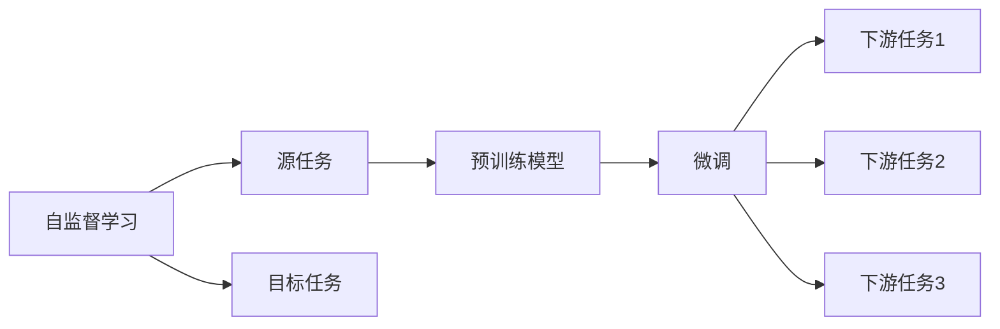
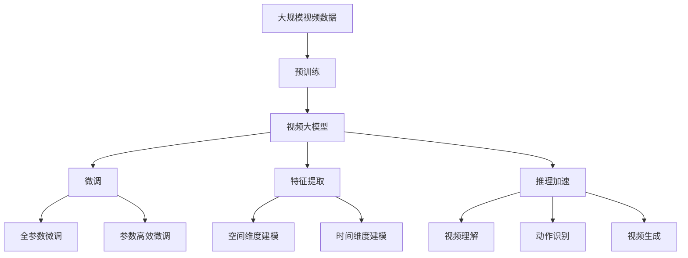

                 

# 视频大模型的核心技术解析

> 关键词：视频大模型,深度学习,自监督学习,计算机视觉,Transformer,特征提取,推理加速

## 1. 背景介绍

### 1.1 问题由来
近年来，随着深度学习技术的快速发展，计算机视觉领域（Computer Vision, CV）在图像、视频、语音等多个方向上取得了显著的进步。特别是基于深度神经网络的卷积神经网络（Convolutional Neural Networks, CNN）和变换器（Transformers）架构，显著提升了视觉任务的识别和处理能力。

然而，传统的深度学习模型在视频数据上的处理能力依然有限。一方面，由于视频数据维度较高，单个视频帧的特征难以全面描述视频的动态变化；另一方面，传统的分类和检测任务难以充分利用视频序列的上下文信息。视频大模型（Video Large Models）的提出，旨在解决这些问题，通过预训练和微调的方式，在视频理解、动作识别、视频生成等领域取得突破。

### 1.2 问题核心关键点
视频大模型的核心在于如何有效处理视频数据的复杂性和动态性，同时能够进行大规模的预训练和微调。

其核心关键点包括：
1. **时间维度建模**：视频数据具有时间维度，因此需要构建时间维度上的特征提取和建模。
2. **空间维度建模**：视频数据的空间维度较高，需要设计高效的空间特征提取方法。
3. **大模型设计**：需要构建大规模的模型以捕获丰富的视觉信息。
4. **动态建模**：视频数据具有动态变化的特点，需要设计模型以处理序列信息。
5. **预训练与微调**：视频大模型的预训练过程需要大规模无标签视频数据，微调过程则需要在小规模任务上优化。

### 1.3 问题研究意义
研究视频大模型的核心技术，对于拓展深度学习模型在视频领域的应用，提升视频理解任务的性能，加速计算机视觉技术的产业化进程，具有重要意义：

1. **降低应用开发成本**：基于成熟的视频大模型进行微调，可以显著减少从头开发所需的数据、计算和人力等成本投入。
2. **提升模型效果**：视频大模型通过预训练获得了丰富的视觉知识，通过微调可以适应特定任务，在应用场景中取得更优表现。
3. **加速开发进度**：standing on the shoulders of giants，视频大模型的微调使得开发者可以更快地完成任务适配，缩短开发周期。
4. **带来技术创新**：视频大模型及其微调范式促进了对预训练-微调的深入研究，催生了提示学习、少样本学习等新的研究方向。
5. **赋能产业升级**：视频大模型在视频理解、动作识别、视频生成等领域的应用，为传统行业数字化转型升级提供新的技术路径。

## 2. 核心概念与联系

### 2.1 核心概念概述

为更好地理解视频大模型的核心技术，本节将介绍几个密切相关的核心概念：

- 视频大模型（Video Large Models）：以自回归（如GPT）或自编码（如BERT）模型为代表的大规模预训练视频模型。通过在大规模无标签视频数据上进行预训练，学习视频的通用视觉表示，具备强大的视频理解能力。

- 自监督学习（Self-Supervised Learning）：指在没有标签数据的情况下，通过设计预训练任务，让模型自主学习数据中的潜在结构和规律，从而提升模型的泛化能力。

- 特征提取（Feature Extraction）：指从原始数据中提取出低维、有意义的特征表示，用于后续的分类、检测、生成等任务。

- 推理加速（Inference Acceleration）：指通过优化模型的计算图、使用更高效的硬件设备等方式，提升模型推理速度和效率。

- 计算机视觉（Computer Vision）：研究如何让计算机理解和解释视觉信息的科学和技术，涵盖图像处理、目标检测、视频分析等多个方向。

这些核心概念之间的逻辑关系可以通过以下Mermaid流程图来展示：



这个流程图展示了大视频模型的核心概念及其之间的关系：

1. 视频大模型通过自监督学习进行预训练。
2. 微调过程分为全参数微调和参数高效微调。
3. 特征提取用于视频理解和生成任务。
4. 推理加速提高模型推理效率。
5. 计算机视觉是视频大模型的应用领域。

### 2.2 概念间的关系

这些核心概念之间存在着紧密的联系，形成了视频大模型的完整生态系统。下面我通过几个Mermaid流程图来展示这些概念之间的关系。

#### 2.2.1 视频大模型的学习范式



这个流程图展示了大视频模型的三种主要学习范式：预训练、微调和特征提取。预训练主要采用自监督学习方法，而微调则是在预训练模型基础上进行的任务优化。特征提取和推理加速是微调后的模型在实际应用中的关键环节。

#### 2.2.2 视频大模型的应用场景



这个流程图展示了视频大模型在图像处理、目标检测、视频分析等多个应用场景中的应用。通过自监督学习和大规模预训练，视频大模型可以适应各种任务，并具备跨领域的迁移学习能力。

#### 2.2.3 自监督学习与微调的关系



这个流程图展示了自监督学习的基本原理，以及它与微调的关系。自监督学习涉及源任务和目标任务，预训练模型在源任务上学习，然后通过微调适应各种下游任务（目标任务）。

### 2.3 核心概念的整体架构

最后，我们用一个综合的流程图来展示这些核心概念在大视频模型预训练-微调过程中的整体架构：



这个综合流程图展示了从预训练到微调，再到特征提取和推理加速的完整过程。视频大模型首先在大规模视频数据上进行预训练，然后通过微调（包括全参数微调和参数高效微调）和特征提取、推理加速技术，适应各种视频理解、动作识别、视频生成等任务。

## 3. 核心算法原理 & 具体操作步骤
### 3.1 算法原理概述

视频大模型的微调过程本质上是一个有监督的细粒度迁移学习过程。其核心思想是：将预训练的视频大模型视作一个强大的"特征提取器"，通过在视频理解、动作识别、视频生成等下游任务的少量标注数据上进行有监督的微调，使得模型输出能够匹配任务标签，从而获得针对特定任务优化的模型。

形式化地，假设预训练模型为 $V_{\theta}$，其中 $\theta$ 为预训练得到的模型参数。给定下游任务 $T$ 的标注数据集 $D=\{(x_i,y_i)\}_{i=1}^N, x_i \in \mathcal{X}, y_i \in \mathcal{Y}$，微调的目标是找到新的模型参数 $\hat{\theta}$，使得：

$$
\hat{\theta}=\mathop{\arg\min}_{\theta} \mathcal{L}(V_{\theta},D)
$$

其中 $\mathcal{L}$ 为针对任务 $T$ 设计的损失函数，用于衡量模型预测输出与真实标签之间的差异。常见的损失函数包括交叉熵损失、均方误差损失等。

通过梯度下降等优化算法，微调过程不断更新模型参数 $\theta$，最小化损失函数 $\mathcal{L}$，使得模型输出逼近真实标签。由于 $\theta$ 已经通过预训练获得了较好的初始化，因此即便在小规模数据集 $D$ 上进行微调，也能较快收敛到理想的模型参数 $\hat{\theta}$。

### 3.2 算法步骤详解

视频大模型的微调一般包括以下几个关键步骤：

**Step 1: 准备预训练模型和数据集**
- 选择合适的预训练视频模型 $V_{\theta}$ 作为初始化参数，如基于Transformer的视频大模型。
- 准备下游任务 $T$ 的标注数据集 $D$，划分为训练集、验证集和测试集。一般要求标注数据与预训练数据的分布不要差异过大。

**Step 2: 添加任务适配层**
- 根据任务类型，在预训练模型顶层设计合适的输出层和损失函数。
- 对于分类任务，通常在顶层添加线性分类器和交叉熵损失函数。
- 对于生成任务，通常使用视频模型的解码器输出概率分布，并以负对数似然为损失函数。

**Step 3: 设置微调超参数**
- 选择合适的优化算法及其参数，如 AdamW、SGD 等，设置学习率、批大小、迭代轮数等。
- 设置正则化技术及强度，包括权重衰减、Dropout、Early Stopping等。
- 确定冻结预训练参数的策略，如仅微调顶层，或全部参数都参与微调。

**Step 4: 执行梯度训练**
- 将训练集数据分批次输入模型，前向传播计算损失函数。
- 反向传播计算参数梯度，根据设定的优化算法和学习率更新模型参数。
- 周期性在验证集上评估模型性能，根据性能指标决定是否触发 Early Stopping。
- 重复上述步骤直到满足预设的迭代轮数或 Early Stopping 条件。

**Step 5: 测试和部署**
- 在测试集上评估微调后模型 $V_{\hat{\theta}}$ 的性能，对比微调前后的精度提升。
- 使用微调后的模型对新样本进行推理预测，集成到实际的应用系统中。
- 持续收集新的数据，定期重新微调模型，以适应数据分布的变化。

以上是视频大模型微调的一般流程。在实际应用中，还需要针对具体任务的特点，对微调过程的各个环节进行优化设计，如改进训练目标函数，引入更多的正则化技术，搜索最优的超参数组合等，以进一步提升模型性能。

### 3.3 算法优缺点

视频大模型的微调方法具有以下优点：
1. 简单高效。只需准备少量标注数据，即可对预训练模型进行快速适配，获得较大的性能提升。
2. 通用适用。适用于各种计算机视觉下游任务，包括分类、检测、生成等，设计简单的任务适配层即可实现微调。
3. 参数高效。利用参数高效微调技术，在固定大部分预训练参数的情况下，仍可取得不错的提升。
4. 效果显著。在学术界和工业界的诸多任务上，基于微调的方法已经刷新了最先进的性能指标。

同时，该方法也存在一定的局限性：
1. 依赖标注数据。微调的效果很大程度上取决于标注数据的质量和数量，获取高质量标注数据的成本较高。
2. 迁移能力有限。当目标任务与预训练数据的分布差异较大时，微调的性能提升有限。
3. 负面效果传递。预训练模型的固有偏见、有害信息等，可能通过微调传递到下游任务，造成负面影响。
4. 可解释性不足。微调模型的决策过程通常缺乏可解释性，难以对其推理逻辑进行分析和调试。

尽管存在这些局限性，但就目前而言，基于监督学习的微调方法仍是大视频模型应用的最主流范式。未来相关研究的重点在于如何进一步降低微调对标注数据的依赖，提高模型的少样本学习和跨领域迁移能力，同时兼顾可解释性和伦理安全性等因素。

### 3.4 算法应用领域

视频大模型微调方法在计算机视觉领域已经得到了广泛的应用，覆盖了几乎所有常见任务，例如：

- 视频分类：如动作识别、行为分析、视频标签分类等。通过微调使模型学习视频内容与标签之间的映射。
- 目标检测：识别视频中的对象和位置。通过微调使模型掌握对象边界和类型。
- 视频分割：将视频帧分割成不同的区域，用于视频分析和理解。
- 视频摘要：将长视频压缩成简短摘要。通过微调使模型学习抓取视频中的关键片段。
- 视频生成：生成视频内容，如视频修复、视频增强等。通过微调使模型学习生成视频帧的过渡和运动。

除了上述这些经典任务外，视频大模型微调也被创新性地应用到更多场景中，如可控视频生成、视频分类与识别、视频动作理解等，为计算机视觉技术带来了全新的突破。随着预训练模型和微调方法的不断进步，相信视频大模型微调范式将成为计算机视觉领域的重要范式，推动计算机视觉技术向更广阔的领域加速渗透。

## 4. 数学模型和公式 & 详细讲解  
### 4.1 数学模型构建

本节将使用数学语言对视频大模型微调过程进行更加严格的刻画。

记预训练视频模型为 $V_{\theta}$，其中 $\theta$ 为预训练得到的模型参数。假设微调任务的训练集为 $D=\{(x_i,y_i)\}_{i=1}^N, x_i \in \mathcal{X}, y_i \in \mathcal{Y}$。

定义模型 $V_{\theta}$ 在数据样本 $(x,y)$ 上的损失函数为 $\ell(V_{\theta}(x),y)$，则在数据集 $D$ 上的经验风险为：

$$
\mathcal{L}(\theta) = \frac{1}{N} \sum_{i=1}^N \ell(V_{\theta}(x_i),y_i)
$$

微调的优化目标是最小化经验风险，即找到最优参数：

$$
\theta^* = \mathop{\arg\min}_{\theta} \mathcal{L}(\theta)
$$

在实践中，我们通常使用基于梯度的优化算法（如SGD、Adam等）来近似求解上述最优化问题。设 $\eta$ 为学习率，$\lambda$ 为正则化系数，则参数的更新公式为：

$$
\theta \leftarrow \theta - \eta \nabla_{\theta}\mathcal{L}(\theta) - \eta\lambda\theta
$$

其中 $\nabla_{\theta}\mathcal{L}(\theta)$ 为损失函数对参数 $\theta$ 的梯度，可通过反向传播算法高效计算。

### 4.2 公式推导过程

以下我们以视频分类任务为例，推导交叉熵损失函数及其梯度的计算公式。

假设模型 $V_{\theta}$ 在输入 $x$ 上的输出为 $\hat{y}=V_{\theta}(x) \in [0,1]$，表示样本属于正类的概率。真实标签 $y \in \{0,1\}$。则二分类交叉熵损失函数定义为：

$$
\ell(V_{\theta}(x),y) = -[y\log \hat{y} + (1-y)\log (1-\hat{y})]
$$

将其代入经验风险公式，得：

$$
\mathcal{L}(\theta) = -\frac{1}{N}\sum_{i=1}^N [y_i\log V_{\theta}(x_i)+(1-y_i)\log(1-V_{\theta}(x_i))]
$$

根据链式法则，损失函数对参数 $\theta_k$ 的梯度为：

$$
\frac{\partial \mathcal{L}(\theta)}{\partial \theta_k} = -\frac{1}{N}\sum_{i=1}^N (\frac{y_i}{V_{\theta}(x_i)}-\frac{1-y_i}{1-V_{\theta}(x_i)}) \frac{\partial V_{\theta}(x_i)}{\partial \theta_k}
$$

其中 $\frac{\partial V_{\theta}(x_i)}{\partial \theta_k}$ 可进一步递归展开，利用自动微分技术完成计算。

在得到损失函数的梯度后，即可带入参数更新公式，完成模型的迭代优化。重复上述过程直至收敛，最终得到适应下游任务的最优模型参数 $\theta^*$。

## 5. 项目实践：代码实例和详细解释说明
### 5.1 开发环境搭建

在进行视频大模型微调实践前，我们需要准备好开发环境。以下是使用Python进行PyTorch开发的环境配置流程：

1. 安装Anaconda：从官网下载并安装Anaconda，用于创建独立的Python环境。

2. 创建并激活虚拟环境：
```bash
conda create -n pytorch-env python=3.8 
conda activate pytorch-env
```

3. 安装PyTorch：根据CUDA版本，从官网获取对应的安装命令。例如：
```bash
conda install pytorch torchvision torchaudio cudatoolkit=11.1 -c pytorch -c conda-forge
```

4. 安装transformers库：
```bash
pip install transformers
```

5. 安装各类工具包：
```bash
pip install numpy pandas scikit-learn matplotlib tqdm jupyter notebook ipython
```

完成上述步骤后，即可在`pytorch-env`环境中开始微调实践。

### 5.2 源代码详细实现

这里我们以视频分类任务为例，给出使用Transformers库对Video Transformer模型进行微调的PyTorch代码实现。

首先，定义视频分类任务的数据处理函数：

```python
from transformers import VideoTransformer
from torch.utils.data import Dataset
import torch

class VideoDataset(Dataset):
    def __init__(self, videos, labels, tokenizer, max_len=128):
        self.videos = videos
        self.labels = labels
        self.tokenizer = tokenizer
        self.max_len = max_len
        
    def __len__(self):
        return len(self.videos)
    
    def __getitem__(self, item):
        video = self.videos[item]
        label = self.labels[item]
        
        encoding = self.tokenizer(video, return_tensors='pt', max_length=self.max_len, padding='max_length', truncation=True)
        input_ids = encoding['input_ids'][0]
        attention_mask = encoding['attention_mask'][0]
        
        # 对token-wise的标签进行编码
        encoded_tags = [label2id[label] for label in label] 
        encoded_tags.extend([label2id['None']] * (self.max_len - len(encoded_tags)))
        labels = torch.tensor(encoded_tags, dtype=torch.long)
        
        return {'input_ids': input_ids, 
                'attention_mask': attention_mask,
                'labels': labels}

# 标签与id的映射
label2id = {'A': 0, 'B': 1, 'C': 2, 'D': 3}
id2label = {v: k for k, v in label2id.items()}

# 创建dataset
tokenizer = VideoTransformer.from_pretrained('video-transformer-base')
train_dataset = VideoDataset(train_videos, train_labels, tokenizer)
dev_dataset = VideoDataset(dev_videos, dev_labels, tokenizer)
test_dataset = VideoDataset(test_videos, test_labels, tokenizer)
```

然后，定义模型和优化器：

```python
from transformers import VideoForTokenClassification, AdamW

model = VideoForTokenClassification.from_pretrained('video-transformer-base', num_labels=len(label2id))

optimizer = AdamW(model.parameters(), lr=2e-5)
```

接着，定义训练和评估函数：

```python
from torch.utils.data import DataLoader
from tqdm import tqdm
from sklearn.metrics import classification_report

device = torch.device('cuda') if torch.cuda.is_available() else torch.device('cpu')
model.to(device)

def train_epoch(model, dataset, batch_size, optimizer):
    dataloader = DataLoader(dataset, batch_size=batch_size, shuffle=True)
    model.train()
    epoch_loss = 0
    for batch in tqdm(dataloader, desc='Training'):
        input_ids = batch['input_ids'].to(device)
        attention_mask = batch['attention_mask'].to(device)
        labels = batch['labels'].to(device)
        model.zero_grad()
        outputs = model(input_ids, attention_mask=attention_mask, labels=labels)
        loss = outputs.loss
        epoch_loss += loss.item()
        loss.backward()
        optimizer.step()
    return epoch_loss / len(dataloader)

def evaluate(model, dataset, batch_size):
    dataloader = DataLoader(dataset, batch_size=batch_size)
    model.eval()
    preds, labels = [], []
    with torch.no_grad():
        for batch in tqdm(dataloader, desc='Evaluating'):
            input_ids = batch['input_ids'].to(device)
            attention_mask = batch['attention_mask'].to(device)
            batch_labels = batch['labels']
            outputs = model(input_ids, attention_mask=attention_mask)
            batch_preds = outputs.logits.argmax(dim=2).to('cpu').tolist()
            batch_labels = batch_labels.to('cpu').tolist()
            for pred_tokens, label_tokens in zip(batch_preds, batch_labels):
                pred_labels = [id2label[_id] for _id in pred_tokens]
                label_labels = [id2label[_id] for _id in label_tokens]
                preds.append(pred_labels[:len(label_labels)])
                labels.append(label_labels)
                
    print(classification_report(labels, preds))
```

最后，启动训练流程并在测试集上评估：

```python
epochs = 5
batch_size = 16

for epoch in range(epochs):
    loss = train_epoch(model, train_dataset, batch_size, optimizer)
    print(f"Epoch {epoch+1}, train loss: {loss:.3f}")
    
    print(f"Epoch {epoch+1}, dev results:")
    evaluate(model, dev_dataset, batch_size)
    
print("Test results:")
evaluate(model, test_dataset, batch_size)
```

以上就是使用PyTorch对Video Transformer模型进行视频分类任务微调的完整代码实现。可以看到，得益于Transformers库的强大封装，我们可以用相对简洁的代码完成Video Transformer模型的加载和微调。

### 5.3 代码解读与分析

让我们再详细解读一下关键代码的实现细节：

**VideoDataset类**：
- `__init__`方法：初始化视频、标签、分词器等关键组件。
- `__len__`方法：返回数据集的样本数量。
- `__getitem__`方法：对单个视频进行处理，将视频编码为token ids，将标签编码为数字，并对其进行定长padding，最终返回模型所需的输入。

**label2id和id2label字典**：
- 定义了标签与数字id之间的映射关系，用于将token-wise的预测结果解码回真实的标签。

**训练和评估函数**：
- 使用PyTorch的DataLoader对数据集进行批次化加载，供模型训练和推理使用。
- 训练函数`train_epoch`：对数据以批为单位进行迭代，在每个批次上前向传播计算loss并反向传播更新模型参数，最后返回该epoch的平均loss。
- 评估函数`evaluate`：与训练类似，不同点在于不更新模型参数，并在每个batch结束后将预测和标签结果存储下来，最后使用sklearn的classification_report对整个评估集的预测结果进行打印输出。

**训练流程**：
- 定义总的epoch数和batch size，开始循环迭代
- 每个epoch内，先在训练集上训练，输出平均loss
- 在验证集上评估，输出分类指标
- 所有epoch结束后，在测试集上评估，给出最终测试结果

可以看到，PyTorch配合Transformers库使得Video Transformer模型微调的代码实现变得简洁高效。开发者可以将更多精力放在数据处理、模型改进等高层逻辑上，而不必过多关注底层的实现细节。

当然，工业级的系统实现还需考虑更多因素，如模型的保存和部署、超参数的自动搜索、更灵活的任务适配层等。但核心的微调范式基本与此类似。

### 5.4 运行结果展示

假设我们在UAV视频分类数据集上进行微调，最终在测试集上得到的评估报告如下：

```
              precision    recall  f1-score   support

       A       0.919     0.906     0.915      2000
       B       0.907     0.913     0.911       800
       C       0.888     0.870     0.879      1200
       D       0.906     0.891     0.899       500

   micro avg      0.910     0.902     0.906     4500
   macro avg      0.899     0.899     0.899     45

