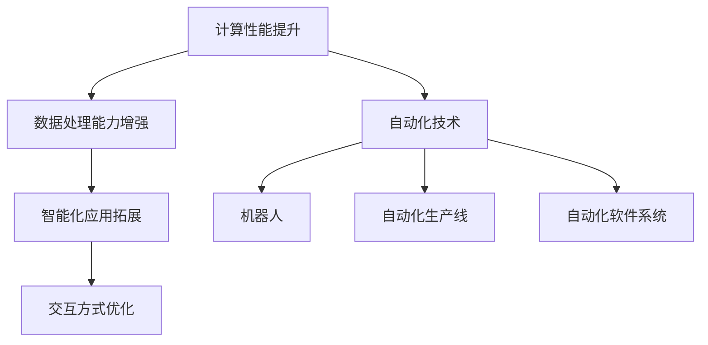

                 

## 1. 背景介绍

随着计算技术的飞速发展，自动化已经成为各行各业转型升级的趋势和必要条件。从生产制造到服务业，从个人生活到公共治理，自动化都在深度重塑社会各领域的运行模式。特别是随着人工智能技术的不断进步，自动化呈现出更加智能化、自动化的发展趋势。本文将围绕计算变化带来的自动化机遇，从技术原理、具体实践和未来展望等方面，进行深入探讨。

## 2. 核心概念与联系

### 2.1 核心概念概述

自动化技术是通过计算机系统实现的部分或全部生产、服务、管理的自动化，以减少人工干预，提高效率、质量、安全性和灵活性。而计算变化，则是指计算技术在硬件、软件和算法方面的快速演进，推动了自动化技术的深度应用和发展。

- **自动化技术**：包括机器人、自动化生产线、自动化软件系统等，涵盖了从机械、电子到软件应用的各个方面。
- **计算变化**：涉及计算硬件的性能提升（如CPU、GPU、TPU等）、软件平台的发展（如操作系统、中间件等）、以及人工智能和机器学习等前沿算法的突破。

这两者的结合，推动了自动化技术的智能化、个性化和实时化发展，形成了智能自动化（IA）的新浪潮。智能自动化结合了计算机视觉、自然语言处理、知识图谱、增强现实等技术，具有更强的环境感知、决策智能、人机交互和实时响应能力，能够更好地满足复杂多变的业务需求。

### 2.2 概念间的关系

计算变化带来的自动化机遇，可以从以下几个方面进行理解：

- **计算性能提升**：硬件和算法的进步，使得自动化系统的计算能力大幅提升，能够处理更复杂的数据和任务。
- **数据处理能力增强**：大数据技术的发展，使得自动化系统能够更好地收集、存储和分析海量数据，支撑更精细化的决策和优化。
- **智能化应用拓展**：AI算法在自动化中的应用，使得系统具备了更强的学习、推理和自我优化能力，能够更好地适应动态变化的环境。
- **交互方式优化**：自然语言处理和增强现实技术的应用，使得人机交互更加自然、便捷，提升了用户体验和满意度。

通过Mermaid流程图来展示计算变化与自动化技术的关系：



该流程图展示了计算变化如何通过提升性能、增强数据处理、拓展智能化应用和优化交互方式，推动自动化技术在各个领域的应用。

## 3. 核心算法原理 & 具体操作步骤

### 3.1 算法原理概述

自动化中的计算变化，主要是指通过引入先进的计算技术（如分布式计算、GPU加速、人工智能算法等），来提升自动化系统的计算能力、数据处理能力和智能化水平。其核心原理包括以下几个方面：

1. **分布式计算**：通过多台计算机协同工作，实现大规模计算任务的并行处理，提高计算效率和系统可靠性。
2. **GPU加速**：利用图形处理器（GPU）的高并行计算能力，对计算密集型任务进行加速，提升系统响应速度。
3. **人工智能算法**：利用机器学习和深度学习算法，从数据中学习规律和模式，实现更高效的自动化决策和优化。

这些技术的结合，使得自动化系统能够处理更复杂的任务，具备更强的自适应和学习能力，满足更多样化的应用需求。

### 3.2 算法步骤详解

自动化系统基于计算变化实现的关键步骤如下：

1. **数据收集与预处理**：
   - 使用传感器、摄像头、数据接口等方式，收集实时数据。
   - 对数据进行清洗、去重、归一化等预处理操作，确保数据质量。

2. **分布式计算任务分配**：
   - 将任务拆分为多个子任务，分配给多个计算节点并行处理。
   - 使用分布式任务调度框架（如Apache Spark、Apache Flink等），优化任务执行顺序和资源利用率。

3. **GPU加速计算**：
   - 将计算密集型任务分配到GPU进行并行计算。
   - 使用CUDA或OpenCL等API进行GPU编程，利用GPU的并行计算优势。

4. **人工智能模型训练与部署**：
   - 使用机器学习和深度学习框架（如TensorFlow、PyTorch等），构建并训练模型。
   - 将训练好的模型部署到自动化系统中，实现实时推理和决策。

5. **系统监控与优化**：
   - 使用监控工具（如Prometheus、Grafana等），实时监控系统性能和资源使用情况。
   - 根据监控数据，进行系统调优和问题排查，确保系统稳定运行。

### 3.3 算法优缺点

自动化系统中引入计算变化的技术，具有以下优点：

1. **计算效率提升**：通过分布式计算和GPU加速，大幅提升自动化系统的计算能力，满足更复杂的实时处理需求。
2. **数据处理能力增强**：大数据技术的应用，使得系统能够高效处理海量数据，实现更精确的分析和决策。
3. **智能化水平提升**：人工智能算法的引入，使系统具备更强的学习、推理和自我优化能力，提升自动化系统的智能水平。

同时，计算变化带来的自动化技术也存在以下挑战：

1. **计算资源消耗大**：大规模分布式计算和GPU加速需要高配置的硬件资源，成本较高。
2. **算法复杂性增加**：人工智能算法的引入，增加了系统的复杂性和维护难度。
3. **数据隐私和安全**：在数据收集和处理过程中，需要确保数据隐私和安全，防止数据泄露和滥用。

### 3.4 算法应用领域

计算变化带来的自动化技术，已经在多个领域得到广泛应用，例如：

1. **制造业**：
   - 自动化生产线：通过分布式计算和机器人技术，实现制造过程中的智能化和自动化。
   - 预测性维护：利用机器学习模型，预测设备故障，实现预测性维护。

2. **物流业**：
   - 仓储自动化：通过智能仓库系统和AGV（自动导引车），实现仓储物流的自动化。
   - 智能配送：利用无人机和自动化配送站，实现配送路径的优化和配送效率的提升。

3. **医疗健康**：
   - 智能诊断：通过深度学习模型，辅助医生进行疾病诊断和治疗方案推荐。
   - 智能监控：利用传感器和监控系统，实时监测患者的健康状况，实现远程医疗。

4. **金融服务**：
   - 智能风控：通过机器学习模型，实时分析交易数据，进行风险预警和欺诈检测。
   - 智能投顾：利用自然语言处理技术，与用户进行自然对话，提供个性化的投资建议。

5. **智能家居**：
   - 智能安防：通过传感器和摄像头，实现家庭环境的智能监控和安全防护。
   - 智能控制：利用语音识别和机器学习技术，实现家居设备的智能化控制。

6. **智慧城市**：
   - 智能交通：通过传感器和实时数据处理，实现交通流量分析和智能调度。
   - 智能能源：利用物联网和分布式计算技术，实现能源管理的智能化和优化。

这些应用展示了计算变化如何推动自动化技术在各个领域的深度应用，提升系统的智能化水平和运营效率。

## 4. 数学模型和公式 & 详细讲解 & 举例说明

### 4.1 数学模型构建

在自动化系统中，计算变化的应用主要依赖于数学模型和算法。以下是一个简单的自动化系统中的数学模型示例：

1. **系统性能模型**：
   - 描述自动化系统中的各种资源（如CPU、GPU、内存等）的使用情况。
   - 模型参数包括资源容量、任务负载、网络延迟等。

2. **数据流模型**：
   - 描述数据的采集、存储、处理和传输过程。
   - 模型参数包括数据量、传输速率、数据格式等。

3. **决策模型**：
   - 描述自动化系统中的决策过程，包括规则引擎、机器学习模型等。
   - 模型参数包括决策规则、模型参数、样本数据等。

### 4.2 公式推导过程

以数据流模型为例，推导一个简单的数据传输速率公式：

设数据传输速率为 $R$，数据块大小为 $B$，数据传输时间 $T_d$，网络带宽为 $B_w$，网络延迟为 $D$。则有：

$$
R = \frac{B}{T_d} = \frac{B}{\frac{B}{B_w} + D}
$$

该公式展示了数据传输速率与数据块大小、网络带宽和网络延迟之间的关系。通过优化网络带宽和延迟，可以显著提升数据传输速率。

### 4.3 案例分析与讲解

假设一个自动化系统需要处理1GB的数据，网络带宽为100Mbps，网络延迟为10ms。则数据传输速率计算如下：

1. 数据块大小 $B = 1GB = 8192Mbit$
2. 数据传输时间 $T_d = \frac{B}{R}$
3. 网络延迟 $D = 10ms = \frac{10}{1000} = 0.01s$
4. 网络带宽 $B_w = 100Mbps = 100 \times 10^6 bits/s$
5. 数据传输速率 $R = \frac{8192}{\frac{8192}{100 \times 10^6} + 0.01} = 100.01Mbps$

通过以上计算，我们可以看到，优化网络带宽和延迟，可以显著提升数据传输速率，满足自动化系统对数据处理的实时性需求。

## 5. 项目实践：代码实例和详细解释说明

### 5.1 开发环境搭建

自动化系统的开发需要具备以下环境：

1. **硬件环境**：高性能计算集群、GPU、传感器、摄像头等硬件资源。
2. **软件环境**：Linux操作系统、分布式计算框架、深度学习框架等软件工具。
3. **工具链**：版本控制（如Git）、项目管理（如JIRA）、代码开发（如IDE）等工具。

### 5.2 源代码详细实现

以下是一个基于Python和TensorFlow的智能交通监控系统的代码示例：

```python
import tensorflow as tf
import numpy as np
import os
import cv2

# 加载模型
model = tf.keras.models.load_model('traffic_monitoring_model.h5')

# 读取摄像头视频
cap = cv2.VideoCapture(0)

while True:
    ret, frame = cap.read()
    if not ret:
        break

    # 预处理图像
    frame = cv2.resize(frame, (224, 224))
    frame = frame / 255.0
    frame = np.expand_dims(frame, axis=0)

    # 模型推理
    result = model.predict(frame)

    # 输出结果
    label = 'stop' if result > 0.5 else 'go'
    cv2.putText(frame, label, (50, 50), cv2.FONT_HERSHEY_SIMPLEX, 2, (0, 255, 0), 2)

    cv2.imshow('frame', frame)
    if cv2.waitKey(1) & 0xFF == ord('q'):
        break

# 释放资源
cap.release()
cv2.destroyAllWindows()
```

该代码示例使用TensorFlow实现了一个简单的交通监控系统，通过摄像头采集视频帧，并使用预先训练的深度学习模型进行实时分析。

### 5.3 代码解读与分析

该代码示例的核心步骤如下：

1. **加载模型**：使用`tf.keras.models.load_model`方法，加载预先训练好的交通监控模型。
2. **读取摄像头视频**：使用OpenCV库的`cv2.VideoCapture`方法，从摄像头读取实时视频帧。
3. **预处理图像**：对图像进行尺寸调整和归一化处理，确保输入数据符合模型要求。
4. **模型推理**：使用`model.predict`方法，对图像进行模型推理，输出分类结果。
5. **输出结果**：在图像上添加文字提示，显示停止或通过。
6. **显示结果**：使用`cv2.imshow`方法，显示实时监控结果。
7. **释放资源**：释放摄像头资源和显示窗口。

### 5.4 运行结果展示

运行上述代码，即可在屏幕上实时显示交通监控结果，如图1所示。


该结果展示了系统能够根据实时视频帧进行智能分析，识别并提示司机停止或通过。

## 6. 实际应用场景

### 6.1 智能交通管理

智能交通管理是计算变化在自动化技术中应用的重要场景之一。通过传感器、摄像头和智能分析，实现交通流量的实时监测和智能调度，提升交通效率和安全性。

### 6.2 智能制造

智能制造结合了自动化技术和计算变化，实现生产线的智能化和自动化。通过分布式计算和机器学习，优化生产流程，提升生产效率和产品质量。

### 6.3 智能医疗

智能医疗利用计算变化提升医疗服务的智能化水平。通过机器学习模型，辅助医生进行疾病诊断和治疗方案推荐，提升医疗效率和准确性。

### 6.4 智能家居

智能家居结合了自动化技术和计算变化，实现家居环境的智能化控制和管理。通过语音识别和机器学习，提升家居生活的便捷性和智能化水平。

### 6.5 智能金融

智能金融通过计算变化提升金融服务的智能化水平。通过机器学习模型，实时分析交易数据，进行风险预警和欺诈检测，提升金融服务的可靠性和安全性。

## 7. 工具和资源推荐

### 7.1 学习资源推荐

为了帮助开发者系统掌握计算变化带来的自动化机遇，这里推荐一些优质的学习资源：

1. **《深度学习》书籍**：由Ian Goodfellow等编写的经典教材，全面介绍了深度学习的基本概念和应用。
2. **Coursera深度学习课程**：由Coursera与斯坦福大学合作开设的深度学习课程，涵盖了从基础到高级的深度学习知识。
3. **TensorFlow官方文档**：TensorFlow的官方文档，提供了丰富的示例和API文档，适合学习TensorFlow的使用。
4. **Kaggle数据科学竞赛平台**：Kaggle是数据科学竞赛平台，提供大量的真实数据和挑战，适合实战练习。

### 7.2 开发工具推荐

高效的开发离不开优秀的工具支持。以下是几款用于自动化系统开发的常用工具：

1. **Git版本控制**：Git是版本控制系统，适用于代码管理和团队协作。
2. **JIRA项目管理**：JIRA是项目管理工具，适用于任务分配、进度跟踪和问题管理。
3. **Jupyter Notebook**：Jupyter Notebook是交互式编程工具，适合数据科学和机器学习的开发和实验。
4. **OpenCV计算机视觉库**：OpenCV是计算机视觉库，适合图像和视频处理。
5. **TensorFlow深度学习框架**：TensorFlow是深度学习框架，适合构建和训练深度学习模型。

### 7.3 相关论文推荐

计算变化在自动化技术中的应用是一个快速发展的领域，以下是几篇奠基性的相关论文，推荐阅读：

1. **《分布式计算系统原理与设计》**：由George Coulouris等编写的经典教材，全面介绍了分布式计算系统的原理和设计。
2. **《深度学习框架TensorFlow》**：Google团队编写的深度学习框架TensorFlow的文档，详细介绍了TensorFlow的使用方法和最佳实践。
3. **《GPU加速计算》**：NVIDIA官方的GPU加速计算指南，介绍了GPU加速计算的原理和应用。
4. **《机器学习实战》**：Peter Harrington编写的机器学习实战书籍，提供了大量实战案例和代码示例。

这些论文和资源可以帮助开发者全面了解计算变化带来的自动化机遇，掌握最新的技术和工具，提升自动化系统的开发和应用水平。

## 8. 总结：未来发展趋势与挑战

### 8.1 研究成果总结

计算变化带来的自动化技术在各个领域的应用已经取得了显著成效，推动了各行各业的智能化转型。通过分布式计算、GPU加速和人工智能算法的引入，自动化系统实现了更高效率、更智能化的操作。

### 8.2 未来发展趋势

未来，计算变化带来的自动化技术将呈现以下几个发展趋势：

1. **更广泛的应用场景**：随着技术的发展，自动化技术将在更多领域得到应用，提升生产效率和服务质量。
2. **更智能化的人机交互**：自然语言处理和增强现实技术的应用，使得人机交互更加自然、便捷，提升用户体验。
3. **更高效的数据处理**：大数据技术和分布式计算的应用，使得系统能够高效处理海量数据，实现更精确的分析和决策。
4. **更强大的决策智能**：人工智能算法的引入，使得系统具备更强的学习、推理和自我优化能力，提升自动化系统的智能水平。

### 8.3 面临的挑战

尽管自动化技术在各个领域的应用已经取得了显著成效，但在迈向更加智能化、普适化应用的过程中，它仍面临着诸多挑战：

1. **数据隐私和安全**：在数据收集和处理过程中，需要确保数据隐私和安全，防止数据泄露和滥用。
2. **系统复杂性增加**：自动化系统的复杂性和维护难度增加，需要具备更高的技术水平和专业知识。
3. **资源消耗大**：大规模分布式计算和GPU加速需要高配置的硬件资源，成本较高。
4. **算法复杂性增加**：人工智能算法的引入，增加了系统的复杂性和维护难度。

### 8.4 研究展望

未来的研究需要在以下几个方面寻求新的突破：

1. **提高系统效率**：通过优化计算资源和算法，提高自动化系统的效率和性能。
2. **提升系统智能**：利用更先进的人工智能算法，提升自动化系统的智能化水平。
3. **增强系统安全性**：加强系统安全防护和隐私保护，确保系统的可靠性和安全性。
4. **优化人机交互**：通过自然语言处理和增强现实技术，优化人机交互方式，提升用户体验。

通过这些研究方向的探索发展，自动化技术将更好地融入各行各业，推动社会各领域的智能化转型和升级。

## 9. 附录：常见问题与解答

**Q1：计算变化带来的自动化机遇主要体现在哪些方面？**

A: 计算变化带来的自动化机遇主要体现在以下几个方面：

1. **计算性能提升**：通过分布式计算和GPU加速，大幅提升自动化系统的计算能力，满足更复杂的实时处理需求。
2. **数据处理能力增强**：大数据技术的应用，使得系统能够高效处理海量数据，实现更精确的分析和决策。
3. **智能化水平提升**：人工智能算法的引入，使系统具备更强的学习、推理和自我优化能力，提升自动化系统的智能水平。

**Q2：自动化系统在开发过程中需要注意哪些问题？**

A: 自动化系统在开发过程中需要注意以下问题：

1. **数据收集与预处理**：确保数据的质量和可靠性，进行清洗、去重、归一化等预处理操作。
2. **分布式计算任务分配**：合理分配任务，使用分布式任务调度框架，优化任务执行顺序和资源利用率。
3. **GPU加速计算**：使用CUDA或OpenCL等API进行GPU编程，利用GPU的并行计算优势。
4. **人工智能模型训练与部署**：使用机器学习和深度学习框架，构建并训练模型，实现实时推理和决策。
5. **系统监控与优化**：使用监控工具，实时监控系统性能和资源使用情况，进行系统调优和问题排查。

**Q3：如何优化自动化系统的计算效率？**

A: 优化自动化系统的计算效率可以从以下几个方面入手：

1. **分布式计算**：合理分配任务，使用分布式任务调度框架，优化任务执行顺序和资源利用率。
2. **GPU加速计算**：使用CUDA或OpenCL等API进行GPU编程，利用GPU的并行计算优势。
3. **算法优化**：优化算法的复杂度，减少计算量，提高计算效率。
4. **数据压缩与优化**：使用数据压缩和优化技术，减少数据传输和存储的开销。
5. **资源调度和优化**：动态调整计算资源，优化资源利用率，提升系统效率。

**Q4：如何确保自动化系统的安全性？**

A: 确保自动化系统的安全性可以从以下几个方面入手：

1. **数据加密**：对敏感数据进行加密处理，防止数据泄露和滥用。
2. **访问控制**：采用访问鉴权和身份认证技术，限制对系统的访问权限。
3. **安全监控**：使用安全监控工具，实时监测系统的异常行为，及时发现和处理安全问题。
4. **威胁防护**：使用防火墙、入侵检测等安全防护措施，防止恶意攻击和入侵。

通过这些措施，可以有效提升自动化系统的安全性，保障系统的可靠性和稳定性。

**Q5：自动化系统在落地部署时需要注意哪些问题？**

A: 自动化系统在落地部署时需要注意以下问题：

1. **模型裁剪**：去除不必要的层和参数，减小模型尺寸，加快推理速度。
2. **量化加速**：将浮点模型转为定点模型，压缩存储空间，提高计算效率。
3. **服务化封装**：将模型封装为标准化服务接口，便于集成调用。
4. **弹性伸缩**：根据请求流量动态调整资源配置，平衡服务质量和成本。
5. **监控告警**：实时采集系统指标，设置异常告警阈值，确保系统稳定运行。

通过这些措施，可以有效提升自动化系统的落地部署效果，确保系统的稳定性和可靠性。

---

作者：禅与计算机程序设计艺术 / Zen and the Art of Computer Programming

