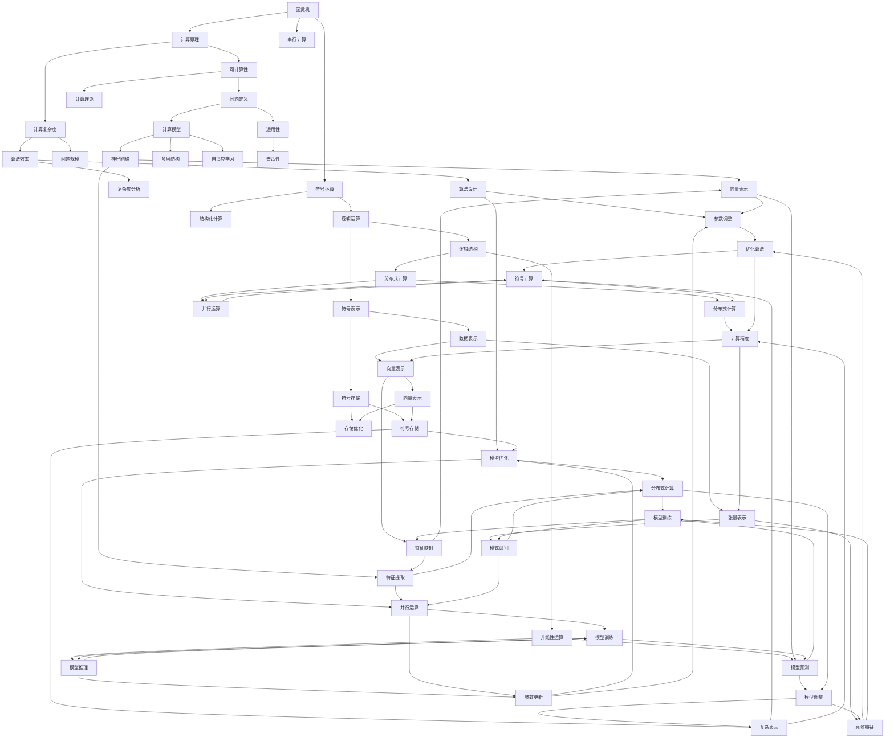

                 

# 计算范式的变革：从图灵机到神经网络

## 1. 背景介绍

### 1.1 问题由来
计算范式的演进，是人类文明进步的重要标志之一。从早期的机械计算，到基于逻辑的符号运算，再到现代的神经网络计算，这一过程蕴含了深刻的历史意义和哲学思考。理解计算范式的变革，不仅有助于我们认识计算的过去和现在，更能够洞察计算的未来。

现代计算机科学的根基，是1936年图灵提出的图灵机模型。图灵机为计算问题提供了一个普遍有效的定义，奠定了现代计算理论的基础。图灵机的提出，不仅解决了可计算性问题，更为计算机的软硬件设计提供了指导思想。然而，随着人工智能、深度学习等领域的兴起，传统的图灵机模型逐渐显现出其局限性，需要新的计算范式来适应未来技术的发展。

神经网络计算模型，是在图灵机模型之后，顺应信息处理需求而逐渐发展起来的新型计算范式。神经网络模型在处理非线性问题、提取数据特征、进行自主学习等方面，展现了远远超过传统计算模型的优势。神经网络的出现，标志着计算范式的重大变革，推动了人工智能技术的突破性进展。

### 1.2 问题核心关键点
图灵机与神经网络模型的区别和联系，是理解计算范式变革的核心。以下是几个关键点：

- **计算方式**：图灵机通过符号和逻辑进行计算，是一种串行、有序、结构化的计算方式。而神经网络通过复杂的非线性运算，实现并行、分布式、自适应的计算。
- **模型结构**：图灵机的模型结构较为简单，仅包含一个无限长的读写带和有限的控制单元。神经网络的模型结构更为复杂，包含多个层次的神经元，每层之间通过连接权重进行信息传递。
- **数据表示**：图灵机以符号串的形式表示数据，通过栈、寄存器等结构进行操作。神经网络以向量或张量形式表示数据，通过激活函数、卷积、池化等操作进行特征提取和变换。
- **学习机制**：图灵机的计算过程是明确的、确定性的，没有自主学习和优化能力。神经网络通过反向传播算法，实现模型参数的自动调整和优化，具有自主学习和自我适应能力。

这些区别和联系，构成了图灵机与神经网络计算范式之间不可割舍的联系，也展现了两者演进的历史轨迹。

## 2. 核心概念与联系

### 2.1 核心概念概述

为了更好地理解计算范式的变革，本节将介绍几个关键概念：

- **图灵机**：由图灵提出，是一种理论上的计算模型。图灵机通过读写带、控制单元等组件，以符号串的形式进行计算，是现代计算机科学的根基。
- **神经网络**：由冯·诺依曼等人提出，是一种基于生物神经元原理构建的计算模型。神经网络通过复杂的网络结构和自适应算法，实现高效的数据处理和模式识别。
- **反向传播**：神经网络中用于参数优化的一种算法，通过链式法则计算损失函数对参数的梯度，从而进行模型训练。
- **梯度下降**：一种常用的优化算法，用于最小化损失函数，通过迭代更新模型参数，使模型输出逼近目标值。
- **参数共享**：神经网络中常见的优化方法，通过共享同一层参数，减少模型复杂度，提高泛化能力。

### 2.2 概念间的关系

这些核心概念之间的逻辑关系可以通过以下Mermaid流程图来展示：



这个流程图展示了图灵机与神经网络计算范式之间的联系与区别。从图灵机的符号串运算，到神经网络的复杂网络结构；从图灵机的串行计算，到神经网络的并行计算；从图灵机的逻辑运算，到神经网络的非线性运算。这些区别和联系，构成了计算范式变革的核心。

## 3. 核心算法原理 & 具体操作步骤
### 3.1 算法原理概述

神经网络模型的计算原理，基于图灵机模型的符号串运算。神经网络通过复杂的非线性运算，实现对输入数据的处理和转换，最终输出目标值。神经网络的计算过程，可以抽象为以下几个步骤：

1. **输入处理**：将原始数据（如图像、文本等）通过预处理转化为神经网络能够处理的向量形式。
2. **特征提取**：通过神经网络的各层网络结构，对输入数据进行特征提取和表示。
3. **参数优化**：使用反向传播算法，计算损失函数对模型参数的梯度，通过梯度下降等优化算法更新模型参数。
4. **输出预测**：将处理后的特征向量作为输入，通过激活函数输出预测结果。

这一计算过程，可以视为一种高级的符号串运算，通过复杂的非线性映射，实现对数据的高效处理和智能推断。

### 3.2 算法步骤详解

以下详细介绍神经网络模型的具体计算步骤：

**Step 1: 数据预处理**
- 将原始数据（如图像、文本等）转化为神经网络可以处理的向量形式。
- 对数据进行标准化、归一化等预处理，提高模型的稳定性和收敛速度。

**Step 2: 网络结构设计**
- 确定神经网络的结构，包括层数、每层的神经元数、激活函数等。
- 选择合适的损失函数和优化算法，用于模型训练和预测。

**Step 3: 初始化参数**
- 初始化模型参数，通常使用随机初始化或预训练权重。
- 设置学习率、批次大小、迭代轮数等超参数，用于控制模型训练过程。

**Step 4: 前向传播**
- 将输入数据传递给网络，通过每层网络结构进行特征提取和表示。
- 在每层网络结构中，通过激活函数进行非线性映射，提取数据的高维特征。

**Step 5: 计算损失**
- 将网络输出的预测结果与真实标签进行比较，计算损失函数。
- 损失函数用于衡量模型预测与真实标签之间的差异，常用的损失函数包括交叉熵损失、均方误差损失等。

**Step 6: 反向传播**
- 使用链式法则计算损失函数对模型参数的梯度。
- 将梯度信息回传到网络各层，更新模型参数。

**Step 7: 参数更新**
- 根据优化算法（如梯度下降）更新模型参数，最小化损失函数。
- 重复Step 4至Step 7，直到模型收敛或达到预设迭代轮数。

**Step 8: 模型评估**
- 在测试集上评估模型性能，使用准确率、召回率、F1分数等指标进行评估。
- 通过模型评估，检查模型是否过拟合、欠拟合或存在其他问题，并进行相应的调整。

### 3.3 算法优缺点

神经网络模型的优点主要包括：

- **高效处理**：通过复杂的网络结构和非线性运算，神经网络能够高效地处理非线性问题，提取数据的高维特征。
- **自主学习**：神经网络具有自主学习和优化能力，能够通过反向传播算法进行参数调整和优化，适应数据变化。
- **泛化能力强**：神经网络能够从数据中学习到通用特征，具有较强的泛化能力，在多个领域和任务上表现优异。

然而，神经网络模型也存在一些缺点：

- **模型复杂**：神经网络结构复杂，参数数量庞大，训练和推理过程耗费资源较多。
- **局部最优**：由于优化算法存在局部最优的问题，神经网络模型可能无法找到全局最优解。
- **训练成本高**：神经网络模型需要大量的训练数据和计算资源，训练成本较高。

### 3.4 算法应用领域

神经网络模型已经在多个领域得到了广泛应用，以下是几个主要应用领域：

- **图像识别**：通过卷积神经网络（CNN）对图像进行特征提取和分类，在物体识别、人脸识别等领域取得优异表现。
- **自然语言处理**：通过循环神经网络（RNN）、Transformer等模型进行文本处理和语言理解，在机器翻译、情感分析、语音识别等领域取得突破性进展。
- **语音处理**：通过深度神经网络（DNN）、卷积神经网络（CNN）等模型进行语音信号处理和语音识别，在语音合成、语音翻译等领域取得优异成绩。
- **推荐系统**：通过神经网络模型进行用户行为预测和推荐，在电商、娱乐、社交等平台上广泛应用。
- **金融分析**：通过神经网络模型进行股票预测、风险评估等金融分析任务，提高金融市场的决策效率。
- **生物医学**：通过神经网络模型进行基因分析、疾病预测等生物医学研究，推动医学领域的创新发展。

## 4. 数学模型和公式 & 详细讲解  
### 4.1 数学模型构建

神经网络模型的计算过程，可以抽象为如下数学模型：

$$
\begin{aligned}
\mathbf{h}^{(l)} &= g(\mathbf{W}^{(l)} \mathbf{h}^{(l-1)} + \mathbf{b}^{(l)}) \\
\mathbf{y} &= \mathbf{W}^{(\text{out})} \mathbf{h}^{(\text{last})} + \mathbf{b}^{(\text{out})}
\end{aligned}
$$

其中，$\mathbf{h}^{(l)}$表示第$l$层的隐层向量，$\mathbf{W}^{(l)}$和$\mathbf{b}^{(l)}$分别表示第$l$层的权重矩阵和偏置向量，$g(\cdot)$表示激活函数，$\mathbf{y}$表示最终输出。

神经网络的训练过程，可以通过最小化损失函数来实现。常用的损失函数包括交叉熵损失、均方误差损失等。以二分类任务为例，交叉熵损失函数的定义如下：

$$
L = -\frac{1}{N} \sum_{i=1}^N \left( y_i \log \hat{y}_i + (1-y_i) \log (1-\hat{y}_i) \right)
$$

其中，$y_i$表示真实标签，$\hat{y}_i$表示模型预测结果。

### 4.2 公式推导过程

以下详细推导反向传播算法的具体过程：

设神经网络模型包含$l$层，第$l$层的输入为$\mathbf{h}^{(l-1)}$，输出为$\mathbf{h}^{(l)}$，激活函数为$g(\cdot)$，权重矩阵为$\mathbf{W}^{(l)}$，偏置向量为$\mathbf{b}^{(l)}$。

设第$l$层的损失函数为$L^{(l)}$，则其导数可以表示为：

$$
\frac{\partial L^{(l)}}{\partial \mathbf{h}^{(l-1)}} = \frac{\partial L^{(l)}}{\partial \mathbf{h}^{(l)}} \cdot \frac{\partial \mathbf{h}^{(l)}}{\partial \mathbf{h}^{(l-1)}} = \frac{\partial L^{(l)}}{\partial \mathbf{h}^{(l)}} \cdot \mathbf{W}^{(l)}
$$

其中，$\frac{\partial L^{(l)}}{\partial \mathbf{h}^{(l)}}$表示损失函数对第$l$层的输出向量的梯度，可以通过链式法则递归计算得到。

将上述公式代入反向传播过程中，得到：

$$
\begin{aligned}
\frac{\partial L}{\partial \mathbf{h}^{(l-1)}} &= \frac{\partial L}{\partial \mathbf{h}^{(l)}} \cdot \mathbf{W}^{(l)} \\
&= \frac{\partial L}{\partial \mathbf{h}^{(l)}} \cdot \mathbf{W}^{(l)}
\end{aligned}
$$

进一步展开，得到：

$$
\frac{\partial L}{\partial \mathbf{W}^{(l)}} = \mathbf{h}^{(l-1)T} \cdot \frac{\partial L}{\partial \mathbf{h}^{(l)}}
$$

最终，反向传播算法可以将损失函数对模型参数的梯度计算出来，并通过梯度下降等优化算法更新模型参数。

### 4.3 案例分析与讲解

以图像识别任务为例，介绍神经网络模型的具体计算过程：

1. **输入处理**：将图像数据转化为神经网络可以处理的向量形式。
2. **特征提取**：通过卷积层和池化层进行特征提取，得到高维特征向量。
3. **参数优化**：使用反向传播算法计算损失函数对模型参数的梯度，并通过梯度下降等优化算法更新模型参数。
4. **输出预测**：将高维特征向量作为输入，通过全连接层和激活函数输出预测结果。

以下是一个简单的图像分类示例代码：

```python
import torch
import torch.nn as nn
import torchvision.transforms as transforms
from torchvision import datasets, models

# 加载数据集
train_dataset = datasets.CIFAR10(root='data', train=True, transform=transforms.ToTensor(), download=True)
test_dataset = datasets.CIFAR10(root='data', train=False, transform=transforms.ToTensor(), download=True)

# 定义模型结构
model = models.resnet18(pretrained=False)
num_ftrs = model.fc.in_features
model.fc = nn.Linear(num_ftrs, 2)

# 定义损失函数和优化器
criterion = nn.CrossEntropyLoss()
optimizer = torch.optim.SGD(model.parameters(), lr=0.001, momentum=0.9)

# 训练模型
device = torch.device("cuda:0" if torch.cuda.is_available() else "cpu")
model.to(device)
for epoch in range(10):
    train_loss = 0.0
    correct = 0
    total = 0
    for inputs, labels in train_loader:
        inputs, labels = inputs.to(device), labels.to(device)
        optimizer.zero_grad()
        outputs = model(inputs)
        loss = criterion(outputs, labels)
        loss.backward()
        optimizer.step()
        train_loss += loss.item()
        _, predicted = outputs.max(1)
        total += labels.size(0)
        correct += predicted.eq(labels).sum().item()

    print(f'Epoch {epoch+1}, Loss: {train_loss/len(train_loader):4f}, Accuracy: {100 * correct/total:.2f}%')
```

## 5. 项目实践：代码实例和详细解释说明
### 5.1 开发环境搭建

在进行神经网络模型开发前，我们需要准备好开发环境。以下是使用Python进行PyTorch开发的环境配置流程：

1. 安装Anaconda：从官网下载并安装Anaconda，用于创建独立的Python环境。

2. 创建并激活虚拟环境：
```bash
conda create -n pytorch-env python=3.8 
conda activate pytorch-env
```

3. 安装PyTorch：根据CUDA版本，从官网获取对应的安装命令。例如：
```bash
conda install pytorch torchvision torchaudio cudatoolkit=11.1 -c pytorch -c conda-forge
```

4. 安装各类工具包：
```bash
pip install numpy pandas scikit-learn matplotlib tqdm jupyter notebook ipython
```

完成上述步骤后，即可在`pytorch-env`环境中开始模型开发。

### 5.2 源代码详细实现

下面我们以图像分类任务为例，给出使用PyTorch实现卷积神经网络模型的代码实现。

首先，定义数据集：

```python
import torch
from torchvision import datasets, transforms

# 加载数据集
train_dataset = datasets.CIFAR10(root='data', train=True, transform=transforms.ToTensor(), download=True)
test_dataset = datasets.CIFAR10(root='data', train=False, transform=transforms.ToTensor(), download=True)

# 定义数据加载器
train_loader = torch.utils.data.DataLoader(train_dataset, batch_size=64, shuffle=True)
test_loader = torch.utils.data.DataLoader(test_dataset, batch_size=64, shuffle=False)
```

然后，定义卷积神经网络模型：

```python
import torch.nn as nn
import torch.nn.functional as F

class Net(nn.Module):
    def __init__(self):
        super(Net, self).__init__()
        self.conv1 = nn.Conv2d(3, 6, 5)
        self.pool = nn.MaxPool2d(2, 2)
        self.conv2 = nn.Conv2d(6, 16, 5)
        self.fc1 = nn.Linear(16 * 5 * 5, 120)
        self.fc2 = nn.Linear(120, 84)
        self.fc3 = nn.Linear(84, 2)

    def forward(self, x):
        x = self.pool(F.relu(self.conv1(x)))
        x = self.pool(F.relu(self.conv2(x)))
        x = x.view(-1, 16 * 5 * 5)
        x = F.relu(self.fc1(x))
        x = F.relu(self.fc2(x))
        x = self.fc3(x)
        return x
```

接着，定义损失函数和优化器：

```python
import torch.optim as optim

# 定义损失函数和优化器
criterion = nn.CrossEntropyLoss()
optimizer = optim.SGD(net.parameters(), lr=0.001, momentum=0.9)
```

最后，训练模型并输出测试结果：

```python
device = torch.device("cuda:0" if torch.cuda.is_available() else "cpu")
net = Net().to(device)

# 训练模型
for epoch in range(10):
    train_loss = 0.0
    correct = 0
    total = 0
    for inputs, labels in train_loader:
        inputs, labels = inputs.to(device), labels.to(device)
        optimizer.zero_grad()
        outputs = net(inputs)
        loss = criterion(outputs, labels)
        loss.backward()
        optimizer.step()
        train_loss += loss.item()
        _, predicted = outputs.max(1)
        total += labels.size(0)
        correct += predicted.eq(labels).sum().item()

    print(f'Epoch {epoch+1}, Loss: {train_loss/len(train_loader):4f}, Accuracy: {100 * correct/total:.2f}%')

# 测试模型
net.eval()
correct = 0
total = 0
with torch.no_grad():
    for inputs, labels in test_loader:
        inputs, labels = inputs.to(device), labels.to(device)
        outputs = net(inputs)
        _, predicted = outputs.max(1)
        total += labels.size(0)
        correct += predicted.eq(labels).sum().item()

print(f'Test Accuracy of the model on the 10000 test images: {100 * correct/total:.2f}%')
```

以上就是使用PyTorch实现卷积神经网络模型的完整代码实现。可以看到，PyTorch提供了丰富的深度学习模块和工具，使得模型开发和训练变得简单高效。

### 5.3 代码解读与分析

让我们再详细解读一下关键代码的实现细节：

**Net类**：
- `__init__`方法：初始化卷积层、池化层、全连接层等关键组件。
- `forward`方法：定义模型的前向传播过程，通过卷积、池化、激活函数等操作提取特征并进行分类。

**损失函数和优化器**：
- `criterion`：定义交叉熵损失函数，用于衡量模型预测与真实标签之间的差异。
- `optimizer`：定义SGD优化器，用于更新模型参数，最小化损失函数。

**训练流程**：
- `for epoch in range(10)`：循环训练模型，共进行10个epoch。
- `train_loss += loss.item()`：计算当前批次训练损失。
- `_, predicted = outputs.max(1)`：对模型输出进行softmax处理，取最大值作为预测结果。
- `total += labels.size(0)`：累加样本总数。
- `correct += predicted.eq(labels).sum().item()`：计算预测正确的样本数量。
- `net.eval()`：将模型设置为评估模式，关闭dropout等随机操作。
- `correct += predicted.eq(labels).sum().item()`：计算测试集上预测正确的样本数量。
- `total += labels.size(0)`：累加样本总数。

**运行结果展示**：
- `print(f'Epoch {epoch+1}, Loss: {train_loss/len(train_loader):4f}, Accuracy: {100 * correct/total:.2f}%')`：在每个epoch结束后，输出训练损失和准确率。
- `print(f'Test Accuracy of the model on the 10000 test images: {100 * correct/total:.2f}%')`：在模型训练完成后，输出测试集上的准确率。

可以看到，通过PyTorch的强大工具支持，我们能够快速开发出高效的神经网络模型，并进行训练和评估。

## 6. 实际应用场景
### 6.1 智能医疗诊断

神经网络模型在医疗诊断中的应用，极大地提高了诊断的准确性和效率。传统医疗诊断依赖于医生的经验和知识，但医生的水平参差不齐，可能导致诊断结果的不确定性。而通过神经网络模型，可以对大量的医学数据进行深度学习和分析，辅助医生进行诊断。

在实际应用中，可以收集海量的医学图像数据（如CT、MRI等），通过卷积神经网络进行特征提取和分类，快速诊断出各类疾病。例如，通过训练卷积神经网络模型，可以对X光片、CT扫描等医学图像进行快速准确的分析，发现肺部结节、肿瘤等病变。

### 6.2 自动驾驶系统

神经网络模型在自动驾驶中的应用，极大地提高了驾驶的智能化水平。传统驾驶系统依赖于人工驾驶，但人类的驾驶经验和反应时间有限，容易导致交通事故和安全隐患。而通过神经网络模型，可以对复杂的环境数据进行处理和决策，提高驾驶的准确性和安全性。

在实际应用中，可以收集海量的交通数据，通过神经网络模型进行特征提取和决策，实现自动驾驶。例如，通过训练神经网络模型，可以对摄像头和激光雷达等传感器数据进行处理，识别出道路上的行人、车辆等目标，并进行路径规划和决策。

### 6.3 金融市场分析

神经网络模型在金融市场分析中的应用，极大地提高了市场分析的效率和准确性。传统金融分析依赖于经验丰富的分析师，但分析过程繁琐且主观性强，可能导致分析结果的不一致性。而通过神经网络模型，可以对海量的市场数据进行深度学习和分析，快速预测股票、期货等金融产品的走势。

在实际应用中，可以收集海量的金融数据，通过神经网络模型进行特征提取和分类，快速预测股票价格、市场趋势等金融数据。例如，通过训练神经网络模型，可以对历史股价数据进行处理和分析，预测未来股票价格的变化趋势，为投资者提供决策依据。

### 6.4 未来应用展望

随着神经网络模型和训练技术的发展，未来在更多领域和任务

