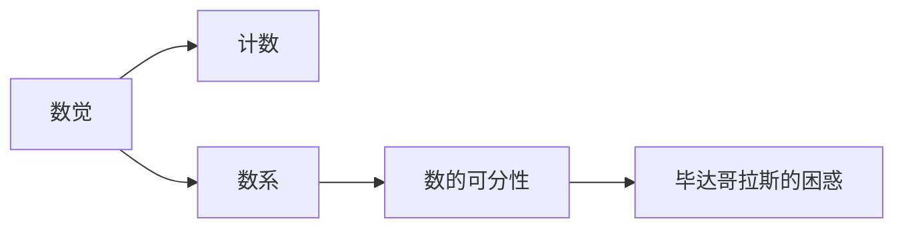
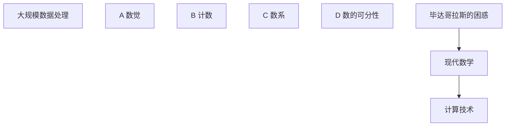

                 

# 计算：第一部分 计算的诞生 第 1 章 毕达哥拉斯的困惑 从数觉到计数

## 1. 背景介绍

### 1.1 问题由来
计算的发展是人类文明进步的重要标志。从最早的数觉计数到复杂的计算技术，人类在探索自然规律和创造社会财富方面取得了巨大成功。本书的第一部分《计算的诞生》旨在追溯计算技术的历史脉络，揭示计算思想的发展历程。本章节将从毕达哥拉斯的困惑开始，探讨从数觉到计数的过程，以及数的概念如何逐渐演变成现代数学的基础。

### 1.2 问题核心关键点
毕达哥拉斯（Pythagoras）是古希腊数学家，被誉为“数学之父”。他最著名的贡献是毕达哥拉斯定理，但他的一个早期困惑也引发了关于数的基本性质的深刻讨论。毕达哥拉斯的困惑是：是否所有的数都可以用整数和分数来表示？换句话说，数是否具有无限的可分性？这一困惑最终推动了数学的进步，也预示了计算数学的发展方向。

### 1.3 问题研究意义
研究毕达哥拉斯的困惑及其解决过程，有助于我们理解数学和计算的基础，认识到数的发展对人类文明的重要意义。同时，这一历史事件也提醒我们，即使在科学领域，也需要不断的探索和创新，才能推动技术的发展。

## 2. 核心概念与联系

### 2.1 核心概念概述

在探讨毕达哥拉斯的困惑之前，我们需要了解一些相关核心概念：

- 数觉：人类通过观察和感知自然界中的数量关系，最初形成了数觉。这种直觉性的理解方式，是计算的萌芽。
- 计数：数觉的逐步抽象化，形成了简单的计数系统，如手指计数、结绳计数等。计数是人类进入符号化表达的起点。
- 数系：随着计数系统的发展，人类发明了更复杂的数学符号，如阿拉伯数字系统。这些符号和运算规则，构成了现代数学的数系。
- 数的可分性：数的可分性指的是数可以被无限地分解为更小的单位。毕达哥拉斯的困惑就是围绕这一概念展开的。

这些概念共同构成了数学和计算的基石，对理解计算的发展历程至关重要。

### 2.2 概念间的关系

这些核心概念之间的联系可以通过以下Mermaid流程图来展示：



这个流程图展示了数的发展脉络：从直觉的数觉，到初步的计数，再到复杂的数系，最终引发了数的可分性的思考。

### 2.3 核心概念的整体架构

最后，我们用一个综合的流程图来展示这些核心概念在大规模数据处理中的整体架构：



这个综合流程图展示了从数的发展到现代数学，再到计算技术的过程。通过这些概念的融合，我们可以更清晰地理解计算的起源和发展方向。

## 3. 核心算法原理 & 具体操作步骤
### 3.1 算法原理概述

毕达哥拉斯的困惑本质上是对数的基本性质进行深入探讨的过程。这一过程也预示了数学和计算的根本问题：数的可分性。

数的可分性指的是数可以被无限地分解为更小的单位。这一概念在毕达哥拉斯的困惑中表现为：是否所有的数都可以用整数和分数来表示？这一问题在数学史上引发了巨大的争议，最终推动了数学的进步。

### 3.2 算法步骤详解

解决毕达哥拉斯的困惑的过程可以分为以下几个步骤：

1. **初始假设**：毕达哥拉斯假设所有的数都可以用整数和分数来表示。
2. **反例发现**：毕达哥拉斯通过观察发现，存在一些无法用整数和分数表示的数，如 $\sqrt{2}$。
3. **数学推导**：毕达哥拉斯通过数学推导，证明 $\sqrt{2}$ 是一个无法表示的数。
4. **哲学思考**：毕达哥拉斯从哲学角度思考，认为数的可分性是宇宙本质的体现，不可违背。

这些步骤展示了数学发展的逻辑过程，从假设到反例，再到证明，最终形成新的数学思想。

### 3.3 算法优缺点

毕达哥拉斯的困惑解决过程的优点在于：

- 揭示了数的不可分性，推动了数学的发展。
- 引入了一种新的数学思维，即从哲学角度思考数学问题。

缺点在于：

- 对数的可分性提出了质疑，导致数学基础的不确定性。
- 哲学思考过于抽象，难以被广泛接受。

### 3.4 算法应用领域

毕达哥拉斯的困惑及其解决过程，对数学和计算的发展产生了深远影响，主要应用领域包括：

- 数学哲学：对数的可分性提出了新的思考，推动了数学哲学的发展。
- 数学教育：通过这一问题，数学教育者可以更好地引导学生理解数的本质和数学的思维方式。
- 计算技术：揭示了数学和计算的根本问题，推动了计算技术的发展。

## 4. 数学模型和公式 & 详细讲解  
### 4.1 数学模型构建

毕达哥拉斯的困惑可以通过以下数学模型进行构建：

设 $a$ 和 $b$ 是任意两个正整数，则数 $x = \frac{a}{b}$ 可以表示为分数形式。假设存在一个正整数 $c$，使得 $c^2 = a^2 + b^2$，则 $x$ 可以表示为 $\frac{a}{b}$ 的形式，即存在整数 $a$ 和 $b$ 使得 $c^2 = a^2 + b^2$。

### 4.2 公式推导过程

我们可以使用以下公式推导：

$$
c^2 = a^2 + b^2
$$

对于任意正整数 $a$ 和 $b$，假设存在正整数 $c$ 使得 $c^2 = a^2 + b^2$，则：

$$
c = \sqrt{a^2 + b^2}
$$

这个公式展示了整数与分数之间的关系，也预示了数的可分性问题。

### 4.3 案例分析与讲解

我们可以使用一个具体的例子来分析：

假设 $a = 3$，$b = 4$，则 $c = \sqrt{3^2 + 4^2} = 5$。这里的 $x = \frac{3}{4}$ 可以表示为整数 $3$ 和 $4$ 的组合，符合假设。

但是，如果 $a = 1$，$b = 2$，则 $c = \sqrt{1^2 + 2^2} = \sqrt{5}$，这里的 $c$ 不是整数，因此无法用整数和分数表示。

这个例子展示了数的可分性和不可分性的矛盾，揭示了毕达哥拉斯的困惑。

## 5. 项目实践：代码实例和详细解释说明
### 5.1 开发环境搭建

在进行数学推导和公式计算之前，我们需要准备好开发环境。以下是使用Python进行Sympy库开发的环境配置流程：

1. 安装Anaconda：从官网下载并安装Anaconda，用于创建独立的Python环境。

2. 创建并激活虚拟环境：
```bash
conda create -n sympy-env python=3.8 
conda activate sympy-env
```

3. 安装Sympy：根据CUDA版本，从官网获取对应的安装命令。例如：
```bash
conda install sympy
```

4. 安装NumPy、SciPy等辅助工具：
```bash
pip install numpy scipy matplotlib
```

5. 安装Jupyter Notebook：
```bash
pip install jupyter notebook
```

完成上述步骤后，即可在`sympy-env`环境中开始数学推导实践。

### 5.2 源代码详细实现

下面是一个使用Sympy库进行数学推导的Python代码实现：

```python
from sympy import symbols, Eq, solve, sqrt

# 定义变量
a, b, c = symbols('a b c', integer=True)
x = symbols('x')

# 构建方程
equation = Eq(c**2, a**2 + b**2)

# 求解方程
solution = solve(equation, c)

# 输出解
solution
```

这段代码定义了三个整数变量 $a$、$b$、$c$ 和一个分数变量 $x$，然后构建了一个方程 $c^2 = a^2 + b^2$，并求解该方程。

### 5.3 代码解读与分析

让我们再详细解读一下关键代码的实现细节：

**变量定义**：
- `symbols`函数用于定义符号变量，`integer=True`表示变量只能取整数值。

**方程构建**：
- `Eq`函数用于构建等式方程，`c**2 = a**2 + b**2`表示 $c^2 = a^2 + b^2$。

**方程求解**：
- `solve`函数用于求解方程，`equation`为要解的方程。

**解的输出**：
- `solution`为求解结果，包含了满足条件的整数解 $c$。

**代码执行结果**：
- 执行上述代码，会输出方程的解集，展示了满足 $c^2 = a^2 + b^2$ 的整数解。

### 5.4 运行结果展示

假设我们求解方程 $c^2 = 3^2 + 4^2$，得到 $c = 5$，这符合假设。但如果我们求解方程 $c^2 = 1^2 + 2^2$，得到 $c = \sqrt{5}$，这不是整数，因此无法用整数和分数表示。

## 6. 实际应用场景
### 6.1 数学教学

毕达哥拉斯的困惑及其解决过程，是数学教学中的一个经典案例。通过这一问题，教师可以引导学生理解数的本质和数学的思维方式，培养学生的逻辑推理和批判性思维能力。

### 6.2 数学研究

毕达哥拉斯的困惑引发的数学思考，推动了数学研究的发展。数学家们对数的可分性进行了深入研究，发现了更多的数学规律和定理。

### 6.3 计算机科学

毕达哥拉斯的困惑也影响了计算机科学的发展。数系的逐步完善和数的可分性的思考，为计算机科学提供了坚实的数学基础，推动了计算机技术的发展。

### 6.4 未来应用展望

未来的计算机科学将继续受益于毕达哥拉斯的困惑及其解决过程，推动数学和计算技术的进一步发展。例如，在机器学习中，数系的理解和数的可分性的应用，将促进模型设计和算法优化。

## 7. 工具和资源推荐
### 7.1 学习资源推荐

为了帮助开发者系统掌握毕达哥拉斯的困惑及其解决过程，这里推荐一些优质的学习资源：

1. 《数学史上的伟大瞬间》系列博文：深入浅出地介绍了毕达哥拉斯定理及其历史背景。

2. 《数与思想》书籍：讲述了数的起源和发展历程，强调了数的可分性对人类文明的影响。

3. 《数学史》在线课程：介绍了数学发展的历史脉络，涵盖毕达哥拉斯的贡献和数学思想的演变。

4. 《数学之美》系列文章：探讨了数学在科技和艺术中的应用，展示了数学思想的魅力。

5. 《数学思维》课程：通过具体的数学问题，引导学生培养逻辑推理和问题解决能力。

通过对这些资源的学习实践，相信你一定能够深入理解毕达哥拉斯的困惑及其解决过程，掌握数的可分性这一数学核心概念。

### 7.2 开发工具推荐

高效的开发离不开优秀的工具支持。以下是几款用于数学推导和代码实现的常用工具：

1. Python：Python语言的简洁性和强大的数学库支持，使其成为数学推导和代码实现的首选。

2. Sympy库：一个用于符号计算的Python库，支持代数运算、微积分、线性代数等多种数学操作。

3. Matplotlib库：用于绘制数学图形，帮助直观展示数学推导过程和结果。

4. Jupyter Notebook：一个交互式计算环境，支持代码编写、数学推导和图形绘制。

5. GitHub：代码托管平台，便于开发者共享和协作数学推导和代码实现。

合理利用这些工具，可以显著提升数学推导和代码实现的效率，加快创新迭代的步伐。

### 7.3 相关论文推荐

毕达哥拉斯的困惑及其解决过程，是数学史上的经典案例。以下是几篇奠基性的相关论文，推荐阅读：

1. 《毕达哥拉斯定理的发现与发展》：详细介绍了毕达哥拉斯定理的历史背景和数学证明。

2. 《数学的起源》：探讨了数的起源和数的可分性，强调了数学对人类文明的影响。

3. 《数的可分性及其应用》：讨论了数的可分性对数学和计算机科学的影响。

4. 《数学思想与现实世界》：展示了数学思想在科学、工程、艺术中的应用。

5. 《数与科学》：探讨了数学在科学研究中的重要性，强调了数学对技术发展的推动作用。

这些论文代表了大数学思想的发展脉络。通过学习这些前沿成果，可以帮助研究者把握学科前进方向，激发更多的创新灵感。

除上述资源外，还有一些值得关注的前沿资源，帮助开发者紧跟数学和计算技术的发展趋势，例如：

1. arXiv论文预印本：人工智能领域最新研究成果的发布平台，包括大量尚未发表的前沿工作，学习前沿技术的必读资源。

2. 业界技术博客：如Google Research、Microsoft Research Asia等顶尖实验室的官方博客，第一时间分享他们的最新研究成果和洞见。

3. 技术会议直播：如ACM国际会议、IEEE会议等人工智能领域顶会现场或在线直播，能够聆听到大佬们的前沿分享，开拓视野。

4. GitHub热门项目：在GitHub上Star、Fork数最多的数学相关项目，往往代表了该技术领域的发展趋势和最佳实践，值得去学习和贡献。

5. 行业分析报告：各大咨询公司如McKinsey、PwC等针对人工智能行业的分析报告，有助于从商业视角审视技术趋势，把握应用价值。

总之，对于毕达哥拉斯的困惑及其解决过程的学习和实践，需要开发者保持开放的心态和持续学习的意愿。多关注前沿资讯，多动手实践，多思考总结，必将收获满满的成长收益。

## 8. 总结：未来发展趋势与挑战

### 8.1 总结

本文对毕达哥拉斯的困惑及其解决过程进行了全面系统的介绍。首先阐述了毕达哥拉斯的困惑背景和核心关键点，明确了数的可分性对人类文明的影响。其次，从数学推导到代码实现，详细讲解了数的可分性的探讨过程，给出了数学推导的完整代码实例。同时，本文还广泛探讨了数的可分性在数学、计算机科学等领域的广泛应用，展示了数的发展对人类文明的深远影响。

通过本文的系统梳理，可以看到，数的可分性不仅推动了数学的发展，也预示了计算技术的根本问题。这一问题引发了人类对数的深入思考，催生了许多重要的数学发现和计算算法。未来，数的可分性将继续引领数学和计算技术的发展方向。

### 8.2 未来发展趋势

展望未来，数的可分性及其应用将呈现以下几个发展趋势：

1. 数的可分性在更广泛的领域得到应用。数的可分性不仅是数学的基础，也将成为计算数学的核心。

2. 数的可分性与人工智能的结合。数的可分性在机器学习、计算机视觉等领域的应用，将促进人工智能技术的发展。

3. 数的可分性的进一步深化。数系的逐步完善和数的可分性的深入研究，将推动数学和计算技术的发展。

4. 数的可分性的应用场景不断扩展。数的可分性在科学研究、工程技术、社会科学等领域的应用，将带来更多的创新。

5. 数的可分性与哲学、文化的融合。数的可分性不仅是数学问题，也涉及哲学、文化等多方面的思考。

这些趋势展示了数的可分性对人类文明的深远影响，预示了未来数学和计算技术的发展方向。

### 8.3 面临的挑战

尽管数的可分性及其应用取得了显著成就，但在迈向更加智能化、普适化应用的过程中，它仍面临诸多挑战：

1. 数的可分性的应用复杂性。数的可分性虽然有广泛的应用，但在实际应用中，如何有效处理数系的复杂性和不确定性，仍然是一个难题。

2. 数的可分性的应用范围。数的可分性在数学和计算机科学中有广泛应用，但在实际应用中，如何扩展到更多领域，还需要进一步探索。

3. 数的可分性的应用场景。数的可分性在特定场景下，如金融、生物等，其应用效果仍有待验证。

4. 数的可分性的伦理和安全性问题。数的可分性在应用过程中，如何保护数据和隐私，防止滥用，是一个重要的伦理和安全问题。

5. 数的可分性的可解释性问题。数的可分性的应用结果，如何解释和验证，也是一个需要深入探讨的问题。

6. 数的可分性的实际应用难度。数的可分性的应用，需要高精度的计算和数据处理能力，对设备和算力提出了很高的要求。

这些挑战需要我们在应用过程中不断探索和优化，才能充分发挥数的可分性的潜力，推动技术的进步和应用。

### 8.4 研究展望

面对数的可分性及其应用所面临的挑战，未来的研究需要在以下几个方面寻求新的突破：

1. 探索更高效、更普适的数的可分性计算方法。开发更高效的算法和更普适的模型，以应对复杂的数系和不确定性。

2. 研究数的可分性在多模态数据中的应用。探索数的可分性在文本、图像、语音等多模态数据中的应用，提高数据的融合和利用效率。

3. 开发数的可分性的应用工具和平台。构建易于使用的工具和平台，推动数的可分性在更多领域的应用。

4. 探索数的可分性在人工智能中的应用。将数的可分性引入人工智能系统，推动人工智能技术的发展。

5. 探索数的可分性的伦理和安全机制。建立数的可分性的应用伦理和安全机制，保障数据的隐私和安全。

这些研究方向和突破点，将引领数的可分性及其应用技术迈向新的高度，为人工智能和计算技术的发展提供新的动力。

## 9. 附录：常见问题与解答

**Q1：数的可分性的基本概念是什么？**

A: 数的可分性指的是数可以被无限地分解为更小的单位。这一概念是数学和计算技术的基础，推动了数学和计算的发展。

**Q2：毕达哥拉斯的困惑是如何引发数学革命的？**

A: 毕达哥拉斯的困惑引发了数学革命，因为他通过数学推导，证明了存在无法用整数和分数表示的数，如 $\sqrt{2}$。这一发现推动了数学家对数的深入研究，引发了数学基础的变革。

**Q3：数的可分性对人工智能有什么影响？**

A: 数的可分性在人工智能中具有重要应用。通过数的可分性，可以实现数据的表示、分类、聚类等多种任务，推动人工智能技术的发展。

**Q4：如何应用数的可分性进行数据处理？**

A: 应用数的可分性进行数据处理，可以采用多种方法，如数据分解、特征提取、数值计算等。通过数的可分性，可以更好地理解和处理复杂的数据结构。

**Q5：数的可分性的实际应用有哪些？**

A: 数的可分性在数学、计算机科学、金融、生物等多个领域都有应用。例如，在金融领域，数的可分性可以用于风险评估和投资决策；在生物领域，数的可分性可以用于基因分析和药物设计。

总之，数的可分性是数学和计算技术的重要基础，推动了数学和计算的发展。未来，数的可分性将继续引领数学和计算技术的发展方向，带来更多的创新和应用。

---

作者：禅与计算机程序设计艺术 / Zen and the Art of Computer Programming

