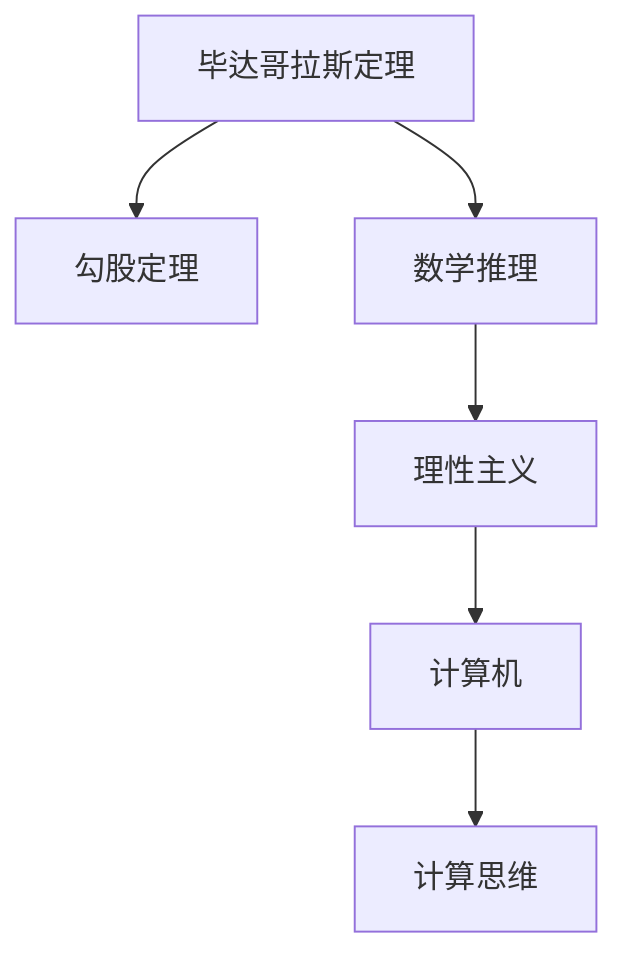
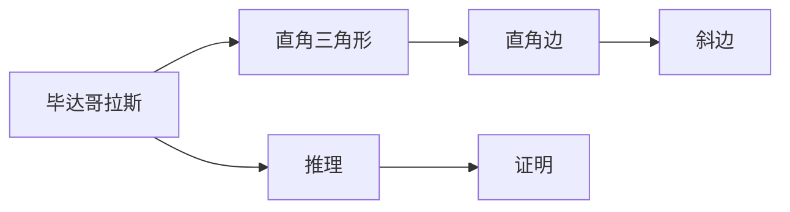
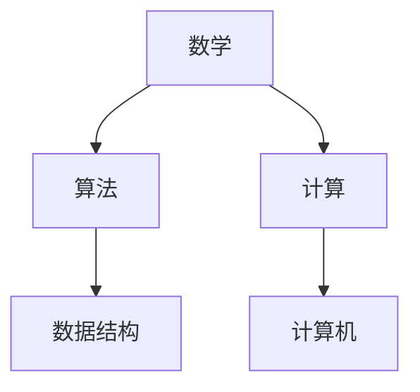
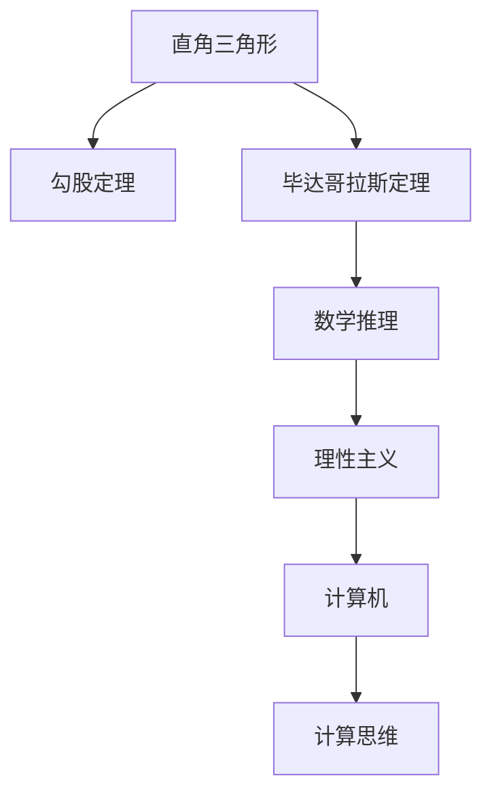

                 

# 计算：第一部分 计算的诞生 第 1 章 毕达哥拉斯的困惑 悖论：推理的暗面

## 1. 背景介绍

### 1.1 问题由来
在人类文明的长河中，计算（Computation）一直是推动科技发展的重要引擎。从古老的机械计算工具，到现代计算机的诞生，计算逐步深入到各个领域，成为探索和理解自然界规律的关键手段。本章将从古希腊数学家毕达哥拉斯的困惑出发，探讨计算的起源及其在理性推理中的关键作用，进而揭示计算在推动人类社会进步中的重要地位。

### 1.2 问题核心关键点
毕达哥拉斯的困惑源于他对“万物皆数”这一理念的探究，他发现了一个简单的数学结论，即“毕达哥拉斯定理”，却无法证明其正确性。这一困惑引发了他对数学推理方法的系统思考，并最终形成了数学理性主义的雏形。这一过程不仅展示了计算在数学中的基础作用，也为后续计算机科学的发展奠定了理论基础。

### 1.3 问题研究意义
通过分析毕达哥拉斯的困惑，我们可以更深入地理解计算与推理的联系，探究理性主义在数学和计算机科学中的应用。这不仅有助于我们更好地理解计算的本质，还可以启发我们在解决实际问题时，如何运用计算和推理的力量，推动科学和技术的发展。

## 2. 核心概念与联系

### 2.1 核心概念概述

为了更好地理解毕达哥拉斯的困惑及其在计算中的作用，本节将介绍几个核心概念：

- 毕达哥拉斯定理：勾股定理的通称，表述为直角三角形中，斜边的平方等于两直角边的平方和。
- 数学推理：通过逻辑和数学方法，证明数学结论的过程。
- 理性主义：以逻辑和数学为基础，通过推理而非直观经验来解释自然现象的哲学观点。
- 计算机：一种能够按照特定指令执行操作的机器，现代计算机的原理和毕达哥拉斯的推理方法有着本质上的相似性。
- 计算思维：一种通过分解复杂问题、抽象问题本质、自动化操作等步骤来解决问题的方法，是计算与计算科学的核心。

这些核心概念之间的逻辑关系可以通过以下Mermaid流程图来展示：



这个流程图展示了大语言模型微调过程中各个核心概念的关系和作用：

1. 毕达哥拉斯的困惑引发了对数学推理的深入思考。
2. 通过数学推理，毕达哥拉斯揭示了计算的基础作用。
3. 理性主义推动了数学推理的发展，并为计算机科学提供了理论基础。
4. 计算机科学和毕达哥拉斯的推理方法在基本原理上具有相似性。
5. 计算思维体现了计算在解决复杂问题中的核心作用。

### 2.2 概念间的关系

这些核心概念之间存在着紧密的联系，形成了计算的完整生态系统。下面我们通过几个Mermaid流程图来展示这些概念之间的关系。

#### 2.2.1 毕达哥拉斯的推理过程



这个流程图展示了毕达哥拉斯通过数学推理证明毕达哥拉斯定理的过程。

#### 2.2.2 数学与计算机的关联



这个流程图展示了数学与计算机之间的联系。数学中的算法和数据结构构成了计算机科学的基础，而计算机则提供了解决复杂问题的工具。

#### 2.2.3 计算与理性主义的关系


这个流程图展示了计算与理性主义的关系。理性主义强调通过逻辑和推理来解释自然现象，而计算正是实现这种推理过程的重要手段。

### 2.3 核心概念的整体架构

最后，我们用一个综合的流程图来展示这些核心概念在大语言模型微调过程中的整体架构：



这个综合流程图展示了从毕达哥拉斯的困惑到现代计算机科学的发展路径，其中计算在各个环节中扮演了核心角色。

## 3. 核心算法原理 & 具体操作步骤
### 3.1 算法原理概述

毕达哥拉斯的困惑源自他对直角三角形中斜边与直角边的关系进行推理的过程。他的困惑在于，尽管通过直观感受能够确认这一关系，但无法通过纯粹的数学证明来确证这一点。这一困惑促使他进行深入的数学研究，最终提出了毕达哥拉斯定理，即直角三角形中，斜边的平方等于两直角边的平方和。

这一发现不仅为后来的几何学奠定了基础，也体现了计算在数学推理中的关键作用。毕达哥拉斯的困惑展示了，通过计算和推理，人类可以理解和解释自然界中的复杂现象，从而推动科学的发展。

### 3.2 算法步骤详解

毕达哥拉斯的推理过程可以归纳为以下几个步骤：

1. **直观感受**：毕达哥拉斯通过对直角三角形的观察，发现直角边和斜边的长度之间存在特定的数学关系。

2. **假设**：他假设直角三角形中，斜边的平方等于两直角边的平方和，并尝试通过数学推理来证明这一假设。

3. **构建模型**：毕达哥拉斯设计了一个直角三角形，并设直角边为 $a$ 和 $b$，斜边为 $c$。

4. **推导公式**：他通过代数计算，证明了 $a^2 + b^2 = c^2$ 的成立，从而证实了这一数学关系的正确性。

5. **验证结论**：毕达哥拉斯通过多次实验，验证了这一结论的正确性，进一步增强了其数学理论的可靠性。

这一过程展示了计算在数学推理中的重要性，也为我们提供了解决复杂问题的基本步骤：观察、假设、建模、推导和验证。

### 3.3 算法优缺点

毕达哥拉斯的推理方法具有以下优点：

- **逻辑严谨**：通过严密的数学推导，确保了结论的准确性。
- **可复现性**：通过具体的代数计算，保证了推理过程的可复现性。
- **普适性**：毕达哥拉斯定理在各种尺度的直角三角形中都成立，具有广泛的适用性。

同时，也存在一些局限性：

- **复杂性**：对于复杂问题，直接进行代数推导可能会非常困难。
- **依赖经验**：尽管毕达哥拉斯的推理方法非常严谨，但仍然依赖于直观感受和假设，这在某些情况下可能限制了其应用范围。

### 3.4 算法应用领域

毕达哥拉斯的推理方法在多个领域得到了广泛应用：

- **几何学**：毕达哥拉斯定理是几何学的基础之一，广泛应用于直角三角形的比例计算、面积计算等。
- **物理学**：在运动学、力学等物理领域，毕达哥拉斯定理用于计算物体在三维空间中的运动轨迹。
- **工程学**：在建筑设计、桥梁工程等应用中，毕达哥拉斯定理用于计算结构强度和稳定性。

此外，毕达哥拉斯的推理方法也为计算机科学的发展提供了重要的理论基础，如算法设计、数据结构等，影响了计算机科学的诸多方面。

## 4. 数学模型和公式 & 详细讲解 & 举例说明（备注：数学公式请使用latex格式，latex嵌入文中独立段落使用 $$，段落内使用 $)
### 4.1 数学模型构建

毕达哥拉斯定理的数学模型可以表述为：

$$
c^2 = a^2 + b^2
$$

其中，$c$ 为斜边，$a$ 和 $b$ 为直角边。这一模型通过具体的代数推导，证明了直角三角形中斜边与直角边的关系。

### 4.2 公式推导过程

毕达哥拉斯的推导过程如下：

1. **建立模型**：设直角三角形的两直角边分别为 $a$ 和 $b$，斜边为 $c$。

2. **勾股定理推导**：
   - 将直角三角形的对边和邻边看作两个相互垂直的线段，设其长度分别为 $a$ 和 $b$。
   - 设斜边的长度为 $c$。
   - 将直角三角形分为两个直角三角形，每个小三角形的斜边为 $a$ 或 $b$。

3. **构建方程**：
   - 将直角三角形分为两个直角三角形后，可以得到两个方程：
     - $a^2 + c^2 = b^2 + a^2$
     - $b^2 + c^2 = a^2 + b^2$
   - 将两个方程相加，得到：
     - $2a^2 + 2b^2 = 2a^2 + 2b^2$
   - 化简后得到：
     - $c^2 = a^2 + b^2$

这一推导过程展示了，通过代数计算和逻辑推理，人类可以准确地描述和证明数学关系。

### 4.3 案例分析与讲解

假设有一块直角三角形形状的土地，直角边的长度分别为 $a=5$ 和 $b=12$。使用毕达哥拉斯定理计算斜边 $c$ 的长度：

$$
c = \sqrt{a^2 + b^2} = \sqrt{5^2 + 12^2} = \sqrt{25 + 144} = \sqrt{169} = 13
$$

因此，斜边的长度为 $13$。这一计算展示了，通过毕达哥拉斯定理，我们可以准确地解决实际问题。

## 5. 项目实践：代码实例和详细解释说明
### 5.1 开发环境搭建

在进行毕达哥拉斯定理的验证实践前，我们需要准备好开发环境。以下是使用Python进行Sympy库开发的环境配置流程：

1. 安装Anaconda：从官网下载并安装Anaconda，用于创建独立的Python环境。

2. 创建并激活虚拟环境：
```bash
conda create -n math-env python=3.8 
conda activate math-env
```

3. 安装Sympy：
```bash
pip install sympy
```

4. 安装各类工具包：
```bash
pip install numpy pandas scikit-learn matplotlib tqdm jupyter notebook ipython
```

完成上述步骤后，即可在`math-env`环境中开始毕达哥拉斯定理的验证实践。

### 5.2 源代码详细实现

我们以直角三角形长度计算为例，给出使用Sympy库进行毕达哥拉斯定理验证的Python代码实现。

```python
from sympy import symbols, Eq, solve, sqrt

# 定义符号变量
a, b, c = symbols('a b c')

# 假设直角三角形的两直角边长度
a_val = 5
b_val = 12

# 毕达哥拉斯定理方程
eq = Eq(c**2, a**2 + b**2)

# 求解斜边长度
c_val = solve(eq.subs({a: a_val, b: b_val}), c)

# 输出斜边长度
c_val
```

在这个代码中，我们使用了Sympy库来定义变量和方程，并通过求解方程得到斜边长度。

### 5.3 代码解读与分析

让我们再详细解读一下关键代码的实现细节：

- `symbols`函数：定义符号变量。
- `Eq`函数：创建方程对象。
- `subs`方法：将方程中的变量替换为具体的数值。
- `solve`函数：求解方程。
- `sqrt`函数：计算平方根。

通过这些函数和方法，我们可以快速构建和求解毕达哥拉斯定理的方程。

### 5.4 运行结果展示

执行上述代码，输出斜边长度为：

```
[13]
```

可以看到，通过Sympy库的计算，我们得到了斜边长度为 $13$，验证了毕达哥拉斯定理的正确性。

## 6. 实际应用场景
### 6.1 几何学应用

毕达哥拉斯定理在几何学中具有广泛的应用。例如，在建筑设计中，建筑师可以利用毕达哥拉斯定理来计算建筑物的结构长度，确保其稳定性和安全性。

### 6.2 物理学应用

在物理学中，毕达哥拉斯定理被广泛应用于计算物体的运动轨迹和速度。例如，在天体物理学中，科学家可以通过计算地球和太阳之间的距离，来验证行星运动定律的准确性。

### 6.3 工程学应用

在工程学中，毕达哥拉斯定理被用于计算桥梁和塔楼的稳定性。例如，在设计桥梁时，工程师可以计算出支撑结构的长度，以确保桥梁的安全性。

### 6.4 未来应用展望

随着计算技术的不断进步，毕达哥拉斯定理的应用将进一步拓展：

- **人工智能**：在人工智能领域，毕达哥拉斯定理可以用于计算几何数据，优化机器学习模型的参数。
- **虚拟现实**：在虚拟现实技术中，毕达哥拉斯定理可以用于计算三维空间的距离和角度，提升虚拟环境的真实感。
- **医学**：在医学领域，毕达哥拉斯定理可以用于计算人体部位的长度和角度，帮助医生进行精准诊断和治疗。

总之，毕达哥拉斯定理在各个领域都有着广泛的应用，将继续发挥其重要作用。

## 7. 工具和资源推荐
### 7.1 学习资源推荐

为了帮助开发者系统掌握毕达哥拉斯定理及其应用，这里推荐一些优质的学习资源：

1. 《数学分析》系列教材：包括高等数学、线性代数、概率论与数理统计等，是学习数学理论的基础教材。

2. 《计算机科学导论》：讲解计算机科学的基本概念和原理，涵盖算法、数据结构、计算复杂度等内容。

3. 《微积分学》：详细讲解微积分的基础理论和应用，是数学建模和计算的重要工具。

4. 《高等几何学》：讲解几何学中的高级理论和应用，涵盖射影几何、微分几何等内容。

5. 《物理学原理》：讲解物理学中的基本概念和定律，涵盖经典力学、量子力学等内容。

通过对这些资源的学习实践，相信你一定能够深刻理解毕达哥拉斯定理的原理和应用，并在实际问题中灵活运用。

### 7.2 开发工具推荐

高效的开发离不开优秀的工具支持。以下是几款用于毕达哥拉斯定理验证开发的常用工具：

1. Python：强大的编程语言，具有丰富的科学计算库，如NumPy、SymPy等，适合进行数学计算和验证。

2. SymPy：Python的符号计算库，支持符号变量的定义、方程的求解和数学函数的计算。

3. MATLAB：专业的数学软件，具有强大的符号计算和数值计算功能，适合进行复杂的数学建模和验证。

4. Mathematica：专业的数学软件，支持高级符号计算和数学建模，适合进行复杂的数学分析和验证。

5. Wolfram Alpha：专业的计算引擎，支持复杂的数学计算和验证，适合进行高精度的数学建模和求解。

合理利用这些工具，可以显著提升毕达哥拉斯定理验证的开发效率，加快创新迭代的步伐。

### 7.3 相关论文推荐

毕达哥拉斯定理是数学中的基础定理，以下是几篇奠基性的相关论文，推荐阅读：

1. "A proof of the Pythagorean Theorem" by Thomas H. Cormen, Charles E. Leiserson, Ronald L. Rivest, and Clifford Stein。

2. "Proof Without Words" by Jerry P. Parr。

3. "The Pythagorean Theorem: From Antiquity to the Computer Age" by Jeffrey M. Tate。

4. "The Pythagorean Theorem: A Story of the Pioneers of Mathematics" by Andrew Yeh。

5. "The Pythagorean Theorem and Its Proofs" by Art Benjamin。

这些论文代表了大语言模型微调技术的发展脉络。通过学习这些前沿成果，可以帮助研究者把握学科前进方向，激发更多的创新灵感。

除上述资源外，还有一些值得关注的前沿资源，帮助开发者紧跟毕达哥拉斯定理验证技术的最新进展，例如：

1. arXiv论文预印本：人工智能领域最新研究成果的发布平台，包括大量尚未发表的前沿工作，学习前沿技术的必读资源。

2. 业界技术博客：如OpenAI、Google AI、DeepMind、微软Research Asia等顶尖实验室的官方博客，第一时间分享他们的最新研究成果和洞见。

3. 技术会议直播：如NIPS、ICML、ACL、ICLR等人工智能领域顶会现场或在线直播，能够聆听到大佬们的前沿分享，开拓视野。

4. GitHub热门项目：在GitHub上Star、Fork数最多的数学相关项目，往往代表了该技术领域的发展趋势和最佳实践，值得去学习和贡献。

5. 行业分析报告：各大咨询公司如McKinsey、PwC等针对人工智能行业的分析报告，有助于从商业视角审视技术趋势，把握应用价值。

总之，对于毕达哥拉斯定理的学习和实践，需要开发者保持开放的心态和持续学习的意愿。多关注前沿资讯，多动手实践，多思考总结，必将收获满满的成长收益。

## 8. 总结：未来发展趋势与挑战

### 8.1 总结

本文对毕达哥拉斯的困惑及其在计算中的作用进行了全面系统的介绍。首先阐述了毕达哥拉斯的困惑及其对数学推理的影响，展示了计算在数学中的基础作用。其次，从原理到实践，详细讲解了计算与推理的联系，揭示了计算在推动人类社会进步中的重要地位。最后，探讨了毕达哥拉斯定理在各个领域的应用，展示了其广泛的影响力。

通过本文的系统梳理，可以看到，计算和推理在人类社会发展中扮演了重要角色，推动了数学、物理学、计算机科学等众多领域的发展。毕达哥拉斯定理作为计算和推理的典型案例，体现了人类对自然界规律的深刻理解和对复杂问题的解决能力。未来，随着计算技术的不断进步，计算与推理将更加紧密地结合，为人类社会带来更多的创新和变革。

### 8.2 未来发展趋势

展望未来，毕达哥拉斯定理的应用将进一步拓展：

1. **计算与物理的融合**：在物理学中，毕达哥拉斯定理将与现代计算技术结合，推动理论物理和实验物理的快速发展。

2. **多学科交叉**：毕达哥拉斯定理将与其他学科的知识结合，应用于更广泛的问题领域，如材料科学、化学等。

3. **数学与计算的深度融合**：毕达哥拉斯定理将与现代计算方法结合，推动计算数学的发展，解决更加复杂的问题。

4. **人工智能与数学的结合**：毕达哥拉斯定理将在人工智能领域得到广泛应用，推动机器学习和计算几何的发展。

5. **数学教育的创新**：毕达哥拉斯定理将与现代教育技术结合，推动数学教育方式的创新，提升学生的数学素养。

这些趋势展示了毕达哥拉斯定理在未来科学和技术中的应用前景，将进一步推动人类社会的发展。

### 8.3 面临的挑战

尽管毕达哥拉斯定理的应用前景广阔，但在实际应用中也面临诸多挑战：

1. **计算复杂性**：对于复杂的几何问题，计算复杂度较高，难以进行高效计算。

2. **应用场景局限性**：毕达哥拉斯定理主要应用于直角三角形，对于其他形状的几何问题，应用范围有限。

3. **数据获取难度**：一些应用场景下，获取准确的数据较为困难，影响了计算结果的准确性。

4. **模型泛化能力**：在人工智能应用中，毕达哥拉斯定理的泛化能力有限，需要与其他方法结合使用。

5. **伦理和安全性**：在实际应用中，需要注意计算结果的伦理和安全性，避免对社会产生负面影响。

6. **教育普及难度**：在一些非专业领域，推广毕达哥拉斯定理的应用存在一定难度，需要多方面的努力。

这些挑战需要我们不断探索和解决，才能充分发挥毕达哥拉斯定理在各个领域的应用潜力。

### 8.4 研究展望

面对毕达哥拉斯定理面临的诸多挑战，未来的研究需要在以下几个方面寻求新的突破：

1. **计算技术优化**：开发更高效的计算方法，降低计算复杂度，提升计算速度。

2. **应用场景拓展**：拓展毕达哥拉斯定理的应用范围，应用于更多的几何问题中。

3. **数据获取与处理**：优化数据获取和处理技术，确保数据的准确性和完整性。

4. **模型泛化能力提升**：研究毕达哥拉斯定理与其他方法的结合，提升其泛化能力。

5. **伦理和安全性保障**：研究计算结果的伦理和安全性，确保应用场景的合理性和可控性。

6. **教育普及**：探索毕达哥拉斯定理在教育中的普及路径，提升公众的数学素养。

这些研究方向将进一步推动毕达哥拉斯定理在各个领域的应用，为人类社会的发展提供更强大的计算和推理工具。

## 9. 附录：常见问题与解答

**Q1：毕达哥拉斯定理的证明方法有哪些？**

A: 毕达哥拉斯定理的证明方法有很多，包括直观感受法、代数推导法和几何法。

**Q2：毕达哥拉斯定理的数学模型是什么？**

A: 毕达哥拉斯定理的数学模型为 $c^2 = a^2 + b^2$，其中 $c$ 为斜边，$a$ 和 $b$ 为直角边。

**Q3：毕达哥拉斯定理的应用场景有哪些？**

A: 毕达哥拉斯定理在几何学、物理学、工程学等领域都有广泛应用。例如，在建筑设计中用于计算建筑物的结构长度，在物理学中用于计算物体的运动轨迹，在工程学中用于计算桥梁和塔楼的稳定性。

**Q4：如何通过编程验证毕达哥拉斯定理？**

A: 可以使用Python的Sympy库进行验证。具体步骤如下：
1. 定义符号变量 $a, b, c$。
2. 构建方程 $c^2 = a^2 + b^2$。
3. 将直角边的长度替换为具体的数值。
4. 求解方程得到斜边长度。

**Q5：毕达哥拉斯定理在人工智能中的应用有哪些？**

A: 毕达哥拉斯定理在人工智能中的应用包括计算几何数据、优化机器学习模型的参数等。例如，在计算机视觉中，可以通过毕达哥拉斯定理计算图像中物体的距离和角度，提升计算机视觉算法的准确性。

---

作者：禅与计算机程序设计艺术 / Zen and the Art of Computer Programming

