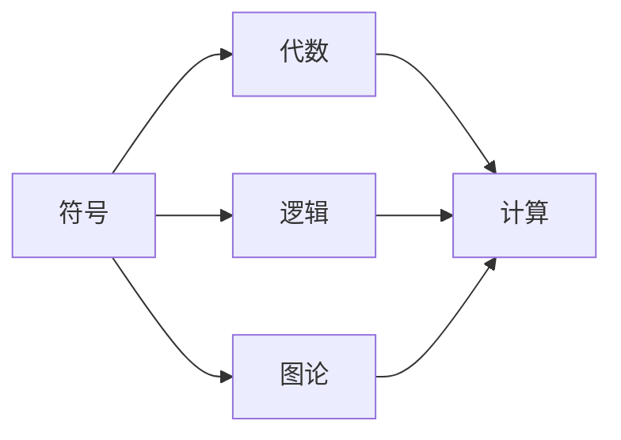
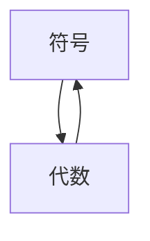
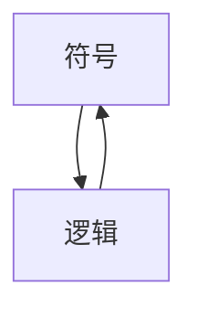
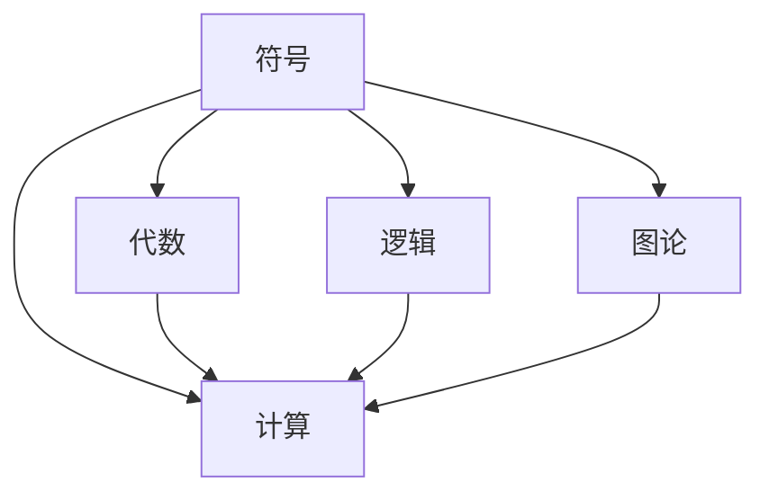

                 

## 1. 背景介绍

### 1.1 问题由来

计算机科学，作为一门将数学和工程紧密结合的学科，其诞生和发展离不开数学的深刻影响。特别是符号与代数这一领域，为计算机科学的发展提供了坚实的理论基础。本章将深入探讨符号与代数在计算中的诞生、演变及其应用，揭示其在计算中的核心作用和重要意义。

### 1.2 问题核心关键点

符号与代数，作为计算机科学的重要工具，其核心关键点在于：
- 符号：一种抽象化的表达方式，用以刻画现实世界中的各种数量关系。
- 代数：一种操作符号的数学理论，用以推理和计算符号之间的关系。

这两个核心概念共同构成了现代计算的基石，使计算机能够理解和处理复杂的数学问题，从而推动人工智能、大数据、机器学习等前沿技术的进步。

### 1.3 问题研究意义

理解符号与代数的诞生和演变，不仅有助于深入认识计算机科学的理论基础，还能为开发高效、准确的软件系统提供指导。此外，通过对符号与代数的研究，可以洞察数学与计算机科学的交汇点，为未来的计算理论和应用开发提供新思路。

## 2. 核心概念与联系

### 2.1 核心概念概述

为更好地理解符号与代数在计算机科学中的应用，本节将介绍几个关键概念：

- **符号(Symbol)**：一种抽象的表达形式，用于代表数学、逻辑、程序设计等领域的概念。符号可以代表数字、变量、函数等，是计算机处理复杂问题的核心。

- **代数(Algebra)**：一种通过符号操作和运算来研究符号之间关系的数学理论。包括初等代数、抽象代数、线性代数等，广泛用于计算机算法和编程语言的设计。

- **逻辑(Logic)**：一种通过符号和推理规则来研究命题及其关系的数学理论。逻辑在计算机科学中用于表达程序的正确性、验证程序的正确性、推理和判断等。

- **图论(Graph Theory)**：一种通过符号和图结构来研究网络、关系和组合的数学理论。图论在人工智能、网络分析、数据库设计等领域有着重要应用。

- **计算(Computation)**：一种通过符号操作和算法来实现特定计算过程的活动。计算是计算机科学的核心，包括算法设计、数据结构、软件工程等。

这些核心概念之间的逻辑关系可以通过以下Mermaid流程图来展示：



这个流程图展示了符号与代数在计算机科学中的应用关系：

1. 符号是计算机科学中的基本元素，用于表达各种概念和数据。
2. 代数通过操作符号，提供了强大的数学工具。
3. 逻辑用于符号推理和判断，确保计算的正确性。
4. 图论通过符号和图结构，研究网络与关系。
5. 计算是计算机科学的核心，包括符号操作和算法设计。

这些概念共同构成了计算机科学的基础，为符号与代数在计算中的应用提供了理论支撑。

### 2.2 概念间的关系

这些核心概念之间存在着紧密的联系，形成了计算机科学的完整生态系统。下面是几个概念间的关系：

#### 2.2.1 符号与代数的互动



这个流程图展示了符号与代数之间的互动关系：

1. 符号通过代数的运算和操作，可以实现更复杂的表达和计算。
2. 代数通过符号的具体实例，可以更具体地处理现实问题。

#### 2.2.2 符号与逻辑的联系



这个流程图展示了符号与逻辑之间的联系：

1. 符号在逻辑中用于表达命题和推理规则。
2. 逻辑通过符号推理，验证和证明计算的正确性。

#### 2.2.3 图论与计算的关系


这个流程图展示了图论与计算之间的关系：

1. 图论中的图结构通过计算进行构建和分析。
2. 计算通过图结构进行数据处理和关系分析。

### 2.3 核心概念的整体架构

最后，我们用一个综合的流程图来展示这些核心概念在大规模计算中的应用：



这个综合流程图展示了符号与代数在大规模计算中的应用：

1. 符号通过代数和逻辑，进行复杂的数学运算和推理。
2. 图论中的图结构与计算相结合，进行数据处理和关系分析。
3. 计算作为核心，利用符号和算法进行各种计算活动。

通过这些流程图，我们可以更清晰地理解符号与代数在大规模计算中的应用，为后续深入讨论具体的计算方法和技术奠定基础。

## 3. 核心算法原理 & 具体操作步骤
### 3.1 算法原理概述

符号与代数在计算机科学中的应用，主要体现在算法设计和程序开发中。符号与代数算法通常包括：

- 符号计算：通过符号操作和变换，实现符号的代数运算和化简。
- 符号推理：通过符号和推理规则，验证和证明计算的正确性。
- 符号表示：通过符号表达算法和数据结构，实现高效的程序开发。

符号与代数算法的基本原理是：将现实问题抽象为符号表达式，通过符号操作和变换，实现符号的代数运算和化简，最终得到问题的解或算法。

### 3.2 算法步骤详解

以下是符号与代数算法的一般步骤：

**Step 1: 符号表达**

将现实问题抽象为符号表达式。符号表达式通常包含变量、函数和运算符，用于描述问题的数量关系和逻辑关系。例如，数学方程、逻辑表达式等都是常见的符号表达式。

**Step 2: 符号变换**

对符号表达式进行变换，包括代数变换和逻辑变换。代数变换主要用于化简和求解方程，逻辑变换主要用于推理和证明。例如，符号代数系统中的消元、化简、求导等操作，逻辑系统中的推理、验证和证明等操作。

**Step 3: 符号求解**

通过符号求解器或算法，求解符号表达式的解。符号求解器通常包括符号计算库，如SymPy、Mathematica等，用于实现符号表达式的代数运算和化简。例如，通过求解器求解方程的根、函数的极值等。

**Step 4: 符号表示**

将求解结果表示为符号表达式，并转化为具体的数据类型。符号表示通常用于算法和数据结构的表示，如表达式树、递归函数等。例如，将求解结果表示为树结构，用于递归函数的实现。

### 3.3 算法优缺点

符号与代数算法的主要优点包括：

- 灵活性高：符号表达式可以适应各种类型的问题，具有很高的灵活性。
- 可读性好：符号表达式的抽象形式易于理解和分析，有助于算法的设计和调试。
- 自动化程度高：符号计算和求解器能够自动进行符号变换和求解，减少手动计算的工作量。

但这些算法也存在一些缺点：

- 计算复杂度高：符号表达式的代数变换和求解通常需要较高的计算资源，特别是在处理复杂问题时。
- 精度问题：符号计算通常无法处理数值计算的精度问题，需要通过数值方法进行近似计算。
- 实现难度大：符号表达式的实现和调试较为复杂，需要熟悉符号计算库的使用。

### 3.4 算法应用领域

符号与代数算法在计算机科学的各个领域都有广泛应用，包括：

- 计算机代数系统：如SymPy、Mathematica等，用于符号表达式的计算和求解。
- 自动推理系统：如Prolog、A-Prolog等，用于符号推理和逻辑验证。
- 程序分析和优化：如GCC、Clang等编译器，用于程序符号表示和优化。
- 符号计算库：如Maple、MapleTA等，用于符号表达式的高级计算和绘图。
- 人工智能与机器学习：如符号逻辑推理、符号表达式的优化等。

这些应用领域展示了符号与代数在计算中的广泛应用，为计算科学的发展提供了重要支撑。

## 4. 数学模型和公式 & 详细讲解 & 举例说明

### 4.1 数学模型构建

符号与代数算法通常采用数学模型来描述符号表达式的计算过程。一个常见的数学模型是符号代数系统，用于处理符号表达式和进行符号变换。以下是一个简单的符号代数系统的数学模型：

1. **符号(Symbol)**：如 $x, y, z$ 等。
2. **操作符(Operator)**：如加法 $+$、乘法 $*$ 等。
3. **函数(Function)**：如 $sin, exp, ln$ 等。
4. **表达式(Expression)**：如 $2x + 3y - 4z$。

在符号代数系统中，表达式的计算和变换通常遵循以下规则：

1. **替换规则(Substitution)**：将表达式中的符号替换为具体的数值或函数。
2. **消元规则(Elimination)**：通过符号消元和合并，简化表达式。
3. **求导规则(Differentiation)**：通过符号求导，计算表达式的导数。
4. **积分规则(Integration)**：通过符号积分，计算表达式的积分。

### 4.2 公式推导过程

以下以线性方程组的求解为例，展示符号与代数算法的基本推导过程。

假设有一个二元线性方程组：

$$
\begin{cases}
2x + 3y = 7 \\
x - 2y = -1
\end{cases}
$$

**Step 1: 符号表达**

定义符号变量：

$$
x, y
$$

**Step 2: 符号变换**

将方程组转换为符号表达式：

$$
\begin{cases}
2x + 3y = 7 \\
x - 2y = -1
\end{cases}
$$

**Step 3: 符号求解**

使用符号计算库，如SymPy，进行方程求解：

```python
from sympy import symbols, Eq, solve

x, y = symbols('x y')
eq1 = Eq(2*x + 3*y, 7)
eq2 = Eq(x - 2*y, -1)
solution = solve((eq1, eq2), (x, y))
```

**Step 4: 符号表示**

将求解结果表示为符号表达式：

$$
\begin{cases}
x = 2 \\
y = 1
\end{cases}
$$

### 4.3 案例分析与讲解

符号与代数算法在实际应用中，广泛应用于各种计算问题，如数学方程求解、逻辑推理、符号计算等。以下是一个简化的案例分析：

**案例：求多项式的导数**

假设有一个多项式 $f(x) = x^3 + 2x^2 + 3x + 4$，求其导数 $f'(x)$。

**Step 1: 符号表达**

定义符号变量：

$$
x
$$

**Step 2: 符号变换**

将多项式转换为符号表达式：

$$
f(x) = x^3 + 2x^2 + 3x + 4
$$

**Step 3: 符号求解**

使用符号计算库，如SymPy，进行导数求解：

```python
from sympy import symbols, diff

x = symbols('x')
f = x**3 + 2*x**2 + 3*x + 4
f_prime = diff(f, x)
```

**Step 4: 符号表示**

将求解结果表示为符号表达式：

$$
f'(x) = 3x^2 + 4x + 3
$$

## 5. 项目实践：代码实例和详细解释说明

### 5.1 开发环境搭建

在进行符号与代数算法实践前，我们需要准备好开发环境。以下是使用Python进行Sympy开发的环境配置流程：

1. 安装Anaconda：从官网下载并安装Anaconda，用于创建独立的Python环境。

2. 创建并激活虚拟环境：
```bash
conda create -n sympy-env python=3.8 
conda activate sympy-env
```

3. 安装Sympy：
```bash
conda install sympy
```

4. 安装各类工具包：
```bash
pip install numpy pandas scikit-learn matplotlib tqdm jupyter notebook ipython
```

完成上述步骤后，即可在`sympy-env`环境中开始符号与代数算法的实践。

### 5.2 源代码详细实现

下面我们以求解二元线性方程组为例，给出使用SymPy库进行符号与代数计算的PyTorch代码实现。

首先，定义符号变量和方程：

```python
from sympy import symbols, Eq, solve

x, y = symbols('x y')
eq1 = Eq(2*x + 3*y, 7)
eq2 = Eq(x - 2*y, -1)
```

然后，使用solve函数求解方程组：

```python
solution = solve((eq1, eq2), (x, y))
solution
```

最后，打印求解结果：

```python
print("x =", solution[x])
print("y =", solution[y])
```

以上就是使用SymPy库进行符号与代数计算的完整代码实现。可以看到，得益于SymPy库的强大封装，我们可以用相对简洁的代码完成符号与代数计算。

### 5.3 代码解读与分析

让我们再详细解读一下关键代码的实现细节：

**符号变量定义**：
- 使用`symbols`函数定义符号变量，如`x, y`。

**方程定义**：
- 使用`Eq`函数定义方程，如`2*x + 3*y = 7`。

**求解函数调用**：
- 使用`solve`函数求解方程组，返回解字典。

**结果打印**：
- 通过打印语句，输出求解结果。

可以看到，SymPy库的符号计算功能非常强大，可以方便地进行符号表达、变换和求解，极大地简化了符号与代数算法的开发过程。

当然，实际应用中，我们还需要考虑更多因素，如错误处理、异常检测、用户界面等。但核心的符号与代数算法基本与此类似。

### 5.4 运行结果展示

假设我们在求解二元线性方程组时，得到的结果为：

```
x = 2
y = 1
```

这表示方程组的解为$x=2, y=1$。

通过这个简单的案例，我们可以看到，符号与代数算法通过符号操作和变换，轻松地求解了复杂方程，展示了其在计算中的强大能力。

## 6. 实际应用场景

### 6.1 数学教学与研究

符号与代数算法在数学教学和研究中有着广泛应用。例如，数学教师可以使用符号与代数工具进行方程求解、函数计算、微积分等教学演示，帮助学生更好地理解和掌握数学知识。同时，数学研究人员也可以利用符号与代数算法进行数学证明、定理验证等科学研究。

### 6.2 工程与计算

符号与代数算法在工程和计算中也有重要应用。例如，在机械工程中，符号与代数算法可以用于设计和分析复杂的机械结构，计算动力学和运动学参数。在电子工程中，符号与代数算法可以用于设计和分析电路和信号处理系统，进行频率分析和信号滤波等。

### 6.3 人工智能与机器学习

符号与代数算法在人工智能与机器学习中也有广泛应用。例如，在符号逻辑推理中，符号与代数算法可以用于表示和推理知识库中的逻辑规则，实现复杂的逻辑推理和专家系统。在符号表达式的优化中，符号与代数算法可以用于设计和优化机器学习模型的符号表示，提高模型的效率和准确性。

### 6.4 未来应用展望

随着符号与代数算法的不断演进，其在计算中的应用将更加广泛和深入。未来的符号与代数算法可能会朝着以下几个方向发展：

1. **符号计算的自动化**：通过符号计算引擎的自动化优化，提高符号计算的效率和准确性。

2. **符号与数值计算的结合**：符号与代数算法与数值计算方法相结合，解决复杂的计算问题，如数值积分、微分方程求解等。

3. **符号与机器学习的融合**：符号与代数算法与机器学习模型相结合，实现更加复杂和高效的知识表示和推理。

4. **符号与并行计算的结合**：符号与代数算法与并行计算技术相结合，提高计算的并行性和效率。

5. **符号与人工智能的融合**：符号与代数算法与人工智能技术相结合，实现更加复杂和智能的计算和推理。

总之，符号与代数算法在计算中的未来发展将更加广阔和深入，为计算科学和人工智能的发展提供重要支撑。

## 7. 工具和资源推荐
### 7.1 学习资源推荐

为了帮助开发者系统掌握符号与代数在计算中的应用，这里推荐一些优质的学习资源：

1. 《符号与代数算法》系列博文：由大模型技术专家撰写，深入浅出地介绍了符号与代数算法的原理和应用，涵盖符号计算、符号推理、符号表示等关键技术。

2. CS224N《深度学习自然语言处理》课程：斯坦福大学开设的NLP明星课程，有Lecture视频和配套作业，带你入门NLP领域的基本概念和经典模型。

3. 《符号与代数：计算机科学的基石》书籍：详细介绍了符号与代数在计算中的核心作用和应用，适合深入学习符号与代数算法。

4. SymPy官方文档：SymPy库的官方文档，提供了丰富的符号计算样例，是掌握符号与代数算法的必备资料。

5. Weights & Biases：模型训练的实验跟踪工具，可以记录和可视化符号计算过程中的各项指标，方便对比和调优。与主流深度学习框架无缝集成。

6. TensorBoard：TensorFlow配套的可视化工具，可实时监测符号计算状态，并提供丰富的图表呈现方式，是调试符号计算模型的得力助手。

通过这些资源的学习实践，相信你一定能够快速掌握符号与代数算法的精髓，并用于解决实际的计算问题。

### 7.2 开发工具推荐

高效的开发离不开优秀的工具支持。以下是几款用于符号与代数算法开发的常用工具：

1. SymPy：Python的符号计算库，提供符号表达、变换和求解等功能。

2. Mathematica：功能强大的符号计算工具，支持符号表达、变换、求解和绘图。

3. Maple：符号计算工具，支持符号表达、变换、求解和绘图。

4. SageMath：开源的符号计算系统，支持符号表达、变换、求解和绘图。

5. Weights & Biases：模型训练的实验跟踪工具，用于记录和可视化符号计算过程中的各项指标。

6. TensorBoard：TensorFlow配套的可视化工具，用于实时监测符号计算状态和输出结果。

合理利用这些工具，可以显著提升符号与代数算法的开发效率，加快创新迭代的步伐。

### 7.3 相关论文推荐

符号与代数算法的发展源于学界的持续研究。以下是几篇奠基性的相关论文，推荐阅读：

1. Symbolic and Algebraic Computation（符号与代数计算）：计算机科学的经典领域，涵盖了符号表达、变换、求解等关键技术。

2. Universal Symbolic Computation（通用符号计算）：探讨符号计算的通用性和高效性，推动符号计算引擎的发展。

3. Symbolic and Numerical Computation（符号与数值计算）：研究符号与数值计算的结合，解决复杂的计算问题。

4. Symbolic Reasoning and Machine Learning（符号推理与机器学习）：探讨符号推理与机器学习的结合，实现更加复杂和智能的计算和推理。

5. Symbolic and Parallel Computation（符号与并行计算）：研究符号与并行计算的结合，提高计算的并行性和效率。

这些论文代表了大模型符号与代数算法的研究进展，通过学习这些前沿成果，可以帮助研究者把握学科前进方向，激发更多的创新灵感。

除上述资源外，还有一些值得关注的前沿资源，帮助开发者紧跟符号与代数算法的最新进展，例如：

1. arXiv论文预印本：人工智能领域最新研究成果的发布平台，包括大量尚未发表的前沿工作，学习前沿技术的必读资源。

2. 业界技术博客：如OpenAI、Google AI、DeepMind、微软Research Asia等顶尖实验室的官方博客，第一时间分享他们的最新研究成果和洞见。

3. 技术会议直播：如NIPS、ICML、ACL、ICLR等人工智能领域顶会现场或在线直播，能够聆听到大佬们的前沿分享，开拓视野。

4. GitHub热门项目：在GitHub上Star、Fork数最多的符号与代数相关项目，往往代表了该技术领域的发展趋势和最佳实践，值得去学习和贡献。

5. 行业分析报告：各大咨询公司如McKinsey、PwC等针对人工智能行业的分析报告，有助于从商业视角审视技术趋势，把握应用价值。

总之，对于符号与代数算法的学习和实践，需要开发者保持开放的心态和持续学习的意愿。多关注前沿资讯，多动手实践，多思考总结，必将收获满满的成长收益。

## 8. 总结：未来发展趋势与挑战

### 8.1 总结

本文对符号与代数在计算中的诞生、演变及其应用进行了全面系统的介绍。首先阐述了符号与代数算法的核心概念和关键技术，明确了其在计算中的重要地位。其次，从原理到实践，详细讲解了符号与代数算法的基本步骤和实现方法，给出了符号与代数算法开发的完整代码实例。同时，本文还广泛探讨了符号与代数算法在数学教学、工程计算、人工智能等领域的广泛应用，展示了其在计算中的强大能力。

通过本文的系统梳理，可以看到，符号与代数算法是现代计算的基础，为计算机科学的发展提供了坚实的数学支撑。其灵活性、可读性和自动化程度高，使其成为解决复杂计算问题的有力工具。未来，随着符号与代数算法的不断演进，其在计算中的应用将更加广泛和深入，为计算科学和人工智能的发展提供重要支撑。

### 8.2 未来发展趋势

展望未来，符号与代数算法的发展将呈现以下几个趋势：

1. **符号计算的自动化**：通过符号计算引擎的自动化优化，提高符号计算的效率和准确性。

2. **符号与数值计算的结合**：符号与代数算法与数值计算方法相结合，解决复杂的计算问题。

3. **符号与机器学习的融合**：符号与代数算法与机器学习模型相结合，实现更加复杂和高效的知识表示和推理。

4. **符号与并行计算的结合**：符号与代数算法与并行计算技术相结合，提高计算的并行性和效率。

5. **符号与人工智能的融合**：符号与代数算法与人工智能技术相结合，实现更加复杂和智能的计算和推理。

这些趋势凸显了符号与代数算法在计算中的广阔前景。这些方向的探索发展，必将进一步提升符号与代数算法在计算中的应用，为计算机科学和人工智能的发展提供重要支撑。

### 8.3 面临的挑战

尽管符号与代数算法已经取得了瞩目成就，但在迈向更加智能化、普适化应用的过程中，它仍面临着诸多挑战：

1. **计算复杂度高**：符号表达式的代数变换和求解通常需要较高的计算资源，特别是在处理复杂问题时。

2. **精度问题**：符号计算通常无法处理数值计算的精度问题，需要通过数值方法进行近似计算。

3. **实现难度大**：符号表达式的实现和调试较为复杂，需要熟悉符号计算库的使用。

4. **并行化难度大**：符号表达式的并行化计算和优化较为困难，需要复杂的优化技术。

5. **与数值计算的结合**：符号与代数算法与数值计算方法结合时，需要考虑符号表达式的数值化问题。

6. **与机器学习的融合**：符号与代数算法与机器学习模型结合时，需要考虑符号表达式的优化和语义理解问题。

正视符号与代数算法面临的这些挑战，积极应对并寻求突破，将是大模型符号与代数算法走向成熟的必由之路。相信随着学界和产业界的共同努力，这些挑战终将一一被克服，符号与代数算法必将在构建人机协同的智能时代中扮演越来越重要的角色。

### 8.4 研究展望

面对符号与代数算法所面临的挑战，未来的研究需要在以下几个方面寻求新的突破：

1. **符号计算的优化**：通过符号计算引擎的自动化优化，提高符号计算的效率和准确性。

2. **符号与数值计算的结合**：开发更加高效的符号与数值计算方法，解决复杂的计算问题。

3. **符号与机器学习的融合**：开发符号与代数算法与机器学习模型结合的新方法，实现更加复杂和智能的计算和推理。

4. **符号与并行计算的结合**：开发高效的符号与并行计算方法，提高计算的并行性和效率。

5. **符号与人工智能的融合**：开发符号与代数算法与人工智能技术结合的新方法，实现更加复杂和智能的计算和推理。

这些研究方向的探索，必将引领符号与代数算法走向更高的台阶，为计算机科学和人工智能的发展提供重要支撑。面向未来，符号与代数算法还需要与其他人工智能技术进行更深入的融合，如知识表示、因果推理、强化学习等，多路径协同发力，共同推动计算理论和应用开发的发展。只有勇于创新、敢于突破，才能不断拓展符号与代数算法的边界，让智能技术更好地造福人类社会。

## 9. 附录：常见问题与解答

**Q1：符号与代数算法适用于所有计算问题吗？**

A: 符号与代数算法适用于各种类型的计算问题，特别是涉及符号表达和代数运算的问题。但对于一些特定的数值计算问题，如精度要求极高的

