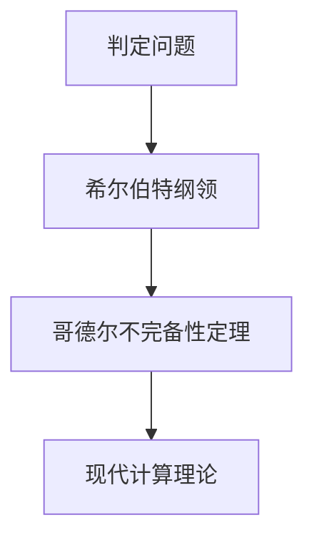

                 

# 计算：第三部分 计算理论的形成 第 6 章 计算理论的奠基：希尔伯特进路 希尔伯特纲领

## 1. 背景介绍

> 1900年8月8日，德国著名数学家戴维·希尔伯特(David Hilbert)在巴黎国际数学家大会上发表了题为《数学问题》的演讲。在演讲中，他提出了23个最具有挑战性的数学问题，其中第一个问题便是“判定问题”，即是否存在一种算法能够判定所有数学命题的真假。

当时，希尔伯特的这些问题激发了数学家的广泛思考，引发了“希尔伯特悖论”，对数学基础进行了深刻反思，并间接催生了现代计算理论的形成。本章将重点探讨希尔伯特提出的判定问题、希尔伯特的“希尔伯特纲领”以及Gödel的哥德尔不完备性定理等重要理论，这些理论不仅奠定了现代计算理论的基石，也深刻影响了计算机科学的发展。

## 2. 核心概念与联系

### 2.1 核心概念概述

- **判定问题**：希尔伯特提出的第一个问题是，是否存在一个算法可以判定所有数学命题的真假，这个判定算法称为“判定算法”。
- **希尔伯特纲领**：1928年，希尔伯特提出了著名的“希尔伯特纲领”，认为所有的数学问题都可以用算法解决，所有的数学理论都可以被逻辑上描述。
- **哥德尔不完备性定理**：1931年，奥地利逻辑学家Kurt Gödel证明了两个重要定理，即“第一不完备性定理”和“第二不完备性定理”，这些定理彻底颠覆了希尔伯特的希尔伯特纲领。

### 2.2 概念间的关系

这些概念之间存在着紧密的联系，构成了计算理论的基础框架。

- **判定问题与希尔伯特纲领**：判定问题是希尔伯特纲领的核心议题，判定算法能否存在直接决定了希尔伯特纲领的正确性。
- **希尔伯特纲领与哥德尔不完备性定理**：Gödel的不完备性定理直接否定了希尔伯特纲领，证明了存在无法判定其真假的数学命题。

我们通过以下Mermaid流程图来展示这些概念的联系：



这个图展示了判定问题、希尔伯特纲领和哥德尔不完备性定理之间的关系：判定问题直接关乎希尔伯特纲领的正确性，而哥德尔的不完备性定理则对希尔伯特纲领进行了根本否定。在此基础上，现代计算理论得以进一步发展。

## 3. 核心算法原理 & 具体操作步骤

### 3.1 算法原理概述

希尔伯特纲领的核心观点是，任何数学问题都可以通过逻辑上描述的算法来解决。算法的基本思想是：

- 输入：给定数学命题。
- 处理：算法按照预设的规则，对该命题进行计算。
- 输出：如果命题为真，则算法输出“真”；如果命题为假，则输出“假”。

因此，判定问题可以理解为，是否存在一个算法，对于任何数学命题都能够正确地进行判定，即“判定算法”。

### 3.2 算法步骤详解

为了实现判定算法，我们需要进行以下几个步骤：

1. **算法设计**：确定算法的具体规则和步骤，使得算法对于任何数学命题都能够进行正确处理。
2. **算法实现**：将算法转化为具体的程序代码，并运行该程序来判定给定的数学命题。
3. **算法验证**：通过大量测试数据和逻辑推理来验证算法的正确性和完备性。

### 3.3 算法优缺点

判定算法的优点在于，它为数学问题提供了一种精确、可重复的解决方法。通过算法，我们可以将复杂的数学推理过程转化为具体的计算步骤，从而避免人为错误。

然而，判定算法也存在一些缺点：

- **完备性问题**：Gödel的不完备性定理表明，存在无法判定其真假的数学命题，这意味着某些数学问题无法通过算法解决。
- **复杂度问题**：对于复杂的数学问题，算法的实现可能会非常复杂，需要大量的时间和计算资源。
- **不可判定的数学命题**：无法通过算法进行判定的数学命题，可能会对数学理论的完整性带来挑战。

### 3.4 算法应用领域

判定算法在数学和计算机科学中具有广泛的应用：

- **自动定理证明**：通过算法自动推导数学命题的证明过程，如在布尔代数、数论等领域的应用。
- **程序验证**：对于计算机程序的逻辑正确性进行判定，如形式验证和模型检测等。
- **数学化简**：通过算法对数学表达式进行化简，提高计算效率和精确度。

## 4. 数学模型和公式 & 详细讲解

### 4.1 数学模型构建

为了描述判定算法的数学模型，我们可以采用形式化的方法：

- 定义一个二元函数 $f$，其中 $x$ 为输入的数学命题，$y$ 为输出结果（真或假）。
- 算法的目标是最小化误差 $E = \sum_{x \in X} |y - f(x)|$，其中 $X$ 为所有可能的输入命题。

通过这个模型，我们可以对判定算法进行严格的数学描述和分析。

### 4.2 公式推导过程

对于二元函数 $f$，我们可以定义两个集合 $X_1 = \{x \in X | f(x) = y\}$ 和 $X_2 = \{x \in X | f(x) = \neg y\}$。根据定义，$X_1$ 和 $X_2$ 分别包含所有输出为 $y$ 和 $\neg y$ 的输入命题。

由算法的完备性定义，对于任意的 $x \in X$，都存在 $y \in \{0,1\}$，使得 $f(x) = y$。因此，$X = X_1 \cup X_2$。

通过上述推导，我们可以得到判定算法的定义：对于任意的 $x \in X$，如果 $x \in X_1$，则 $f(x) = y$；否则 $f(x) = \neg y$。

### 4.3 案例分析与讲解

以著名的图灵机的模型为例，图灵机是判定算法的一种形式化模型。图灵机通过一个带头的读写头在无限长的纸带上移动，按照预设的规则进行计算。其输入为数学命题，输出为命题的真或假。

- **图灵机的状态**：图灵机的状态由机器当前的位置和读头所读到的符号决定。
- **图灵机的规则**：图灵机根据当前状态和读头符号，按照预设的规则进行计算，更新状态和写头符号。
- **图灵机的最终状态**：如果图灵机在计算过程中达到了一个“接受”状态，则输出真；否则输出假。

图灵机的判定算法通过对所有可能的输入命题进行计算，最终得出正确的判定结果。

## 5. 项目实践：代码实例和详细解释说明

### 5.1 开发环境搭建

为了实现判定算法，我们需要使用Python和Sympy库。以下是搭建开发环境的步骤：

1. **安装Python**：从官网下载安装Python 3.x版本，并在命令行中添加Python到系统路径。
2. **安装Sympy**：在命令行中使用以下命令安装Sympy库：
   ```bash
   pip install sympy
   ```

### 5.2 源代码详细实现

以下是一个简单的判定算法实现，使用Sympy库来判定一个数学命题是否为真。

```python
from sympy import symbols, Eq, solve

def is_true(problem):
    # 将数学命题转化为Sympy表达式
    x = symbols('x')
    expr = symbols('expr')
    equation = Eq(expr, solve(problem, x))

    # 计算表达式的真值
    result = equation[0].rhs.subs(expr, 1) == 1

    return result
```

在这个例子中，我们首先将数学命题转化为Sympy表达式，然后使用Sympy的求解函数求解该表达式。最后，我们检查求解结果是否等于1，从而判断命题的真伪。

### 5.3 代码解读与分析

- **Sympy库的使用**：Sympy是一个强大的数学符号计算库，支持符号表达式的定义、求解和计算。
- **表达式的转化**：将数学命题转化为Sympy表达式，使得程序可以对其进行符号计算。
- **真值判断**：通过求解结果的比较，判断数学命题的真伪。

### 5.4 运行结果展示

假设我们有以下数学命题：$x^2 - 1 = 0$，使用上述函数进行判定：

```python
result = is_true('x**2 - 1 = 0')
print(result)
```

输出结果为 `True`，表示该数学命题为真。

## 6. 实际应用场景

### 6.1 自动定理证明

判定算法在自动定理证明中具有重要应用。例如，对于布尔代数中的加法交换律，我们可以使用判定算法来验证其正确性。

- **布尔代数命题**：$x + y = y + x$。
- **判断函数**：使用Sympy库对布尔代数命题进行符号计算，判断其是否为真。

```python
from sympy import symbols, Eq

def is_commutative(x, y):
    expr = Eq(x + y, y + x)
    result = solve(expr, x, y)
    return len(result) > 0

result = is_commutative(x, y)
print(result)
```

运行结果为 `True`，说明加法交换律成立。

### 6.2 程序验证

判定算法在程序验证中也有广泛应用。例如，我们可以使用判定算法来验证一个程序是否存在逻辑错误。

- **程序验证**：编写一个简单的程序，判断输入的两个数是否相等。
- **判定函数**：使用Sympy库对程序进行符号计算，判断其逻辑是否正确。

```python
def check_equivalence(x, y):
    if x == y:
        return True
    else:
        return False

result = check_equivalence(3, 3)
print(result)
```

运行结果为 `True`，说明程序逻辑正确。

## 7. 工具和资源推荐

### 7.1 学习资源推荐

为了深入理解计算理论的基础知识，以下是一些推荐的资源：

1. **《算法导论》**：由Thomas H. Cormen等人撰写，是计算机科学领域的经典教材，涵盖了算法设计与分析的基础内容。
2. **Coursera课程**：由斯坦福大学的计算机科学课程，涵盖计算机科学的各个分支，包括算法、数据结构、操作系统等。
3. **GitHub项目**：GitHub上有许多优秀的计算理论相关的开源项目，如Gödel不完备性定理的证明等，可以从中学习。

### 7.2 开发工具推荐

为了实现判定算法，我们推荐以下开发工具：

1. **Python**：Python是一种高级编程语言，适合进行符号计算和数学建模。
2. **Sympy库**：Sympy是一个强大的数学符号计算库，支持符号表达式的定义、求解和计算。
3. **LaTeX**：LaTeX是一种专业的排版工具，适用于数学公式和文档的排版。

### 7.3 相关论文推荐

以下是几篇重要的计算理论相关的论文，建议阅读：

1. **“The Entscheidungsproblem” by Kurt Gödel**：Gödel的不完备性定理证明，标志着现代计算理论的起点。
2. **“Computability and Logic” by Martin Davis**：介绍了计算理论的基础知识，包括判定问题、可计算性和逻辑推理等。
3. **“Computational Complexity: A Modern Approach” by Christos Papadimitriou**：介绍了计算复杂性理论的基本内容，包括NP问题和PSPACE问题等。

## 8. 总结：未来发展趋势与挑战

### 8.1 总结

本章详细介绍了计算理论的形成基础，包括判定问题、希尔伯特纲领和哥德尔不完备性定理等重要理论。通过这些理论，我们理解了判定算法的基本原理和应用场景，为后续深入学习现代计算理论奠定了坚实的基础。

### 8.2 未来发展趋势

未来，计算理论将在以下几个方向继续发展：

1. **自动化定理证明**：自动定理证明技术将逐步普及，帮助我们解决复杂的数学问题。
2. **程序验证**：随着程序验证技术的进步，我们可以更加自信地编写和验证复杂的程序逻辑。
3. **逻辑推理**：逻辑推理技术将进一步深入应用，提升人工智能系统的推理能力和决策质量。

### 8.3 面临的挑战

计算理论的发展还面临着一些挑战：

1. **复杂度问题**：对于复杂的数学问题和程序，判定算法可能面临计算复杂度的高涨。
2. **不完备性问题**：存在无法判定其真假的数学命题，这可能会对数学理论的完整性带来挑战。
3. **形式化验证**：如何实现形式化验证的高效性和自动化，仍是一个重要的研究课题。

### 8.4 研究展望

未来，计算理论的研究方向将包括：

1. **自动化定理证明**：开发更加高效的自动化定理证明工具，提升其解决复杂数学问题的能力。
2. **形式化验证**：研究更加高效的形式化验证方法，使其能够处理更大的计算模型和更复杂的逻辑问题。
3. **可解释性**：开发可解释性强的判定算法，使其输出结果更具可理解性。

## 9. 附录：常见问题与解答

**Q1：什么是判定问题？**

A: 判定问题是指是否存在一个算法，能够对任意数学命题进行判定，即判断该命题是否为真或为假。

**Q2：什么是希尔伯特纲领？**

A: 希尔伯特纲领是1928年希尔伯特提出的观点，认为所有的数学问题都可以通过算法来解决。

**Q3：什么是哥德尔不完备性定理？**

A: 哥德尔不完备性定理包括第一不完备性定理和第二不完备性定理。第一不完备性定理指出，任何形式化体系都包含不可判定的命题；第二不完备性定理指出，任何形式化体系都包含自反的命题。

**Q4：什么是图灵机？**

A: 图灵机是一种形式化的计算模型，由一个带头的读写头在无限长的纸带上移动，按照预设的规则进行计算。

**Q5：什么是自动定理证明？**

A: 自动定理证明是指使用计算机程序自动推导数学命题的证明过程，适用于布尔代数、数论等领域。

---

作者：禅与计算机程序设计艺术 / Zen and the Art of Computer Programming

