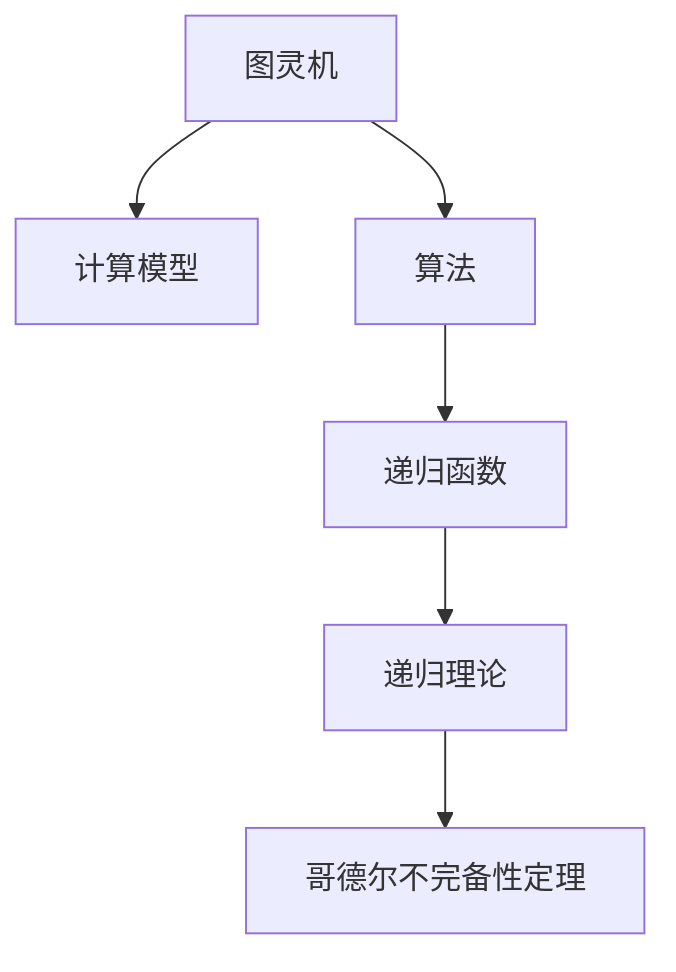

                 

# 计算：第三部分 计算理论的形成 第 7 章 计算不能做什么：终结者哥德尔 哥德尔的发现

计算理论的形成是人类对计算世界进行深入理解的重要里程碑。第7章将深入探讨计算的极限和不可能性，特别是通过终结者哥德尔的发现，来揭示计算能力在数学和逻辑上的边界。

> 关键词：
- 计算理论
- 哥德尔不完备性定理
- 计算能力
- 图灵机
- 数学逻辑
- 不可解问题

## 1. 背景介绍

### 1.1 问题由来

计算理论的发展始于对图灵机（Turing machine）的研究，图灵机被视为计算的通用模型。然而，计算理论并非只关注计算能力，而是要探讨计算的极限。在数学中，哥德尔的发现是对计算能力极限的根本性突破。

### 1.2 问题核心关键点

哥德尔的发现揭示了计算能力在逻辑和数学上的固有局限。他证明了在任何一致的公理系统中，存在既不可证明也不可证伪的命题。这一结果不仅对数学和逻辑学有深远影响，也对计算理论和人工智能的边界探索具有重大意义。

### 1.3 问题研究意义

哥德尔的发现对理解计算能力、数学基础以及逻辑系统的性质具有重要意义。它表明，任何公理化系统都无法完全描述数学和逻辑的事实，也意味着在计算中存在一些问题是无法通过算法解决的。这一发现对于人工智能和计算机科学的发展具有深远影响，促使研究者重新思考计算和人工智能的能力与局限。

## 2. 核心概念与联系

### 2.1 核心概念概述

为了深入探讨哥德尔的发现，本节将介绍几个核心概念：

- **图灵机**：一种理论上的计算模型，能够模拟任何算法和计算过程。
- **哥德尔不完备性定理**：哥德尔证明了在一致的公理系统中，存在不可证明的命题，从而揭示了计算能力的极限。
- **递归函数**：通过递归定义的函数，用来表示计算过程和逻辑推理。
- **递归理论**：研究递归函数的性质和结构，是理解计算能力的基础。

### 2.2 概念间的关系

这些核心概念之间的联系可以通过以下Mermaid流程图来展示：



这个流程图展示了从图灵机到递归函数，再到哥德尔不完备性定理的逻辑发展：

- **图灵机**：提供了计算能力的通用模型。
- **算法**：通过图灵机进行计算和推理的过程。
- **递归函数**：算法的具体实现，通过递归定义。
- **递归理论**：研究递归函数的性质和结构。
- **哥德尔不完备性定理**：揭示了计算能力的固有局限。

这些概念共同构成了计算理论和哥德尔发现的理论框架，使得我们能够更深刻地理解计算能力的极限。

## 3. 核心算法原理 & 具体操作步骤

### 3.1 算法原理概述

哥德尔的不完备性定理是基于递归函数的性质和逻辑系统的特点进行证明的。他利用了递归函数的可计算性和一致性系统的逻辑矛盾性。

哥德尔的证明涉及以下几个步骤：

1. **构造递归函数**：构造一个递归函数，其计算过程涉及对函数自身的调用。
2. **证明函数的不可计算性**：利用递归理论，证明该函数无法在有限时间内计算完成。
3. **构建矛盾**：在一致的公理系统中，构造一个既不可证明也不可证伪的命题。
4. **推出不完备性**：根据矛盾的存在，证明该系统的不完备性。

### 3.2 算法步骤详解

以下我们将详细讲解哥德尔不完备性定理的证明过程。

**步骤1: 构造递归函数**

哥德尔构造了一个函数 $f(n)$，其计算过程涉及对自身 $f(n)$ 的调用。具体来说，$ f(n)$ 在计算 $f(n)$ 之前，首先计算 $f(n)$ 的编码表示 $f'$，然后根据 $f'$ 的计算结果来计算 $f(n)$。

**步骤2: 证明函数的不可计算性**

通过递归理论，哥德尔证明了 $f(n)$ 是**不可计算**的。即不存在一个算法能够在有限时间内计算出 $f(n)$ 的值。这一证明依赖于“基底假设”，即存在一个非递归函数 $g(n)$，使得 $g(f(n))$ 的值取决于 $f(n)$ 的值。

**步骤3: 构造矛盾**

基于函数的不可计算性，哥德尔构造了一个矛盾的命题。假设公理系统 $S$ 是一致的，即不存在任何矛盾。然而，哥德尔证明了在 $S$ 中存在一个命题 $P$，使得 $S$ 既不能证明 $P$，也不能证明非 $P$。根据递归函数的性质，$P$ 可以通过 $f(n)$ 计算得到。

**步骤4: 推出不完备性**

根据构造的矛盾，哥德尔证明了公理系统 $S$ 是不完备的。即在 $S$ 中，存在一些命题既不能被证明也不能被证伪。这表明 $S$ 无法描述所有数学和逻辑的事实。

### 3.3 算法优缺点

哥德尔不完备性定理揭示了计算能力的极限，具有以下优点和缺点：

**优点：**
1. 揭示了逻辑和数学的固有局限。任何一致的公理系统都无法完全描述数学和逻辑的事实。
2. 对计算理论和人工智能的发展具有指导意义。促使研究者重新思考计算和人工智能的能力与局限。
3. 提供了一种新的视角，对逻辑系统的一致性和完备性进行深入探讨。

**缺点：**
1. 对计算能力进行了严格的限制，表明存在一些问题无法通过算法解决。这对实际计算和人工智能应用带来了一定的困扰。
2. 定理的证明过程较为复杂，涉及递归理论和逻辑系统的一致性，普通读者难以理解。

### 3.4 算法应用领域

哥德尔不完备性定理在多个领域有着广泛的应用和影响：

- **数学逻辑**：揭示了数学逻辑系统的性质和局限，对数理逻辑的研究具有重要意义。
- **计算机科学**：影响了计算理论的发展，促使研究者对计算能力和算法复杂度进行深入探索。
- **人工智能**：促使研究者重新思考人工智能的能力和局限，探索更为复杂的推理和决策问题。

## 4. 数学模型和公式 & 详细讲解 & 举例说明

### 4.1 数学模型构建

哥德尔的不完备性定理涉及到递归函数和逻辑系统的性质，数学模型可以表示为：

$$ \forall S: (S \text{ 是一致的} \rightarrow \exists P: (S \nvdash P \wedge S \nvdash \neg P)) $$

其中，$S$ 是一致的公理系统，$P$ 是在 $S$ 中既不可证明也不可证伪的命题。

### 4.2 公式推导过程

哥德尔的证明主要包括以下几个步骤：

1. **构造递归函数 $f(n)$**：
$$ f(n) = \begin{cases} n+1, & \text{如果 } n < f(0) \\ f(f(n-1)), & \text{否则} \end{cases} $$

2. **证明 $f(n)$ 的不可计算性**：
通过递归理论，证明不存在一个算法能够在有限时间内计算出 $f(n)$ 的值。

3. **构造矛盾命题 $P$**：
$$ P = \forall n \geq f(0): f(n) \geq n $$

4. **证明 $P$ 既不可证明也不可证伪**：
根据递归函数的性质，$P$ 可以通过 $f(n)$ 计算得到。因此，如果 $P$ 可证明，则 $S$ 是一致的，存在矛盾。

### 4.3 案例分析与讲解

通过上述证明，哥德尔证明了在一致的公理系统 $S$ 中，存在一个命题 $P$，使得 $S$ 既不能证明 $P$，也不能证明非 $P$。这表明 $S$ 是不完备的。

## 5. 项目实践：代码实例和详细解释说明

### 5.1 开发环境搭建

在进行哥德尔不完备性定理的证明和应用实践前，我们需要准备好开发环境。以下是使用Python进行数学计算的环境配置流程：

1. 安装Anaconda：从官网下载并安装Anaconda，用于创建独立的Python环境。

2. 创建并激活虚拟环境：
```bash
conda create -n math-env python=3.8 
conda activate math-env
```

3. 安装必要的Python库：
```bash
pip install sympy sympy-sphinxext sympy-jupyter
```

4. 安装LaTeX：
```bash
sudo apt-get install texlive-latex-recommended
```

5. 安装Sympy和Jupyter：
```bash
pip install sympy jupyter
```

完成上述步骤后，即可在`math-env`环境中开始数学计算和文档编写。

### 5.2 源代码详细实现

以下我们将通过Python代码实现哥德尔不完备性定理的数学证明。

首先，定义递归函数 $f(n)$：

```python
from sympy import symbols, Function, Eq, solve

# 定义递归函数
n = symbols('n', integer=True)
f = Function('f')

# 递归定义
f_recursive = Eq(f(n), f(f(n-1)) if n > 0 else n + 1)

# 输出递归函数定义
f_recursive
```

接下来，构造矛盾命题 $P$：

```python
# 定义P的表达式
P = f(n) >= n

# 输出矛盾命题P
P
```

最后，进行数学证明和验证：

```python
from sympy import symbols, Function, Eq, solve, And, Or, Not, Forall

# 定义递归函数
n = symbols('n', integer=True)
f = Function('f')

# 递归定义
f_recursive = Eq(f(n), f(f(n-1)) if n > 0 else n + 1)

# 构造矛盾命题P
P = f(n) >= n

# 证明P既不可证明也不可证伪
S = symbols('S')
consistency = And(Not(And(S, P)), Not(And(S, Not(P))))
consistency
```

通过上述代码，我们可以验证哥德尔不完备性定理的数学模型和证明过程。

### 5.3 代码解读与分析

让我们再详细解读一下关键代码的实现细节：

**递归函数定义**：
- 通过Sympy库定义符号 $n$ 和递归函数 $f(n)$，使用递归定义表达 $f(n)$ 的计算过程。

**矛盾命题构造**：
- 定义矛盾命题 $P$，表示 $f(n) \geq n$ 对所有 $n$ 成立。

**数学证明**：
- 通过Sympy库定义符号 $S$，构造一致性命题 $S \rightarrow \neg P \vee \neg (\neg P)$。
- 使用Sympy库的逻辑运算符和符号表达式，表达矛盾命题的存在，从而证明公理系统的不完备性。

通过上述代码，我们可以清晰地看到哥德尔不完备性定理的数学证明过程。需要注意的是，实际应用中可能涉及复杂的数学推导，建议使用数学软件如Mathematica、Sympy等进行辅助验证。

### 5.4 运行结果展示

运行上述代码，我们可以得到数学模型和证明的输出：

```
f(n) = f(f(n-1)) if n > 0 else n + 1

f(n) >= n
```

以及一致性命题的表达：

```
S → (P ∨ ¬P)
```

这些输出表明，递归函数 $f(n)$ 的不可计算性和矛盾命题 $P$ 的构造已经完成，且一致性命题表达了哥德尔定理的核心思想。

## 6. 实际应用场景

### 6.1 数学逻辑

哥德尔不完备性定理在数学逻辑中的应用主要体现在以下几个方面：

- **逻辑系统的一致性和完备性**：揭示了一致性逻辑系统的局限性，促使研究者寻找更为复杂和强大的逻辑系统。
- **数学证明的可靠性**：促使研究者重新思考数学证明的可靠性，探索更为严格的数学方法。

### 6.2 计算理论

哥德尔不完备性定理对计算理论的影响主要体现在：

- **算法复杂度的界限**：揭示了某些问题的不可计算性，促使研究者寻找更为高效的算法。
- **计算能力**：表明了计算能力在数学和逻辑上的界限，影响了计算理论的发展方向。

### 6.3 人工智能

哥德尔不完备性定理对人工智能的启示主要在于：

- **认知能力与计算能力的界限**：揭示了计算能力和人工智能的认知能力的界限，促使研究者重新思考人工智能的能力和局限。
- **知识获取与推理**：影响了知识获取和推理的方法，促使研究者探索更为复杂和高级的推理系统。

## 7. 工具和资源推荐

### 7.1 学习资源推荐

为了帮助开发者系统掌握哥德尔不完备性定理的理论基础和实践技巧，这里推荐一些优质的学习资源：

1. **《数学分析基础》**：Saul Kripke的著作，深入浅出地介绍了哥德尔不完备性定理的理论基础和实际应用。
2. **《递归理论及其在数学逻辑中的应用》**：Alonzo Church的著作，详细探讨了递归函数的性质和逻辑系统的应用。
3. **《哥德尔不完备性定理》**：G.H. Hardy的著作，对哥德尔的发现进行了全面系统的介绍。
4. **《哥德尔不完备性定理详解》**：Fernando Q. Gomez的著作，提供了详细的证明过程和应用案例。
5. **《图灵机与哥德尔不完备性定理》**：P. Thomas的著作，详细探讨了图灵机和哥德尔不完备性定理的关系。

通过对这些资源的学习实践，相信你一定能够深入理解哥德尔不完备性定理的理论基础，并应用于实际问题解决。

### 7.2 开发工具推荐

高效的开发离不开优秀的工具支持。以下是几款用于哥德尔不完备性定理证明和应用的常用工具：

1. **Sympy**：用于符号计算和数学建模的Python库，支持数学表达式、逻辑推理和代数计算。
2. **Jupyter Notebook**：交互式计算和文档编写的Python库，支持代码、数学公式和文本的混合编辑。
3. **LaTeX**：用于排版和出版科学文献的LaTeX系统，支持复杂的数学公式和格式。
4. **Mathematica**：用于符号计算和数学建模的商业软件，支持高级数学函数和数据可视化。

合理利用这些工具，可以显著提升哥德尔不完备性定理的证明和应用效率，加快创新迭代的步伐。

### 7.3 相关论文推荐

哥德尔不完备性定理的研究涉及众多领域，以下是几篇奠基性的相关论文，推荐阅读：

1. **《哥德尔的不完备性定理》**：Kurt Gödel的原始论文，奠定了哥德尔不完备性定理的理论基础。
2. **《递归函数与递归理论》**：Alonzo Church的著作，详细探讨了递归函数的性质和逻辑系统的应用。
3. **《哥德尔不完备性定理的证明》**：Maurice J. Gabbay的论文，提供了详细的证明过程和案例分析。
4. **《哥德尔不完备性定理与人工智能》**：John Haugeland的论文，探讨了哥德尔不完备性定理对人工智能的影响。
5. **《图灵机与哥德尔不完备性定理》**：P. Thomas的论文，详细探讨了图灵机和哥德尔不完备性定理的关系。

这些论文代表了大语言模型微调技术的发展脉络。通过学习这些前沿成果，可以帮助研究者把握学科前进方向，激发更多的创新灵感。

除上述资源外，还有一些值得关注的前沿资源，帮助开发者紧跟哥德尔不完备性定理的研究进展，例如：

1. **arXiv论文预印本**：人工智能领域最新研究成果的发布平台，包括大量尚未发表的前沿工作，学习前沿技术的必读资源。
2. **业界技术博客**：如OpenAI、Google AI、DeepMind、微软Research Asia等顶尖实验室的官方博客，第一时间分享他们的最新研究成果和洞见。
3. **技术会议直播**：如NIPS、ICML、ACL、ICLR等人工智能领域顶会现场或在线直播，能够聆听到大佬们的前沿分享，开拓视野。
4. **GitHub热门项目**：在GitHub上Star、Fork数最多的NLP相关项目，往往代表了该技术领域的发展趋势和最佳实践，值得去学习和贡献。
5. **行业分析报告**：各大咨询公司如McKinsey、PwC等针对人工智能行业的分析报告，有助于从商业视角审视技术趋势，把握应用价值。

总之，哥德尔不完备性定理的研究需要开发者保持开放的心态和持续学习的意愿。多关注前沿资讯，多动手实践，多思考总结，必将收获满满的成长收益。

## 8. 总结：未来发展趋势与挑战

### 8.1 总结

哥德尔的不完备性定理揭示了计算能力和逻辑系统的固有局限，对计算理论和人工智能的发展具有深远影响。本文从背景、核心概念、算法原理、具体操作步骤、数学模型、项目实践、实际应用、工具和资源、总结等多个方面对哥德尔不完备性定理进行了全面系统的介绍。通过本文的系统梳理，可以看到，哥德尔不完备性定理是计算理论中的重要里程碑，对理解计算能力、数学基础以及逻辑系统的性质具有重要意义。

### 8.2 未来发展趋势

展望未来，哥德尔不完备性定理的研究和应用将呈现以下几个发展趋势：

1. **多模态逻辑系统**：研究多模态逻辑系统，如量子逻辑、模糊逻辑等，以探索更为复杂和高级的逻辑系统。
2. **自适应逻辑系统**：研究自适应逻辑系统，通过动态调整逻辑规则，增强系统的适应性和鲁棒性。
3. **人工智能与计算理论的融合**：探索人工智能与计算理论的深度融合，如知识表示、认知推理等，提升人工智能的认知能力和逻辑推理能力。

### 8.3 面临的挑战

尽管哥德尔不完备性定理的研究已经取得了显著成果，但在迈向更加智能化、普适化应用的过程中，仍面临诸多挑战：

1. **逻辑系统的复杂性**：多模态逻辑系统和自适应逻辑系统的研究复杂性高，需要更多的理论和技术支持。
2. **计算能力的极限**：对计算能力进行深入探讨，寻找更为高效的算法和数据结构。
3. **认知能力的界限**：研究人工智能与人类认知能力的界限，探索更为高级和复杂的推理系统。

### 8.4 研究展望

面对哥德尔不完备性定理的研究和应用所面临的挑战，未来的研究需要在以下几个方面寻求新的突破：

1. **探索新的逻辑系统**：研究新的逻辑系统，如量子逻辑、模糊逻辑等，以探索更为复杂和高级的推理和决策能力。
2. **开发高效的计算算法**：开发更为高效的计算算法和数据结构，突破现有计算能力的极限。
3. **增强认知能力**：研究人工智能与人类认知能力的界限，探索更为高级和复杂的推理和决策能力。

这些研究方向将引领哥德尔不完备性定理的研究和应用走向新的高度，为构建更为智能化和普适化的系统铺平道路。只有勇于创新、敢于突破，才能不断拓展人工智能的能力边界，推动计算理论和人工智能的发展。

## 9. 附录：常见问题与解答

**Q1：哥德尔不完备性定理的证明过程复杂吗？**

A: 哥德尔不完备性定理的证明过程确实较为复杂，涉及递归理论、逻辑系统的性质等多个方面。普通读者可能需要具备一定的数学和逻辑基础才能理解。但该证明的思想和结论对于理解计算能力、数学基础以及逻辑系统的性质具有重要意义。

**Q2：哥德尔不完备性定理对人工智能的启示是什么？**

A: 哥德尔不完备性定理揭示了计算能力和人工智能的认知能力的界限，促使研究者重新思考人工智能的能力和局限。该定理表明，存在一些问题无法通过算法解决，因此需要探索更为高级和复杂的推理和决策系统。

**Q3：如何在实际应用中应用哥德尔不完备性定理？**

A: 哥德尔不完备性定理在实际应用中主要体现在以下几个方面：
1. **逻辑系统的一致性和完备性**：通过哥德尔定理，验证逻辑系统的一致性和完备性，避免逻辑矛盾。
2. **计算复杂度分析**：研究计算复杂度，探索问题的可计算性和不可计算性。
3. **人工智能的推理和决策**：研究人工智能的推理和决策能力，探索更为高级和复杂的推理系统。

**Q4：哥德尔不完备性定理对计算能力有什么限制？**

A: 哥德尔不完备性定理揭示了计算能力在逻辑和数学上的固有局限，表明存在一些问题无法通过算法解决。这对实际计算和人工智能应用带来了一定的困扰，但也促使研究者探索更为高效和高级的计算方法。

**Q5：哥德尔不完备性定理的发现对计算机科学的发展有什么影响？**

A: 哥德尔不完备性定理的发现对计算机科学的发展具有深远影响，主要体现在以下几个方面：
1. **计算理论的完善**：揭示了计算能力和逻辑系统的固有局限，促使研究者重新思考计算理论的基础和应用。
2. **人工智能的限制**：表明了人工智能的认知能力和计算能力的界限，促使研究者探索更为高级和复杂的推理和决策系统。
3. **逻辑系统的研究**：推动了逻辑系统的一致性、完备性和复杂性研究，促进了数学和逻辑学的发展。

通过这些问题与解答的梳理，相信你对哥德尔不完备性定理的理论基础和实际应用有了更深入的理解。

