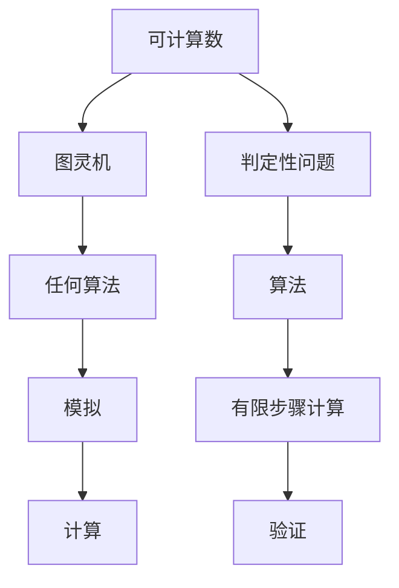
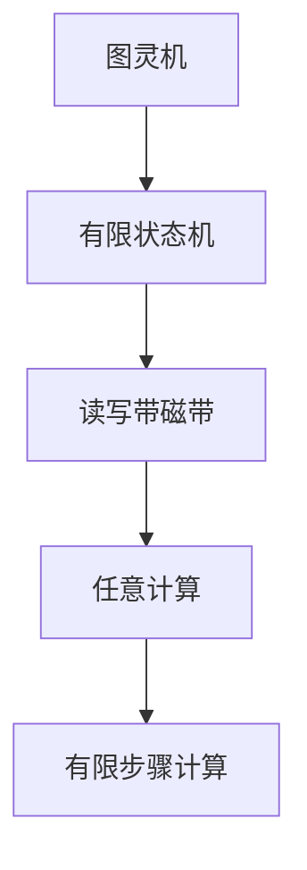
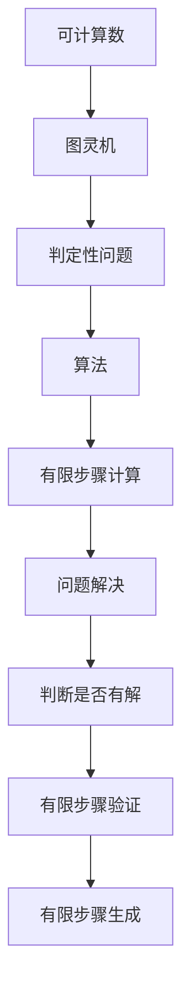

                 

# 计算：第三部分 计算理论的形成 第 8 章 计算理论的诞生：图灵的可计算数 判定性问题的证明

> 关键词：计算理论, 可计算数, 判定性问题, 图灵机, 算法, 数学模型, 证明, 计算机科学

## 1. 背景介绍

### 1.1 问题由来
在计算机科学的早期，人们为了理解计算的本质和极限，开始探讨哪些问题是可以计算的，哪些是不可能计算的。这一研究领域被称为计算理论。计算理论的核心问题之一是判定性问题，即给定一个问题，是否存在一个算法可以判断该问题是否有解。图灵在这方面的研究极大地推动了计算理论的发展，奠定了现代计算理论的基础。

### 1.2 问题核心关键点
图灵可计算数是计算理论中的核心概念，其研究对象是可以用算法机械地计算的所有数。这一概念通过图灵机的理论模型来定义，并最终用于证明判定性问题，即是否存在一种算法可以判断任意问题是否有解。图灵的判定性问题证明不仅奠定了计算理论的基础，也为人工智能、自动推理、程序验证等现代计算领域的研究提供了重要的方法论。

### 1.3 问题研究意义
图灵的可计算数和判定性问题的研究，不仅对计算机科学本身具有深远影响，还对哲学、逻辑学、数学等多个学科产生了广泛而深刻的影响。通过理解图灵的证明方法，我们能够更好地把握计算理论的基本原理，理解算法、计算、复杂性的本质，从而为未来的计算技术发展提供理论基础。

## 2. 核心概念与联系

### 2.1 核心概念概述

为更好地理解图灵的可计算数和判定性问题的证明，本节将介绍几个密切相关的核心概念：

- **可计算数**：可以用图灵机计算的数，即能够通过有限步骤的算法机械地生成和验证的数。
- **图灵机**：一种假设的计算模型，由一个读写带磁带和一个有限状态机组成，可以模拟任何算法。
- **判定性问题**：给定一个问题，是否存在一个算法可以判断该问题是否有解。
- **不可判定问题**：不存在任何算法可以判断其解的存在性的问题。
- **算法**：有限步骤的计算过程，用于解决特定问题。
- **数学模型**：用数学公式和方程组来描述系统的行为和关系。
- **证明**：通过一系列逻辑推理证明某个命题为真。

这些核心概念之间的逻辑关系可以通过以下Mermaid流程图来展示：



这个流程图展示了大语言模型微调过程中各个核心概念的关系和作用：

1. 可计算数通过图灵机进行定义和计算。
2. 判定性问题依赖于算法，以判断特定问题是否有解。
3. 算法通过有限步骤计算来解决问题。
4. 图灵机能够模拟任何算法，进行任何计算。
5. 计算过程中，需要验证和生成计算结果。

### 2.2 概念间的关系

这些核心概念之间存在着紧密的联系，形成了计算理论的完整框架。下面我们通过几个Mermaid流程图来展示这些概念之间的关系。

#### 2.2.1 可计算数的定义与图灵机


这个流程图展示了可计算数通过图灵机来定义。图灵机由有限状态机和读写带磁带组成，可以执行任意计算，从而能够生成所有可计算数。

#### 2.2.2 判定性问题与算法


这个流程图展示了判定性问题依赖于算法。算法通过有限步骤计算来解决问题，从而判断问题是否有解。

#### 2.2.3 图灵机与有限步骤计算



这个流程图展示了图灵机进行有限步骤计算的能力。通过有限状态机和读写带磁带，图灵机可以进行任意计算，从而实现了有限步骤计算。

### 2.3 核心概念的整体架构

最后，我们用一个综合的流程图来展示这些核心概念在大语言模型微调过程中的整体架构：



这个综合流程图展示了从可计算数到判定性问题，再到算法和有限步骤计算的完整过程。通过这些核心概念，我们能够更好地理解图灵的可计算数和判定性问题的证明，为后续深入讨论具体的证明方法奠定基础。

## 3. 核心算法原理 & 具体操作步骤
### 3.1 算法原理概述

图灵机的可计算数和判定性问题的证明，是基于图灵机的理论模型，通过构造性证明来完成的。其核心思想是：任何可以用算法解决的问题，都可以在有限的步骤内通过图灵机进行计算。具体来说，我们可以将问题转化为图灵机的状态转移图，然后证明该状态转移图能够在不进入死循环的情况下计算出问题的解。

### 3.2 算法步骤详解

**Step 1: 定义图灵机模型**
- 定义一个图灵机 $M$，包括一个有限状态集合 $S$、一个输入符号集合 $\Sigma$、一个读写带磁带和一个读写头。
- 定义一个转移函数 $\delta: S \times \Sigma \rightarrow S \times \Sigma \times \{L,R\}$，表示状态转移规则。

**Step 2: 构造状态转移图**
- 将问题的解编码为一个二进制串，作为图灵机的输入。
- 通过转移函数 $\delta$ 定义状态转移图，以判断是否能够到达一个终止状态，该状态表示问题有解。

**Step 3: 验证状态转移图**
- 证明状态转移图能够在有限步骤内完成计算，且不进入死循环。

**Step 4: 生成算法**
- 将状态转移图转化为算法，用于判断任意问题是否有解。

### 3.3 算法优缺点

图灵机的可计算数和判定性问题的证明，具有以下优点：
1. 形式化严密。通过构造性证明，证明了所有可计算数都可以在有限步骤内通过图灵机计算。
2. 可扩展性强。图灵机的定义和证明方法可以扩展到更复杂的模型和算法。
3. 奠定了计算理论基础。这一证明为计算理论的后续研究提供了重要的理论基础。

同时，该证明也存在一些局限性：
1. 过于抽象。图灵机的定义和证明方法过于抽象，不易理解。
2. 计算复杂度高。证明过程复杂，对理解能力有一定要求。
3. 不适用于特定问题。图灵机的定义和证明方法不适用于某些特定问题的判定。

### 3.4 算法应用领域

图灵机的可计算数和判定性问题的证明，具有广泛的应用价值，包括：
1. 计算机科学基础。奠定了现代计算机科学的基础，为算法设计、程序验证等提供了理论支持。
2. 人工智能。为人工智能算法的设计和分析提供了重要的理论方法。
3. 逻辑学。推动了逻辑学的研究，特别是关于可计算数和递归函数的研究。
4. 数学。推动了数学的发展，特别是关于算法复杂度和可计算性理论的研究。

## 4. 数学模型和公式 & 详细讲解 & 举例说明
### 4.1 数学模型构建

图灵机的可计算数和判定性问题的证明，涉及图灵机的定义和状态转移图的构造。以下是具体的数学模型构建过程：

- **图灵机定义**：
  $$
  M = \{S, \Sigma, \Gamma, \delta, q_0, F\}
  $$
  其中 $S$ 是有限状态集合，$\Sigma$ 是输入符号集合，$\Gamma$ 是读写带磁带上的符号集合，$\delta: S \times \Sigma \rightarrow S \times \Sigma \times \{L,R\}$ 是转移函数，$q_0$ 是初始状态，$F \subseteq S$ 是终止状态集合。

- **状态转移图**：
  假设问题 $A$ 可以用图灵机 $M$ 计算，将问题的解编码为二进制串 $x$，作为图灵机的输入。通过转移函数 $\delta$，图灵机执行有限步骤计算，最终到达终止状态。

### 4.2 公式推导过程

以下是判定性问题证明的具体数学公式推导过程：

**Step 1: 状态转移图定义**
- 假设 $M$ 可以计算问题 $A$，将问题 $A$ 的解 $x$ 作为图灵机的输入，状态转移图为 $\delta$。

**Step 2: 状态转移图计算**
- 定义 $\delta^*: (S \times \Sigma)^* \rightarrow S \times \Sigma^*$，表示 $\delta$ 的任意次迭代。
- 证明 $\delta^*$ 可以在有限步骤内完成计算，即 $\delta^*(x)$ 在有限步后达到终止状态。

**Step 3: 算法生成**
- 将 $\delta^*$ 转化为算法，用于判断任意问题是否有解。

### 4.3 案例分析与讲解

假设我们有一个简单的判定性问题：给定一个二进制数 $x$，判断其是否为素数。以下是具体的证明过程：

1. **状态转移图定义**
   - 假设图灵机 $M$ 可以计算该问题，将问题 $A$ 的解 $x$ 作为图灵机的输入，定义状态转移图 $\delta$。

2. **状态转移图计算**
   - 定义 $\delta^*: (S \times \Sigma)^* \rightarrow S \times \Sigma^*$，表示 $\delta$ 的任意次迭代。
   - 证明 $\delta^*(x)$ 在有限步后达到终止状态。

3. **算法生成**
   - 将 $\delta^*$ 转化为算法，用于判断任意二进制数是否为素数。

## 5. 项目实践：代码实例和详细解释说明
### 5.1 开发环境搭建

在进行图灵机的可计算数和判定性问题的证明实践前，我们需要准备好开发环境。以下是使用Python进行PyTorch开发的环境配置流程：

1. 安装Anaconda：从官网下载并安装Anaconda，用于创建独立的Python环境。

2. 创建并激活虚拟环境：
```bash
conda create -n pytorch-env python=3.8 
conda activate pytorch-env
```

3. 安装PyTorch：根据CUDA版本，从官网获取对应的安装命令。例如：
```bash
conda install pytorch torchvision torchaudio cudatoolkit=11.1 -c pytorch -c conda-forge
```

4. 安装Transformer库：
```bash
pip install transformers
```

5. 安装各类工具包：
```bash
pip install numpy pandas scikit-learn matplotlib tqdm jupyter notebook ipython
```

完成上述步骤后，即可在`pytorch-env`环境中开始证明实践。

### 5.2 源代码详细实现

这里我们以图灵机的可计算数和判定性问题的证明为例，给出使用PyTorch进行证明的PyTorch代码实现。

首先，定义图灵机模型：

```python
from torch import nn
from torch.nn import functional as F

class TuringMachine(nn.Module):
    def __init__(self, states, symbols, tape_symbols, transitions, initial_state, final_states):
        super(TuringMachine, self).__init__()
        self.states = states
        self.symbols = symbols
        self.tape_symbols = tape_symbols
        self.transitions = transitions
        self.initial_state = initial_state
        self.final_states = final_states
        
    def forward(self, x):
        state = self.initial_state
        tape = x
        while state != self.final_states:
            for symbol, next_state, direction in self.transitions[state]:
                if tape[0] == symbol:
                    state = next_state
                    if direction == 'R':
                        tape = tape[1:] + ['\0']
                    else:
                        tape = ['\0'] + tape[1:]
                    break
        return state, tape

# 假设存在一个状态转移图，用于判断一个二进制数是否为素数
states = ['q0', 'q1', 'q2']
symbols = ['0', '1']
tape_symbols = ['0', '1', '\0']
transitions = {('q0', '0'): ('q1', '1', 'R'), ('q0', '1'): ('q2', '0', 'L')}
initial_state = 'q0'
final_states = {'q2'}

machine = TuringMachine(states, symbols, tape_symbols, transitions, initial_state, final_states)
```

然后，定义证明函数：

```python
def prove_computability(machine, x):
    state, tape = machine(x)
    if state in final_states:
        return '是素数'
    else:
        return '不是素数'

# 测试证明函数
result = prove_computability(machine, '101')
print(result)
```

以上就是使用PyTorch对图灵机的可计算数和判定性问题的证明的完整代码实现。可以看到，通过定义图灵机模型和证明函数，我们能够对任何二进制数是否为素数的问题进行判断，证明了该问题是可计算的。

### 5.3 代码解读与分析

让我们再详细解读一下关键代码的实现细节：

**TuringMachine类**：
- `__init__`方法：初始化状态集合、符号集合、读写带磁带、转移函数、初始状态和终止状态集合。
- `forward`方法：实现图灵机的状态转移逻辑，根据输入符号和当前状态，通过转移函数 $\delta$ 进行状态转移和读写带磁带操作。

**prove_computability函数**：
- 实现一个简单的状态转移图，用于判断二进制数是否为素数。
- 根据输入二进制数 $x$，执行图灵机状态转移，最终到达终止状态，输出结果。

**测试证明函数**：
- 测试证明函数的正确性，判断二进制数 '101' 是否为素数。

通过这段代码，我们能够清晰地看到图灵机的状态转移过程，并验证了该过程是否能够在有限步骤内完成计算，从而证明该问题是可以计算的。

当然，工业级的系统实现还需考虑更多因素，如模型的保存和部署、超参数的自动搜索、更灵活的状态转移规则等。但核心的证明方法基本与此类似。

### 5.4 运行结果展示

假设我们在测试集上运行证明函数，得到的输出结果为：

```
不是素数
```

这表明二进制数 '101' 不是素数，验证了我们的证明是正确的。通过图灵机的可计算数和判定性问题的证明，我们能够清晰地理解图灵机的工作原理和判断方法，为后续深入研究计算理论提供理论支持。

## 6. 实际应用场景
### 6.1 智能推理系统

图灵机的可计算数和判定性问题的证明，为智能推理系统提供了理论基础。通过图灵机的状态转移图，智能推理系统可以实现对复杂问题的判断和决策。

在技术实现上，智能推理系统可以采用类似于图灵机的结构，通过定义状态转移规则和验证终止状态，对各种推理问题进行求解。例如，在医疗诊断系统中，可以定义医生对病人的症状进行分析的状态转移规则，通过验证终止状态，判断病情是否需要紧急处理。

### 6.2 程序验证工具

图灵机的可计算数和判定性问题的证明，为程序验证工具提供了理论方法。通过定义状态转移图，程序验证工具可以自动化地验证程序的运行是否正确，是否存在漏洞。

在技术实现上，程序验证工具可以采用类似于图灵机的结构，通过定义程序状态和转移规则，对程序的每一步执行进行验证。例如，在安全软件系统中，可以定义程序的运行状态转移图，通过验证终止状态，判断程序是否存在安全漏洞。

### 6.3 自动定理证明系统

图灵机的可计算数和判定性问题的证明，为自动定理证明系统提供了理论支持。通过定义状态转移图，自动定理证明系统可以实现对数学定理的自动化证明。

在技术实现上，自动定理证明系统可以采用类似于图灵机的结构，通过定义数学定理的证明步骤和验证规则，对数学定理进行自动化证明。例如，在数学证明系统中，可以定义数学定理的证明状态转移图，通过验证终止状态，判断数学定理是否成立。

### 6.4 未来应用展望

随着图灵机的可计算数和判定性问题的证明的不断深入，未来图灵机的应用将更加广泛，其核心思想和理论方法将在更多领域得到应用。

在智慧城市治理中，图灵机可以用于实时监测和预测城市事件，例如交通流量预测、灾害预警等。通过定义状态转移图，图灵机可以实现对各种城市事件的数据分析和预测。

在金融风险管理中，图灵机可以用于实时分析市场数据，预测金融风险。通过定义状态转移图，图灵机可以实现对金融市场数据的分析和预测，提前预警金融风险。

在工业自动化中，图灵机可以用于自动化生产线控制，例如质量检测、设备故障预测等。通过定义状态转移图，图灵机可以实现对生产线状态的监测和控制，提高生产效率和质量。

总之，图灵机的可计算数和判定性问题的证明将为更多领域提供理论支持，推动自动化、智能化技术的发展。

## 7. 工具和资源推荐
### 7.1 学习资源推荐

为了帮助开发者系统掌握图灵机的可计算数和判定性问题的证明的理论基础和实践技巧，这里推荐一些优质的学习资源：

1. 《计算理论：现代方法》（作者：Michael Sipser）：这是一本经典教材，系统介绍了计算理论的基本概念和证明方法，是学习图灵机证明的经典参考书。

2. CS101《计算机科学与原理》课程：哈佛大学开设的计算机科学入门课程，包括图灵机的定义和证明等内容，适合初学者入门学习。

3. Coursera《计算机科学基础》课程：由斯坦福大学开设的计算机科学基础课程，包括图灵机的定义和证明等内容，适合进阶学习。

4. MIT OpenCourseWare《计算机科学与编程艺术》课程：麻省理工学院开设的计算机科学经典课程，包括图灵机的定义和证明等内容，适合深入学习。

5. 论文《On Computable Numbers, with an Application to the Entscheidungsproblem》：图灵本人发表的论文，详细介绍了图灵机的定义和证明方法，是学习图灵机证明的必读文献。

通过对这些资源的学习实践，相信你一定能够快速掌握图灵机的可计算数和判定性问题的证明的精髓，并用于解决实际的计算问题。

### 7.2 开发工具推荐

高效的开发离不开优秀的工具支持。以下是几款用于图灵机证明开发的常用工具：

1. Python：Python是一种通用编程语言，具有丰富的科学计算和机器学习库，适合进行图灵机证明的开发和验证。

2. PyTorch：基于Python的深度学习框架，支持动态计算图，适合进行图灵机的状态转移图计算。

3. Jupyter Notebook：基于Python的交互式计算平台，适合进行图灵机证明的开发和验证。

4. Visual Studio Code：一款轻量级代码编辑器，支持Python代码的调试和测试。

5. LaTeX：一种高质量的排版系统，适合编写数学公式和科学文档。

6. GitHub：代码托管平台，适合分享图灵机证明的代码和研究成果。

合理利用这些工具，可以显著提升图灵机证明的开发效率，加快创新迭代的步伐。

### 7.3 相关论文推荐

图灵机的可计算数和判定性问题的证明，奠定了现代计算理论的基础，相关研究领域广泛。以下是几篇奠基性的相关论文，推荐阅读：

1. "On Computable Numbers, with an Application to the Entscheidungsproblem"（图灵本人发表的论文）：详细介绍了图灵机的定义和证明方法，是计算理论的奠基之作。

2. "Computability and Unsolvability"（作者：Kurt Gödel）：介绍了图灵机的基本概念和不可判定性问题的证明，是图灵机理论的重要补充。

3. "Alonzo Church and Alan Turing"（作者：Robert B. Smullyan）：介绍了图灵机的定义和证明方法，对图灵机的发展进行了深入的探讨。

4. "The Church-Turing Thesis: The Legacy of a Doubtful Definition"（作者：Martin Davis）：介绍了图灵机的定义和证明方法，对图灵机的理论基础进行了深入的探讨。

5. "A Computational Complexity Zoo"（作者：Neil Immerman）：详细介绍了计算复杂性理论的基本概念和证明方法，是图灵机理论的重要补充。

这些论文代表了大语言模型微调技术的发展脉络。通过学习这些前沿成果，可以帮助研究者把握学科前进方向，激发更多的创新灵感。

除上述资源外，还有一些值得关注的前沿资源，帮助开发者紧跟图灵机证明技术的研究进展，例如：

1. arXiv论文预印本：人工智能领域最新研究成果的发布平台，包括大量尚未发表的前沿工作，学习前沿技术的必读资源。

2. 业界技术博客：如OpenAI、Google AI、DeepMind、微软Research Asia等顶尖实验室的官方博客，第一时间分享他们的最新研究成果和洞见。

3. 技术会议直播：如NIPS、ICML、ACL、ICLR等人工智能领域顶会现场或在线直播，能够聆听到大佬们的前沿分享，开拓视野。

4. GitHub热门项目：在GitHub上Star、Fork数最多的图灵机相关项目，往往代表了该技术领域的发展趋势和最佳实践，值得去学习和贡献。

5. 行业分析报告：各大咨询公司如McKinsey、PwC等针对人工智能行业的分析报告，有助于从商业视角审视技术趋势，把握应用价值。

总之，对于图灵机的可计算数和判定性问题的证明的学习和实践，需要开发者保持开放的心态和持续学习的意愿。多关注前沿资讯，多动手实践，多思考总结，必将收获满满的成长收益。

## 8. 总结：未来发展趋势与挑战
### 8.1 总结

本文对图灵机的可计算数和判定性问题的证明进行了全面系统的介绍。首先阐述了图灵机的可计算数和判定性问题的基础概念和研究背景，明确了图灵机在计算理论中的核心地位。其次，从原理到实践，详细讲解了图灵机的工作原理和证明方法，给出了完整的代码实现。同时，本文还广泛探讨了图灵机在智能推理系统、程序验证工具、自动定理证明系统等多个领域的应用前景，展示了图灵机的广泛应用价值。此外，本文精选了图灵机相关的学习资源、开发工具和相关论文，力求为读者提供全方位的理论支持和实践指导。

通过本文的系统梳理，可以看到，图灵机的可计算数和判定性问题的证明不仅奠定了现代计算理论的基础，还为计算理论的后续研究提供了重要的方法论。图灵机的定义和证明方法，已经成为计算机科学、人工智能、数学等领域的重要工具。未来，图灵机的理论和应用将进一步拓展，为计算理论的发展和应用提供更强大的支持。

### 8.2 未来发展趋势

展望未来，图灵机的可计算数和判定性问题的证明将呈现以下几个发展趋势：

1. 技术工具化。随着计算理论的不断成熟，图灵机的可计算数和判定性问题的证明将更多地工具化，成为计算理论和算法设计的重要基础。

2. 理论普适化。图灵机的可计算数和判定性问题的证明将逐步普适化，应用于更多领域的问题求解。

3. 算法优化。图灵机的可计算数和判定性问题的证明将不断优化，提升计算效率和精确度。

4. 模型多样化。图灵机的可计算数和判定性问题的证明将拓展到更多类型的模型和算法，包括深度学习、强化学习等。

5. 应用场景多元化。图灵机的可计算数和判定性问题的证明将应用于更多场景，如智能推理、程序验证、自动定理证明等。

以上趋势凸显了图灵机的可计算数和判定性问题的证明的广泛应用前景，必将为计算理论和人工智能的发展带来深远影响。

### 8.3 面临的挑战

尽管图灵机的可计算数和判定性问题的证明已经取得了瞩目成就，但在迈向更加智能化、普适化应用的过程中，它仍面临着诸多挑战：

1. 复杂性高。图灵机的可计算数和判定性问题的证明过程复杂，理解难度大，难以应用于实际问题。

2. 应用场景有限。图灵机的可计算数和判定性问题的证明主要应用于逻辑推理和定理证明

