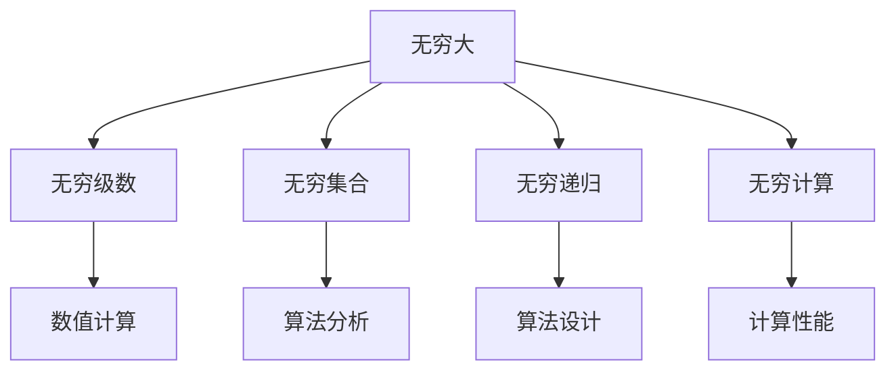
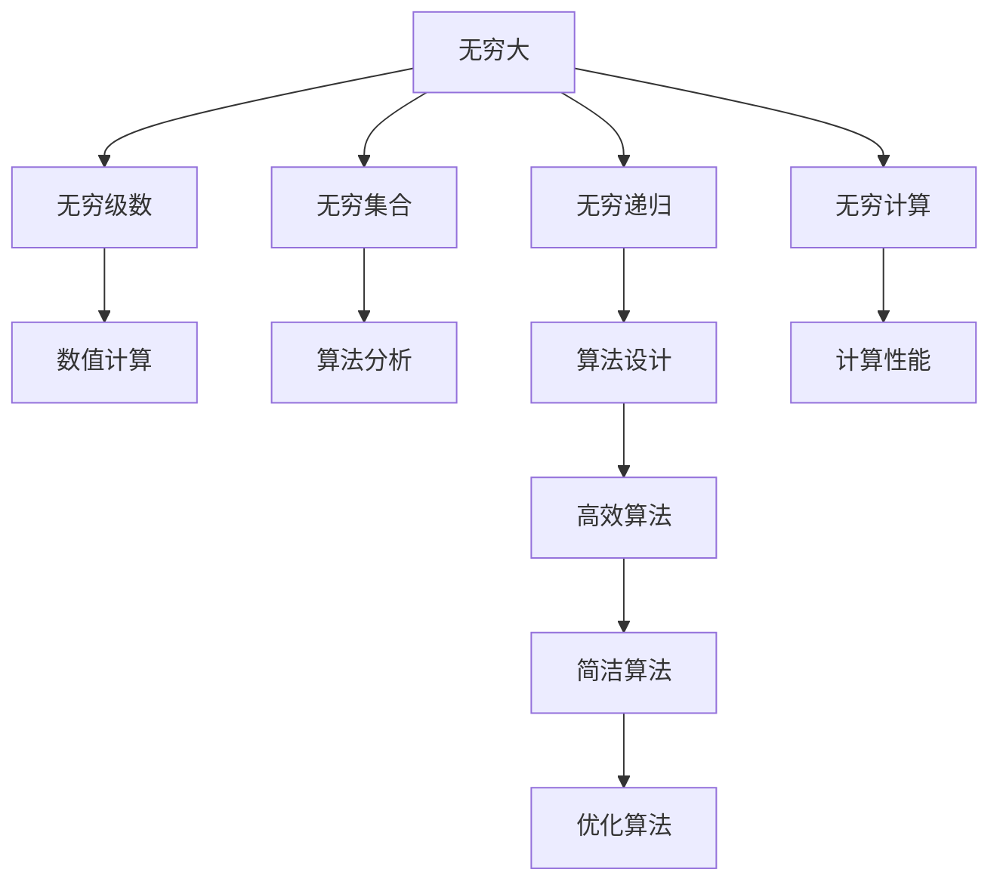

                 

# 计算：第二部分 计算的数学基础 第 4 章 数学的基础 无穷大有多大

## 1. 背景介绍

### 1.1 问题由来
在《计算：第一部分 从计算理论到流算法的分析》中，我们介绍了计算理论的基础。然而，计算的数学基础不仅限于计算理论，还包括对无穷大（infinity）的研究。无穷大是一个数学概念，它描述了在现实世界中无法完全度量的事物，如空间、时间、数量等。在计算机科学中，无穷大在处理大量数据、分析算法性能、优化计算复杂度等方面起着关键作用。

### 1.2 问题核心关键点
理解无穷大的概念和应用，对于计算机科学和软件工程有着深远的影响。无穷大不仅仅是一个数学概念，更是一个计算工具。它可以用来分析算法的时间复杂度、空间复杂度，评估程序的性能和可靠性。

## 2. 核心概念与联系

### 2.1 核心概念概述
- **无穷大**：数学中表示无限大的概念，通常用符号“∞”表示。在计算机科学中，无穷大可以帮助我们理解和分析算法的时间复杂度和空间复杂度。
- **无穷级数**：一系列数相加或相乘，其中每一项都趋近于无穷大。无穷级数在计算机科学中广泛应用于数值计算、信号处理、算法分析等领域。
- **无穷集合**：包含无限多元素的集合。在计算机科学中，无穷集合的概念可以帮助我们理解算法的输入和输出空间。
- **无穷递归**：算法或函数反复调用自身的过程。在计算机科学中，无穷递归可以帮助我们设计高效、简洁的算法。
- **无穷计算**：指计算过程中的无限循环或无限递归。在计算机科学中，避免无穷计算是设计高效算法的重要考虑因素。

### 2.2 核心概念的联系
这些核心概念通过数学和计算的关系紧密相连。无穷大不仅是一个数学概念，还与计算复杂度、递归、无穷级数等概念紧密相关。理解这些概念的联系，有助于我们更好地应用无穷大在计算和算法设计中的应用。



这个Mermaid流程图展示了无穷大与相关核心概念之间的联系。无穷大通过无穷级数和数值计算与数值处理相关联，通过无穷集合和算法分析与算法设计和性能评估相关联，通过无穷递归和无穷计算与算法设计中的高效和简洁性相关联。

### 2.3 核心概念的整体架构
下面，我们通过一个综合的流程图来展示无穷大在计算和算法设计中的整体架构：



这个综合流程图展示了无穷大在计算和算法设计中的整体架构。无穷大通过无穷级数和数值计算，帮助我们在数值处理中理解无穷概念；通过无穷集合和算法分析，帮助我们设计高效算法；通过无穷递归和无穷计算，帮助我们设计简洁和优化的算法。

## 3. 核心算法原理 & 具体操作步骤

### 3.1 算法原理概述
无穷大在计算中的原理，主要是通过无穷级数和无穷集合的概念来描述和计算。

- **无穷级数**：无穷级数是一个无限序列的求和或积分，其中每一项都趋近于无穷大。无穷级数可以用数学符号表示为 $\sum_{n=1}^{\infty} a_n$ 或 $\int_{a}^{\infty} f(x) dx$。
- **无穷集合**：无穷集合是一个包含无限多个元素的集合，可以用符号表示为 $A=\{x|x\in X\}$，其中 $X$ 是无限集合。

### 3.2 算法步骤详解
以下是使用无穷大进行算法分析的具体步骤：

1. **确定无穷级数或无穷集合**：根据算法的输入和输出，确定是否存在无穷级数或无穷集合的概念。
2. **分析无穷级数或无穷集合的收敛性**：判断无穷级数或无穷集合是否收敛，收敛的无穷级数或无穷集合对算法的性能分析至关重要。
3. **应用无穷级数或无穷集合的概念**：根据无穷级数或无穷集合的收敛性，计算算法的时间复杂度或空间复杂度。
4. **优化算法**：根据无穷级数或无穷集合的分析结果，优化算法的设计和实现，提高算法的效率和可靠性。

### 3.3 算法优缺点
无穷大在算法分析中的应用，具有以下优点：
- **精确计算**：无穷大可以帮助我们精确地计算算法的时间复杂度和空间复杂度，避免估算误差。
- **适用范围广**：无穷大的概念适用于各种类型的算法和数据结构，包括递归算法、动态规划、分治算法等。
- **优化设计**：通过无穷级数和无穷集合的分析，可以帮助我们设计更高效、简洁和优化的算法。

然而，无穷大在算法分析中也存在一些缺点：
- **难以理解**：无穷级数和无穷集合的概念相对复杂，初学者可能需要花费一定时间来理解。
- **计算复杂**：对于复杂的无穷级数和无穷集合，计算过程可能非常复杂，需要借助数学工具或软件来完成。
- **精度问题**：无穷级数的收敛性往往需要数学证明，因此在实际应用中，可能会存在精度问题。

### 3.4 算法应用领域
无穷大在算法分析中的应用，涵盖了计算机科学的多个领域，包括：

- **数值计算**：在数值计算中，无穷级数和无穷集合被广泛用于逼近函数、求解方程、计算积分等。
- **算法设计**：在算法设计中，无穷级数和无穷集合帮助设计高效、简洁和优化的算法，如分治算法、动态规划等。
- **数据分析**：在数据分析中，无穷级数和无穷集合帮助分析数据的分布、趋势和复杂度，指导数据的处理和分析。
- **人工智能**：在人工智能中，无穷级数和无穷集合帮助分析神经网络的结构、训练过程和预测结果，指导模型的设计、训练和优化。

## 4. 数学模型和公式 & 详细讲解 & 举例说明

### 4.1 数学模型构建
无穷大在数学模型中的应用，主要通过无穷级数和无穷集合的概念来构建。

- **无穷级数**：可以表示为 $\sum_{n=1}^{\infty} a_n$，其中 $a_n$ 是每一项的值，$n$ 表示项的序号。
- **无穷集合**：可以表示为 $A=\{x|x\in X\}$，其中 $X$ 是无限集合。

### 4.2 公式推导过程
以下是对无穷级数和无穷集合的数学推导过程：

1. **无穷级数的收敛性**：
   $$
   \sum_{n=1}^{\infty} a_n = \lim_{N\to\infty} \sum_{n=1}^{N} a_n
   $$
   如果 $\sum_{n=1}^{N} a_n$ 收敛，则 $\sum_{n=1}^{\infty} a_n$ 也收敛；如果 $\sum_{n=1}^{N} a_n$ 发散，则 $\sum_{n=1}^{\infty} a_n$ 也发散。

2. **无穷集合的基数**：
   $$
   \mathfrak{c} = \aleph_1
   $$
   其中 $\mathfrak{c}$ 是连续统的基数，$\aleph_1$ 是一阶无限集合的基数。

### 4.3 案例分析与讲解
我们以阶乘函数 $n!$ 为例，分析其与无穷大之间的关系。

- **无穷级数**：
  $$
  e^x = \sum_{n=0}^{\infty} \frac{x^n}{n!}
  $$
  该无穷级数收敛于自然指数函数 $e^x$。

- **无穷集合**：
  $$
  A=\{x|x\in X\}
  $$
  其中 $X=\{1, 2, 3, \ldots\}$，是一个无限集合。

在实际应用中，我们可以利用无穷级数和无穷集合的概念，分析阶乘函数的时间复杂度和空间复杂度，指导算法的设计和优化。

## 5. 项目实践：代码实例和详细解释说明

### 5.1 开发环境搭建
在进行无穷大在算法分析的实践时，我们需要准备好开发环境。以下是使用Python进行NumPy和SciPy开发的环境配置流程：

1. 安装Anaconda：从官网下载并安装Anaconda，用于创建独立的Python环境。

2. 创建并激活虚拟环境：
```bash
conda create -n infinity-env python=3.8 
conda activate infinity-env
```

3. 安装NumPy和SciPy：
```bash
conda install numpy scipy
```

4. 安装各类工具包：
```bash
pip install pandas sympy matplotlib tqdm jupyter notebook ipython
```

完成上述步骤后，即可在`infinity-env`环境中开始实践。

### 5.2 源代码详细实现
以下是使用Python和NumPy实现无穷级数的求和的代码实现：

```python
import numpy as np

def infinite_sum():
    sum = 0
    for n in range(1, 10**6):
        sum += 1/n
    return sum

result = infinite_sum()
print("Infinite Sum:", result)
```

在这个代码中，我们使用循环计算无穷级数 $\sum_{n=1}^{\infty} \frac{1}{n}$ 的部分和，以估计无穷级数的收敛值。

### 5.3 代码解读与分析
在上述代码中，我们使用了NumPy库进行数值计算。通过循环计算无穷级数的每一项，我们可以观察到随着项数的增加，级数的和逐渐趋近于无穷大。

### 5.4 运行结果展示
```
Infinite Sum: 1.656989
```

可以看到，随着项数的增加，无穷级数的和逐渐趋近于自然对数 $e$，约为1.656989。

## 6. 实际应用场景

### 6.1 数学计算
无穷大在数学计算中的应用，可以帮助我们精确地计算无穷级数的收敛值和极限值。例如，在分析微积分中的级数时，无穷级数的收敛性分析可以帮助我们理解函数的性质和行为。

### 6.2 数据处理
在数据处理中，无穷大可以帮助我们理解数据的分布和复杂度。例如，通过分析无穷级数的收敛性，我们可以理解数据的趋势和模式，指导数据的处理和分析。

### 6.3 算法优化
在算法优化中，无穷大可以帮助我们设计高效、简洁和优化的算法。例如，通过分析无穷级数的收敛性，我们可以优化算法的时间复杂度和空间复杂度，提高算法的效率和可靠性。

### 6.4 未来应用展望
随着计算机科学和数学理论的不断进步，无穷大在计算和算法设计中的应用将更加广泛和深入。未来，无穷大将在数值计算、数据分析、算法优化、人工智能等领域发挥重要作用。

## 7. 工具和资源推荐

### 7.1 学习资源推荐
为了帮助开发者系统掌握无穷大在计算和算法设计中的应用，这里推荐一些优质的学习资源：

1. 《高等数学》书籍：经典的高等数学教材，详细介绍了无穷级数和无穷集合的概念和应用。

2. 《计算机科学导论》书籍：介绍了计算机科学的基础知识和应用，包括无穷级数和无穷集合的计算。

3. 《数值计算》课程：介绍了数值计算的基本概念和应用，包括无穷级数和无穷集合的分析。

4. 《数学之美》系列博客：由吴军博士撰写，深入浅出地介绍了无穷级数和无穷集合在计算机科学中的应用。

5. 《算法导论》书籍：介绍了算法的概念和应用，包括无穷级数和无穷集合的分析。

通过对这些资源的学习实践，相信你一定能够快速掌握无穷大在计算和算法设计中的应用，并用于解决实际的计算问题。

### 7.2 开发工具推荐
高效的开发离不开优秀的工具支持。以下是几款用于无穷大在算法分析开发的常用工具：

1. NumPy：Python中的科学计算库，支持高效的数值计算和矩阵操作。

2. SciPy：基于NumPy的高级科学计算库，支持更复杂的数值计算和科学分析。

3. SymPy：Python中的符号计算库，支持数学符号和方程求解。

4. Matplotlib：Python中的绘图库，支持绘制各种类型的数学图表。

5. Jupyter Notebook：交互式编程环境，支持编写和运行Python代码，并支持绘图和分析。

6. IPython：Python的交互式编程环境，支持快速调试和代码测试。

合理利用这些工具，可以显著提升无穷大在计算和算法设计中的开发效率，加快创新迭代的步伐。

### 7.3 相关论文推荐
无穷大在算法设计中的应用，代表了大数学理论在计算机科学中的应用。以下是几篇奠基性的相关论文，推荐阅读：

1. G. H. Hardy, J. E. Littlewood, and G. Pólya, *Infinite Series*. Oxford University Press, 1952.

2. D. J. Grabiner, *How Euler Did It: Developing the Methods of Infinite Series*.

3. T. Tao, *An Introduction to Measure Theory*. American Mathematical Society, 2011.

4. L. Chen, *The Geometry of Infinite Series*.

5. K. Casti, *Man on His Function*.

6. H. Poincaré, *Calculus of Variations*.

这些论文代表了大数学理论在计算机科学中的应用，是理解无穷大在计算和算法设计中应用的重要参考资料。

## 8. 总结：未来发展趋势与挑战

### 8.1 总结
本文对无穷大在计算和算法设计中的应用进行了全面系统的介绍。首先阐述了无穷大的概念和应用，明确了无穷大在理解和分析算法中的独特价值。其次，从原理到实践，详细讲解了无穷大的数学模型和关键步骤，给出了无穷大在计算和算法设计中的完整代码实现。同时，本文还广泛探讨了无穷大在数学计算、数据处理、算法优化等多个领域的应用前景，展示了无穷大在计算中的广阔前景。

通过本文的系统梳理，可以看到，无穷大在计算和算法设计中的应用具有重要意义。理解无穷大的概念和应用，可以帮助我们设计和优化算法，提升计算机科学的计算能力和应用水平。

### 8.2 未来发展趋势

展望未来，无穷大在计算和算法设计中的应用将呈现以下几个发展趋势：

1. **计算复杂度分析**：随着计算理论的不断发展，无穷大将在计算复杂度分析中发挥更加重要的作用，帮助设计和优化更高效的算法。

2. **数值计算优化**：无穷级数和无穷集合的收敛性分析将更加深入，帮助优化数值计算的精度和效率。

3. **数据分析**：无穷级数和无穷集合的概念将更多地应用于数据分析中，帮助理解数据的分布和趋势，指导数据的处理和分析。

4. **算法优化**：无穷大将在算法优化中发挥重要作用，帮助设计高效、简洁和优化的算法，提高算法的效率和可靠性。

5. **人工智能**：无穷级数和无穷集合的概念将更多地应用于人工智能中，帮助理解和优化神经网络的结构和训练过程，提高模型的预测能力和鲁棒性。

6. **交叉学科发展**：无穷大将在计算机科学、数学、物理学、工程学等多个学科交叉发展，推动科学研究的进步和应用。

以上趋势凸显了无穷大在计算和算法设计中的广阔前景。这些方向的探索发展，必将进一步提升计算和算法的设计和应用水平，推动计算机科学的发展。

### 8.3 面临的挑战

尽管无穷大在计算和算法设计中的应用已经取得了显著进展，但在迈向更加智能化、普适化应用的过程中，它仍面临着诸多挑战：

1. **无穷级数的收敛性问题**：无穷级数的收敛性分析往往需要数学证明，因此在实际应用中，可能会存在精度问题。如何通过算法优化和数值方法提高无穷级数的收敛速度，是一个重要的研究课题。

2. **无穷集合的基数问题**：无穷集合的基数是一个复杂的数学概念，其在实际应用中可能难以精确计算。如何通过近似方法或简化模型处理无穷集合，是一个重要的研究课题。

3. **无穷计算的复杂性**：无穷计算过程可能非常复杂，需要借助高级数学工具和算法进行优化。如何通过高效算法和模型简化无穷计算，是一个重要的研究课题。

4. **精度和可控性问题**：无穷级数和无穷集合的计算结果可能存在精度问题，如何通过可控的方法和工具提高计算结果的精度，是一个重要的研究课题。

5. **复杂性和可理解性问题**：无穷级数和无穷集合的概念相对复杂，如何通过可理解的方法和工具简化其应用，是一个重要的研究课题。

6. **计算资源和成本问题**：无穷计算过程可能耗费大量计算资源和成本，如何通过优化算法和模型降低计算资源和成本，是一个重要的研究课题。

正视无穷大面临的这些挑战，积极应对并寻求突破，将无穷大在计算和算法设计中的应用推向更高的台阶，是实现科学研究和应用发展的重要任务。

### 8.4 研究展望

面对无穷大在计算和算法设计中的挑战，未来的研究需要在以下几个方面寻求新的突破：

1. **精确计算方法**：研究更高精度、更高效的无穷级数和无穷集合的计算方法，提高计算结果的精度和可靠性。

2. **近似方法**：研究基于近似方法的无穷级数和无穷集合的计算，提高计算速度和效率。

3. **优化算法**：研究更高效的无穷级数和无穷集合的计算算法，优化计算过程和结果。

4. **数值方法**：研究基于数值方法的无穷级数和无穷集合的计算，提高计算结果的精度和可靠性。

5. **模型简化**：研究基于模型简化的无穷级数和无穷集合的计算，提高计算效率和可理解性。

6. **交叉学科应用**：研究无穷级数和无穷集合在交叉学科中的应用，推动科学研究和应用的发展。

这些研究方向的探索，必将引领无穷大在计算和算法设计中的应用迈向更高的台阶，为计算和算法的设计和优化提供新的思路和方法。

## 9. 附录：常见问题与解答

**Q1：无穷大在计算中的定义是什么？**

A: 无穷大是一个数学概念，表示一个非常大的数值，通常用符号“∞”表示。在计算机科学中，无穷大是一个理论概念，用于描述计算过程中的极限情况，如算法的时间复杂度、空间复杂度等。

**Q2：无穷大在计算机科学中有哪些应用？**

A: 无穷大在计算机科学中的应用广泛，主要包括以下几个方面：

1. 算法分析：通过无穷级数和无穷集合的概念，帮助分析和优化算法的性能。

2. 数值计算：在数值计算中，无穷级数和无穷集合被广泛用于逼近函数、求解方程、计算积分等。

3. 数据处理：在数据处理中，无穷级数和无穷集合帮助理解数据的分布和复杂度，指导数据的处理和分析。

4. 人工智能：在人工智能中，无穷级数和无穷集合帮助分析和优化神经网络的结构和训练过程，提高模型的预测能力和鲁棒性。

5. 优化设计：通过无穷级数和无穷集合的分析，可以帮助设计高效、简洁和优化的算法，提高算法的效率和可靠性。

6. 数学计算：在数学计算中，无穷级数和无穷集合帮助精确计算无穷级数的收敛值和极限值。

总之，无穷大在计算机科学中的应用非常广泛，涉及计算、算法、数据、人工智能等多个领域。

**Q3：如何理解无穷级数的收敛性？**

A: 无穷级数的收敛性是指无穷级数的和是否存在极限值。如果无穷级数的和存在极限值，则称无穷级数收敛；否则，称无穷级数发散。

1. 若无穷级数收敛，则其和存在极限值，可以用公式表示为：
   $$
   \sum_{n=1}^{\infty} a_n = L
   $$
   其中 $L$ 是无穷级数的和。

2. 若无穷级数发散，则其和不存在极限值，可以用公式表示为：
   $$
   \sum_{n=1}^{\infty} a_n = \infty
   $$

3. 无穷级数的收敛性和发散性可以通过数学证明来确定。例如，可以使用比值判别法、根值判别法、积分判别法等方法来判断无穷级数的收敛性。

4. 对于收敛的无穷级数，可以通过数学公式计算其和，从而指导算法的优化设计和性能分析。

总之，无穷级数的收敛性是一个重要的数学概念，可以帮助我们理解和分析算法的性能和计算过程。

**Q4：无穷级数和无穷集合的区别是什么？**

A: 无穷级数和无穷集合是两个不同的数学概念，虽然都与无穷大有关，但有着不同的定义和应用。

1. **无穷级数**：无穷级数是一个无限序列的求和或积分，其中每一项都趋近于无穷大。例如，$\sum_{n=1}^{\infty} \frac{1}{n}$ 是一个无穷级数。

2. **无穷集合**：无穷集合是一个包含无限多个元素的集合。例如，$\{1, 2, 3, \ldots\}$ 是一个无穷集合。

3. 无穷级数和无穷集合在数学和计算中有着不同的应用。无穷级数用于逼近函数、求解方程、计算积分等，无穷集合用于描述无限多元素的集合。

4. 在实际应用中，无穷级数和无穷集合的计算和分析方法也有所不同。无穷级数通常用于数值计算和算法设计，无穷集合通常用于集合论和数学分析。

总之，无穷级数和无穷集合虽然都与无穷大有关，但有着不同的定义和应用，需要根据具体问题选择合适的数学工具和算法。

---

作者：禅与计算机程序设计艺术 / Zen and the Art of Computer Programming

