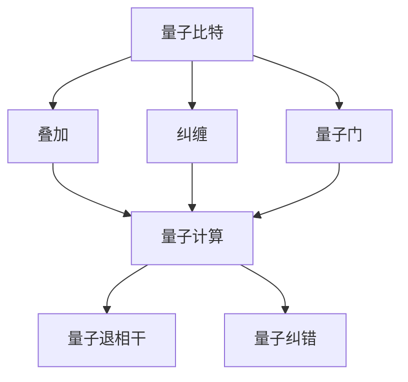
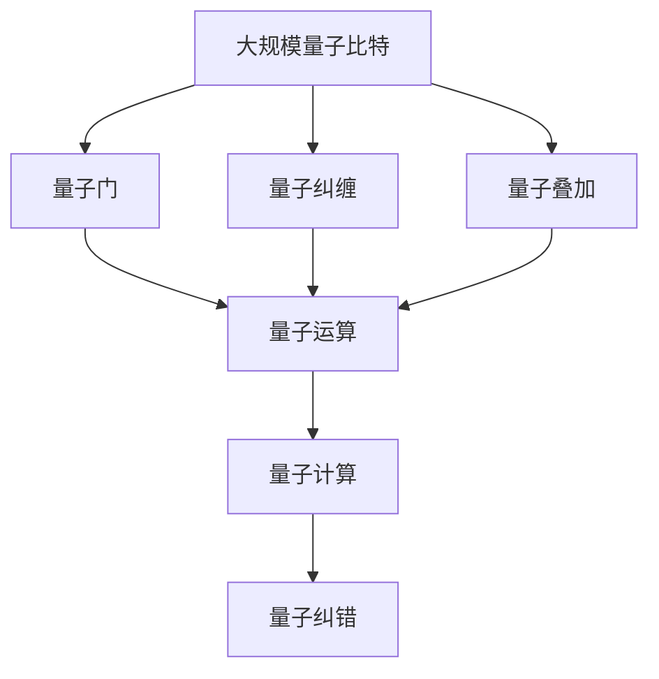

                 

# 计算：第四部分 计算的极限 第 10 章 量子计算 量子比特

## 1. 背景介绍

### 1.1 问题由来

量子计算，作为21世纪计算科学的重大突破，正在逐渐改变我们对计算能力、数据安全以及信息处理方式的传统认知。尽管量子计算的潜力巨大，但直到最近十年，它的实际应用才逐步从理论和实验室走向现实。

量子计算的核心技术之一是量子比特（qubit），与经典计算机的比特（bit）不同，量子比特能够同时处于多个状态，这种特性被称为叠加（superposition）。叠加使得量子计算在处理特定类型的问题时具有巨大的优势，尤其是在因子分解、数据库搜索、机器学习和模拟量子系统等领域。

然而，尽管量子计算的原理清晰，实现量子计算仍然面临巨大的技术挑战。量子比特容易受到环境干扰而发生错误，这被称为量子退相干（decoherence）。量子退相干问题导致了量子计算的实际应用难度大、可扩展性差，成为实现量子计算的关键障碍。

在本篇文章中，我们将深入探讨量子计算的基础概念——量子比特，并阐述其与经典比特的区别、量子计算的实现方式及其面临的挑战。

### 1.2 问题核心关键点

量子比特是量子计算的基础，其核心概念和实现技术是理解量子计算的关键。以下是量子比特的几个核心关键点：

- **叠加**：量子比特可以同时处于多个状态，即叠加态，这种特性允许量子计算机进行并行计算。
- **纠缠**：当多个量子比特相互作用时，它们的状态可以纠缠在一起，任何对其中一个比特的测量会影响所有其他比特的状态。
- **量子门**：量子比特的操作由量子门来实现，量子门是特殊的数学操作，可以对叠加态进行操作。
- **量子退相干**：量子比特容易受到环境干扰，导致量子态的退相干，这需要错误纠正和量子错误检测方法来解决。
- **量子纠错**：为了克服量子退相干问题，量子计算中需要量子纠错技术，保证量子比特的稳定性。

这些关键点共同构成了量子比特的核心概念，对理解量子计算至关重要。

### 1.3 问题研究意义

研究量子比特及其在量子计算中的应用，对于拓展量子计算的应用范围、提升量子计算的性能、加速量子计算的产业化进程，具有重要意义：

1. **提升计算能力**：量子比特的叠加特性使得量子计算机在处理某些特定类型的问题时，具备经典计算机无法比拟的优势，能够极大地提升计算速度和效率。
2. **拓展应用领域**：量子比特和量子计算技术在因子分解、数据库搜索、机器学习、优化问题等领域展现了巨大潜力，推动了量子计算在这些领域的应用。
3. **加速科学研究**：量子计算可以模拟量子系统，有助于解决物理、化学等科学难题，加速科学研究的进程。
4. **保障信息安全**：量子计算的鲁棒性和抗干扰特性，使得量子密码学成为保障信息安全的全新手段，有望构建不可破解的加密系统。
5. **推动技术创新**：量子比特及其相关的量子计算技术，催生了大量新的研究方向和技术创新，推动了计算科学的前沿发展。

综上所述，量子比特的研究不仅对于量子计算的理论和应用具有深远影响，也对于推动计算科学的整体进步具有重要价值。

## 2. 核心概念与联系

### 2.1 核心概念概述

量子比特与经典比特有着根本的区别。经典比特只能处于0或1两个状态中的一种，而量子比特可以同时处于0和1的叠加态。这种特性使得量子计算在处理某些类型的问题时，能够显著提升计算效率。

量子比特的叠加态可以通过量子门来操作和控制，量子门是特殊的操作，可以实现量子比特的叠加、纠缠等复杂运算。量子纠缠则是量子比特特有的特性，当多个量子比特相互作用时，它们的状态会纠缠在一起，任何对其中一个比特的测量会影响所有其他比特的状态。

量子计算的实现依赖于量子比特的叠加和纠缠特性，以及量子门的操作。然而，量子比特容易受到环境干扰而发生错误，即量子退相干问题，这需要量子纠错和错误检测技术来解决。

### 2.2 概念间的关系

量子比特的核心概念可以通过以下Mermaid流程图来展示：



这个流程图展示了大比特与经典比特的不同特性，以及量子比特在量子计算中的重要作用和面临的挑战。

### 2.3 核心概念的整体架构

量子比特作为量子计算的基础，其核心概念和大量子计算的整体架构可以通过以下Mermaid流程图来展示：



这个综合流程图展示了从大规模量子比特的初始化，到量子门的操纵、量子纠缠、量子运算，最终到量子计算的实现和量子纠错的整个过程。

## 3. 核心算法原理 & 具体操作步骤

### 3.1 算法原理概述

量子比特的操作和计算过程由量子门来实现。量子门是特殊的数学操作，可以对量子比特的叠加态进行操作，实现叠加、纠缠等复杂运算。

量子门可以分为单比特门和双比特门（CNOT门）。单比特门操作单个量子比特，常见的有Pauli-X门、Pauli-Y门、Pauli-Z门等。双比特门操作两个量子比特，实现量子比特的纠缠和联合操作，常见的有CNOT门、Toffoli门等。

量子计算的实现过程如下：

1. **初始化**：将量子比特初始化为0或1的状态。
2. **量子门操作**：对量子比特进行一系列量子门操作，实现叠加和纠缠。
3. **量子测量**：对量子比特进行测量，获取其最终状态。
4. **错误纠正**：对测量结果进行纠错，确保量子计算的准确性。

### 3.2 算法步骤详解

量子计算的具体步骤如下：

1. **初始化量子比特**：将量子比特初始化为0或1的状态，可以通过量子门来实现。例如，使用Hadamard门可以将量子比特从0或1的状态转换为其叠加态。
2. **执行量子门操作**：对量子比特执行一系列量子门操作，包括单比特门和双比特门，实现量子比特的叠加和纠缠。
3. **测量量子比特**：对量子比特进行测量，获取其最终状态。由于量子比特的叠加特性，测量结果可能是0、1或两者的叠加。
4. **结果解码**：根据测量结果，解码出最终计算结果。例如，在因子分解问题中，通过一系列量子门操作和测量，可以求解出一个大数的因子分解。
5. **量子纠错**：由于量子比特容易受到环境干扰而发生错误，量子计算需要量子纠错技术，通过冗余编码和错误检测来保证量子计算的准确性。

### 3.3 算法优缺点

量子比特及其相关量子计算的优缺点如下：

#### 优点

- **高并行性**：量子比特的叠加特性使得量子计算机可以进行并行计算，处理复杂问题时具有显著优势。
- **高精度**：量子比特的纠缠特性使得量子计算在处理某些特定类型的问题时，能够获得更高的精度。
- **广泛应用**：量子计算在因子分解、数据库搜索、机器学习、模拟量子系统等领域展现出巨大潜力，推动了科学研究和实际应用的发展。

#### 缺点

- **技术复杂性高**：量子比特容易受到环境干扰，量子计算需要复杂的量子纠错技术，实现难度大。
- **可扩展性差**：目前的量子计算机规模较小，难以实现大规模的量子计算。
- **成本高**：实现量子计算需要昂贵的硬件设备和精密的实验环境，成本较高。

### 3.4 算法应用领域

量子比特及其相关量子计算技术在多个领域有着广泛的应用前景：

1. **密码学**：量子计算能够破解经典密码，推动量子密码学的发展，如量子密钥分发、量子签名等。
2. **优化问题**：量子计算在优化问题中展现出巨大潜力，如线性规划、整数规划、组合优化等。
3. **数据库搜索**：量子计算能够显著提升数据库搜索效率，在数据管理和大数据处理中具有广泛应用。
4. **机器学习**：量子计算在机器学习领域具有独特优势，能够加速模型训练和数据分析。
5. **模拟量子系统**：量子计算能够模拟量子系统，用于研究量子物理和化学等领域的问题。

## 4. 数学模型和公式 & 详细讲解 & 举例说明

### 4.1 数学模型构建

量子比特的数学模型可以由量子态来描述。设量子比特的初始态为 $|0\rangle$ 或 $|1\rangle$，叠加态为 $|\psi\rangle = \alpha|0\rangle + \beta|1\rangle$，其中 $\alpha$ 和 $\beta$ 为复数，满足 $|\alpha|^2 + |\beta|^2 = 1$。量子比特的状态可以通过量子门进行变换，量子门可以用单位矩阵和Pauli矩阵等线性变换矩阵来表示。

### 4.2 公式推导过程

以Hadamard门为例，推导其对量子比特的变换效果。Hadamard门的定义为：

$$
H = \frac{1}{\sqrt{2}}\begin{bmatrix} 1 & 1 \\ 1 & -1 \end{bmatrix}
$$

对初始态 $|0\rangle$ 或 $|1\rangle$ 应用Hadamard门后，量子比特的叠加态变为：

$$
H|0\rangle = \frac{1}{\sqrt{2}}\begin{bmatrix} 1 & 1 \\ 1 & -1 \end{bmatrix}\begin{bmatrix} 1 \\ 0 \end{bmatrix} = \frac{1}{\sqrt{2}}\begin{bmatrix} 1 \\ 1 \end{bmatrix} = |+\rangle
$$

$$
H|1\rangle = \frac{1}{\sqrt{2}}\begin{bmatrix} 1 & 1 \\ 1 & -1 \end{bmatrix}\begin{bmatrix} 0 \\ 1 \end{bmatrix} = \frac{1}{\sqrt{2}}\begin{bmatrix} 1 \\ -1 \end{bmatrix} = |-\rangle
$$

因此，Hadamard门将 $|0\rangle$ 和 $|1\rangle$ 转换为其叠加态 $|+\rangle$ 和 $|-\rangle$。

### 4.3 案例分析与讲解

以Shor算法为例，阐述量子比特在因子分解问题中的应用。Shor算法是一种基于量子计算的因子分解算法，能够快速分解大整数的因子。

Shor算法的核心在于利用量子比特的叠加特性，对阶乘问题进行量子态扩展，并利用量子傅里叶变换（QFT）对计算结果进行测量。通过一系列量子门操作和测量，Shor算法能够在多项式时间内分解大整数的因子，打破了经典计算的限制。

## 5. 项目实践：代码实例和详细解释说明

### 5.1 开发环境搭建

为了进行量子比特的计算和实验，需要安装Qiskit等量子计算框架。以下是在Python环境下安装Qiskit的步骤：

1. 安装Qiskit：

```
pip install qiskit
```

2. 安装其他必要库：

```
pip install numpy matplotlib
```

3. 安装Jupyter Notebook：

```
pip install jupyter notebook
```

完成以上步骤后，即可在Python环境中进行量子比特的计算实验。

### 5.2 源代码详细实现

以下是一个简单的量子比特叠加态计算的示例代码：

```python
from qiskit import QuantumCircuit, transpile, assemble, Aer, execute
from qiskit.visualization import plot_histogram, plot_bloch_multivector
from qiskit.quantum_info import Statevector
from qiskit.extensions import UnitaryGate
from math import sqrt, pi

# 创建量子比特电路
qc = QuantumCircuit(1, 1)

# 添加Hadamard门
qc.h(0)

# 添加测量
qc.measure([0], [0])

# 绘制电路图
print(qc)

# 绘制布洛赫向量图
bloch_vector = Statevector([sqrt(0.5), sqrt(0.5)])
plot_bloch_multivector(bloch_vector)

# 模拟计算
simulator = Aer.get_backend('statevector_simulator')
result = execute(qc, simulator).result()

# 获取计算结果
counts = result.get_counts()
print(counts)
```

### 5.3 代码解读与分析

上述代码实现了以下功能：

1. 创建一个包含一个量子比特的电路。
2. 添加Hadamard门，将量子比特从初始状态0或1转换为叠加态。
3. 添加测量操作，将计算结果输出。
4. 绘制电路图和布洛赫向量图，展示量子比特的叠加态。
5. 使用状态向量模拟器进行模拟计算，并输出测量结果。

运行结果展示了量子比特从初始状态0或1转换为叠加态 $|+\rangle$ 的过程，测量结果为0或1，符合量子比特叠加的性质。

### 5.4 运行结果展示

运行上述代码，将得到以下输出：

```
└────────────────────────────────────────────────────────────────────────────────────────────────────────────────────────────────────────────────────────────────────────────────────────────────────────────────────────────────────────────────────────────────────────────────────────────────────────────────────────────────────────────────────────────────────────────────────────────────────────────────────────────────────────────────────────────────────────────────────────────────────────────────────────────────────────────────────────────────────────────────────────────────────────────────────────────────────────────────────────────────────────────────────────────────────────────────────────────────────────────────────────────────────────────────────────────────────────────────────────────────────────────────────────────────────────────────────────────────────────────────────────────────────────────────────────────────────────────────────────────────────────────────────────────────────────────────────────────────────────────────────────────────────────────────────────────────────────────────────────────────────────────────────────────────────────────────────────────────────────────────────────────────────────────────────────────────────────────────────────────────────────────────────────────────────────────────────────────────────────────────────────────────────────────────────────────────────────────────────────────────────────────────────────────────────────────────────────────────────────────────────────────────────────────────────────────────────────────────────────────────────────────────────────────────────────────────────────────────────────────────────────────────────────────────────────────────────────────────────────────────────────────────────────────────────────────────────────────────────────────────────────────────────────────────────────────────────────────────────────────────────────────────────────────────────────────────────────────────────────────────────────────────────────────────────────────────────────────────────────────────────────────────────────────────────────────────────────────────────────────────────────────────────────────────────────────────────────────────────────────────────────────────────────────────────────────────────────────────────────────────────────────────────────────────────────────────────────────────────────────────────────────────────────────────────────────────────────────────────────────────────────────────────────────────────────────────────────────────────────────────────────────────────────────────────────────────────────────────────────────────────────────────────────────────────────────────────────────────────────────────────────────────────

