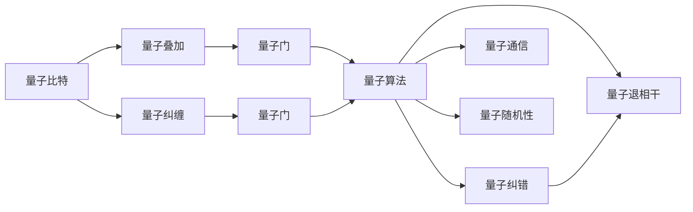

                 

# 计算：第四部分 计算的极限 第 10 章 量子计算 量子计算的启蒙

## 1. 背景介绍

### 1.1 问题由来

量子计算（Quantum Computing）作为计算领域的一大前沿技术，正逐渐从理论走向实践。它利用量子力学的奇特性质，特别是量子叠加与量子纠缠，对传统计算范式提出了颠覆性的挑战。本文将深入探讨量子计算的原理、应用及其前景，为读者揭开量子计算的神秘面纱，初步掌握量子计算的基础知识。

### 1.2 问题核心关键点

量子计算的核心在于利用量子力学原理，通过量子比特（qubit）的叠加态和纠缠态，实现计算能力的指数级提升。但相较于经典计算机，量子计算在可控性、纠错性及应用范围上仍存在诸多挑战。本文将聚焦于量子计算的核心理论及其在实践中的关键技术突破。

### 1.3 问题研究意义

量子计算的研究对于推动计算机科学的发展、破解复杂密码、加速化学反应模拟等领域具有重要意义。它有望为人类解锁新的计算能力，开启计算领域的全新纪元。深入理解量子计算原理与应用，将有助于研发出高效、安全的量子计算算法，加速计算技术的产业化进程。

## 2. 核心概念与联系

### 2.1 核心概念概述

1. **量子比特（qubit）**：量子计算的基本单位，能够同时表示0和1。与经典比特不同，量子比特通过叠加和纠缠，可以表现出更复杂的状态。

2. **量子叠加（Superposition）**：量子比特同时处于0和1的状态，量子计算正是利用这一特性，进行大规模并行计算。

3. **量子纠缠（Entanglement）**：两个或多个量子比特之间的关联，即使相隔很远，其状态变化仍会瞬间影响对方。

4. **量子门（Quantum Gates）**：量子计算的基本操作单元，类似于经典计算机的逻辑门，但操作的是量子比特。

5. **量子算法（Quantum Algorithms）**：基于量子力学的算法，如量子随机行走、Shor算法、Grover算法等，能够实现高效的计算。

6. **量子纠错（Quantum Error Correction）**：量子计算对环境非常敏感，量子纠错技术用于检测和修正量子比特的错误。

7. **量子退相干（Decoherence）**：量子计算中最常见的挑战之一，量子系统与环境交互导致量子态的丢失。

8. **量子通信（Quantum Communication）**：利用量子纠缠实现信息的安全传输，抗干扰性强。

9. **量子随机性（Quantum Randomness）**：量子比特的状态具有固有的随机性，可用于生成安全的随机数。

这些核心概念构成了量子计算的基础，它们之间通过量子门、量子算法等机制紧密联系，共同驱动着量子计算的发展。

### 2.2 概念间的关系

以下通过几个Mermaid流程图来展示量子计算中这些核心概念的关系：



这些概念之间通过量子门、量子算法等机制紧密联系，共同驱动着量子计算的发展。

## 3. 核心算法原理 & 具体操作步骤

### 3.1 算法原理概述

量子计算的核心在于通过量子叠加和量子纠缠，进行大规模并行计算。其基本原理如下：

1. **量子叠加**：量子比特可以同时处于0和1的叠加态，允许量子计算在单个步骤中进行多路计算，从而提升计算效率。
   
2. **量子纠缠**：多个量子比特可以形成纠缠态，其中一个量子比特的状态将即时影响另一个，使得量子计算具有全局关联性，提高了计算的并行度。

3. **量子门操作**：量子门是量子计算的基本操作单元，通过量子门可以执行逻辑门、可逆门等操作，改变量子比特的状态。

4. **量子算法设计**：量子算法如Shor算法和Grover算法，利用量子叠加和量子纠缠的特性，能够在某些问题上表现出超越经典计算机的效率。

### 3.2 算法步骤详解

以下详细讲解量子计算的基本步骤：

1. **初始化量子比特**：将量子比特置于已知的状态（通常是|0>或|1>），通过量子门对其进行初始化。

2. **叠加态准备**：通过量子门（如Hadamard门），将量子比特置于叠加态，即|ψ> = a|0> + b|1>，其中a和b为复数，满足|a|^2 + |b|^2 = 1。

3. **量子门操作**：应用一系列量子门，如量子叠加门、量子纠缠门等，对量子比特进行逻辑操作，使其进入特定的叠加态或纠缠态。

4. **量子测量**：对量子比特进行测量，将其从叠加态塌缩为特定的状态0或1，并输出测量结果。

5. **重复操作**：通过多次重复上述步骤，可以极大提升量子计算的效率。

### 3.3 算法优缺点

量子计算具有以下优点：

- **并行计算**：通过量子叠加，量子计算可以实现大规模并行计算，解决某些特定问题时效率显著高于经典计算。

- **高效算法**：一些量子算法（如Shor算法、Grover算法）能够在某些问题上表现出超越经典计算机的效率。

量子计算同时存在以下缺点：

- **环境敏感性**：量子系统对环境极为敏感，量子退相干和噪声干扰是当前最大的挑战。

- **可控性差**：量子比特的控制和测量难度大，需要进行复杂的技术处理。

- **算法复杂性高**：量子算法设计复杂，需要专业的知识和技能。

### 3.4 算法应用领域

量子计算具有广阔的应用前景，主要集中在以下几个领域：

- **密码破解**：利用Shor算法破解RSA加密算法，具有潜在的安全威胁。

- **优化问题**：如旅行商问题（TSP）、组合优化问题等，能够通过量子算法快速求解。

- **药物设计**：通过量子计算模拟化学反应，加速新药物的研发。

- **金融模型**：量子计算可以加速金融模型的计算，提高金融分析的效率。

- **材料科学**：利用量子计算模拟分子结构，优化材料设计。

- **人工智能**：量子计算可以加速神经网络的训练和优化，提升AI算法的效率。

## 4. 数学模型和公式 & 详细讲解 & 举例说明

### 4.1 数学模型构建

量子计算的核心数学模型基于量子力学的基本原理，主要涉及量子比特的叠加态和纠缠态，以及量子门操作。以下构建量子计算的基本数学模型：

1. **量子比特状态**：一个量子比特可以用复数表示，即|ψ> = a|0> + b|1>，其中a和b为复数，满足|a|^2 + |b|^2 = 1。

2. **叠加态**：一个量子系统可以处于多个状态的叠加态，即|ψ> = Σ|ψ_i>p_i，其中p_i为概率幅，满足∑|p_i|^2 = 1。

3. **量子门**：量子门是对量子比特进行操作的线性变换，可以用酉矩阵表示。如Hadamard门表示为：

   $$
   H = \frac{1}{\sqrt{2}}\begin{pmatrix}
   1 & 1 \\
   1 & -1
   \end{pmatrix}
   $$

4. **量子算法**：以Shor算法为例，通过量子叠加和量子纠缠，在质因数分解问题上表现出高效性。

### 4.2 公式推导过程

1. **Hadamard门操作**：
   $$
   H|0> = \frac{1}{\sqrt{2}}(|0> + |1>) \\
   H|1> = \frac{1}{\sqrt{2}}(|0> - |1>)
   $$

2. **量子叠加**：
   $$
   \frac{1}{\sqrt{2}}(|0> + |1>) \rightarrow a|0> + b|1>
   $$

3. **量子纠缠**：
   $$
   \frac{1}{\sqrt{2}}(|00> + |11>) \rightarrow |00> \\
   \frac{1}{\sqrt{2}}(|01> + |10>) \rightarrow |01> \\
   $$

4. **量子测量**：
   $$
   |ψ> = a|0> + b|1> \rightarrow |ψ'> = 0 \text{ 或 } 1 \text{ 以概率|a|^2 或 } |b|^2
   $$

### 4.3 案例分析与讲解

以Shor算法为例，讲解量子计算在质因数分解问题上的高效性：

1. **算法步骤**：
   - 输入一个大整数n，找到其因数分解。
   - 将n表示为量子比特，利用量子叠加和量子纠缠，计算其质因数。
   - 测量结果，输出质因数。

2. **计算效率**：
   - 经典算法需要指数级时间复杂度，量子算法只需要多项式级时间复杂度。

3. **实际应用**：
   - 量子计算机能够快速破解RSA加密算法，对现代加密技术构成威胁。

## 5. 项目实践：代码实例和详细解释说明

### 5.1 开发环境搭建

1. **安装量子计算框架**：
   ```bash
   pip install qiskit
   ```

2. **创建量子计算环境**：
   ```python
   from qiskit import QuantumCircuit, Aer
   from qiskit.visualization import plot_bloch_multivector, plot_histogram
   ```

### 5.2 源代码详细实现

以下是一个简单的量子计算代码实现，用于演示Hadamard门和量子叠加：

```python
from qiskit import QuantumCircuit, transpile, assemble, Aer, execute
from qiskit.visualization import plot_histogram

# 创建量子电路
qc = QuantumCircuit(1, 1)

# 添加Hadamard门
qc.h(0)

# 添加测量操作
qc.measure(0, 0)

# 执行模拟
sim = Aer.get_backend('qasm_simulator')
qobj = assemble(qc)
counts = execute(qobj, sim).result().get_counts()

# 输出测量结果
print(counts)
```

### 5.3 代码解读与分析

1. **量子电路创建**：使用`QuantumCircuit`类创建量子电路。

2. **Hadamard门操作**：使用`qc.h(0)`添加Hadamard门，将量子比特置于叠加态。

3. **测量操作**：使用`qc.measure(0, 0)`添加测量操作，输出叠加态的结果。

4. **模拟执行**：使用`Aer.get_backend('qasm_simulator')`创建模拟环境，`assemble(qc)`将量子电路转换为可执行对象，`execute(qobj, sim)`执行模拟并返回结果。

5. **结果输出**：`execute(qobj, sim).result().get_counts()`获取模拟结果，`counts`为测量结果的概率分布。

## 6. 实际应用场景

### 6.1 量子密码学

量子密码学是量子计算的一个重要应用领域。量子密钥分发（QKD）利用量子纠缠和量子不可克隆定理，实现了绝对安全的密钥分发。量子随机数生成器可以生成安全的随机数，应用于密码学和金融领域。

### 6.2 量子机器学习

量子计算在机器学习中也有广泛应用。量子支持向量机（QSVM）和量子深度学习（QDL）等算法，通过量子计算加速经典机器学习算法，实现高效的特征提取和模式识别。

### 6.3 量子优化

量子计算在优化问题中表现出显著优势。量子退火（Quantum Annealing）和量子近似优化算法（QAOA）等，可以高效求解组合优化、路径规划等问题。

### 6.4 未来应用展望

未来，量子计算有望在以下几个方面取得突破：

1. **大规模量子计算机**：量子比特数量不断增加，计算能力大幅提升。

2. **量子纠错技术**：量子纠错算法不断改进，提升量子计算的稳定性和可靠性。

3. **量子互联网**：量子通信技术不断成熟，实现量子互联网，实现全球安全通信。

4. **量子芯片设计**：量子芯片设计不断优化，实现高效、稳定的量子计算。

5. **量子算法优化**：量子算法不断优化，提升量子计算的应用范围和效率。

## 7. 工具和资源推荐

### 7.1 学习资源推荐

1. **量子计算入门书籍**：《量子计算入门》，讲授量子计算的基本概念和原理。

2. **量子计算在线课程**：Coursera上的量子计算课程，系统学习量子计算的理论和实践。

3. **量子计算实验室**：IBM的量子计算实验室，提供免费的量子计算实验环境。

4. **量子计算社区**：量子计算社区，汇集全球量子计算领域的专家和爱好者。

### 7.2 开发工具推荐

1. **Qiskit**：IBM提供的量子计算框架，支持Python编程。

2. **Google Cirq**：谷歌的量子计算框架，提供丰富的量子门操作和算法。

3. **Microsoft Quantum Development Kit**：微软的量子计算框架，支持C#和Python编程。

4. **Rigetti**：Rigetti的量子计算框架，支持Python和Python-based语言。

### 7.3 相关论文推荐

1. **Shor算法**：Peter Shor，《Algorithms for Quantum Computation: Discrete Logarithms and Factoring》，Applied Physics B: Lasers & Optics。

2. **Grover算法**：Lov Grover，《A fast quantum mechanical algorithm for database search》，Proceedings of the 28th Annual ACM Symposium on the Theory of Computing。

3. **量子纠错**：E. Knill，《Quantum computing with quantum error correction》，Science。

4. **量子通信**：Charles Bennett，《Quantum Cryptography: Public Key Distribution and Coin Tossing》，IEEE Transactions on Information Theory。

## 8. 总结：未来发展趋势与挑战

### 8.1 研究成果总结

量子计算的研究已经取得了显著进展，但仍面临诸多挑战。主要成果包括：

- 量子比特的制造和控制技术不断改进，量子计算的稳定性提高。

- 量子算法设计不断优化，量子计算的应用范围扩大。

- 量子纠错算法不断改进，量子计算的鲁棒性增强。

### 8.2 未来发展趋势

未来，量子计算的发展趋势如下：

1. **量子比特数量增加**：量子计算硬件不断优化，量子比特数量大幅增加。

2. **量子纠错技术完善**：量子纠错算法不断改进，量子计算的稳定性提升。

3. **量子算法优化**：量子算法不断优化，量子计算的应用范围扩大。

4. **量子通信技术成熟**：量子通信技术不断成熟，实现全球安全通信。

5. **量子互联网普及**：量子互联网普及，实现全球安全通信。

### 8.3 面临的挑战

量子计算面临的挑战如下：

1. **环境干扰**：量子计算对环境极为敏感，噪声干扰是主要挑战。

2. **可控性差**：量子比特的控制和测量难度大。

3. **算法复杂性高**：量子算法设计复杂，需要专业的知识和技能。

4. **量子纠错难度大**：量子纠错算法复杂，实现难度大。

5. **大规模量子计算机实现难**：大规模量子计算机的制造和控制难度大。

### 8.4 研究展望

未来量子计算的研究方向如下：

1. **量子算法优化**：优化量子算法，提升量子计算的效率。

2. **量子纠错技术**：改进量子纠错算法，提升量子计算的稳定性。

3. **量子通信技术**：提升量子通信技术的稳定性和安全性。

4. **量子硬件优化**：优化量子比特的制造和控制技术，实现高效的量子计算。

## 9. 附录：常见问题与解答

**Q1: 量子计算与经典计算有何区别？**

A: 量子计算利用量子比特的叠加态和纠缠态，实现大规模并行计算，计算能力超越经典计算机。

**Q2: 量子计算的优势和劣势是什么？**

A: 量子计算的优势在于并行计算能力强，高效求解特定问题。劣势在于环境敏感性高，可控性和纠错性差。

**Q3: 量子计算如何应用于实际问题？**

A: 量子计算可以应用于密码破解、优化问题、量子模拟等领域，需要结合具体问题进行算法设计。

**Q4: 当前量子计算的研究现状如何？**

A: 量子计算已经取得显著进展，量子比特数量增加，量子算法不断优化，但大规模量子计算机的制造和控制仍面临挑战。

**Q5: 量子计算的未来前景如何？**

A: 量子计算具有广阔的应用前景，但需要解决环境干扰、可控性差等技术挑战。未来有望在密码学、机器学习、优化问题等领域取得重大突破。

---

作者：禅与计算机程序设计艺术 / Zen and the Art of Computer Programming

