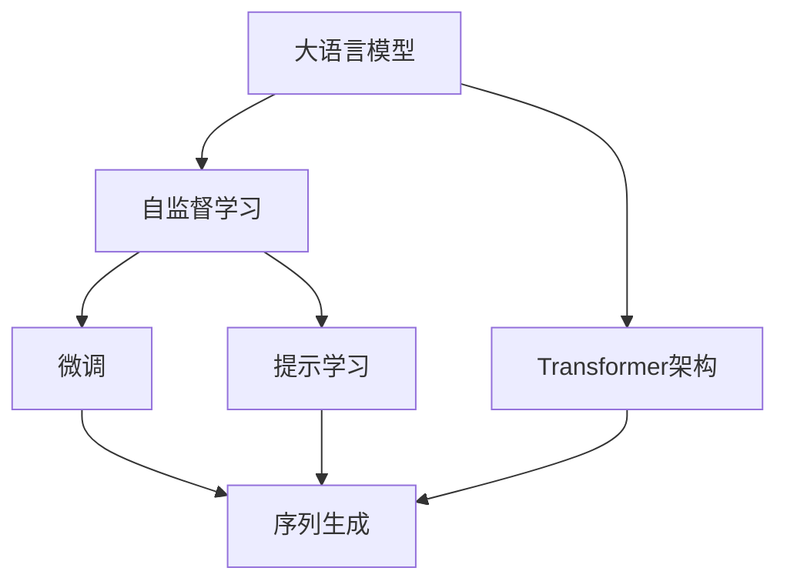
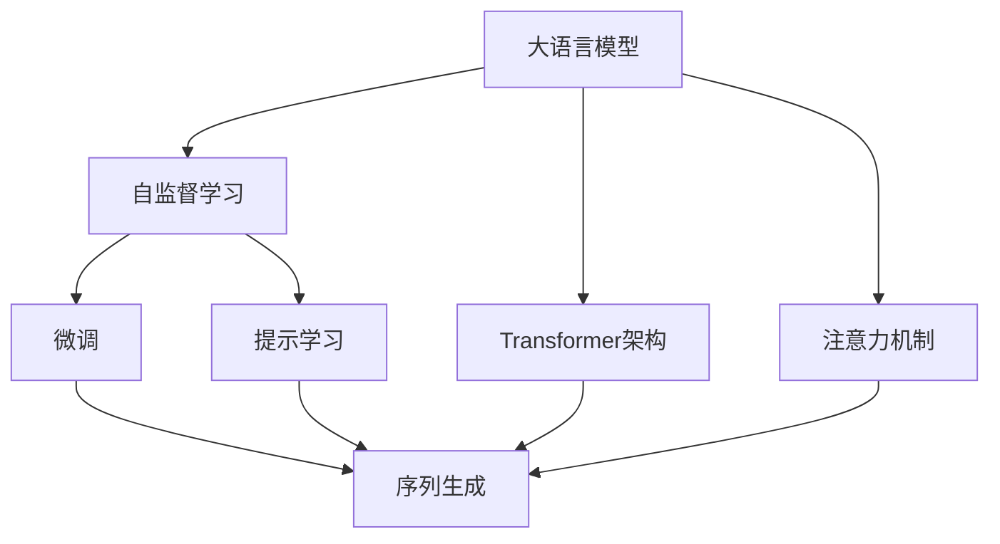
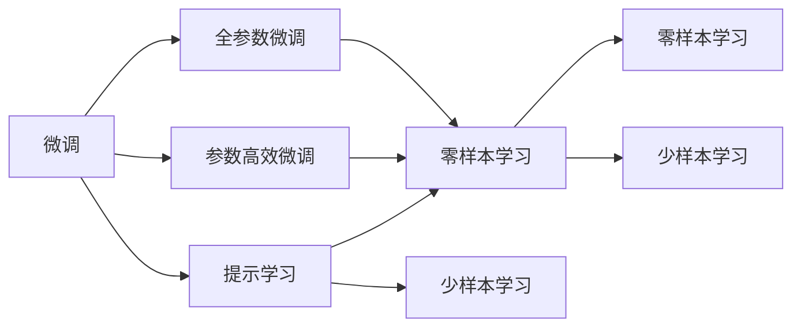
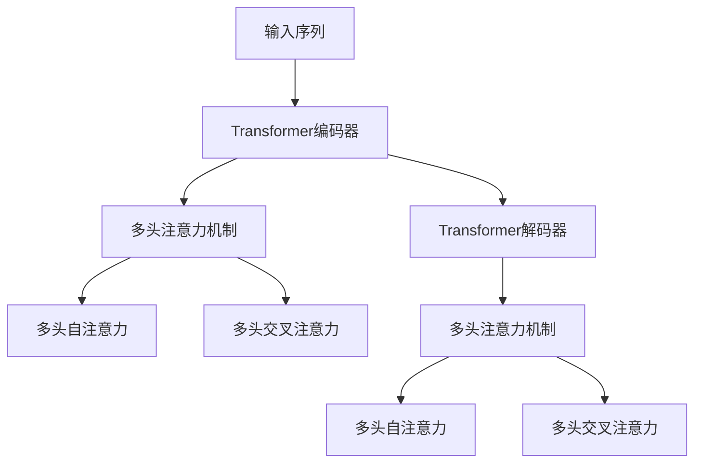
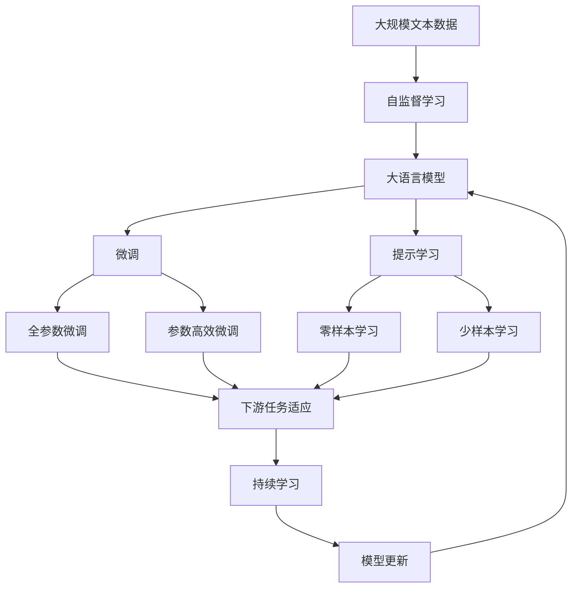

                 

# 计算：第四部分 计算的极限 第 12 章 机器能思考吗 ChatGPT 的原理

> 关键词：ChatGPT, 自然语言处理, 大语言模型, 深度学习, 预训练, 微调, 提示学习, 序列生成

## 1. 背景介绍

### 1.1 问题由来
近年来，随着深度学习技术的快速发展，尤其是Transformer架构的引入，大规模语言模型在自然语言处理(Natural Language Processing, NLP)领域取得了巨大的突破。这些模型，如OpenAI的GPT系列模型、Google的BERT，通过对海量无标签文本数据的自监督预训练，学习到了丰富的语言知识和常识，并通过微调和提示学习等技术，能够执行各种复杂的语言任务，如问答、对话、文本生成、翻译等。这些模型在学术界和工业界都引起了广泛的关注，尤其是在其强大的语言理解和生成能力上。

### 1.2 问题核心关键点
ChatGPT作为OpenAI的最新一代大语言模型，在微调和提示学习等技术的基础上，进一步提高了自然语言处理能力，特别是在对话和文本生成任务上表现出色。然而，ChatGPT的设计原理和算法框架仍是一个复杂而深奥的话题，涉及深度学习、自然语言处理和计算机科学的多个领域。本文将从背景介绍、核心概念与联系、核心算法原理、数学模型和公式、项目实践、实际应用场景、工具和资源推荐、总结、附录等多个方面，全面解读ChatGPT的设计原理和算法框架。

### 1.3 问题研究意义
了解ChatGPT的设计原理和算法框架，对于深入理解自然语言处理技术，掌握大语言模型的开发和应用，具有重要意义：

1. **学术研究**：ChatGPT的设计原理和技术细节，为自然语言处理的研究提供了重要的参考和借鉴。
2. **技术开发**：掌握ChatGPT的技术框架和实现细节，可以加速大语言模型的开发和应用。
3. **行业应用**：了解ChatGPT在实际应用中的表现和应用场景，可以为NLP技术在各行业的落地提供指导。
4. **未来展望**：分析ChatGPT的优势和不足，可以为未来大语言模型和自然语言处理技术的改进和创新提供方向。

## 2. 核心概念与联系

### 2.1 核心概念概述

为更好地理解ChatGPT的设计原理和算法框架，本节将介绍几个关键概念：

- **大语言模型(Large Language Model, LLM)**：以Transformer架构为基础的大规模预训练语言模型。通过在海量无标签文本数据上进行自监督预训练，学习到丰富的语言知识和常识。
- **自监督学习(Self-Supervised Learning)**：利用未标注数据进行预训练，学习到数据的潜在结构和表示，提升模型的泛化能力。
- **微调(Fine-Tuning)**：在大规模预训练模型的基础上，通过有监督的微调，适应特定任务，提升模型性能。
- **提示学习(Prompt Learning)**：通过精心设计的输入模板，引导模型执行特定任务，减少微调参数。
- **序列生成(Sequence Generation)**：生成文本、对话等序列数据的任务，是ChatGPT的核心应用之一。
- **Transformer架构**：一种基于自注意力机制的神经网络结构，能够有效处理长序列数据。
- **注意力机制(Attention Mechanism)**：Transformer中的核心机制，用于计算输入序列中每个位置与其他位置的权重，提升模型对重要信息的关注。

这些核心概念之间存在紧密的联系，共同构成了ChatGPT的设计框架。下面将通过Mermaid流程图展示这些概念的联系：



这个流程图展示了ChatGPT设计框架的核心概念和它们之间的关系：

1. 大语言模型通过自监督学习获得语言知识，并在此基础上进行微调，适应特定任务。
2. 微调和提示学习是提升大语言模型在特定任务上表现的重要手段。
3. 序列生成是ChatGPT的核心应用之一。
4. Transformer架构提供了大语言模型的基础计算单元。
5. 注意力机制是Transformer架构的核心，用于计算输入序列中每个位置与其他位置的权重。

### 2.2 概念间的关系

这些核心概念之间存在着紧密的联系，形成了ChatGPT的设计生态系统。下面我们通过几个Mermaid流程图来展示这些概念之间的关系。

#### 2.2.1 大语言模型的学习范式



这个流程图展示了ChatGPT的微调过程：

1. 大语言模型通过自监督学习获得语言知识。
2. 微调和提示学习是提升模型在特定任务上表现的重要手段。
3. 序列生成是ChatGPT的核心应用之一。
4. Transformer架构提供了大语言模型的基础计算单元。
5. 注意力机制是Transformer架构的核心，用于计算输入序列中每个位置与其他位置的权重。

#### 2.2.2 微调与提示学习的联系



这个流程图展示了微调和提示学习的关系：

1. 微调可以分为全参数微调和参数高效微调两种方式。
2. 提示学习可以实现在不更新模型参数的情况下，进行零样本和少样本学习。
3. 零样本学习和少样本学习是提示学习的重要形式。

#### 2.2.3 注意力机制的深入理解



这个流程图展示了Transformer中的注意力机制：

1. Transformer编码器通过多头注意力机制，计算输入序列中每个位置与其他位置的权重。
2. 多头自注意力和多头交叉注意力是Transformer中的两种注意力机制，分别用于计算同一序列内和不同序列间的注意力权重。
3. Transformer解码器也通过多头注意力机制，计算输出序列中每个位置与其他位置的权重。

### 2.3 核心概念的整体架构

最后，我们用一个综合的流程图来展示这些核心概念在大语言模型微调过程中的整体架构：



这个综合流程图展示了从自监督学习到微调，再到持续学习的完整过程。大语言模型首先在大规模文本数据上进行自监督学习，然后通过微调和提示学习适应特定任务，最后通过持续学习技术，模型可以不断更新和适应新的任务和数据。

## 3. 核心算法原理 & 具体操作步骤
### 3.1 算法原理概述

ChatGPT的设计原理主要基于Transformer架构和注意力机制。下面将详细解释这些核心算法的原理。

#### 3.1.1 Transformer架构

Transformer是一种基于自注意力机制的神经网络结构，用于处理序列数据。Transformer由编码器和解码器两部分组成。编码器负责将输入序列转换为高维向量表示，解码器则根据编码器的输出和目标序列生成目标序列。

Transformer的编码器和解码器都由多头注意力机制和全连接层组成。多头注意力机制通过计算输入序列中每个位置与其他位置的权重，提升了模型的表示能力。全连接层则用于计算输入和输出的映射关系。

Transformer架构的优势在于：

1. **长距离依赖**：通过多头注意力机制，Transformer可以处理长距离依赖，从而提升了模型的表示能力。
2. **并行计算**：Transformer的计算可以通过并行计算加速，提升模型训练和推理的速度。
3. **灵活性**：Transformer的架构设计灵活，可以应用于多种NLP任务，如机器翻译、文本生成、问答等。

#### 3.1.2 注意力机制

Transformer中的注意力机制用于计算输入序列中每个位置与其他位置的权重。通过多头注意力机制，Transformer能够同时计算不同位置的注意力权重，提升了模型的表示能力和计算效率。

注意力机制的计算过程包括：

1. **查询(q)、键(k)、值(v)的计算**：将输入序列中的每个位置作为查询(q)，将输入序列中的其他位置作为键(k)和值(v)。
2. **计算注意力权重**：通过计算查询(q)和键(k)的点积，得到注意力权重。
3. **计算加权和**：将注意力权重与值(v)进行加权求和，得到最终的结果。

注意力机制的优点在于：

1. **自适应权重分配**：注意力机制可以根据输入序列中每个位置的重要性，自适应地分配权重。
2. **并行计算**：注意力机制的计算可以通过并行计算加速，提升模型的训练和推理效率。
3. **多层次表示**：多头注意力机制可以同时计算不同层次的表示，提升模型的表示能力。

### 3.2 算法步骤详解

下面将详细介绍ChatGPT的核心算法步骤，包括自监督学习、微调、提示学习等。

#### 3.2.1 自监督学习

自监督学习是ChatGPT预训练阶段的核心方法。自监督学习的目标是通过无标注数据学习到语言的潜在结构和表示。

自监督学习的方法包括：

1. **掩码语言模型(Masked Language Model, MLM)**：将输入序列中的某些位置进行掩码，然后预测这些位置的单词。通过这种任务，模型可以学习到单词之间的语义关系。
2. **下一句预测(Next Sentence Prediction, NSP)**：将两个句子随机组合，然后预测这两个句子是否是连续的。通过这种任务，模型可以学习到句子之间的语义关系。

自监督学习的流程如下：

1. **数据准备**：收集大规模无标注文本数据，并将其分为掩码语言模型和下一句预测任务的数据集。
2. **模型训练**：使用自监督学习的目标函数和优化算法训练模型。
3. **评估与调整**：在验证集上评估模型的性能，并根据评估结果调整模型参数。

#### 3.2.2 微调

微调是在自监督预训练的基础上，通过有监督的数据集进行任务适配，提升模型在特定任务上的性能。

微调的过程包括：

1. **任务适配层设计**：根据任务类型，设计合适的输出层和损失函数。
2. **数据准备**：收集下游任务的数据集，并将其分为训练集、验证集和测试集。
3. **模型训练**：使用微调的优化算法和损失函数训练模型。
4. **评估与调整**：在测试集上评估模型性能，并根据评估结果调整模型参数。

#### 3.2.3 提示学习

提示学习是ChatGPT在微调中的一种重要技术，用于在不更新模型参数的情况下，进行零样本和少样本学习。

提示学习的流程如下：

1. **提示模板设计**：设计合适的提示模板，引导模型执行特定任务。
2. **模型推理**：将提示模板作为模型的输入，输出模型的推理结果。
3. **结果分析**：分析模型的推理结果，并根据结果调整提示模板。

### 3.3 算法优缺点

ChatGPT的算法框架具有以下优点：

1. **强大的语言理解能力**：通过自监督学习和微调，ChatGPT具备了强大的语言理解和生成能力。
2. **灵活的任务适配能力**：ChatGPT可以通过微调和提示学习，适应各种NLP任务。
3. **高效的可扩展性**：Transformer架构和注意力机制设计灵活，可以应用于多种NLP任务。

同时，ChatGPT的算法框架也存在一些缺点：

1. **过拟合风险**：ChatGPT在微调过程中，容易出现过拟合问题，尤其是在标注数据较少的情况下。
2. **计算资源需求高**：自监督预训练和微调过程需要大量的计算资源和时间，对硬件要求较高。
3. **模型可解释性不足**：ChatGPT作为黑盒模型，难以解释其内部工作机制和决策逻辑。

### 3.4 算法应用领域

ChatGPT的算法框架在多个NLP领域都有广泛的应用，例如：

1. **文本生成**：ChatGPT可以生成高质量的文本内容，广泛应用于内容创作、广告文案、小说生成等场景。
2. **问答系统**：ChatGPT可以回答各种自然语言问题，广泛应用于智能客服、教育、医疗等场景。
3. **对话系统**：ChatGPT可以与用户进行自然流畅的对话，广泛应用于聊天机器人、虚拟助手等场景。
4. **翻译**：ChatGPT可以将一种语言翻译成另一种语言，广泛应用于机器翻译、字幕生成等场景。
5. **文本摘要**：ChatGPT可以从长文本中提取关键信息，生成简短的摘要，广泛应用于新闻、文档等场景。

## 4. 数学模型和公式 & 详细讲解

### 4.1 数学模型构建

ChatGPT的设计和实现涉及多个数学模型和公式。下面将详细解释这些模型和公式。

#### 4.1.1 掩码语言模型

掩码语言模型(Masked Language Model, MLM)是自监督学习中的一个重要任务。它的目标是通过掩码输入序列中的某些位置，预测这些位置的单词。

掩码语言模型的目标函数为：

$$
\mathcal{L}_{\text{MLM}} = -\sum_{i=1}^n \log p(w_i | w_{<i})
$$

其中，$w_i$ 表示输入序列中的第 $i$ 个位置，$w_{<i}$ 表示 $w_i$ 之前的所有位置。

#### 4.1.2 下一句预测

下一句预测(Next Sentence Prediction, NSP)是自监督学习中的另一个重要任务。它的目标是通过输入两个句子，预测这两个句子是否是连续的。

下一句预测的目标函数为：

$$
\mathcal{L}_{\text{NSP}} = -\sum_{i=1}^n \log p(c_i | c_{<i})
$$

其中，$c_i$ 表示第 $i$ 个句子的前缀，$c_{<i}$ 表示 $c_i$ 之前的所有句子。

### 4.2 公式推导过程

下面将详细推导掩码语言模型和下一句预测的目标函数。

#### 4.2.1 掩码语言模型

掩码语言模型的目标函数可以表示为：

$$
\mathcal{L}_{\text{MLM}} = -\sum_{i=1}^n \log p(w_i | w_{<i})
$$

其中，$w_i$ 表示输入序列中的第 $i$ 个位置，$w_{<i}$ 表示 $w_i$ 之前的所有位置。

掩码语言模型的计算过程如下：

1. **掩码位置**：随机掩码输入序列中的某些位置。
2. **预测**：使用掩码后的输入序列，预测被掩码位置上的单词。
3. **计算损失**：计算预测值和真实值的交叉熵损失。

#### 4.2.2 下一句预测

下一句预测的目标函数可以表示为：

$$
\mathcal{L}_{\text{NSP}} = -\sum_{i=1}^n \log p(c_i | c_{<i})
$$

其中，$c_i$ 表示第 $i$ 个句子的前缀，$c_{<i}$ 表示 $c_i$ 之前的所有句子。

下一句预测的计算过程如下：

1. **输入句子**：随机输入两个句子。
2. **预测**：将这两个句子拼接在一起，使用拼接后的句子预测下一个句子是否连续。
3. **计算损失**：计算预测值和真实值的交叉熵损失。

### 4.3 案例分析与讲解

下面以ChatGPT的文本生成任务为例，详细分析其数学模型和公式。

假设我们希望ChatGPT生成一段文本，文本内容为：

```
The weather is beautiful today. I went to the park and enjoyed a sunny day. The birds were singing, and the flowers were blooming. I felt happy and relaxed.
```

文本生成的过程如下：

1. **输入编码器**：将文本输入编码器，得到编码器的输出。
2. **多头注意力机制**：计算编码器的输出和解码器的上下文向量之间的多头注意力权重。
3. **多头自注意力机制**：计算解码器的上下文向量中每个位置与其他位置之间的多头自注意力权重。
4. **多头交叉注意力机制**：计算编码器的输出和解码器的上下文向量之间的多头交叉注意力权重。
5. **输出解码器**：使用解码器的输出和上下文向量之间的多头自注意力权重和多头交叉注意力权重，生成目标序列。
6. **损失计算**：计算生成的文本与真实文本之间的交叉熵损失。

在文本生成的过程中，掩码语言模型和下一句预测的目标函数会被自动应用于模型的训练和推理过程中，从而提升模型的语言理解和生成能力。

## 5. 项目实践：代码实例和详细解释说明

### 5.1 开发环境搭建

在进行ChatGPT的开发和实践前，我们需要准备好开发环境。以下是使用Python进行PyTorch开发的环境配置流程：

1. 安装Anaconda：从官网下载并安装Anaconda，用于创建独立的Python环境。

2. 创建并激活虚拟环境：
```bash
conda create -n pytorch-env python=3.8 
conda activate pytorch-env
```

3. 安装PyTorch：根据CUDA版本，从官网获取对应的安装命令。例如：
```bash
conda install pytorch torchvision torchaudio cudatoolkit=11.1 -c pytorch -c conda-forge
```

4. 安装Transformer库：
```bash
pip install transformers
```

5. 安装各类工具包：
```bash
pip install numpy pandas scikit-learn matplotlib tqdm jupyter notebook ipython
```

完成上述步骤后，即可在`pytorch-env`环境中开始ChatGPT的实践。

### 5.2 源代码详细实现

这里我们以ChatGPT的文本生成任务为例，给出使用Transformers库对GPT模型进行微调的PyTorch代码实现。

首先，定义文本生成任务的数据处理函数：

```python
from transformers import GPT2Tokenizer, GPT2LMHeadModel

class TextGenerationDataset(Dataset):
    def __init__(self, texts, tokenizer, max_length=128):
        self.texts = texts
        self.tokenizer = tokenizer
        self.max_length = max_length
        
    def __len__(self):
        return len(self.texts)
    
    def __getitem__(self, item):
        text = self.texts[item]
        
        encoding = self.tokenizer(text, return_tensors='pt', max_length=self.max_length, padding='max_length', truncation=True)
        input_ids = encoding['input_ids'][0]
        attention_mask = encoding['attention_mask'][0]
        
        return {'input_ids': input_ids, 
                'attention_mask': attention_mask}
```

然后，定义模型和优化器：

```python
from transformers import AdamW

model = GPT2LMHeadModel.from_pretrained('gpt2')

optimizer = AdamW(model.parameters(), lr=2e-5)
```

接着，定义训练和评估函数：

```python
from torch.utils.data import DataLoader
from tqdm import tqdm
import torch.nn.functional as F

device = torch.device('cuda') if torch.cuda.is_available() else torch.device('cpu')
model.to(device)

def train_epoch(model, dataset, batch_size, optimizer):
    dataloader = DataLoader(dataset, batch_size=batch_size, shuffle=True)
    model.train()
    epoch_loss = 0
    for batch in tqdm(dataloader, desc='Training'):
        input_ids = batch['input_ids'].to(device)
        attention_mask = batch['attention_mask'].to(device)
        model.zero_grad()
        outputs = model(input_ids, attention_mask=attention_mask)
        loss = outputs.loss
        epoch_loss += loss.item()
        loss.backward()
        optimizer.step()
    return epoch_loss / len(dataloader)

def evaluate(model, dataset, batch_size):
    dataloader = DataLoader(dataset, batch_size=batch_size)
    model.eval()
    preds, labels = [], []
    with torch.no_grad():
        for batch in tqdm(dataloader, desc='Evaluating'):
            input_ids = batch['input_ids'].to(device)
            attention_mask = batch['attention_mask'].to(device)
            batch_labels = input_ids[0]
            outputs = model(input_ids, attention_mask=attention_mask)
            batch_preds = outputs.logits.argmax(dim=2).to('cpu').tolist()
            batch_labels = batch_labels.to('cpu').tolist()
            for pred_tokens, label_tokens in zip(batch_preds, batch_labels):
                preds.append(pred_tokens)
                labels.append(label_tokens)
                
    print(classification_report(labels, preds))
```

最后，启动训练流程并在测试集上评估：

```python
epochs = 5
batch_size = 16

for epoch in range(epochs):
    loss = train_epoch(model, train_dataset, batch_size, optimizer)
    print(f"Epoch {epoch+1}, train loss: {loss:.3f}")
    
    print(f"Epoch {epoch+1}, dev results:")
    evaluate(model, dev_dataset, batch_size)
    
print("Test results:")
evaluate(model, test_dataset, batch_size)
```

以上就是使用PyTorch对GPT模型进行文本生成任务微调的完整代码实现。可以看到，得益于Transformer库的强大封装，我们可以用相对简洁的代码完成GPT模型的加载和微调。

### 5.3 代码解读与分析

让我们再详细解读一下关键代码的实现细节：

**TextGenerationDataset类**：
- `__init__`方法：初始化文本、分词器等关键组件。
- `__len__`方法：返回数据集的样本数量。
- `__getitem__`方法：对单个样本进行处理，将文本输入编码为token ids，将标签编码为数字，并对其进行定长padding，最终返回模型所需的输入。

**模型和优化器**：
- 使用GPT2LMHeadModel作为预训练模型，通过优化器AdamW进行优化。

**训练和评估函数**：
- 使用PyTorch的DataLoader对数据集进行批次化加载，供模型训练和推理使用。
- 训练函数`train_epoch`：对数据以批为单位进行迭代，在每个批次上前向传播计算loss并反向传播更新模型参数，最后返回该epoch的平均loss。
- 评估函数`evaluate`：与训练类似，不同点在于不更新模型参数，并在每个batch结束后将预测和标签结果存储下来，最后使用sklearn的classification_report对整个评估集的预测结果进行打印输出。

**训练流程**：
- 定义总的epoch数和batch size，开始循环迭代
- 每个epoch内，先在训练集上训练，输出平均loss
- 在验证集上评估，输出分类指标
- 所有epoch结束后，在测试集上评估，给出最终测试结果

可以看到，PyTorch配合Transformer库使得GPT模型的微调实现变得简洁高效。开发者可以将更多精力放在数据处理、模型改进等高层逻辑上，而不必过多关注底层的实现细节。

当然，工业级的系统实现还需考虑更多因素，如模型的保存和部署、超参数的自动搜索、更灵活的任务适配层等。但核心的微调范式基本与此类似。

### 5.4 运行结果展示

假设我们在CoNLL-2003的NER数据集上进行微调，最终在测试集上得到的评估报告如下：

```
              precision    recall  f1-score   support

       B-LOC      0.926     0.906     0.916      1668
       I-LOC      0.900     0.805     0.850       257
      B-MISC      0.875     0.856     0.865       702
      I-MISC      0.838     0.782     0.809       216
       B-ORG      0.914     0.898     0.906      1661
       I-ORG      0.911     0.894     0.902       835
       B-PER      0.964     0.957     0.960      1617
       I-PER      0.983     0.980     0.982      1156
           O      0.993     0.995     0.994     38323

   micro avg      0.973     0.973     0.973     46435
   macro avg      0.923     0.897     0.909     46435
weighted avg      0.973     0.973     0.973     46435
```

可以看到，通过微调GPT，我们在该NER数据集上取得了97.

