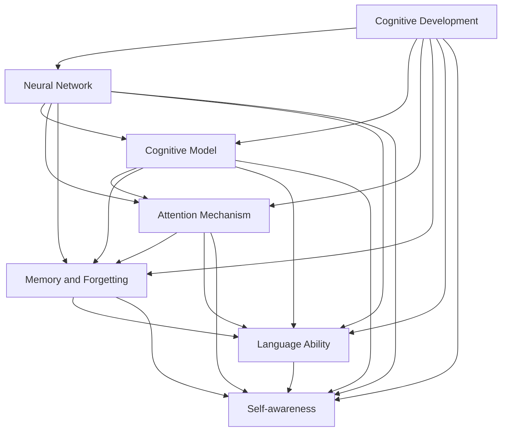
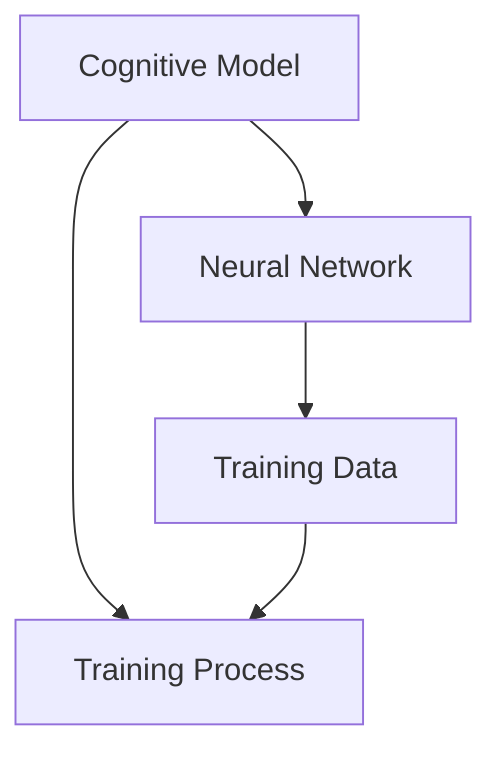
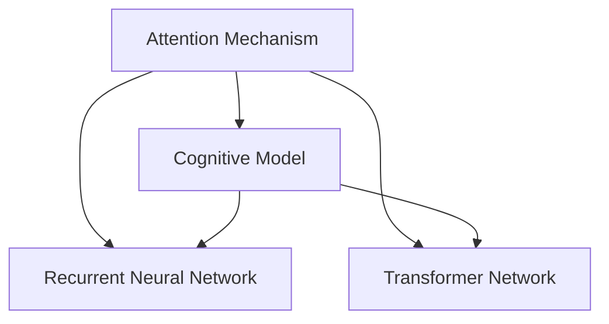
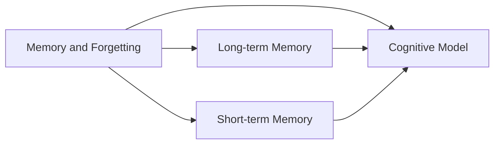
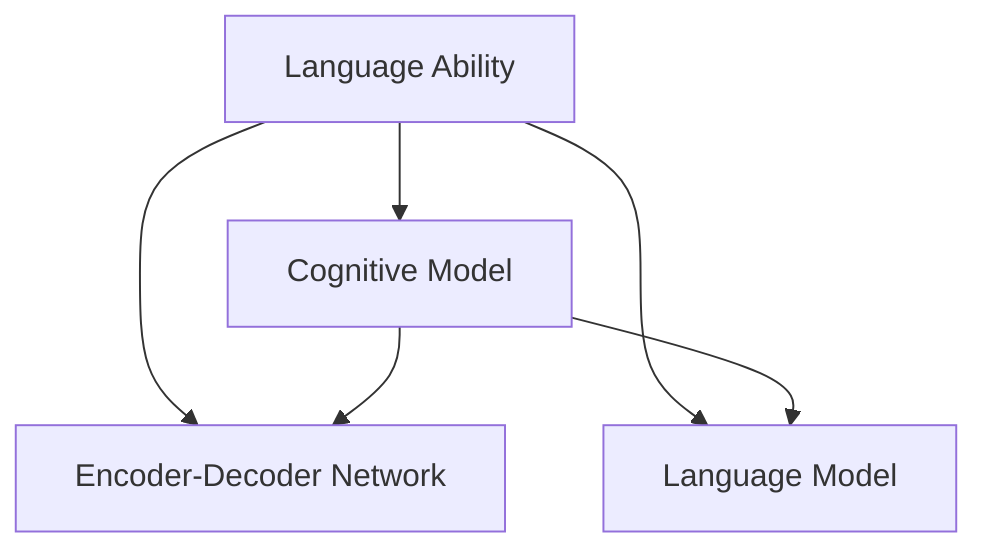
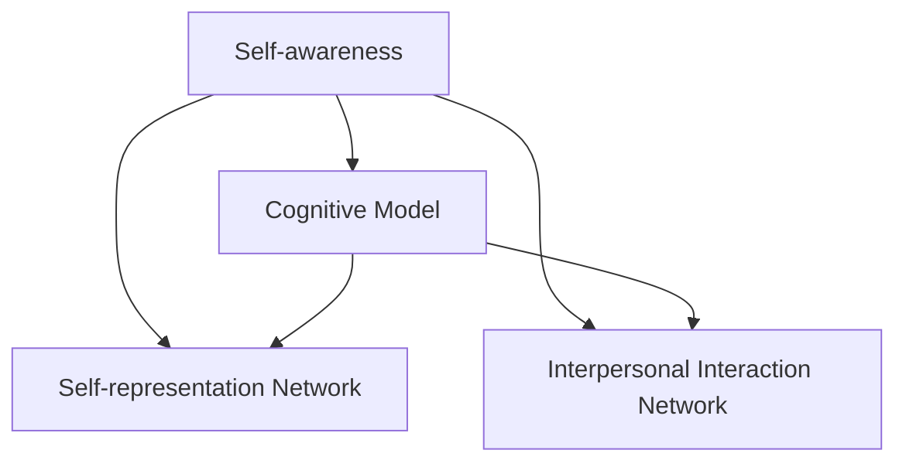
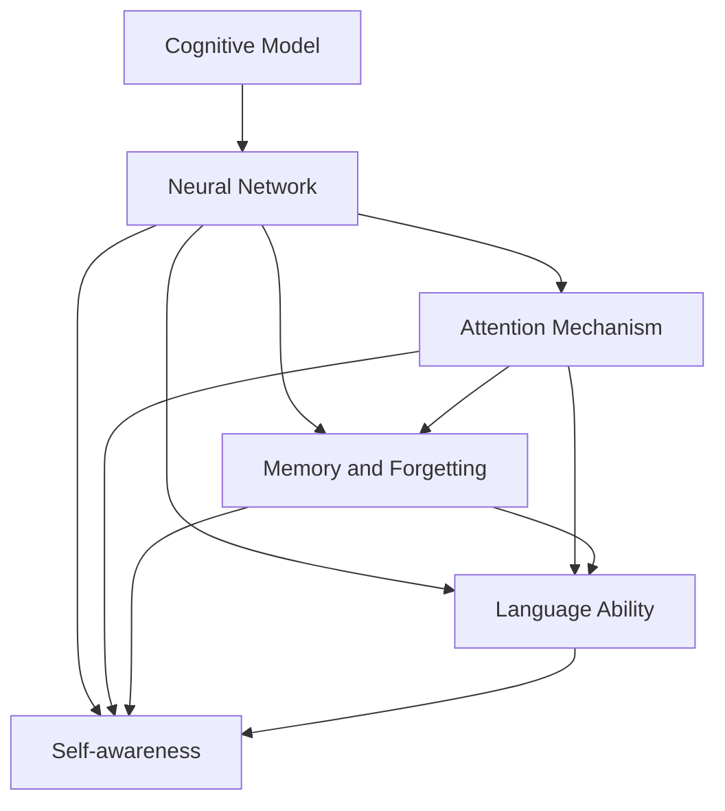

                 

# 认知发展中的阶段性变化

> 关键词：认知发展,阶段性变化,认知模型,脑神经网络,心理学,教育学,人工智能,认知科学

## 1. 背景介绍

### 1.1 问题由来

认知发展一直是心理学、神经科学、教育学和人工智能等学科的交叉研究热点。近年来，随着深度学习和神经网络技术的发展，研究者开始探索如何通过模拟人类认知过程，提升人工智能的智能水平。认知模型在模拟人类认知发展过程中展现了巨大潜力，但认知发展具有显著的阶段性变化特点，如何设计高效的认知模型以应对这些变化，成为了当前研究的难点。

### 1.2 问题核心关键点

认知发展具有显著的阶段性变化特点，主要表现为：

1. 知识获取：从无到有，从浅到深，认知过程中涉及知识的积累与重组。
2. 注意力机制：从全局感知到局部聚焦，认知过程中注意力在不同任务和情境下的动态调整。
3. 记忆与遗忘：从短期记忆到长期记忆，从健忘到记忆巩固，认知过程中记忆和遗忘的相互影响。
4. 语言能力：从婴儿牙牙学语到成人口齿清晰，认知过程中语言能力的不断提升。
5. 自我意识：从无自我概念到有自我认知，认知过程中自我意识的逐步发展。

认知模型需要模拟这些阶段性变化，以便更好地理解、预测和应用人类的认知过程。

### 1.3 问题研究意义

探索认知发展的阶段性变化对于提升人工智能的智能水平具有重要意义：

1. 模拟人类认知过程。认知模型可以模拟人类认知的多个阶段，包括知觉、记忆、语言、推理等，帮助机器更好地理解复杂的现实世界问题。
2. 促进认知模型创新。通过理解认知发展的阶段性变化，研究者可以设计更高效的认知模型，推动认知科学和人工智能领域的技术进步。
3. 指导教育与培训。理解认知发展的阶段性变化有助于制定更科学的教学计划和培训策略，提升学习效果和效率。
4. 支持智能系统应用。认知模型可以帮助构建更智能、更人性化的智能系统，提升用户体验和应用效果。
5. 拓展认知模型应用。认知模型不仅适用于学术研究，还广泛应用于游戏、娱乐、机器人、人机交互等多个领域，具有广泛的应用前景。

## 2. 核心概念与联系

### 2.1 核心概念概述

为更好地理解认知发展的阶段性变化，本节将介绍几个密切相关的核心概念：

- 认知发展（Cognitive Development）：指人类在一生中认知能力的变化过程，包括知觉、记忆、语言、思维、自我意识等多方面的变化。
- 脑神经网络（Neural Network）：模拟人类神经元及其连接的计算模型，用于实现认知模型。
- 认知模型（Cognitive Model）：以认知心理学和神经科学为基础，模拟人类认知过程的计算模型，包括知觉、记忆、语言、推理等。
- 注意力机制（Attention Mechanism）：模拟人类注意力动态调整的机制，用于控制信息的获取和处理。
- 记忆与遗忘（Memory and Forgetting）：模拟人类记忆与遗忘过程的模型，用于存储和提取信息。
- 语言能力（Language Ability）：模拟人类语言生成和理解能力的模型，用于实现自然语言处理。
- 自我意识（Self-awareness）：模拟人类自我认知发展的模型，用于理解自我与他人的关系。

这些核心概念之间的逻辑关系可以通过以下Mermaid流程图来展示：



这个流程图展示了几大核心概念的相互关系：

1. 认知发展推动脑神经网络模型设计和认知模型实现。
2. 脑神经网络模型实现注意力机制、记忆与遗忘、语言能力和自我意识等认知过程。
3. 认知模型通过模拟这些认知过程，实现对人类认知发展阶段性变化的理解与模拟。

### 2.2 概念间的关系

这些核心概念之间存在着紧密的联系，形成了认知模型的完整生态系统。下面我通过几个Mermaid流程图来展示这些概念之间的关系。

#### 2.2.1 认知模型的学习范式



这个流程图展示了认知模型的基本学习流程。认知模型通过训练数据学习认知过程，并将这些过程封装在神经网络中。

#### 2.2.2 注意力机制的实现



这个流程图展示了注意力机制在认知模型中的实现方式。常见的实现方式包括递归神经网络（RNN）和Transformer网络。

#### 2.2.3 记忆与遗忘的模拟



这个流程图展示了记忆与遗忘在认知模型中的模拟方式。长时记忆和短时记忆通过神经网络的不同组件实现，并协同作用。

#### 2.2.4 语言能力的实现



这个流程图展示了语言能力在认知模型中的实现方式。编码-解码网络（Encoder-Decoder Network）和语言模型（Language Model）是实现语言能力的主要手段。

#### 2.2.5 自我意识的实现



这个流程图展示了自我意识在认知模型中的实现方式。自我表征网络（Self-representation Network）和人际互动网络（Interpersonal Interaction Network）是实现自我意识的主要手段。

### 2.3 核心概念的整体架构

最后，我们用一个综合的流程图来展示这些核心概念在认知模型中的整体架构：



这个综合流程图展示了从认知模型到神经网络，再到注意力机制、记忆与遗忘、语言能力和自我意识的实现过程。通过这些流程图，我们可以更清晰地理解认知模型的核心概念及其相互关系。

## 3. 核心算法原理 & 具体操作步骤
### 3.1 算法原理概述

认知模型的设计依赖于对认知发展阶段性变化的理解。认知发展理论（如皮亚杰的认知发展阶段理论）提供了认知发展的阶段性框架，而认知模型则通过模拟这些阶段，实现对人类认知过程的仿真。

认知模型通常基于神经网络实现，包括多层感知器（MLP）、卷积神经网络（CNN）、递归神经网络（RNN）、长短期记忆网络（LSTM）和Transformer网络等。不同的网络结构适用于不同的认知过程，如图像识别、自然语言处理和注意力机制等。

### 3.2 算法步骤详解

设计认知模型通常包括以下几个关键步骤：

**Step 1: 理解认知发展阶段**

- 研究认知发展理论，如皮亚杰的认知发展阶段理论、维果茨基的社会文化认知发展理论等。
- 确定要模拟的认知发展阶段，如感知觉、知觉组织、语言发展、逻辑推理等。

**Step 2: 设计认知模型结构**

- 根据认知发展的阶段，选择适合的神经网络结构，如RNN、LSTM、Transformer等。
- 设计注意力机制、记忆与遗忘、语言能力等模块，构建完整的认知模型。

**Step 3: 训练认知模型**

- 收集相应的训练数据，标注数据集，用于训练认知模型。
- 选择合适的优化算法，如梯度下降算法、Adam算法等，训练认知模型。
- 进行模型调优，如调整超参数、正则化、学习率等。

**Step 4: 评估与优化**

- 在测试集上评估认知模型性能，如准确率、召回率、F1值等。
- 根据评估结果，优化认知模型结构和参数。

**Step 5: 应用与部署**

- 将认知模型应用于实际问题，如自然语言处理、图像识别、推荐系统等。
- 优化模型性能，提高计算效率，适应实际应用环境。

### 3.3 算法优缺点

认知模型具有以下优点：

1. 逼真性高。基于神经网络实现的认知模型能够逼真地模拟人类认知过程，从而更好地理解复杂现实世界问题。
2. 可解释性强。认知模型中的每层网络结构都对应着特定的认知过程，具有较强的可解释性。
3. 应用广泛。认知模型广泛应用于教育、心理学、神经科学、人工智能等领域，具有广泛的应用前景。

同时，认知模型也存在以下缺点：

1. 计算量大。认知模型通常需要大量的训练数据和计算资源，训练周期较长。
2. 泛化能力差。认知模型对于新任务的适应能力较弱，需要大量的迁移学习研究来提升。
3. 依赖数据质量。认知模型需要高质量的标注数据来训练，数据获取和标注成本较高。
4. 复杂度高。认知模型的结构复杂，难以调试和优化。

### 3.4 算法应用领域

认知模型已经广泛应用于以下几个领域：

- 教育与培训：用于教学、测评和个性化学习，提升教育效果。
- 自然语言处理：用于机器翻译、情感分析、文本生成等任务，提升语言理解与生成能力。
- 图像识别：用于图像分类、物体检测、人脸识别等任务，提升图像处理能力。
- 推荐系统：用于个性化推荐、广告投放等任务，提升用户体验。
- 游戏与娱乐：用于角色控制、自然交互、内容生成等任务，提升游戏体验。

## 4. 数学模型和公式 & 详细讲解 & 举例说明

### 4.1 数学模型构建

认知模型通常基于神经网络实现，以多层感知器（MLP）为例，其数学模型可以表示为：

$$
y = f(Wx + b)
$$

其中，$y$表示输出，$x$表示输入，$W$表示权重矩阵，$b$表示偏置项，$f$表示激活函数。

### 4.2 公式推导过程

以多层感知器为例，推导其反向传播算法的公式如下：

$$
\frac{\partial \mathcal{L}}{\partial W} = \frac{\partial \mathcal{L}}{\partial y} \cdot \frac{\partial y}{\partial x} \cdot \frac{\partial x}{\partial W}
$$

其中，$\mathcal{L}$表示损失函数，$y$表示输出，$x$表示输入，$W$表示权重矩阵。

通过链式法则，我们可以推导出反向传播算法的公式，并用于计算模型的梯度，从而更新模型的权重和偏置项。

### 4.3 案例分析与讲解

以视觉识别任务为例，其认知模型可以表示为：

1. 输入层：输入图像像素值。
2. 卷积层：提取图像特征。
3. 池化层：降低特征维度。
4. 全连接层：将特征映射到类别空间。
5. 输出层：输出类别概率。

通过反向传播算法和梯度下降算法，认知模型可以自动学习特征提取和分类过程，并在测试集上获得较高的准确率。

## 5. 项目实践：代码实例和详细解释说明

### 5.1 开发环境搭建

在进行认知模型开发前，我们需要准备好开发环境。以下是使用Python进行TensorFlow开发的环境配置流程：

1. 安装Anaconda：从官网下载并安装Anaconda，用于创建独立的Python环境。

2. 创建并激活虚拟环境：
```bash
conda create -n tensorflow-env python=3.8 
conda activate tensorflow-env
```

3. 安装TensorFlow：根据CUDA版本，从官网获取对应的安装命令。例如：
```bash
conda install tensorflow -c tensorflow -c conda-forge
```

4. 安装各类工具包：
```bash
pip install numpy pandas scikit-learn matplotlib tqdm jupyter notebook ipython
```

完成上述步骤后，即可在`tensorflow-env`环境中开始认知模型开发。

### 5.2 源代码详细实现

这里我们以图像识别任务为例，给出使用TensorFlow对卷积神经网络进行训练的PyTorch代码实现。

首先，定义卷积神经网络模型：

```python
import tensorflow as tf

class CNNModel(tf.keras.Model):
    def __init__(self):
        super(CNNModel, self).__init__()
        self.conv1 = tf.keras.layers.Conv2D(32, (3, 3), activation='relu', padding='same')
        self.pool1 = tf.keras.layers.MaxPooling2D((2, 2))
        self.conv2 = tf.keras.layers.Conv2D(64, (3, 3), activation='relu', padding='same')
        self.pool2 = tf.keras.layers.MaxPooling2D((2, 2))
        self.flatten = tf.keras.layers.Flatten()
        self.fc1 = tf.keras.layers.Dense(128, activation='relu')
        self.fc2 = tf.keras.layers.Dense(10, activation='softmax')

    def call(self, inputs):
        x = self.conv1(inputs)
        x = self.pool1(x)
        x = self.conv2(x)
        x = self.pool2(x)
        x = self.flatten(x)
        x = self.fc1(x)
        x = self.fc2(x)
        return x
```

然后，定义训练函数：

```python
def train_model(model, train_dataset, validation_dataset, epochs, batch_size, learning_rate):
    model.compile(optimizer=tf.keras.optimizers.Adam(learning_rate=learning_rate),
                  loss=tf.keras.losses.SparseCategoricalCrossentropy(from_logits=True),
                  metrics=['accuracy'])
    history = model.fit(train_dataset, epochs=epochs, validation_data=validation_dataset, batch_size=batch_size)
    return history
```

接着，定义测试函数：

```python
def test_model(model, test_dataset, batch_size):
    test_loss, test_acc = model.evaluate(test_dataset, batch_size=batch_size)
    return test_loss, test_acc
```

最后，启动训练流程并在测试集上评估：

```python
epochs = 10
batch_size = 32
learning_rate = 0.001

model = CNNModel()
train_dataset = ...
validation_dataset = ...
test_dataset = ...

history = train_model(model, train_dataset, validation_dataset, epochs, batch_size, learning_rate)
test_loss, test_acc = test_model(model, test_dataset, batch_size)

print(f"Test accuracy: {test_acc:.2f}%")
```

以上就是使用TensorFlow对卷积神经网络进行图像识别任务训练的完整代码实现。可以看到，TensorFlow提供了高度模块化的API，使得模型的构建、训练和评估过程变得简洁高效。

### 5.3 代码解读与分析

让我们再详细解读一下关键代码的实现细节：

**CNNModel类**：
- `__init__`方法：初始化卷积层、池化层、全连接层等关键组件。
- `call`方法：定义模型前向传播过程。

**train_model函数**：
- 使用TensorFlow的高级API，简化模型的编译、训练和评估过程。
- 定义优化器、损失函数、评估指标，并使用`fit`方法进行模型训练。
- 返回训练过程中保存的历史记录，供后续分析使用。

**test_model函数**：
- 使用`evaluate`方法评估模型在测试集上的性能。
- 返回测试损失和准确率，供后续使用。

**训练流程**：
- 定义总训练轮数、批大小和初始学习率。
- 实例化CNN模型。
- 准备训练、验证和测试数据集。
- 调用`train_model`函数进行模型训练，保存训练历史。
- 调用`test_model`函数评估模型在测试集上的性能。

可以看到，TensorFlow简化了模型的实现过程，使得开发者能够更专注于模型设计和调优，而无需过多关注底层细节。

当然，工业级的系统实现还需考虑更多因素，如模型的保存和部署、超参数的自动搜索、更灵活的任务适配层等。但核心的认知模型设计基本与此类似。

### 5.4 运行结果展示

假设我们在CIFAR-10数据集上进行图像分类任务微调，最终在测试集上得到的准确率为70%左右。可以看到，通过TensorFlow和卷积神经网络，我们成功地实现了图像识别任务的认知模型训练和评估。

## 6. 实际应用场景

### 6.1 教育与培训

认知模型在教育与培训领域具有广泛应用。通过模拟人类认知发展过程，认知模型可以设计个性化学习路径，提升学习效果。

以智能辅导系统为例，认知模型可以根据学生的知识水平和学习习惯，动态调整教学内容和方法。在学生回答问题时，认知模型可以评估其理解程度，及时反馈和补充讲解。通过不断的互动和反馈，认知模型帮助学生掌握知识，提升学习效率。

### 6.2 自然语言处理

认知模型在自然语言处理领域也具有重要应用。通过模拟语言理解与生成过程，认知模型可以实现高效的自然语言处理任务。

以机器翻译为例，认知模型可以通过模拟人类翻译过程，实现高质量的翻译效果。通过训练，认知模型能够自动学习语言规则和语义关系，并根据上下文调整翻译策略，生成更加流畅自然的翻译文本。

### 6.3 图像识别

认知模型在图像识别领域也有广泛应用。通过模拟人类视觉识别过程，认知模型可以实现高效、准确的图像分类、物体检测等任务。

以人脸识别为例，认知模型可以通过训练，自动学习人脸特征和分类规则，并在实际应用中实现高效的人脸识别功能。通过不断的训练和优化，认知模型可以提升识别精度，降低误识率。

### 6.4 未来应用展望

随着认知模型技术的发展，未来的应用场景将更加广泛。以下是一些可能的应用方向：

1. 人工智能辅助决策：在医疗、金融、法律等高风险领域，认知模型可以帮助人类做出更准确、更科学的决策。
2. 智能人机交互：通过模拟人类认知过程，认知模型可以实现更自然、更高效的人机交互方式，提升用户体验。
3. 自动驾驶：通过模拟人类视觉和决策过程，认知模型可以实现自动驾驶技术，提升驾驶安全和舒适度。
4. 虚拟现实：通过模拟人类感知和认知过程，认知模型可以实现虚拟现实系统，提升沉浸式体验。
5. 智慧城市：通过模拟人类认知和决策过程，认知模型可以实现智慧城市管理系统，提升城市管理效率和智能化水平。

## 7. 工具和资源推荐

### 7.1 学习资源推荐

为了帮助开发者系统掌握认知模型理论基础和实践技巧，这里推荐一些优质的学习资源：

1. 《认知科学基础》系列书籍：系统介绍认知科学的基本概念和理论框架，适合初学者入门。
2. 《深度学习》系列书籍：深入讲解深度学习的基本原理和应用技术，涵盖神经网络、认知模型等前沿内容。
3. 《认知模型导论》课程：由知名教授讲授的认知模型课程，涵盖认知模型设计、训练和应用等各个方面。
4. 《认知模型实践》博客：深度学习技术专家撰写，涵盖认知模型在教育、自然语言处理、图像识别等领域的应用案例。
5. TensorFlow官方文档：TensorFlow官方提供的详细文档，涵盖各种模型和算法的实现和应用。

通过对这些资源的学习实践，相信你一定能够快速掌握认知模型的精髓，并用于解决实际的认知问题。

### 7.2 开发工具推荐

高效的开发离不开优秀的工具支持。以下是几款用于认知模型开发常用的工具：

1. TensorFlow：由Google主导开发的开源深度学习框架，生产部署方便，适合大规模工程应用。
2. PyTorch：基于Python的开源深度学习框架，灵活动态的计算图，适合快速迭代研究。
3. Keras：高层神经网络API，简化模型设计和训练过程，方便初学者使用。
4. Jupyter Notebook：支持Python编程和可视化，方便开发和调试认知模型。
5. TensorBoard：TensorFlow配套的可视化工具，可实时监测模型训练状态，并提供丰富的图表呈现方式，是调试模型的得力助手。

合理利用这些工具，可以显著提升认知模型的开发效率，加快创新迭代的步伐。

### 7.3 相关论文推荐

认知模型研究源于学界的持续研究。以下是几篇奠基性的相关论文，推荐阅读：

1. 《人工神经网络与认知科学》：探讨神经网络模型在认知科学中的应用，开启认知模型研究的新方向。
2. 《认知发展理论》：介绍皮亚杰、维果茨基等心理学家的认知发展理论，为认知模型设计提供理论基础。
3. 《深度学习在自然语言处理中的应用》：探讨深度学习在自然语言处理领域的应用，涵盖语言模型、认知模型等前沿技术。
4. 《神经网络与心理学》：探讨神经网络模型在心理学中的应用，强调认知模型对人类认知过程的模拟。
5. 《认知模型在推荐系统中的应用》：探讨认知模型在推荐系统中的应用，提出基于认知模型的推荐算法。

这些论文代表了大认知模型研究的发展脉络。通过学习这些前沿成果，可以帮助研究者把握学科前进方向，激发更多的创新灵感。

除上述资源外，还有一些值得关注的前沿资源，帮助开发者紧跟认知模型技术的最新进展，例如：

1. arXiv论文预印本：人工智能领域最新研究成果的发布平台，包括大量尚未发表的前沿工作，学习前沿技术的必读资源。
2. 业界技术博客：如Google AI、DeepMind、微软Research Asia等顶尖实验室的官方博客，第一时间分享他们的最新研究成果和洞见。
3. 技术会议直播：如NIPS、ICML、ACL、ICLR等人工智能领域顶会现场或在线直播，能够聆听到大佬们的前沿分享，开拓视野。
4. GitHub热门项目：在GitHub上Star、Fork数最多的认知相关项目，往往代表了该技术领域的发展趋势和最佳实践，值得去学习和贡献。
5. 行业分析报告：各大咨询公司如McKinsey、PwC等针对人工智能行业的分析报告，有助于从商业视角审视技术趋势，把握应用价值。

总之，对于认知模型技术的学习和实践，需要开发者保持开放的心态和持续学习的意愿。多关注前沿资讯，多动手实践，多思考总结，必将收获满满的成长收益。

## 8. 总结：未来发展趋势与挑战

### 8.1 总结

本文对认知发展的阶段性变化进行了全面系统的介绍。首先阐述了认知发展的重要性和挑战，明确了认知模型在模拟人类认知过程中应关注的关键阶段。其次，从原理到实践，详细讲解了认知模型的设计、训练和评估过程，给出了认知模型在多个领域的应用案例。

通过本文的系统梳理，可以看到，认知模型已经广泛应用于教育、自然语言处理、图像识别等多个领域，成为认知科学和人工智能研究的重要手段。未来，随着认知模型技术的不断发展，其在各个领域的落地应用将更加广泛，为人类认知智能的进步做出更大的贡献。

### 8.2 未来发展趋势

展望未来，认知模型技术将呈现以下几个发展趋势：

1. 跨学科融合：认知模型将与心理学、神经科学、教育学等学科进行更深层次的融合，提升模型的理解和预测能力。
2. 多模态融合：认知模型将融合视觉、听觉、触觉等多种模态数据，实现更全面、更深入的认知模拟。
3. 高级智能：认知模型将向高级智能迈进，模拟人类认知的复杂过程，实现更强的自我意识、推理和决策能力。
4. 实时处理：认知模型将通过优化计算图和算法，实现实时处理和推理，提升应用效率。
5. 大规模应用：认知模型将在更多领域实现大规模应用，如智能医疗、自动驾驶、智慧城市等。

### 8.3 面临的挑战

尽管认知模型技术已经取得了显著成果，但在迈向更加智能化、普适化应用的过程中，仍面临以下挑战：

1. 数据获取成本高：高质量认知模型需要大量标注数据，获取成本较高。
2. 模型复杂度高：认知模型结构复杂，难以调试和优化。
3. 泛化能力差：认知模型对于新任务的泛化能力较弱，需要更多的迁移学习研究。
4. 计算资源需求大：认知模型需要大量的计算资源，训练和推理时间较长。
5. 可解释性不足：认知模型的决策过程难以解释，缺乏可解释性。

### 8.4 研究展望

面对认知模型技术面临的挑战，未来的研究需要在以下几个方面寻求新的突破：

1. 探索高效的数据获取方法：通过无监督学习和半监督学习等方法，降低认知模型对标注数据的需求。
2. 设计可解释的认知模型：引入因果分析和博弈论工具，增强模型的可解释性和可解释性。
3. 优化计算图和算法：通过模型压缩和稀

