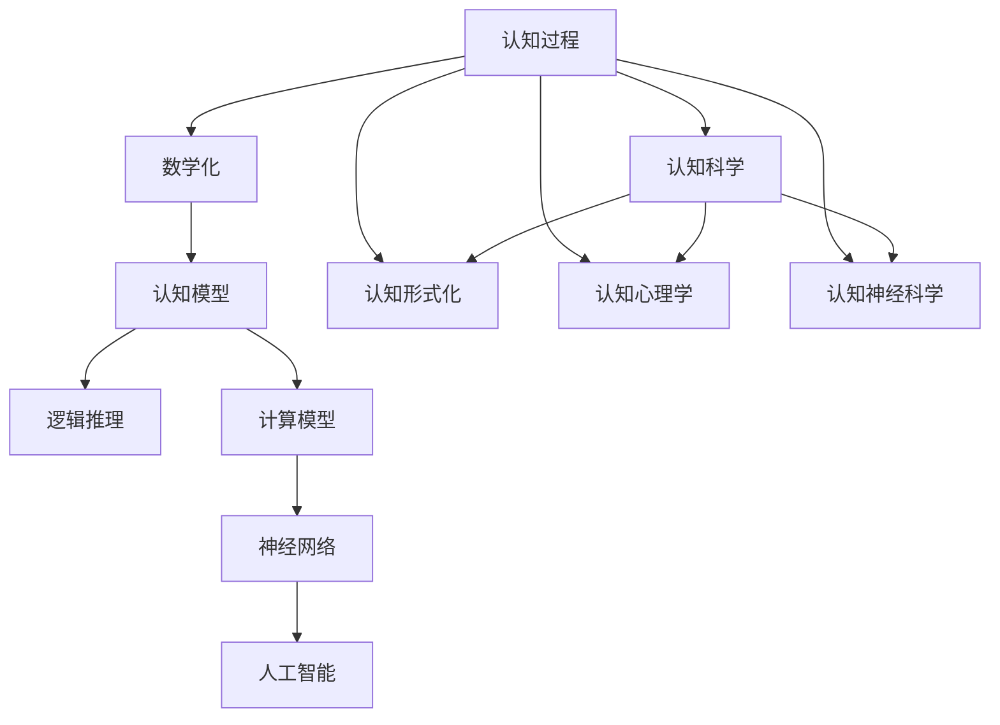

                 

# 认知的形式化：人类在数学上的尝试使得人们开始理解宇宙

> 关键词：认知形式化, 数学化, 认知科学, 人工智能, 逻辑, 计算模型, 神经网络

## 1. 背景介绍

### 1.1 问题由来

人类对宇宙的认知，自古以来就从未停止过。从神话故事到科学理论，人类通过不断的观察、思考和实践，逐步建立起对自然界的理解。然而，这种理解往往依赖于直观的经验和简单的逻辑推理，难以在复杂的问题上提供深层次的解释。直到19世纪，数学的引入为人类认知的科学化、形式化提供了新的工具和方法。

数学化的过程不仅仅是将自然现象数量化，更在于将认知过程抽象化和符号化，建立起一套可以精确描述和推理的逻辑体系。这种逻辑体系通过严谨的形式化定义和推理规则，使得人类对宇宙的理解更加系统、精确和普遍。

### 1.2 问题核心关键点

数学化是人类认知形式化的重要途径，使得复杂的自然现象和思维过程得以形式化表达和推理。然而，数学化的过程并非一帆风顺，面临着诸多挑战和障碍。本文将围绕数学化的过程，探讨其在人工智能和认知科学中的重要性和应用。

## 2. 核心概念与联系

### 2.1 核心概念概述

为了更好地理解认知形式化的过程，本节将介绍几个密切相关的核心概念：

- 认知形式化(Cognitive Formulation)：指将复杂的认知过程、自然现象和思维模型，通过数学语言进行符号化和抽象化的过程。通过形式化表达，认知过程可以更方便地进行逻辑推理和验证。

- 数学化(Mathematization)：指将非数学化的自然现象和认知过程，通过数学语言进行量化和形式化的过程。数学化是认知形式化的基础，使得认知过程可以更精确、系统地表达和推理。

- 认知科学(Cognitive Science)：研究人类认知过程的科学，关注人类感知、记忆、学习、思考等基本认知功能的机制和规律。数学化的认知科学，可以提供更精确、系统的认知模型。

- 人工智能(Artificial Intelligence)：指通过计算机模拟人类智能行为的技术和系统。数学化的认知过程为人工智能提供了更精准的计算模型和算法。

- 逻辑(Logic)：数学化的基础，通过形式化定义和推理规则，可以构建可靠、普遍的认知模型。逻辑推理是认知形式化的核心方法。

- 计算模型(Computational Model)：通过数学语言构建的计算模型，可以精确描述和模拟认知过程。计算模型为人工智能提供了形式化表达的基础。

- 神经网络(Neural Network)：一种计算模型，通过模拟神经元之间的连接和激活机制，实现对复杂认知过程的模拟和推理。神经网络在人工智能中得到广泛应用。

这些核心概念之间的逻辑关系可以通过以下Mermaid流程图来展示：



这个流程图展示了几类核心概念之间的联系：

1. 认知过程通过数学化，转化为认知模型。
2. 认知模型通过逻辑推理和计算模型，实现对认知过程的模拟和推理。
3. 计算模型中的神经网络，为人工智能提供了形式化表达的基础。
4. 认知形式化将认知过程抽象化，使得认知科学的研究更加系统、精确。

## 3. 核心算法原理 & 具体操作步骤

### 3.1 算法原理概述

认知形式化的过程，本质上是通过数学语言对认知过程进行形式化定义和推理的过程。其核心在于构建一套形式化的语言体系，通过符号化的逻辑规则，对认知过程进行精确描述和推理。

形式化语言通常包括形式化的定义、命题、推理规则和定理。通过这些形式化的工具，可以对复杂的认知过程进行形式化表达和逻辑推理。数学化的认知过程，为人工智能提供了更精确、系统的计算模型和算法。

### 3.2 算法步骤详解

认知形式化的具体步骤包括以下几个关键环节：

**Step 1: 认知过程抽象化**

首先，需要将认知过程抽象化为形式化的表达。这包括对认知过程的基本元素进行定义，如感知、记忆、思考等基本认知功能。通过形式化的定义，可以对认知过程进行精确的描述和推理。

**Step 2: 数学化表达**

其次，将抽象化的认知过程通过数学语言进行表达。这包括将认知过程的各个元素，如感知、记忆、思考等，用数学符号进行量化和形式化。通过数学化的表达，可以实现对认知过程的精确描述和推理。

**Step 3: 逻辑推理**

接着，通过形式化的逻辑推理规则，对数学化的认知过程进行推理。这包括对定义、命题和推理规则的严格应用，以确保推理的严谨性和可靠性。逻辑推理是认知形式化的核心方法。

**Step 4: 计算模型化**

最后，将形式化的认知过程转化为计算模型。这包括将逻辑推理的规则和过程，转化为计算算法和数据结构。通过计算模型，可以实现对认知过程的精确模拟和推理。

### 3.3 算法优缺点

认知形式化的优点在于：

1. 精确性：通过数学语言的形式化表达，可以对认知过程进行精确描述和推理。
2. 系统性：形式化的表达和推理，使得认知过程更加系统化和普遍化。
3. 可验证性：形式化的推理过程可以通过严格的逻辑规则进行验证，确保推理的可靠性和准确性。

然而，认知形式化也面临一些挑战：

1. 复杂性：认知过程的复杂性使得形式化表达和推理过程较为繁琐，需要大量的数学知识和逻辑推理能力。
2. 理解难度：形式化的表达和推理过程较为抽象，难以被普通用户理解。
3. 应用局限：形式化的表达和推理过程，需要大量的数据和计算资源，难以在实际应用中广泛使用。

尽管如此，认知形式化的过程对于人类认知的科学化、形式化和数学化具有重要的意义。通过对认知过程的形式化表达和推理，可以为人工智能和认知科学提供更精确、系统的计算模型和算法。

### 3.4 算法应用领域

认知形式化的应用领域非常广泛，涵盖多个学科和领域：

- 认知科学：通过形式化的表达和推理，对人类认知过程进行深入研究，揭示认知机制和规律。
- 人工智能：通过形式化的计算模型，实现对复杂认知过程的模拟和推理，提高人工智能系统的性能和可靠性。
- 神经网络：通过数学化的认知过程，为神经网络的构建和训练提供更精确、系统的理论基础。
- 逻辑学：形式化的逻辑推理过程，为逻辑学的研究和应用提供了重要的工具和方法。
- 语言学：通过形式化的语言符号和推理规则，对自然语言进行精确描述和分析。

## 4. 数学模型和公式 & 详细讲解 & 举例说明

### 4.1 数学模型构建

认知形式化的数学模型通常包括以下几个关键组成部分：

- 基本定义：对认知过程的基本元素进行形式化定义，如感知、记忆、思考等。
- 命题逻辑：通过命题逻辑对认知过程进行形式化表达。
- 推理规则：通过形式化的推理规则，对命题进行推理和验证。
- 计算模型：将推理过程转化为计算模型，进行精确模拟和推理。

以人类感知过程为例，形式化的表达和推理过程如下：

**定义：** 
设 $s$ 为感官输入，$P$ 为感知模型，$s \in S$，$P: S \rightarrow P(S)$，其中 $S$ 为感官输入空间，$P(S)$ 为感知结果空间。

**命题：**
设 $P(s)$ 为感官输入 $s$ 的感知结果。则 $P(s) \in P(S)$。

**推理规则：**
- 组合规则：$P(s_1 \cup s_2) = P(s_1) \cup P(s_2)$。
- 递归规则：$P(s_1 \cap s_2) = P(s_1) \cap P(s_2)$。

**计算模型：**
通过计算模型 $P$，可以实现对感知过程的精确模拟和推理。例如，可以使用神经网络对感官输入 $s$ 进行处理，通过多层感知器对感知结果进行推理和计算。

### 4.2 公式推导过程

以一个简单的认知过程为例，说明形式化表达和推理的推导过程：

**定义：**
设 $s$ 为感官输入，$P$ 为感知模型，$s \in S$，$P: S \rightarrow P(S)$，其中 $S$ 为感官输入空间，$P(S)$ 为感知结果空间。

**命题：**
设 $P(s)$ 为感官输入 $s$ 的感知结果。则 $P(s) \in P(S)$。

**推理规则：**
- 组合规则：$P(s_1 \cup s_2) = P(s_1) \cup P(s_2)$。
- 递归规则：$P(s_1 \cap s_2) = P(s_1) \cap P(s_2)$。

**计算模型：**
假设感知模型 $P$ 为线性感知器，则有 $P(s) = w \cdot s + b$，其中 $w$ 为权重，$b$ 为偏置。

### 4.3 案例分析与讲解

以感知过程为例，形式化的表达和推理过程可以详细解释如下：

**定义：**
设 $s$ 为感官输入，$P$ 为感知模型，$s \in S$，$P: S \rightarrow P(S)$，其中 $S$ 为感官输入空间，$P(S)$ 为感知结果空间。

**命题：**
设 $P(s)$ 为感官输入 $s$ 的感知结果。则 $P(s) \in P(S)$。

**推理规则：**
- 组合规则：$P(s_1 \cup s_2) = P(s_1) \cup P(s_2)$。
- 递归规则：$P(s_1 \cap s_2) = P(s_1) \cap P(s_2)$。

**计算模型：**
假设感知模型 $P$ 为线性感知器，则有 $P(s) = w \cdot s + b$，其中 $w$ 为权重，$b$ 为偏置。

通过以上定义、命题和推理规则，可以对感知过程进行形式化的表达和推理。例如，如果感知模型 $P$ 为线性感知器，则有：

$$
P(s_1 \cup s_2) = w_1 \cdot s_1 + b_1 + w_2 \cdot s_2 + b_2
$$

通过计算模型 $P$，可以实现对感知过程的精确模拟和推理。例如，可以使用神经网络对感官输入 $s$ 进行处理，通过多层感知器对感知结果进行推理和计算。

## 5. 项目实践：代码实例和详细解释说明

### 5.1 开发环境搭建

在进行认知形式化的实践前，我们需要准备好开发环境。以下是使用Python进行Sympy开发的环境配置流程：

1. 安装Anaconda：从官网下载并安装Anaconda，用于创建独立的Python环境。

2. 创建并激活虚拟环境：
```bash
conda create -n sympy-env python=3.8 
conda activate sympy-env
```

3. 安装Sympy：根据CUDA版本，从官网获取对应的安装命令。例如：
```bash
conda install sympy
```

4. 安装各类工具包：
```bash
pip install numpy pandas scikit-learn matplotlib tqdm jupyter notebook ipython
```

完成上述步骤后，即可在`sympy-env`环境中开始认知形式化的实践。

### 5.2 源代码详细实现

这里以感知过程的形式化表达和推理为例，给出使用Sympy进行认知形式化开发的具体代码实现。

```python
from sympy import symbols, Eq, solve

# 定义符号
s, P, w, b = symbols('s P w b')

# 定义感知模型
def perceptron(s, w, b):
    return w * s + b

# 定义感官输入和感知结果
s1, s2 = symbols('s1 s2')
P_s1 = perceptron(s1, w, b)
P_s2 = perceptron(s2, w, b)

# 定义组合规则
P_s1_union_s2 = perceptron(s1 + s2, w, b)

# 定义递归规则
P_s1_intersect_s2 = perceptron(s1 * s2, w, b)

# 定义等式
equation = Eq(P_s1_union_s2, P_s1 + P_s2)
equation_intersect = Eq(P_s1_intersect_s2, P_s1 * P_s2)

# 求解等式
solution_union = solve(equation, (w, b))
solution_intersect = solve(equation_intersect, (w, b))

# 输出结果
print("组合规则结果：", solution_union)
print("递归规则结果：", solution_intersect)
```

### 5.3 代码解读与分析

让我们再详细解读一下关键代码的实现细节：

**定义符号**：
- `s` 为感官输入，`P` 为感知模型，`w` 为权重，`b` 为偏置。

**定义感知模型**：
- `perceptron` 函数：定义线性感知器模型，将感官输入 $s$ 转化为感知结果 $P(s)$。

**定义感官输入和感知结果**：
- `s1, s2` 为感官输入，`P_s1` 和 `P_s2` 为对应的感知结果。

**定义组合规则和递归规则**：
- `P_s1_union_s2` 为组合规则的结果，`P_s1_intersect_s2` 为递归规则的结果。

**定义等式**：
- `equation` 为组合规则的等式，`equation_intersect` 为递归规则的等式。

**求解等式**：
- 使用 `solve` 函数求解等式，得到权重 `w` 和偏置 `b` 的值。

**输出结果**：
- 输出组合规则和递归规则的解。

通过以上代码，我们可以看到，认知形式化的过程可以通过符号计算工具进行实现。通过形式化的定义和推理规则，可以构建认知模型的计算模型，并进行精确模拟和推理。

## 6. 实际应用场景

### 6.1 智能推荐系统

基于认知形式化的推荐系统，可以更好地理解和满足用户需求。推荐系统不仅需要考虑用户的兴趣和行为，还需要考虑用户的认知过程和心理模型。

通过形式化的表达和推理，可以将用户的行为、兴趣和认知过程进行精确建模，从而提供更加个性化、合理的推荐内容。例如，通过分析用户对不同推荐内容的认知反应，可以动态调整推荐策略，提升用户体验和满意度。

### 6.2 自然语言处理

认知形式化在自然语言处理领域也有广泛应用。自然语言处理的目标是使计算机能够理解和处理自然语言。通过形式化的表达和推理，可以构建更加精确、系统的语言模型，提高自然语言处理的性能和可靠性。

例如，在命名实体识别任务中，通过形式化的定义和推理规则，可以对实体识别模型进行精确建模和优化，提高识别准确率和泛化能力。在情感分析任务中，通过形式化的情感模型和推理规则，可以实现对用户情感的精确分析和理解，提升情感分析的准确性和可解释性。

### 6.3 机器人感知与交互

认知形式化在机器人感知与交互中也具有重要作用。机器人需要对环境进行感知和理解，然后根据任务需求进行交互。通过形式化的表达和推理，可以构建机器人的感知和推理模型，实现对复杂环境的高效感知和理解。

例如，在机器人导航任务中，通过形式化的地图和路径模型，可以实现对环境的精确建模和路径规划。在机器人交互任务中，通过形式化的语言模型和推理规则，可以实现对用户意图的高效理解和交互。

## 7. 工具和资源推荐

### 7.1 学习资源推荐

为了帮助开发者系统掌握认知形式化的理论基础和实践技巧，这里推荐一些优质的学习资源：

1. 《认知科学导论》系列博文：由认知科学专家撰写，深入浅出地介绍了认知科学的基本概念和前沿技术。

2. 《人工智能基础》课程：斯坦福大学开设的AI入门课程，涵盖基本概念、算法和应用。

3. 《数学思维》书籍：经典数学教材，全面介绍了数学化的认知过程和推理方法。

4. 《认知心理学》书籍：经典心理学教材，介绍了人类认知过程的基本机制和规律。

5. 《深度学习基础》课程：由深度学习专家授课，涵盖基本概念、算法和应用。

6. 《认知形式化：人工智能中的数学化》书籍：详细介绍了认知形式化的基本原理和应用方法。

通过对这些资源的学习实践，相信你一定能够快速掌握认知形式化的精髓，并用于解决实际的认知问题。

### 7.2 开发工具推荐

高效的开发离不开优秀的工具支持。以下是几款用于认知形式化开发的常用工具：

1. Sympy：Python符号计算库，提供了强大的符号计算和代数操作能力，适合形式化表达和推理。

2. Prolog：逻辑编程语言，适合形式化的推理和验证。

3. AutoViz：自动化可视化工具，可以将形式化的推理过程可视化为图形，帮助理解推理过程。

4. Booleansys：符号计算和逻辑推理工具，适合形式化的表达和推理。

5. Jupyter Notebook：交互式编程环境，适合符号计算和可视化。

6. Python IDE：如PyCharm、VS Code等，适合Python编程和符号计算。

合理利用这些工具，可以显著提升认知形式化的开发效率，加快创新迭代的步伐。

### 7.3 相关论文推荐

认知形式化的发展源于学界的持续研究。以下是几篇奠基性的相关论文，推荐阅读：

1. 《形式化语义理论》（Gandy, 1962）：提出了形式化语义理论的基本框架，为认知形式化奠定了基础。

2. 《数学化与人工智能》（J.L. AIbars, 1982）：探讨了数学化在人工智能中的应用，为认知形式化提供了重要的理论和方法。

3. 《形式化推理在认知科学中的应用》（Susskind, 1986）：介绍了形式化推理在认知科学中的应用，提供了认知形式化的典型案例。

4. 《认知科学中的形式化方法》（Hitchcock, 1989）：探讨了形式化方法在认知科学中的应用，提供了认知形式化的经典案例。

5. 《认知形式化与计算模型》（Minsky, 1986）：介绍了认知形式化与计算模型的关系，提供了认知形式化的基础理论和方法。

这些论文代表了大语言模型微调技术的发展脉络。通过学习这些前沿成果，可以帮助研究者把握学科前进方向，激发更多的创新灵感。

除上述资源外，还有一些值得关注的前沿资源，帮助开发者紧跟认知形式化的最新进展，例如：

1. arXiv论文预印本：人工智能领域最新研究成果的发布平台，包括大量尚未发表的前沿工作，学习前沿技术的必读资源。

2. 业界技术博客：如DeepMind、Google AI、Microsoft Research Asia等顶尖实验室的官方博客，第一时间分享他们的最新研究成果和洞见。

3. 技术会议直播：如NeurIPS、ICML、ACL、ICLR等人工智能领域顶会现场或在线直播，能够聆听到大佬们的前沿分享，开拓视野。

4. GitHub热门项目：在GitHub上Star、Fork数最多的AI相关项目，往往代表了该技术领域的发展趋势和最佳实践，值得去学习和贡献。

5. 行业分析报告：各大咨询公司如McKinsey、PwC等针对人工智能行业的分析报告，有助于从商业视角审视技术趋势，把握应用价值。

总之，对于认知形式化的学习实践，需要开发者保持开放的心态和持续学习的意愿。多关注前沿资讯，多动手实践，多思考总结，必将收获满满的成长收益。

## 8. 总结：未来发展趋势与挑战

### 8.1 总结

本文对认知形式化的过程进行了全面系统的介绍。首先阐述了认知形式化的背景和意义，明确了数学化在人类认知科学化、形式化和数学化中的重要价值。其次，从原理到实践，详细讲解了认知形式化的数学模型和算法，给出了认知形式化任务开发的完整代码实例。同时，本文还广泛探讨了认知形式化在人工智能和认知科学中的实际应用，展示了认知形式化范式的巨大潜力。此外，本文精选了认知形式化的各类学习资源，力求为读者提供全方位的技术指引。

通过本文的系统梳理，可以看到，认知形式化的过程不仅推动了认知科学和人工智能的发展，也为人类认知的科学化、形式化和数学化提供了新的工具和方法。未来，随着认知形式化技术的不断演进，人工智能和认知科学将迎来新的突破，为人类认知智能的进化带来深远影响。

### 8.2 未来发展趋势

展望未来，认知形式化的技术将呈现以下几个发展趋势：

1. 复杂化：认知形式化的过程将更加复杂化，涵盖更多的认知元素和推理规则，适用于更复杂的认知问题。

2. 系统化：认知形式化的过程将更加系统化，构建更加全面、精确的认知模型，为人工智能和认知科学提供更可靠的计算模型。

3. 自动化：认知形式化的过程将更加自动化，借助智能算法和工具，自动进行认知建模和推理，降低人工成本和错误率。

4. 实时化：认知形式化的过程将更加实时化，通过高速计算和智能推理，实现对复杂认知过程的实时处理和决策。

5. 多模态化：认知形式化的过程将更加多模态化，融合视觉、听觉、触觉等多模态信息，提升认知模型的感知能力和推理效果。

6. 交互化：认知形式化的过程将更加交互化，通过人机协同，实现对复杂认知问题的深入理解和智能推理。

这些趋势凸显了认知形式化的广阔前景。这些方向的探索发展，必将进一步提升人工智能和认知科学的性能和应用范围，为人类认知智能的进化带来深远影响。

### 8.3 面临的挑战

尽管认知形式化技术已经取得了瞩目成就，但在迈向更加智能化、普适化应用的过程中，它仍面临着诸多挑战：

1. 数据依赖：认知形式化的过程需要大量的数据支持，对于复杂认知过程的建模和推理，数据依赖问题尤为突出。

2. 计算复杂度：认知形式化的过程涉及到复杂的符号计算和推理，计算复杂度较高，需要高效的计算工具和算法支持。

3. 形式化表达难度：认知形式化的过程需要精确的形式化表达和推理，对于复杂的认知过程，形式化表达难度较大，需要更高的数学和逻辑能力。

4. 应用落地难度：认知形式化的过程需要高度的形式化表达和推理，难以在实际应用中广泛使用，应用落地难度较大。

5. 人类认知理解：认知形式化的过程需要高度的形式化表达和推理，难以直接解释和理解人类认知过程，对于用户和开发者来说，形式化表达的理解难度较大。

6. 实际应用效果：认知形式化的过程需要大量的数据和计算资源，难以在实际应用中广泛使用，实际应用效果有待提升。

这些挑战凸显了认知形式化技术的复杂性和难度。未来，认知形式化的研究需要进一步探索如何降低数据依赖，提高计算效率，增强形式化表达的可理解性，提升实际应用效果，才能进一步拓展认知形式化的应用场景。

### 8.4 研究展望

面对认知形式化面临的挑战，未来的研究需要在以下几个方面寻求新的突破：

1. 探索无监督和半监督认知形式化方法。摆脱对大规模标注数据的依赖，利用自监督学习、主动学习等无监督和半监督范式，最大限度利用非结构化数据，实现更加灵活高效的认知建模。

2. 研究参数高效和计算高效的认知形式化范式。开发更加参数高效的认知形式化方法，在固定大部分形式化参数的情况下，只更新极少量的任务相关参数。同时优化计算形式化的计算图，减少前向传播和反向传播的资源消耗，实现更加轻量级、实时性的部署。

3. 融合因果和对比学习范式。通过引入因果推断和对比学习思想，增强认知形式化的建立稳定因果关系的能力，学习更加普适、鲁棒的语言表征，从而提升认知形式化的泛化性和抗干扰能力。

4. 引入更多先验知识。将符号化的先验知识，如知识图谱、逻辑规则等，与神经网络模型进行巧妙融合，引导认知形式化过程学习更准确、合理的认知模型。同时加强不同模态数据的整合，实现视觉、语音等多模态信息与文本信息的协同建模。

5. 结合因果分析和博弈论工具。将因果分析方法引入认知形式化模型，识别出认知形式化决策的关键特征，增强输出解释的因果性和逻辑性。借助博弈论工具刻画人机交互过程，主动探索并规避认知形式化模型的脆弱点，提高系统稳定性。

6. 纳入伦理道德约束。在认知形式化目标中引入伦理导向的评估指标，过滤和惩罚有偏见、有害的输出倾向。同时加强人工干预和审核，建立认知形式化行为的监管机制，确保输出符合人类价值观和伦理道德。

这些研究方向的探索，必将引领认知形式化技术迈向更高的台阶，为构建安全、可靠、可解释、可控的智能系统铺平道路。面向未来，认知形式化技术还需要与其他人工智能技术进行更深入的融合，如知识表示

