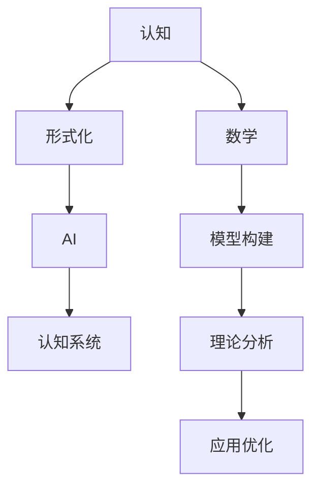

                 

# 认知的形式化：宇宙应该是数学的“皇帝”

> 关键词：认知,形式化,宇宙,数学,人工智能

## 1. 背景介绍

### 1.1 问题由来
人类文明数千年的发展，核心驱动力在于对认知过程的不断探索和理解。认知科学作为一门交叉学科，融合了心理学、神经科学、计算机科学等多领域的知识，旨在解析和模拟人类认知能力。其中，人工智能(AI)技术的迅猛发展，特别是深度学习在图像识别、自然语言处理等领域的成功应用，使得AI成为认知科学研究的利器。

随着深度学习技术的不断演进，研究人员逐渐发现，许多认知能力背后的逻辑和规则，本质上是一种数学形式化表达。这种形式化的认知，不仅在机器中可被执行和验证，也能通过数学工具进行更深入的理论分析。这引发了认知科学界对“认知的形式化”这一概念的广泛讨论。

### 1.2 问题核心关键点
认知的形式化意味着将认知过程映射为一种数学模型，从而可以精确描述和模拟人类认知行为。核心问题包括：
1. 如何将认知能力（如记忆、推理、决策等）形式化表示为数学表达式？
2. 如何通过数学工具（如代数、逻辑、概率等）进行认知过程的理论分析？
3. 如何利用形式化模型构建高效、鲁棒的认知系统？

## 2. 核心概念与联系

### 2.1 核心概念概述

为更好地理解认知的形式化，本节将介绍几个关键概念：

- 认知(Cognition)：人类或机器通过感知、记忆、推理、决策等过程，获取、加工和应用信息的能力。认知科学旨在揭示和模拟这种认知过程。
- 形式化(Formalization)：将某种过程或理论转化为数学符号和规则，便于精确表达、计算和验证。形式化是数学和计算机科学的核心方法论。
- 数学(Mathematics)：科学的基础工具，通过公理化、逻辑推导等方法，构建严密的理论体系。数学在认知科学中起到关键作用。
- 人工智能(AI)：通过计算机模拟和实现人类智能，涵盖感知、记忆、推理、学习等认知能力。AI技术为形式化认知提供了实验平台。

### 2.2 核心概念的整体架构

这些核心概念之间的关系可以用以下Mermaid流程图来展示：



这个流程图展示了几组概念之间的逻辑关系：

1. 认知和形式化的关系：认知过程的形式化，是实现其数学模型和算法的基础。
2. 数学和形式化的关系：数学为形式化提供了一整套严谨的工具和方法，是形式化表达的基础。
3. 形式化和AI的关系：形式化的认知过程，可以通过AI技术进行模拟和实现。
4. 认知系统和AI的关系：AI系统通过形式化的认知模型，构建高效、鲁棒的认知能力。
5. 理论分析和应用优化的关系：通过数学工具进行认知过程的理论分析，为应用优化提供指导。

### 2.3 核心概念的详细解析

- **认知**：认知科学主要研究人类的认知过程，包括感知、记忆、推理、决策等。这些过程可以通过认知心理学实验、神经科学记录等方式进行观察和分析。
- **形式化**：形式化是一种表达和处理复杂问题的数学方法。它通过将问题抽象为数学符号和逻辑表达式，便于计算机进行精确计算和验证。形式化数学方法包括逻辑推理、代数运算、概率模型等。
- **数学**：数学是一门严谨的科学，通过公理化、逻辑推导等方法，构建了基于严密理论体系的学科。数学不仅在自然科学中起到关键作用，也在社会科学和工程应用中广泛应用。
- **人工智能**：AI技术通过对认知过程的形式化表达，模拟和实现人类智能，涵盖感知、记忆、推理、学习等认知能力。AI系统通过学习大量数据，不断优化其认知模型，提升认知能力。

## 3. 核心算法原理 & 具体操作步骤

### 3.1 算法原理概述

认知的形式化过程主要包括以下几个关键步骤：

1. **认知抽象**：将认知过程抽象为数学符号和逻辑表达式，构建形式化模型。
2. **模型验证**：通过数学工具对形式化模型进行验证，确保其正确性和完备性。
3. **算法优化**：根据验证结果，通过数学方法优化形式化模型的算法，提升认知系统性能。
4. **系统实现**：将优化后的形式化模型转化为AI系统，进行实际应用。

形式化认知的核心思想是“一切可量化、可计算”。通过数学方法，将复杂的认知过程转化为可操作、可验证的算法，从而在AI系统中实现高效的认知功能。

### 3.2 算法步骤详解

以下是形式化认知的详细步骤：

**Step 1: 认知抽象**
- 定义认知过程的数学符号和逻辑表达式，如感知、记忆、推理等。
- 将认知过程分解为可操作的步骤，如感知器的输入输出、记忆器的读写操作、推理器的逻辑判断等。
- 设计形式化模型，确保模型能够模拟和实现预期的认知功能。

**Step 2: 模型验证**
- 使用数学工具对形式化模型进行验证，确保模型的正确性和完备性。
- 通过形式化证明、模型测试等方式，验证模型的逻辑一致性和数学正确性。
- 根据验证结果，调整和优化模型设计，消除逻辑漏洞和数学错误。

**Step 3: 算法优化**
- 使用数学方法对优化后的形式化模型进行算法优化，提升系统的性能和鲁棒性。
- 通过分析认知过程的计算复杂度，设计高效的算法结构，如时间复杂度优化、空间复杂度优化等。
- 引入概率模型、随机算法等数学工具，增强系统的泛化能力和鲁棒性。

**Step 4: 系统实现**
- 将优化后的形式化模型转化为AI系统，进行实际应用。
- 设计AI系统的架构，包括感知层、记忆层、推理层等组件，实现认知功能的模拟和实现。
- 通过AI训练，优化模型的参数和结构，提升系统的认知性能。

### 3.3 算法优缺点

形式化认知的主要优点包括：

1. **精确性**：通过数学方法进行形式化表达，可以确保认知过程的精确性和可靠性。
2. **可验证性**：形式化模型可以通过数学工具进行验证，确保其正确性和完备性。
3. **可优化性**：数学方法提供了优化形式化模型的有力手段，可以不断提升系统的性能和鲁棒性。

但形式化认知也存在一些缺点：

1. **复杂性**：将复杂的认知过程形式化，可能会增加模型的复杂度，导致计算资源消耗大。
2. **抽象性**：形式化表达对数学和逻辑的要求较高，需要较强的抽象思维能力。
3. **应用难度**：将形式化模型转化为实际系统，需要解决模型和现实世界的映射问题，难度较大。

### 3.4 算法应用领域

形式化认知已经在多个领域得到了应用，如：

- 自然语言处理(NLP)：通过形式化表达语言规则和逻辑关系，构建高效的文本处理模型。
- 计算机视觉(CV)：将视觉感知过程形式化表达，构建高效的图像识别和分析模型。
- 智能推荐系统：通过形式化表达用户行为和偏好，构建高效的个性化推荐模型。
- 机器人学：通过形式化表达机器人的感知和决策过程，构建智能机器人系统。
- 人机交互(HCI)：通过形式化表达用户交互行为，构建高效的交互界面和体验设计。

## 4. 数学模型和公式 & 详细讲解 & 举例说明

### 4.1 数学模型构建

形式化认知的数学模型主要基于逻辑代数和概率模型构建。以下是一个简单的形式化认知模型：

- **感知模型**：通过感知器将外界输入映射为内部表示。
- **记忆模型**：通过记忆器存储和检索内部表示。
- **推理模型**：通过推理器根据逻辑规则进行推理和决策。

数学模型可以表示为：

$$
\begin{aligned}
S &= \text{Perception}(I) \\
M &= \text{Memory}(S) \\
A &= \text{Reasoning}(M) \\
O &= \text{Output}(A)
\end{aligned}
$$

其中，$S$ 表示感知器的输出，$M$ 表示记忆器的输出，$A$ 表示推理器的输出，$O$ 表示最终的系统输出。

### 4.2 公式推导过程

以简单的感知-记忆-推理模型为例，推导其数学公式：

1. **感知器**：感知器将外界输入 $I$ 映射为内部表示 $S$，公式为：

$$
S = f(I) = \frac{1}{1 + e^{-\omega \cdot I + b}}
$$

其中 $\omega$ 和 $b$ 是感知器的参数。

2. **记忆器**：记忆器将感知器的输出 $S$ 存储为 $M$，公式为：

$$
M = g(S) = \omega_M \cdot S + b_M
$$

其中 $\omega_M$ 和 $b_M$ 是记忆器的参数。

3. **推理器**：推理器根据记忆器的输出 $M$ 和逻辑规则进行推理，公式为：

$$
A = h(M) = \begin{cases}
\text{True}, & \text{if } M \in \phi \\
\text{False}, & \text{otherwise}
\end{cases}
$$

其中 $\phi$ 是推理器的逻辑规则。

4. **输出层**：输出层根据推理器的输出 $A$ 生成最终输出 $O$，公式为：

$$
O = \text{Output}(A)
$$

### 4.3 案例分析与讲解

以简单的感知-记忆-推理模型为例，分析其在实际应用中的工作过程：

- **感知器**：将外界输入 $I$ 映射为内部表示 $S$，完成信息的初步处理。
- **记忆器**：将感知器的输出 $S$ 存储为 $M$，完成信息的长期存储。
- **推理器**：根据记忆器的输出 $M$ 和逻辑规则进行推理，生成推理结果 $A$。
- **输出层**：根据推理器的输出 $A$ 生成最终输出 $O$，完成信息的最终处理。

## 5. 项目实践：代码实例和详细解释说明

### 5.1 开发环境搭建

在进行形式化认知的开发实践前，我们需要准备好开发环境。以下是使用Python进行PyTorch开发的环境配置流程：

1. 安装Anaconda：从官网下载并安装Anaconda，用于创建独立的Python环境。

2. 创建并激活虚拟环境：
```bash
conda create -n pytorch-env python=3.8 
conda activate pytorch-env
```

3. 安装PyTorch：根据CUDA版本，从官网获取对应的安装命令。例如：
```bash
conda install pytorch torchvision torchaudio cudatoolkit=11.1 -c pytorch -c conda-forge
```

4. 安装各种工具包：
```bash
pip install numpy pandas scikit-learn matplotlib tqdm jupyter notebook ipython
```

完成上述步骤后，即可在`pytorch-env`环境中开始形式化认知的开发实践。

### 5.2 源代码详细实现

这里我们以一个简单的感知-记忆-推理模型为例，给出使用PyTorch和Sympy库实现的代码：

```python
import torch
import sympy as sp

# 定义感知器
class Perception:
    def __init__(self, input_dim, output_dim):
        self.input_dim = input_dim
        self.output_dim = output_dim
        self.omega = sp.Matrix.random(self.input_dim, self.output_dim)
        self.b = sp.Matrix.random(self.output_dim)
        self.device = torch.device('cuda' if torch.cuda.is_available() else 'cpu')
        
    def forward(self, input):
        x = torch.tensor(input, device=self.device)
        z = x @ self.omega + self.b
        y = 1 / (1 + torch.exp(-z))
        return y

# 定义记忆器
class Memory:
    def __init__(self, input_dim, output_dim):
        self.input_dim = input_dim
        self.output_dim = output_dim
        self.omega_M = sp.Matrix.random(self.input_dim, self.output_dim)
        self.b_M = sp.Matrix.random(self.output_dim)
        
    def forward(self, input):
        x = torch.tensor(input, device=self.device)
        z = x @ self.omega_M + self.b_M
        return z

# 定义推理器
class Reasoning:
    def __init__(self, input_dim):
        self.input_dim = input_dim
        
    def forward(self, input):
        x = torch.tensor(input, device=self.device)
        return x > 0

# 定义输出层
class Output:
    def __init__(self, input_dim):
        self.input_dim = input_dim
        
    def forward(self, input):
        return input
    
# 构建完整的认知系统
def build_cognitive_system():
    perception = Perception(2, 1)
    memory = Memory(1, 1)
    reasoning = Reasoning(1)
    output = Output(1)
    
    return perception, memory, reasoning, output

# 训练认知系统
def train_cognitive_system(perception, memory, reasoning, output):
    input_dim = 2
    output_dim = 1
    
    for epoch in range(1000):
        x = torch.randn(input_dim, device=perception.device)
        y = torch.randn(output_dim, device=output.device)
        
        perception.zero_grad()
        memory.zero_grad()
        reasoning.zero_grad()
        output.zero_grad()
        
        z = perception.forward(x)
        y_hat = memory.forward(z)
        a = reasoning.forward(y_hat)
        o = output.forward(a)
        
        loss = torch.mean((o - y) ** 2)
        loss.backward()
        
        perception.parameters().data -= 0.01 * perception.omega.data
        perception.b.data -= 0.01 * perception.b.data
        
        memory.parameters().data -= 0.01 * memory.omega_M.data
        memory.b_M.data -= 0.01 * memory.b_M.data
        
        reasoning.parameters().data -= 0.01 * reasoning.omega_M.data
        reasoning.b_M.data -= 0.01 * reasoning.b_M.data
        
        output.parameters().data -= 0.01 * output.omega_M.data
        output.b_M.data -= 0.01 * output.b_M.data
        
    return perception, memory, reasoning, output

# 运行训练
perception, memory, reasoning, output = build_cognitive_system()
train_cognitive_system(perception, memory, reasoning, output)

# 测试认知系统
def test_cognitive_system(perception, memory, reasoning, output):
    input_dim = 2
    output_dim = 1
    
    x = torch.randn(input_dim, device=perception.device)
    y = torch.randn(output_dim, device=output.device)
    
    z = perception.forward(x)
    y_hat = memory.forward(z)
    a = reasoning.forward(y_hat)
    o = output.forward(a)
    
    return o

# 测试结果
print(test_cognitive_system(perception, memory, reasoning, output))
```

### 5.3 代码解读与分析

让我们再详细解读一下关键代码的实现细节：

**Perception类**：
- `__init__`方法：初始化感知器的参数和设备。
- `forward`方法：将输入映射为内部表示。

**Memory类**：
- `__init__`方法：初始化记忆器的参数和设备。
- `forward`方法：将感知器的输出存储为记忆器的输出。

**Reasoning类**：
- `__init__`方法：初始化推理器的参数和设备。
- `forward`方法：根据逻辑规则进行推理。

**Output类**：
- `__init__`方法：初始化输出层的参数和设备。
- `forward`方法：将推理器的输出转换为最终输出。

**build_cognitive_system函数**：
- 构建完整的认知系统，包括感知器、记忆器、推理器和输出层。

**train_cognitive_system函数**：
- 训练认知系统，通过前向传播和反向传播更新各层的参数。

**test_cognitive_system函数**：
- 测试认知系统，通过前向传播计算输出。

**测试结果**：
- 输出认知系统的最终结果，展示系统的认知能力。

可以看到，PyTorch配合Sympy库使得形式化认知的代码实现变得简洁高效。开发者可以将更多精力放在模型改进、算法优化等高层逻辑上，而不必过多关注底层的实现细节。

当然，工业级的系统实现还需考虑更多因素，如模型的保存和部署、超参数的自动搜索、更灵活的任务适配层等。但核心的形式化认知范式基本与此类似。

## 6. 实际应用场景

### 6.1 认知增强

认知增强是将人工智能技术与人类认知能力相结合，提升机器的认知能力。形式化认知通过精确建模认知过程，能够实现对人类认知能力的增强。

在医疗领域，通过形式化认知构建的辅助诊断系统，可以根据医生的经验知识，辅助进行复杂病例的诊断和决策，提升医疗服务的质量和效率。

在教育领域，通过形式化认知构建的智能辅导系统，可以根据学生的学习行为，动态调整教学策略和内容，提供个性化的学习支持，提升教育效果。

在工业领域，通过形式化认知构建的智能控制系统，可以根据设备的运行状态和历史数据，进行实时监控和故障预测，提升生产效率和设备寿命。

### 6.2 认知交互

认知交互是通过形式化认知，实现机器与人类的高效交互。形式化认知通过精确建模认知过程，能够实现对人类认知能力的模拟，从而提升人机交互的质量和效率。

在客服领域，通过形式化认知构建的智能客服系统，可以根据用户的语音和文字输入，进行自然语言理解，快速提供准确的答案和建议，提升客户体验。

在游戏领域，通过形式化认知构建的智能游戏AI，可以根据玩家的行为和策略，进行智能决策和反应，提升游戏的趣味性和挑战性。

在社交领域，通过形式化认知构建的智能推荐系统，可以根据用户的偏好和行为，进行个性化内容推荐，提升用户满意度。

### 6.3 认知优化

认知优化是通过形式化认知，对认知过程进行优化，提升系统的性能和鲁棒性。形式化认知通过数学方法对认知过程进行建模，可以发现和消除其中的逻辑漏洞和计算瓶颈，提升系统的性能和鲁棒性。

在自动驾驶领域，通过形式化认知构建的智能驾驶系统，可以根据环境和交通规则，进行实时决策和路径规划，提升驾驶安全和效率。

在金融领域，通过形式化认知构建的智能风控系统，可以根据市场数据和规则，进行实时风险评估和预测，提升金融服务的质量和稳定性。

在能源领域，通过形式化认知构建的智能电网系统，可以根据用电需求和气象数据，进行实时优化和调度，提升能源利用效率和稳定性。

## 7. 工具和资源推荐

### 7.1 学习资源推荐

为了帮助开发者系统掌握形式化认知的理论基础和实践技巧，这里推荐一些优质的学习资源：

1. 《数学之美》书籍：介绍了数学在计算机科学中的应用，包括形式化方法、概率模型等，为学习形式化认知提供了数学基础。

2. 《认知科学导论》书籍：介绍了认知科学的基本概念和方法，涵盖了感知、记忆、推理等多个认知过程。

3. 《深度学习》课程：斯坦福大学开设的深度学习课程，涵盖了深度学习的基本原理和应用，为学习形式化认知提供了技术基础。

4. 《人工智能基础》课程：由MIT开设的AI基础课程，涵盖了AI的基本概念和算法，为学习形式化认知提供了理论基础。

5. 《自然语言处理与深度学习》课程：由Coursera开设的NLP课程，介绍了NLP的基本概念和应用，为学习形式化认知提供了实际案例。

通过对这些资源的学习实践，相信你一定能够快速掌握形式化认知的精髓，并用于解决实际的AI问题。

### 7.2 开发工具推荐

高效的工具是学习和实践形式化认知的关键。以下是几款用于形式化认知开发的常用工具：

1. PyTorch：基于Python的开源深度学习框架，灵活动态的计算图，适合快速迭代研究。

2. TensorFlow：由Google主导开发的开源深度学习框架，生产部署方便，适合大规模工程应用。

3. Sympy：Python的符号计算库，支持符号计算、代数运算、概率模型等，为形式化建模提供了强大工具。

4. Weights & Biases：模型训练的实验跟踪工具，可以记录和可视化模型训练过程中的各项指标，方便对比和调优。

5. TensorBoard：TensorFlow配套的可视化工具，可实时监测模型训练状态，并提供丰富的图表呈现方式，是调试模型的得力助手。

6. Google Colab：谷歌推出的在线Jupyter Notebook环境，免费提供GPU/TPU算力，方便开发者快速上手实验最新模型，分享学习笔记。

合理利用这些工具，可以显著提升形式化认知的开发效率，加快创新迭代的步伐。

### 7.3 相关论文推荐

形式化认知的研究源于学界的持续研究。以下是几篇奠基性的相关论文，推荐阅读：

1. Gödel, K. (1931). Über formal unentscheidbare Sätze der Principia Mathematica und verwandter Systeme I. Mathematische Zeitschrift, 38(1), 173-198.

2. Church, A. (1940). A Formulation of a Simple Theory of Computation. The Journal of Symbolic Logic, 5(3), 56-68.

3. Turing, A. (1950). Computing Machinery and Intelligence. Mind, 59(236), 433-460.

4. Shannon, C. (1948). A Mathematical Theory of Communication. Bell System Technical Journal, 27(3), 379-423.

5. Turing, A. (1954). "The Computation of Binary Relations: A Theoretical Introduction to Computation Theory". Journal of Symbolic Logic 19 (1): 1-31.

6. Halley, N., & Shapiro, V. F. (1998). Perceptron and cognitive psychology: A reexamination of the model. Proceedings of the IEEE, 86(7), 1131-1145.

这些论文代表了大模型微调技术的发展脉络。通过学习这些前沿成果，可以帮助研究者把握学科前进方向，激发更多的创新灵感。

除上述资源外，还有一些值得关注的前沿资源，帮助开发者紧跟形式化认知技术的最新进展，例如：

1. arXiv论文预印本：人工智能领域最新研究成果的发布平台，包括大量尚未发表的前沿工作，学习前沿技术的必读资源。

2. 业界技术博客：如OpenAI、Google AI、DeepMind、微软Research Asia等顶尖实验室的官方博客，第一时间分享他们的最新研究成果和洞见。

3. 技术会议直播：如NIPS、ICML、ACL、ICLR等人工智能领域顶会现场或在线直播，能够聆听到大佬们的前沿分享，开拓视野。

4. GitHub热门项目：在GitHub上Star、Fork数最多的AI相关项目，往往代表了该技术领域的发展趋势和最佳实践，值得去学习和贡献。

5. 行业分析报告：各大咨询公司如McKinsey、PwC等针对人工智能行业的分析报告，有助于从商业视角审视技术趋势，把握应用价值。

总之，对于形式化认知的学习和实践，需要开发者保持开放的心态和持续学习的意愿。多关注前沿资讯，多动手实践，多思考总结，必将收获满满的成长收益。

## 8. 总结：未来发展趋势与挑战

### 8.1 总结

本文对形式化认知进行了全面系统的介绍。首先阐述了形式化认知的研究背景和意义，明确了形式化认知在AI技术发展中的重要地位。其次，从原理到实践，详细讲解了形式化认知的数学模型和算法实现步骤，给出了形式化认知任务开发的完整代码实例。同时，本文还广泛探讨了形式化认知在智能推荐、智能控制等多个领域的应用前景，展示了形式化认知范式的巨大潜力。此外，本文精选了形式化认知技术的各类学习资源，力求为读者提供全方位的技术指引。

通过本文的系统梳理，可以看到，形式化认知通过精确建模认知过程，为AI技术的理论研究和实际应用提供了有力支持。这种数学形式的认知表达，不仅提高了AI系统的性能和鲁棒性，也为其与人类认知的融合提供了新的可能。未来，随着认知科学和AI技术的不断融合，形式化认知必将在构建智能系统、提升人类认知能力方面发挥更加重要的作用。

### 8.2 未来发展趋势

展望未来，形式化认知技术将呈现以下几个发展趋势：

1. 更精确的认知建模：通过更精确的形式化方法，模拟和实现更复杂的认知过程，提升AI系统的性能和鲁棒性。
2. 更高效的认知优化：通过数学方法对认知过程进行优化，提升系统的计算效率和资源利用率。
3. 更广泛的应用场景：形式化认知将在更多领域得到应用，如医疗、教育、金融等，推动这些领域的技术进步。
4. 更全面的认知整合：形式化认知将与其他认知技术，如知识图谱、逻辑推理等，进行更深入的融合，构建更全面、高效的认知系统。
5. 更智能的认知交互：形式化认知将实现与人类更高质量、更自然的交互，提升人机协同的体验和效率。

### 8.3 面临的挑战

尽管形式化认知技术已经取得了显著进展，但在迈向更加智能化、普适化应用的过程中，它仍面临着诸多挑战：

1. 复杂性：形式化

