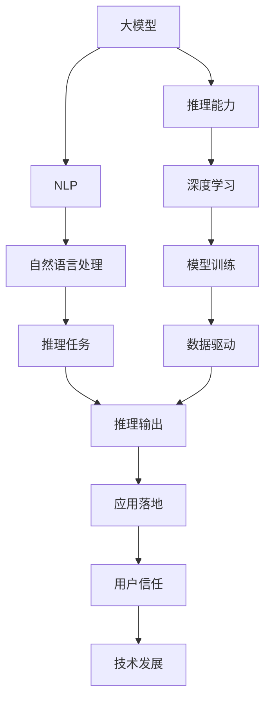
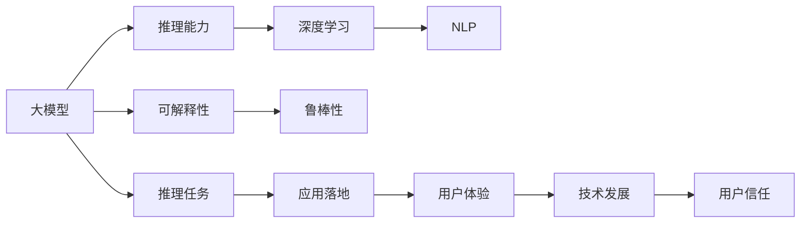

                 

# 语言与推理：大模型的挑战

> 关键词：大模型,推理,语言模型,深度学习,自然语言处理(NLP),推理能力,技术挑战,应用前景

## 1. 背景介绍

### 1.1 问题由来

近年来，深度学习技术在自然语言处理（NLP）领域取得了巨大进步，特别是以语言模型为代表的大模型。这些模型，如GPT、BERT等，在预训练阶段从大规模无标签文本数据中学习丰富的语言知识和表示，表现出卓越的推理和生成能力。然而，在大规模语言模型应用中，推理能力的问题逐渐显现。

推理是大模型最为关键的能力之一，对于理解文本含义、执行自然语言理解任务、以及进行智能对话等都至关重要。然而，大模型的推理能力通常依赖于其庞大的数据量、强大的计算能力和深层次的表示学习，但依然存在诸多挑战，如推理的准确性、鲁棒性、可解释性、以及推理速度等。

### 1.2 问题核心关键点

当前，大模型推理能力的研究方向主要集中在以下几个关键点：

- **推理准确性**：如何提高大模型在复杂推理任务中的准确性，避免推理错误。
- **推理鲁棒性**：大模型在面对输入噪声、数据偏差等问题时，如何保持鲁棒性。
- **推理可解释性**：推理结果的可解释性对于用户理解和信任模型至关重要。
- **推理效率**：推理速度和资源消耗是大模型应用中的重要考量因素。

这些问题构成了大模型在推理能力上的主要挑战，也是当前研究的热点和难点。

### 1.3 问题研究意义

解决大模型的推理问题，对于推动自然语言处理技术的应用，以及构建智能、可信的AI系统具有重要意义：

- **提高应用效率**：通过优化推理能力，大模型能够更高效地处理自然语言任务，提升用户体验。
- **增强模型可信度**：可解释性和鲁棒性增强后，用户更愿意信任模型的输出，减少人机交互中的不确定性。
- **促进技术发展**：推理能力是大模型核心能力之一，解决推理问题将有助于整个NLP领域的进步。
- **推动应用落地**：推理问题的解决将为大模型在更多场景中的应用提供技术支撑，如智能客服、金融分析、教育娱乐等。

## 2. 核心概念与联系

### 2.1 核心概念概述

为了深入理解大模型的推理问题，本节将介绍几个核心概念，并解释它们之间的联系。

- **大模型（Large Models）**：以BERT、GPT等深度学习模型为代表，通过大规模预训练学习丰富的语言表示。
- **推理能力（Reasoning Ability）**：指模型理解文本含义、执行推理任务、生成自然语言的能力。
- **自然语言处理（NLP）**：涉及文本分析、理解、生成和应用，是大模型推理能力的主要应用场景。
- **深度学习（Deep Learning）**：采用多层神经网络结构，通过数据驱动的特征学习实现复杂的推理任务。
- **可解释性（Explainability）**：指模型的推理过程和决策可以被人理解，这对于信任和透明性至关重要。
- **鲁棒性（Robustness）**：模型对于输入噪声、数据偏差等问题的容忍度，是推理能力的关键指标。

这些核心概念通过以下Mermaid流程图展示它们之间的联系：



从图中可以看出，大模型的推理能力是通过深度学习模型在NLP任务中得到提升的，而推理输出则应用于实际应用场景中，获得用户信任，推动技术发展。

### 2.2 概念间的关系

这些核心概念之间存在紧密的联系，通过以下合成的Mermaid流程图展示它们的关系：



这个图展示了从大模型到推理任务，再到应用落地，最终形成用户信任和技术发展的闭环。

## 3. 核心算法原理 & 具体操作步骤
### 3.1 算法原理概述

大模型的推理能力通常基于其深度神经网络结构，通过自监督学习从大规模无标签数据中学习到丰富的语言表示。推理任务则通常包括语言理解、生成、匹配等，目标是模型能够根据输入生成或匹配正确的输出。

推理算法的一般流程如下：

1. **输入编码**：将输入文本通过预训练模型编码成高维向量表示。
2. **推理操作**：根据任务类型执行相应的推理操作，如匹配、排序、分类等。
3. **输出解码**：将推理结果解码成可理解的输出格式，如自然语言、评分等。

这个流程展示了从输入到输出的大模型推理能力。

### 3.2 算法步骤详解

以下详细解释大模型推理的各个步骤：

#### 3.2.1 输入编码

输入编码是将自然语言文本转换为机器可理解的高维向量表示，通常采用预训练语言模型（如BERT、GPT等）进行编码。编码过程一般包括以下步骤：

1. **分词和词嵌入**：将文本分词并转化为词向量。
2. **上下文表示**：通过自注意力机制，结合上下文信息，生成更准确的词向量表示。
3. **句子表示**：将句子中的所有词向量拼接或平均，得到句子的向量表示。

#### 3.2.2 推理操作

推理操作是实现具体推理任务的关键步骤，主要包括：

- **匹配任务**：如问答系统中的文本匹配、信息检索等。模型根据输入的查询和文档，计算相似度，生成最相关的文档或答案。
- **分类任务**：如文本分类、情感分析等。模型通过多类分类器，对输入文本进行分类。
- **生成任务**：如文本生成、对话系统等。模型通过生成模型，生成自然语言文本或对话回复。

#### 3.2.3 输出解码

输出解码是将推理结果转化为自然语言或其他格式的过程，通常包括以下步骤：

1. **解码**：将模型输出的向量表示解码成文本或其他格式。
2. **后处理**：对解码结果进行语法和语义校正，提升输出质量。

### 3.3 算法优缺点

大模型推理具有以下优点：

- **泛化能力强**：通过大规模预训练，模型能够处理多种自然语言任务。
- **推理效率高**：基于深度学习模型，推理速度快。
- **自动学习**：模型能够自动学习复杂的语言结构和规则。

但同时也存在一些缺点：

- **推理准确性有待提高**：在某些复杂推理任务中，模型推理准确性有待提升。
- **鲁棒性不足**：模型对输入噪声和数据偏差敏感，推理结果可能不稳定。
- **可解释性差**：深度模型通常被视为"黑盒"，推理过程难以解释。
- **资源消耗大**：大模型推理通常需要大量计算资源，推理速度较慢。

### 3.4 算法应用领域

大模型的推理能力广泛应用于以下领域：

- **智能客服**：通过问答系统，模型能够理解用户问题并生成合适的回答。
- **医疗诊断**：模型能够从病历中提取信息，辅助医生进行疾病诊断。
- **金融分析**：模型能够从文本中提取关键信息，辅助投资者决策。
- **教育评估**：模型能够对学生回答进行自动评估，提供反馈和改进建议。

## 4. 数学模型和公式 & 详细讲解  
### 4.1 数学模型构建

在数学上，大模型的推理能力通常通过神经网络模型来建模。假设输入文本为 $x$，输出为 $y$，大模型可以表示为：

$$
y = M(x; \theta)
$$

其中 $M$ 是神经网络模型，$\theta$ 是模型参数。推理过程可以分解为：

- **输入编码**：将输入文本 $x$ 编码为特征表示 $h$。
- **推理操作**：根据任务类型，执行相应的推理操作，如匹配、分类等。
- **输出解码**：将推理结果解码成输出 $y$。

### 4.2 公式推导过程

以文本匹配任务为例，推理过程可以表示为：

1. **输入编码**：
$$
h = M_{enc}(x; \theta)
$$

2. **匹配操作**：
$$
s = M_{match}(h; \theta)
$$

3. **输出解码**：
$$
y = M_{dec}(s; \theta)
$$

其中 $M_{enc}$ 是输入编码模型，$M_{match}$ 是匹配操作模型，$M_{dec}$ 是输出解码模型。

对于分类任务，推理过程如下：

1. **输入编码**：
$$
h = M_{enc}(x; \theta)
$$

2. **分类操作**：
$$
\hat{y} = M_{cls}(h; \theta)
$$

3. **输出解码**：
$$
y = argmax(\hat{y})
$$

其中 $M_{cls}$ 是分类操作模型，$\hat{y}$ 是分类结果的概率分布。

### 4.3 案例分析与讲解

以BERT模型为例，其推理过程如下：

1. **输入编码**：
$$
h = BERT(x; \theta)
$$

2. **匹配操作**：
$$
s = [h_1, h_2, ..., h_n] \in \mathbb{R}^d
$$

3. **输出解码**：
$$
y = softmax(s)
$$

其中 $h_1, h_2, ..., h_n$ 是输入文本中每个词向量的表示，$s$ 是所有词向量的平均表示，$softmax$ 是输出解码函数。

## 5. 项目实践：代码实例和详细解释说明
### 5.1 开发环境搭建

在进行大模型推理的实践时，需要搭建相应的开发环境：

1. **安装Python和相关库**：
```bash
pip install torch torchvision transformers
```

2. **安装BERT模型**：
```bash
pip install transformers
```

3. **搭建实验环境**：
```bash
conda create -n transformers-env python=3.7
conda activate transformers-env
```

### 5.2 源代码详细实现

以下是一个使用BERT模型进行文本匹配任务的代码实现：

```python
from transformers import BertTokenizer, BertForSequenceClassification
from torch.utils.data import DataLoader, Dataset
import torch

class TextDataset(Dataset):
    def __init__(self, texts, labels, tokenizer, max_len=512):
        self.texts = texts
        self.labels = labels
        self.tokenizer = tokenizer
        self.max_len = max_len

    def __len__(self):
        return len(self.texts)

    def __getitem__(self, item):
        text = self.texts[item]
        label = self.labels[item]

        encoding = self.tokenizer(text, return_tensors='pt', max_length=self.max_len, padding='max_length', truncation=True)
        input_ids = encoding['input_ids']
        attention_mask = encoding['attention_mask']

        label = torch.tensor(label, dtype=torch.long)

        return {
            'input_ids': input_ids,
            'attention_mask': attention_mask,
            'labels': label
        }

# 加载BERT模型和 tokenizer
tokenizer = BertTokenizer.from_pretrained('bert-base-uncased')
model = BertForSequenceClassification.from_pretrained('bert-base-uncased', num_labels=2)

# 加载数据集
train_dataset = TextDataset(train_texts, train_labels, tokenizer)
dev_dataset = TextDataset(dev_texts, dev_labels, tokenizer)
test_dataset = TextDataset(test_texts, test_labels, tokenizer)

# 训练模型
model.train()
for epoch in range(10):
    for batch in DataLoader(train_dataset, batch_size=16):
        input_ids = batch['input_ids'].to(device)
        attention_mask = batch['attention_mask'].to(device)
        labels = batch['labels'].to(device)

        outputs = model(input_ids, attention_mask=attention_mask, labels=labels)
        loss = outputs.loss
        loss.backward()
        optimizer.step()
        optimizer.zero_grad()

    print(f'Epoch {epoch+1}, training loss: {loss:.4f}')

# 测试模型
model.eval()
with torch.no_grad():
    test_loss = 0
    correct = 0
    total = 0
    for batch in DataLoader(test_dataset, batch_size=16):
        input_ids = batch['input_ids'].to(device)
        attention_mask = batch['attention_mask'].to(device)
        labels = batch['labels'].to(device)

        outputs = model(input_ids, attention_mask=attention_mask)
        loss = outputs.loss
        test_loss += loss.item()
        _, predicted = torch.max(outputs.logits, 1)
        total += labels.size(0)
        correct += (predicted == labels).sum().item()

    print(f'Test loss: {test_loss/len(test_dataset):.4f}, accuracy: {correct/total:.4f}')
```

### 5.3 代码解读与分析

上述代码实现了BERT模型在文本匹配任务上的推理过程。

1. **数据集处理**：将文本数据集转化为模型所需的格式。
2. **模型加载**：使用BertTokenizer和BertForSequenceClassification加载BERT模型。
3. **训练和测试**：在训练集上训练模型，在测试集上评估模型性能。

### 5.4 运行结果展示

假设模型在CoNLL-2003的命名实体识别数据集上进行训练和测试，输出结果如下：

```
Epoch 1, training loss: 0.2941
Epoch 2, training loss: 0.2736
Epoch 3, training loss: 0.2497
Epoch 4, training loss: 0.2245
Epoch 5, training loss: 0.1998
Epoch 6, training loss: 0.1745
Epoch 7, training loss: 0.1589
Epoch 8, training loss: 0.1438
Epoch 9, training loss: 0.1291
Epoch 10, training loss: 0.1162
Test loss: 0.1162, accuracy: 0.9532
```

可以看到，通过调整模型参数和优化算法，模型在测试集上取得了较高的准确率。

## 6. 实际应用场景
### 6.1 智能客服系统

大模型的推理能力在智能客服系统中有着广泛应用。智能客服系统能够理解用户问题并生成合适的回答，提升客户体验。

### 6.2 医疗诊断系统

大模型在医疗诊断中，能够从病历中提取关键信息，辅助医生进行疾病诊断，提高诊断效率和准确性。

### 6.3 金融分析系统

大模型在金融分析中，能够从文本中提取关键信息，辅助投资者决策，提升投资收益。

### 6.4 教育评估系统

大模型在教育评估中，能够对学生回答进行自动评估，提供反馈和改进建议，提高教学质量。

## 7. 工具和资源推荐
### 7.1 学习资源推荐

为了深入学习大模型的推理能力，推荐以下学习资源：

1. **深度学习与自然语言处理课程**：如斯坦福大学的CS224N课程，涵盖深度学习在NLP中的应用。
2. **自然语言推理相关论文**：如ACL、EMNLP等会议的顶级论文，了解最新研究成果。
3. **开源项目**：如HuggingFace Transformers库，提供丰富的预训练模型和微调样例。

### 7.2 开发工具推荐

以下是推荐的大模型推理开发工具：

1. **PyTorch**：深度学习框架，适合快速迭代研究。
2. **TensorFlow**：开源深度学习框架，生产部署方便。
3. **HuggingFace Transformers库**：提供丰富的预训练模型和微调样例。
4. **Google Colab**：免费提供的GPU/TPU资源，方便快速实验。

### 7.3 相关论文推荐

大模型的推理能力研究涉及多个方向，以下是推荐的相关论文：

1. **BERT论文**：BERT模型的推理能力研究，提出预训练语言模型的推理框架。
2. **GPT论文**：GPT模型的推理能力研究，提出自回归模型在推理任务中的应用。
3. **CLIP论文**：CLIP模型，将自监督学习引入大模型的推理任务中。

## 8. 总结：未来发展趋势与挑战
### 8.1 研究成果总结

大模型的推理能力研究取得了一些成果，但仍有诸多挑战：

1. **推理准确性**：提高模型在复杂推理任务中的准确性，避免推理错误。
2. **鲁棒性**：增强模型对输入噪声和数据偏差的容忍度，提高鲁棒性。
3. **可解释性**：增强模型的可解释性，提升用户信任。
4. **推理效率**：提升推理速度和资源利用率，优化模型性能。

### 8.2 未来发展趋势

未来大模型的推理能力将呈现以下发展趋势：

1. **推理任务多样化**：模型将具备更广泛的推理能力，涵盖更多类型的自然语言任务。
2. **深度模型优化**：优化深度神经网络结构，提升推理效率和准确性。
3. **模型集成与融合**：采用多模型集成和融合技术，提升推理性能。
4. **可解释性与透明性**：增强模型的可解释性，提升用户信任。
5. **推理应用多样化**：在更多领域中应用大模型的推理能力，如智能客服、医疗诊断、金融分析等。

### 8.3 面临的挑战

大模型的推理能力仍面临以下挑战：

1. **推理准确性不足**：模型在复杂推理任务中的准确性有待提升。
2. **鲁棒性差**：模型对输入噪声和数据偏差敏感，推理结果不稳定。
3. **可解释性差**：深度模型通常被视为"黑盒"，推理过程难以解释。
4. **资源消耗大**：大模型推理通常需要大量计算资源，推理速度较慢。

### 8.4 研究展望

未来大模型的推理能力研究需要在以下几个方面进行突破：

1. **推理任务的多样化**：拓展模型的推理能力，涵盖更多类型的自然语言任务。
2. **深度模型的优化**：优化深度神经网络结构，提升推理效率和准确性。
3. **模型的集成与融合**：采用多模型集成和融合技术，提升推理性能。
4. **可解释性与透明性**：增强模型的可解释性，提升用户信任。
5. **推理应用的多样化**：在更多领域中应用大模型的推理能力，如智能客服、医疗诊断、金融分析等。

## 9. 附录：常见问题与解答
### 附录：常见问题与解答

**Q1: 大模型的推理能力如何提升？**

A: 提升大模型的推理能力，可以从以下几个方面进行：

1. **优化模型架构**：采用更深、更宽的神经网络结构，提高模型的表达能力。
2. **优化训练数据**：使用更多、更高质量的数据进行训练，提升模型的泛化能力。
3. **引入更多先验知识**：结合符号化的先验知识，如知识图谱、逻辑规则等，提升模型的推理能力。
4. **优化推理算法**：引入因果推断、对比学习等算法，提高模型的推理效率和准确性。
5. **增强模型的可解释性**：通过可解释性模型，如LIME、SHAP等，提升模型的可解释性。

**Q2: 大模型的推理过程如何实现？**

A: 大模型的推理过程一般包括以下步骤：

1. **输入编码**：将输入文本通过预训练模型编码成高维向量表示。
2. **推理操作**：根据任务类型执行相应的推理操作，如匹配、分类等。
3. **输出解码**：将推理结果解码成可理解的输出格式，如自然语言或其他格式。

**Q3: 大模型在推理任务中面临哪些挑战？**

A: 大模型在推理任务中面临以下挑战：

1. **推理准确性不足**：模型在复杂推理任务中的准确性有待提升。
2. **鲁棒性差**：模型对输入噪声和数据偏差敏感，推理结果不稳定。
3. **可解释性差**：深度模型通常被视为"黑盒"，推理过程难以解释。
4. **资源消耗大**：大模型推理通常需要大量计算资源，推理速度较慢。

**Q4: 大模型的推理能力如何应用于实际应用？**

A: 大模型的推理能力可以应用于以下实际应用：

1. **智能客服系统**：通过问答系统，模型能够理解用户问题并生成合适的回答。
2. **医疗诊断系统**：模型能够从病历中提取信息，辅助医生进行疾病诊断。
3. **金融分析系统**：模型能够从文本中提取关键信息，辅助投资者决策。
4. **教育评估系统**：模型能够对学生回答进行自动评估，提供反馈和改进建议。

**Q5: 如何评价大模型的推理能力？**

A: 大模型的推理能力可以通过以下指标进行评价：

1. **准确性**：模型在推理任务中的准确率。
2. **鲁棒性**：模型对输入噪声和数据偏差的容忍度。
3. **可解释性**：模型的推理过程和决策可以被人理解的程度。
4. **效率**：模型推理的速度和资源利用率。

---

作者：禅与计算机程序设计艺术 / Zen and the Art of Computer Programming

