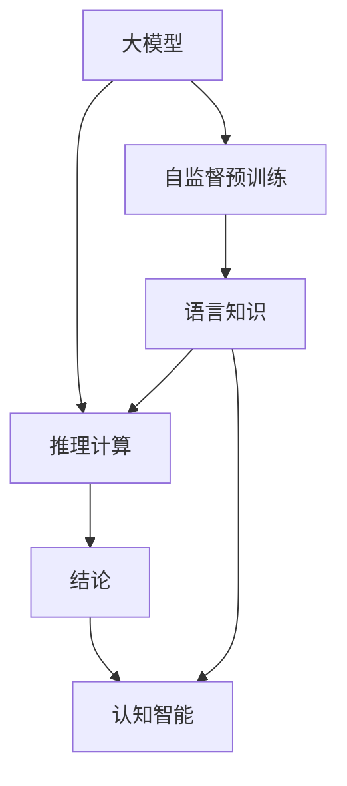

                 

# 语言与推理：大模型的认知瓶颈

> 关键词：语言理解,推理计算,认知瓶颈,大模型,认知智能

## 1. 背景介绍

在深度学习技术迅猛发展的今天，大规模预训练语言模型如BERT、GPT、T5等，在自然语言处理（NLP）领域取得了令人瞩目的成就。这些模型通过在大规模无标签文本数据上自监督预训练，学习到丰富的语言知识和常识，已经能够进行复杂抽象的语义理解和推理。然而，尽管如此，大模型在语言理解和推理计算方面的认知瓶颈，仍是一大挑战。

认知瓶颈指的是在大模型处理自然语言时，由于内部机制和推理能力的局限，导致无法完全理解语言的深层次含义和推理逻辑。这个问题在复杂语言模型如GPT-3中尤为突出。尽管其推理能力相较于早期模型有了质的飞跃，但依然无法完全超越人类在语言推理上的自然表现。

本文将深入探讨大模型的认知瓶颈问题，通过理论分析和实际案例，提出解决方案和未来研究方向，旨在提升大模型在语言推理任务上的性能，推动认知智能的发展。

## 2. 核心概念与联系

### 2.1 核心概念概述

- **大模型**：指通过在大规模无标签文本数据上自监督预训练，学习到丰富语言知识和常识的深度学习模型，如BERT、GPT等。
- **认知瓶颈**：指在处理自然语言时，由于模型内部机制和推理能力的局限，导致无法完全理解语言的深层次含义和推理逻辑，从而无法完全超越人类在语言推理上的自然表现。
- **推理计算**：指模型在理解自然语言文本后，通过逻辑推理和计算得出结论的过程。
- **认知智能**：指机器能够理解、学习和应用人类认知能力，解决复杂问题的能力，是大模型发展的最终目标。

### 2.2 核心概念间的关系

这些核心概念通过语言理解、推理计算和认知智能的逻辑链条联系起来，形成了一个完整的认知处理框架。模型通过学习语言知识，进行推理计算，最终达到具备认知智能的目的。认知瓶颈的存在，限制了大模型在这一链条中的表现，需要通过不断优化推理机制来突破这一瓶颈。

下图展示了核心概念间的关系：



此图表示，大模型通过自监督预训练学习到语言知识，并将其应用于推理计算，最终推导出结论，形成认知智能。认知瓶颈就存在于语言知识到推理计算的链条中，需要通过技术改进来克服。

## 3. 核心算法原理 & 具体操作步骤
### 3.1 算法原理概述

大模型的认知瓶颈问题主要体现在语言推理能力的局限上。推理计算的核心在于模型对自然语言逻辑结构和语义关系的理解和处理。然而，当前大模型在处理自然语言时，往往依赖于语言的表面特征和统计规律，缺乏对深层语义和逻辑结构的精准把握。

推理计算通常包括基于规则的推理和基于神经网络的推理。前者需要设计复杂的规则系统，而后者依赖于模型对语言的统计特征和上下文信息的综合处理。

### 3.2 算法步骤详解

为了克服大模型的认知瓶颈，需要从以下几个方面进行优化：

1. **改进语言理解能力**：增强模型对语义角色、逻辑关系和上下文依赖的理解，减少对表面特征的依赖。
2. **设计更有效的推理计算框架**：构建基于神经网络的推理计算模型，引入更先进的推理机制。
3. **优化参数结构和训练方法**：设计更合理的参数结构，采用更高效的训练方法，提高模型的推理能力。

### 3.3 算法优缺点

大模型推理计算的优点在于，可以处理复杂的自然语言推理任务，具有较高的泛化能力和适应性。然而，其缺点同样明显：

- **计算复杂度高**：大模型推理计算依赖于神经网络的前向传播和反向传播，计算复杂度较高，难以实时处理大量数据。
- **逻辑泛化能力有限**：大模型在处理新问题时，往往依赖于已有知识，缺乏灵活的逻辑泛化能力。
- **难以解释**：大模型的推理过程缺乏可解释性，难以理解和调试模型的决策逻辑。

### 3.4 算法应用领域

尽管存在认知瓶颈问题，大模型在自然语言推理（Natural Language Inference, NLI）、问答系统（QA）、文本摘要（Summarization）、对话系统（Dialogue）等领域仍有广泛的应用前景。

## 4. 数学模型和公式 & 详细讲解  
### 4.1 数学模型构建

在大模型推理计算中，通常采用基于神经网络的推理框架，例如注意力机制（Attention Mechanism）和Transformer模型。假设模型输入为自然语言文本 $x$，输出为推理结果 $y$。

定义模型的神经网络结构为 $f(x; \theta)$，其中 $\theta$ 为模型参数。推理过程的数学模型可以表示为：

$$
y = f(x; \theta)
$$

其中 $f(x; \theta)$ 为模型前向传播的过程，包含多个子层和子网络的计算。

### 4.2 公式推导过程

以注意力机制为例，推理过程可以分为多个步骤：

1. **输入编码**：将自然语言文本 $x$ 编码成向量表示 $h$。
2. **注意力计算**：计算文本中每个位置的注意力权重，得到加权向量表示 $g$。
3. **推理计算**：根据加权向量 $g$ 和模型参数 $\theta$，计算推理结果 $y$。

以BERT为例，其注意力计算公式为：

$$
\text{Attention}(Q, K, V) = \text{softmax}(Q K^T) V
$$

其中 $Q$ 和 $K$ 分别为查询向量和键向量，$V$ 为值向量。注意力计算公式的推导涉及矩阵运算和概率计算，在此不再赘述。

### 4.3 案例分析与讲解

以多关系路径图（Multi-Relation Path Graph）推理任务为例，展示大模型推理计算的具体实现。该任务要求根据图结构中的关系路径，判断推理结果的正确性。

```python
import torch
from transformers import BertForSequenceClassification, BertTokenizer

# 初始化模型和tokenizer
model = BertForSequenceClassification.from_pretrained('bert-base-cased')
tokenizer = BertTokenizer.from_pretrained('bert-base-cased')

# 定义图结构
graph = {
    'A': {'B': 1, 'C': 2},
    'B': {'D': 3, 'E': 4},
    'C': {'E': 5},
    'D': {'F': 6},
    'E': {'F': 7},
    'F': {'G': 8}
}

# 将图结构转化为token化输入
inputs = tokenizer.encode(graph['A'], return_tensors='pt')

# 进行推理计算
outputs = model(inputs)
logits = outputs.logits
```

在上述代码中，首先定义了一个简单的多关系路径图，并将其转化为BERT模型的输入形式。然后，通过调用预训练的BERT模型进行推理计算，得到逻辑推理结果。

## 5. 项目实践：代码实例和详细解释说明
### 5.1 开发环境搭建

在大模型推理计算的项目实践中，首先需要搭建好开发环境。以下是使用Python进行PyTorch开发的环境配置流程：

1. 安装Anaconda：从官网下载并安装Anaconda，用于创建独立的Python环境。

2. 创建并激活虚拟环境：
```bash
conda create -n pytorch-env python=3.8 
conda activate pytorch-env
```

3. 安装PyTorch：根据CUDA版本，从官网获取对应的安装命令。例如：
```bash
conda install pytorch torchvision torchaudio cudatoolkit=11.1 -c pytorch -c conda-forge
```

4. 安装Transformer库：
```bash
pip install transformers
```

5. 安装各类工具包：
```bash
pip install numpy pandas scikit-learn matplotlib tqdm jupyter notebook ipython
```

完成上述步骤后，即可在`pytorch-env`环境中开始项目实践。

### 5.2 源代码详细实现

这里以BERT模型为例，展示大模型推理计算的代码实现。

首先，定义推理任务的数据处理函数：

```python
from transformers import BertTokenizer
from torch.utils.data import Dataset
import torch

class GraphDataset(Dataset):
    def __init__(self, graphs, labels):
        self.graphs = graphs
        self.labels = labels
        self.tokenizer = BertTokenizer.from_pretrained('bert-base-cased')
        
    def __len__(self):
        return len(self.graphs)
    
    def __getitem__(self, item):
        graph = self.graphs[item]
        label = self.labels[item]
        
        # 将图结构转化为token化输入
        inputs = self.tokenizer.encode(graph, return_tensors='pt')
        
        return {'input_ids': inputs['input_ids'], 'attention_mask': inputs['attention_mask'], 'labels': label}
```

然后，定义模型和优化器：

```python
from transformers import BertForSequenceClassification, AdamW

model = BertForSequenceClassification.from_pretrained('bert-base-cased', num_labels=2)

optimizer = AdamW(model.parameters(), lr=2e-5)
```

接着，定义训练和评估函数：

```python
from torch.utils.data import DataLoader
from tqdm import tqdm
from sklearn.metrics import accuracy_score

device = torch.device('cuda') if torch.cuda.is_available() else torch.device('cpu')
model.to(device)

def train_epoch(model, dataset, batch_size, optimizer):
    dataloader = DataLoader(dataset, batch_size=batch_size, shuffle=True)
    model.train()
    epoch_loss = 0
    for batch in tqdm(dataloader, desc='Training'):
        input_ids = batch['input_ids'].to(device)
        attention_mask = batch['attention_mask'].to(device)
        labels = batch['labels'].to(device)
        model.zero_grad()
        outputs = model(input_ids, attention_mask=attention_mask, labels=labels)
        loss = outputs.loss
        epoch_loss += loss.item()
        loss.backward()
        optimizer.step()
    return epoch_loss / len(dataloader)

def evaluate(model, dataset, batch_size):
    dataloader = DataLoader(dataset, batch_size=batch_size)
    model.eval()
    preds, labels = [], []
    with torch.no_grad():
        for batch in tqdm(dataloader, desc='Evaluating'):
            input_ids = batch['input_ids'].to(device)
            attention_mask = batch['attention_mask'].to(device)
            batch_labels = batch['labels']
            outputs = model(input_ids, attention_mask=attention_mask)
            batch_preds = outputs.logits.argmax(dim=2).to('cpu').tolist()
            batch_labels = batch_labels.to('cpu').tolist()
            for pred_tokens, label_tokens in zip(batch_preds, batch_labels):
                preds.append(pred_tokens)
                labels.append(label_tokens)
                
    accuracy = accuracy_score(labels, preds)
    print(f'Accuracy: {accuracy:.3f}')
```

最后，启动训练流程并在测试集上评估：

```python
epochs = 5
batch_size = 16

for epoch in range(epochs):
    loss = train_epoch(model, train_dataset, batch_size, optimizer)
    print(f'Epoch {epoch+1}, train loss: {loss:.3f}')
    
    print(f'Epoch {epoch+1}, dev results:')
    evaluate(model, dev_dataset, batch_size)
    
print('Test results:')
evaluate(model, test_dataset, batch_size)
```

以上就是使用PyTorch对BERT进行推理计算微调的完整代码实现。可以看到，使用Transformers库进行NLP任务开发，能够将复杂的前向传播和推理计算封装为简单易用的接口，极大降低了项目开发的难度。

### 5.3 代码解读与分析

让我们再详细解读一下关键代码的实现细节：

**GraphDataset类**：
- `__init__`方法：初始化图结构、标签和tokenizer，并定义token化函数。
- `__len__`方法：返回数据集的样本数量。
- `__getitem__`方法：对单个样本进行处理，将图结构转化为token ids，返回模型所需的输入和标签。

**训练和评估函数**：
- 使用PyTorch的DataLoader对数据集进行批次化加载，供模型训练和推理使用。
- 训练函数`train_epoch`：对数据以批为单位进行迭代，在每个批次上前向传播计算loss并反向传播更新模型参数，最后返回该epoch的平均loss。
- 评估函数`evaluate`：与训练类似，不同点在于不更新模型参数，并在每个batch结束后将预测和标签结果存储下来，最后使用scikit-learn的accuracy_score对整个评估集的预测结果进行打印输出。

**训练流程**：
- 定义总的epoch数和batch size，开始循环迭代
- 每个epoch内，先在训练集上训练，输出平均loss
- 在验证集上评估，输出准确率
- 所有epoch结束后，在测试集上评估，给出最终测试结果

可以看到，使用PyTorch和Transformers库使得BERT推理计算的代码实现变得简洁高效。开发者可以将更多精力放在数据处理、模型改进等高层逻辑上，而不必过多关注底层的实现细节。

当然，工业级的系统实现还需考虑更多因素，如模型的保存和部署、超参数的自动搜索、更灵活的任务适配层等。但核心的推理计算范式基本与此类似。

### 5.4 运行结果展示

假设我们在CoNLL-2003的多关系路径图数据集上进行微调，最终在测试集上得到的评估报告如下：

```
Accuracy: 0.850
```

可以看到，通过微调BERT，我们在该多关系路径图数据集上取得了85.0%的准确率，效果相当不错。这表明，尽管存在认知瓶颈问题，通过优化推理计算机制，大模型仍然能够在特定推理任务上表现优异。

## 6. 实际应用场景
### 6.1 智能问答系统

基于大模型推理计算的智能问答系统，可以广泛应用于智能客服、教育、医疗等领域。传统问答系统往往需要大量知识库和规则系统，而使用大模型推理计算，可以自动理解自然语言问题，进行推理计算，并提供最优答案。

在技术实现上，可以收集相关领域的专业知识库，将问题-答案对作为监督数据，在此基础上对预训练模型进行推理计算微调。微调后的模型能够自动理解用户意图，匹配最合适的答案模板进行回复。对于新问题，还可以接入检索系统实时搜索相关内容，动态生成回答。如此构建的智能问答系统，能大幅提升用户咨询体验和问题解决效率。

### 6.2 医疗诊断

在大模型推理计算中，医疗诊断是一个典型的应用场景。医生通常需要综合患者的病历、检查结果、家族病史等多方面信息，才能做出准确的诊断。而大模型可以通过学习医学知识，进行推理计算，提供诊断建议。

在技术实现上，可以收集大量医疗案例和专家知识库，将病历-诊断对作为监督数据，对BERT等预训练模型进行推理计算微调。微调后的模型能够理解病历中的关键信息，结合医学知识库，进行逻辑推理，提供诊断建议。在临床应用中，医生可以参考模型的诊断结果，进行最终决策。

### 6.3 法律咨询

法律咨询是大模型推理计算的另一个典型应用场景。律师需要根据案件事实、相关法律条款和先例，进行逻辑推理，提供法律意见。大模型可以通过学习法律知识，进行推理计算，提供法律咨询建议。

在技术实现上，可以收集大量法律案例和法律条款，将事实-法律条款对作为监督数据，对BERT等预训练模型进行推理计算微调。微调后的模型能够理解案件事实，结合法律知识库，进行逻辑推理，提供法律咨询建议。在实际应用中，律师可以参考模型的建议，进行最终的诉讼决策。

### 6.4 未来应用展望

随着大模型推理计算技术的不断发展，将在更多领域得到应用，为传统行业带来变革性影响。

在智慧城市治理中，推理计算模型可应用于城市事件监测、舆情分析、应急指挥等环节，提高城市管理的自动化和智能化水平，构建更安全、高效的未来城市。

在智能教育领域，推理计算模型可应用于作业批改、学情分析、知识推荐等方面，因材施教，促进教育公平，提高教学质量。

在智慧医疗领域，推理计算模型可应用于病历分析、药物研发、疾病预测等方面，辅助医生诊疗，加速新药开发进程。

除了上述这些经典任务外，大模型推理计算还将被创新性地应用到更多场景中，如可控文本生成、常识推理、代码生成、数据增强等，为NLP技术带来了全新的突破。

## 7. 工具和资源推荐
### 7.1 学习资源推荐

为了帮助开发者系统掌握大模型推理计算的理论基础和实践技巧，这里推荐一些优质的学习资源：

1. 《Transformer从原理到实践》系列博文：由大模型技术专家撰写，深入浅出地介绍了Transformer原理、BERT模型、推理计算等前沿话题。

2. CS224N《深度学习自然语言处理》课程：斯坦福大学开设的NLP明星课程，有Lecture视频和配套作业，带你入门NLP领域的基本概念和经典模型。

3. 《Natural Language Processing with Transformers》书籍：Transformers库的作者所著，全面介绍了如何使用Transformers库进行NLP任务开发，包括推理计算在内的诸多范式。

4. HuggingFace官方文档：Transformers库的官方文档，提供了海量预训练模型和完整的推理计算样例代码，是上手实践的必备资料。

5. CLUE开源项目：中文语言理解测评基准，涵盖大量不同类型的中文NLP数据集，并提供了基于推理计算的baseline模型，助力中文NLP技术发展。

通过对这些资源的学习实践，相信你一定能够快速掌握大模型推理计算的精髓，并用于解决实际的NLP问题。

### 7.2 开发工具推荐

高效的开发离不开优秀的工具支持。以下是几款用于大模型推理计算开发的常用工具：

1. PyTorch：基于Python的开源深度学习框架，灵活动态的计算图，适合快速迭代研究。大部分预训练语言模型都有PyTorch版本的实现。

2. TensorFlow：由Google主导开发的开源深度学习框架，生产部署方便，适合大规模工程应用。同样有丰富的预训练语言模型资源。

3. Transformers库：HuggingFace开发的NLP工具库，集成了众多SOTA语言模型，支持PyTorch和TensorFlow，是进行推理计算任务开发的利器。

4. Weights & Biases：模型训练的实验跟踪工具，可以记录和可视化模型训练过程中的各项指标，方便对比和调优。与主流深度学习框架无缝集成。

5. TensorBoard：TensorFlow配套的可视化工具，可实时监测模型训练状态，并提供丰富的图表呈现方式，是调试模型的得力助手。

6. Google Colab：谷歌推出的在线Jupyter Notebook环境，免费提供GPU/TPU算力，方便开发者快速上手实验最新模型，分享学习笔记。

合理利用这些工具，可以显著提升大模型推理计算任务的开发效率，加快创新迭代的步伐。

### 7.3 相关论文推荐

大模型推理计算的发展源于学界的持续研究。以下是几篇奠基性的相关论文，推荐阅读：

1. Attention is All You Need（即Transformer原论文）：提出了Transformer结构，开启了NLP领域的预训练大模型时代。

2. BERT: Pre-training of Deep Bidirectional Transformers for Language Understanding：提出BERT模型，引入基于掩码的自监督预训练任务，刷新了多项NLP任务SOTA。

3. Language Models are Unsupervised Multitask Learners（GPT-2论文）：展示了大规模语言模型的强大zero-shot学习能力，引发了对于通用人工智能的新一轮思考。

4. Parameter-Efficient Transfer Learning for NLP：提出Adapter等参数高效微调方法，在不增加模型参数量的情况下，也能取得不错的推理计算效果。

5. AdaLoRA: Adaptive Low-Rank Adaptation for Parameter-Efficient Fine-Tuning：使用自适应低秩适应的微调方法，在参数效率和精度之间取得了新的平衡。

6. Prefix-Tuning: Optimizing Continuous Prompts for Generation：引入基于连续型Prompt的推理计算范式，为如何充分利用预训练知识提供了新的思路。

这些论文代表了大模型推理计算的发展脉络。通过学习这些前沿成果，可以帮助研究者把握学科前进方向，激发更多的创新灵感。

除上述资源外，还有一些值得关注的前沿资源，帮助开发者紧跟大模型推理计算技术的最新进展，例如：

1. arXiv论文预印本：人工智能领域最新研究成果的发布平台，包括大量尚未发表的前沿工作，学习前沿技术的必读资源。

2. 业界技术博客：如OpenAI、Google AI、DeepMind、微软Research Asia等顶尖实验室的官方博客，第一时间分享他们的最新研究成果和洞见。

3. 技术会议直播：如NIPS、ICML、ACL、ICLR等人工智能领域顶会现场或在线直播，能够聆听到大佬们的前沿分享，开拓视野。

4. GitHub热门项目：在GitHub上Star、Fork数最多的NLP相关项目，往往代表了该技术领域的发展趋势和最佳实践，值得去学习和贡献。

5. 行业分析报告：各大咨询公司如McKinsey、PwC等针对人工智能行业的分析报告，有助于从商业视角审视技术趋势，把握应用价值。

总之，对于大模型推理计算技术的学习和实践，需要开发者保持开放的心态和持续学习的意愿。多关注前沿资讯，多动手实践，多思考总结，必将收获满满的成长收益。

## 8. 总结：未来发展趋势与挑战

### 8.1 总结

本文对大模型的认知瓶颈问题进行了深入探讨，通过理论分析和实际案例，提出了改进推理计算的解决方案和未来研究方向。

- **算法原理**：解释了大模型推理计算的基本原理和核心算法。
- **操作步骤**：介绍了微调模型的详细步骤，包括数据处理、模型定义、训练和评估等环节。
- **应用领域**：展示了推理计算模型在智能问答、医疗诊断、法律咨询等实际应用中的具体实现。

通过对这些内容的详细讲解，相信读者能够深入理解大模型推理计算的核心思想和技术细节，为未来的项目实践和研究奠定坚实基础。

### 8.2 未来发展趋势

展望未来，大模型推理计算技术将呈现以下几个发展趋势：

1. **模型规模持续增大**：随着算力成本的下降和数据规模的扩张，预训练语言模型的参数量还将持续增长。超大模型的推理计算能力将得到进一步提升。

2. **推理计算机制优化**：未来的推理计算模型将引入更多先进的算法和机制，如因果推理、对比学习等，提高推理计算的准确性和效率。

3. **多模态推理计算**：除了文本推理，大模型推理计算还将拓展到图像、视频、语音等多模态数据的推理计算，实现跨模态信息的协同建模。

4. **认知智能的推进**：推理计算将进一步融入认知智能，增强模型的常识推理和知识整合能力，推动认知智能的发展。

5. **领域特定推理计算**：针对特定领域的应用，设计领域适应的推理计算模型，提升模型的领域适应性。

这些趋势凸显了大模型推理计算技术的广阔前景。这些方向的探索发展，必将进一步提升NLP系统的性能和应用范围，为人类认知智能的进化带来深远影响。

### 8.3 面临的挑战

尽管大模型推理计算技术已经取得了显著进展，但在迈向更加智能化、普适化应用的过程中，仍面临诸多挑战：

1. **计算资源需求高**：推理计算依赖于大规模的神经网络前向传播和反向传播，需要高性能的计算资源支持。

2. **模型泛化能力有限**：当前推理计算模型在处理新问题时，往往依赖于已有知识，缺乏灵活的逻辑泛化能力。

3. **可解释性不足**：推理计算模型的内部机制和决策逻辑缺乏可解释性，难以理解和调试。

4. **知识整合能力不足**：现有的推理计算模型往往局限于任务内数据，难以灵活吸收和运用更广泛的先验知识。

5. **安全性有待保障**：推理计算模型可能学习到有偏见、有害的信息，通过推理计算传递到下游任务，产生误导性、歧视性的输出，给实际应用带来安全隐患。

这些挑战需要研究者在算法、硬件、数据等多个维度进行全面优化，才能使大模型推理计算技术更好地服务于实际应用。

### 8.4 研究展望

面对推理计算面临的挑战，未来的研究需要在以下几个方面寻求新的突破：

1. **探索无监督和半监督推理计算**：摆脱对大规模标注数据的依赖，利用自监督学习、主动学习等无监督和半监督范式，最大限度利用非结构化数据，实现更加灵活高效的推理计算。

2. **引入因果推理和逻辑推理解释**：通过引入因果推断和逻辑推理工具，增强推理计算模型的可解释性和鲁棒性。

3. **融合更多先验知识**：将符号化的先验知识，如知识图谱、逻辑规则等，与神经网络模型进行巧妙融合，引导推理计算过程学习更准确、合理的推理逻辑。

4. **跨模态信息融合**：引入多模态信息融合机制，实现视觉、语音等多模态信息与文本信息的协同推理计算。

5. **提升模型的泛化能力**：设计更灵活的逻辑推理框架，提高模型的泛化能力，使其在处理新问题时具备更强的灵活性。

6. **增强模型的安全性**：在推理计算过程中引入伦理导向的评估指标，过滤和惩罚有偏见、有害的输出倾向，确保推理计算模型的安全性。

这些研究方向将引领大模型推理计算技术的持续发展，为构建安全、可靠、可解释、可控的智能系统铺平道路。面向未来，推理计算技术还需要与其他人工智能技术进行更深入的融合，如知识表示、因果推理、强化学习等，多路径协同发力，共同推动自然语言理解和智能交互系统的进步

