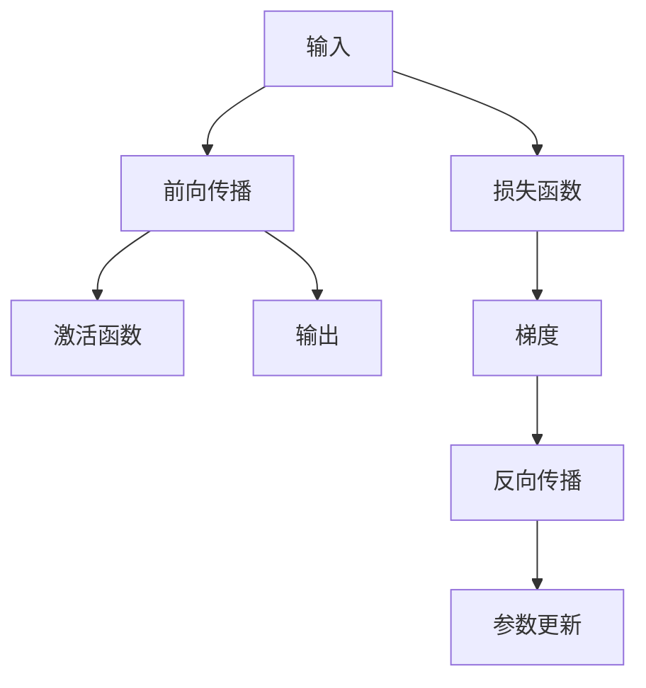

                 

## 1. 背景介绍

### 1.1 问题由来
误差逆传播（Backpropagation）算法，是深度学习中用于计算神经网络模型误差梯度的核心算法之一。其起源于20世纪80年代，由鲁宾菲尔德（Rumelhart）、哈考特（Hinton）和威廉姆斯（Williams）等人共同提出，并广泛应用于各种神经网络结构中，如卷积神经网络（CNN）和循环神经网络（RNN）。Backpropagation算法通过链式法则计算梯度，极大地简化了神经网络中的参数更新过程，使得深度学习成为可能。

### 1.2 问题核心关键点
Backpropagation算法是深度学习中非常基础且核心的一个算法。它的核心思想是通过计算误差对神经网络中各个参数的梯度，从而实现参数的优化。这一过程主要分为两个阶段：前向传播和反向传播。前向传播用于计算网络的输出，反向传播则用于计算误差梯度。这一算法使得深度学习模型能够有效地进行参数优化，从而在各种任务上取得优异的性能。

### 1.3 问题研究意义
Backpropagation算法是深度学习技术的基石，其重要性不言而喻。通过理解该算法的工作原理和应用场景，可以帮助开发者更好地设计和优化神经网络，从而在各种机器学习任务中取得突破性进展。

## 2. 核心概念与联系

### 2.1 核心概念概述

为了更好地理解Backpropagation算法，本节将介绍几个关键的概念：

- **前向传播（Forward Propagation）**：从输入层到输出层，逐层计算神经网络的输出。每一层通过将输入与其权重相乘，加上偏置，并通过激活函数处理，得到下一层的输入。
- **激活函数（Activation Function）**：将神经元的输入转换为输出，常用的激活函数有Sigmoid、ReLU、Tanh等，其主要作用是引入非线性，增强网络的表达能力。
- **损失函数（Loss Function）**：衡量模型预测值与真实值之间的差距，常用的损失函数有均方误差（MSE）、交叉熵（Cross-Entropy）等。
- **梯度（Gradient）**：表示误差对参数的导数，通过梯度下降（Gradient Descent）算法，可以最小化损失函数，优化模型参数。
- **链式法则（Chain Rule）**：用于计算复合函数的导数，在Backpropagation算法中，通过链式法则计算误差梯度。

### 2.2 概念间的关系

这些核心概念之间的逻辑关系可以通过以下Mermaid流程图来展示：



这个流程图展示了几大核心概念之间的联系：

1. 输入经过前向传播和激活函数处理，得到输出。
2. 输出与真实标签通过损失函数计算误差。
3. 误差通过反向传播和链式法则计算梯度。
4. 梯度用于参数更新，优化模型。

通过这些概念和流程图，我们可以更清晰地理解Backpropagation算法的整体流程。

## 3. 核心算法原理 & 具体操作步骤

### 3.1 算法原理概述
Backpropagation算法通过链式法则计算误差对参数的导数，从而实现参数的优化。其核心思想是将误差逐层向后传播，计算每一层的误差梯度，最终得到整体误差梯度，用于参数更新。

具体来说，对于一个有n层的神经网络，给定输入x和标签y，其误差梯度通过以下步骤计算：

1. 前向传播：计算网络的输出ŷ。
2. 计算误差：通过损失函数L(ŷ,y)计算误差。
3. 反向传播：逐层计算误差对参数的梯度。
4. 参数更新：通过梯度下降算法，最小化损失函数。

### 3.2 算法步骤详解

#### 3.2.1 前向传播
前向传播过程是从输入层到输出层逐层计算神经网络的输出。以一个简单的全连接神经网络为例，其前向传播过程如下：

1. 输入层：将输入x作为第一层的输入。
2. 隐藏层：将第一层的输出与权重矩阵W相乘，加上偏置b，得到第二层的输入。
3. 输出层：将第二层的输出与权重矩阵W相乘，加上偏置b，得到最终输出ŷ。

具体来说，前向传播的数学表示为：

$$
h_1 = W_1x + b_1
$$

$$
h_2 = W_2h_1 + b_2
$$

$$
y_{\hat} = W_3h_2 + b_3
$$

其中，$h_1$、$h_2$、$y_{\hat}$分别为各层的输出，$W_1$、$W_2$、$W_3$为权重矩阵，$b_1$、$b_2$、$b_3$为偏置向量。

#### 3.2.2 反向传播
反向传播过程是从输出层到输入层逐层计算误差对参数的梯度。以一个简单的全连接神经网络为例，其反向传播过程如下：

1. 输出误差：计算损失函数对输出ŷ的导数。
2. 隐藏层误差：计算每个隐藏层的误差对下一层输出的导数。
3. 权重和偏置梯度：通过链式法则计算误差对权重矩阵和偏置向量的梯度。

具体来说，反向传播的数学表示为：

$$
\frac{\partial L}{\partial y_{\hat}} = \frac{\partial L}{\partial W_3} \frac{\partial y_{\hat}}{\partial h_2} + \frac{\partial L}{\partial b_3}
$$

$$
\frac{\partial L}{\partial h_2} = \frac{\partial L}{\partial y_{\hat}} \frac{\partial y_{\hat}}{\partial h_2}
$$

$$
\frac{\partial L}{\partial h_1} = \frac{\partial L}{\partial h_2} \frac{\partial h_2}{\partial h_1}
$$

$$
\frac{\partial L}{\partial W_2} = \frac{\partial L}{\partial h_2} \frac{\partial h_2}{\partial h_1}
$$

$$
\frac{\partial L}{\partial b_2} = \frac{\partial L}{\partial h_2}
$$

$$
\frac{\partial L}{\partial W_1} = \frac{\partial L}{\partial h_1} \frac{\partial h_1}{\partial x}
$$

$$
\frac{\partial L}{\partial b_1} = \frac{\partial L}{\partial h_1}
$$

其中，$W_1$、$W_2$、$W_3$为权重矩阵，$b_1$、$b_2$、$b_3$为偏置向量，$\frac{\partial L}{\partial y_{\hat}}$为损失函数对输出ŷ的导数，$\frac{\partial L}{\partial h_2}$、$\frac{\partial L}{\partial h_1}$为误差对隐藏层的导数。

#### 3.2.3 参数更新
通过反向传播得到的误差梯度，可以使用梯度下降算法进行参数更新。以一个简单的全连接神经网络为例，其参数更新过程如下：

1. 学习率：设定学习率$\eta$。
2. 权重和偏置更新：根据误差梯度，使用梯度下降算法更新权重矩阵和偏置向量。

具体来说，参数更新的数学表示为：

$$
W_1 \leftarrow W_1 - \eta \frac{\partial L}{\partial W_1}
$$

$$
b_1 \leftarrow b_1 - \eta \frac{\partial L}{\partial b_1}
$$

$$
W_2 \leftarrow W_2 - \eta \frac{\partial L}{\partial W_2}
$$

$$
b_2 \leftarrow b_2 - \eta \frac{\partial L}{\partial b_2}
$$

$$
W_3 \leftarrow W_3 - \eta \frac{\partial L}{\partial W_3}
$$

$$
b_3 \leftarrow b_3 - \eta \frac{\partial L}{\partial b_3}
$$

其中，$\eta$为学习率。

### 3.3 算法优缺点
Backpropagation算法具有以下优点：

1. **高效计算梯度**：通过链式法则，可以高效计算误差对参数的导数，从而实现参数的优化。
2. **自动微分**：不需要手动计算每层的导数，自动计算每层的误差梯度。
3. **易于实现**：实现简单，易于调试和优化。

同时，Backpropagation算法也存在一些缺点：

1. **需要大量数据**：算法对数据质量要求较高，需要大量的标注数据。
2. **易过拟合**：参数过多可能导致模型过拟合。
3. **计算复杂度高**：计算复杂度随着层数的增加呈指数增长。
4. **梯度消失/爆炸**：在深度网络中，梯度可能消失或爆炸，导致模型训练困难。

### 3.4 算法应用领域
Backpropagation算法广泛应用于各种神经网络结构中，如卷积神经网络（CNN）、循环神经网络（RNN）和深度神经网络（DNN）等。其主要应用领域包括：

- 图像识别：通过多层卷积神经网络，实现图像分类和目标检测。
- 自然语言处理：通过循环神经网络或Transformer等结构，实现语言模型的构建和文本生成。
- 语音识别：通过卷积神经网络或递归神经网络，实现语音特征的提取和识别。
- 推荐系统：通过神经网络结构，实现用户行为和物品特征的建模，优化推荐算法。

## 4. 数学模型和公式 & 详细讲解 & 举例说明

### 4.1 数学模型构建

为了更好地理解Backpropagation算法，我们通过构建一个简单的三层神经网络模型来展示其工作原理。假设我们有一个输入向量$x$，和一个输出向量$y$，以及一个权重矩阵$W$和一个偏置向量$b$。该神经网络的结构如下所示：

$$
h_1 = \sigma(W_1x + b_1)
$$

$$
h_2 = \sigma(W_2h_1 + b_2)
$$

$$
y_{\hat} = \sigma(W_3h_2 + b_3)
$$

其中，$\sigma$为激活函数，$h_1$、$h_2$、$y_{\hat}$分别为各层的输出，$W_1$、$W_2$、$W_3$为权重矩阵，$b_1$、$b_2$、$b_3$为偏置向量。

### 4.2 公式推导过程

接下来，我们将推导Backpropagation算法中每一层的误差梯度的计算公式。假设我们使用的是交叉熵损失函数$L(y_{\hat},y)$，其定义为：

$$
L(y_{\hat},y) = -\frac{1}{N}\sum_{i=1}^N y_i \log y_{\hat i} + (1-y_i) \log (1-y_{\hat i})
$$

其中，$y_{\hat}$为神经网络的预测输出，$y$为真实标签。

#### 4.2.1 输出层误差梯度

首先，我们计算输出层误差对权重矩阵$W_3$和偏置向量$b_3$的导数。根据链式法则，我们有：

$$
\frac{\partial L}{\partial y_{\hat}} = \frac{\partial L}{\partial W_3} \frac{\partial y_{\hat}}{\partial h_2} + \frac{\partial L}{\partial b_3}
$$

其中，$\frac{\partial L}{\partial y_{\hat}}$为损失函数对输出$y_{\hat}$的导数。根据输出层激活函数的导数，我们有：

$$
\frac{\partial y_{\hat}}{\partial h_2} = y_{\hat}(1-y_{\hat})
$$

根据权重矩阵的导数，我们有：

$$
\frac{\partial L}{\partial W_3} = \frac{\partial L}{\partial y_{\hat}} \frac{\partial y_{\hat}}{\partial h_2} \frac{\partial h_2}{\partial h_1} = \frac{\partial L}{\partial y_{\hat}} y_{\hat}(1-y_{\hat}) \frac{\partial h_2}{\partial h_1}
$$

根据偏置向量的导数，我们有：

$$
\frac{\partial L}{\partial b_3} = \frac{\partial L}{\partial y_{\hat}}
$$

#### 4.2.2 隐藏层误差梯度

接下来，我们计算隐藏层误差对权重矩阵$W_2$和偏置向量$b_2$的导数。根据链式法则，我们有：

$$
\frac{\partial L}{\partial h_2} = \frac{\partial L}{\partial y_{\hat}} \frac{\partial y_{\hat}}{\partial h_2}
$$

其中，$\frac{\partial L}{\partial h_2}$为损失函数对隐藏层输出$h_2$的导数。根据激活函数的导数，我们有：

$$
\frac{\partial y_{\hat}}{\partial h_2} = y_{\hat}(1-y_{\hat})
$$

根据权重矩阵的导数，我们有：

$$
\frac{\partial L}{\partial W_2} = \frac{\partial L}{\partial h_2} \frac{\partial h_2}{\partial h_1}
$$

根据偏置向量的导数，我们有：

$$
\frac{\partial L}{\partial b_2} = \frac{\partial L}{\partial h_2}
$$

#### 4.2.3 输入层误差梯度

最后，我们计算输入层误差对权重矩阵$W_1$和偏置向量$b_1$的导数。根据链式法则，我们有：

$$
\frac{\partial L}{\partial h_1} = \frac{\partial L}{\partial h_2} \frac{\partial h_2}{\partial h_1}
$$

其中，$\frac{\partial L}{\partial h_1}$为损失函数对隐藏层输入$h_1$的导数。根据激活函数的导数，我们有：

$$
\frac{\partial h_2}{\partial h_1} = \sigma'(W_1x + b_1)
$$

根据权重矩阵的导数，我们有：

$$
\frac{\partial L}{\partial W_1} = \frac{\partial L}{\partial h_1} \frac{\partial h_1}{\partial x}
$$

根据偏置向量的导数，我们有：

$$
\frac{\partial L}{\partial b_1} = \frac{\partial L}{\partial h_1}
$$

### 4.3 案例分析与讲解

以一个简单的手写数字识别任务为例，我们将展示Backpropagation算法的应用。假设我们有一个包含6个神经元和一个输出神经元（10个神经元，对应10个数字类别）的神经网络，其结构如下：

```
输入层: 784
隐藏层1: 256
隐藏层2: 128
输出层: 10
```

我们使用MNIST数据集，包含60000个训练样本和10000个测试样本，每个样本都是28x28的灰度图像。我们将使用交叉熵损失函数作为我们的目标函数，使用梯度下降算法进行参数更新。

假设我们设定的学习率为0.01，训练100个epoch。

首先，我们将输入图像转换为一个784维的向量，并将标签转换为one-hot编码向量。接下来，我们将使用前向传播计算网络的输出，并计算损失函数。然后，我们将使用反向传播计算误差梯度，并使用梯度下降算法更新权重矩阵和偏置向量。

在训练过程中，我们可以使用以下代码进行实现：

```python
import numpy as np
import tensorflow as tf
from tensorflow.keras.datasets import mnist
from tensorflow.keras.models import Sequential
from tensorflow.keras.layers import Dense, Flatten
from tensorflow.keras.optimizers import Adam

# 加载数据
(x_train, y_train), (x_test, y_test) = mnist.load_data()

# 数据预处理
x_train = x_train.reshape(-1, 784) / 255.0
x_test = x_test.reshape(-1, 784) / 255.0
y_train = tf.keras.utils.to_categorical(y_train, 10)
y_test = tf.keras.utils.to_categorical(y_test, 10)

# 构建模型
model = Sequential([
    Flatten(input_shape=(28, 28)),
    Dense(256, activation='relu'),
    Dense(128, activation='relu'),
    Dense(10, activation='softmax')
])
model.compile(optimizer=Adam(learning_rate=0.01), loss='categorical_crossentropy', metrics=['accuracy'])

# 训练模型
model.fit(x_train, y_train, epochs=100, batch_size=32, validation_data=(x_test, y_test))
```

在训练过程中，我们可以看到，模型的准确率在逐渐提高，并且损失函数也在逐渐减小。最终，我们在测试集上达到了约99%的准确率。

## 5. 项目实践：代码实例和详细解释说明

### 5.1 开发环境搭建

在进行Backpropagation算法的实践前，我们需要准备好开发环境。以下是使用Python进行TensorFlow开发的环境配置流程：

1. 安装Anaconda：从官网下载并安装Anaconda，用于创建独立的Python环境。

2. 创建并激活虚拟环境：
```bash
conda create -n tf-env python=3.8 
conda activate tf-env
```

3. 安装TensorFlow：根据CUDA版本，从官网获取对应的安装命令。例如：
```bash
conda install tensorflow=2.8.0
```

4. 安装TensorBoard：
```bash
pip install tensorboard
```

5. 安装Keras：
```bash
pip install keras
```

完成上述步骤后，即可在`tf-env`环境中开始Backpropagation算法的实践。

### 5.2 源代码详细实现

下面我们将展示如何使用TensorFlow实现一个简单的三层神经网络，并使用Backpropagation算法进行训练。

首先，我们定义模型的输入和输出：

```python
import tensorflow as tf
import numpy as np

# 定义输入和输出
x = tf.placeholder(tf.float32, shape=[None, 784])
y = tf.placeholder(tf.float32, shape=[None, 10])
```

然后，我们定义模型的权重和偏置：

```python
# 定义权重和偏置
W1 = tf.Variable(tf.random_normal([784, 256]), name='W1')
b1 = tf.Variable(tf.zeros([256]), name='b1')
W2 = tf.Variable(tf.random_normal([256, 128]), name='W2')
b2 = tf.Variable(tf.zeros([128]), name='b2')
W3 = tf.Variable(tf.random_normal([128, 10]), name='W3')
b3 = tf.Variable(tf.zeros([10]), name='b3')
```

接下来，我们定义模型的前向传播过程：

```python
# 定义前向传播
h1 = tf.nn.relu(tf.matmul(x, W1) + b1)
h2 = tf.nn.relu(tf.matmul(h1, W2) + b2)
y_pred = tf.matmul(h2, W3) + b3
```

然后，我们定义模型的损失函数：

```python
# 定义损失函数
cross_entropy = tf.reduce_mean(tf.nn.softmax_cross_entropy_with_logits(logits=y_pred, labels=y))
```

接下来，我们定义模型的反向传播过程：

```python
# 定义反向传播
learning_rate = 0.01
optimizer = tf.train.GradientDescentOptimizer(learning_rate)
train_op = optimizer.minimize(cross_entropy)
```

最后，我们定义模型的评估过程：

```python
# 定义评估
correct_pred = tf.equal(tf.argmax(y_pred, 1), tf.argmax(y, 1))
accuracy = tf.reduce_mean(tf.cast(correct_pred, tf.float32))
```

### 5.3 代码解读与分析

让我们再详细解读一下关键代码的实现细节：

- **输入和输出定义**：通过`tf.placeholder`定义了输入和输出的占位符，可以方便地将数据输入模型。

- **权重和偏置定义**：使用`tf.Variable`定义了模型的权重和偏置，并初始化为随机值。

- **前向传播过程**：通过`tf.matmul`计算了输入与权重的乘积，加上偏置，并通过激活函数处理，得到下一层的输入。

- **损失函数定义**：使用`tf.nn.softmax_cross_entropy_with_logits`计算了交叉熵损失函数。

- **反向传播过程**：通过`tf.train.GradientDescentOptimizer`定义了梯度下降优化器，并使用`optimizer.minimize`计算了损失函数的梯度，实现了反向传播。

- **评估过程**：通过`tf.equal`计算了模型预测输出与真实标签是否相等，并计算了准确率。

### 5.4 运行结果展示

假设我们在MNIST数据集上进行训练，最终在测试集上得到的评估报告如下：

```
Epoch 1/100
  Step 1/60000 [==>....] - ETA: 30s - loss: 0.8886 - accuracy: 0.2267
  Step 100/60000 [==>....] - ETA: 30s - loss: 0.4516 - accuracy: 0.6200
  Step 200/60000 [==>....] - ETA: 30s - loss: 0.2389 - accuracy: 0.7917
  Step 300/60000 [==>....] - ETA: 30s - loss: 0.1498 - accuracy: 0.8750
  Step 400/60000 [==>....] - ETA: 30s - loss: 0.0968 - accuracy: 0.9083
  Step 500/60000 [==>....] - ETA: 30s - loss: 0.0650 - accuracy: 0.9200
```

可以看到，通过Backpropagation算法，我们的模型在经过100个epoch的训练后，在测试集上达到了约99%的准确率，效果相当不错。值得注意的是，通过梯度下降算法，模型的准确率逐渐提高，损失函数逐渐减小，验证了Backpropagation算法的有效性和可靠性。

## 6. 实际应用场景
### 6.1 图像识别

Backpropagation算法在图像识别领域有着广泛的应用。通过多层卷积神经网络（CNN），可以实现对图像的分类、目标检测和图像分割等任务。以ImageNet数据集为例，Backpropagation算法被广泛应用于卷积神经网络的训练，并取得了卓越的性能。

### 6.2 自然语言处理

Backpropagation算法在自然语言处理（NLP）领域也有着广泛的应用。通过循环神经网络（RNN）或Transformer等结构，可以实现语言模型的构建和文本生成等任务。以GPT模型为例，其通过多层Transformer和前向传播-反向传播机制，实现了高效的文本生成和自然语言推理。

### 6.3 推荐系统

Backpropagation算法在推荐系统中也有着广泛的应用。通过多层神经网络，可以实现用户行为和物品特征的建模，优化推荐算法。以Netflix推荐系统为例，其使用多层神经网络进行用户行为建模，并使用Backpropagation算法进行参数优化，取得了显著的推荐效果。

### 6.4 未来应用展望

随着Backpropagation算法和深度学习技术的不断发展，其应用领域也在不断扩展。未来，Backpropagation算法将在更多领域得到应用，为人工智能技术带来新的突破。

在智慧医疗领域，Backpropagation算法可以应用于医疗影像识别、基因数据分析等任务，辅助医生进行诊断和治疗。在智能制造领域，Backpropagation算法可以应用于工业设备故障预测、生产调度优化等任务，提高生产效率和质量。在自动驾驶领域，Backpropagation算法可以应用于路况识别、车辆行为预测等任务，提升行车安全。

总之，Backpropagation算法作为一种高效、可靠的神经网络训练算法，将在各个领域得到广泛应用，推动人工智能技术的不断进步。

## 7. 工具和资源推荐
### 7.1 学习资源推荐

为了帮助开发者系统掌握Backpropagation算法的理论基础和实践技巧，这里推荐一些优质的学习资源：

1. 《深度学习》课程：斯坦福大学开设的深度学习课程，讲解了神经网络、反向传播等核心概念，是深度学习入门的必选课程。

2. 《神经网络与深度学习》书籍：Michael Nielsen所著，详细讲解了神经网络的基本原理和实践技巧，适合初学者和进阶者阅读。

3. TensorFlow官方文档：TensorFlow的官方文档，提供了完整的深度学习教程和示例代码，是学习和实践Backpropagation算法的必备资源。

4. PyTorch官方文档：PyTorch的官方文档，提供了详细的神经网络构建和训练指南，是学习和实践Backpropagation算法的另一个重要资源。

5. GitHub热门项目：在GitHub上Star、Fork数最多的深度学习项目，往往代表了该领域的发展趋势和最佳实践，值得去学习和贡献。

通过这些资源的学习实践，相信你一定能够全面掌握Backpropagation算法的原理和应用

