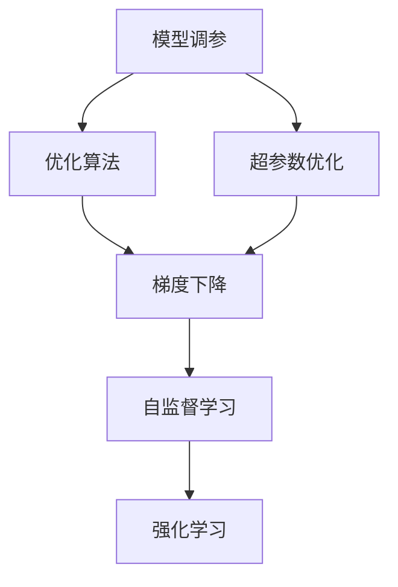
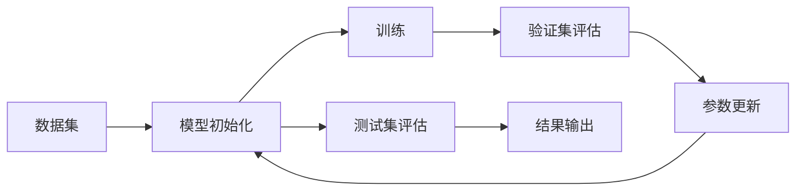
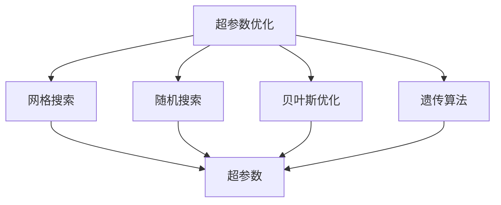
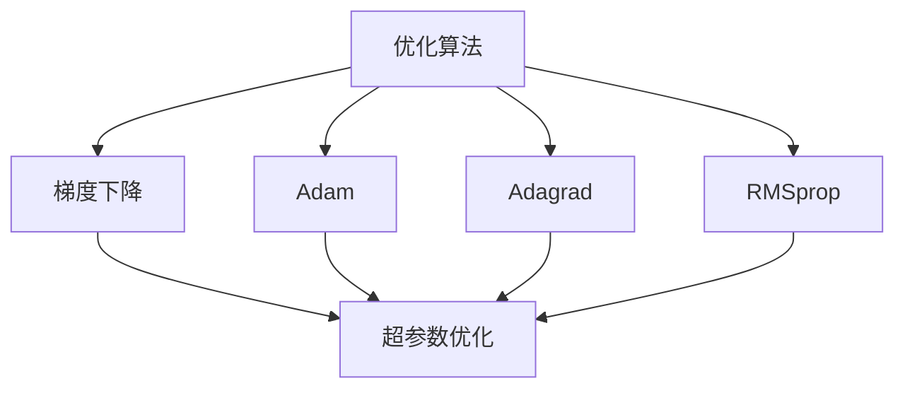
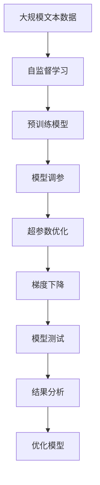

                 

# 调参侠转行炼丹师，软件2.0工程师的自我修养

> 关键词：模型调参,优化算法,深度学习,超参数优化,机器学习,工程实践,自监督学习,强化学习,梯度下降,神经网络

## 1. 背景介绍

### 1.1 问题由来
近年来，随着深度学习技术的快速发展，人工智能领域迎来了爆发式增长。在这个过程中，模型调参成为了软件工程师、数据科学家等“调参侠”们必须掌握的关键技能。无论是构建神经网络、优化算法，还是实现自监督学习、强化学习，调参始终是通往高性能模型的必经之路。然而，调参过程往往充满了挑战和不确定性，需要大量的经验和技术积累，使得“调参侠”们不得不面对复杂且繁琐的调参任务。

### 1.2 问题核心关键点
模型调参的核心在于找到一组最优的超参数，使得模型在给定数据集上达到最佳的性能。通常，超参数包括学习率、批大小、优化算法、正则化系数、网络结构等。调参的目标是最大化模型的预测准确度、泛化能力和运行效率。然而，超参数的优化往往是一个高维的非凸优化问题，存在大量的局部最优解，且需要耗费大量时间和资源。

调参侠在调参过程中，往往会遇到以下问题：

- 超参数空间巨大且非凸，难以找到全局最优解。
- 训练数据量有限，无法充分探索超参数空间。
- 模型训练过程容易出现过拟合或欠拟合。
- 超参数对模型的性能影响显著，但很难直接观察和控制。
- 调参过程需要反复试验和调整，缺乏自动化和智能化手段。

### 1.3 问题研究意义
模型调参是人工智能模型开发的重要环节，其优劣直接影响到模型的性能和实用性。通过有效的调参方法，可以显著提升模型性能，降低开发成本，加速模型应用。

调参研究具有重要意义：

1. **提高模型性能**：通过调参，找到最优的超参数组合，使模型在给定数据集上获得更好的预测性能。
2. **加速模型开发**：调参优化可以减少手动试验的次数，提高模型开发的效率。
3. **降低开发成本**：合理的调参方法可以减少资源浪费，降低模型开发的成本。
4. **实现模型自动化**：通过调参自动化，可以实现模型的快速迭代和优化，适应不同的应用场景。

## 2. 核心概念与联系

### 2.1 核心概念概述

调参侠转型炼丹师，是为了更好地理解和掌握深度学习模型调参的技术和方法。以下介绍几个关键概念及其相互关系：

- **模型调参**：通过调整模型的超参数，优化模型在给定数据集上的性能。模型调参是机器学习和深度学习领域的一项重要技术，对模型的准确性和泛化能力有直接影响。
- **优化算法**：模型调参的核心在于优化算法。常见的优化算法包括梯度下降、Adam、Adagrad、RMSprop等，用于求解损失函数的最小值。优化算法的选择和参数设置对模型调参效果有重要影响。
- **超参数优化**：指通过算法和自动化技术，自动搜索最优的超参数组合。超参数优化是模型调参的重要手段，可以显著提高调参效率和效果。
- **自监督学习**：通过无监督学习任务训练模型，使其学习到丰富的特征表示。自监督学习可以提升模型的鲁棒性和泛化能力，使得调参过程更加高效。
- **强化学习**：通过奖励机制，优化模型的超参数设置。强化学习可以引导模型在超参数空间中自动探索最优解，提升模型调参的智能化水平。
- **梯度下降**：梯度下降是模型调参中最常用的优化算法之一，通过不断迭代更新参数，使损失函数最小化。梯度下降的收敛速度和稳定性对调参效果有重要影响。

这些概念之间的逻辑关系可以通过以下Mermaid流程图来展示：



这个流程图展示了几者之间的联系：模型调参依赖于优化算法，而优化算法中的梯度下降可以加速超参数的搜索过程。自监督学习和强化学习是调参过程中的高级技术手段，可以进一步提升模型调参的效果。

### 2.2 概念间的关系

这些核心概念之间存在着紧密的联系，形成了模型调参的整体生态系统。

#### 2.2.1 模型调参的基本流程



这个流程图展示了模型调参的基本流程：

1. **数据集准备**：收集和清洗数据集。
2. **模型初始化**：选择模型架构和超参数，初始化模型权重。
3. **训练**：使用优化算法和损失函数，最小化损失函数，更新模型参数。
4. **验证集评估**：在验证集上评估模型性能，调整超参数。
5. **参数更新**：根据验证集评估结果，更新模型参数。
6. **测试集评估**：在测试集上评估模型性能，输出结果。

#### 2.2.2 超参数优化方法



这个流程图展示了超参数优化的几种常见方法：

1. **网格搜索**：在预定义的超参数范围内搜索最优解。
2. **随机搜索**：在超参数空间中随机采样，找到最优解。
3. **贝叶斯优化**：利用贝叶斯定理，动态调整超参数搜索范围，加速找到最优解。
4. **遗传算法**：模拟自然进化过程，逐步优化超参数。

#### 2.2.3 优化算法选择



这个流程图展示了优化算法的几种常见选择：

1. **梯度下降**：基本的优化算法，具有收敛稳定、易于实现的优点。
2. **Adam**：基于梯度下降的变种，具有收敛速度快、易于并行计算的优点。
3. **Adagrad**：自适应学习率的优化算法，适用于稀疏数据和动态变化的数据集。
4. **RMSprop**：改进自适应学习率的算法，适用于非平稳目标函数。

### 2.3 核心概念的整体架构

最后，我们用一个综合的流程图来展示这些核心概念在大模型调参过程中的整体架构：



这个综合流程图展示了从自监督学习到模型调参的完整过程。模型通过自监督学习获得预训练知识，然后进行模型调参优化，找到最优的超参数组合，最终在测试集上评估模型性能，进行结果分析和模型优化。

## 3. 核心算法原理 & 具体操作步骤
### 3.1 算法原理概述

模型调参的基本原理是通过优化算法，调整模型的超参数，使得模型在给定数据集上达到最优性能。调参过程通常包括以下几个步骤：

1. **数据预处理**：收集和准备训练数据集，并进行数据清洗和预处理。
2. **模型选择和初始化**：选择适合的模型架构和超参数，并进行模型初始化。
3. **训练**：使用优化算法和损失函数，最小化损失函数，更新模型参数。
4. **验证集评估**：在验证集上评估模型性能，调整超参数。
5. **测试集评估**：在测试集上评估模型性能，输出结果。

调参的核心在于选择合适的优化算法和超参数优化方法，找到最优的超参数组合。优化算法通常采用梯度下降等基于导数的方法，超参数优化方法则包括网格搜索、随机搜索、贝叶斯优化等。

### 3.2 算法步骤详解

#### 3.2.1 数据预处理

数据预处理是调参的基础步骤。常见数据预处理包括：

1. **数据清洗**：去除缺失值、噪声和异常值，确保数据集的质量。
2. **特征提取**：将原始数据转换为模型可接受的特征表示。
3. **数据划分**：将数据集划分为训练集、验证集和测试集，保证模型评估的公正性。

#### 3.2.2 模型选择和初始化

模型选择和初始化是调参的起点。常见模型选择和初始化包括：

1. **模型架构选择**：根据任务类型选择合适的模型架构，如卷积神经网络、循环神经网络、Transformer等。
2. **超参数设置**：根据任务特点设置模型的超参数，如学习率、批大小、正则化系数等。
3. **模型初始化**：对模型参数进行随机初始化，或者使用预训练模型初始化。

#### 3.2.3 训练

训练是调参的核心步骤。训练过程包括：

1. **前向传播**：将训练数据输入模型，计算模型的输出。
2. **损失函数计算**：计算模型输出与真实标签之间的误差。
3. **反向传播**：计算模型参数的梯度，根据梯度更新模型参数。
4. **参数更新**：使用优化算法和损失函数，最小化损失函数，更新模型参数。

#### 3.2.4 验证集评估

验证集评估是调参的重要步骤。验证集评估过程包括：

1. **模型评估**：在验证集上评估模型性能，如准确率、精度、召回率等。
2. **超参数调整**：根据验证集评估结果，调整超参数。
3. **模型保存**：保存验证集上性能最优的模型，作为后续调参的基础。

#### 3.2.5 测试集评估

测试集评估是调参的最终步骤。测试集评估过程包括：

1. **模型评估**：在测试集上评估模型性能，如准确率、精度、召回率等。
2. **模型输出**：根据测试集评估结果，输出模型的预测结果。
3. **结果分析**：分析模型在测试集上的性能表现，总结调参结果。

### 3.3 算法优缺点

模型调参方法具有以下优点：

1. **提高模型性能**：通过调参，找到最优的超参数组合，使模型在给定数据集上获得更好的预测性能。
2. **降低开发成本**：调参优化可以减少手动试验的次数，提高模型开发的效率。
3. **实现模型自动化**：通过调参自动化，可以实现模型的快速迭代和优化，适应不同的应用场景。

同时，模型调参也存在以下缺点：

1. **调参过程耗时较长**：调参过程需要大量的试验和调整，耗费大量时间和资源。
2. **超参数选择困难**：超参数的选择和调整需要丰富的经验和专业知识，难度较大。
3. **模型泛化能力有限**：调参过程依赖于训练数据集，泛化能力有限。

### 3.4 算法应用领域

模型调参在深度学习领域有广泛的应用。以下是几个常见的应用领域：

1. **计算机视觉**：调参应用于图像分类、目标检测、图像分割等任务。
2. **自然语言处理**：调参应用于文本分类、情感分析、机器翻译等任务。
3. **语音识别**：调参应用于语音识别、说话人识别等任务。
4. **推荐系统**：调参应用于个性化推荐、广告推荐等任务。
5. **强化学习**：调参应用于智能控制、游戏AI等任务。

## 4. 数学模型和公式 & 详细讲解  
### 4.1 数学模型构建

调参侠转型炼丹师，需要掌握数学模型和公式的构建和推导。以下是几个关键的数学模型和公式：

#### 4.1.1 梯度下降算法

梯度下降算法是模型调参中最常用的优化算法之一。其目标是通过不断迭代更新参数，使损失函数最小化。梯度下降算法的数学模型可以表示为：

$$
w_{t+1} = w_t - \eta \nabla L(w_t)
$$

其中，$w_t$ 表示第 $t$ 次迭代时的模型参数，$\eta$ 表示学习率，$L(w_t)$ 表示损失函数。

#### 4.1.2 交叉熵损失函数

交叉熵损失函数是深度学习中最常用的损失函数之一，用于衡量模型输出与真实标签之间的误差。交叉熵损失函数的数学模型可以表示为：

$$
L = -\frac{1}{N}\sum_{i=1}^{N}\sum_{j=1}^{C}y_{i,j}\log\hat{y}_{i,j}
$$

其中，$N$ 表示样本数量，$C$ 表示类别数量，$y_{i,j}$ 表示样本 $i$ 的标签是否属于类别 $j$，$\hat{y}_{i,j}$ 表示模型对样本 $i$ 的预测概率。

#### 4.1.3 正则化技术

正则化技术是模型调参中常用的防止过拟合的方法。常见的正则化技术包括L1正则、L2正则、Dropout等。L2正则的数学模型可以表示为：

$$
L_{\text{reg}} = \frac{\lambda}{2N}\sum_{i=1}^{N}\sum_{j=1}^{d}w_{i,j}^2
$$

其中，$\lambda$ 表示正则化系数，$d$ 表示模型参数数量。

#### 4.1.4 强化学习算法

强化学习算法是一种通过奖励机制优化模型超参数的方法。常见的强化学习算法包括Q-learning、SARSA等。Q-learning的数学模型可以表示为：

$$
Q(s_t, a_t) = (1-\alpha)Q(s_t, a_t) + \alpha(r_{t+1} + \gamma\max_{a_{t+1}}Q(s_{t+1}, a_{t+1}))
$$

其中，$s_t$ 表示当前状态，$a_t$ 表示当前动作，$r_{t+1}$ 表示下一个状态下的奖励，$\alpha$ 表示学习率，$\gamma$ 表示折扣因子。

### 4.2 公式推导过程

以下是几个常用公式的推导过程：

#### 4.2.1 梯度下降算法的推导

梯度下降算法的推导过程如下：

$$
\begin{aligned}
L(w) &= \frac{1}{2N}\sum_{i=1}^{N}(y_i - \hat{y}_i)^2 \\
\nabla L(w) &= \frac{1}{N}\sum_{i=1}^{N}(y_i - \hat{y}_i)\nabla \hat{y}_i \\
&= \frac{1}{N}\sum_{i=1}^{N}(y_i - \hat{y}_i)f(x_i;w) \\
&= \frac{1}{N}\sum_{i=1}^{N}(y_i - \hat{y}_i)\nabla f(x_i;w) \\
w_{t+1} &= w_t - \eta \nabla L(w_t)
\end{aligned}
$$

其中，$f(x_i;w)$ 表示模型在输入 $x_i$ 下的输出，$\nabla f(x_i;w)$ 表示模型输出的梯度。

#### 4.2.2 交叉熵损失函数的推导

交叉熵损失函数的推导过程如下：

$$
\begin{aligned}
L(y, \hat{y}) &= -\frac{1}{N}\sum_{i=1}^{N}[y_i\log \hat{y}_i + (1-y_i)\log(1-\hat{y}_i)] \\
&= -\frac{1}{N}\sum_{i=1}^{N}\sum_{j=1}^{C}y_{i,j}\log\hat{y}_{i,j}
\end{aligned}
$$

其中，$y_{i,j}$ 表示样本 $i$ 的标签是否属于类别 $j$，$\hat{y}_{i,j}$ 表示模型对样本 $i$ 的预测概率。

#### 4.2.3 L2正则的推导

L2正则的推导过程如下：

$$
L_{\text{reg}} = \frac{\lambda}{2N}\sum_{i=1}^{N}\sum_{j=1}^{d}w_{i,j}^2
$$

其中，$\lambda$ 表示正则化系数，$d$ 表示模型参数数量。

#### 4.2.4 Q-learning的推导

Q-learning的推导过程如下：

$$
\begin{aligned}
Q(s_t, a_t) &= (1-\alpha)Q(s_t, a_t) + \alpha(r_{t+1} + \gamma\max_{a_{t+1}}Q(s_{t+1}, a_{t+1})) \\
&= (1-\alpha)Q(s_t, a_t) + \alpha(r_{t+1} + \gamma\max_{a_{t+1}}(Q(s_{t+1}, a_{t+1}) + \epsilon))
\end{aligned}
$$

其中，$s_t$ 表示当前状态，$a_t$ 表示当前动作，$r_{t+1}$ 表示下一个状态下的奖励，$\alpha$ 表示学习率，$\gamma$ 表示折扣因子，$\epsilon$ 表示探索因子。

## 5. 项目实践：代码实例和详细解释说明
### 5.1 开发环境搭建

在进行调参实践前，我们需要准备好开发环境。以下是使用Python进行PyTorch开发的环境配置流程：

1. 安装Anaconda：从官网下载并安装Anaconda，用于创建独立的Python环境。

2. 创建并激活虚拟环境：
```bash
conda create -n pytorch-env python=3.8 
conda activate pytorch-env
```

3. 安装PyTorch：根据CUDA版本，从官网获取对应的安装命令。例如：
```bash
conda install pytorch torchvision torchaudio cudatoolkit=11.1 -c pytorch -c conda-forge
```

4. 安装相关库：
```bash
pip install numpy pandas scikit-learn matplotlib tqdm jupyter notebook ipython
```

完成上述步骤后，即可在`pytorch-env`环境中开始调参实践。

### 5.2 源代码详细实现

这里以一个简单的二分类任务为例，使用PyTorch和Scikit-learn进行超参数调优。

```python
import numpy as np
from sklearn.model_selection import GridSearchCV
from sklearn.linear_model import LogisticRegression
from sklearn.metrics import accuracy_score
from torch import nn, optim
from torch.utils.data import TensorDataset, DataLoader

# 定义数据集
X = np.array([[0, 0], [0, 1], [1, 0], [1, 1]])
y = np.array([0, 1, 1, 0])

# 定义模型
class LogisticRegressionModel(nn.Module):
    def __init__(self):
        super(LogisticRegressionModel, self).__init__()
        self.fc1 = nn.Linear(2, 2)
        self.fc2 = nn.Linear(2, 1)
        self.sigmoid = nn.Sigmoid()

    def forward(self, x):
        x = self.fc1(x)
        x = self.fc2(x)
        x = self.sigmoid(x)
        return x

# 定义损失函数和优化器
criterion = nn.BCELoss()
optimizer = optim.SGD

# 定义超参数空间
params = {
    'lr': [0.001, 0.01, 0.1],
    'batch_size': [2, 4, 8]
}

# 定义训练函数
def train(model, optimizer, criterion, X, y, num_epochs):
    for epoch in range(num_epochs):
        model.train()
        loss = 0
        for i in range(len(X)):
            inputs, labels = X[i], y[i]
            optimizer.zero_grad()
            outputs = model(inputs)
            loss += criterion(outputs, labels)
            loss.backward()
            optimizer.step()
        print(f'Epoch {epoch+1}, Loss: {loss:.4f}')

# 定义验证函数
def evaluate(model, X, y):
    model.eval()
    loss = 0
    predictions = []
    for i in range(len(X)):
        inputs, labels = X[i], y[i]
        outputs = model(inputs)
        loss += criterion(outputs, labels)
        predictions.append(outputs.item())
    print(f'Accuracy: {accuracy_score(y, predictions):.4f}')

# 定义网格搜索函数
def grid_search(X, y, params, num_epochs=100):
    clf = LogisticRegression()
    grid_search = GridSearchCV(clf, params, cv=5)
    grid_search.fit(X, y)
    print(f'Best parameters: {grid_search.best_params_}')
    train(model, optimizer, criterion, X, y, num_epochs)

# 启动调参实践
grid_search(X, y, params)
```

在这个代码中，我们首先定义了一个简单的二分类任务数据集，然后使用LogisticRegression模型进行超参数调优。具体步骤如下：

1. **定义数据集**：使用NumPy定义数据集X和标签y。
2. **定义模型**：定义一个简单的神经网络模型LogisticRegressionModel。
3. **定义损失函数和优化器**：定义交叉熵损失函数和随机梯度下降优化器。
4. **定义超参数空间**：定义超参数空间，包括学习率和批大小。
5. **定义训练函数**：定义训练函数train，用于更新模型参数。
6. **定义验证函数**：定义验证函数evaluate，用于评估模型性能。
7. **定义网格搜索函数**：定义网格搜索函数grid_search，用于搜索最优超参数组合。
8. **启动调参实践**：调用grid_search函数进行超参数调优。

### 5.3 代码解读与分析

让我们再详细解读一下关键代码的实现细节：

**定义数据集**：

```python
X = np.array([[0, 0], [0, 1], [1, 0], [1, 1]])
y = np.array([0, 1, 1, 0])
```

我们定义了一个4个样本的二维数据集X和对应的标签y。这个数据集表示二分类任务，每个样本由两个特征组成。

**定义模型**：

```python
class LogisticRegressionModel(nn.Module):
    def __init__(self):
        super(LogisticRegressionModel, self).__init__()
        self.fc1 = nn.Linear(2, 2)
        self.fc2 = nn.Linear(2, 1)
        self.sigmoid = nn.Sigmoid()

    def forward(self, x):
        x = self.fc1(x)
        x = self.fc2(x)
        x = self.sigmoid(x)
        return x
```

我们定义了一个简单的两层神经网络模型，包含两个全连接层和一个Sigmoid激活函数。

**定义损失函数和优化器**：

```python
criterion = nn.BCELoss()
optimizer = optim.SGD
```

我们定义了交叉熵损失函数和随机梯度下降优化器。

**定义超参数空间**：

```python
params = {
    'lr': [0.001, 0.01, 0.1],
    'batch_size': [2, 4, 8]
}
```

我们定义了两个超参数：学习率和批大小。

**定义训练函数**：

```python
def train(model, optimizer, criterion, X, y, num_epochs):
    for epoch in range(num_epochs):
        model.train()
        loss = 0
        for i in range(len(X)):
            inputs, labels = X[i], y[i]
            optimizer.zero_grad()
            outputs = model(inputs)
            loss += criterion(outputs, labels)
            loss.backward()
            optimizer.step()
        print(f'Epoch {epoch+1}, Loss: {loss:.4f}')
```

我们定义了一个训练函数train，用于更新模型参数。在每个epoch中，对数据集进行迭代训练，计算损失函数，更新模型参数。

**定义验证函数**：

```python
def evaluate(model, X, y):
    model.eval()
    loss = 0
    predictions = []
    for i in range(len(X)):
        inputs, labels = X[i], y[i]
        outputs = model(inputs)
        loss += criterion(outputs, labels)
        predictions.append(outputs.item())
    print(f'Accuracy: {accuracy_score(y, predictions):.4f}')
```

我们定义了一个验证函数evaluate，用于评估模型性能。在验证集上计算损失函数，并输出模型在每个样本上的预测结果。

**定义网格搜索函数**：

```python


