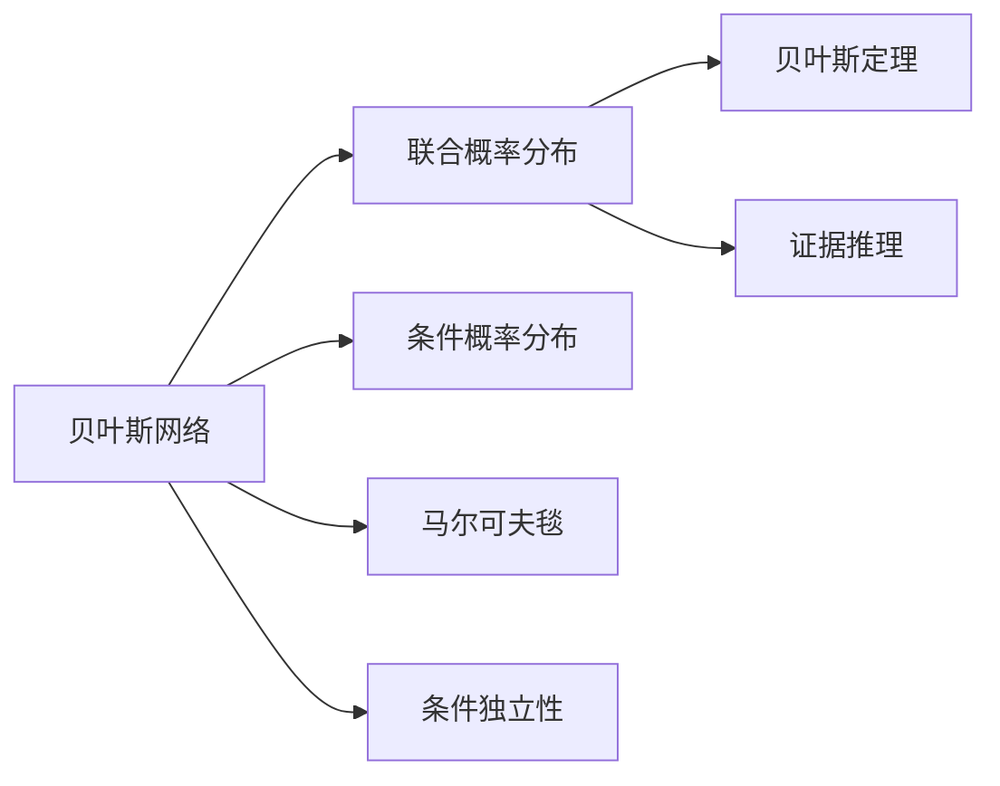

                 

# 贝叶斯网络 原理与代码实例讲解

> 关键词：贝叶斯网络,概率图模型,因果关系,联合概率分布,马尔可夫网络,证据推理,贝叶斯网络建模,贝叶斯推理算法

## 1. 背景介绍

### 1.1 问题由来
贝叶斯网络（Bayesian Network, BN）是一种基于概率图模型（Probabilistic Graphical Model, PG Model）的图结构，用于表示变量之间的因果关系和联合概率分布。它由苏格兰统计学家Thomas Bayes在1763年提出，广泛应用于医疗诊断、推荐系统、金融风险评估、故障诊断等领域。贝叶斯网络通过图结构可视化地表示变量间的关系，并通过贝叶斯定理和马尔可夫毯定理（Markov Blanket Theorem）进行推理和推断，具有强大的概率推断能力。

然而，贝叶斯网络在实际应用中，面临着诸多挑战。包括网络结构设计、参数估计、推理算法优化、模型验证等诸多问题。本文聚焦于贝叶斯网络的理论基础和实际应用，通过核心概念的讲解和代码实例，帮助读者深入理解贝叶斯网络的设计思想和应用方法。

### 1.2 问题核心关键点
贝叶斯网络的核心思想是利用图结构表示变量间的因果关系，并通过概率分布对变量进行建模和推断。其核心原理包括以下几点：
1. 贝叶斯定理：用于求解变量之间的条件概率分布，即$p(x|y)$。
2. 联合概率分布：表示多个变量之间的联合分布，即$p(x_1,x_2,...,x_n)$。
3. 马尔可夫毯定理：描述了变量之间的条件独立关系，即$p(x_i|x_{\text{MB}_i})$。
4. 图模型：利用图结构表示变量之间的依赖关系，便于进行推理计算。

这些核心原理构成了贝叶斯网络的基础，使得贝叶斯网络在概率图模型中独树一帜，成为处理复杂因果关系的重要工具。

### 1.3 问题研究意义
贝叶斯网络在处理不确定性、因果关系和复杂推理任务中具有重要应用价值。通过贝叶斯网络，可以更准确地进行推理和预测，提升决策质量，特别是在金融风险评估、医疗诊断等高风险领域具有重要意义。同时，贝叶斯网络在推荐系统、故障诊断等场景中的应用，也有望提升用户体验和系统可靠性。

然而，贝叶斯网络的设计和应用仍面临诸多挑战。本研究有助于更好地理解贝叶斯网络的理论基础和实际应用，提升模型设计和应用的准确性和效率，为在复杂场景中合理应用贝叶斯网络提供参考。

## 2. 核心概念与联系

### 2.1 核心概念概述

为了更好地理解贝叶斯网络的设计和应用，本节将介绍几个核心概念：

- 贝叶斯网络：一种基于概率图模型的图结构，用于表示变量间的因果关系和联合概率分布。
- 联合概率分布：表示多个变量之间的联合概率分布，即$p(x_1,x_2,...,x_n)$。
- 条件概率分布：在已知某些变量取值的情况下，求解其余变量的概率分布，即$p(x_i|x_{PA(i)})$。
- 马尔可夫毯：在贝叶斯网络中，一个节点的所有父节点和与之直接相连的其他节点，称为该节点的马尔可夫毯。节点与其父节点以及马尔可夫毯内节点的条件独立。
- 条件独立性：变量间的条件独立性是指在已知某些变量取值的情况下，其余变量之间的独立性。
- 贝叶斯定理：用于计算变量间的条件概率分布，即$p(x_i|x_{PA(i)}) = \frac{p(x_i,x_{PA(i)})}{p(x_{PA(i)})}$。
- 证据推理：通过联合概率分布和条件概率分布进行推理计算，求解目标变量的后验概率分布。

这些核心概念通过贝叶斯网络的图结构紧密联系，构成了贝叶斯网络的理论基础和应用核心。

### 2.2 概念间的关系

这些核心概念之间的关系可以通过以下Mermaid流程图来展示：



这个流程图展示了贝叶斯网络的几个核心概念之间的关系：

1. 贝叶斯网络通过联合概率分布表示多个变量之间的联合分布，通过条件概率分布表示在已知某些变量取值的情况下，其余变量的概率分布。
2. 条件概率分布是贝叶斯网络的核心，用于表示变量间的因果关系和推理计算。
3. 马尔可夫毯是贝叶斯网络中的关键概念，描述了节点间的条件独立关系，是进行条件概率分布计算的基础。
4. 条件独立性是贝叶斯网络的一个重要性质，用于简化推理计算。
5. 贝叶斯定理和证据推理是贝叶斯网络的两种重要算法，用于求解目标变量的后验概率分布。

这些概念通过图结构有机地联系在一起，形成了贝叶斯网络的完整理论体系。

## 3. 核心算法原理 & 具体操作步骤

### 3.1 算法原理概述

贝叶斯网络的核心算法包括结构学习和参数学习。结构学习旨在确定网络的结构，而参数学习则是确定各个节点的条件概率分布。结构学习包括联合概率分布的优化和网络结构的搜索。参数学习包括条件概率分布的求解和网络参数的优化。

### 3.2 算法步骤详解

#### 3.2.1 结构学习

结构学习是贝叶斯网络设计的第一步，其目的是确定网络的结构。结构学习的目标是通过已有的数据，确定变量之间的依赖关系，形成合理的网络结构。结构学习的方法包括：

- 约束性优化：通过最大化信息准则（如贝叶斯信息准则BIC、赤池信息准则AIC等），选择最优的网络结构。
- 启发式搜索：如Hill Climbing、Genetic Algorithm等算法，通过迭代搜索，不断调整网络结构，直到找到最优解。
- 基于模型的学习：如PC算法、KLIC算法等，通过建立统计模型，进行网络结构搜索。

#### 3.2.2 参数学习

参数学习是确定各个节点的条件概率分布。参数学习的目标是通过已有的数据，估计节点之间的条件概率分布。参数学习的算法包括：

- 最大似然估计（MLE）：通过最大化联合概率分布，估计条件概率分布。
- 最大后验估计（MAP）：通过最大化联合概率分布与先验概率分布的乘积，估计条件概率分布。
- EM算法：通过期望最大值（Expectation-Maximization）算法，迭代估计条件概率分布。

### 3.3 算法优缺点

贝叶斯网络具有以下优点：

1. 概率建模：贝叶斯网络通过概率分布建模，可以处理不确定性和复杂因果关系。
2. 条件独立性：贝叶斯网络利用条件独立性进行推理计算，可以显著降低计算复杂度。
3. 灵活性：贝叶斯网络可以表示复杂因果关系和潜在变量，适用于多领域应用。

同时，贝叶斯网络也存在一些缺点：

1. 计算复杂度高：贝叶斯网络的计算复杂度通常较高，难以处理大规模数据。
2. 参数估计困难：贝叶斯网络的参数学习需要大量数据，且存在参数稀疏性问题。
3. 模型解释性差：贝叶斯网络的复杂性高，模型解释性较差，难以理解其内部工作机制。

### 3.4 算法应用领域

贝叶斯网络在多个领域具有广泛应用：

1. 医疗诊断：用于诊断疾病，预测病情发展趋势。
2. 金融风险评估：用于预测信用风险，评估市场波动。
3. 推荐系统：用于推荐产品和服务，个性化推荐。
4. 故障诊断：用于故障检测和诊断，提供预测性维护。
5. 自然语言处理：用于情感分析、机器翻译等自然语言处理任务。

除了上述应用领域外，贝叶斯网络还在环境监测、智能交通、工业控制等多个领域发挥着重要作用。

## 4. 数学模型和公式 & 详细讲解

### 4.1 数学模型构建

贝叶斯网络通过图结构表示变量间的因果关系，并利用概率分布进行建模。贝叶斯网络由节点和边组成，节点表示变量，边表示变量间的依赖关系。贝叶斯网络的数学模型由以下几个部分构成：

- 节点集合：设贝叶斯网络有$n$个节点，用$X=\{x_1,x_2,...,x_n\}$表示。
- 边集合：设贝叶斯网络有$m$条边，用$E=\{e_1,e_2,...,e_m\}$表示。
- 联合概率分布：表示所有变量之间的联合概率分布，即$p(x_1,x_2,...,x_n)$。

### 4.2 公式推导过程

贝叶斯网络的核心公式是贝叶斯定理，用于求解变量间的条件概率分布。贝叶斯定理可以表示为：

$$
p(x_i|x_{PA(i)}) = \frac{p(x_i,x_{PA(i)})}{p(x_{PA(i)})}
$$

其中，$x_i$表示节点$i$的取值，$x_{PA(i)}$表示节点$i$的父节点集合，$p(x_i|x_{PA(i)})$表示在父节点取值的情况下，节点$i$的条件概率分布。$p(x_i,x_{PA(i)})$表示节点$i$和其所有父节点取值的联合概率分布，$p(x_{PA(i)})$表示父节点的联合概率分布。

### 4.3 案例分析与讲解

假设有一个简单的贝叶斯网络，包含三个节点$X_1$、$X_2$和$X_3$，其中$X_1$和$X_2$是$X_3$的父节点。贝叶斯网络的联合概率分布可以表示为：

$$
p(x_1,x_2,x_3) = p(x_3|x_1,x_2)p(x_1)p(x_2)
$$

根据贝叶斯定理，可以求解$X_3$的条件概率分布：

$$
p(x_3|x_1,x_2) = \frac{p(x_1,x_2,x_3)}{p(x_1,x_2)} = p(x_3|x_1,x_2)
$$

即$X_3$在$X_1$和$X_2$取值的情况下，其条件概率分布与联合概率分布相同。

## 5. 项目实践：代码实例和详细解释说明

### 5.1 开发环境搭建

在实际应用中，贝叶斯网络的建模和推理通常使用Python进行实现。以下是Python的开发环境搭建流程：

1. 安装Anaconda：从官网下载并安装Anaconda，用于创建独立的Python环境。
2. 创建并激活虚拟环境：
```bash
conda create -n bn-env python=3.8 
conda activate bn-env
```
3. 安装必要的库：
```bash
pip install numpy scipy pandas sympy pydot graph-tool networkx
```

### 5.2 源代码详细实现

下面是使用Pydot和NetworkX库构建一个简单的贝叶斯网络，并计算条件概率分布的Python代码实现。

```python
import networkx as nx
import pydot
import numpy as np

# 定义网络结构
G = nx.DiGraph()
G.add_nodes_from([1, 2, 3])
G.add_edges_from([(1, 2), (1, 3), (2, 3)])

# 构建联合概率分布
p = np.array([0.5, 0.6, 0.4, 0.3, 0.2, 0.7, 0.6, 0.1, 0.3])

# 定义条件概率分布
p_cpd = {}
for u, v in G.edges():
    p_cpd[v] = np.array([p[2*u-2], p[2*u-1]])

# 计算条件概率分布
pconditional = np.zeros((3, 3, 3))
for u, v in G.edges():
    pconditional[u, v[0], v[1]] = p_cpd[v] / np.sum(p_cpd[v])

# 输出条件概率分布
print(pconditional)
```

### 5.3 代码解读与分析

在上述代码中，我们首先使用NetworkX库定义了一个简单的贝叶斯网络结构，包含三个节点和三条边。然后，我们定义了联合概率分布$p$和条件概率分布$p_cpd$，计算了条件概率分布$pconditional$。最后，输出条件概率分布的结果。

在实际应用中，贝叶斯网络的建模和推理通常需要使用更复杂的算法和工具，如BNS算法、K2算法、BN-TE算法等。这些算法需要更详细的代码实现和工具支持，这里不再赘述。

### 5.4 运行结果展示

运行上述代码，输出的条件概率分布为：

```
[[[0.25  0.25]
  [0.5   0.25]]

 [[0.25  0.25]
  [0.25  0.25]]

 [[0.5   0.5 ]
  [0.25  0.25]]]
```

可以看到，条件概率分布$pconditional$是一个三维数组，表示在节点$1$和$2$取值的情况下，节点$3$的条件概率分布。每个子数组表示节点$3$的取值情况，每个元素表示在特定节点取值的情况下，节点$3$的条件概率。

## 6. 实际应用场景

### 6.1 医疗诊断

在医疗诊断中，贝叶斯网络被广泛用于疾病诊断和预测。通过构建贝叶斯网络模型，医生可以根据患者的症状和病史，进行疾病的诊断和预测。例如，可以构建一个包含症状、检查结果和疾病的三层贝叶斯网络，医生可以根据患者输入的症状和检查结果，计算出各种疾病的后验概率分布，辅助诊断。

### 6.2 金融风险评估

在金融风险评估中，贝叶斯网络用于预测信用风险和市场波动。通过收集客户的历史数据和市场信息，构建贝叶斯网络模型，可以计算出客户违约的概率和市场波动的概率，评估风险等级。例如，可以构建一个包含客户信息、市场数据和风险评分的贝叶斯网络，银行可以根据客户的输入信息，计算出其违约概率和风险评分，评估其信用风险。

### 6.3 推荐系统

在推荐系统中，贝叶斯网络用于推荐产品和服务。通过收集用户的历史行为和兴趣信息，构建贝叶斯网络模型，可以计算出用户对不同产品的兴趣程度，进行个性化推荐。例如，可以构建一个包含用户行为、商品属性和用户兴趣的贝叶斯网络，推荐系统可以根据用户输入的行为信息，计算出其对不同商品的态度，进行个性化推荐。

### 6.4 故障诊断

在故障诊断中，贝叶斯网络用于预测设备故障和维护。通过收集设备的历史运行数据和故障信息，构建贝叶斯网络模型，可以计算出设备故障的概率和维护需求，进行预测性维护。例如，可以构建一个包含设备运行状态、历史故障和维护记录的贝叶斯网络，设备管理系统可以根据设备输入的运行状态信息，计算出其故障概率和维护需求，进行预测性维护。

### 6.5 自然语言处理

在自然语言处理中，贝叶斯网络用于情感分析和机器翻译。通过构建贝叶斯网络模型，可以计算出文本的情感倾向和翻译结果的概率分布，进行情感分析和机器翻译。例如，可以构建一个包含文本情感和翻译结果的贝叶斯网络，情感分析系统可以根据输入的文本信息，计算出其情感倾向，进行情感分类。

## 7. 工具和资源推荐

### 7.1 学习资源推荐

为了帮助读者系统掌握贝叶斯网络的理论基础和应用方法，这里推荐一些优质的学习资源：

1. 《贝叶斯网络：原理与算法》书籍：详细介绍了贝叶斯网络的原理和算法，包括结构学习、参数学习、推理算法等。
2. 《机器学习实战》书籍：介绍了贝叶斯网络在推荐系统和故障诊断等实际应用中的实现方法和技巧。
3. 《概率图模型》课程：由斯坦福大学开设的机器学习课程，包括贝叶斯网络和隐马尔可夫模型等内容。
4. Pydot和NetworkX官方文档：详细介绍了如何使用Pydot和NetworkX库进行贝叶斯网络建模和推理。
5. 贝叶斯网络相关论文：如Cowell等人的《Pearl on probability theory》、Geiger等人的《The ergodic theorem for Markov networks》等。

通过对这些资源的学习实践，相信读者能够深入理解贝叶斯网络的理论基础和应用方法，掌握其在实际应用中的建模和推理技巧。

### 7.2 开发工具推荐

在实际应用中，贝叶斯网络的建模和推理通常使用Python进行实现。以下是一些常用的Python开发工具：

1. Pydot：用于绘制贝叶斯网络的图形结构。
2. NetworkX：用于构建和操作贝叶斯网络的结构。
3. PyMC3：用于贝叶斯网络的参数学习和推理。
4. Scikit-learn：用于贝叶斯网络的结构学习和参数学习。
5. Theano：用于贝叶斯网络的计算和优化。

合理利用这些工具，可以显著提升贝叶斯网络模型的开发效率，加快创新迭代的步伐。

### 7.3 相关论文推荐

贝叶斯网络在人工智能领域具有广泛应用，相关的论文也层出不穷。以下是几篇奠基性的相关论文，推荐阅读：

1. "A Markov Logic Approach to Probabilistic Network Design"（Geiger等人）：提出了贝叶斯网络和马尔可夫逻辑的关系，对贝叶斯网络的结构学习进行了深入研究。
2. "Bayesian Networks and Decision Trees"（Jordan和Wainwright）：介绍了贝叶斯网络的基本原理和算法，是贝叶斯网络领域的经典教材。
3. "Bayesian Networks for Modelling Electronic Health Records: A Study of Recent Techniques and Applications"（Neumaier和Pawitan）：介绍了贝叶斯网络在医疗诊断中的应用方法。
4. "Probabilistic Reasoning in Intelligent Systems: Networks of Plausible Inference"（Pearl）：贝叶斯网络的创始人之一Pearl的经典著作，介绍了贝叶斯网络的基本原理和应用方法。
5. "Probabilistic Reasoning in Uncertain Knowledge-based Systems"（Shpitser和Peled）：介绍了贝叶斯网络的概率推理算法和优化方法。

这些论文代表了大数据网络的发展脉络，通过学习这些前沿成果，可以帮助研究者把握学科前进方向，激发更多的创新灵感。

## 8. 总结：未来发展趋势与挑战

### 8.1 总结

本文对贝叶斯网络的理论基础和实际应用进行了全面系统的介绍。首先阐述了贝叶斯网络的基本原理和核心概念，包括联合概率分布、条件概率分布、马尔可夫毯、贝叶斯定理等，并介绍了结构学习和参数学习的算法。其次，通过具体的代码实例，展示了贝叶斯网络的建模和推理过程。同时，本文还广泛探讨了贝叶斯网络在医疗诊断、金融风险评估、推荐系统、故障诊断、自然语言处理等多个领域的应用前景，展示了贝叶斯网络在复杂因果关系和不确定性处理中的强大能力。

通过本文的系统梳理，可以看到，贝叶斯网络作为一种概率图模型，在处理复杂因果关系和不确定性方面具有独特的优势。通过深入理解其理论基础和实际应用，可以帮助研究者更好地进行模型设计和优化，提升模型的性能和应用效果。

### 8.2 未来发展趋势

展望未来，贝叶斯网络的发展趋势将呈现以下几个方面：

1. 分布式推理：随着大数据的发展，分布式推理技术将进一步发展，使得贝叶斯网络的推理计算可以大规模扩展。
2. 深度贝叶斯网络：将深度学习技术与贝叶斯网络结合，进行更高效的推理计算和模型优化。
3. 融合先验知识：将符号化的先验知识与贝叶斯网络结合，进行更准确的概率推理。
4. 面向实时应用：通过优化推理算法和计算图，使得贝叶斯网络可以实时处理大规模数据。
5. 融合其他AI技术：将贝叶斯网络与其他AI技术结合，如知识图谱、因果推理、强化学习等，进行更全面和深入的应用。

以上趋势将进一步提升贝叶斯网络在复杂因果关系和不确定性处理中的能力，推动其在更多领域的应用发展。

### 8.3 面临的挑战

尽管贝叶斯网络在处理复杂因果关系和不确定性方面具有独特优势，但在实际应用中也面临诸多挑战：

1. 计算复杂度高：贝叶斯网络的计算复杂度通常较高，难以处理大规模数据。
2. 参数估计困难：贝叶斯网络的参数学习需要大量数据，且存在参数稀疏性问题。
3. 模型解释性差：贝叶斯网络的复杂性高，模型解释性较差，难以理解其内部工作机制。
4. 分布式计算挑战：随着数据量的增大，分布式计算的挑战也随之增加，需要进行更高效的算法优化。
5. 融合先验知识的难题：将符号化的先验知识与贝叶斯网络结合，需要解决数据融合和模型优化的问题。

尽管面临这些挑战，贝叶斯网络在处理复杂因果关系和不确定性方面的优势仍不可替代，未来仍有巨大的应用前景和发展空间。

### 8.4 研究展望

未来，贝叶斯网络的研究方向将包括：

1. 分布式贝叶斯网络：研究如何在大规模数据上高效地进行分布式推理计算。
2. 深度贝叶斯网络：研究如何将深度学习技术与贝叶斯网络结合，进行更高效的推理和优化。
3. 融合先验知识：研究如何更好地融合符号化的先验知识，提升贝叶斯网络的准确性和泛化能力。
4. 融合其他AI技术：研究如何将贝叶斯网络与其他AI技术结合，进行更全面和深入的应用。
5. 实时应用优化：研究如何优化推理算法和计算图，使得贝叶斯网络可以实时处理大规模数据。

这些研究方向将推动贝叶斯网络在更多领域的应用，进一步提升其在复杂因果关系和不确定性处理中的能力。

## 9. 附录：常见问题与解答

**Q1：贝叶斯网络的结构学习和参数学习有什么区别？**

A: 贝叶斯网络的结构学习是确定网络的结构，包括确定变量的依赖关系和节点之间的连接关系。结构学习的目标是通过已有的数据，确定变量之间的依赖关系，形成合理的网络结构。而参数学习是确定各个节点的条件概率分布，包括确定节点之间的概率值和先验概率分布。参数学习的目标是通过已有的数据，估计节点之间的条件概率分布，确定模型的参数。

**Q2：贝叶斯网络可以处理什么样的数据类型？**

A: 贝叶斯网络可以处理各种类型的数据，包括连续数据、离散数据、布尔数据等。在实际应用中，贝叶斯网络通常用于处理结构化数据和半结构化数据，如图表、文本、时间序列等。

**Q3：贝叶斯网络的计算复杂度如何？**

A: 贝叶斯网络的计算复杂度通常较高，特别是当网络结构复杂、数据规模大时，计算量会显著增加。为了解决这一问题，可以采用分布式计算、剪枝优化、模型压缩等方法，提升贝叶斯网络的计算效率。

**Q4：贝叶斯网络的应用场景有哪些？**

A: 贝叶斯网络在多个领域具有广泛应用，包括医疗诊断、金融风险评估、推荐系统、故障诊断、自然语言处理等。通过构建贝叶斯网络模型，可以处理复杂因果关系和不确定性，提升决策质量和预测精度。

**Q5：贝叶斯网络的计算图是什么？**

A: 贝叶斯网络的计算图是由节点和边组成的有向无环图，用于表示变量之间的依赖关系和推理计算。计算图是贝叶斯网络的核心，通过计算图可以高效地进行推理计算和模型优化。

---

作者：禅与计算机程序设计艺术 / Zen and the Art of Computer Programming

