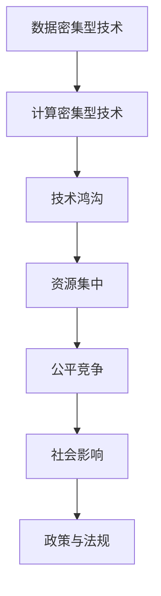

                 

# 资源流向更有资源的人：科技发展带来的结果

> 关键词：资源分配, 科技发展, 数据密集型, 人工智能, 经济模型, 社会影响

## 1. 背景介绍

### 1.1 问题由来

在当今快速发展的科技时代，数据和计算资源已经成为推动科技进步的关键力量。然而，随着技术的不断演进，科技资源的分配与利用也呈现出显著的变化趋势。特别是在人工智能(AI)、大数据、云计算等领域，数据密集型的特点使得资源愈发集中在具备技术优势和资本实力的企业和个人手中。这种现象，引起了社会的广泛关注和讨论。

一方面，资源的集中带来了技术突破的加速和市场竞争力的提升；另一方面，资源的过度集中可能导致垄断、就业结构失衡等社会问题。如何平衡科技发展与资源分配，成为当下亟需解决的重要问题。

### 1.2 问题核心关键点

资源集中现象的核心在于数据、计算资源和技术能力的不均衡分布，进而影响了技术发展的速度和质量。主要表现包括：

1. **数据鸿沟**：不同企业或个体获取和利用数据的能力存在显著差异，导致技术发展的不平衡。
2. **计算能力**：硬件设施和算法模型的计算能力决定了技术应用的深度和广度。
3. **技术能力**：研究人员的知识水平和技术积累直接影响技术创新的速度和质量。
4. **资金投入**：研发和基础设施的资金投入是技术发展的物质基础。
5. **政策和法规**：科技发展与资源分配的政策和法规，对资源流动有着重要的引导作用。

### 1.3 问题研究意义

研究科技资源集中现象及其对社会的影响，对于理解技术进步的机制，优化资源分配策略，促进社会公平具有重要意义。具体而言：

1. **技术加速**：资源集中可加速技术创新，推动技术突破，为社会带来更多进步。
2. **市场竞争**：资源集中可能导致市场垄断，影响公平竞争环境。
3. **就业结构**：技术发展带来新的就业岗位，同时也可能导致就业结构失衡。
4. **社会公平**：资源集中现象需要引起关注，防止其对社会公平产生不利影响。
5. **未来展望**：科技资源集中趋势的未来发展，需要前瞻性研究和政策引导。

## 2. 核心概念与联系

### 2.1 核心概念概述

为了更好地理解科技发展中资源集中现象及其影响，本节将介绍几个关键概念：

1. **数据密集型技术**：指在技术应用中，数据是其核心驱动力的技术，如AI、大数据、机器学习等。
2. **计算密集型技术**：指在技术应用中，计算能力是关键因素的技术，如高性能计算、深度学习等。
3. **技术鸿沟**：指不同技术能力和知识水平的个体或组织之间存在的差距，尤其是在数据密集型和计算密集型技术领域。
4. **资源集中**：指科技资源（如数据、计算能力、资金、人才）向具备技术优势和资本实力的企业和个人集中。
5. **公平竞争**：指在市场经济中，企业或个人在获取和使用科技资源时应遵循的平等原则，避免资源过度集中导致的市场失衡。
6. **社会影响**：指科技资源集中对社会公平、就业结构、文化传承等方面的影响。

### 2.2 概念间的关系

这些核心概念之间存在着紧密的联系，形成了科技资源集中现象的完整生态系统。下面是这些概念之间的逻辑关系图：


这个关系图展示了从技术特征到资源集中，再到公平竞争和社会影响的全过程：

1. **数据和计算密集型技术**：定义了资源集中的技术背景。
2. **技术鸿沟**：指出了资源集中现象的成因之一。
3. **资源集中**：描述了资源集中现象的分布和动态。
4. **公平竞争**：反映了资源集中带来的市场和社会的公平性问题。
5. **社会影响**：揭示了资源集中对社会结构和价值观的影响。

### 2.3 核心概念的整体架构

最后，我们用一个综合的流程图来展示这些核心概念在大规模科技资源集中现象中的整体架构：



这个综合流程图展示了从技术特征到资源集中，再到公平竞争和社会影响，最后反馈到政策与法规的全过程。通过这些流程图，我们可以更清晰地理解科技资源集中现象的各个环节及其相互关系。

## 3. 核心算法原理 & 具体操作步骤
### 3.1 算法原理概述

科技资源集中的现象可以通过数据密集型技术和计算密集型技术的发展规律来分析。具体而言，资源集中通常遵循以下几个原则：

1. **资源吸引力**：具有强大技术优势、高效能计算能力和丰富数据资源的企业或个人，更容易吸引更多的科技资源。
2. **网络效应**：资源集中的现象通常具有正反馈效应，即资源集中会进一步增强企业的竞争力和吸引力，形成良性循环。
3. **市场竞争**：在激烈的市场竞争中，资源集中是一种自然选择，能够更高效地利用资源。
4. **政策导向**：政府和企业的政策导向，对资源的分配和集中具有重要的影响。

### 3.2 算法步骤详解

以下是对科技资源集中现象进行分析和计算的具体步骤：

**Step 1: 数据收集与预处理**

- 收集关于企业、团队、项目的数据，包括技术能力、计算资源、数据资源等。
- 对数据进行预处理，如去噪、归一化、特征提取等。

**Step 2: 数据建模与分析**

- 建立数据模型，如回归模型、聚类模型、图模型等，分析资源集中现象的规律。
- 对模型进行训练和验证，优化参数，确保模型的准确性和泛化能力。

**Step 3: 资源流动分析**

- 分析资源流动的方向和速度，识别资源集中的关键节点和路径。
- 使用时间序列分析和动态图模型，跟踪资源集中的动态变化。

**Step 4: 社会影响评估**

- 评估资源集中对社会公平、就业结构、文化传承等方面的影响。
- 使用社交网络分析、统计学方法等，量化资源集中现象的社会影响。

**Step 5: 政策建议**

- 基于分析结果，提出优化资源分配、促进公平竞争的政策建议。
- 使用模拟和优化算法，探索政策实施的潜在效果。

### 3.3 算法优缺点

科技资源集中现象的分析和计算方法具有以下优缺点：

**优点**：
1. **数据驱动**：通过数据建模和分析，可以客观评估资源集中的程度和影响。
2. **动态监测**：能够实时监测资源流动的动态变化，及时调整政策。
3. **科学决策**：基于数据分析和模型优化，提出科学合理的政策建议。

**缺点**：
1. **数据获取难度**：数据的质量和完整性直接影响分析结果的准确性。
2. **复杂性高**：模型建立和优化需要复杂的计算和分析，对技术和资源要求较高。
3. **动态变化**：资源集中现象的快速变化，需要频繁更新数据和模型。

### 3.4 算法应用领域

科技资源集中现象的分析和计算方法，在多个领域具有广泛的应用前景，包括：

1. **经济学研究**：分析资源集中对市场竞争和产业结构的影响。
2. **政策制定**：制定促进科技公平竞争、优化资源分配的政策。
3. **企业战略**：识别资源集中的机会和威胁，优化资源配置策略。
4. **学术研究**：探索资源集中现象的机理和规律，推动科技发展。
5. **社会治理**：分析资源集中对社会公平和文化传承的影响，提升治理能力。

## 4. 数学模型和公式 & 详细讲解 & 举例说明（备注：数学公式请使用latex格式，latex嵌入文中独立段落使用 $$，段落内使用 $)
### 4.1 数学模型构建

为了更好地理解科技资源集中现象，我们构建以下数学模型：

设 $N$ 为企业数量，$R$ 为科技资源总量。假设每个企业对资源的吸引力和竞争力为 $A_i$，则资源集中度 $C$ 可定义为：

$$
C = \frac{1}{N} \sum_{i=1}^{N} A_i^2
$$

资源集中度 $C$ 越高，表示科技资源越集中。

### 4.2 公式推导过程

我们将资源集中度的定义进一步展开：

$$
C = \frac{1}{N} \sum_{i=1}^{N} A_i^2 = \frac{1}{N} \sum_{i=1}^{N} (A_i - \overline{A})^2 + 2\frac{1}{N} \sum_{i=1}^{N} A_i \overline{A}
$$

其中 $\overline{A}$ 为企业的平均吸引力。由于第二项与企业的吸引力和平均值无关，因此可以忽略，重点关注第一项：

$$
C = \frac{1}{N} \sum_{i=1}^{N} (A_i - \overline{A})^2
$$

该公式可以理解为资源集中度的平方，即资源集中度的平方越大，表示资源集中度越高。

### 4.3 案例分析与讲解

以AI领域的资源集中现象为例：

设 $N$ 为AI企业数量，$R$ 为AI领域的总资源（数据、计算资源等）。假设每个企业的吸引力 $A_i$ 与其技术创新能力成正比，即 $A_i = k \cdot \text{Innovation}_{i}$，其中 $k$ 为比例系数，$\text{Innovation}_{i}$ 表示企业的技术创新能力。

代入公式，得到：

$$
C = \frac{1}{N} \sum_{i=1}^{N} (k \cdot \text{Innovation}_{i} - \overline{k \cdot \text{Innovation}})^2
$$

简化后，得到：

$$
C = \frac{k^2}{N} \sum_{i=1}^{N} (\text{Innovation}_{i} - \overline{\text{Innovation}})^2
$$

该公式表明，资源集中度与企业的技术创新能力有关，即技术创新能力越高的企业，吸引的资源越多，资源集中度也越高。

## 5. 项目实践：代码实例和详细解释说明
### 5.1 开发环境搭建

在进行科技资源集中现象的分析和计算时，需要搭建合适的开发环境。以下是使用Python进行数据分析的典型环境配置流程：

1. 安装Anaconda：从官网下载并安装Anaconda，用于创建独立的Python环境。

2. 创建并激活虚拟环境：
```bash
conda create -n py_env python=3.8 
conda activate py_env
```

3. 安装必要的库：
```bash
conda install numpy pandas matplotlib seaborn
```

4. 安装数据分析工具：
```bash
pip install scikit-learn scipy statsmodels
```

完成上述步骤后，即可在`py_env`环境中进行数据分析和计算。

### 5.2 源代码详细实现

以下是一个简单的Python代码示例，用于计算资源集中度并进行可视化分析：

```python
import numpy as np
import pandas as pd
import matplotlib.pyplot as plt

# 数据准备
data = pd.read_csv('resource_data.csv')

# 计算资源集中度
A = data['Attraction']  # 各企业吸引力
avg_A = np.mean(A)
C = np.sum((A - avg_A)**2) / len(A)

# 输出结果
print(f"资源集中度: {C}")

# 可视化分析
plt.figure(figsize=(8, 6))
plt.plot(A, label='企业吸引力')
plt.axhline(avg_A, linestyle='--', color='red', label='平均值')
plt.legend()
plt.show()
```

在这个示例中，我们使用numpy和pandas库对企业吸引力数据进行处理和分析，计算资源集中度并进行可视化展示。

### 5.3 代码解读与分析

在这个代码示例中，我们首先使用pandas库读取企业吸引力数据，并计算资源集中度。接着，使用matplotlib库对企业吸引力进行可视化展示，以便直观理解资源集中现象。

**数据准备**：
- `data = pd.read_csv('resource_data.csv')`：从CSV文件中读取企业吸引力数据。

**计算资源集中度**：
- `A = data['Attraction']`：获取企业吸引力数据。
- `avg_A = np.mean(A)`：计算企业平均吸引力。
- `C = np.sum((A - avg_A)**2) / len(A)`：计算资源集中度。

**可视化分析**：
- `plt.figure(figsize=(8, 6))`：设置图形大小。
- `plt.plot(A, label='企业吸引力')`：绘制企业吸引力曲线。
- `plt.axhline(avg_A, linestyle='--', color='red', label='平均值')`：在图中添加平均吸引力的水平线。
- `plt.legend()`：添加图例。
- `plt.show()`：显示图形。

## 6. 实际应用场景

### 6.1 经济学研究

在经济学研究中，科技资源集中现象是研究市场竞争和产业结构的重要议题。通过对资源集中度的分析，可以揭示资源集中对市场竞争的影响，优化资源分配策略，推动产业健康发展。

以AI领域为例，研究资源集中对市场竞争的影响，可以分析以下问题：

1. **市场竞争格局**：资源集中度高的企业是否占据了市场主导地位？
2. **技术创新**：资源集中是否促进了技术创新？
3. **产业结构**：资源集中对产业结构有何影响？

### 6.2 政策制定

政策制定者需要关注科技资源集中现象，以制定促进公平竞争、优化资源分配的政策。具体而言：

1. **反垄断法规**：通过立法限制资源过度集中，保护市场公平竞争。
2. **资金支持**：对中小型企业和创新项目提供资金支持，促进资源均衡分配。
3. **技术标准**：制定技术标准，规范企业的资源使用行为。

### 6.3 企业战略

企业需要识别资源集中现象中的机会和威胁，优化资源配置策略，提升竞争力。具体而言：

1. **资源整合**：通过并购、合作等方式，整合优质资源。
2. **技术创新**：投入更多资源进行技术研发，提升技术创新能力。
3. **市场拓展**：通过资源集中提高市场占有率，拓展新市场。

### 6.4 社会治理

资源集中现象对社会公平和文化传承有着重要影响，社会治理者需要关注这些影响，采取相应的措施：

1. **就业结构调整**：资源集中可能导致就业结构失衡，需要采取措施调整就业结构。
2. **文化传承保护**：资源集中可能影响文化传承，需要保护和支持弱势文化。
3. **社会公平保障**：通过政策调整，促进社会公平，减少资源集中带来的负面影响。

## 7. 工具和资源推荐
### 7.1 学习资源推荐

为了深入理解科技资源集中现象及其对社会的影响，以下推荐一些优质的学习资源：

1. **《数据科学与人工智能基础》课程**：由清华大学开设的MOOC课程，系统介绍数据科学和人工智能的基本概念和技术。
2. **《经济学原理》教材**：曼昆的经典教材，系统介绍经济学的基本原理和应用。
3. **《大数据与人工智能》书籍**：讲述大数据和人工智能的最新发展趋势和应用案例。
4. **《资源流向更有资源的人》论文集**：收集关于资源集中现象的多篇经典论文，深入分析其机理和影响。
5. **《经济学的未来》论文集**：收录多篇关于科技发展对经济影响的论文，探讨未来的发展趋势。

### 7.2 开发工具推荐

科技资源集中现象的分析和计算需要高效的工具支持。以下是一些常用的开发工具：

1. **Anaconda**：用于创建和管理Python环境的工具。
2. **Jupyter Notebook**：交互式数据分析和可视化工具。
3. **Matplotlib**：数据可视化库，支持绘制各类图形。
4. **Pandas**：数据处理和分析库，支持大规模数据集的操作。
5. **Scikit-learn**：机器学习库，支持各种数据分析和建模任务。

### 7.3 相关论文推荐

科技资源集中现象的研究涉及多个领域，以下是一些推荐的相关论文：

1. **《经济学的未来》**：讨论科技发展对经济的影响，探讨未来的发展趋势。
2. **《市场竞争与资源集中》**：分析资源集中对市场竞争的影响，提出优化策略。
3. **《技术创新与资源集中》**：研究技术创新与资源集中之间的关系，揭示其内在联系。
4. **《社会公平与资源集中》**：探讨资源集中对社会公平的影响，提出解决方案。
5. **《资源集中与政策制定》**：分析资源集中现象对政策制定的影响，提出政策建议。

## 8. 总结：未来发展趋势与挑战
### 8.1 研究成果总结

科技资源集中现象的研究已经取得了丰富的成果，主要体现在以下几个方面：

1. **数据驱动的分析和计算**：通过数据建模和分析，客观评估资源集中现象的度量和影响。
2. **多领域的应用**：资源集中现象在经济学、政策制定、企业战略和社会治理等领域具有广泛应用。
3. **政策建议的提出**：基于分析结果，提出优化资源分配、促进公平竞争的政策建议。

### 8.2 未来发展趋势

未来，科技资源集中现象的研究将继续深化，主要趋势包括：

1. **大数据和AI的融合**：利用大数据和AI技术，提升资源集中现象分析的精度和深度。
2. **动态监测和预测**：实时监测资源流动，预测资源集中趋势，提前制定应对策略。
3. **跨学科研究**：结合经济学、社会学、计算机科学等多学科知识，综合分析资源集中现象。
4. **政策优化**：根据资源集中现象的变化，动态调整政策，实现资源的公平分配。
5. **技术创新**：推动技术创新，提升资源集中现象分析的效率和效果。

### 8.3 面临的挑战

科技资源集中现象的研究仍面临诸多挑战，主要包括以下几点：

1. **数据获取难度**：高质量数据的获取和处理是分析和计算的基础，但数据获取难度较大。
2. **模型复杂性**：资源集中现象的复杂性高，需要建立和优化复杂的数学模型。
3. **动态变化**：资源集中现象的快速变化，需要频繁更新数据和模型。
4. **公平性问题**：资源集中可能带来市场垄断和社会不公，需要制定合理的政策。
5. **技术鸿沟**：资源集中现象对技术鸿沟的影响，需要关注和应对。

### 8.4 研究展望

面向未来，科技资源集中现象的研究需要在以下几个方面寻求新的突破：

1. **数据获取和处理**：探索高效的数据获取和处理技术，降低数据获取难度。
2. **模型优化**：简化模型结构，降低模型复杂性，提高计算效率。
3. **动态监测**：实现动态监测和预测，及时调整政策。
4. **政策优化**：制定合理政策，平衡资源集中带来的正面和负面影响。
5. **技术鸿沟**：缩小技术鸿沟，促进技术普及和公平竞争。

这些研究方向和突破将推动科技资源集中现象的研究向更深层次发展，为科技资源的合理分配和利用提供科学依据。

## 9. 附录：常见问题与解答

**Q1: 如何衡量资源集中现象的严重程度？**

A: 资源集中现象的严重程度可以通过计算资源集中度（C）来衡量。资源集中度越高，表示资源集中现象越严重。计算资源集中度的公式为：

$$
C = \frac{1}{N} \sum_{i=1}^{N} (A_i - \overline{A})^2
$$

其中 $N$ 为资源主体数量，$A_i$ 为第 $i$ 个资源的吸引力或竞争力。

**Q2: 如何缓解资源集中现象对市场公平的影响？**

A: 缓解资源集中现象对市场公平的影响，可以从以下几个方面入手：

1. **反垄断法规**：通过立法限制资源过度集中，保护市场公平竞争。
2. **资金支持**：对中小型企业和创新项目提供资金支持，促进资源均衡分配。
3. **技术标准**：制定技术标准，规范企业的资源使用行为。
4. **市场准入**：通过市场准入政策，控制资源的集中程度。

**Q3: 如何利用大数据和AI技术优化资源集中现象的分析？**

A: 利用大数据和AI技术，可以进一步优化资源集中现象的分析，主要通过以下几个方面：

1. **数据收集**：通过大数据技术，获取更多、更全面的资源数据。
2. **数据处理**：使用AI技术，对数据进行清洗、去噪、归一化等处理。
3. **模型建立**：利用机器学习算法，建立更加复杂、精确的资源集中度模型。
4. **动态监测**：使用时间序列分析和动态图模型，实时监测资源流动的动态变化。
5. **预测分析**：结合预测模型，预测资源集中趋势，提前制定应对策略。

**Q4: 如何确保资源集中现象分析的准确性和可靠性？**

A: 确保资源集中现象分析的准确性和可靠性，需要从以下几个方面入手：

1. **数据质量**：确保数据的准确性和完整性，避免数据错误和偏差。
2. **模型验证**：使用多种模型和算法进行交叉验证，确保模型的泛化能力和稳健性。
3. **定期更新**：定期更新数据和模型，反映资源集中现象的变化。
4. **多维度分析**：结合多种数据源和分析方法，综合评估资源集中现象的复杂性和动态性。
5. **专家审核**：邀请领域专家对分析结果进行审核，确保分析的科学性和合理性。

作者：禅与计算机程序设计艺术 / Zen and the Art of Computer Programming

