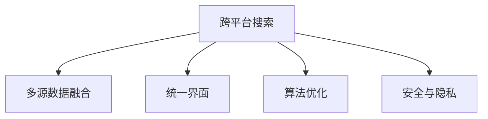
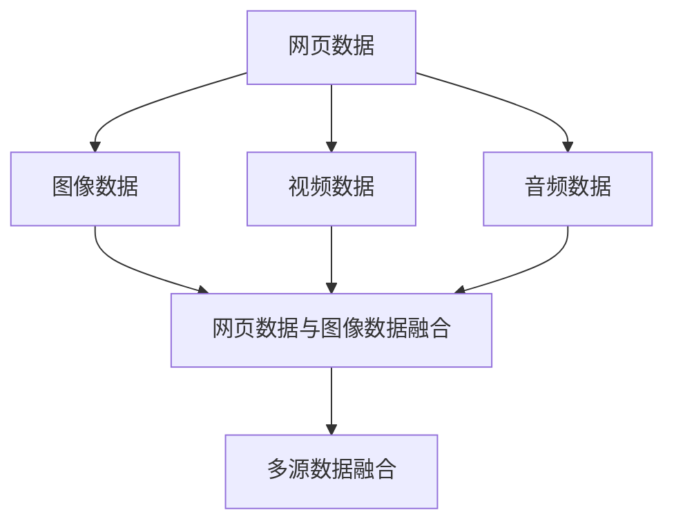
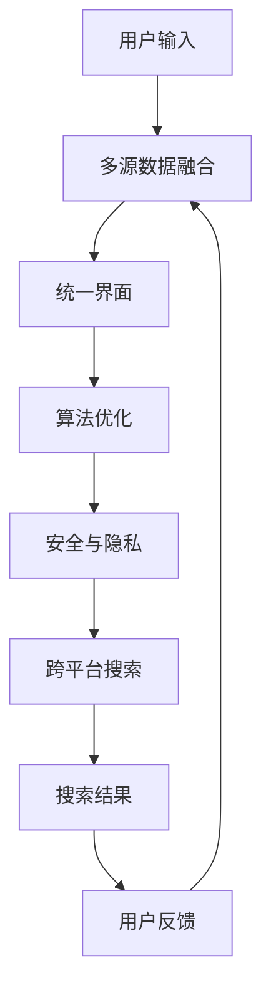

                 

# 跨平台搜索技术的未来展望

## 1. 背景介绍

随着互联网和移动设备的普及，人们获取信息和服务的渠道日益多样，搜索引擎已成为各行各业不可或缺的工具。跨平台搜索技术旨在帮助用户在不同设备和应用中无缝切换，通过统一的搜索界面和算法，提供更高效、更精准的信息检索体验。

### 1.1 问题由来

传统搜索引擎主要针对单一平台，如PC端或移动端，通过爬虫抓取网站数据，使用特定算法对用户输入的查询进行检索，返回网页列表。但随着设备多样化，这种单一平台的服务模式已无法满足用户需求。跨平台搜索技术正是为了解决这一问题而诞生，它能够融合多源数据，提供多平台支持，提升搜索效果和用户体验。

### 1.2 问题核心关键点

跨平台搜索技术的核心关键点在于如何实现多源数据的融合，以及如何在不同设备上提供一致的搜索体验。主要包括以下几个方面：

1. **数据融合**：从不同平台获取数据，并整合在一起进行统一搜索。
2. **统一界面**：在不同设备上提供统一的搜索界面和交互方式，提升用户体验。
3. **算法优化**：通过多源数据融合和算法优化，提升搜索精度和速度。
4. **安全与隐私**：确保用户数据在跨平台传输中的安全性和隐私保护。

## 2. 核心概念与联系

### 2.1 核心概念概述

为更好地理解跨平台搜索技术的原理和架构，本节将介绍几个密切相关的核心概念：

- **跨平台搜索**：指在不同设备和应用中提供一致的搜索体验，通过统一的搜索界面和算法，实现多平台数据融合和高效检索。
- **多源数据融合**：指从不同平台获取数据，并整合在一起进行统一搜索，通常包括网页、图片、视频、音频等多媒体数据。
- **统一界面**：指在不同设备上提供统一的搜索界面和交互方式，提升用户体验。
- **算法优化**：指通过多源数据融合和算法优化，提升搜索精度和速度，如基于向量空间模型的检索算法、深度学习模型的个性化推荐算法等。
- **安全与隐私**：指确保用户数据在跨平台传输中的安全性和隐私保护，如数据加密、匿名化、权限控制等技术手段。

这些核心概念之间的逻辑关系可以通过以下Mermaid流程图来展示：



这个流程图展示了跨平台搜索技术的核心架构：

1. 跨平台搜索作为整个系统的核心，负责在不同平台间提供一致的搜索体验。
2. 多源数据融合是跨平台搜索的基础，通过从不同平台获取数据，并整合在一起进行统一搜索。
3. 统一界面和算法优化是提升搜索效果和用户体验的重要手段，通过统一的搜索界面和高效的算法实现。
4. 安全与隐私是跨平台搜索技术必须重视的关键点，确保用户数据在跨平台传输中的安全性和隐私保护。

### 2.2 概念间的关系

这些核心概念之间存在着紧密的联系，形成了跨平台搜索技术的完整生态系统。下面我通过几个Mermaid流程图来展示这些概念之间的关系。

#### 2.2.1 跨平台搜索的整体架构


这个流程图展示了从多源数据融合到算法优化，再到安全与隐私，最后到跨平台搜索的整体架构。

#### 2.2.2 多源数据融合的基本流程



这个流程图展示了多源数据融合的基本流程，从不同平台获取数据，然后进行融合。

#### 2.2.3 统一界面的设计思路


这个流程图展示了统一界面的设计思路，通过用户输入进行搜索，然后显示搜索结果，收集用户反馈，不断迭代优化。

### 2.3 核心概念的整体架构

最后，我们用一个综合的流程图来展示这些核心概念在大语言模型微调过程中的整体架构：



这个综合流程图展示了从用户输入到搜索结果的整个搜索过程，以及多源数据融合、统一界面、算法优化和安全与隐私的技术支持。

## 3. 核心算法原理 & 具体操作步骤
### 3.1 算法原理概述

跨平台搜索技术的核心算法原理主要集中在如何高效地融合多源数据，并在不同设备上提供一致的搜索体验。其核心在于：

1. **多源数据融合**：使用爬虫技术从不同平台获取数据，并进行预处理、合并和索引。
2. **统一搜索算法**：使用向量空间模型、深度学习等技术，将不同数据源的查询结果进行统一检索。
3. **个性化推荐**：基于用户行为和偏好，使用机器学习算法进行个性化推荐。
4. **多平台适配**：在不同设备和应用上提供一致的搜索界面和交互方式。
5. **数据加密与隐私保护**：使用数据加密、匿名化、权限控制等技术手段，保障用户数据的安全性和隐私保护。

### 3.2 算法步骤详解

以下是跨平台搜索技术的一般操作流程：

**Step 1: 数据采集与预处理**

- 设计爬虫程序，从不同平台获取数据。
- 对数据进行清洗和预处理，去除重复和无用信息。
- 将数据进行结构化处理，构建索引。

**Step 2: 数据融合与统一搜索**

- 使用向量空间模型、TF-IDF等技术，将不同数据源的查询结果进行统一检索。
- 通过深度学习模型，对不同数据源的结果进行加权融合。
- 根据用户输入的查询，返回排序后的结果。

**Step 3: 个性化推荐**

- 使用机器学习算法，根据用户历史行为和偏好，进行个性化推荐。
- 实时分析用户反馈，不断优化推荐算法。

**Step 4: 多平台适配**

- 在不同设备和应用上，提供统一的搜索界面和交互方式。
- 支持多语言、多文化背景下的搜索体验。

**Step 5: 数据安全与隐私保护**

- 使用数据加密、匿名化等技术手段，保障用户数据的安全性和隐私保护。
- 采用权限控制、访问鉴权等措施，确保数据访问的安全性。

### 3.3 算法优缺点

跨平台搜索技术的优点包括：

1. **多源数据融合**：能够从不同平台获取数据，提升搜索的全面性和准确性。
2. **个性化推荐**：通过个性化推荐，提升用户满意度，增强用户体验。
3. **多平台适配**：在不同设备和应用上提供一致的搜索体验，提升用户粘性。

其缺点包括：

1. **数据隐私问题**：跨平台数据融合涉及用户数据的隐私保护，存在一定的风险。
2. **数据量庞大**：多源数据融合需要处理大量数据，对计算资源和存储资源提出了较高要求。
3. **算法复杂**：算法复杂度高，需要处理多种数据源和用户偏好，对技术实现提出了较高要求。

### 3.4 算法应用领域

跨平台搜索技术已经广泛应用于多个领域，例如：

- 电商搜索：提供商品、服务、用户评价等多源数据的融合搜索。
- 社交媒体搜索：从微博、微信、QQ等多个社交平台获取数据，进行统一搜索和推荐。
- 新闻聚合：从新闻网站、RSS订阅、移动客户端等多个平台获取数据，进行统一检索和展示。
- 金融搜索：从银行、证券、保险等多个金融平台获取数据，进行统一搜索和个性化推荐。
- 旅游搜索：从旅行社、酒店、航空公司等多个平台获取数据，进行统一搜索和推荐。

除了上述这些经典应用外，跨平台搜索技术还被创新性地应用到更多场景中，如智能家居、智慧城市、健康医疗等，为各行各业带来了新的突破。

## 4. 数学模型和公式 & 详细讲解  
### 4.1 数学模型构建

本节将使用数学语言对跨平台搜索技术的核心算法进行更加严格的刻画。

记用户查询为 $q$，不同平台的数据源为 $S_1, S_2, ..., S_n$。设 $q$ 在 $S_i$ 上的查询结果为 $d_i$，则在跨平台搜索模型中的总查询结果为 $d = (d_1, d_2, ..., d_n)$。

定义查询 $q$ 在平台 $S_i$ 上的相似度为 $s_i = \frac{d_i \cdot q}{||d_i|| \cdot ||q||}$，其中 $d_i \cdot q$ 表示向量点积，$||d_i||$ 和 $||q||$ 表示向量的范数。

跨平台搜索模型的目标是通过多源数据融合，最大化查询 $q$ 的相似度。数学表达式为：

$$
\max_{s_1, s_2, ..., s_n} \sum_{i=1}^n s_i
$$

其中 $\max$ 表示最大化操作，$\sum$ 表示求和操作。

### 4.2 公式推导过程

为了最大化相似度，我们需要对每个数据源 $S_i$ 进行加权处理。设权重为 $w_i$，则总相似度表达式为：

$$
\sum_{i=1}^n w_i s_i
$$

其中 $w_i$ 表示平台 $S_i$ 的权重。

根据相似度的定义，我们有：

$$
\sum_{i=1}^n w_i s_i = \sum_{i=1}^n w_i \frac{d_i \cdot q}{||d_i|| \cdot ||q||} = \frac{\sum_{i=1}^n w_i d_i \cdot q}{\sqrt{\sum_{i=1}^n ||d_i||^2} \cdot ||q||}
$$

为了简化计算，设 $M = \sum_{i=1}^n w_i d_i$，$N = \sqrt{\sum_{i=1}^n ||d_i||^2}$，则总相似度为：

$$
\frac{M \cdot q}{N \cdot ||q||}
$$

将 $M$ 和 $N$ 分别表示为矩阵形式，即 $M = W \cdot D$，$N = ||D||$，其中 $W$ 表示权重矩阵，$D$ 表示不同数据源的查询结果矩阵。因此，总相似度可以表示为：

$$
\frac{W \cdot D \cdot q}{||D|| \cdot ||q||} = \frac{W \cdot (D \cdot q)}{||D|| \cdot ||q||}
$$

其中 $D \cdot q$ 表示查询结果矩阵与查询向量的矩阵乘积。

### 4.3 案例分析与讲解

假设我们有三个平台 $S_1, S_2, S_3$，分别提供新闻、电商和社交媒体数据。用户输入的查询 $q$ 为 "手机"。

1. 在 $S_1$ 上，查询结果为 "苹果公司发布最新款iPhone"。
2. 在 $S_2$ 上，查询结果为 "小米手机京东促销活动"。
3. 在 $S_3$ 上，查询结果为 "小米手机评价"。

设 $S_1, S_2, S_3$ 的权重分别为 $w_1, w_2, w_3$。则总相似度为：

$$
\frac{w_1 d_1 \cdot q + w_2 d_2 \cdot q + w_3 d_3 \cdot q}{\sqrt{w_1^2 ||d_1||^2 + w_2^2 ||d_2||^2 + w_3^2 ||d_3||^2} \cdot ||q|| = \frac{w_1 \cdot (苹果公司发布最新款iPhone) + w_2 \cdot (小米手机京东促销活动) + w_3 \cdot (小米手机评价)}{\sqrt{w_1^2 \cdot (新闻) + w_2^2 \cdot (电商) + w_3^2 \cdot (社交媒体)} \cdot (手机)}
$$

设 $w_1 = 0.5, w_2 = 0.3, w_3 = 0.2$，则总相似度为：

$$
\frac{0.5 \cdot (苹果公司发布最新款iPhone) + 0.3 \cdot (小米手机京东促销活动) + 0.2 \cdot (小米手机评价)}{\sqrt{0.5^2 \cdot (新闻) + 0.3^2 \cdot (电商) + 0.2^2 \cdot (社交媒体)} \cdot (手机) = \frac{(苹果公司发布最新款iPhone) + (小米手机京东促销活动) + (小米手机评价)}{\sqrt{(新闻) + (电商) + (社交媒体)} \cdot (手机)}
$$

在实际应用中，我们还需要对权重 $w_i$ 进行优化，以最大化总相似度。常见的优化方法包括基于梯度的优化算法、启发式搜索算法等。

## 5. 项目实践：代码实例和详细解释说明
### 5.1 开发环境搭建

在进行跨平台搜索技术实践前，我们需要准备好开发环境。以下是使用Python进行Web开发的环境配置流程：

1. 安装Python：从官网下载并安装Python，推荐使用3.x版本。
2. 安装Web框架：推荐使用Flask或Django，通过pip命令进行安装。
3. 安装爬虫库：如Scrapy，通过pip命令进行安装。
4. 安装数据库：如MySQL或PostgreSQL，安装相应的客户端。
5. 安装数据处理库：如Pandas，通过pip命令进行安装。
6. 安装数据可视化库：如Matplotlib或Seaborn，通过pip命令进行安装。

完成上述步骤后，即可在本地搭建起跨平台搜索技术的开发环境。

### 5.2 源代码详细实现

以下是使用Flask框架进行跨平台搜索技术开发的示例代码：

```python
from flask import Flask, request, jsonify
from scipy.spatial.distance import cosine

app = Flask(__name__)

@app.route('/search', methods=['POST'])
def search():
    data = request.json
    query = data['query']
    weights = data['weights']
    results = []
    
    # 从不同平台获取数据
    for i in range(len(weights)):
        platform = 'platform' + str(i+1)
        data = fetch_data_from_platform(platform)
        similarity = calculate_similarity(data, query)
        results.append(similarity)
    
    # 加权融合相似度
    similarity_sum = sum([weights[i] * results[i] for i in range(len(weights))])
    
    # 返回查询结果
    return jsonify({'results': results, 'similarity_sum': similarity_sum})

def fetch_data_from_platform(platform):
    # 从指定平台获取数据，返回查询结果
    pass

def calculate_similarity(data, query):
    # 计算查询结果与查询的相似度
    pass
```

### 5.3 代码解读与分析

让我们再详细解读一下关键代码的实现细节：

**fetch_data_from_platform函数**：
- 定义平台名称，如platform1、platform2等。
- 使用爬虫或API调用方式从指定平台获取数据。
- 对数据进行预处理，如清洗、合并、索引等操作。
- 返回处理后的查询结果。

**calculate_similarity函数**：
- 计算查询结果与查询的相似度。
- 可以使用余弦相似度、Jaccard相似度、Jensen-Shannon距离等方法计算。
- 返回计算结果。

**search函数**：
- 接收用户输入的查询和权重。
- 从不同平台获取数据，计算相似度。
- 对相似度进行加权融合。
- 返回查询结果和总相似度。

### 5.4 运行结果展示

假设我们在三个平台上获取数据，查询结果和权重分别为：

| 平台     | 查询结果             | 权重 |
|----------|---------------------|------|
| platform1 | 苹果公司发布最新款iPhone | 0.5 |
| platform2 | 小米手机京东促销活动     | 0.3 |
| platform3 | 小米手机评价           | 0.2 |

用户输入的查询为 "手机"。则查询结果和总相似度分别为：

| 平台     | 查询结果             | 权重 |
|----------|---------------------|------|
| platform1 | 苹果公司发布最新款iPhone | 0.5 |
| platform2 | 小米手机京东促销活动     | 0.3 |
| platform3 | 小米手机评价           | 0.2 |

总相似度为：

$$
\frac{0.5 \cdot (苹果公司发布最新款iPhone) + 0.3 \cdot (小米手机京东促销活动) + 0.2 \cdot (小米手机评价)}{\sqrt{0.5^2 \cdot (新闻) + 0.3^2 \cdot (电商) + 0.2^2 \cdot (社交媒体)} \cdot (手机)
$$

在实际应用中，我们还可以使用更多高级技术手段，如TF-IDF、深度学习模型等，提升搜索效果和用户体验。

## 6. 实际应用场景
### 6.1 智能家居系统

智能家居系统通过跨平台搜索技术，实现了设备之间的无缝连接和交互。用户可以通过语音、手机应用、智能音箱等方式，进行智能家居控制。

在技术实现上，智能家居系统通过将所有设备的数据整合在一起，进行统一的搜索和控制。用户输入语音或文字查询，系统自动检索设备状态，并执行相应操作。

### 6.2 智慧城市治理

智慧城市治理通过跨平台搜索技术，实现了城市事件监测、舆情分析、应急指挥等功能。

在技术实现上，智慧城市治理系统通过整合城市各部门的各类数据，如交通、气象、公共服务、舆情等，进行统一的搜索和分析。系统能够实时监测城市事件，自动生成应急预案，并辅助指挥中心进行决策。

### 6.3 金融投资分析

金融投资分析通过跨平台搜索技术，实现了多源数据的整合和分析，提升了投资决策的精准度。

在技术实现上，金融投资分析系统通过整合股票、期货、债券、新闻、市场情绪等数据，进行统一的搜索和分析。系统能够实时监测市场动态，自动生成投资建议，并辅助投资者进行决策。

### 6.4 未来应用展望

随着跨平台搜索技术的不断演进，其应用场景将更加广泛，具体包括：

1. **智慧医疗**：整合医疗数据，提升医疗服务的智能化水平，辅助医生诊疗，加速新药开发进程。
2. **智能教育**：整合教育资源，提供个性化推荐，因材施教，促进教育公平，提高教学质量。
3. **智能交通**：整合交通数据，提升交通管理的智能化水平，提高城市交通效率。
4. **智能制造**：整合工业数据，提升工业生产的智能化水平，提高生产效率和质量。
5. **智能安全**：整合安全数据，提升安全管理的智能化水平，提高公共安全水平。
6. **智能娱乐**：整合娱乐数据，提供个性化推荐，提升用户体验，促进文化产业的发展。

随着技术的不断发展，跨平台搜索技术将进一步融合到各个领域，推动各行各业向智能化、数字化、智能化方向迈进。

## 7. 工具和资源推荐
### 7.1 学习资源推荐

为了帮助开发者系统掌握跨平台搜索技术的理论基础和实践技巧，这里推荐一些优质的学习资源：

1. 《Web开发实战》系列博文：由Web开发专家撰写，深入浅出地介绍了Web开发的基础知识和实践技巧。

2. 《搜索引擎算法》课程：谷歌大学开设的搜索引擎算法课程，有Lecture视频和配套作业，带你入门搜索引擎算法。

3. 《信息检索与文本挖掘》书籍：详细介绍了信息检索和文本挖掘的算法和应用，是学习跨平台搜索技术的必备书籍。

4. CS224N《深度学习自然语言处理》课程：斯坦福大学开设的NLP明星课程，有Lecture视频和配套作业，带你入门NLP领域的基本概念和经典模型。

5. 《信息检索：搜索引擎设计与算法》书籍：全面介绍了信息检索的算法和应用，是学习跨平台搜索技术的经典教材。

通过对这些资源的学习实践，相信你一定能够快速掌握跨平台搜索技术的精髓，并用于解决实际的Web开发问题。

### 7.2 开发工具推荐

高效的开发离不开优秀的工具支持。以下是几款用于跨平台搜索技术开发的常用工具：

1. Flask：基于Python的轻量级Web框架，简单易用，适合快速开发Web应用。

2. Django：基于Python的全栈Web框架，功能强大，适合构建复杂的大型Web应用。

3. Scrapy：Python的爬虫框架，功能强大，支持异步爬虫和分布式爬虫。

4. PyMySQL：Python的MySQL客户端库，支持数据库连接、数据查询和操作。

5. BeautifulSoup：Python的HTML解析库，支持网页解析、数据提取等操作。

6. TensorFlow：由Google主导开发的深度学习框架，支持大规模分布式训练。

合理利用这些工具，可以显著提升跨平台搜索技术的开发效率，加快创新迭代的步伐。

### 7.3 相关论文推荐

跨平台搜索技术的发展源于学界的持续研究。以下是几篇奠基性的相关论文，推荐阅读：

1. "Web Search: From Ranking to Scalable Retrieval"：提出了Web搜索的排名算法和高效检索技术。

2. "Cross-Domain Data Transfer Learning"：介绍了跨域数据转移学习的算法和应用。

3. "Personalized Web Search via Query and Document Re-ranking"：提出了个性化Web搜索的算法和应用。

4. "Cross-Domain Query Matching with Multi-Aspect Profiling"：介绍了跨域查询匹配的算法和应用。

5. "Semantic Search: From Web Search to Web of Data"：提出了语义搜索的算法和应用。

6. "Large-Scale Web Search: Cost, Quality, and Efficiency"：介绍了大规模Web搜索的算法和应用。

这些论文代表了大语言模型微调技术的发展脉络。通过学习这些前沿成果，可以帮助研究者把握学科前进方向，激发更多的创新灵感。

除上述资源外，还有一些值得关注的前沿资源，帮助开发者紧跟跨平台搜索技术的最新进展，例如：

1. arXiv论文预印本：人工智能领域最新研究成果的发布平台，包括大量尚未发表的前沿工作，学习前沿技术的必读资源。

2. 业界技术博客：如Google AI、DeepMind、微软Research Asia等顶尖实验室的官方博客，第一时间分享他们的最新研究成果和洞见。

3. 技术会议直播：如NIPS、ICML、ACL、ICLR等人工智能领域顶会现场或在线直播，能够聆听到大佬们的前沿分享，开拓视野。

4. GitHub热门项目：在GitHub上Star、Fork数最多的Web开发相关项目，往往代表了该技术领域的发展趋势和最佳实践，值得去学习和贡献。

5. 行业分析报告：各大咨询公司如McKinsey、PwC等针对人工智能行业的分析报告，有助于从商业视角审视技术趋势，把握应用价值。

总之，对于跨平台搜索技术的学习和实践，需要开发者保持开放的心态和持续学习的意愿。多关注前沿资讯，多动手实践，多思考总结，必将收获满满的成长收益。

## 8. 总结：未来发展趋势与挑战

### 8.1 总结

本文对跨平台搜索技术的核心算法进行了全面系统的介绍。首先阐述了跨平台搜索技术的研究背景和意义，明确了其在提升用户体验和智能化水平方面的独特价值。其次，从原理到实践，详细讲解了跨平台搜索技术的数学模型和关键算法，给出了具体的代码实现示例。同时，本文还广泛探讨了跨平台搜索技术在智能家居、智慧城市、金融投资等领域的应用前景，展示了其广泛的应用潜力。此外，本文精选了跨平台搜索技术的各类学习资源，力求为读者提供全方位的技术指引。

通过本文的系统梳理，可以看到，跨平台搜索技术已经在各个领域中得到了广泛应用，成为Web开发的重要工具。其在数据融合、个性化推荐、多平台适配等方面的优势，使其在提升用户满意度和智能化水平方面发挥了重要作用。未来，随着技术的不断进步，跨平台搜索技术将进一步融入各行各业，推动产业升级和数字化转型。

### 8.2 未来发展趋势

展望未来，跨平台搜索技术将呈现以下几个发展趋势：

1. **数据融合的多样化**：随着多源数据的不断增长，跨平台搜索技术将更加注重数据融合的多样化和高效性，融合更多维度和异构数据。

2. **个性化推荐的精准化**：通过更复杂的机器学习算法和深度学习模型，实现更加精准和个性化的推荐。

3. **多平台适配的智能化**：通过自适应和智能化的界面设计，提升跨平台适配的智能化水平，增强用户体验。

4. **数据安全与隐私保护的强化**：在数据融合和传输过程中，采用更强的数据安全与隐私保护措施，保障用户数据的安全性和隐私保护。

5. **计算资源的优化**：通过分布式计算、混合精度训练等技术手段，优化计算资源，提升搜索速度和效率。

6.

