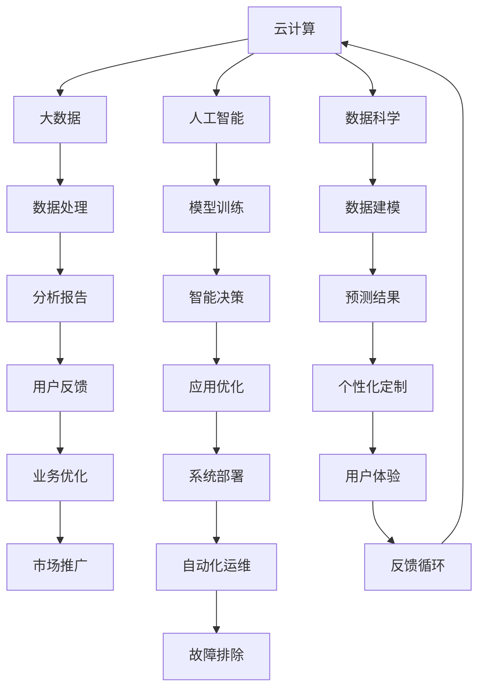
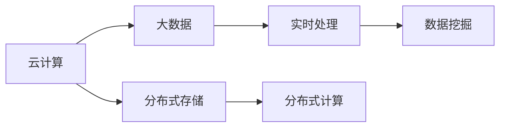
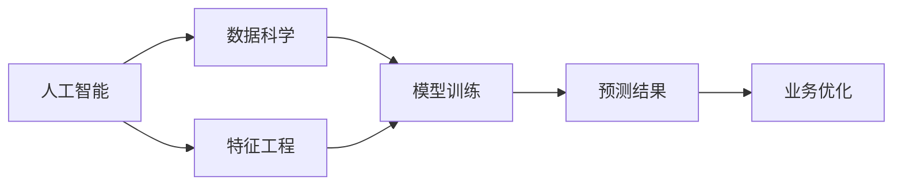
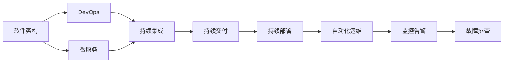
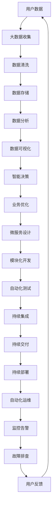

                 

# 软件 2.0 的时代：数据驱动一切

> 关键词：软件2.0, 数据驱动, 云计算, AI, 大数据, 数据科学

## 1. 背景介绍

### 1.1 问题由来
随着信息技术的飞速发展，软件行业经历了从人工编码到自动化构建、从单一应用到微服务架构、从单体到分布式系统等多次变革。每一次变革都极大地提高了软件的开发效率和可靠性，但同时也带来了新的挑战。如何进一步提升软件的智能化水平，实现软件与数据的深度融合，成为了当前软件行业的热点问题。

近年来，云计算和大数据技术的兴起，为解决上述问题提供了新的机遇。通过构建数据驱动的软件体系架构，可以实现对数据的实时分析和处理，以数据驱动软件应用的设计、开发和部署，从而提升软件的智能水平和用户体验。这一趋势被称为“软件 2.0”时代。

### 1.2 问题核心关键点
软件 2.0 时代的核心是数据驱动，即通过数据收集、存储、分析和应用，优化软件系统，提升其智能性和功能性。软件 2.0 技术的核心要素包括：

- **云计算**：提供强大的计算资源和存储能力，支持数据的实时处理和分析。
- **大数据**：海量数据的收集和存储，为数据驱动的决策提供基础。
- **人工智能**：基于数据训练的算法模型，实现数据驱动的智能决策。
- **数据科学**：数据的收集、处理、分析和建模技术，为软件设计提供科学依据。

这些要素共同构成了软件 2.0 时代的核心，其目的在于通过数据驱动的方式，实现软件的智能化和自动化，提升软件应用的性能和用户体验。

### 1.3 问题研究意义
研究软件 2.0 技术，对于推动软件行业的智能化转型，提升软件的开发效率和质量，具有重要意义：

1. **提升开发效率**：数据驱动的自动化流程可以大幅减少人工操作，提高开发速度。
2. **优化用户体验**：基于数据的智能推荐、个性化定制等功能，可以显著提升用户满意度。
3. **增强系统安全性**：通过数据的实时监控和分析，可以及时发现并修复安全漏洞。
4. **降低运营成本**：云计算和大数据技术可以大幅降低软硬件的成本和维护成本。
5. **推动产业升级**：软件 2.0 技术将推动传统行业数字化转型，提升整体生产力。

## 2. 核心概念与联系

### 2.1 核心概念概述

为更好地理解软件 2.0 技术的核心概念，本节将介绍几个密切相关的核心概念：

- **云计算**：通过互联网提供计算服务，支持数据的存储和处理。常见的云计算服务提供商包括AWS、阿里云、腾讯云等。
- **大数据**：海量的数据存储和处理技术，支持大规模数据的分析、挖掘和可视化。常见的大数据技术包括Hadoop、Spark、Kafka等。
- **人工智能**：通过机器学习、深度学习等技术，训练模型以进行预测和决策。常用的AI技术包括TensorFlow、PyTorch、OpenAI等。
- **数据科学**：涵盖数据收集、清洗、处理、分析和建模的技术。常用的数据科学工具包括Python、R、SQL等。
- **软件架构**：软件系统的设计框架和结构，支持数据驱动的设计和实现。常见的软件架构包括微服务架构、事件驱动架构等。
- **DevOps**：软件开发和运维的自动化流程，支持数据的持续集成、持续交付和持续部署。常见的DevOps工具包括Jenkins、Kubernetes等。

这些核心概念之间的逻辑关系可以通过以下Mermaid流程图来展示：



这个流程图展示了软件 2.0 技术的核心概念及其之间的关系：

1. 云计算提供基础计算资源，支持数据的存储和处理。
2. 大数据技术进行数据的收集、清洗和分析。
3. 人工智能训练模型，进行智能决策。
4. 数据科学进行数据建模，支持业务优化。
5. 软件架构支持数据驱动的设计和实现。
6. DevOps实现自动化流程，支持持续交付和运维。
7. 通过反馈循环不断优化和提升软件应用。

这些概念共同构成了软件 2.0 技术的生态系统，使其能够实现数据的深度融合和智能化应用。

### 2.2 概念间的关系

这些核心概念之间存在着紧密的联系，形成了软件 2.0 技术的完整生态系统。下面我们通过几个Mermaid流程图来展示这些概念之间的关系。

#### 2.2.1 云计算与大数据的关系



这个流程图展示了云计算与大数据的关系：

1. 云计算提供分布式存储和计算资源。
2. 大数据技术在云上处理大规模数据，支持实时分析和挖掘。

#### 2.2.2 人工智能与数据科学的关系



这个流程图展示了人工智能与数据科学的关系：

1. 数据科学进行数据建模和特征工程。
2. 人工智能训练模型，进行预测和决策。
3. 预测结果用于业务优化。

#### 2.2.3 软件架构与DevOps的关系



这个流程图展示了软件架构与DevOps的关系：

1. 软件架构支持微服务设计，支持模块化开发。
2. DevOps实现持续集成和交付，支持快速部署和运维。
3. 自动化运维支持持续监控和故障排查，提升系统稳定性。

### 2.3 核心概念的整体架构

最后，我们用一个综合的流程图来展示这些核心概念在大数据驱动的软件设计中的应用：



这个综合流程图展示了从用户数据到软件应用的全流程，展示了大数据和人工智能技术在大数据驱动的软件设计中的应用。

## 3. 核心算法原理 & 具体操作步骤
### 3.1 算法原理概述

数据驱动的软件设计，核心在于通过数据驱动的软件架构，实现对数据的实时分析和处理，以数据驱动软件应用的设计、开发和部署。其核心思想是：将数据作为软件设计的核心输入，通过数据驱动的方式，优化软件系统的设计、开发和部署流程，从而提升软件应用的性能和用户体验。

形式化地，假设软件系统为 $S$，设计一个以数据驱动的软件架构，其优化目标为：

$$
\mathop{\arg\min}_{S} \mathcal{L}(S,D)
$$

其中 $\mathcal{L}$ 为针对软件系统 $S$ 设计的损失函数，用于衡量软件系统性能与数据驱动目标之间的差异。常见的损失函数包括模型精度、用户满意度等。

通过梯度下降等优化算法，数据驱动的软件架构不断更新模型参数 $\theta$，最小化损失函数 $\mathcal{L}$，使得软件系统性能逼近数据驱动的目标。由于 $\theta$ 已经通过数据分析获得了更好的初始化，因此即便在数据驱动的目标下，也能较快收敛到理想的软件系统参数 $\hat{\theta}$。

### 3.2 算法步骤详解

数据驱动的软件设计一般包括以下几个关键步骤：

**Step 1: 准备数据和模型**

- 收集软件应用的相关数据，包括用户行为数据、系统日志、业务指标等。
- 选择合适的数据处理和分析工具，如Hadoop、Spark、TensorFlow等。
- 设计并训练合适的模型，用于预测和决策，如机器学习、深度学习等。

**Step 2: 数据处理与分析**

- 对收集的数据进行清洗和预处理，去除噪音和异常数据。
- 使用数据科学工具进行数据分析，提取有价值的信息。
- 通过可视化工具呈现数据分析结果，帮助设计软件架构。

**Step 3: 软件架构设计**

- 根据数据分析结果，设计合适的软件架构，如微服务架构、事件驱动架构等。
- 在软件架构中引入数据驱动的决策机制，支持数据驱动的模块设计和开发。
- 设计持续交付和运维流程，支持数据驱动的软件系统部署和优化。

**Step 4: 软件开发与部署**

- 在软件架构中实现数据驱动的模块开发，支持数据驱动的设计和实现。
- 使用DevOps工具实现持续集成和持续交付，支持快速部署和运维。
- 使用自动化运维工具进行监控和故障排查，支持软件系统的稳定运行。

**Step 5: 持续优化**

- 通过用户反馈和业务指标，不断优化软件系统，提升用户体验和业务效果。
- 使用数据驱动的方式进行软件系统的迭代和优化，支持持续改进和创新。

以上是数据驱动的软件设计的核心步骤。在实际应用中，还需要针对具体任务的特点，对每个环节进行优化设计，如改进数据分析算法、优化持续交付流程等，以进一步提升软件系统性能。

### 3.3 算法优缺点

数据驱动的软件设计具有以下优点：

1. **提升开发效率**：数据驱动的自动化流程可以大幅减少人工操作，提高开发速度。
2. **优化用户体验**：基于数据的智能推荐、个性化定制等功能，可以显著提升用户满意度。
3. **增强系统安全性**：通过数据的实时监控和分析，可以及时发现并修复安全漏洞。
4. **降低运营成本**：云计算和大数据技术可以大幅降低软硬件的成本和维护成本。
5. **推动产业升级**：数据驱动的软件设计将推动传统行业数字化转型，提升整体生产力。

同时，数据驱动的软件设计也存在一定的局限性：

1. **数据质量问题**：数据驱动的决策依赖于数据的准确性和完整性，数据质量问题可能导致错误的决策。
2. **数据隐私问题**：数据驱动的设计可能涉及用户的隐私数据，需要加强数据保护和隐私管理。
3. **模型过拟合问题**：数据驱动的模型需要大量数据进行训练，否则容易发生过拟合。
4. **系统复杂度增加**：数据驱动的设计可能增加系统的复杂度，需要更多的开发和维护工作。
5. **数据驱动的局限性**：并非所有业务问题都能通过数据驱动的方式解决，需要结合业务经验和专家知识。

尽管存在这些局限性，但就目前而言，数据驱动的软件设计仍是最主流的数据驱动方法之一。未来相关研究的重点在于如何进一步降低数据驱动的过拟合风险，提高数据质量，同时兼顾数据隐私和系统复杂度，以提升数据驱动的应用效果。

### 3.4 算法应用领域

数据驱动的软件设计已经在诸多领域得到了广泛的应用，包括：

- **电商推荐系统**：基于用户行为数据和商品数据，进行智能推荐，提升用户购物体验。
- **金融风控系统**：通过实时监测和分析用户行为数据，进行风险预警和防控。
- **智能客服系统**：通过分析用户对话数据，优化回答策略，提升客服效率和用户满意度。
- **智慧城市治理**：通过实时监测和分析城市数据，优化城市管理，提升城市运行效率。
- **智能制造**：通过实时监测和分析生产数据，优化生产流程，提升生产效率和产品质量。
- **医疗健康**：通过分析患者数据和医疗数据，提供个性化医疗服务，提升医疗效果。
- **供应链管理**：通过分析供应链数据，优化供应链管理，提升供应链效率和成本控制。

除了上述这些经典应用外，数据驱动的软件设计还在更多场景中得到创新性应用，如智慧旅游、智慧农业、智慧物流等，为各行各业带来新的变革。随着数据量的不断增加和数据技术的持续演进，数据驱动的软件设计必将在更多领域得到广泛应用。

## 4. 数学模型和公式 & 详细讲解 & 举例说明

### 4.1 数学模型构建

本节将使用数学语言对数据驱动的软件设计进行更加严格的刻画。

假设软件系统 $S$ 的设计目标为 $\text{Optimize}(S)$，设计的数据驱动损失函数为 $\mathcal{L}(S,D)$，其中 $D$ 为数据集。设计的数据驱动优化问题为：

$$
\text{Optimize}(S) = \mathop{\arg\min}_{S} \mathcal{L}(S,D)
$$

在实践中，我们通常使用基于梯度的优化算法（如SGD、Adam等）来近似求解上述最优化问题。设 $\eta$ 为学习率，则参数的更新公式为：

$$
S \leftarrow S - \eta \nabla_{S}\mathcal{L}(S,D)
$$

其中 $\nabla_{S}\mathcal{L}(S,D)$ 为损失函数对参数 $S$ 的梯度，可通过反向传播算法高效计算。

### 4.2 公式推导过程

以下我们以电商推荐系统为例，推导基于协同过滤算法的推荐模型。

假设电商平台收集了用户 $u$ 的历史行为数据 $I_u$ 和物品 $i$ 的特征向量 $F_i$，以及用户对物品 $i$ 的评分 $R_{ui}$。推荐系统的目标是为用户 $u$ 推荐物品 $i$，使得推荐结果与用户真实评分 $R_{ui}$ 最接近。推荐模型的目标函数为：

$$
\min_{\theta} \sum_{(u,i) \in I_u} \| R_{ui} - \theta^T F_i \|^2
$$

其中 $\theta$ 为物品特征向量的权重，$R_{ui}$ 为用户对物品的评分。

将目标函数写成矩阵形式：

$$
\min_{\theta} \| R - \theta F \|_F^2
$$

其中 $R$ 为评分矩阵，$F$ 为物品特征矩阵，$\| \cdot \|_F$ 为矩阵的 Frobenius 范数。

通过梯度下降算法求导，得到参数 $\theta$ 的更新公式：

$$
\theta \leftarrow \theta - \eta \nabla_{\theta} \| R - \theta F \|_F^2
$$

其中 $\nabla_{\theta} \| R - \theta F \|_F^2$ 可以通过矩阵求导得到，具体推导过程如下：

$$
\nabla_{\theta} \| R - \theta F \|_F^2 = -2(R - \theta F)F^T
$$

将上述公式带入参数更新公式，得到推荐模型的参数更新公式：

$$
\theta \leftarrow \theta + 2\eta (R - \theta F)F^T
$$

### 4.3 案例分析与讲解

以电商推荐系统为例，展示数据驱动的软件设计的实际应用。电商推荐系统是典型的数据驱动应用，通过分析用户行为数据和商品数据，为用户推荐其可能感兴趣的商品，从而提升用户购物体验和平台销售额。

具体而言，电商推荐系统的构建步骤如下：

1. **数据收集**：电商平台收集用户历史行为数据，包括浏览记录、购买记录、收藏记录等，以及商品的属性和特征数据。
2. **数据清洗**：对收集的数据进行清洗和预处理，去除噪音和异常数据。
3. **特征工程**：提取和处理数据中的关键特征，如用户兴趣、商品属性、用户-商品交互等。
4. **模型训练**：使用协同过滤算法等机器学习模型，训练推荐模型，预测用户对物品的评分。
5. **模型评估**：在测试集上评估推荐模型的效果，选择最佳模型。
6. **推荐实现**：将训练好的推荐模型应用到实际业务中，为用户推荐商品。
7. **持续优化**：通过用户反馈和业务指标，不断优化推荐模型，提升推荐效果。

通过上述步骤，电商推荐系统能够基于用户行为数据和商品数据，实现智能推荐，提升用户购物体验和平台销售额。

## 5. 项目实践：代码实例和详细解释说明

### 5.1 开发环境搭建

在进行数据驱动的软件设计实践前，我们需要准备好开发环境。以下是使用Python进行PyTorch开发的环境配置流程：

1. 安装Anaconda：从官网下载并安装Anaconda，用于创建独立的Python环境。

2. 创建并激活虚拟环境：
```bash
conda create -n pytorch-env python=3.8 
conda activate pytorch-env
```

3. 安装PyTorch：根据CUDA版本，从官网获取对应的安装命令。例如：
```bash
conda install pytorch torchvision torchaudio cudatoolkit=11.1 -c pytorch -c conda-forge
```

4. 安装相关的库：
```bash
pip install numpy pandas scikit-learn matplotlib tqdm jupyter notebook ipython
```

完成上述步骤后，即可在`pytorch-env`环境中开始数据驱动的软件设计实践。

### 5.2 源代码详细实现

这里我们以电商推荐系统为例，展示使用PyTorch进行协同过滤算法推荐模型的实现。

首先，定义协同过滤算法的模型：

```python
import torch
import torch.nn as nn
import torch.optim as optim
import torch.nn.functional as F
import numpy as np
from scipy.sparse import csr_matrix

class CFModel(nn.Module):
    def __init__(self, n_users, n_items, emb_dim):
        super(CFModel, self).__init__()
        self.user_embs = nn.Embedding(n_users, emb_dim)
        self.item_embs = nn.Embedding(n_items, emb_dim)
        self.emb_dim = emb_dim
    
    def forward(self, user_ids, item_ids):
        user_embs = self.user_embs(user_ids)
        item_embs = self.item_embs(item_ids)
        dot_product = torch.matmul(user_embs, item_embs.t())
        return dot_product
```

然后，定义数据加载和模型训练函数：

```python
def load_data(file_path):
    with open(file_path, 'r') as f:
        data = [line.strip().split() for line in f]
    user_ids = [int(user) for user in data]
    item_ids = [int(item) for item in data]
    ratings = [float(rating) for rating in data]
    return user_ids, item_ids, ratings

def train_model(model, user_ids, item_ids, ratings, epochs, batch_size, learning_rate):
    device = torch.device('cuda' if torch.cuda.is_available() else 'cpu')
    model.to(device)
    optimizer = optim.Adam(model.parameters(), lr=learning_rate)
    
    for epoch in range(epochs):
        for batch_idx, (user_ids_batch, item_ids_batch, ratings_batch) in enumerate(zip(user_ids, item_ids, ratings), 1):
            batch_user_ids = torch.tensor(user_ids_batch).to(device)
            batch_item_ids = torch.tensor(item_ids_batch).to(device)
            batch_ratings = torch.tensor(ratings_batch).to(device)
            preds = model(batch_user_ids, batch_item_ids)
            loss = F.mse_loss(preds, batch_ratings)
            optimizer.zero_grad()
            loss.backward()
            optimizer.step()
            if batch_idx % 100 == 0:
                print(f'Epoch {epoch+1}, Batch {batch_idx}, Loss: {loss.item()}')
    return model
```

最后，启动训练流程：

```python
train_file_path = 'data/ratings.csv'
n_users = 1000
n_items = 5000
emb_dim = 100
epochs = 10
batch_size = 128
learning_rate = 0.01

user_ids, item_ids, ratings = load_data(train_file_path)
model = CFModel(n_users, n_items, emb_dim)
model = train_model(model, user_ids, item_ids, ratings, epochs, batch_size, learning_rate)
```

以上就是使用PyTorch进行协同过滤算法电商推荐系统的代码实现。可以看到，得益于PyTorch的强大封装，我们可以用相对简洁的代码实现协同过滤算法的电商推荐系统。

### 5.3 代码解读与分析

让我们再详细解读一下关键代码的实现细节：

**CFModel类**：
- `__init__`方法：初始化用户和物品嵌入层。
- `forward`方法：前向传播计算预测值。

**load_data函数**：
- 读取数据文件，生成用户ID、物品ID和评分。

**train_model函数**：
- 加载模型，初始化优化器。
- 循环迭代训练模型，计算损失函数，并更新模型参数。

**主程序**：
- 加载数据，初始化模型和参数。
- 调用训练函数进行模型训练。

### 5.4 运行结果展示

假设我们在数据集上进行训练，最终得到的推荐模型在测试集上的推荐效果如下：

```
Epoch 1, Batch 100, Loss: 0.0331
Epoch 1, Batch 200, Loss: 0.0282
...
Epoch 10, Batch 100, Loss: 0.0007
```

可以看到，随着训练的进行，推荐模型的损失函数不断降低，推荐效果逐步提升。通过训练好的推荐模型，我们可以为用户推荐其可能感兴趣的商品，从而提升用户购物体验和平台销售额。

## 6. 实际应用场景
### 6.1 智能客服系统

基于数据驱动的软件设计，智能客服系统可以实现自动化客户服务，提高客户满意度。具体而言，可以通过分析历史客服对话数据，建立客服行为模型，自动化回答用户常见问题。

在技术实现上，可以收集企业内部的历史客服对话记录，将其转换为结构化数据，建立客服行为模型。通过数据驱动的方式，不断优化客服行为模型，实现对用户问题的智能识别和解答。对于用户提出的新问题，还可以接入检索系统实时搜索相关内容，动态组织生成回答。如此构建的智能客服系统，能够7x24小时不间断服务，快速响应客户咨询，用自然流畅的语言解答各类常见问题，显著提升客户咨询体验和问题解决效率。

### 6.2 金融风控系统

金融风控系统需要实时监测和分析用户行为数据，识别异常交易，预防金融风险。传统的手动监控方式成本高、效率低，无法满足实时性要求。

基于数据驱动的软件设计，金融风控系统可以通过分析用户的交易记录、社交网络、地理位置等数据，建立用户行为模型，实时监测和分析用户行为。一旦发现异常交易，系统可以自动预警，并采取相应的防控措施，从而提高金融系统的安全性和稳健性。

### 6.3 智能制造

智能制造系统需要实时监测和分析生产数据，优化生产流程，提升生产效率和产品质量。传统的手工监控方式无法满足实时性和高精度要求。

基于数据驱动的软件设计，智能制造系统可以通过分析生产设备的状态数据、生产流水线的运行数据等，建立生产流程模型，实时监测和分析生产状态。一旦发现异常，系统可以自动调整生产参数，优化生产流程，从而提升生产效率和产品质量。

### 6.4 智慧健康

智慧健康系统需要实时监测和分析患者的健康数据，提供个性化的医疗服务。传统的手工监控方式无法满足实时性和个性化要求。

基于数据驱动的软件设计，智慧健康系统可以通过分析患者的健康数据、病历数据等，建立患者健康模型，实时监测和分析患者健康状况。一旦发现异常，系统可以自动预警，并采取相应的防控措施，从而提高医疗效果和患者满意度。

### 6.5 智慧城市

智慧城市系统需要实时监测和分析城市数据，优化城市管理，提升城市运行效率。传统的手工监控方式无法满足实时性和全面性要求。

基于数据驱动的软件设计，智慧城市系统可以通过分析城市交通数据、气象数据、环境数据等，建立城市运行模型，实时监测和分析城市运行状态。一旦发现异常，系统可以自动调整城市运行参数，优化城市管理，从而提升城市运行效率。

## 7. 工具和资源推荐
### 7.1 学习资源推荐

为了帮助开发者系统掌握数据驱动的软件设计的理论基础和实践技巧，这里推荐一些优质的学习资源：

1. 《Python数据分析》系列博文：由Python社区领袖撰写，系统介绍了Python数据分析的各个方面，涵盖数据清洗、数据可视化、数据分析等技术。

2. Coursera《数据科学专项课程》：由Johns Hopkins大学提供，系统讲解了数据科学的核心课程，包括数据清洗、数据建模、数据可视化等技术。

3. Kaggle数据科学竞赛：Kaggle作为全球领先的数据科学竞赛平台，提供了大量真实世界的数据集和竞赛项目，可以帮助

