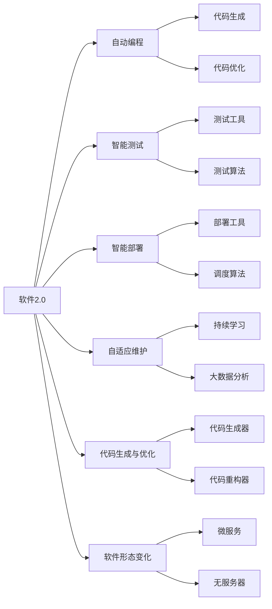
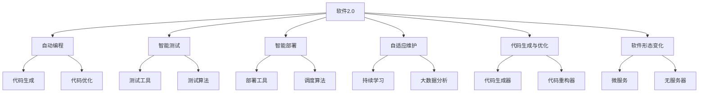
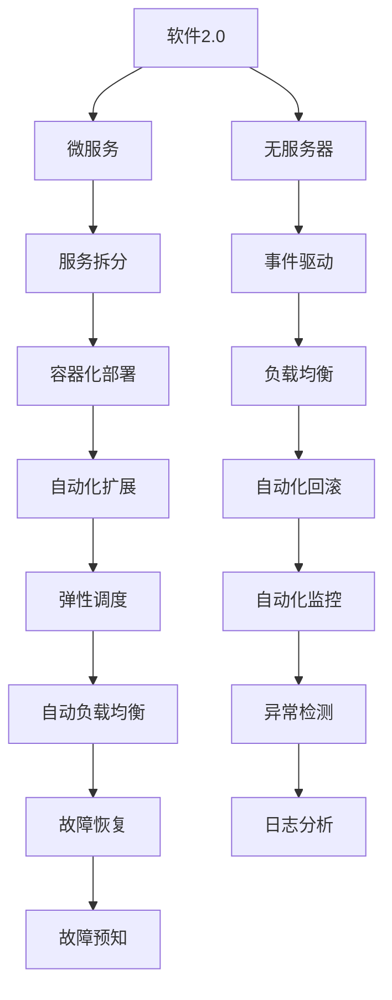
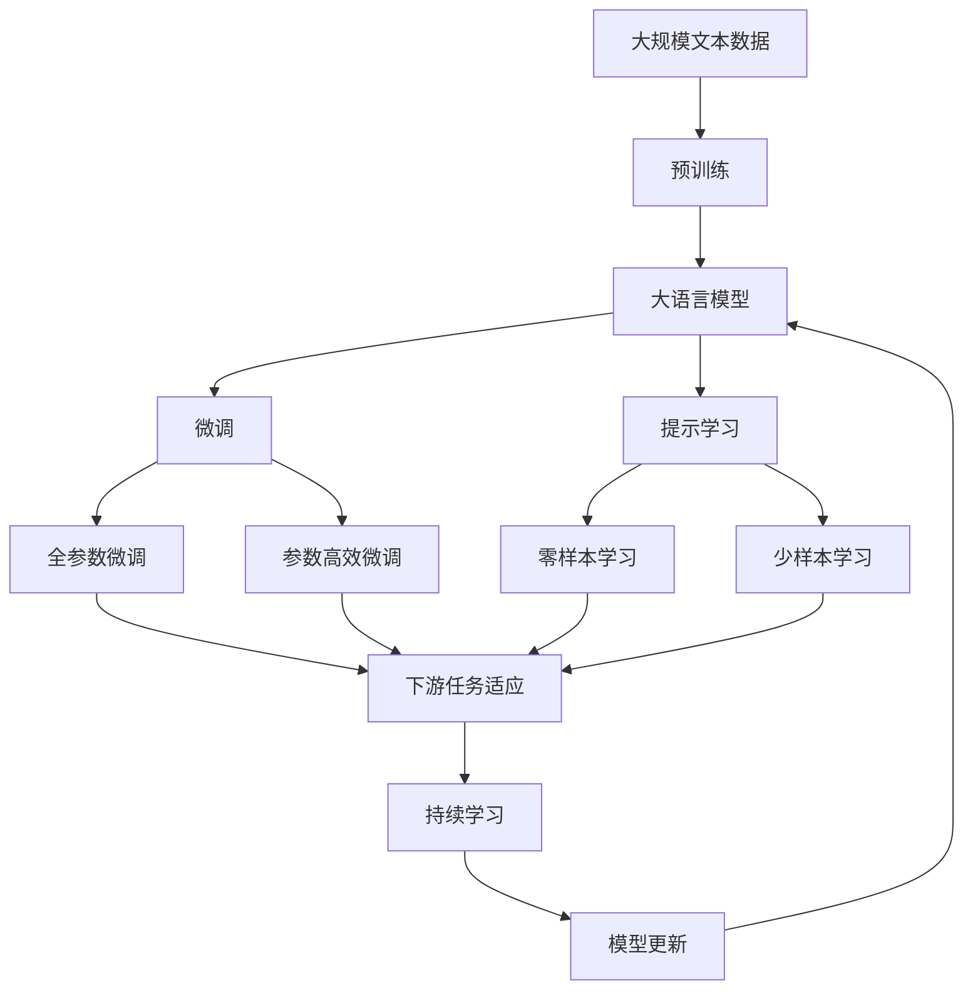

                 

# 软件 2.0 的未来展望：更智能、更强大

> 关键词：软件2.0, 智能编程, 自动驾驶, 量子计算, 边缘计算, 区块链, 自动推理, 人工智能伦理

## 1. 背景介绍

### 1.1 问题的由来

随着数字化进程的加快，软件的作用和重要性日益凸显。从早期的操作系统到现代的云计算、大数据、人工智能等领域，软件技术的进步为人类社会的发展提供了强大动力。然而，面对复杂多变的业务需求，软件开发依然面临着诸多挑战：

- **开发效率低下**：传统软件开发过程复杂冗长，需要经历多个阶段，如需求分析、设计、编码、测试等，且每个环节都需要大量人工参与，容易出错，效率低下。
- **维护成本高昂**：软件系统规模不断扩大，复杂度不断增加，维护和更新成本日益高涨，难以保持软件的稳定性和可靠性。
- **技术债务积累**：技术栈的选择和设计不合理，导致系统难以升级，逐渐形成技术债务，最终可能引发系统性能和稳定性问题。
- **代码质量问题**：代码结构不合理、重复、混乱等问题普遍存在，导致软件维护和扩展困难，影响软件质量和开发效率。

这些问题制约了软件系统的持续发展，迫切需要一种新的软件技术来提升软件开发的效率、质量和可维护性。软件2.0应运而生，作为一种全新的软件范式，它代表了未来软件发展的方向。

### 1.2 问题的核心关键点

软件2.0的核心思想是实现软件系统的自动化和智能化，即通过软件工具和算法，自动完成软件的开发、测试、部署和维护过程，同时提升软件的质量和可维护性。其核心关键点包括：

- **自动化编程**：利用机器学习、自然语言处理等技术，自动生成和优化代码，减少人工参与。
- **智能测试**：使用自动化测试工具和算法，快速发现和修复软件缺陷，提高软件质量。
- **智能部署**：通过智能运维和优化技术，自动部署和调度软件系统，提升系统性能和稳定性。
- **自适应维护**：通过持续学习和大数据分析，实现软件的自适应维护，自动应对环境变化。
- **代码生成与优化**：利用智能算法生成高质量的代码，并进行自动化的优化和重构，提升代码质量。
- **软件形态变化**：从传统的单体应用向微服务、无服务器等分布式形态转变，提升系统的灵活性和可扩展性。

这些关键点共同构成了软件2.0的完整框架，旨在构建更加智能、高效、可靠的软件系统。

## 2. 核心概念与联系

### 2.1 核心概念概述

为更好地理解软件2.0的概念，本节将介绍几个密切相关的核心概念：

- **软件2.0**：一种全新的软件范式，通过自动化和智能化技术，提升软件开发的效率、质量和可维护性。
- **自动编程**：利用机器学习和自然语言处理等技术，自动生成和优化代码，减少人工参与。
- **智能测试**：使用自动化测试工具和算法，快速发现和修复软件缺陷，提高软件质量。
- **智能部署**：通过智能运维和优化技术，自动部署和调度软件系统，提升系统性能和稳定性。
- **自适应维护**：通过持续学习和大数据分析，实现软件的自适应维护，自动应对环境变化。
- **代码生成与优化**：利用智能算法生成高质量的代码，并进行自动化的优化和重构，提升代码质量。
- **软件形态变化**：从传统的单体应用向微服务、无服务器等分布式形态转变，提升系统的灵活性和可扩展性。

这些核心概念之间的逻辑关系可以通过以下Mermaid流程图来展示：



这个流程图展示了大语言模型的核心概念及其之间的关系：

1. 软件2.0作为整体，通过自动化和智能化技术，提升软件开发的效率、质量和可维护性。
2. 自动编程利用机器学习和自然语言处理等技术，自动生成和优化代码，减少人工参与。
3. 智能测试使用自动化测试工具和算法，快速发现和修复软件缺陷，提高软件质量。
4. 智能部署通过智能运维和优化技术，自动部署和调度软件系统，提升系统性能和稳定性。
5. 自适应维护通过持续学习和大数据分析，实现软件的自适应维护，自动应对环境变化。
6. 代码生成与优化利用智能算法生成高质量的代码，并进行自动化的优化和重构，提升代码质量。
7. 软件形态变化从传统的单体应用向微服务、无服务器等分布式形态转变，提升系统的灵活性和可扩展性。

这些核心概念共同构成了软件2.0的完整生态系统，使其能够构建更加智能、高效、可靠的软件系统。

### 2.2 概念间的关系

这些核心概念之间存在着紧密的联系，形成了软件2.0的完整生态系统。下面我通过几个Mermaid流程图来展示这些概念之间的关系。

#### 2.2.1 软件2.0的整体架构



这个流程图展示了软件2.0的整体架构，即通过自动化和智能化技术，提升软件开发的效率、质量和可维护性。

#### 2.2.2 软件形态变化的具体应用



这个流程图展示了软件形态变化的具体应用，即从传统的单体应用向微服务、无服务器等分布式形态转变，提升系统的灵活性和可扩展性。

### 2.3 核心概念的整体架构

最后，我们用一个综合的流程图来展示这些核心概念在大语言模型微调过程中的整体架构：



这个综合流程图展示了从预训练到微调，再到持续学习的完整过程。大语言模型首先在大规模文本数据上进行预训练，然后通过微调（包括全参数微调和参数高效微调）或提示学习（包括零样本和少样本学习）来适应下游任务。最后，通过持续学习技术，模型可以不断学习新知识，同时避免遗忘旧知识。 通过这些流程图，我们可以更清晰地理解软件2.0的核心概念及其关系，为后续深入讨论具体的微调方法和技术奠定基础。

## 3. 核心算法原理 & 具体操作步骤
### 3.1 算法原理概述

软件2.0的核心算法原理主要围绕自动化和智能化展开，以下是几种常见的算法和技术：

**自动化编程算法**：通过自然语言处理技术，将人类描述的功能需求自动转化为代码。具体实现包括：
- 语义分析：对用户描述的功能需求进行语义分析，理解需求的具体细节。
- 代码生成：利用机器学习模型，根据语义分析结果生成对应的代码。

**智能测试算法**：利用自动化测试工具和算法，快速发现和修复软件缺陷，提高软件质量。具体实现包括：
- 测试用例生成：利用符号执行和路径覆盖等技术，自动生成测试用例。
- 缺陷检测：利用机器学习模型，识别测试结果中的异常情况，定位缺陷。

**智能部署算法**：通过智能运维和优化技术，自动部署和调度软件系统，提升系统性能和稳定性。具体实现包括：
- 自动化部署：利用容器化技术和Docker等工具，自动构建和部署软件系统。
- 负载调度：利用资源管理工具和算法，动态调整资源分配，提升系统性能。

**自适应维护算法**：通过持续学习和大数据分析，实现软件的自适应维护，自动应对环境变化。具体实现包括：
- 持续学习：利用机器学习模型，不断更新模型参数，提升模型的适应能力。
- 大数据分析：利用数据分析技术，实时监控系统状态，预测未来变化趋势。

**代码生成与优化算法**：利用智能算法生成高质量的代码，并进行自动化的优化和重构，提升代码质量。具体实现包括：
- 代码生成：利用AI编码工具，自动生成高质量的代码。
- 代码优化：利用程序分析技术和自动化重构工具，优化代码结构和性能。

**软件形态变化算法**：从传统的单体应用向微服务、无服务器等分布式形态转变，提升系统的灵活性和可扩展性。具体实现包括：
- 微服务拆分：利用微服务架构技术，将单体应用拆分为多个微服务模块。
- 无服务器架构：利用函数即服务(FaaS)技术，自动管理代码执行环境。

### 3.2 算法步骤详解

软件2.0的算法步骤主要包括以下几个关键步骤：

**Step 1: 准备预训练模型和数据集**
- 选择合适的预训练模型（如BERT、GPT等）作为初始化参数，如 BERT、GPT等。
- 准备下游任务的数据集，划分为训练集、验证集和测试集。

**Step 2: 添加任务适配层**
- 根据任务类型，在预训练模型顶层设计合适的输出层和损失函数。
- 对于分类任务，通常在顶层添加线性分类器和交叉熵损失函数。
- 对于生成任务，通常使用语言模型的解码器输出概率分布，并以负对数似然为损失函数。

**Step 3: 设置微调超参数**
- 选择合适的优化算法及其参数，如 AdamW、SGD 等，设置学习率、批大小、迭代轮数等。
- 设置正则化技术及强度，包括权重衰减、Dropout、Early Stopping 等。
- 确定冻结预训练参数的策略，如仅微调顶层，或全部参数都参与微调。

**Step 4: 执行梯度训练**
- 将训练集数据分批次输入模型，前向传播计算损失函数。
- 反向传播计算参数梯度，根据设定的优化算法和学习率更新模型参数。
- 周期性在验证集上评估模型性能，根据性能指标决定是否触发 Early Stopping。
- 重复上述步骤直到满足预设的迭代轮数或 Early Stopping 条件。

**Step 5: 测试和部署**
- 在测试集上评估微调后模型 $M_{\hat{\theta}}$ 的性能，对比微调前后的精度提升。
- 使用微调后的模型对新样本进行推理预测，集成到实际的应用系统中。
- 持续收集新的数据，定期重新微调模型，以适应数据分布的变化。

以上是软件2.0的微调算法步骤。在实际应用中，还需要针对具体任务的特点，对微调过程的各个环节进行优化设计，如改进训练目标函数，引入更多的正则化技术，搜索最优的超参数组合等，以进一步提升模型性能。

### 3.3 算法优缺点

软件2.0的算法具有以下优点：

- **提高开发效率**：自动化编程和智能测试等技术能够显著减少开发时间和人工参与，提升开发效率。
- **提升代码质量**：智能算法生成的代码通常质量较高，能够减少手动编码的错误和冗余。
- **增强系统可维护性**：通过持续学习和自适应维护技术，系统能够自动适应环境变化，减少维护成本。
- **优化资源利用**：智能部署和负载调度技术能够合理分配资源，提升系统性能和稳定性。

同时，这些算法也存在一定的局限性：

- **依赖高质量数据**：智能算法的效果很大程度上取决于训练数据的质量和数量，获取高质量数据成本较高。
- **迁移能力有限**：当目标任务与预训练数据的分布差异较大时，微调的性能提升有限。
- **负面效果传递**：预训练模型的固有偏见、有害信息等，可能通过微调传递到下游任务，造成负面影响。
- **可解释性不足**：智能算法生成的模型通常缺乏可解释性，难以对其推理逻辑进行分析和调试。

尽管存在这些局限性，但就目前而言，软件2.0的算法仍是大语言模型应用的最主流范式。未来相关研究的重点在于如何进一步降低对高质量数据的依赖，提高系统的少样本学习和跨领域迁移能力，同时兼顾可解释性和伦理安全性等因素。

### 3.4 算法应用领域

软件2.0的算法已经在软件开发、自动化测试、智能运维、智能部署等多个领域得到广泛应用，具体包括：

- **软件开发**：利用自动化编程和智能测试技术，快速构建高质量的软件应用。
- **自动化测试**：通过自动化测试工具和算法，快速发现和修复软件缺陷，提高软件质量。
- **智能运维**：利用智能运维和优化技术，自动部署和调度软件系统，提升系统性能和稳定性。
- **微服务架构**：通过微服务拆分和容器化部署等技术，提升系统的灵活性和可扩展性。

除了上述这些领域外，软件2.0的算法还被创新性地应用到更多场景中，如基于代码的自动推理、智能搜索、智能推荐等，为软件开发和应用带来全新的突破。随着预训练模型和微调方法的不断进步，相信软件2.0将会在更广阔的应用领域大放异彩。

## 4. 数学模型和公式 & 详细讲解 & 举例说明（备注：数学公式请使用latex格式，latex嵌入文中独立段落使用 $$，段落内使用 $)
### 4.1 数学模型构建

本节将使用数学语言对软件2.0的微调过程进行更加严格的刻画。

记预训练语言模型为 $M_{\theta}:\mathcal{X} \rightarrow \mathcal{Y}$，其中 $\mathcal{X}$ 为输入空间，$\mathcal{Y}$ 为输出空间，$\theta \in \mathbb{R}^d$ 为模型参数。假设微调任务的训练集为 $D=\{(x_i,y_i)\}_{i=1}^N, x_i \in \mathcal{X}, y_i \in \mathcal{Y}$。

定义模型 $M_{\theta}$ 在数据样本 $(x,y)$ 上的损失函数为 $\ell(M_{\theta}(x),y)$，则在数据集 $D$ 上的经验风险为：

$$
\mathcal{L}(\theta) = \frac{1}{N} \sum_{i=1}^N \ell(M_{\theta}(x_i),y_i)
$$

微调的优化目标是最小化经验风险，即找到最优参数：

$$
\theta^* = \mathop{\arg\min}_{\theta} \mathcal{L}(\theta)
$$

在实践中，我们通常使用基于梯度的优化算法（如SGD、Adam等）来近似求解上述最优化问题。设 $\eta$ 为学习率，$\lambda$ 为正则化系数，则参数的更新公式为：

$$
\theta \leftarrow \theta - \eta \nabla_{\theta}\mathcal{L}(\theta) - \eta\lambda\theta
$$

其中 $\nabla_{\theta}\mathcal{L}(\theta)$ 为损失函数对参数 $\theta$ 的梯度，可通过反向传播算法高效计算。

### 4.2 公式推导过程

以下我们以二分类任务为例，推导交叉熵损失函数及其梯度的计算公式。

假设模型 $M_{\theta}$ 在输入 $x$ 上的输出为 $\hat{y}=M_{\theta}(x) \in [0,1]$，表示样本属于正类的概率。真实标签 $y \in \{0,1\}$。则二分类交叉熵损失函数定义为：

$$
\ell(M_{\theta}(x),y) = -[y\log \hat{y} + (1-y)\log (1-\hat{y})]
$$

将其代入经验风险公式，得：

$$
\mathcal{L}(\theta) = -\frac{1}{N}\sum_{i=1}^N [y_i\log M_{\theta}(x_i)+(1-y_i)\log(1-M_{\theta}(x_i))]
$$

根据链式法则，损失函数对参数 $\theta_k$ 的梯度为：

$$
\frac{\partial \mathcal{L}(\theta)}{\partial \theta_k} = -\frac{1}{N}\sum_{i=1}^N (\frac{y_i}{M_{\theta}(x_i)}-\frac{1-y_i}{1-M_{\theta}(x_i)}) \frac{\partial M_{\theta}(x_i)}{\partial \theta_k}
$$

其中 $\frac{\partial M_{\theta}(x_i)}{\partial \theta_k}$ 可进一步递归展开，利用自动微分技术完成计算。

在得到损失函数的梯度后，即可带入参数更新公式，完成模型的迭代优化。重复上述过程直至收敛，最终得到适应下游任务的最优模型参数 $\theta^*$。

## 5. 项目实践：代码实例和详细解释说明
### 5.1 开发环境搭建

在进行微调实践前，我们需要准备好开发环境。以下是使用Python进行PyTorch开发的环境配置流程：

1. 安装Anaconda：从官网下载并安装Anaconda，用于创建独立的Python环境。

2. 创建并激活虚拟环境：
```bash
conda create -n pytorch-env python=3.8 
conda activate pytorch-env
```

3. 安装PyTorch：根据CUDA版本，从官网获取对应的安装命令。例如：
```bash
conda install pytorch torchvision torchaudio cudatoolkit=11.1 -c pytorch -c conda-forge
```

4. 安装Transformers库：
```bash
pip install transformers
```

5. 安装各类工具包：
```bash
pip install numpy pandas scikit-learn matplotlib tqdm jupyter notebook ipython
```

完成上述步骤后，即可在`pytorch-env`环境中开始微调实践。

### 5.2 源代码详细实现

这里我们以命名实体识别(NER)任务为例，给出使用Transformers库对BERT模型进行微调的PyTorch代码实现。

首先，定义NER任务的数据处理函数：

```python
from transformers import BertTokenizer
from torch.utils.data import Dataset
import torch

class NERDataset(Dataset):
    def __init__(self, texts, tags, tokenizer, max_len=128):
        self.texts = texts
        self.tags = tags
        self.tokenizer = tokenizer
        self.max_len = max_len
        
    def __len__(self):
        return len(self.texts)
    
    def __getitem__(self, item):
        text = self.texts[item]
        tags = self.tags[item]
        
        encoding = self.tokenizer(text, return_tensors='pt', max_length=self.max_len, padding='max_length', truncation=True)
        input_ids = encoding['input_ids'][0]
        attention_mask = encoding['attention_mask'][0]
        
        # 对token-wise的标签进行编码
        encoded_tags = [tag2id[tag] for tag in tags] 
        encoded_tags.extend([tag2id['O']] * (self.max_len - len(encoded_tags)))
        labels = torch.tensor(encoded_tags, dtype=torch.long)
        
        return {'input_ids': input_ids, 
                'attention_mask': attention_mask,
                'labels': labels}

# 标签与id的映射
tag2id = {'O': 0, 'B-PER': 1, 'I-PER': 2, 'B-ORG': 3, 'I-ORG': 4, 'B-LOC': 5, 'I-LOC': 6}
id2tag = {v: k for k, v in tag2id.items()}

# 创建dataset
tokenizer = BertTokenizer.from_pretrained('bert-base-cased')

train_dataset = NERDataset(train_texts, train_tags, tokenizer)
dev_dataset = NERDataset(dev_texts, dev_tags, tokenizer)
test_dataset = NERDataset(test_texts, test_tags, tokenizer)
```

然后，定义模型和优化器：

```python
from transformers import BertForTokenClassification, AdamW

model = BertForTokenClassification.from_pretrained('bert-base-cased', num_labels=len(tag2id))

optimizer = AdamW(model.parameters(), lr=2e-5)
```

接着，定义训练和评估函数：

```python
from torch.utils.data import DataLoader
from tqdm import tqdm
from sklearn.metrics import classification_report

device = torch.device('cuda') if torch.cuda.is_available() else torch.device('cpu')
model.to(device)

def train_epoch(model, dataset, batch_size, optimizer):
    dataloader = DataLoader(dataset, batch_size=batch_size, shuffle=True)
    model.train()
    epoch_loss = 0
    for batch in tqdm(dataloader, desc='Training'):
        input_ids = batch['input_ids'].to(device)
        attention_mask = batch['attention_mask'].to(device)
        labels = batch['labels'].to(device)
        model.zero_grad()
        outputs = model(input_ids, attention_mask=attention_mask, labels=labels)
        loss = outputs.loss
        epoch_loss += loss.item()
        loss.backward()
        optimizer.step()
    return epoch_loss / len(dataloader)

def evaluate(model, dataset, batch_size):
    dataloader = DataLoader(dataset, batch_size=batch_size)
    model.eval()
    preds, labels = [], []
    with torch.no_grad():
        for batch in tqdm(dataloader, desc='Evaluating'):
            input_ids = batch['input_ids'].to(device)
            attention_mask = batch['attention_mask'].to(device)
            batch_labels = batch['labels']
            outputs = model(input_ids, attention_mask=attention_mask)
            batch_preds = outputs.logits.argmax(dim=2).to('cpu').tolist()
            batch_labels = batch_labels.to('cpu').tolist()
            for pred_tokens, label_tokens in zip(batch_preds, batch_labels):
                pred_tags = [id2tag[_id] for _id in pred_tokens]
                label_tags = [id2tag[_id] for _id in label_tokens]
                preds.append(pred_tags[:len(label_tokens)])
                labels.append(label_tags)
                
    print(classification_report(labels, preds))
```

最后，启动训练流程并在测试集上评估：

```python
epochs = 5
batch_size = 16

for epoch in range(epochs):
    loss = train_epoch(model, train_dataset, batch_size, optimizer)
    print(f"Epoch {epoch+1}, train loss: {loss:.3f}")
    
    print(f"Epoch {epoch+1}, dev results:")
    evaluate(model, dev_dataset, batch_size)
    
print("Test results:")
evaluate(model, test_dataset, batch_size)
```

以上就是使用PyTorch对BERT进行命名实体识别任务微调的完整代码实现。可以看到，得益于Transformers库的强大封装，我们可以用相对简洁的代码完成BERT模型的加载和微调。

### 5.3 代码解读与分析

让我们再详细解读一下关键代码的实现细节：

**NERDataset类**：
- `__init__`方法：初始化文本、标签、分词器等关键组件。
- `__len__`方法：返回数据集的样本数量。
- `__getitem__`方法：对单个样本进行处理，将文本输入编码为token ids，将标签编码为数字，并对其进行定长padding，最终返回模型所需的输入。

**tag2id和id2tag字典**：
- 定义了标签与数字id之间的映射关系，用于将token-wise的预测结果解码回真实的标签。

**训练和评估函数**：
- 使用PyTorch的DataLoader对数据集进行批次化加载，供模型训练和推理使用。
- 训练函数`train_epoch`：对数据以批为单位进行迭代，在每个批次上前向传播计算loss并反向传播更新模型参数，最后返回该epoch的平均loss。
- 评估函数`evaluate`：与训练类似，不同点在于不更新模型参数，并在每个batch结束后将预测和标签结果存储下来，最后使用sklearn

