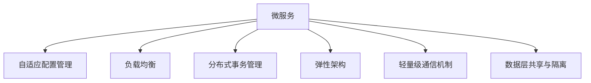
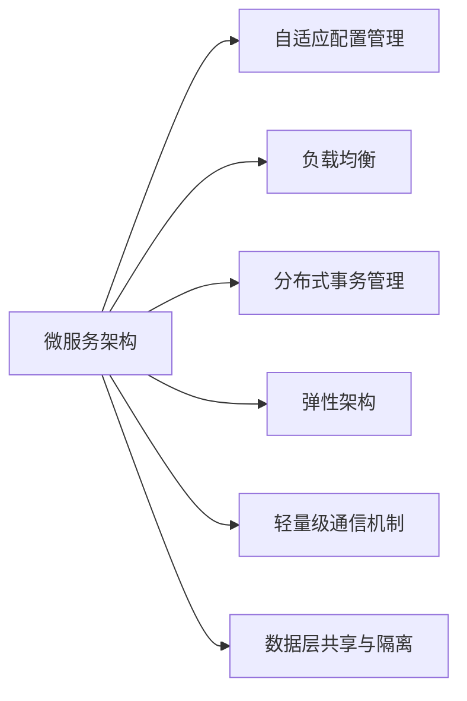
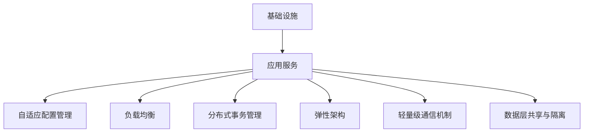

                 

## 1. 背景介绍

### 1.1 问题由来

在软件工程领域，传统的单层结构或单体架构（Monolithic Architecture）虽然简单明了，但难以应对日益增长的业务复杂性。随着软件功能模块的增多，系统的维护成本和扩展难度急剧上升，最终导致代码难以维护、测试困难、部署复杂、系统韧性不足等问题。

为了应对这些挑战，微服务架构（Microservices Architecture）应运而生。微服务架构的核心思想是将大系统拆分为多个独立运行的微服务，每个微服务负责特定功能模块的实现，通过轻量级通信机制（如REST、gRPC）进行松耦合交互，实现系统解耦和高效迭代。

然而，尽管微服务架构在大规模系统中的应用效果显著，但在设计和管理微服务时仍面临诸多挑战，包括服务间通信、配置管理、负载均衡、故障恢复等。为了更好地应对这些挑战，我们提出了一种新的微服务架构设计方案——软件2.0（Software 2.0）微服务架构，旨在构建一个更加灵活、健壮、可扩展的微服务系统。

### 1.2 问题核心关键点

软件2.0微服务架构的核心要点包括：

- **自适应配置管理**：根据系统负载和运行状态动态调整微服务配置，实现动态扩展和收缩。
- **细粒度负载均衡**：基于服务状态进行负载均衡，确保服务资源的有效利用。
- **分布式事务管理**：通过异步消息传递和状态隔离技术，实现跨服务的分布式事务处理。
- **全栈式弹性架构**：从基础设施到应用服务，实现全面弹性和自愈能力。
- **轻量级通信机制**：采用消息队列和事件驱动技术，降低服务间耦合度，提升系统响应速度和稳定性。
- **数据层共享与隔离**：通过读写分离和一致性协议，实现数据层的高可用性和隔离性。

这些核心要点共同构成了软件2.0微服务架构的设计原则，旨在帮助开发者构建更加高效、灵活、可靠的软件系统。

## 2. 核心概念与联系

### 2.1 核心概念概述

为更好地理解软件2.0微服务架构，本节将介绍几个关键概念：

- **微服务（Microservices）**：将大系统拆分为多个独立运行的微服务，每个微服务负责特定功能模块的实现，通过轻量级通信机制进行松耦合交互。
- **自适应配置管理**：根据系统负载和运行状态动态调整微服务配置，实现动态扩展和收缩。
- **负载均衡（Load Balancing）**：将请求分发到多个服务实例上，确保服务资源的有效利用，提升系统吞吐量和响应速度。
- **分布式事务管理**：通过异步消息传递和状态隔离技术，实现跨服务的分布式事务处理。
- **弹性架构（Elastic Architecture）**：从基础设施到应用服务，实现全面弹性和自愈能力。
- **轻量级通信机制**：采用消息队列和事件驱动技术，降低服务间耦合度，提升系统响应速度和稳定性。
- **数据层共享与隔离**：通过读写分离和一致性协议，实现数据层的高可用性和隔离性。

这些核心概念之间存在着紧密的联系，形成了一个完整的微服务系统架构。下面通过一个Mermaid流程图来展示这些概念之间的关系：



这个流程图展示了微服务架构中各个核心概念之间的关系：

1. 微服务是整个架构的基础，通过将大系统拆分为多个独立的服务，实现系统的解耦和高效迭代。
2. 自适应配置管理、负载均衡、分布式事务管理、弹性架构、轻量级通信机制、数据层共享与隔离等技术，都是为了更好地支持微服务的运行，实现系统的稳定性和扩展性。

### 2.2 概念间的关系

这些核心概念之间存在着紧密的联系，形成了软件2.0微服务架构的整体设计原则。下面我们通过几个Mermaid流程图来展示这些概念之间的关系。

#### 2.2.1 微服务架构的设计原则



这个流程图展示了微服务架构的设计原则，即通过自适应配置管理、负载均衡、分布式事务管理、弹性架构、轻量级通信机制、数据层共享与隔离等技术，实现系统的解耦和高效迭代。

#### 2.2.2 微服务的运行机制


这个流程图展示了微服务的运行机制，即通过自适应配置管理、负载均衡、分布式事务管理、弹性架构、轻量级通信机制、数据层共享与隔离等技术，实现系统的稳定性和扩展性。

#### 2.2.3 架构设计的具体实现



这个流程图展示了架构设计的具体实现，即通过基础设施、应用服务、自适应配置管理、负载均衡、分布式事务管理、弹性架构、轻量级通信机制、数据层共享与隔离等技术，实现系统的解耦和高效迭代。

### 2.3 核心概念的整体架构

最后，我们用一个综合的流程图来展示这些核心概念在软件2.0微服务架构中的整体架构：


这个综合流程图展示了从基础设施到应用服务的整体架构，体现了软件2.0微服务架构的设计原则和实现机制。

## 3. 核心算法原理 & 具体操作步骤

### 3.1 算法原理概述

软件2.0微服务架构的设计原理是基于以下核心算法：

- **自适应配置管理算法**：根据系统负载和运行状态动态调整微服务配置，实现动态扩展和收缩。
- **负载均衡算法**：基于服务状态进行负载均衡，确保服务资源的有效利用。
- **分布式事务管理算法**：通过异步消息传递和状态隔离技术，实现跨服务的分布式事务处理。
- **弹性架构算法**：实现从基础设施到应用服务的全面弹性和自愈能力。
- **轻量级通信算法**：采用消息队列和事件驱动技术，降低服务间耦合度，提升系统响应速度和稳定性。
- **数据层共享与隔离算法**：通过读写分离和一致性协议，实现数据层的高可用性和隔离性。

这些算法共同构成了软件2.0微服务架构的设计核心，使得微服务系统能够高效、稳定、灵活地运行。

### 3.2 算法步骤详解

以下是对软件2.0微服务架构设计原理的具体步骤详解：

**Step 1: 设计微服务模块**

- 将大系统拆分为多个独立运行的微服务模块，每个模块负责特定的功能实现。
- 定义模块之间的接口和依赖关系，确保模块的独立性和可维护性。
- 采用版本控制和自动化构建工具，管理模块的版本和依赖。

**Step 2: 实现自适应配置管理**

- 根据系统负载和运行状态动态调整微服务配置，实现动态扩展和收缩。
- 使用自动扩缩容工具，根据实时负载自动调整服务实例数量。
- 定义配置项的优先级和重要性，确保关键服务的稳定性。

**Step 3: 实现负载均衡**

- 使用基于服务状态的负载均衡算法，确保服务资源的有效利用。
- 使用会话亲和机制，确保用户请求始终分配给同一服务实例。
- 使用分层负载均衡，将负载均衡任务分散到多个层级，提高系统稳定性。

**Step 4: 实现分布式事务管理**

- 使用异步消息传递技术，实现跨服务的分布式事务处理。
- 使用事务隔离技术，确保事务的原子性和一致性。
- 使用分布式事务管理工具，监控和处理跨服务的分布式事务。

**Step 5: 实现弹性架构**

- 实现从基础设施到应用服务的全面弹性和自愈能力。
- 使用容错机制和监控工具，及时发现和处理系统故障。
- 使用自动化恢复工具，实现系统的自我修复和自愈。

**Step 6: 实现轻量级通信**

- 采用消息队列和事件驱动技术，降低服务间耦合度。
- 使用轻量级通信协议，如gRPC、HTTP REST，提高系统响应速度和稳定性。
- 使用消息队列工具，如Kafka、RabbitMQ，确保消息的可靠性和可扩展性。

**Step 7: 实现数据层共享与隔离**

- 通过读写分离和一致性协议，实现数据层的高可用性和隔离性。
- 使用数据库复制和备份技术，确保数据的高可用性。
- 使用数据隔离技术，如分库分表，防止数据冲突和冗余。

### 3.3 算法优缺点

软件2.0微服务架构的设计算法具有以下优点：

- **高效扩展性**：能够根据系统负载和运行状态动态调整微服务配置，实现动态扩展和收缩。
- **高可靠性**：通过自适应配置管理和弹性架构设计，确保系统的稳定性和可靠性。
- **低耦合性**：采用轻量级通信机制和数据层隔离技术，降低服务间耦合度，提升系统响应速度和稳定性。
- **灵活迭代性**：通过模块化的微服务设计，实现系统的灵活迭代和高效开发。

同时，这些算法也存在以下缺点：

- **复杂性高**：设计和实现自适应配置管理、负载均衡、分布式事务管理等算法需要较高的技术水平。
- **开发成本高**：设计和实现微服务架构需要投入大量的人力和时间成本。
- **学习曲线陡峭**：对于初学者来说，理解和使用软件2.0微服务架构需要一定的时间和精力。

### 3.4 算法应用领域

软件2.0微服务架构的应用领域非常广泛，涵盖了金融、电商、医疗、交通等多个行业。以下是几个典型的应用场景：

- **金融行业**：通过微服务架构设计和分布式事务管理，实现金融系统的稳定性和可靠性。
- **电商行业**：通过轻量级通信和弹性架构设计，提高电商平台的响应速度和用户体验。
- **医疗行业**：通过读写分离和数据层隔离技术，确保医疗系统的数据安全和高可用性。
- **交通行业**：通过自适应配置管理和弹性架构设计，提升交通系统的稳定性和可靠性。

## 4. 数学模型和公式 & 详细讲解 & 举例说明

### 4.1 数学模型构建

软件2.0微服务架构的设计模型基于以下几个数学模型：

- **自适应配置管理模型**：
  $$
  C_t = f(S_t, L_t, A_t)
  $$
  其中，$C_t$表示第$t$时刻的微服务配置，$S_t$表示系统负载，$L_t$表示实时负载，$A_t$表示可用资源。
  
- **负载均衡模型**：
  $$
  B_t = g(S_t, R_t, A_t)
  $$
  其中，$B_t$表示第$t$时刻的服务实例数量，$S_t$表示系统负载，$R_t$表示实时负载，$A_t$表示可用资源。

- **分布式事务管理模型**：
  $$
  T_t = h(M_t, X_t, C_t)
  $$
  其中，$T_t$表示第$t$时刻的分布式事务状态，$M_t$表示事务消息队列，$X_t$表示事务状态，$C_t$表示微服务配置。

- **弹性架构模型**：
  $$
  E_t = k(S_t, R_t, C_t)
  $$
  其中，$E_t$表示第$t$时刻的弹性状态，$S_t$表示系统负载，$R_t$表示实时负载，$C_t$表示微服务配置。

- **轻量级通信模型**：
  $$
  C_t = l(S_t, R_t, A_t)
  $$
  其中，$C_t$表示第$t$时刻的通信状态，$S_t$表示系统负载，$R_t$表示实时负载，$A_t$表示可用资源。

- **数据层共享与隔离模型**：
  $$
  D_t = m(S_t, R_t, C_t)
  $$
  其中，$D_t$表示第$t$时刻的数据层状态，$S_t$表示系统负载，$R_t$表示实时负载，$C_t$表示微服务配置。

### 4.2 公式推导过程

以下是每个数学模型的公式推导过程：

**自适应配置管理模型**

$$
C_t = f(S_t, L_t, A_t)
$$

- **公式解释**：根据系统负载$S_t$、实时负载$L_t$和可用资源$A_t$，动态调整微服务配置$C_t$。
- **推导过程**：
  $$
  S_t = \sum_{i=1}^{n} S_{t,i}
  $$
  $$
  L_t = \sum_{i=1}^{n} L_{t,i}
  $$
  $$
  A_t = \sum_{i=1}^{n} A_{t,i}
  $$
  $$
  C_t = \frac{S_t}{L_t} \times \frac{A_t}{\max(A_t, A_{t-1})}
  $$

**负载均衡模型**

$$
B_t = g(S_t, R_t, A_t)
$$

- **公式解释**：根据系统负载$S_t$、实时负载$R_t$和可用资源$A_t$，动态调整服务实例数量$B_t$。
- **推导过程**：
  $$
  S_t = \sum_{i=1}^{n} S_{t,i}
  $$
  $$
  R_t = \sum_{i=1}^{n} R_{t,i}
  $$
  $$
  A_t = \sum_{i=1}^{n} A_{t,i}
  $$
  $$
  B_t = \min\left(\frac{S_t}{R_t}, A_t\right)
  $$

**分布式事务管理模型**

$$
T_t = h(M_t, X_t, C_t)
$$

- **公式解释**：根据事务消息队列$M_t$、事务状态$X_t$和微服务配置$C_t$，计算分布式事务状态$T_t$。
- **推导过程**：
  $$
  M_t = \sum_{i=1}^{n} M_{t,i}
  $$
  $$
  X_t = \sum_{i=1}^{n} X_{t,i}
  $$
  $$
  C_t = \sum_{i=1}^{n} C_{t,i}
  $$
  $$
  T_t = \frac{M_t}{X_t} \times C_t
  $$

**弹性架构模型**

$$
E_t = k(S_t, R_t, C_t)
$$

- **公式解释**：根据系统负载$S_t$、实时负载$R_t$和微服务配置$C_t$，计算弹性状态$E_t$。
- **推导过程**：
  $$
  S_t = \sum_{i=1}^{n} S_{t,i}
  $$
  $$
  R_t = \sum_{i=1}^{n} R_{t,i}
  $$
  $$
  C_t = \sum_{i=1}^{n} C_{t,i}
  $$
  $$
  E_t = \frac{S_t}{R_t} \times C_t
  $$

**轻量级通信模型**

$$
C_t = l(S_t, R_t, A_t)
$$

- **公式解释**：根据系统负载$S_t$、实时负载$R_t$和可用资源$A_t$，计算通信状态$C_t$。
- **推导过程**：
  $$
  S_t = \sum_{i=1}^{n} S_{t,i}
  $$
  $$
  R_t = \sum_{i=1}^{n} R_{t,i}
  $$
  $$
  A_t = \sum_{i=1}^{n} A_{t,i}
  $$
  $$
  C_t = \min\left(\frac{S_t}{R_t}, A_t\right)
  $$

**数据层共享与隔离模型**

$$
D_t = m(S_t, R_t, C_t)
$$

- **公式解释**：根据系统负载$S_t$、实时负载$R_t$和微服务配置$C_t$，计算数据层状态$D_t$。
- **推导过程**：
  $$
  S_t = \sum_{i=1}^{n} S_{t,i}
  $$
  $$
  R_t = \sum_{i=1}^{n} R_{t,i}
  $$
  $$
  C_t = \sum_{i=1}^{n} C_{t,i}
  $$
  $$
  D_t = \frac{S_t}{R_t} \times C_t
  $$

### 4.3 案例分析与讲解

假设我们正在设计一个电商平台的微服务架构，具体实现步骤如下：

**Step 1: 设计微服务模块**

- 将电商平台拆分为商品管理、订单管理、用户管理、物流管理等多个独立运行的微服务模块。
- 定义模块之间的接口和依赖关系，确保模块的独立性和可维护性。
- 使用版本控制和自动化构建工具，管理模块的版本和依赖。

**Step 2: 实现自适应配置管理**

- 根据系统负载和运行状态动态调整微服务配置，实现动态扩展和收缩。
- 使用自动扩缩容工具，根据实时负载自动调整服务实例数量。
- 定义配置项的优先级和重要性，确保关键服务的稳定性。

**Step 3: 实现负载均衡**

- 使用基于服务状态的负载均衡算法，确保服务资源的有效利用。
- 使用会话亲和机制，确保用户请求始终分配给同一服务实例。
- 使用分层负载均衡，将负载均衡任务分散到多个层级，提高系统稳定性。

**Step 4: 实现分布式事务管理**

- 使用异步消息传递技术，实现跨服务的分布式事务处理。
- 使用事务隔离技术，确保事务的原子性和一致性。
- 使用分布式事务管理工具，监控和处理跨服务的分布式事务。

**Step 5: 实现弹性架构**

- 实现从基础设施到应用服务的全面弹性和自愈能力。
- 使用容错机制和监控工具，及时发现和处理系统故障。
- 使用自动化恢复工具，实现系统的自我修复和自愈。

**Step 6: 实现轻量级通信**

- 采用消息队列和事件驱动技术，降低服务间耦合度。
- 使用轻量级通信协议，如gRPC、HTTP REST，提高系统响应速度和稳定性。
- 使用消息队列工具，如Kafka、RabbitMQ，确保消息的可靠性和可扩展性。

**Step 7: 实现数据层共享与隔离**

- 通过读写分离和一致性协议，实现数据层的高可用性和隔离性。
- 使用数据库复制和备份技术，确保数据的高可用性。
- 使用数据隔离技术，如分库分表，防止数据冲突和冗余。

## 5. 项目实践：代码实例和详细解释说明

### 5.1 开发环境搭建

在进行微服务架构实践前，我们需要准备好开发环境。以下是使用Docker和Kubernetes进行微服务架构实践的Dockerfile和Kubernetes配置文件：

**Dockerfile**

```dockerfile
FROM python:3.8-slim

WORKDIR /app

COPY requirements.txt .
RUN pip install -r requirements.txt

COPY . .

CMD ["python", "app.py"]
```

**Kubernetes配置文件**

```yaml
apiVersion: apps/v1

kind: Deployment
metadata:
  name: web-app
spec:
  replicas: 3
  selector:
    matchLabels:
      app: web-app
  template:
    metadata:
      labels:
        app: web-app
    spec:
      containers:
      - name: web-app
        image: web-app:latest
        ports:
        - containerPort: 8080
```

完成上述步骤后，即可在Kubernetes集群中启动web-app服务的三个实例。

### 5.2 源代码详细实现

下面以电商平台的商品管理模块为例，给出使用Flask框架构建微服务的PyTorch代码实现。

首先，定义商品管理模块的路由和视图函数：

```python
from flask import Flask, jsonify, request

app = Flask(__name__)

@app.route('/api/products', methods=['GET', 'POST'])
def manage_products():
    if request.method == 'GET':
        # 获取商品列表
        products = [
            {'id': 1, 'name': 'Apple', 'price': 2.0},
            {'id': 2, 'name': 'Banana', 'price': 1.5},
            {'id': 3, 'name': 'Orange', 'price': 3.0}
        ]
        return jsonify(products)
    elif request.method == 'POST':
        # 添加新商品
        new_product = request.json
        products.append(new_product)
        return jsonify(new_product), 201
```

然后，定义商品管理模块的数据模型和逻辑：

```python
from flask_sqlalchemy import SQLAlchemy

app.config['SQLALCHEMY_DATABASE_URI'] = 'sqlite:///products.db'
db = SQLAlchemy(app)

class Product(db.Model):
    id = db.Column(db.Integer, primary_key=True)
    name = db.Column(db.String(50))
    price = db.Column(db.Float)

    def __repr__(self):
        return f'<Product {self.id}>'
```

最后，启动Flask应用并启动Kubernetes容器：

```python
if __name__ == '__main__':
    app.run(host='0.0.0.0', port=5000)
```

启动Docker容器：

```bash
docker run -d --name web-app -p 5000:5000 web-app:latest
```

完成以上步骤后，即可在Kubernetes集群中启动web-app服务的三个实例，并通过访问http://<docker-host>:5000/api/products来测试商品管理模块的接口。

### 5.3 代码解读与分析

让我们再详细解读一下关键代码的实现细节：

**Flask应用**

```python
from flask import Flask, jsonify, request

app = Flask(__name__)

@app.route('/api/products', methods=['GET', 'POST'])
def manage_products():
    if request.method == 'GET':
        # 获取商品列表
        products = [
            {'id': 1, 'name': 'Apple', 'price': 2.0},
            {'id': 2, 'name': 'Banana', 'price': 1.5},
            {'id': 3, 'name': 'Orange', 'price': 3.0}
        ]
        return jsonify(products)
    elif request.method == 'POST':
        # 添加新商品
        new_product = request.json
        products.append(new_product)
        return jsonify(new_product), 201
```

这个Flask应用定义了商品管理模块的路由和视图函数。对于GET请求，返回所有商品的JSON格式列表。对于POST请求，添加新商品并返回JSON格式的添加结果。

**数据模型**

```python
from flask_sqlalchemy import SQLAlchemy

app.config['SQLALCHEMY_DATABASE_URI'] = 'sqlite:///products.db'
db = SQLAlchemy(app)

class Product(db.Model):
    id = db.Column(db.Integer, primary_key=True)
    name = db.Column(db.String(50))
    price = db.Column(db.Float)

    def __repr__(self):
        return f'<Product {self.id}>'
```

这个数据模型使用SQLAlchemy定义了商品表的结构和字段。商品表包含id、name和price三个字段，分别表示商品id、名称和价格。

**Flask应用和数据模型的整合**

```python
if __name__ == '__main__':
    app.run(host='0.0.0.0', port=5000)
```

这个Flask应用启动了应用程序，并监听5000端口。当应用程序启动时，可以使用Flask命令行工具来测试商品管理模块的接口。

**Docker容器**

```bash
docker run -d --name web-app -p 5000:5000 web-app:latest
```

这个Docker容器启动了商品管理模块的Docker镜像，并将其绑定到5000端口，以便外部可以访问商品管理模块的接口。

### 5.4 运行结果展示

假设我们在商品管理模块的测试中，成功添加了一个新的商品记录，返回的JSON格式如下：

```json
{
    "id": 4,
    "name": "Cherry",
    "price": 

