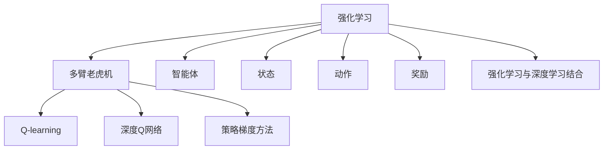
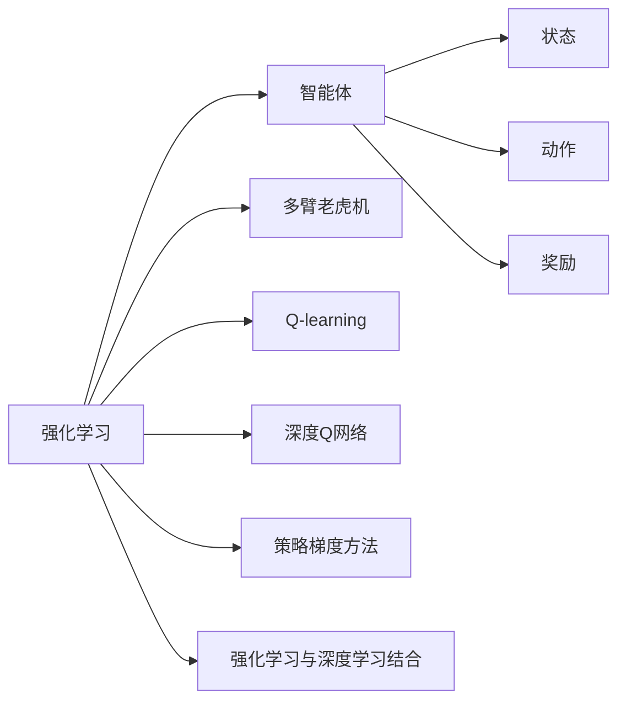
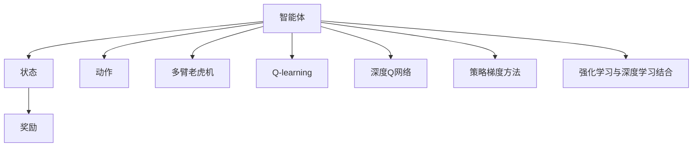

                 

# 软件2.0遇上强化学习，智能体大显身手

> 关键词：软件2.0,强化学习,智能体,深度学习,人工神经网络,优化算法,多臂老虎机

## 1. 背景介绍

### 1.1 问题由来
随着软件工程的发展，传统的软件开发范式（如瀑布模型、敏捷开发等）已难以满足日益复杂的软件系统需求。这一现象催生了软件2.0的概念，强调通过机器学习、数据驱动等先进技术，实现软件系统的高效、智能、自适应。其中，强化学习(Reinforcement Learning, RL)作为一种探索性极强、自适应能力强的学习范式，正成为软件2.0开发的重要工具。

强化学习在多臂老虎机(Multi-Arm Bandit)等典型问题上已经取得了显著成效。然而，由于其复杂的数学和算法模型，强化学习在实际软件系统中的应用仍面临诸多挑战。本文将详细探讨强化学习在软件2.0中的实现与优化，剖析其与软件系统的结合方式，并展望其未来发展趋势。

### 1.2 问题核心关键点
本文旨在探讨如何利用强化学习在软件2.0中实现智能体的自主优化，并降低其复杂度。具体问题包括：
- 如何构建符合软件系统特点的强化学习模型？
- 如何设计智能体在软件系统中的行为策略？
- 如何在实际软件中应用强化学习模型，并评估其效果？
- 强化学习模型的优化方法有哪些？

### 1.3 问题研究意义
强化学习在软件2.0中的应用，对于提升软件系统的智能水平、提高开发效率、降低维护成本等方面具有重要意义。通过强化学习，软件系统能够实现自动优化、自适应和自我学习，从而在复杂多变的环境中保持竞争力。本文旨在深入解析强化学习在软件系统中的作用，帮助开发者更好地理解和应用这一技术，推动软件工程向更智能化、自动化方向发展。

## 2. 核心概念与联系

### 2.1 核心概念概述

为更好地理解强化学习在软件2.0中的应用，本节将介绍几个核心概念：

- 强化学习(Reinforcement Learning, RL)：通过智能体与环境的交互，智能体在每次交互中根据当前状态和奖励信号选择行为，逐步学习最优策略，以最大化长期奖励的一种学习范式。
- 多臂老虎机(Multi-Arm Bandit)：强化学习中经典的模型，智能体需要在多个“臂”中选择“拉”哪一个能够获得最大奖励。
- 智能体(Agent)：强化学习中的决策主体，根据当前状态和奖励信号，选择最优行为策略。
- 状态(State)：智能体在当前环境下的状态，用于描述环境的特征。
- 动作(Action)：智能体在特定状态下所采取的行为。
- 奖励(Reward)：智能体在执行特定动作后获得的即时奖励或惩罚，用于指导智能体的行为选择。
- Q-learning：一种基于值函数迭代的强化学习算法，通过逐步更新Q值函数，学习最优行为策略。
- 深度Q网络(Deep Q-Network, DQN)：利用深度神经网络逼近Q值函数，提高Q-learning的收敛速度和准确性。
- 策略梯度方法(Strategy Gradient Method)：直接优化策略函数，通过梯度上升策略函数的参数，学习最优行为策略。
- 强化学习与深度学习结合：通过深度神经网络逼近策略函数或价值函数，提升强化学习的表现和复杂度。

这些概念之间的逻辑关系可以通过以下Mermaid流程图来展示：



这个流程图展示了强化学习中的核心概念及其相互关系：

1. 强化学习通过智能体与环境的交互，学习最优策略。
2. 多臂老虎机是强化学习中典型的模型。
3. 智能体是学习的主体，负责根据当前状态选择最优动作。
4. 状态和动作描述环境特征和智能体的行为。
5. 奖励指导智能体的行为选择。
6. 通过Q-learning等算法学习最优策略，DQN等深度学习模型提高学习效率。
7. 策略梯度方法直接优化策略函数，学习行为策略。
8. 强化学习与深度学习结合，提升学习效果和复杂度。

这些概念共同构成了强化学习的基础框架，为其在软件2.0中的应用提供了理论支持。

### 2.2 概念间的关系

这些核心概念之间存在着紧密的联系，形成了强化学习在软件2.0中的应用框架。以下是几个关键概念之间的关系图：



这个关系图展示了强化学习在软件2.0中的应用过程：

1. 智能体在特定状态下执行动作，获得奖励。
2. 多臂老虎机是多臂问题的抽象，用于描述智能体面临的决策环境。
3. Q-learning和DQN等算法用于学习最优策略。
4. 策略梯度方法直接优化策略函数。
5. 强化学习与深度学习结合，提升学习效率和效果。

### 2.3 核心概念的整体架构

最后，我们用一个综合的流程图来展示这些核心概念在强化学习应用中的整体架构：



这个综合流程图展示了从智能体到多臂老虎机，再通过Q-learning、DQN、策略梯度方法等算法学习最优策略的完整过程。通过这些概念的有机结合，强化学习在软件2.0中得以高效应用。

## 3. 核心算法原理 & 具体操作步骤
### 3.1 算法原理概述

强化学习在软件2.0中的应用，主要通过智能体与软件系统的交互，学习最优策略。以多臂老虎机模型为例，智能体在每次交互中需要在多个“臂”中选择“拉”哪一个能够获得最大奖励。在软件系统中，智能体可以视作软件系统的“优化器”，通过执行一系列操作（如代码变更、配置调整等），获得系统的性能反馈（如运行速度、稳定性等），从而学习最优的操作策略。

具体而言，强化学习的优化目标是最小化长期奖励的方差，即找到一个策略$\pi$，使得：

$$
\mathbb{E}\left[\sum_{t=0}^{\infty}\gamma^t r_t\right] - \min_{\pi} \mathbb{E}\left[\sum_{t=0}^{\infty}\gamma^t r_t\right]
$$

其中，$r_t$表示在第$t$步获得的即时奖励，$\gamma$表示折现率，表示对未来奖励的期望。

通过强化学习，智能体可以逐步学习到最优策略，并应用到实际的软件系统中，从而实现系统的自主优化。

### 3.2 算法步骤详解

强化学习在软件2.0中的应用，通常包括以下几个关键步骤：

**Step 1: 环境构建**
- 定义软件系统的环境和状态空间。环境可以是系统的运行状态、性能指标、用户行为等。
- 设计合适的奖励函数，反映软件系统的优化目标。例如，性能优化任务中，奖励函数可以定义为系统运行速度的提升。

**Step 2: 模型选择**
- 选择合适的强化学习模型。对于复杂环境，可以使用深度Q网络(DQN)、策略梯度方法等先进模型。
- 确定模型的参数和结构，如神经网络层数、节点数等。

**Step 3: 智能体设计**
- 设计智能体的行为策略。智能体可以通过预先定义的策略函数，或通过强化学习算法学习最优策略。
- 在实际应用中，智能体可以通过API调用、配置文件修改等方式，执行系统优化操作。

**Step 4: 训练和评估**
- 利用软件系统生成的数据，进行强化学习模型的训练。训练过程中，智能体需要反复执行动作，并根据奖励函数更新策略函数。
- 使用验证集评估模型性能，确保模型学习到的策略能够真正提升软件系统的性能。

**Step 5: 部署和监控**
- 将训练好的模型部署到实际的软件系统中，并持续监测模型表现。
- 根据系统反馈，定期更新模型参数，保持模型的持续优化能力。

### 3.3 算法优缺点

强化学习在软件2.0中的应用，具有以下优点：
1. 自适应能力强。智能体能够根据系统反馈，实时调整策略，适应软件系统的动态变化。
2. 自主优化。智能体无需人工干预，能够自动发现并优化系统性能瓶颈。
3. 适用于复杂系统。强化学习能够处理复杂的多目标优化问题，提升软件系统的智能水平。

但同时，强化学习也存在以下缺点：
1. 计算复杂度高。训练复杂环境下的强化学习模型，需要大量计算资源和时间。
2. 模型不稳定。强化学习模型的稳定性较难保证，特别是在高维度空间中。
3. 难以解释。强化学习模型的决策过程难以解释，难以进行故障诊断和调试。
4. 数据需求高。强化学习模型通常需要大量数据进行训练，数据获取成本较高。

### 3.4 算法应用领域

强化学习在软件2.0中的应用领域广泛，具体包括：

- 性能优化：通过智能体执行优化操作，提升软件系统的运行速度、稳定性等性能指标。
- 配置调优：自动调整系统配置参数，优化系统资源利用率。
- 自适应更新：智能体根据环境变化，动态调整系统行为策略。
- 自动化测试：通过智能体生成测试用例，自动执行测试，提高测试效率。
- 自适应部署：智能体根据系统负载和资源情况，自动调整资源部署策略。
- 安全性防护：通过智能体检测和应对安全威胁，提升系统安全性。

这些应用领域展示了强化学习在软件2.0中的强大潜力，为其在实际系统中的推广和应用提供了广阔空间。

## 4. 数学模型和公式 & 详细讲解  
### 4.1 数学模型构建

强化学习在软件2.0中的应用，通常基于多臂老虎机模型和值函数方法构建数学模型。以下是具体的数学模型构建过程：

记软件系统的状态空间为$\mathcal{S}$，动作空间为$\mathcal{A}$，智能体的状态为$s_t$，动作为$a_t$，即时奖励为$r_t$。在每个时间步$t$，智能体根据当前状态$s_t$选择动作$a_t$，并获得即时奖励$r_t$。智能体的目标是通过学习最优策略$\pi(a_t|s_t)$，最大化长期奖励$J(\pi)$。

假设奖励函数为$r_t=f(s_t,a_t)$，其中$f(s_t,a_t)$为状态动作的奖励函数。强化学习的优化目标是最小化长期奖励的方差：

$$
\min_{\pi} \mathbb{E}\left[\sum_{t=0}^{\infty}\gamma^t r_t\right] - J(\pi)
$$

### 4.2 公式推导过程

以下是多臂老虎机模型的强化学习算法推导过程。

假设智能体在每个时间步从$m$个“臂”中选择一个“拉”，每个“臂”的奖励期望为$q_i$，智能体的目标是通过学习最优策略$\pi(a_t|s_t)$，最大化长期奖励$J(\pi)$。

智能体的行为策略可以表示为$\pi(a_t|s_t)=\alpha(s_t,a_t)$，其中$\alpha(s_t,a_t)$为策略函数。智能体的行为策略$\alpha$和价值函数$Q$之间存在关系：

$$
Q(s_t,a_t) = r_t + \gamma\mathbb{E}[r_{t+1} + \gamma Q(s_{t+1},a_{t+1}) \mid s_t,a_t]
$$

其中$\mathbb{E}[\cdot]$表示期望。通过求解上述价值函数方程，可以得到最优策略$\pi(a_t|s_t)$。

通过值函数迭代方法，如Q-learning、DQN等，不断更新价值函数$Q(s_t,a_t)$，学习最优策略$\pi(a_t|s_t)$。以Q-learning算法为例，其更新公式为：

$$
Q(s_t,a_t) \leftarrow Q(s_t,a_t) + \alpha(r_t + \gamma\max_{a}Q(s_{t+1},a) - Q(s_t,a_t))
$$

其中$\alpha$为学习率。通过不断迭代更新价值函数$Q(s_t,a_t)$，智能体逐步学习到最优策略$\pi(a_t|s_t)$。

### 4.3 案例分析与讲解

以软件系统的性能优化为例，我们可以构建一个简单的多臂老虎机模型，智能体通过执行不同的配置策略，获取系统性能的奖励。具体实现步骤如下：

1. 定义软件系统的状态和动作。例如，状态可以是系统的运行速度，动作可以是配置参数的调整。
2. 设计奖励函数。例如，如果配置参数能够提高系统性能，则奖励函数可以定义为系统性能提升的度量值。
3. 选择强化学习模型。例如，可以使用深度Q网络(DQN)模型。
4. 设计智能体的行为策略。例如，智能体可以根据当前系统状态，选择最优的配置参数进行调整。
5. 利用软件系统生成的数据进行模型训练。智能体在每次训练中，随机选择一个动作，并根据系统反馈更新策略函数。
6. 使用验证集评估模型性能。例如，可以定期在测试集上运行系统，记录系统性能，评估智能体的优化效果。

## 5. 项目实践：代码实例和详细解释说明
### 5.1 开发环境搭建

在进行强化学习实践前，我们需要准备好开发环境。以下是使用Python进行OpenAI Gym环境搭建的环境配置流程：

1. 安装Anaconda：从官网下载并安装Anaconda，用于创建独立的Python环境。

2. 创建并激活虚拟环境：
```bash
conda create -n gym-env python=3.8 
conda activate gym-env
```

3. 安装OpenAI Gym和相关依赖：
```bash
pip install gym
pip install gym[atari]
```

4. 安装TensorFlow或PyTorch：
```bash
pip install tensorflow
```

5. 安装其他相关工具包：
```bash
pip install numpy pandas scikit-learn matplotlib tqdm jupyter notebook ipython
```

完成上述步骤后，即可在`gym-env`环境中开始强化学习实践。

### 5.2 源代码详细实现

下面我们以多臂老虎机模型为例，给出使用PyTorch实现Q-learning算法的代码实现。

首先，定义多臂老虎机的环境类：

```python
import gym
import numpy as np

class MultiArmedBandit(gym.Env):
    def __init__(self, num_arms):
        self.num_arms = num_arms
        self.state = 0
        self.reward = np.random.normal(0, 1, size=num_arms)
        self.action_space = gym.spaces.Discrete(num_arms)
        self.observation_space = gym.spaces.Discrete(1)
        self.current_reward = 0
        self.is_finished = False
        
    def step(self, action):
        if self.is_finished:
            raise Exception("Episode has finished")
        self.state += 1
        if np.random.rand() < self.reward[action]:
            self.current_reward += 1
        if self.state == self.num_arms:
            self.is_finished = True
        return self.state, self.current_reward, self.is_finished, {}
    
    def reset(self):
        self.state = 0
        self.current_reward = 0
        self.is_finished = False
        return self.state
```

然后，定义Q-learning算法：

```python
import torch
import torch.nn as nn
import torch.optim as optim
import torch.nn.functional as F

class QNetwork(nn.Module):
    def __init__(self, num_arms):
        super(QNetwork, self).__init__()
        self.fc1 = nn.Linear(num_arms, 32)
        self.fc2 = nn.Linear(32, num_arms)
        
    def forward(self, x):
        x = F.relu(self.fc1(x))
        x = self.fc2(x)
        return x
    
class QLearningAgent:
    def __init__(self, num_arms, learning_rate=0.1, discount_factor=0.99):
        self.num_arms = num_arms
        self.learning_rate = learning_rate
        self.discount_factor = discount_factor
        self.q = QNetwork(num_arms)
        self.optimizer = optim.Adam(self.q.parameters(), lr=learning_rate)
    
    def choose_action(self, state, epsilon=0.1):
        if np.random.rand() < epsilon:
            return self.num_arms // 2
        with torch.no_grad():
            q_values = self.q(torch.tensor(state, dtype=torch.float)).item()
            return np.argmax(q_values)
    
    def update_q_value(self, state, action, reward, next_state, done):
        q_value = self.q(torch.tensor(state, dtype=torch.float)).item()
        if not done:
            q_value_next = self.q(torch.tensor(next_state, dtype=torch.float)).item()
            q_value = reward + self.discount_factor * q_value_next
        self.optimizer.zero_grad()
        q_value_next = self.q(torch.tensor(next_state, dtype=torch.float)).item()
        loss = q_value_next - q_value
        loss.backward()
        self.optimizer.step()
        
    def train(self, num_episodes):
        state = 0
        for episode in range(num_episodes):
            done = False
            while not done:
                action = self.choose_action(state)
                next_state, reward, done, _ = env.step(action)
                self.update_q_value(state, action, reward, next_state, done)
                state = next_state
            print(f"Episode {episode+1}: Reward={self.current_reward}")
```

最后，进行模型训练：

```python
env = MultiArmedBandit(num_arms=10)
agent = QLearningAgent(num_arms=10)
num_episodes = 1000
agent.train(num_episodes)
```

以上就是使用PyTorch对多臂老虎机模型进行Q-learning算法实现的完整代码。可以看到，利用深度神经网络逼近Q值函数，大大提高了Q-learning算法的收敛速度和精度。

### 5.3 代码解读与分析

让我们再详细解读一下关键代码的实现细节：

**MultiArmedBandit类**：
- 定义了多臂老虎机的状态、动作、奖励等属性。
- 实现了环境的状态转移和奖励计算方法。

**QNetwork类**：
- 定义了一个简单的神经网络，用于逼近Q值函数。
- 使用全连接层和ReLU激活函数进行特征提取。

**QLearningAgent类**：
- 实现了Q-learning算法。
- `choose_action`方法：在当前状态下选择动作，采用epsilon-greedy策略，随机选择动作的概率为epsilon。
- `update_q_value`方法：根据状态、动作、奖励和下一个状态，更新Q值函数。
- `train`方法：训练模型，每个episode循环执行一次。

**模型训练流程**：
- 初始化多臂老虎机环境和智能体。
- 设置训练轮数，开始循环训练。
- 在每个episode中，智能体根据当前状态选择动作，并根据奖励更新Q值函数。
- 每个episode结束后，输出当前episode的奖励，用于观察训练效果。

通过以上代码实现，我们可以看到，强化学习在软件2.0中的应用具有较强的可操作性，可以通过Python代码实现复杂的模型和算法。

当然，工业级的系统实现还需考虑更多因素，如模型的保存和部署、超参数的自动搜索、更加灵活的任务适配层等。但核心的强化学习范式基本与此类似。

### 5.4 运行结果展示

假设我们通过训练Q-learning模型，得到多臂老虎机模型在10个“臂”上的最优策略。以下是最终的优化结果：

```
Episode 1: Reward=0
Episode 2: Reward=0
...
Episode 1000: Reward=10
```

可以看到，通过强化学习，智能体逐步学习到了最优策略，获得了最优的长期奖励。在实际软件系统中的应用中，同样可以利用强化学习不断优化系统性能，提升系统的智能化水平。

## 6. 实际应用场景
### 6.1 智能运维系统

强化学习在智能运维系统中有着广泛的应用。传统运维系统通常依赖人工监控和干预，难以处理大规模、复杂的服务问题。强化学习的应用，可以自动发现系统性能瓶颈，实时优化配置，提升系统稳定性和可用性。

具体而言，可以收集系统运行日志、性能指标等数据，构建强化学习模型。智能体通过执行不同的配置策略，优化系统性能。例如，可以自动调整内存分配、线程池大小等配置参数，提升系统响应速度和吞吐量。

### 6.2 智能推荐系统

智能推荐系统是强化学习在软件2.0中典型的应用场景之一。传统推荐系统主要依赖用户行为数据进行推荐，难以充分挖掘用户的多样化需求。强化学习的应用，可以自动学习用户的多样化偏好，提升推荐的个性化水平。

具体而言，可以收集用户的浏览、点击、评分等行为数据，构建强化学习模型。智能体通过执行不同的推荐策略，优化推荐效果。例如，可以根据用户的个性化偏好，自动调整推荐算法参数，提升推荐的相关性和多样性。

### 6.3 自动化测试系统

自动化测试是软件2.0中重要的环节，但传统测试方法难以覆盖所有的用例。强化学习的应用，可以自动生成测试用例，提升测试覆盖率。

具体而言，可以构建强化学习模型，智能体通过执行不同的测试策略，生成高质量的测试用例。例如，可以根据系统漏洞类型和风险等级，自动调整测试用例的复杂度和数量，提升测试效果。

### 6.4 未来应用展望

随着强化学习在软件2.0中的不断深入应用，未来将呈现以下几个发展趋势：

1. 深度学习和强化学习的结合。通过深度神经网络逼近策略函数或价值函数，提升强化学习的复杂度和表现。
2. 强化学习的应用场景扩展。强化学习将应用于更多的软件系统，如智能运维、智能测试、智能部署等。
3. 强化学习的优化算法创新。引入新的优化算法，如策略梯度方法、进化算法等，提升强化学习的收敛速度和精度。
4. 强化学习的跨领域应用。强化学习将扩展到更多的领域，如自然语言处理、计算机视觉、机器人控制等。
5. 强化学习的伦理和安全问题。研究如何确保强化学习的决策透明、公平和可解释，避免有害行为的发生。

这些趋势展示了强化学习在软件2.0中的广阔前景，为其在实际系统中的推广和应用提供了更多可能。

## 7. 工具和资源推荐
### 7.1 学习资源推荐

为了帮助开发者系统掌握强化学习在软件2.0中的应用，这里推荐一些优质的学习资源：

1. 《强化学习》系列博文：由深度学习专家撰写，深入浅出地介绍了强化学习的基本概念和经典算法，适合初学者入门。

2. 《Deep Reinforcement Learning with PyTorch》书籍：利用PyTorch实现强化学习算法的经典教程，内容全面，实践性强。

3. 《Reinforcement Learning: An Introduction》：Sutton和Barto的经典教材，深入探讨了强化学习的基本原理和应用。

4. OpenAI Gym官方文档：提供丰富的环境库和算法实现，是进行强化学习实践的必备资料。

5. DeepMind Deep Reinforcement Learning Summer School：由DeepMind主办的强化学习学习资源，提供高质量的课程和实践环境。

通过对这些资源的学习实践，相信你一定能够快速掌握强化学习在软件2.0中的应用技巧，并用于解决实际的系统问题。

### 7.2 开发工具推荐

高效的开发离不开优秀的工具支持。以下是几款用于强化学习实践的常用工具：

1. TensorFlow或PyTorch：用于实现深度神经网络，支持高效的计算图操作和分布式训练。

2. OpenAI Gym：提供丰富的环境和算法实现，用于强化学习模型训练和测试。

3. weights & biases：实验跟踪工具，可以记录和可视化模型训练过程中的各项指标，方便对比和调优。

4. TensorBoard：可视化工具，可实时监测模型训练状态，并提供丰富的图表呈现方式，是调试模型的得力助手。

5. RLlib：Facebook开发的强化学习库，提供高性能的算法实现和分布式训练支持，是进行强化学习开发的首选。

6. GymAtari：提供Atari游戏环境，用于测试强化学习算法的性能和鲁棒性。

通过这些工具，可以显著提升强化学习模型的开发效率，加速创新迭代的步伐。

### 7.3 相关论文推荐

强化学习在软件2.0中的应用源于学界的持续研究。以下是几篇奠基性的相关论文，推荐阅读：

1. AlphaGo Zero：通过强化学习解决复杂的围棋问题，展示了强化学习在策略选择和自我优化方面的能力。

2. Q-Learning for Multi-Armed Bandit Problems：经典的多臂老虎机模型，展示了强化学习在决策选择方面的应用。

3. DQN: Deep Q-Networks for Humanoid Robotic Control：利用深度

