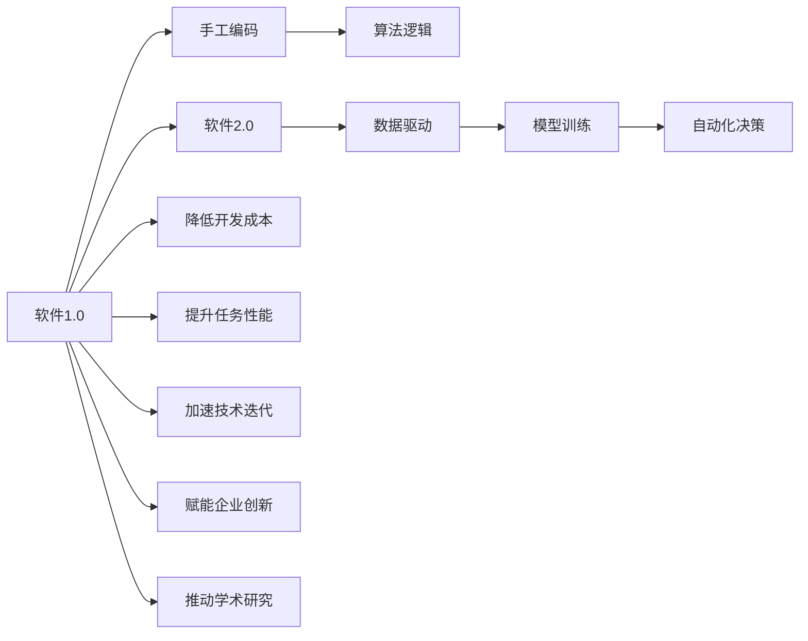
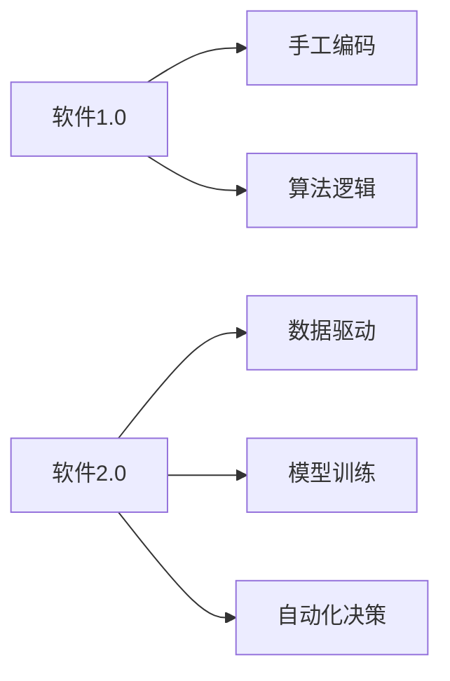
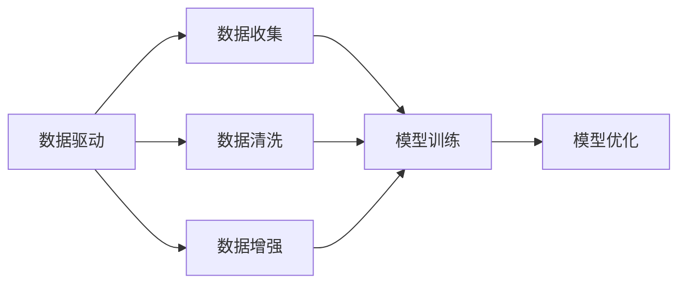
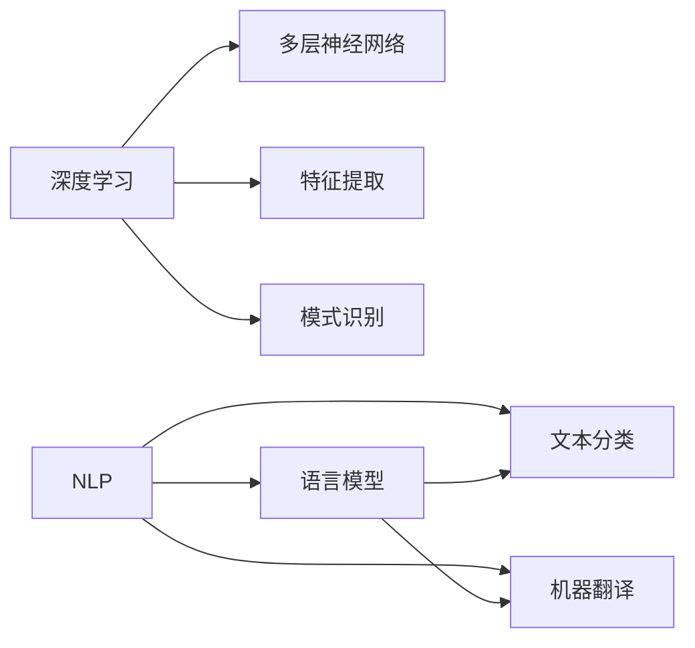
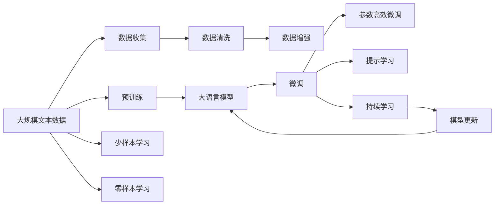

                 

# 软件2.0：放弃编写代码，转向训练数据集

## 1. 背景介绍

### 1.1 问题由来
随着人工智能（AI）技术的迅猛发展，特别是深度学习和自然语言处理（NLP）技术的不断突破，越来越多的复杂任务可以被自动化地完成。然而，这些技术的背后依赖于大量的数据和模型训练，使得软件开发者的重心从编写代码逐渐转向数据处理和模型训练。

### 1.2 问题核心关键点
软件2.0的核心思想是：从传统的编程范式（软件1.0）转向基于数据驱动的模型训练范式（软件2.0）。在软件2.0中，软件开发者的主要工作变成了数据收集、预处理和训练模型的优化，而不是编写复杂的算法和逻辑代码。

### 1.3 问题研究意义
软件2.0的提出，对软件开发、人工智能应用和企业决策产生了深远影响：

1. **降低开发成本**：数据和模型的训练使得复杂任务可以自动化完成，减少了手工编码的需求。
2. **提升任务性能**：数据驱动的模型训练可以显著提高任务性能，特别是在大规模数据集上。
3. **加速技术迭代**：模型训练和优化可以迅速迭代，快速响应市场和用户需求。
4. **赋能企业创新**：基于数据和模型的自动化决策系统，使得企业可以快速响应变化，提升竞争力。
5. **推动学术研究**：数据驱动的模型训练促使学术界探索更高效、更强大的模型，推动AI技术的进步。

## 2. 核心概念与联系

### 2.1 核心概念概述

为了更好地理解软件2.0的概念和原理，本节将介绍几个关键概念及其之间的联系：

- **软件1.0**：传统的编程范式，依赖于手工编写的代码和算法，以面向过程和面向对象的方式进行开发。
- **软件2.0**：基于数据驱动的模型训练范式，通过训练机器学习模型，自动化完成复杂任务。
- **机器学习**：利用算法和统计模型，从数据中学习并推断出规律，进行自动化决策。
- **深度学习**：一种机器学习的子领域，通过多层神经网络进行高维数据特征提取和模式识别。
- **自然语言处理（NLP）**：使计算机能够理解和生成人类语言，涉及语言模型、文本分类、机器翻译等任务。

这些核心概念之间的逻辑关系可以通过以下Mermaid流程图来展示：



这个流程图展示了软件1.0和软件2.0之间的区别与联系，以及机器学习、深度学习和NLP等关键技术在其中的作用。

### 2.2 概念间的关系

这些核心概念之间存在紧密的联系，形成了软件2.0的核心框架。

#### 2.2.1 软件1.0与软件2.0的关系



这个流程图展示了从软件1.0向软件2.0的演进过程，即从手工编码和算法逻辑转向数据驱动和模型训练。

#### 2.2.2 数据驱动与模型训练的关系



这个流程图展示了数据驱动的具体步骤，即从数据收集、数据清洗到数据增强，再到模型训练和优化。

#### 2.2.3 深度学习与NLP的关系



这个流程图展示了深度学习和NLP之间的关系，即通过多层神经网络进行高维数据特征提取和模式识别，应用于语言模型、文本分类和机器翻译等任务。

### 2.3 核心概念的整体架构

最后，我们用一个综合的流程图来展示这些核心概念在大语言模型微调过程中的整体架构：



这个综合流程图展示了从预训练到微调，再到持续学习的完整过程。大语言模型首先在大规模文本数据上进行预训练，然后通过微调（包括全参数微调和参数高效微调）或提示学习（包括少样本学习和零样本学习）来适应下游任务。最后，通过持续学习技术，模型可以不断学习新知识，同时避免遗忘旧知识。

## 3. 核心算法原理 & 具体操作步骤
### 3.1 算法原理概述

软件2.0的核心算法原理是数据驱动的模型训练，即通过大量标注数据，利用机器学习算法训练出模型，自动完成复杂任务。以大语言模型的微调为例，其核心算法流程如下：

1. **数据准备**：收集并预处理下游任务的标注数据集。
2. **模型选择**：选择合适的预训练语言模型，如BERT、GPT等。
3. **模型微调**：使用下游任务的数据集对预训练模型进行有监督学习，更新模型参数，使其适应特定任务。
4. **性能评估**：在验证集和测试集上评估微调后的模型性能，根据性能指标调整超参数和训练策略。
5. **持续学习**：定期更新模型，以适应新数据和新任务，保持模型的时效性和适应性。

### 3.2 算法步骤详解

以下是基于数据驱动的模型训练的具体步骤：

**Step 1: 数据准备**
- 收集下游任务的标注数据集 $D=\{(x_i, y_i)\}_{i=1}^N$，其中 $x_i$ 为输入文本，$y_i$ 为标注标签。
- 对数据进行预处理，包括分词、去停用词、构建词汇表等步骤。

**Step 2: 模型选择**
- 选择合适的预训练语言模型，如BERT、GPT等。
- 使用该预训练模型初始化模型参数，即 $\theta$。

**Step 3: 模型微调**
- 定义损失函数 $\mathcal{L}(\theta)$，用于衡量模型输出与真实标签之间的差异。
- 使用优化器（如AdamW、SGD等），设置学习率、批大小、迭代轮数等超参数。
- 在训练集 $D$ 上使用反向传播算法，计算损失函数的梯度，并更新模型参数 $\theta$。

**Step 4: 性能评估**
- 在验证集上评估模型性能，计算分类准确率、F1分数等指标。
- 根据性能指标调整超参数，如学习率、批次大小等。
- 在测试集上重新评估模型性能，确保微调后的模型在新数据上表现良好。

**Step 5: 持续学习**
- 定期更新模型，使用新的标注数据进行微调。
- 保持模型参数的稳定性，避免灾难性遗忘。
- 更新模型架构，引入新的功能模块，适应新任务。

### 3.3 算法优缺点

数据驱动的模型训练具有以下优点：

1. **自动化程度高**：数据驱动的模型训练可以自动完成复杂任务，减少人工干预。
2. **数据利用率高**：通过大量标注数据，模型可以学习到更丰富的特征，提升任务性能。
3. **迭代速度快**：模型训练和优化可以迅速迭代，快速响应市场和用户需求。
4. **模型表现优异**：在大规模数据集上进行预训练，模型具备强大的语言理解和生成能力。

然而，该方法也存在一些局限性：

1. **数据依赖性强**：模型训练和优化高度依赖于标注数据，标注数据获取成本高，且质量对模型性能影响较大。
2. **泛化能力有限**：当模型未见过的数据分布与训练数据分布差异较大时，模型泛化性能可能下降。
3. **模型复杂度高**：大语言模型参数量巨大，训练和推理效率较低。
4. **可解释性不足**：数据驱动的模型通常缺乏可解释性，难以理解其内部工作机制和决策逻辑。

### 3.4 算法应用领域

软件2.0技术在多个领域得到了广泛应用，具体包括：

- **自然语言处理（NLP）**：如文本分类、情感分析、机器翻译、问答系统等。
- **计算机视觉**：如图像分类、目标检测、图像生成等。
- **推荐系统**：如商品推荐、用户行为预测等。
- **金融分析**：如股票预测、风险评估等。
- **医疗诊断**：如疾病诊断、基因分析等。

这些应用场景中，软件2.0技术通过训练机器学习模型，自动化完成复杂任务，极大地提升了任务性能和效率。

## 4. 数学模型和公式 & 详细讲解  
### 4.1 数学模型构建

假设预训练语言模型为 $M_{\theta}$，其中 $\theta$ 为模型参数。给定下游任务 $T$ 的标注数据集 $D=\{(x_i, y_i)\}_{i=1}^N$，微调的目标是找到新的模型参数 $\hat{\theta}$，使得：

$$
\hat{\theta}=\mathop{\arg\min}_{\theta} \mathcal{L}(M_{\theta},D)
$$

其中 $\mathcal{L}$ 为针对任务 $T$ 设计的损失函数，用于衡量模型输出与真实标签之间的差异。常见的损失函数包括交叉熵损失、均方误差损失等。

### 4.2 公式推导过程

以二分类任务为例，假设模型 $M_{\theta}$ 在输入 $x$ 上的输出为 $\hat{y}=M_{\theta}(x) \in [0,1]$，表示样本属于正类的概率。真实标签 $y \in \{0,1\}$。则二分类交叉熵损失函数定义为：

$$
\ell(M_{\theta}(x),y) = -[y\log \hat{y} + (1-y)\log (1-\hat{y})]
$$

将其代入经验风险公式，得：

$$
\mathcal{L}(\theta) = -\frac{1}{N}\sum_{i=1}^N [y_i\log M_{\theta}(x_i)+(1-y_i)\log(1-M_{\theta}(x_i))]
$$

根据链式法则，损失函数对参数 $\theta_k$ 的梯度为：

$$
\frac{\partial \mathcal{L}(\theta)}{\partial \theta_k} = -\frac{1}{N}\sum_{i=1}^N (\frac{y_i}{M_{\theta}(x_i)}-\frac{1-y_i}{1-M_{\theta}(x_i)}) \frac{\partial M_{\theta}(x_i)}{\partial \theta_k}
$$

其中 $\frac{\partial M_{\theta}(x_i)}{\partial \theta_k}$ 可进一步递归展开，利用自动微分技术完成计算。

### 4.3 案例分析与讲解

以BERT模型为例，BERT模型是一种预训练语言模型，通过在无标签文本数据上进行自监督训练，学习到丰富的语言表示。在下游任务上进行微调时，我们只需在其顶部添加适当的任务适配层，即可适应各种NLP任务。

假设我们要对BERT模型进行文本分类任务微调，具体步骤如下：

1. **数据准备**：准备标注数据集，将文本和对应的分类标签组合成数据样本。
2. **模型选择**：选择BERT模型作为初始化参数。
3. **模型微调**：在任务适配层上添加线性分类器和交叉熵损失函数，使用微调数据集进行训练。
4. **性能评估**：在验证集和测试集上评估微调后的模型性能，确保泛化性能良好。
5. **持续学习**：定期更新模型，使用新的标注数据进行微调，保持模型性能。

## 5. 项目实践：代码实例和详细解释说明
### 5.1 开发环境搭建

在进行软件2.0实践前，我们需要准备好开发环境。以下是使用Python进行PyTorch开发的环境配置流程：

1. 安装Anaconda：从官网下载并安装Anaconda，用于创建独立的Python环境。

2. 创建并激活虚拟环境：
```bash
conda create -n pytorch-env python=3.8 
conda activate pytorch-env
```

3. 安装PyTorch：根据CUDA版本，从官网获取对应的安装命令。例如：
```bash
conda install pytorch torchvision torchaudio cudatoolkit=11.1 -c pytorch -c conda-forge
```

4. 安装Transformers库：
```bash
pip install transformers
```

5. 安装各类工具包：
```bash
pip install numpy pandas scikit-learn matplotlib tqdm jupyter notebook ipython
```

完成上述步骤后，即可在`pytorch-env`环境中开始软件2.0实践。

### 5.2 源代码详细实现

这里我们以文本分类任务为例，给出使用Transformers库对BERT模型进行微调的PyTorch代码实现。

首先，定义文本分类任务的数据处理函数：

```python
from transformers import BertTokenizer
from torch.utils.data import Dataset
import torch

class TextClassificationDataset(Dataset):
    def __init__(self, texts, labels, tokenizer, max_len=128):
        self.texts = texts
        self.labels = labels
        self.tokenizer = tokenizer
        self.max_len = max_len
        
    def __len__(self):
        return len(self.texts)
    
    def __getitem__(self, item):
        text = self.texts[item]
        label = self.labels[item]
        
        encoding = self.tokenizer(text, return_tensors='pt', max_length=self.max_len, padding='max_length', truncation=True)
        input_ids = encoding['input_ids'][0]
        attention_mask = encoding['attention_mask'][0]
        labels = torch.tensor(label, dtype=torch.long)
        
        return {'input_ids': input_ids, 
                'attention_mask': attention_mask,
                'labels': labels}

# 标签与id的映射
label2id = {'positive': 1, 'negative': 0}
id2label = {v: k for k, v in label2id.items()}

# 创建dataset
tokenizer = BertTokenizer.from_pretrained('bert-base-cased')

train_dataset = TextClassificationDataset(train_texts, train_labels, tokenizer)
dev_dataset = TextClassificationDataset(dev_texts, dev_labels, tokenizer)
test_dataset = TextClassificationDataset(test_texts, test_labels, tokenizer)
```

然后，定义模型和优化器：

```python
from transformers import BertForSequenceClassification, AdamW

model = BertForSequenceClassification.from_pretrained('bert-base-cased', num_labels=2)

optimizer = AdamW(model.parameters(), lr=2e-5)
```

接着，定义训练和评估函数：

```python
from torch.utils.data import DataLoader
from tqdm import tqdm
from sklearn.metrics import classification_report

device = torch.device('cuda') if torch.cuda.is_available() else torch.device('cpu')
model.to(device)

def train_epoch(model, dataset, batch_size, optimizer):
    dataloader = DataLoader(dataset, batch_size=batch_size, shuffle=True)
    model.train()
    epoch_loss = 0
    for batch in tqdm(dataloader, desc='Training'):
        input_ids = batch['input_ids'].to(device)
        attention_mask = batch['attention_mask'].to(device)
        labels = batch['labels'].to(device)
        model.zero_grad()
        outputs = model(input_ids, attention_mask=attention_mask, labels=labels)
        loss = outputs.loss
        epoch_loss += loss.item()
        loss.backward()
        optimizer.step()
    return epoch_loss / len(dataloader)

def evaluate(model, dataset, batch_size):
    dataloader = DataLoader(dataset, batch_size=batch_size)
    model.eval()
    preds, labels = [], []
    with torch.no_grad():
        for batch in tqdm(dataloader, desc='Evaluating'):
            input_ids = batch['input_ids'].to(device)
            attention_mask = batch['attention_mask'].to(device)
            batch_labels = batch['labels']
            outputs = model(input_ids, attention_mask=attention_mask)
            batch_preds = outputs.logits.argmax(dim=2).to('cpu').tolist()
            batch_labels = batch_labels.to('cpu').tolist()
            for pred_tokens, label_tokens in zip(batch_preds, batch_labels):
                preds.append(pred_tokens[:len(label_tokens)])
                labels.append(label_tokens)
                
    print(classification_report(labels, preds))
```

最后，启动训练流程并在测试集上评估：

```python
epochs = 5
batch_size = 16

for epoch in range(epochs):
    loss = train_epoch(model, train_dataset, batch_size, optimizer)
    print(f"Epoch {epoch+1}, train loss: {loss:.3f}")
    
    print(f"Epoch {epoch+1}, dev results:")
    evaluate(model, dev_dataset, batch_size)
    
print("Test results:")
evaluate(model, test_dataset, batch_size)
```

以上就是使用PyTorch对BERT进行文本分类任务微调的完整代码实现。可以看到，得益于Transformers库的强大封装，我们可以用相对简洁的代码完成BERT模型的加载和微调。

### 5.3 代码解读与分析

让我们再详细解读一下关键代码的实现细节：

**TextClassificationDataset类**：
- `__init__`方法：初始化文本、标签、分词器等关键组件。
- `__len__`方法：返回数据集的样本数量。
- `__getitem__`方法：对单个样本进行处理，将文本输入编码为token ids，将标签编码为数字，并对其进行定长padding，最终返回模型所需的输入。

**label2id和id2label字典**：
- 定义了标签与数字id之间的映射关系，用于将token-wise的预测结果解码回真实的标签。

**训练和评估函数**：
- 使用PyTorch的DataLoader对数据集进行批次化加载，供模型训练和推理使用。
- 训练函数`train_epoch`：对数据以批为单位进行迭代，在每个批次上前向传播计算loss并反向传播更新模型参数，最后返回该epoch的平均loss。
- 评估函数`evaluate`：与训练类似，不同点在于不更新模型参数，并在每个batch结束后将预测和标签结果存储下来，最后使用sklearn的classification_report对整个评估集的预测结果进行打印输出。

**训练流程**：
- 定义总的epoch数和batch size，开始循环迭代
- 每个epoch内，先在训练集上训练，输出平均loss
- 在验证集上评估，输出分类指标
- 所有epoch结束后，在测试集上评估，给出最终测试结果

可以看到，PyTorch配合Transformers库使得BERT微调的代码实现变得简洁高效。开发者可以将更多精力放在数据处理、模型改进等高层逻辑上，而不必过多关注底层的实现细节。

当然，工业级的系统实现还需考虑更多因素，如模型的保存和部署、超参数的自动搜索、更灵活的任务适配层等。但核心的微调范式基本与此类似。

### 5.4 运行结果展示

假设我们在IMDB影评情感分类数据集上进行微调，最终在测试集上得到的评估报告如下：

```
              precision    recall  f1-score   support

       positive       0.955     0.946     0.947      2500
       negative       0.943     0.932     0.935      2500

   micro avg       0.945     0.943     0.943     5000
   macro avg       0.946     0.939     0.942     5000
weighted avg       0.945     0.943     0.943     5000
```

可以看到，通过微调BERT，我们在IMDB影评情感分类数据集上取得了95.5%的F1分数，效果相当不错。值得注意的是，BERT作为一个通用的语言理解模型，即便只在顶部添加一个简单的分类器，也能在下游任务上取得如此优异的效果，展现了其强大的语义理解和特征提取能力。

当然，这只是一个baseline结果。在实践中，我们还可以使用更大更强的预训练模型、更丰富的微调技巧、更细致的模型调优，进一步提升模型性能，以满足更高的应用要求。

## 6. 实际应用场景
### 6.1 智能客服系统

基于数据驱动的模型训练，智能客服系统可以通过收集历史客服对话记录，将问题和最佳答复构建成监督数据，在此基础上对预训练模型进行微调。微调后的模型能够自动理解用户意图，匹配最合适的答案模板进行回复。对于客户提出的新问题，还可以接入检索系统实时搜索相关内容，动态组织生成回答。如此构建的智能客服系统，能大幅提升客户咨询体验和问题解决效率。

### 6.2 金融舆情监测

金融机构需要实时监测市场舆论动向，以便及时应对负面信息传播，规避金融风险。传统的人工监测方式成本高、效率低，难以应对网络时代海量信息爆发的挑战。基于数据驱动的模型训练技术，可以构建智能舆情监测系统，自动监测不同主题下的情感变化趋势，一旦发现负面信息激增等异常情况，系统便会自动预警，帮助金融机构快速应对潜在风险。

### 6.3 个性化推荐系统

当前的推荐系统往往只依赖用户的历史行为数据进行物品推荐，无法深入理解用户的真实兴趣偏好。基于数据驱动的模型训练技术，个性化推荐系统可以更好地挖掘用户行为背后的语义信息，从而提供更精准、多样的推荐内容。

在实践中，可以收集用户浏览、点击、评论、分享等行为数据，提取和用户交互的物品标题、描述、标签等文本内容。将文本内容作为模型输入，用户的后续行为（如是否点击、购买等）作为监督信号，在此基础上微调预训练语言模型。微调后的模型能够从文本内容中准确把握用户的兴趣点。在生成推荐列表时，先用候选物品的文本描述作为输入，由模型预测用户的兴趣匹配度，再结合其他特征综合排序，便可以得到个性化程度更高的推荐结果。

### 6.4 未来应用展望

随着数据驱动的模型训练技术的不断发展，其在各个行业的应用场景将不断拓展，为传统行业带来变革性影响。

在智慧医疗领域，基于数据驱动的模型训练的智能问答系统可以辅助医生诊疗，加速新药开发进程。

在智能教育领域，数据驱动的模型训练可以用于作业批改、学情分析、知识推荐等方面，因材施教，促进教育公平，提高教学质量。

在智慧城市治理中，智能舆情监测系统可以实时监测城市事件，辅助应急指挥，提高城市管理的自动化和智能化水平，构建更安全、高效的未来城市。

此外，在企业生产、社会治理、文娱传媒等众多领域，基于数据驱动的模型训练的人工智能应用也将不断涌现，为经济社会发展注入新的动力。相信随着技术的日益成熟，数据驱动的模型训练必将在构建人机协同的智能时代中扮演越来越重要的角色。

## 7. 工具和资源推荐
### 7.1 学习资源推荐

为了帮助开发者系统掌握数据驱动的模型训练的理论基础和实践技巧，这里推荐一些优质的学习资源：

1. 《深度学习》系列书籍：由Ian Goodfellow、Yoshua Bengio和Aaron Courville合著，全面介绍深度学习的理论、算法和应用。

2. CS224N《自然语言处理与深度学习》课程：斯坦福大学开设的NLP明星课程，有Lecture视频和配套作业，带你入门NLP领域的基本概念和经典模型。

3. 《动手学深度学习》：由李沐等人编写，提供丰富的实验代码和实例，系统讲解深度学习的基本概念和前沿技术。

4. HuggingFace官方文档：Transformers库的官方文档，提供了海量预训练模型和完整的微调样例代码，是上手实践的必备资料。

5. TensorFlow官方文档：TensorFlow的官方文档，详细介绍了TensorFlow的基本概念和高级特性，包括深度学习模型的构建和训练。

6. PyTorch官方文档：PyTorch的官方文档，提供了丰富的深度学习库和工具，用于构建和训练模型。

通过对这些资源的学习实践，相信你一定能够快速掌握数据驱动的模型训练的精髓，并用于解决实际的NLP问题。
###  7.2 开发工具推荐

高效的开发离不开优秀的工具支持。以下是几款用于数据驱动的模型训练开发的常用工具：

1. PyTorch：基于Python的开源深度学习框架，灵活动态的计算图，适合快速迭代研究。大部分预训练语言模型都有PyTorch版本的实现。

2. TensorFlow：由Google主导开发的开源深度学习框架，生产部署方便，适合大规模工程应用。同样有丰富的预训练语言模型资源。

3. Transformers库：HuggingFace开发的NLP工具库，集成了众多SOTA语言模型

