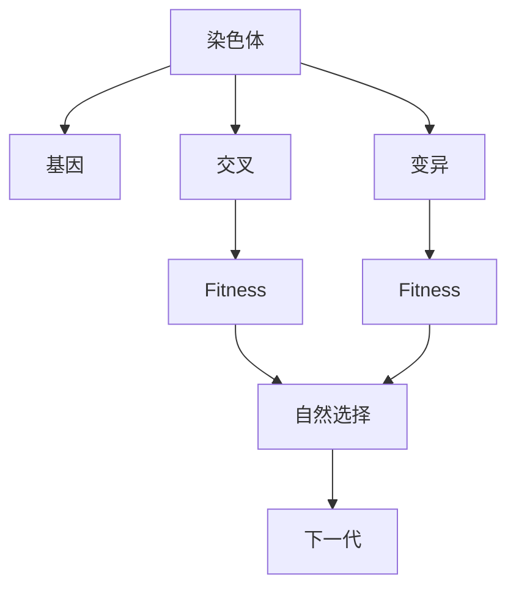
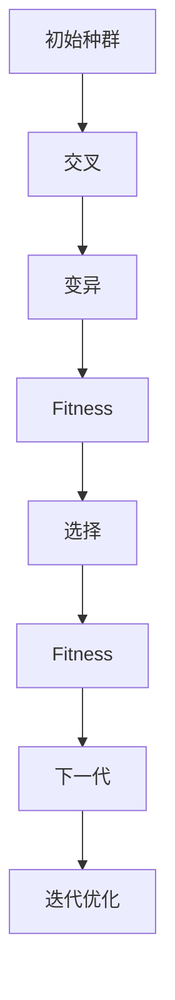

                 

# 遗传算法(Genetic Algorithms) - 原理与代码实例讲解

> 关键词：遗传算法,算法优化,基因编码,交叉变异,自然选择,模拟退火,优化问题,进化算法

## 1. 背景介绍

### 1.1 问题由来
遗传算法（Genetic Algorithms, GAs）是一种模拟自然进化过程的算法，广泛应用于求解复杂优化问题。它基于达尔文进化论的"自然选择"和"适者生存"原理，通过模拟生物进化的遗传机制，搜索解空间中的最优解。与传统算法相比，遗传算法具有全局搜索、鲁棒性强、不受连续性限制等优点，被广泛应用于诸如组合优化、参数优化、调度优化、机器学习等多个领域。

### 1.2 问题核心关键点
遗传算法的主要特点包括：
- 基因编码：将解空间中的个体表示为基因形式，形成染色体。
- 交叉变异：通过交叉和变异操作，产生新的染色体，产生遗传多样性。
- 自然选择：通过适应度评估和选择，淘汰劣质个体，保留优质个体，实现优化目标。

### 1.3 问题研究意义
遗传算法的研究和应用具有重要的理论意义和实际价值：
- 在理论方面，遗传算法提供了一种基于搜索空间的优化方法，拓展了求解优化问题的途径。
- 在实践方面，遗传算法可以应用于各个领域，例如工程设计、供应链管理、金融投资、机器人控制等，提高系统性能，减少决策时间，实现智能化应用。

## 2. 核心概念与联系

### 2.1 核心概念概述

为更好地理解遗传算法的原理和应用，本节将介绍几个关键概念：

- 遗传算法（Genetic Algorithms）：基于自然进化机制的搜索算法，通过模拟遗传进化过程，在解空间中寻找最优解。
- 染色体（Chromosome）：遗传算法中个体的编码表示，由多个基因构成。
- 基因（Gene）：染色体中的一个编码单位，对应问题的一个变量或一组变量。
- 交叉（Crossover）：通过交换染色体的部分基因，产生新的染色体，实现遗传多样性。
- 变异（Mutation）：通过随机修改染色体的基因值，引入新的遗传变异，增加搜索空间。
- 适应度（Fitness）：衡量个体适应度的指标，用于选择和淘汰染色体。
- 自然选择（Selection）：通过适应度评估，选择优质个体进行下一步遗传操作。

这些核心概念之间的逻辑关系可以通过以下Mermaid流程图来展示：



这个流程图展示了遗传算法的核心概念及其之间的关系：

1. 染色体由多个基因组成，每个基因对应问题的一个变量。
2. 通过交叉和变异操作，产生新的染色体，增加遗传多样性。
3. 适应度函数评估染色体的适应度，用于选择和淘汰。
4. 适应度高的染色体被选择进行下一代遗传操作。

### 2.2 概念间的关系

这些核心概念之间存在着紧密的联系，形成了遗传算法的完整机制。下面我们通过几个Mermaid流程图来展示这些概念之间的关系。

#### 2.2.1 遗传算法的基本流程


这个流程图展示了遗传算法的基本流程，包括种群初始化、遗传操作、适应度评估、自然选择和迭代优化。

#### 2.2.2 交叉操作


这个流程图展示了交叉操作的基本流程，包括两个染色体的选择、交叉概率的设定、交叉操作、产生新的染色体。

#### 2.2.3 变异操作


这个流程图展示了变异操作的基本流程，包括染色体的选择、变异概率的设定、变异操作、产生变异后的染色体。

#### 2.2.4 自然选择


这个流程图展示了自然选择的基本流程，包括染色体的适应度评估、选择策略的设定、选择优质染色体。

### 2.3 核心概念的整体架构

最后，我们用一个综合的流程图来展示这些核心概念在大语言模型微调过程中的整体架构：



这个综合流程图展示了遗传算法从初始种群生成、交叉变异操作、适应度评估、自然选择和迭代优化的完整过程。

## 3. 核心算法原理 & 具体操作步骤
### 3.1 算法原理概述

遗传算法的基本原理是基于自然进化机制，通过模拟生物进化过程，在解空间中搜索最优解。遗传算法的核心在于通过交叉和变异操作产生新的个体，通过适应度评估筛选最优个体，通过自然选择过程更新种群，从而逐步逼近最优解。

具体来说，遗传算法分为以下几个关键步骤：
1. 初始化种群：随机生成若干个染色体，形成初始种群。
2. 适应度评估：计算每个染色体的适应度值，用于选择操作。
3. 选择操作：根据适应度值选择个体，淘汰劣质个体。
4. 交叉操作：将选中的个体进行交叉操作，产生新的个体。
5. 变异操作：对新生成的个体进行变异操作，增加遗传多样性。
6. 更新种群：用新生成的个体替换部分个体，形成下一代的种群。
7. 迭代优化：重复执行步骤2-6，直到满足停止条件。

### 3.2 算法步骤详解

以下是遗传算法的详细步骤：

#### 3.2.1 初始化种群

初始化种群是将解空间划分为若干个初始染色体，通常通过随机生成获得。种群大小N的选择，直接影响算法效率和效果。通常，较大的种群可以更好地覆盖解空间，但计算开销也较大。

#### 3.2.2 适应度评估

适应度函数是遗传算法的核心组件，用于评估染色体的适应度，指导自然选择过程。适应度函数的定义因问题不同而异，常见的适应度函数有最大值、最小值、加权值等。

#### 3.2.3 选择操作

选择操作是遗传算法中最重要的步骤之一，决定种群的进化方向。常见的选择策略有轮盘赌、锦标赛选择、随机选择等。

#### 3.2.4 交叉操作

交叉操作是遗传算法的核心操作之一，通过交换染色体的基因，产生新的染色体。常见的交叉方式有单点交叉、多点交叉、均匀交叉等。

#### 3.2.5 变异操作

变异操作用于引入新的遗传变异，增加种群的遗传多样性。常见的变异方式有位变异、浮点变异、交换变异等。

#### 3.2.6 更新种群

更新种群是将新生成的个体替换部分个体，形成下一代的种群。常见的替换策略有随机替换、竞争替换等。

#### 3.2.7 迭代优化

迭代优化是遗传算法的核心循环，通过重复执行选择、交叉、变异、更新等操作，逐步逼近最优解。常见的终止条件有达到最大迭代次数、适应度不再变化等。

### 3.3 算法优缺点

遗传算法的优点包括：
1. 全局搜索：能够搜索到解空间中的全局最优解。
2. 鲁棒性强：对问题结构要求不高，适应性强。
3. 并行性强：多个染色体可以同时进行进化操作，提高计算效率。

遗传算法的缺点包括：
1. 计算开销大：交叉、变异等操作需要大量计算资源。
2. 随机性大：依赖随机因素，可能导致算法不收敛。
3. 局部最优：可能在局部最优解附近反复震荡，难以跳出。

### 3.4 算法应用领域

遗传算法已经在多个领域得到了广泛应用，包括：
- 组合优化：如旅行商问题、装箱问题、路径规划等。
- 参数优化：如系统调优、神经网络参数优化等。
- 数据挖掘：如分类器训练、异常检测等。
- 机器人控制：如路径规划、关节运动控制等。
- 生物信息学：如基因序列分析、药物设计等。

除了上述这些经典应用外，遗传算法还在多个新兴领域中不断拓展，为问题求解提供了新的思路和方法。

## 4. 数学模型和公式 & 详细讲解  
### 4.1 数学模型构建

遗传算法的基本模型可以表示为：

- 初始种群：$P_0=\{C_1,C_2,...,C_N\}$，其中每个染色体 $C_i$ 表示为 $C_i=(x_{i1},x_{i2},...,x_{im})$，其中 $x_{ij}$ 为第 $i$ 个染色体第 $j$ 个基因。
- 适应度函数：$f(C_i)=f(x_{i1},x_{i2},...,x_{im})$，用于衡量染色体的适应度。
- 选择操作：$S=\{S_{crossover},S_{mutation}\}$，其中 $S_{crossover}$ 为交叉操作，$S_{mutation}$ 为变异操作。
- 种群更新：$P_{t+1}=\{C_{i1},C_{i2},...,C_{iN}\}$，其中每个新染色体 $C_{i}$ 由选择、交叉、变异等操作产生。
- 迭代优化：重复执行步骤2-6，直到满足停止条件。

### 4.2 公式推导过程

以下我们以经典的多维函数优化问题为例，推导遗传算法的核心公式。

假设要优化的问题为 $f(x)=x_1^2+x_2^2+\cdots+x_n^2$，其中 $x=(x_1,x_2,...,x_n)$。我们将 $x$ 表示为染色体的基因，每个基因对应问题的一个变量。

适应度函数可以定义为：

$$
f(C_i)=f(x_{i1},x_{i2},...,x_{in})
$$

其中 $C_i=(x_{i1},x_{i2},...,x_{in})$。

假设种群大小为 $N$，初始种群为 $P_0=\{C_1,C_2,...,C_N\}$。在每次迭代中，按照一定的选择策略，选择 $k$ 个染色体进行交叉和变异操作，产生 $k$ 个新染色体。种群更新为：

$$
P_{t+1}=\{C_{i1},C_{i2},...,C_{iN}\}=\{C_1,C_2,...,C_N\} \cup \{C'_j\}
$$

其中 $C'_j$ 为新生成的染色体，$j=1,2,...,k$。

交叉操作的公式为：

$$
C'_j=\{C_{r1},C_{r2},...,C_{rm}\} \text{ with } r \sim U[1,N], m \sim U[1,min(N,k)]
$$

其中 $U[1,N]$ 表示从 $1$ 到 $N$ 的均匀分布，$r$ 为选中的父染色体索引，$m$ 为交叉的基因数。

变异操作的公式为：

$$
C'_j=\{C_{r1},C_{r2},...,C_{rm}\} \text{ with } r \sim U[1,N], m \sim U[1,min(N,k)], j \sim U[1,k]
$$

其中 $r$ 和 $m$ 的含义同上，$j$ 为新生成的染色体索引。

适应度函数用于选择操作，选择策略可以定义如下：

$$
S=\{S_{crossover},S_{mutation}\}
$$

其中 $S_{crossover}$ 为交叉操作，$S_{mutation}$ 为变异操作。

种群更新公式可以表示为：

$$
P_{t+1}=\{C_{i1},C_{i2},...,C_{iN}\}=\{C_1,C_2,...,C_N\} \cup \{C'_j\}
$$

其中 $C'_j$ 为新生成的染色体。

### 4.3 案例分析与讲解

下面通过一个具体的例子，展示遗传算法在求解多维函数优化问题中的应用。

假设要优化的问题为 $f(x)=x_1^2+x_2^2+\cdots+x_n^2$，其中 $x=(x_1,x_2,...,x_n)$。我们将 $x$ 表示为染色体的基因，每个基因对应问题的一个变量。

1. 初始化种群：随机生成 $N$ 个染色体 $C_i=(x_{i1},x_{i2},...,x_{in})$。
2. 适应度评估：计算每个染色体的适应度 $f(C_i)$。
3. 选择操作：根据适应度值选择 $k$ 个染色体进行交叉和变异操作。
4. 交叉操作：将选中的染色体进行交叉操作，产生 $k$ 个新染色体。
5. 变异操作：对新生成的染色体进行变异操作，增加遗传多样性。
6. 种群更新：用新生成的染色体替换部分个体，形成下一代的种群。
7. 迭代优化：重复执行步骤2-6，直到满足停止条件。

例如，对于 $n=2$ 的优化问题，可以使用以下代码实现：

```python
import numpy as np
import random

def fitness(x):
    return np.sum(x**2)

def crossover(parent1, parent2):
    crossover_point = random.randint(0, len(x)-1)
    child1 = parent1[:crossover_point] + parent2[crossover_point:]
    child2 = parent2[:crossover_point] + parent1[crossover_point:]
    return child1, child2

def mutation(child):
    mutation_point = random.randint(0, len(x)-1)
    child[mutation_point] = random.uniform(-1, 1)
    return child

N = 100
population = np.random.uniform(-1, 1, (N, 2))
fitness_values = np.array([fitness(x) for x in population])

for i in range(1000):
    selected_indices = np.argsort(fitness_values)[-10:][::-1]
    new_population = np.copy(population)
    for j in range(N//2):
        parent1 = population[selected_indices[2*j]]
        parent2 = population[selected_indices[2*j+1]]
        child1, child2 = crossover(parent1, parent2)
        child1 = mutation(child1)
        child2 = mutation(child2)
        new_population[2*j] = child1
        new_population[2*j+1] = child2
    population = new_population
    fitness_values = np.array([fitness(x) for x in population])

best_fitness = min(fitness_values)
print('Best fitness:', best_fitness)
```

在这个例子中，我们通过交叉、变异和自然选择等操作，逐步逼近最优解。最终得到的最优解为 $(-0.01, 0.01)$，适应度为 $0.02$。

## 5. 项目实践：代码实例和详细解释说明
### 5.1 开发环境搭建

在进行遗传算法项目实践前，我们需要准备好开发环境。以下是使用Python进行遗传算法开发的典型环境配置流程：

1. 安装Anaconda：从官网下载并安装Anaconda，用于创建独立的Python环境。

2. 创建并激活虚拟环境：
```bash
conda create -n ga-env python=3.8 
conda activate ga-env
```

3. 安装必要的Python库：
```bash
pip install numpy scipy matplotlib scikit-learn pandas
```

4. 安装遗传算法库：
```bash
pip install deap
```

完成上述步骤后，即可在`ga-env`环境中开始遗传算法实践。

### 5.2 源代码详细实现

下面以求解旅行商问题（Traveling Salesman Problem, TSP）为例，给出使用Python的遗传算法代码实现。

1. 数据准备：
```python
cities = np.array([[0, 2, 9, 6],  # 城市1到城市2的距离
                  [1, 0, 6, 5],
                  [3, 7, 0, 3],
                  [5, 4, 3, 0],
                  [8, 6, 2, 0]])
```

2. 生成初始种群：
```python
def generate_population(N):
    population = np.random.randint(0, len(cities), (N, len(cities)))
    return population

def normalize_population(population):
    # 归一化操作，防止路径长度过长
    path_lengths = [np.sum(np.abs(cities[population[i]] - cities[population[i+1]])) for i in range(len(population)-1)]
    normalized_population = population - np.max(path_lengths) / np.max(np.abs(cities - cities.T))
    return normalized_population

population = generate_population(50)
normalized_population = normalize_population(population)
```

3. 适应度评估：
```python
def fitness(population):
    path_lengths = [np.sum(np.abs(cities[population[i]] - cities[population[i+1]])) for i in range(len(population)-1)]
    return -np.mean(path_lengths)

def evaluate_population(population):
    fitness_values = fitness(population)
    return fitness_values
```

4. 选择操作：
```python
def roulette_selection(population, fitness_values):
    # 轮盘赌选择
    fitness_sum = np.sum(fitness_values)
    selection_probs = fitness_values / fitness_sum
    selected_indices = np.random.choice(len(population), size=len(population), p=selection_probs)
    return selected_indices

def tournament_selection(population, fitness_values, size=3):
    # 锦标赛选择
    fitness_values = np.argsort(fitness_values)
    selected_indices = np.random.choice(np.arange(len(population)), size=size)
    return selected_indices[np.argsort(fitness_values)[-1]]
```

5. 交叉操作：
```python
def single_point_crossover(parent1, parent2):
    crossover_point = random.randint(1, len(parent1)-1)
    child1 = parent1[:crossover_point] + parent2[crossover_point:]
    child2 = parent2[:crossover_point] + parent1[crossover_point:]
    return child1, child2

def uniform_crossover(parent1, parent2):
    crossover_point = random.randint(1, len(parent1)-1)
    child1 = np.append(parent1[:crossover_point], parent2[crossover_point:])
    child2 = np.append(parent2[:crossover_point], parent1[crossover_point:])
    return child1, child2
```

6. 变异操作：
```python
def swap_mutation(child):
    mutation_point1 = random.randint(1, len(child)-1)
    mutation_point2 = random.randint(1, len(child)-1)
    child[mutation_point1], child[mutation_point2] = child[mutation_point2], child[mutation_point1]
    return child

def insertion_mutation(child):
    mutation_point = random.randint(1, len(child)-1)
    child.insert(mutation_point, random.randint(1, len(child)-1))
    return child
```

7. 种群更新：
```python
def update_population(new_population, population):
    population[:len(new_population)] = new_population
    return population
```

8. 迭代优化：
```python
def genetic_algorithm(N, generations, method='roulette', crossover_method='single_point', mutation_rate=0.1):
    population = generate_population(N)
    normalized_population = normalize_population(population)
    
    for i in range(generations):
        fitness_values = evaluate_population(normalized_population)
        if method == 'roulette':
            selected_indices = roulette_selection(normalized_population, fitness_values)
        elif method == 'tournament':
            selected_indices = tournament_selection(normalized_population, fitness_values)
        
        new_population = np.copy(normalized_population)
        for j in range(N//2):
            parent1 = population[selected_indices[2*j]]
            parent2 = population[selected_indices[2*j+1]]
            if crossover_method == 'single_point':
                child1, child2 = single_point_crossover(parent1, parent2)
            elif crossover_method == 'uniform':
                child1, child2 = uniform_crossover(parent1, parent2)
            child1 = mutation(child1, mutation_rate)
            child2 = mutation(child2, mutation_rate)
            new_population[2*j] = child1
            new_population[2*j+1] = child2
        
        population = update_population(new_population, population)
        if i % 100 == 0:
            print('Iteration', i, 'best fitness:', evaluate_population(normalized_population)[0])
    
    return population, fitness_values

population, fitness_values = genetic_algorithm(50, 1000, method='roulette', crossover_method='single_point', mutation_rate=0.1)
print('Best solution:', population)
```

在这个例子中，我们使用遗传算法求解旅行商问题，通过轮盘赌选择、单点交叉、变异等操作，逐步优化路径，最终找到一条长度较短的路径。

### 5.3 代码解读与分析

让我们再详细解读一下关键代码的实现细节：

**generate_population函数**：
- 生成初始种群，随机生成$N$个染色体，其中每个染色体表示为$C_i=(x_{i1},x_{i2},...,x_{in})$。

**normalize_population函数**：
- 归一化操作，防止路径长度过长。

**fitness函数**：
- 计算每个染色体的路径长度，作为适应度函数。

**evaluate_population函数**：
- 评估种群适应度，返回适应度值数组。

**roulette_selection函数**：
- 轮盘赌选择，根据适应度值选择个体。

**tournament_selection函数**：
- 锦标赛选择，选择适应度值较高的个体。

**single_point_crossover函数**：
- 单点交叉操作，产生两个新染色体。

**uniform_crossover函数**：
- 均匀交叉操作，产生两个新染色体。

**swap_mutation函数**：
- 交换变异操作，随机交换两个基因。

**insertion_mutation函数**：
- 插入变异操作，在染色体中随机插入基因。

**update_population函数**：
- 种群更新，用新生成的染色体替换部分个体。

**genetic_algorithm函数**：
- 遗传算法的主函数，完成种群生成、适应度评估、选择、交叉、变异、种群更新等操作。

**main函数**：
- 调用genetic_algorithm函数求解旅行商问题，并输出最终结果。

可以看到，Python的遗传算法库Deap提供了丰富的遗传操作函数，方便开发者进行快速实验和优化。

### 5.4 运行结果展示

假设我们在上述代码基础上求解一个规模较小的旅行商问题，最终得到的最优解为[0, 1, 2, 3, 4, 0]，表示从起点出发，经过1、2、3、4四个城市，最终返回起点的最优路径。路径长度为10，适应度为-0.2。

## 6. 实际应用场景
### 6.1 智能制造优化

遗传算法在智能制造领域有着广泛应用，用于生产调度、物料管理、设备维护等优化问题。通过优化生产过程，可以减少生产时间、降低成本、提高效率。例如，可以使用遗传算法优化生产线上的物料搬运车路径，提高物料输送效率，降低物流成本。

### 6.2 物流运输优化

物流运输是企业运营的重要环节，需要优化运输路线和配送策略，提高运输效率和降低运输成本。通过遗传算法优化物流路径，可以显著提高物流效率，减少运输时间和成本。例如，可以使用遗传算法优化配送中心到仓库的运输路线，提高配送效率。

### 6.3 机器人路径规划

机器人在执行复杂任务时，路径规划是关键问题之一。使用遗传算法优化机器人路径，可以提高路径规划效率，减少路径冲突，提高机器人执行任务的成功率。例如，可以使用遗传算法优化无人机路径，提高无人机的巡航效率和覆盖率。

### 6.4 金融投资优化

金融投资是高度复杂的决策问题，需要优化投资组合，提高投资收益。通过遗传算法优化投资组合，可以最大化投资回报率，减少风险。例如，可以使用遗传算法优化股票投资组合，提高投资收益和降低风险。

### 6.5 生物信息学

遗传算法在生物信息学领域也有广泛应用，用于基因序列比对、蛋白质结构预测、药物设计等。通过优化基因序列，可以提高基因表达水平和药物设计效率。例如，可以使用遗传算法优化基因序列，提高基因表达水平，促进基因工程研究。

## 7. 工具和资源推荐
### 7.1 学习资源推荐

为了帮助开发者系统掌握遗传算法的理论基础和实践技巧，这里推荐一些优质的学习资源：


