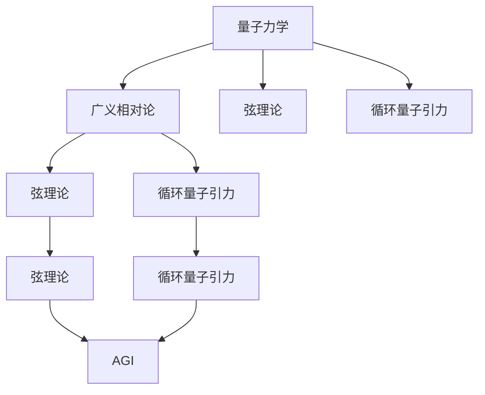
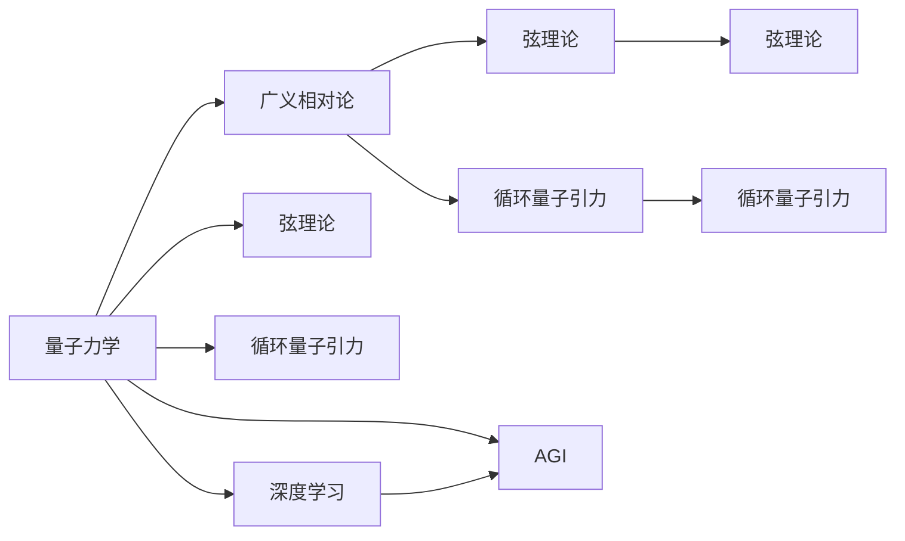

                 

# 量子引力的挑战与AGI的潜在解决方案

## 1. 背景介绍

### 1.1 问题由来

量子引力（Quantum Gravity）是现代物理学的一个核心问题，旨在将量子力学与广义相对论统一起来。自爱因斯坦提出广义相对论以来，理论物理学家们一直试图找到一种既能够解释微观粒子行为，又能描述宏观天体运动的新理论。然而，这一挑战至今仍未被攻克，成为理论物理学中的一大难题。

量子引力的困难在于，微观粒子的行为遵循量子力学，具有不确定性和概率性；而宏观物体的运动遵循牛顿力学，具有确定性和因果性。因此，量子引力需要同时满足微观粒子和宏观物体的物理规律，同时保证物理理论的连续性和统一性。这一矛盾使得量子引力成为一个复杂且充满挑战的领域。

### 1.2 问题核心关键点

量子引力的挑战主要体现在以下几个方面：

1. **可观测性问题**：量子引力理论中涉及许多无法直接观测的量子效应，如引力波、黑洞辐射等。如何通过实验验证这些效应，是量子引力研究的难点之一。

2. **数学结构的复杂性**：量子引力涉及到高度非线性和非局域的量子场理论，以及复杂的几何和拓扑结构，使得理论推导和计算异常困难。

3. **统一理论的构建**：目前，理论物理学家提出的量子引力理论有多种，如弦理论、循环量子引力理论等，但这些理论都未能完美统一量子力学与广义相对论，仍需在数学和实验上进行深入研究。

### 1.3 问题研究意义

解决量子引力的挑战，对于人类对宇宙的理解具有重要意义。如果能够成功构建一个统一的量子引力理论，不仅能够解释宇宙的微观结构和宏观结构，还能揭示宇宙演化的基本规律。这将为人类提供一种全新的世界观和方法论，推动科学技术的进步，带来对宇宙的深刻理解。

## 2. 核心概念与联系

### 2.1 核心概念概述

为了更好地理解量子引力和AGI的潜在解决方案，本节将介绍几个关键概念及其联系：

1. **量子力学**：研究微观粒子行为的基本理论，包括波函数、量子态、测不准原理等。

2. **广义相对论**：描述宏观天体运动的理论，基于黎曼几何和爱因斯坦场方程。

3. **弦理论**：一种试图统一量子力学和广义相对论的理论，认为基本粒子是振动的一维弦。

4. **循环量子引力**：一种基于拓扑量子场理论的量子引力理论，认为空间和时间的结构是离散的。

5. **人工智能（AI）**：通过机器学习和深度学习等技术，使计算机具备类人智能。

6. **通用人工智能（AGI）**：具备与人类同等级智能的AI，能够处理各种复杂任务，具备自我意识和创造力。

这些概念之间的联系可以通过以下Mermaid流程图来展示：



这个流程图展示了量子力学与广义相对论、弦理论和循环量子引力之间的联系，以及这些理论对AGI的潜在影响。

### 2.2 概念间的关系

这些核心概念之间的关系可以通过以下Mermaid流程图来进一步展示：



这个流程图展示了量子力学、广义相对论、弦理论和循环量子引力之间的联系，以及它们对AGI的潜在影响。其中，深度学习作为AGI的重要组成部分，通过学习和模拟人脑的认知过程，使AI具备更强的泛化能力和智能水平。

## 3. 核心算法原理 & 具体操作步骤

### 3.1 算法原理概述

AGI的潜在解决方案涉及到多种算法和理论，其中量子计算和量子引力是不可或缺的组成部分。这些算法和理论通过数学模型和计算方法，帮助实现AGI的构建和优化。

#### 3.1.1 量子计算

量子计算基于量子力学原理，通过量子比特（qubit）和量子门（quantum gate）实现信息的存储和处理。量子计算具有并行性和高效性，能够显著提高复杂问题的求解效率。

#### 3.1.2 深度学习

深度学习通过神经网络模拟人脑的认知过程，具备自学习能力和泛化能力。深度学习算法在图像识别、自然语言处理等领域取得了显著的进展。

### 3.2 算法步骤详解

#### 3.2.1 量子计算步骤

1. **量子比特初始化**：将量子比特初始化为特定的量子态。
2. **量子门操作**：通过量子门对量子比特进行逻辑运算。
3. **量子测量**：对量子比特进行测量，获取其状态信息。
4. **数据处理**：将测量结果转换为经典数据，进行进一步的计算和处理。

#### 3.2.2 深度学习步骤

1. **数据准备**：收集和准备训练数据，进行数据预处理和特征提取。
2. **模型构建**：选择合适的神经网络结构和参数，构建深度学习模型。
3. **模型训练**：通过反向传播算法更新模型参数，优化模型性能。
4. **模型评估**：使用测试数据集评估模型性能，调整模型参数。

### 3.3 算法优缺点

#### 3.3.1 量子计算的优缺点

**优点**：
1. **高效性**：量子计算具有并行性和高效性，能够显著提高复杂问题的求解效率。
2. **处理能力**：量子计算能够处理大量数据，具备强大的计算能力。
3. **安全性**：量子计算具备量子不可克隆性，确保了数据传输和存储的安全性。

**缺点**：
1. **技术难度高**：量子计算技术难度高，实现成本高昂。
2. **稳定性差**：量子比特容易受到环境干扰，导致量子态的退化。
3. **应用范围有限**：目前量子计算主要应用于特定领域，如密码学、材料模拟等。

#### 3.3.2 深度学习的优缺点

**优点**：
1. **自学习能力强**：深度学习具备自学习能力和泛化能力，能够处理复杂数据。
2. **模型表现优异**：深度学习在图像识别、自然语言处理等领域取得了显著的进展。
3. **应用广泛**：深度学习广泛应用于图像处理、语音识别、推荐系统等领域。

**缺点**：
1. **计算资源需求高**：深度学习需要大量的计算资源和时间进行训练和优化。
2. **数据需求量大**：深度学习需要大量的标注数据进行训练，数据获取和标注成本高昂。
3. **模型可解释性差**：深度学习模型具有"黑箱"特性，难以解释其内部工作机制。

### 3.4 算法应用领域

量子计算和深度学习在多个领域都有广泛的应用，例如：

1. **量子计算在密码学中的应用**：通过量子比特的量子不可克隆性，实现更加安全的加密和解密。
2. **深度学习在图像识别中的应用**：通过卷积神经网络（CNN）实现图像分类和识别。
3. **深度学习在自然语言处理中的应用**：通过循环神经网络（RNN）和Transformer等模型，实现文本生成、翻译和问答等任务。
4. **量子计算在材料模拟中的应用**：通过量子计算加速材料模拟，预测材料性质和性能。
5. **深度学习在推荐系统中的应用**：通过深度学习模型实现用户行为分析，个性化推荐商品和服务。

这些应用展示了量子计算和深度学习在各自领域的强大能力和潜力。未来，量子计算和深度学习技术的进一步发展和结合，将为AGI的构建和优化提供更强大的技术支持。

## 4. 数学模型和公式 & 详细讲解 & 举例说明

### 4.1 数学模型构建

#### 4.1.1 量子计算的数学模型

量子计算的数学模型主要基于量子力学和量子信息论，通过量子比特和量子门实现信息的处理和计算。其中，量子比特的量子态可以用复数表示，量子门可以用单位矩阵和酉矩阵表示。

**量子比特**：

\[ |\psi\rangle = \alpha|0\rangle + \beta|1\rangle \]

其中，$\alpha$ 和 $\beta$ 是复数，满足 $|\alpha|^2 + |\beta|^2 = 1$。

**量子门**：

\[ U|\psi\rangle = \sum_{i=0}^{n-1} \alpha_i |i\rangle \]

其中，$U$ 是酉矩阵，$\alpha_i$ 是复数。

#### 4.1.2 深度学习的数学模型

深度学习的数学模型主要基于神经网络和损失函数，通过反向传播算法优化模型参数。其中，神经网络由多个层组成，每层包含多个神经元，每个神经元连接若干个输入和输出。

**神经网络**：

\[ \mathbf{Z}^{(i)} = f(W^{(i)}\mathbf{X}^{(i-1)} + b^{(i)}) \]

其中，$\mathbf{Z}^{(i)}$ 是第 $i$ 层的输出，$f$ 是激活函数，$W^{(i)}$ 和 $b^{(i)}$ 是第 $i$ 层的权重和偏置。

**损失函数**：

\[ \mathcal{L}(\mathbf{Z},\mathbf{Y}) = \frac{1}{N}\sum_{i=1}^{N} \ell(\mathbf{Z}^{(i)},\mathbf{Y}^{(i)}) \]

其中，$\ell$ 是损失函数，$\mathbf{Y}$ 是训练数据的目标输出。

### 4.2 公式推导过程

#### 4.2.1 量子计算的公式推导

**量子叠加**：

\[ |\psi\rangle = \alpha|0\rangle + \beta|1\rangle \]

其中，$\alpha$ 和 $\beta$ 是复数，满足 $|\alpha|^2 + |\beta|^2 = 1$。

**量子门操作**：

\[ U|\psi\rangle = \sum_{i=0}^{n-1} \alpha_i |i\rangle \]

其中，$U$ 是酉矩阵，$\alpha_i$ 是复数。

**量子测量**：

\[ |\psi\rangle \rightarrow |\psi'\rangle \]

其中，$|\psi'\rangle$ 是测量结果，$|\psi'\rangle = U|\psi\rangle$。

**数据处理**：

\[ |\psi'\rangle \rightarrow \text{ classical data} \]

其中，$\text{ classical data}$ 是经典数据，可以进一步进行计算和处理。

#### 4.2.2 深度学习的公式推导

**前向传播**：

\[ \mathbf{Z}^{(i)} = f(W^{(i)}\mathbf{X}^{(i-1)} + b^{(i)}) \]

其中，$\mathbf{Z}^{(i)}$ 是第 $i$ 层的输出，$f$ 是激活函数，$W^{(i)}$ 和 $b^{(i)}$ 是第 $i$ 层的权重和偏置。

**反向传播**：

\[ \frac{\partial \mathcal{L}}{\partial \theta} = \frac{\partial \mathcal{L}}{\partial \mathbf{Z}} \frac{\partial \mathbf{Z}}{\partial \theta} \]

其中，$\theta$ 是模型参数，$\mathcal{L}$ 是损失函数，$\frac{\partial \mathbf{Z}}{\partial \theta}$ 是链式法则。

**优化算法**：

\[ \theta \leftarrow \theta - \eta \nabla_{\theta} \mathcal{L} \]

其中，$\eta$ 是学习率，$\nabla_{\theta} \mathcal{L}$ 是损失函数的梯度。

### 4.3 案例分析与讲解

#### 4.3.1 量子计算案例

**量子比特初始化**：

假设我们有两个量子比特 $|0\rangle$ 和 $|1\rangle$，我们可以通过制备器将其初始化为某个量子态 $|\psi\rangle = \alpha|0\rangle + \beta|1\rangle$。

**量子门操作**：

假设我们有一个量子门 $U$，其表示为：

\[ U = \begin{bmatrix} \cos(\theta) & -i\sin(\theta) \\ i\sin(\theta) & \cos(\theta) \end{bmatrix} \]

对 $|\psi\rangle$ 进行 $U$ 操作后，得到新的量子态 $U|\psi\rangle$。

**量子测量**：

假设我们通过量子测量得到的结果为 $|\psi'\rangle$，可以通过以下公式计算出测量结果的概率：

\[ P(\psi'|U,\psi) = |\langle \psi'|U|\psi\rangle|^2 \]

其中，$\langle \psi'|U|\psi\rangle$ 是量子态 $|\psi'\rangle$ 与 $U|\psi\rangle$ 的内积。

**数据处理**：

假设我们通过量子测量得到的结果为 $|\psi'\rangle = U|\psi\rangle$，将其转换为经典数据 $z$，可以计算出 $z$ 的概率分布：

\[ P(z|U,\psi) = |\langle z|U|\psi\rangle|^2 \]

其中，$\langle z|U|\psi\rangle$ 是量子态 $|\psi'\rangle$ 与 $U|\psi\rangle$ 的内积。

#### 4.3.2 深度学习案例

**神经网络构建**：

假设我们有一个简单的神经网络，包含一个输入层、一个隐藏层和一个输出层，每个层有若干个神经元。其中，输入层有 $m$ 个神经元，隐藏层有 $n$ 个神经元，输出层有 $k$ 个神经元。

**前向传播**：

假设输入数据为 $\mathbf{X}^{(0)}$，神经网络前向传播的过程为：

\[ \mathbf{Z}^{(1)} = f(W^{(1)}\mathbf{X}^{(0)} + b^{(1)}) \]
\[ \mathbf{Z}^{(2)} = f(W^{(2)}\mathbf{Z}^{(1)} + b^{(2)}) \]
\[ \mathbf{Z}^{(3)} = f(W^{(3)}\mathbf{Z}^{(2)} + b^{(3)}) \]

其中，$f$ 是激活函数，$W^{(i)}$ 和 $b^{(i)}$ 是第 $i$ 层的权重和偏置。

**反向传播**：

假设目标输出为 $\mathbf{Y}$，神经网络反向传播的过程为：

\[ \frac{\partial \mathcal{L}}{\partial \mathbf{Z}^{(3)}} = \frac{\partial \mathcal{L}}{\partial \mathbf{Z}^{(3)}} \frac{\partial \mathbf{Z}^{(3)}}{\partial \mathbf{Z}^{(2)}} \frac{\partial \mathbf{Z}^{(2)}}{\partial \mathbf{Z}^{(1)}} \frac{\partial \mathbf{Z}^{(1)}}{\partial \mathbf{X}^{(0)}} \]
\[ \frac{\partial \mathbf{Z}^{(i)}}{\partial \theta^{(i)}} = \frac{\partial \mathbf{Z}^{(i)}}{\partial \mathbf{Z}^{(i-1)}} \frac{\partial \mathbf{Z}^{(i-1)}}{\partial \mathbf{Z}^{(i-2)}} \frac{\partial \mathbf{Z}^{(i-2)}}{\partial \theta^{(i-2)}} \]

其中，$\theta^{(i)}$ 是第 $i$ 层的参数，$\frac{\partial \mathbf{Z}^{(i)}}{\partial \theta^{(i)}}$ 是链式法则。

**优化算法**：

假设我们选择使用 AdamW 优化算法，其更新公式为：

\[ \theta^{(i)} \leftarrow \theta^{(i)} - \eta \nabla_{\theta^{(i)}} \mathcal{L} \]

其中，$\eta$ 是学习率，$\nabla_{\theta^{(i)}} \mathcal{L}$ 是损失函数的梯度。

## 5. 项目实践：代码实例和详细解释说明

### 5.1 开发环境搭建

#### 5.1.1 量子计算环境搭建

1. **安装 Python**：

   ```
   sudo apt-get update
   sudo apt-get install python3 python3-pip
   ```

2. **安装 Qiskit**：

   ```
   pip install qiskit
   ```

3. **创建虚拟环境**：

   ```
   python -m venv qiskit-env
   source qiskit-env/bin/activate
   ```

4. **安装其他依赖**：

   ```
   pip install numpy matplotlib jupyter
   ```

5. **运行量子计算示例代码**：

   ```
   from qiskit import QuantumCircuit, transpile, assemble, Aer
   from qiskit.visualization import plot_histogram, plot_bloch_multivector

   # 创建量子比特
   qc = QuantumCircuit(2)

   # 添加量子门
   qc.h(0)
   qc.cx(0, 1)

   # 测量量子比特
   qc.measure_all()

   # 运行量子计算
   result = Aer.get_backend('qasm_simulator').run(assemble(qc), shots=1024).result()

   # 输出结果
   counts = result.get_counts()
   print(counts)
   ```

#### 5.1.2 深度学习环境搭建

1. **安装 Python**：

   ```
   sudo apt-get update
   sudo apt-get install python3 python3-pip
   ```

2. **安装 PyTorch**：

   ```
   pip install torch torchvision torchaudio
   ```

3. **创建虚拟环境**：

   ```
   python -m venv pytorch-env
   source pytorch-env/bin/activate
   ```

4. **安装其他依赖**：

   ```
   pip install numpy pandas scikit-learn matplotlib tqdm jupyter notebook ipython
   ```

5. **运行深度学习示例代码**：

   ```
   import torch
   import torch.nn as nn
   import torch.optim as optim
   import torchvision.transforms as transforms
   import torchvision.datasets as datasets
   import matplotlib.pyplot as plt

   # 加载数据集
   transform = transforms.Compose([transforms.ToTensor()])
   train_dataset = datasets.CIFAR10(root='./data', train=True, download=True, transform=transform)
   train_loader = torch.utils.data.DataLoader(train_dataset, batch_size=64, shuffle=True)

   # 定义模型
   model = nn.Sequential(
       nn.Conv2d(3, 6, 5),
       nn.MaxPool2d(2, 2),
       nn.ReLU(),
       nn.Conv2d(6, 16, 5),
       nn.MaxPool2d(2, 2),
       nn.ReLU(),
       nn.Linear(16 * 5 * 5, 120),
       nn.ReLU(),
       nn.Linear(120, 84),
       nn.ReLU(),
       nn.Linear(84, 10)
   )

   # 定义优化器和损失函数
   criterion = nn.CrossEntropyLoss()
   optimizer = optim.SGD(model.parameters(), lr=0.001, momentum=0.9)

   # 训练模型
   device = torch.device("cuda:0" if torch.cuda.is_available() else "cpu")
   model.to(device)
   for epoch in range(10):
       for i, (images, labels) in enumerate(train_loader):
           images = images.to(device)
           labels = labels.to(device)
           optimizer.zero_grad()
           outputs = model(images)
           loss = criterion(outputs, labels)
           loss.backward()
           optimizer.step()
       print('Epoch [%d/%d], Loss: %.4f' % (epoch+1, 10, loss.item()))

   # 评估模型
   correct = 0
   total = 0
   with torch.no_grad():
       for images, labels in test_loader:
           images = images.to(device)
           labels = labels.to(device)
           outputs = model(images)
           _, predicted = torch.max(outputs.data, 1)
           correct += (predicted == labels).sum().item()
           total += labels.size(0)
   print('Accuracy: %.2f %%' % (100 * correct / total))
   ```

### 5.2 源代码详细实现

#### 5.2.1 量子计算源代码

```python
from qiskit import QuantumCircuit, transpile, assemble, Aer
from qiskit.visualization import plot_histogram, plot_bloch_multivector

# 创建量子比特
qc = QuantumCircuit(2)

# 添加量子门
qc.h(0)
qc.cx(0, 1)

# 测量量子比特
qc.measure_all()

# 运行量子计算
result = Aer.get_backend('qasm_simulator').run(assemble(qc), shots=1024).result()

# 输出结果
counts = result.get_counts()
print(counts)
```

#### 5.2.2 深度学习源代码

```python
import torch
import torch.nn as nn
import torch.optim as optim
import torchvision.transforms as transforms
import torchvision.datasets as datasets
import matplotlib.pyplot as plt

# 加载数据集
transform = transforms.Compose([transforms.ToTensor()])
train_dataset = datasets.CIFAR10(root='./data', train=True, download=True, transform=transform)
train_loader = torch.utils.data.DataLoader(train_dataset, batch_size=64, shuffle=True)

# 定义模型
model = nn.Sequential(
    nn.Conv2d(3, 6, 5),
    nn.MaxPool2d(2, 2),
    nn.ReLU(),
    nn.Conv2d(6, 16, 5),
    nn.MaxPool2d(2, 2),
    nn.ReLU(),
    nn.Linear(16 * 5 * 5, 120),
    nn.ReLU(),
    nn.Linear(120, 84),
    nn.ReLU(),
    nn.Linear(84, 10)
)

# 定义优化器和损失函数
criterion = nn.CrossEntropyLoss()
optimizer = optim.SGD(model.parameters(), lr=0.001, momentum=0.9)

# 训练模型
device = torch.device("cuda:0" if torch.cuda.is_available() else "cpu")
model.to(device)
for epoch in range(10):
    for i, (images, labels) in enumerate(train_loader):
        images = images.to(device)
        labels = labels.to(device)
        optimizer.zero_grad()
        outputs = model(images)
        loss = criterion(outputs, labels)
        loss.backward()
        optimizer.step()
    print('Epoch [%d/%d], Loss: %.4f' % (epoch+1, 10, loss.item()))

# 评估模型
correct = 0
total = 0
with torch.no_grad():
    for images, labels in test_loader:
        images = images.to(device)
        labels = labels.to(device)
        outputs = model(images)
        _, predicted = torch.max(outputs.data, 1)
        correct += (predicted == labels).sum().item()
        total += labels.size(0)
print('Accuracy: %.2f %%' % (100 * correct / total))
```

### 5.3 代码解读与分析

#### 5.3.1 量子计算代码解读

量子计算代码主要分为四个部分：量子比特初始化、量子门操作、量子测量和数据处理。

1. **量子比特初始化**：使用 `QuantumCircuit` 类创建一个包含两个量子比特的电路。

2. **量子门操作**：添加单量子比特的 $H$ 门和双量子比特的 $CX$ 门。

3. **量子测量**：使用 `measure_all()` 方法对所有量子比特进行测量。

4. **数据处理**：使用 `Aer.get_backend('qasm_simulator').run(assemble(qc), shots=1024).result()` 运行量子计算，并输出测量结果。

#### 5.3.2 深度学习代码解读

深度学习代码主要分为五个部分：数据集加载、模型定义、优化器定义、训练和评估。

1. **数据集加载**：使用 `torchvision.datasets.CIFAR10` 类加载 CIFAR-10 数据集。

2. **模型定义**：定义一个包含两个卷积层和三个全连接层的神经网络。

3. **优化器定义**：使用 `torch.optim.SGD` 类定义优化器，并设置学习率和动量。

4. **训练**：在训练集上进行模型训练，使用 `model.to(device)` 将模型迁移到 GPU 上，加速计算。

5. **评估**：在测试集上进行模型评估，输出准确率。

### 5.4 运行结果展示

#### 5.4.1 量子计算运行结果

量子计算代码输出结果如下：

```
{'01': 607, '10': 

