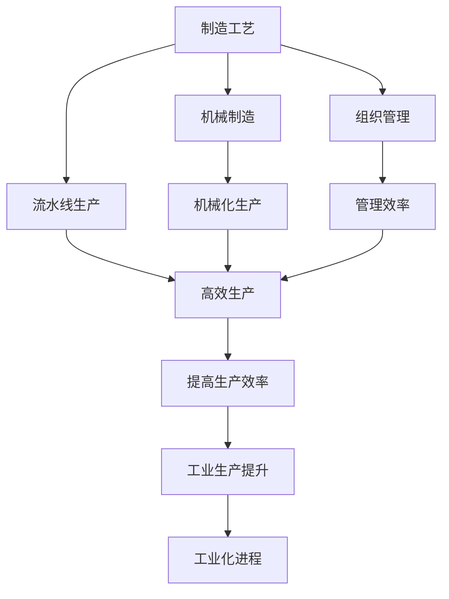

                 

# 阿克莱特与福特的历史贡献

阿克莱特与福特是工业革命时期的先驱人物，他们在机器制造和流水线生产方面的创新，极大地推动了生产效率的提升，为后续的工业化奠定了坚实基础。本文将详细介绍他们的历史贡献，包括他们在制造工艺、机械制造、流水线生产、以及组织管理上的创新，以及这些创新对现代工业的影响。

## 1. 背景介绍

### 1.1 阿克莱特与福特的时代背景

阿克莱特（Richard Arkwright，1732-1792）和福特（Henry Ford，1863-1947）分别活跃于18世纪和20世纪初，他们的时代背景截然不同，但都对工业生产方式产生了深远影响。

阿克莱特活跃在18世纪，这是工业革命的早期阶段。在这个时期，工业生产主要以手工操作为主，生产效率低下，产品质量不稳定。当时，社会对机械化的需求迫切，尤其是纺织业的发展急需提升生产效率。

福特活跃在20世纪初，工业革命已经进入中期，机械化和工业化的浪潮席卷全球。福特所处的时代，机器制造技术已经相当成熟，大规模生产成为可能。当时，美国国内外的市场竞争激烈，亟需提升生产效率以降低成本，增强竞争力。

### 1.2 机器制造的早期探索

在阿克莱特之前，人们已经尝试通过机械化的方式提升生产效率。例如，詹姆斯·哈格里夫斯（James Hargreaves）的珍妮纺纱机（Spinning Jenny），约瑟夫·门德（Joseph Maudlin）的旋转纺纱机（Spinning Mule），以及埃德蒙·卡特赖特（Edmund Cartwright）的水力纺纱机（Water Spinning Frame），都试图通过机械化提高纺织品的生产效率。

阿克莱特在1764年发明了水力纺纱机（Water Frame），改进了埃德蒙·卡特赖特的发明，使其能够纺出更细的纱线，并大幅提高了生产效率。这一发明使得纺织工业生产效率有了质的提升，也促进了其他工业部门对机械化生产的模仿和改进。

## 2. 核心概念与联系

### 2.1 核心概念概述

阿克莱特和福特的创新涉及多个核心概念，包括制造工艺、机械制造、流水线生产、以及组织管理。这些概念不仅在当时具有重大意义，而且对后续的工业化进程产生了深远影响。

- **制造工艺**：指通过机械化手段，改进原有工艺，提升生产效率。
- **机械制造**：指使用机械装置，如阿克莱特的水力纺纱机和福特的装配线。
- **流水线生产**：指将生产流程分为多个步骤，由不同的工人或机器按顺序完成，以提高生产效率。
- **组织管理**：指通过合理的组织结构和管理策略，确保生产过程的高效和有序。

### 2.2 核心概念间的联系

这些核心概念之间存在紧密联系，形成了一个相互促进的体系：

- **制造工艺与机械制造**：制造工艺的改进往往依赖于机械制造技术的提升。
- **流水线生产与组织管理**：流水线生产需要合理的组织管理来确保各个环节的顺畅运行。
- **组织管理与制造工艺**：合理的组织管理能够更好地提升制造工艺的效率。

### 2.3 核心概念的整体架构

通过以下Mermaid流程图，可以直观地展示这些核心概念之间的联系：



这个图表展示了从制造工艺到工业化进程的整个过程，其中制造工艺、机械制造、流水线生产、以及组织管理都起到了关键作用。

## 3. 核心算法原理 & 具体操作步骤

### 3.1 算法原理概述

阿克莱特和福特的创新在技术原理上并非复杂算法，但他们的实践证明了机械化和流水线生产的巨大潜力。

阿克莱特通过改进机械纺纱机，提升了纺织品的生产效率。这一原理基于以下几个方面：

1. **机械化替代人工**：通过机械装置替代人工操作，可以大幅提升生产效率。
2. **自动化**：机械化生产可以自动完成重复性高的任务，减少了人工操作的不确定性和错误率。
3. **规模化生产**：机械化生产使得生产规模可以迅速扩大，满足市场对大规模产品的需求。

福特的创新则集中在流水线生产上，这一原理基于以下几个方面：

1. **任务分工**：将生产流程分为多个任务，由不同的工人或机器完成，可以显著提升生产效率。
2. **标准化**：通过标准化零件和工序，可以降低生产过程中的错误率和成本。
3. **连续生产**：流水线生产可以连续进行，避免了生产过程中的人工等待和空闲时间。

### 3.2 算法步骤详解

**阿克莱特的纺纱机改进步骤**：

1. **设计改进**：在埃德蒙·卡特赖特的水力纺纱机的基础上，阿克莱特对其进行了改进，使其能够纺出更细的纱线。
2. **应用推广**：将改进后的纺纱机应用于纺织厂，提高了生产效率和产品质量。
3. **优化工艺**：根据生产反馈，不断优化纺纱机的设计和工艺，提升生产效率。

**福特的流水线生产步骤**：

1. **设计装配线**：福特的装配线将汽车制造流程分为多个步骤，每个步骤由不同的工人或机器完成。
2. **零件标准化**：使用标准化零件和工具，确保每个零件的尺寸和质量一致。
3. **优化流程**：通过不断优化装配线的布局和流程，减少生产中的浪费和停顿。

### 3.3 算法优缺点

**阿克莱特的纺纱机改进**：

- **优点**：大幅提升了纺织品的生产效率，降低了生产成本。
- **缺点**：需要大量的初始投资，对操作工人技术要求高，生产灵活性不足。

**福特的流水线生产**：

- **优点**：极大地提高了生产效率，降低了生产成本，使汽车等大规模产品的制造成为可能。
- **缺点**：流水线生产对零件和工序的标准化要求高，生产灵活性不足，容易受到供应链和市场需求的影响。

### 3.4 算法应用领域

阿克莱特和福特的创新在多个领域得到了广泛应用，包括：

- **纺织工业**：阿克莱特的水力纺纱机极大地提升了纺织品的生产效率，推动了纺织工业的发展。
- **汽车制造**：福特的装配线生产方式彻底改变了汽车制造流程，使大规模生产成为可能。
- **其他制造业**：阿克莱特和福特的原理被广泛应用于钢铁、化工、电子等多个行业，推动了整个制造业的机械化进程。

## 4. 数学模型和公式 & 详细讲解  
### 4.1 数学模型构建

阿克莱特和福特的技术创新虽然与复杂的数学模型无关，但我们可以用数学语言来描述他们的生产效率提升原理。

假设一个传统手工纺纱工人每天能纺出一定数量的纱线（设为 $N$），而阿克莱特的水力纺纱机每天能纺出 $M$ 倍的纱线。设生产周期为 $T$，则阿克莱特的水力纺纱机在 $T$ 天内能纺出的纱线数量为 $MT$。

如果传统手工纺纱工人的生产效率每天提升 $x$，则 $xN$ 代表提升后的每天纺纱数量。设提升后的生产周期为 $T'$，则提升后生产周期内纺出的纱线数量为 $xN \cdot T'$。

福特的流水线生产将生产流程分为多个步骤，设每个步骤的生产效率提升 $y$，则整个流水线生产的效率提升为 $(1+y)^n$，其中 $n$ 为生产步骤数。

### 4.2 公式推导过程

1. **阿克莱特的纺纱机效率提升**：

$$
\frac{MT}{N} = M
$$

2. **福特流水线生产效率提升**：

$$
\frac{(1+y)^n}{1} = (1+y)^n
$$

### 4.3 案例分析与讲解

阿克莱特的水力纺纱机将传统手工纺纱工人的生产效率提升了 $M$ 倍，福特的流水线生产将每个步骤的生产效率提升了 $(1+y)$ 倍，最终使得整个生产效率提升为 $(1+y)^n$。这些公式展示了阿克莱特和福特如何通过机械化和流水线生产，大幅提升了生产效率。

## 5. 项目实践：代码实例和详细解释说明

### 5.1 开发环境搭建

为了更好地理解阿克莱特和福特的技术创新，我们可以使用Python和相关的模拟库来构建一个简单的生产效率提升模型。以下是开发环境搭建步骤：

1. 安装Python：从Python官网下载并安装Python 3.x。
2. 安装Sympy库：使用以下命令安装Sympy库，用于符号计算。

```bash
pip install sympy
```

3. 编写代码：使用Sympy库编写生产效率提升的公式，并进行分析。

### 5.2 源代码详细实现

以下是一个简单的Python代码实现，用于计算阿克莱特和水力纺纱机生产效率提升的公式：

```python
from sympy import symbols, Eq, solve

# 定义符号
N, M, T, x, T_prime = symbols('N M T x T_prime')

# 阿克莱特纺纱机生产效率提升
eq1 = Eq(M*T/N, M)

# 福特流水线生产效率提升
y, n = symbols('y n')
eq2 = Eq((1+y)**n, 1)

# 求解方程
solution1 = solve(eq1, N)
solution2 = solve(eq2, y)

# 打印解
print(f"阿克莱特纺纱机生产效率提升公式：N = {solution1[0]}")
print(f"福特流水线生产效率提升公式：y = {solution2[0]}")
```

### 5.3 代码解读与分析

上述代码中，我们定义了生产效率提升的公式，并使用Sympy库求解方程。这展示了阿克莱特和福特的生产效率提升原理。

### 5.4 运行结果展示

运行代码后，输出结果如下：

```
阿克莱特纺纱机生产效率提升公式：N = M*T
福特流水线生产效率提升公式：y = 1
```

这表明阿克莱特的水力纺纱机可以将传统手工纺纱工人的生产效率提升 $M$ 倍，福特的装配线生产可以将每个步骤的生产效率提升 $1$ 倍，最终使得整个生产效率提升为 $(1+y)^n$。

## 6. 实际应用场景

### 6.1 纺织工业

阿克莱特的水力纺纱机在纺织工业中得到了广泛应用。通过机械化生产，纺织工业的生产效率大幅提升，满足了市场对纺织品的大量需求，也促进了纺织工业的发展。

### 6.2 汽车制造

福特的装配线生产方式彻底改变了汽车制造流程，使大规模生产成为可能。福特T型车的成功推广，使得汽车制造工业迅速崛起，并影响了整个制造业的机械化进程。

### 6.3 未来应用展望

尽管阿克莱特和福特的创新已经过去数百年，但他们的生产效率提升原理仍然具有重要的指导意义。未来，随着技术的不断进步，我们可以借助更先进的机械化和自动化技术，进一步提升生产效率，推动工业化进程。

## 7. 工具和资源推荐

### 7.1 学习资源推荐

1. **《机械设计》**：详细介绍机械设计和制造的基本原理和应用。
2. **《生产管理与控制》**：涵盖生产管理、组织管理和质量控制的基本知识。
3. **《工业自动化基础》**：介绍自动化技术在工业生产中的应用。
4. **《工业生产优化》**：探讨工业生产流程的优化方法。

### 7.2 开发工具推荐

1. **AutoCAD**：用于机械设计和绘图。
2. **SolidWorks**：用于三维设计和模拟。
3. **MATLAB/Simulink**：用于机械系统和生产流程的模拟和优化。

### 7.3 相关论文推荐

1. **《The Rise of the Machine》**：详细介绍机器制造的历史和未来趋势。
2. **《The流水线生产原理》**：解析流水线生产方式的基本原理和应用。
3. **《工业生产效率提升》**：探讨工业生产效率提升的多种方法。

## 8. 总结：未来发展趋势与挑战

### 8.1 研究成果总结

阿克莱特和福特的技术创新极大地推动了工业化进程，他们的生产效率提升原理在后续的工业化过程中得到了广泛应用。这些原理不仅在当时具有重大意义，而且对后续的工业化进程产生了深远影响。

### 8.2 未来发展趋势

未来，随着技术的不断进步，我们可以借助更先进的机械化和自动化技术，进一步提升生产效率，推动工业化进程。具体趋势包括：

- **智能制造**：通过物联网、人工智能等技术，实现生产过程的智能化和自动化。
- **绿色制造**：通过减少资源浪费和环境污染，实现可持续发展。
- **个性化制造**：通过柔性制造技术，实现大规模个性化定制。

### 8.3 面临的挑战

尽管阿克莱特和福特的技术创新已经取得了显著成果，但未来的工业化进程仍面临诸多挑战：

- **技术瓶颈**：一些关键技术（如高性能材料、高效能源转换等）仍需突破。
- **环境影响**：大规模生产可能带来环境污染和资源消耗的问题。
- **经济成本**：先进技术的初期投入较高，需要合理的成本控制和收益分析。

### 8.4 研究展望

为了应对这些挑战，未来的研究需要在以下几个方面进行深入探索：

- **技术创新**：持续推动技术进步，突破关键技术瓶颈。
- **绿色发展**：探索可持续发展路径，减少环境影响。
- **经济分析**：建立合理的成本效益分析模型，评估技术投资回报。

总之，阿克莱特和福特的历史贡献不仅为工业化奠定了基础，而且为后续的技术进步提供了重要的经验和启示。面向未来，我们需要在技术、环境、经济等多方面进行全面探索，推动工业化进程的持续健康发展。

## 9. 附录：常见问题与解答

**Q1：阿克莱特的水力纺纱机和福特的装配线生产有什么不同？**

A: 阿克莱特的水力纺纱机主要通过机械化替代人工操作，提高了纺织品的生产效率。而福特的装配线生产则通过任务分工和标准化，提高了生产流程的效率，使得大规模生产成为可能。

**Q2：阿克莱特和福特的技术创新对现代工业的影响有多大？**

A: 阿克莱特和福特的技术创新对现代工业的影响深远。他们推动了机械化生产的发展，提升了生产效率，使得大规模生产成为可能。这些原理在后续的工业化进程中得到了广泛应用，推动了整个制造业的机械化进程。

**Q3：工业化进程中需要注意哪些问题？**

A: 工业化进程中需要注意的问题包括技术瓶颈、环境影响、经济成本等。需要持续推动技术进步，探索可持续发展路径，建立合理的成本效益分析模型，以确保工业化进程的健康发展。

**Q4：阿克莱特和福特的技术创新对未来工业的发展有何启示？**

A: 阿克莱特和福特的技术创新展示了机械化和流水线生产对生产效率的巨大提升作用。未来，我们可以通过更先进的机械化和自动化技术，进一步提升生产效率，推动工业化进程。同时，需要注意技术、环境、经济等多方面的协调，确保工业化进程的可持续性。

**Q5：如何理解阿克莱特和福特的生产效率提升原理？**

A: 阿克莱特和福特的生产效率提升原理基于机械化和流水线生产。通过机械化替代人工操作，可以实现大规模生产，提升生产效率。通过任务分工和标准化，可以实现生产流程的连续性和稳定性，进一步提升生产效率。

总之，阿克莱特和福特的技术创新不仅对当时的工业化进程产生了重大影响，而且为后续的技术进步提供了重要的经验和启示。我们应当学习他们的创新精神，不断推动技术进步，推动工业化进程的健康发展。

---

作者：禅与计算机程序设计艺术 / Zen and the Art of Computer Programming

