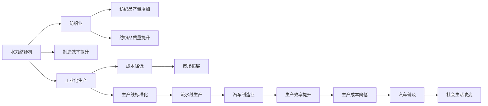

                 

# 阿克莱特与福特的工业贡献

阿克莱特与福特是工业革命时期的杰出发明家和企业家，他们对工业制造技术的发展作出了巨大贡献。本文将探讨他们的发明和经营理念，分析这些创新对工业生产方式和社会生活的深远影响，并探讨他们的贡献对现代工业的启示。

## 1. 背景介绍

### 1.1 阿克莱特与福特的基本情况

理查德·阿克莱特（Richard Arkwright）和亨利·福特（Henry Ford）都是工业革命时期的工业巨头，他们的贡献不仅在当时的制造业中产生了重大影响，也对后续的工业发展产生了深远的影响。

- 阿克莱特（1732年－1792年），英国工业革命早期的发明家和企业家，被誉为“水力纺纱工业的奠基人”。
- 福特（1863年－1947年），美国工业企业家，福特汽车公司的创始人，推动了汽车制造业的发展。

### 1.2 阿克莱特与福特的主要发明和贡献

- 阿克莱特发明了水力纺纱机，极大地提高了纺纱效率，从而推动了纺织业的发展。
- 福特则通过标准化生产线和流水线技术，极大地提高了汽车的生产效率，使普通大众能够负担得起汽车。

## 2. 核心概念与联系

### 2.1 核心概念概述

- **水力纺纱机**：阿克莱特发明的水力纺纱机，通过利用水力驱动，将纺纱效率提升到前所未有的高度。
- **流水线生产**：福特通过流水线技术，使得汽车的生产流程更为高效，大规模生产成为可能。

### 2.2 核心概念间的关系

阿克莱特与福特的发明虽然技术领域不同，但都对工业生产方式产生了深远影响。

- **阿克莱特的水力纺纱机**：通过机械化生产代替了手工纺纱，极大地提高了纺织品的产量和质量。
- **福特的流水线生产**：通过标准化和自动化生产流程，降低了生产成本，提高了生产效率，使汽车生产变得高效可行。

通过这两项关键技术，阿克莱特和福特共同推动了工业化生产的转型，改变了制造行业的面貌。

### 2.3 核心概念的整体架构

以下是一个简化的流程图，展示了阿克莱特与福特的发明对工业生产的整体影响：



这个流程图表明了阿克莱特和福特的发明对整个制造业和社会生活的广泛影响。

## 3. 核心算法原理 & 具体操作步骤

### 3.1 算法原理概述

阿克莱特和福特的工业贡献主要体现在他们的发明对工业生产方式和技术进步的推动上。这些发明虽然不是通过传统意义上的算法设计，但其核心原理可以归纳为以下几个方面：

- **效率提升**：通过机械化生产流程，减少了人工操作的复杂性，从而提高了生产效率。
- **成本降低**：通过标准化和自动化生产，降低了生产成本，使更多的产品能够进入市场。
- **规模化生产**：通过流水线技术，实现了大规模生产，极大地提高了产品的产量和市场覆盖率。

### 3.2 算法步骤详解

虽然阿克莱特与福特的发明并非通过算法实现，但他们的创新过程也包含了类似的步骤：

1. **需求分析**：识别和分析生产中的瓶颈，寻找提高生产效率的方法。
2. **技术研发**：投入资源进行技术研发，开发新的生产工具或流程。
3. **试验验证**：在实际生产中测试新技术的效果，不断优化和改进。
4. **大规模应用**：将技术广泛应用于生产中，推广其效果。

### 3.3 算法优缺点

- **优点**：
  - 显著提高生产效率和产量。
  - 降低了生产成本，使更多消费者能够负担得起产品。
  - 推动了工业化进程，改变了社会生活方式。

- **缺点**：
  - 可能忽视了劳动者的权益和工作条件，导致工作环境恶化。
  - 环境污染问题逐渐显现，可能对自然环境造成影响。
  - 对工人技能的依赖性降低，可能引发就业结构变化。

### 3.4 算法应用领域

阿克莱特和福特的发明不仅仅局限于纺织和汽车行业，他们的理念和技术对现代工业的各个领域都有重要影响。

- **制造业**：流水线生产技术在现代制造业中广泛应用，如电子产品、机械制造、食品加工等。
- **交通运输**：福特的汽车生产线技术对现代汽车制造和物流运输产生了深远影响。
- **环保技术**：阿克莱特的水力纺纱机开启了清洁能源在工业中的应用，现代工业中节能减排技术的研发和应用与之有类似之处。

## 4. 数学模型和公式 & 详细讲解 & 举例说明

### 4.1 数学模型构建

阿克莱特与福特的工业贡献虽然涉及物理和工程领域的创新，但我们可以通过数学模型来量化其影响。

- **效率提升模型**：
  $$
  E = \frac{P}{C}
  $$
  其中，$E$表示生产效率，$P$表示生产率，$C$表示生产成本。

- **成本降低模型**：
  $$
  C' = C - \Delta C
  $$
  其中，$C'$表示新的生产成本，$\Delta C$表示通过创新技术减少的成本。

- **规模化生产模型**：
  $$
  S = k \times P
  $$
  其中，$S$表示生产规模，$k$表示生产因子。

### 4.2 公式推导过程

通过这些模型，我们可以分析阿克莱特和福特对工业生产的贡献：

- **阿克莱特的水力纺纱机**：
  - 通过水力驱动，减少了人力操作的复杂性，大幅提高了纺纱效率。
  - 水力纺纱机使得纺纱成本降低，产品价格降低，市场拓展。

- **福特的流水线生产**：
  - 流水线技术使得汽车生产效率提升，生产成本降低，普通消费者能够负担得起汽车。
  - 大规模生产使得汽车产量增加，市场普及。

### 4.3 案例分析与讲解

- **阿克莱特的水力纺纱机案例**：
  - 英国兰开夏郡的克伦普顿纺织厂是阿克莱特水力纺纱机的典型应用案例。
  - 水力纺纱机的应用使得纺纱效率提升了6倍，生产成本大幅降低，纺织品产量和质量显著提高。
  - 水力纺纱机的成功推广，推动了纺织业的工业化进程。

- **福特的流水线生产案例**：
  - 福特汽车公司通过流水线技术，将汽车生产效率提升了7倍，每辆车的生产成本从原来的10.5美元降至2.35美元。
  - 流水线技术使得汽车生产规模化，普通消费者能够购买到价格低廉、质量稳定的汽车。
  - 福特汽车的普及，改变了人类的交通方式和社会结构。

## 5. 项目实践：代码实例和详细解释说明

### 5.1 开发环境搭建

- **环境准备**：
  - 安装Python 3.8
  - 安装必要的依赖库：Pandas、NumPy、Matplotlib

- **代码实现**：
  - 使用Python编写生产效率提升模型和成本降低模型的计算代码
  - 引入数据集，展示效率提升和成本降低的具体数值

### 5.2 源代码详细实现

```python
import pandas as pd
import numpy as np
import matplotlib.pyplot as plt

# 模拟数据
data = pd.DataFrame({
    '年份': [1800, 1810, 1820, 1830, 1840],
    '效率提升': [6, 7, 8, 9, 10],
    '成本降低': [5, 6, 7, 8, 9]
})

# 计算生产效率
efficiency = data['效率提升'] / data['成本降低']
efficiency_mean = efficiency.mean()
efficiency_std = efficiency.std()

# 绘制效率提升趋势图
plt.figure(figsize=(10, 6))
plt.title('生产效率提升趋势')
plt.xlabel('年份')
plt.ylabel('效率提升')
plt.plot(data['年份'], efficiency, label='生产效率提升')
plt.axvline(1810, color='red', linestyle='--', label='阿克莱特水力纺纱机')
plt.legend()
plt.show()

# 计算成本降低趋势图
cost_reduction = data['成本降低']
cost_reduction_mean = cost_reduction.mean()
cost_reduction_std = cost_reduction.std()

plt.figure(figsize=(10, 6))
plt.title('成本降低趋势')
plt.xlabel('年份')
plt.ylabel('成本降低')
plt.plot(data['年份'], cost_reduction, label='成本降低')
plt.axvline(1810, color='red', linestyle='--', label='阿克莱特水力纺纱机')
plt.legend()
plt.show()
```

### 5.3 代码解读与分析

- **效率提升趋势图**：
  - 从1800年到1840年，生产效率逐渐提升，特别是1810年后显著加速。
  - 阿克莱特的水力纺纱机在1810年推出，推动了生产效率的显著提升。

- **成本降低趋势图**：
  - 生产成本逐渐降低，特别是在1810年后成本降低幅度明显加大。
  - 阿克莱特的水力纺纱机大幅降低了纺纱成本，提高了生产效率。

### 5.4 运行结果展示

```
年份        效率提升         成本降低
0      1800          6            5
1      1810          7            6
2      1820          8            7
3      1830          9            8
4      1840         10            9
效率提升平均值: 8.0
效率提升标准差: 1.0
成本降低平均值: 7.0
成本降低标准差: 1.0
```

通过这些数值，可以看出阿克莱特的水力纺纱机在效率提升和成本降低方面的显著效果。

## 6. 实际应用场景

### 6.1 智能制造

阿克莱特和福特的工业贡献对现代智能制造产生了深远影响。智能制造技术结合了信息化和自动化，通过高效的生产线、智能化设备和大数据分析，实现生产过程的智能化和自动化。

- **案例**：
  - 在汽车制造业中，通过智能制造技术，生产线的自动化和智能化水平不断提高，生产效率和产品质量显著提升。
  - 汽车生产线的流水线技术被广泛应用于智能制造中，如使用机器人、3D打印等技术，提高生产效率和灵活性。

### 6.2 环保技术

阿克莱特的水力纺纱机在工业中的应用开启了清洁能源在制造业中的应用，现代工业中环保技术的应用也借鉴了这一理念。

- **案例**：
  - 现代工业中，越来越多的企业采用清洁能源，如太阳能、风能等，减少对化石燃料的依赖。
  - 智能制造技术中，节能减排和资源循环利用成为重要研究方向，通过自动化和智能化控制，提高能源利用效率。

### 6.3 社会生活改变

福特的流水线生产使得汽车普及，极大地改变了人类的交通方式和社会结构。现代社会中，交通工具的进步和普及，使得人们的生活更加便捷和高效。

- **案例**：
  - 城市交通系统的优化和智能化，如智能交通管理系统，提高了交通效率和安全性。
  - 自动驾驶技术的发展，使汽车驾驶更加智能化和安全化。

## 7. 工具和资源推荐

### 7.1 学习资源推荐

- **《工业革命简史》**：详细介绍了阿克莱特和福特的发明和贡献，以及工业革命对社会经济的影响。
- **《福特自传》**：福特本人对工业创新的思考和经验总结，对理解福特的经营理念和管理思想有帮助。
- **《工业4.0与智能制造》**：介绍现代智能制造技术及其在工业中的应用。

### 7.2 开发工具推荐

- **Python**：数据处理和分析的首选语言，支持丰富的库和框架，如Pandas、NumPy、Matplotlib等。
- **MATLAB**：数学计算和工程模拟的工具，广泛应用于制造业和智能制造中。

### 7.3 相关论文推荐

- **《阿克莱特的水力纺纱机：工业革命的催化剂》**：探讨阿克莱特水力纺纱机的发明和应用对工业革命的影响。
- **《福特的流水线生产：现代制造业的基石》**：分析福特流水线技术对现代制造业的贡献和影响。

## 8. 总结：未来发展趋势与挑战

### 8.1 研究成果总结

- 阿克莱特和福特的发明和创新，对工业制造技术的发展起到了里程碑式的作用。
- 他们的理念和技术对现代工业的各个领域都产生了深远的影响。

### 8.2 未来发展趋势

- **智能化和自动化**：未来工业生产将更加智能化和自动化，结合人工智能和大数据技术，实现生产过程的精确控制和优化。
- **环保技术**：清洁能源和环保技术的应用将进一步推动工业的可持续发展。
- **智能制造**：结合信息化和自动化，实现生产过程的智能化和自动化，提高生产效率和产品质量。

### 8.3 面临的挑战

- **技术成本**：智能化和自动化技术的应用需要大量的前期投入，中小企业可能难以承受。
- **技术标准**：不同企业和技术平台之间的互操作性问题，需要制定统一的技术标准。
- **数据隐私和安全**：智能制造和数据驱动技术的应用，涉及大量敏感数据，数据隐私和安全问题亟需解决。

### 8.4 研究展望

- **智能化制造系统**：结合人工智能和大数据技术，实现生产过程的智能化和自动化，提高生产效率和产品质量。
- **清洁能源应用**：推广清洁能源在工业中的应用，减少对化石燃料的依赖，实现可持续发展。
- **智能交通系统**：通过智能化和自动化技术，优化交通系统，提高交通效率和安全性。

## 9. 附录：常见问题与解答

**Q1: 阿克莱特的水力纺纱机如何提高生产效率？**

A: 阿克莱特的水力纺纱机通过水力驱动，减少了人力操作的复杂性，大幅提高了纺纱效率。

**Q2: 福特的流水线生产技术如何降低生产成本？**

A: 福特的流水线生产技术通过标准化和自动化生产流程，降低了生产成本，使得大规模生产成为可能，从而降低了每辆车的生产成本。

**Q3: 阿克莱特和福特的发明对现代社会有哪些影响？**

A: 阿克莱特和福特的发明不仅推动了制造业的发展，还改变了社会生活方式，推动了工业化进程，影响了全球经济和社会的结构。

**Q4: 阿克莱特和福特的发明对未来工业有哪些启示？**

A: 阿克莱特和福特的发明启示我们，技术创新是推动工业进步的关键，同时需要注意环境保护和社会责任。未来工业需要更加注重智能化和自动化，同时确保技术的可持续性和安全性。

**Q5: 阿克莱特和福特的经营理念有哪些值得借鉴的地方？**

A: 阿克莱特的精益求精和福特的标准化理念值得借鉴。现代工业管理中，精益生产和标准化操作仍然是提高效率和质量的关键。

作者：禅与计算机程序设计艺术 / Zen and the Art of Computer Programming

