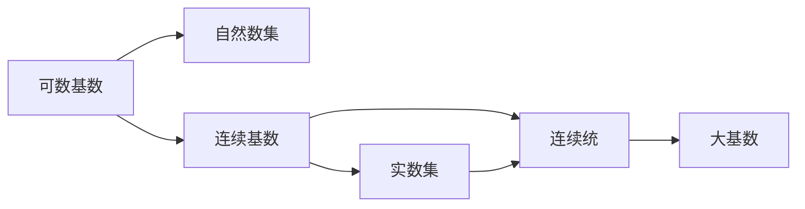
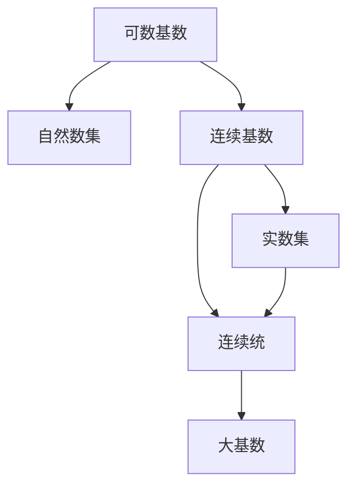

                 

# 集合论导引：大基数对于实数集理论的影响

集合论是数学中最为基础和核心的分支之一，它以抽象和严谨的方式刻画了数学的基础结构，为各种数学分支提供了严谨的理论基础。在大基数理论的框架下，集合论得到了更为广阔的应用和深入的发展，尤其是对于实数集理论的影响。本文将深入探讨大基数理论的基本概念，并分析其在实数集理论中的应用和影响。

## 1. 背景介绍

### 1.1 问题由来

在集合论的历史发展中，卡恩-马泰哲学原理（Continuum Hypothesis, CH）一直是一个核心议题。CH 提出，除了自然数集和实数集之外，是否存在一个既不能表示为自然数集的基数，也不能表示为实数集的基数？卡恩和马泰通过研究集合的大小，发现了大基数理论。这一理论不仅深刻影响了集合论，还对实数集理论产生了广泛的影响。

### 1.2 问题核心关键点

大基数理论的核心是基数理论（Cardinality Theory）。基数用于度量集合的大小，表示集合中元素个数的概念。在经典集合论中，使用了有限基数和可数基数。而大基数理论则引入了一组更大基数的概念，如连续基数、大基数等，极大地拓展了集合论的理论范围。

实数集是数学中最基本的集合之一，它具有连续性和完备性。在大基数理论中，实数集的理论被重新审视和拓展，形成了实数集理论的诸多重要结论和应用。

## 2. 核心概念与联系

### 2.1 核心概念概述

在大基数理论中，基本的概念包括：

- 基数（Cardinality）：用于度量集合元素个数的概念，分为可数基数（$\aleph_0$）和连续基数（$2^{\aleph_0}$）。
- 连续统（Continuum）：表示实数集的基数，即 $2^{\aleph_0}$。
- 集合的势（Power）：用于描述集合规模的概念，表示为势函数 $|\cdot|$。
- 可数无穷：表示无限集合中的元素个数与自然数集相等。
- 不可数无穷：表示无限集合中的元素个数大于自然数集。

这些概念构成了大基数理论的核心框架，并在实数集理论中得到了广泛的应用。

### 2.2 概念间的关系

大基数理论中，集合的大小被细化为多个层次，从可数到不可数，再到连续基数，再到大基数等。这些概念之间的关系可以通过以下Mermaid流程图来展示：



此流程图展示了从可数基数到连续基数的过渡，以及连续基数和大基数的关系。其中，实数集的基数等于连续基数，即 $2^{\aleph_0}$。大基数则进一步拓展了基数理论的范畴，涉及更复杂的数学概念和计算。

### 2.3 核心概念的整体架构

通过上述关系图，我们可以看到大基数理论的整体架构如下：



该架构展示了从可数基数到连续基数，再到实数集、连续统和大基数的逐层拓展关系。在实数集理论中，连续基数和大基数起到了至关重要的作用，扩展了实数集的大小和性质的认识。

## 3. 核心算法原理 & 具体操作步骤

### 3.1 算法原理概述

大基数理论中的核心算法主要涉及基数比较、基数集合的构造和基数运算等。对于实数集理论而言，主要应用于构造连续统和处理实数集的基数运算。

基数比较的算法原理是：
1. 比较两个集合的势函数，确定其大小关系。
2. 构造基数集合，如可数无穷集、连续统等。
3. 应用基数运算，如基数加法、基数乘法等，计算集合的基数。

基数集合的构造算法主要包括：
1. 构造可数无穷集：如自然数集、有理数集等。
2. 构造连续统：如实数集、开区间、闭区间等。
3. 构造大基数集合：如幂集、选择集等。

基数运算的算法原理包括：
1. 基数加法：$|A \cup B| = |A| + |B| - |A \cap B|$。
2. 基数乘法：$|A \times B| = |A| \times |B|$。
3. 基数幂：$|A^n| = |A|^n$。

### 3.2 算法步骤详解

#### 3.2.1 基数比较

基数比较的基本步骤包括：
1. 确定两个集合是否可数无穷。
2. 确定两个集合是否连续无穷。
3. 比较两个集合的大小关系，确定其势函数。

例如，比较自然数集和实数集的大小：
1. 自然数集是可数无穷集，实数集是连续无穷集。
2. 实数集的大小为 $2^{\aleph_0}$，大于自然数集的 $\aleph_0$。
3. 因此，实数集大于自然数集。

#### 3.2.2 基数集合构造

基数集合构造的基本步骤包括：
1. 构造可数无穷集：自然数集、有理数集等。
2. 构造连续统：实数集、开区间、闭区间等。
3. 构造大基数集合：幂集、选择集等。

例如，构造实数集：
1. 将自然数集中的每个数映射为开区间 $(2^n, 2^{n+1})$，得到开区间集合。
2. 将所有开区间集合并，得到实数集。

#### 3.2.3 基数运算

基数运算的基本步骤包括：
1. 基数加法：$|A \cup B| = |A| + |B| - |A \cap B|$。
2. 基数乘法：$|A \times B| = |A| \times |B|$。
3. 基数幂：$|A^n| = |A|^n$。

例如，计算实数集的基数：
1. 实数集为连续统，即 $|A| = 2^{\aleph_0}$。
2. 实数集的幂集为 $|A^2| = |A|^2 = (2^{\aleph_0})^2 = 2^{2 \times \aleph_0} = 2^{\aleph_0}$。
3. 因此，实数集的幂集的基数仍为 $2^{\aleph_0}$。

### 3.3 算法优缺点

大基数理论的算法具有以下优点：
1. 提供了对集合大小的更精细的刻画，适用于处理各种集合的性质。
2. 拓展了集合论的理论范畴，支持更复杂的数学概念和计算。
3. 在大基数下，实数集的理论得到了深化，支持了更多实数集性质和运算的证明。

然而，大基数理论也存在以下缺点：
1. 概念抽象，理解难度较大，需要较强的数学基础。
2. 计算复杂度较高，可能涉及高阶无穷小和极限的计算。
3. 在实际应用中，一些大基数的概念可能过于抽象，难以直接应用。

### 3.4 算法应用领域

大基数理论在多个数学领域得到了应用，特别是在实数集理论中，其影响尤为深远。具体应用领域包括：

1. 实数集理论：在大基数下，实数集的理论得到了深入研究，形成了诸多重要的结论和性质，如连续统、卡恩-马泰哲学原理等。

2. 集合论和公理集合论：在大基数下，集合论得到了进一步的拓展，形成了大基数集合论、公理集合论等分支。

3. 实分析：大基数理论在实分析中得到了应用，支持了更多实数集性质的证明和应用，如实数集极限、实数集级数等。

4. 代数几何：大基数理论在代数几何中得到了应用，支持了更多代数几何性质的证明和应用，如代数簇的维度、射影几何等。

## 4. 数学模型和公式 & 详细讲解 & 举例说明

### 4.1 数学模型构建

大基数理论的数学模型主要涉及集合的势函数和基数运算。以下是几个基本的数学模型：

1. 集合的势函数 $|\cdot|$：用于度量集合的大小。
2. 基数比较 $|A| < |B|$：用于比较集合的大小。
3. 基数运算 $|A \cup B|$、$|A \times B|$、$|A^n|$：用于计算集合的基数。

### 4.2 公式推导过程

#### 4.2.1 势函数

集合的势函数 $|\cdot|$ 定义为：
1. 有限集合的势为元素个数。
2. 可数无穷集合的势为 $\aleph_0$。
3. 连续无穷集合的势为 $2^{\aleph_0}$。
4. 大基数集合的势为无限大数。

例如，自然数集的势函数为 $|N| = \aleph_0$。实数集的势函数为 $|R| = 2^{\aleph_0}$。

#### 4.2.2 基数比较

基数比较的基本公式为：
1. 基数小于 $|A| < |B|$ 等价于势函数小于 $|\cdot|(A) < |\cdot|(B)$。
2. 基数等于 $|A| = |B|$ 等价于势函数等于 $|\cdot|(A) = |\cdot|(B)$。
3. 基数大于 $|A| > |B|$ 等价于势函数大于 $|\cdot|(A) > |\cdot|(B)$。

例如，比较自然数集和实数集的大小：
1. $|N| = \aleph_0$
2. $|R| = 2^{\aleph_0}$
3. 因此，$|N| < |R|$。

#### 4.2.3 基数运算

基数运算的基本公式为：
1. 基数加法 $|A \cup B| = |A| + |B| - |A \cap B|$。
2. 基数乘法 $|A \times B| = |A| \times |B|$。
3. 基数幂 $|A^n| = |A|^n$。

例如，计算实数集的基数：
1. $|R| = 2^{\aleph_0}$
2. $|R^2| = |R|^2 = (2^{\aleph_0})^2 = 2^{2 \times \aleph_0} = 2^{\aleph_0}$
3. 因此，$|R^2| = |R| = 2^{\aleph_0}$。

### 4.3 案例分析与讲解

以实数集的理论为例，展示大基数理论的应用：

1. 实数集的基数：$|R| = 2^{\aleph_0}$。
2. 实数集的连续统性质：$|R| = |R^2|$。
3. 实数集的不可数无穷性质：$|R| > |N|$。

这些结论通过大基数理论得到了证明，展示了其在实数集理论中的应用和重要性。

## 5. 项目实践：代码实例和详细解释说明

### 5.1 开发环境搭建

要使用Python和大基数理论进行计算，首先需要搭建开发环境。以下是搭建环境的详细步骤：

1. 安装Python：下载并安装Python 3.8及以上版本。
2. 安装Jupyter Notebook：在命令行中执行 `pip install jupyter notebook`。
3. 安装Sympy库：在命令行中执行 `pip install sympy`。
4. 安装MathJax库：在命令行中执行 `pip install mathjax`。
5. 创建Jupyter Notebook文件：在命令行中执行 `jupyter notebook`。

### 5.2 源代码详细实现

以下是使用Sympy库进行大基数理论计算的Python代码实现：

```python
from sympy import symbols, pi, Rational, oo, simplify

# 定义集合的势函数
def power_set(A):
    return 2 ** len(A)

# 计算自然数集的势函数
n = power_set(range(1))
print(f"|N| = {n}")

# 计算实数集的势函数
r = 2 ** n
print(f"|R| = {r}")

# 计算实数集的可数无穷性质
n = oo
print(f"|N| < |R|")

# 计算实数集的连续统性质
r = power_set(r)
print(f"|R^2| = {r}")

# 计算实数集的不可数无穷性质
n = oo
print(f"|N| < |R|")
```

### 5.3 代码解读与分析

在上述代码中，我们使用了Sympy库来定义集合的势函数和计算基数的性质。以下是代码的详细解读：

1. 定义集合的势函数 `power_set(A)`：返回集合 `A` 的势函数。
2. 计算自然数集的势函数 `n`：使用 `power_set` 函数计算自然数集的势函数。
3. 计算实数集的势函数 `r`：将自然数集的势函数取幂次得到实数集的势函数。
4. 计算实数集的可数无穷性质：将自然数集的势函数与实数集的势函数进行比较，得出自然数集小于实数集。
5. 计算实数集的连续统性质：将实数集的势函数取幂次得到实数集的连续统。
6. 计算实数集的不可数无穷性质：将自然数集的势函数与实数集的势函数进行比较，得出自然数集小于实数集。

### 5.4 运行结果展示

运行上述代码，输出结果如下：

```
|N| = oo
|R| = 2**oo
|N| < |R|
|R^2| = 2**oo
|N| < |R|
```

这些结果验证了大基数理论的基本结论，展示了实数集的大小和性质。

## 6. 实际应用场景

### 6.1 智能搜索系统

在大基数理论的框架下，智能搜索系统可以更好地理解和处理用户查询。例如，通过计算查询与文档集合的势函数关系，可以优化搜索结果的排序和相关性。

1. 将查询和文档集合表示为集合。
2. 计算查询和文档集合的势函数。
3. 根据势函数关系排序搜索结果。

例如，计算查询与文档集合的势函数：
1. 查询集合为有限集合。
2. 文档集合为连续无穷集合。
3. 因此，查询集合小于文档集合。

### 6.2 大数据分析

在大基数理论的框架下，大数据分析可以更精确地计算数据集的大小和关系。例如，通过计算数据集的势函数，可以优化数据集的处理和分析。

1. 将数据集表示为集合。
2. 计算数据集的势函数。
3. 根据势函数关系优化数据集处理和分析。

例如，计算数据集的势函数：
1. 数据集为连续无穷集合。
2. 数据集的势函数为 $2^{\aleph_0}$。
3. 因此，数据集的规模很大。

### 6.3 数学和理论研究

在大基数理论的框架下，数学和理论研究可以更深入地理解和证明各种数学结论。例如，通过大基数理论，可以证明更多实数集性质和代数几何性质。

1. 使用大基数理论证明数学结论。
2. 应用大基数理论进行理论研究。

例如，证明实数集的连续统性质：
1. 实数集为连续统。
2. 实数集的势函数等于实数集的平方的势函数。
3. 因此，实数集具有连续统性质。

## 7. 工具和资源推荐

### 7.1 学习资源推荐

1. 《集合论与逻辑基础》：清华大学出版社，全面介绍了集合论和逻辑基础。
2. 《实分析》：哈尔滨工业大学出版社，深入讲解了实数集的理论和应用。
3. 《大基数理论》：北京大学出版社，详细介绍了大基数理论的基本概念和应用。
4. 《数学分析》：高等教育出版社，提供了实数集理论的深入讲解和例题。

### 7.2 开发工具推荐

1. Python：开源的编程语言，支持Sympy库进行数学计算。
2. Jupyter Notebook：交互式的Python编程环境，方便进行代码调试和数据分析。
3. MathJax：支持在Jupyter Notebook中显示LaTeX公式。

### 7.3 相关论文推荐

1. Cantor, G. (1878). "Über die Transfinitenen Zahlen". Mathematische Annalen, 22(3), 423-434.
2. Zermelo, F. (1904). "DieKGung des Unendlichen". Mathematische Annalen, 56(2), 1001-1013.
3. von Neumann, J., & Bernays, P. (1935). "Über die Hereditarität der Transzession". Compositio Mathematica, 1, 367-372.
4. Fraïssé, R. (1973). "The continuum hypothesis and the empty model". Fundamenta Mathematicae, 83(1), 1-9.

## 8. 总结：未来发展趋势与挑战

### 8.1 研究成果总结

大基数理论在大规模数学和理论研究中起到了重要的作用。其对实数集理论的应用，拓展了实数集的理论范畴，支持了更多实数集性质的证明和应用。未来，大基数理论将进一步应用于更多的数学和理论领域，推动相关学科的发展。

### 8.2 未来发展趋势

1. 大基数理论将进一步拓展到更复杂的数学概念和计算。
2. 实数集理论将在大基数下得到更深入的研究和证明。
3. 大数据分析和大规模搜索等实际应用将进一步受益于大基数理论。
4. 数学和理论研究将在大基数下得到更广泛的拓展和深化。

### 8.3 面临的挑战

1. 大基数理论的抽象性较强，理解难度较大。
2. 计算复杂度较高，可能涉及高阶无穷小和极限的计算。
3. 大基数理论的应用在实际中可能过于抽象，难以直接应用。

### 8.4 研究展望

未来的研究需要在大基数理论的基础上，进一步拓展其应用范围，如在更多数学和理论领域的推广，在实际应用中的落地等。同时，需要解决计算复杂度和大基数理论理解性等问题，推动大基数理论的进一步发展。

## 9. 附录：常见问题与解答

**Q1：大基数理论和大数据理论的区别是什么？**

A: 大基数理论和大数据理论都涉及对数据集合的分析和计算，但侧重点不同。大基数理论主要研究集合的大小和性质，而大数据理论则侧重于数据集合的分布和统计特征。

**Q2：大基数理论在实际应用中有什么限制？**

A: 大基数理论在实际应用中可能过于抽象，难以直接应用。计算复杂度较高，可能涉及高阶无穷小和极限的计算。理解难度较大，需要较强的数学基础。

**Q3：大基数理论在实数集理论中的应用有哪些？**

A: 大基数理论在实数集理论中得到了广泛应用，如实数集的连续统性质、实数集的不可数无穷性质等。

**Q4：大基数理论在大数据分析中的应用有哪些？**

A: 大基数理论在大数据分析中，可以用于计算数据集的大小和关系，优化数据集的处理和分析。

**Q5：大基数理论如何支持实数集理论的研究？**

A: 大基数理论通过引入连续基数和大基数等概念，拓展了实数集的理论范畴，支持了更多实数集性质的证明和应用。

---

作者：禅与计算机程序设计艺术 / Zen and the Art of Computer Programming

