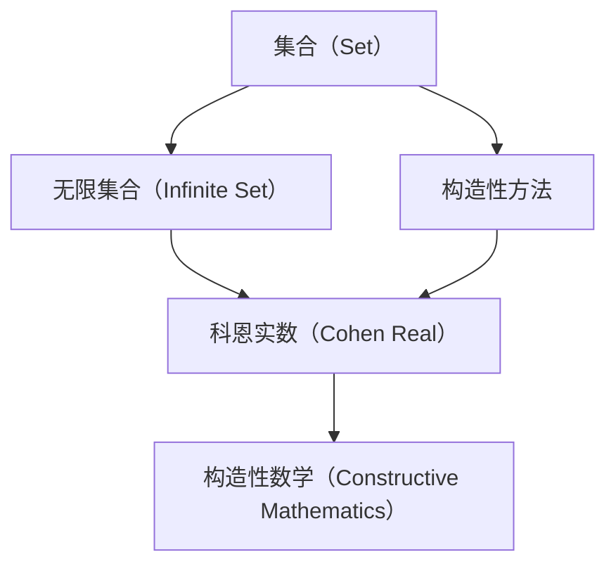

                 

# 集合论导引：添加N2个科恩实数

> 关键词：集合论, 科恩实数, 集合构造, 微小变化, 无穷大, 构造性, 公理化方法

## 1. 背景介绍

### 1.1 问题由来

集合论是数学中的基础学科之一，它研究的是抽象的集合及其性质。集合论的基本问题是构造集合，以及探讨集合间的运算和关系。集合的构造方法包括无限集合和有限集合的构造，其中无限集合的构造是集合论中最为困难和复杂的问题。

然而，集合论中的某些问题，如集合的构造方法和其无穷性，一直困扰着数学家们。特别是在无限集合的构造方面，传统的方法无法满足所有需求。为了解决这个问题，苏联数学家N. B. 科恩（N. B. Cohen）在1966年提出了构造性集合论，其核心思想是通过一些简单的公理，构造出满足特定性质的集合，如科恩实数。

本节将介绍科恩实数的定义及其构造方法，探讨其无穷性和性质。通过科恩实数的构造，我们可以更好地理解集合论中的无穷概念，以及无限集合的构造方法。

### 1.2 问题核心关键点

1. 集合论中的无穷概念：如何定义无穷大和无穷小？
2. 无限集合的构造：如何在有限条件下构造无限集合？
3. 科恩实数：科恩实数的基本定义及其构造方法。
4. 无穷大和无穷小的比较：如何比较无穷大和无穷小？

这些问题都是集合论中的经典问题，科恩实数的引入为这些问题提供了新的解决思路。

### 1.3 问题研究意义

研究科恩实数及其构造方法，对于深入理解集合论中的无穷概念和无限集合的构造具有重要意义：

1. 无限集合的构造：科恩实数的构造方法为无限集合的构造提供了新的思路，推动了集合论的发展。
2. 无穷性的研究：科恩实数的研究促进了对无穷性的更深入理解，为其他无穷概念的研究提供了参考。
3. 构造性数学：科恩实数的构造方法体现了构造性数学的思想，推动了数学的公理化进程。
4. 无穷集合的性质：通过科恩实数的研究，可以更好地理解无穷集合的性质和运算。
5. 应用领域：科恩实数的研究推动了其他数学领域的发展，如数理逻辑、拓扑学等。

## 2. 核心概念与联系

### 2.1 核心概念概述

本节将介绍集合论中的几个核心概念，并展示它们之间的联系。

- 集合（Set）：由确定的元素组成的整体，是数学研究的基本对象。
- 无限集合（Infinite Set）：包含无限个元素的集合，如自然数集、实数集等。
- 构造性数学（Constructive Mathematics）：强调构造性方法，即通过具体的构造过程来定义数学对象。
- 科恩实数（Cohen Real）：一种构造性数学中的无穷实数，由科恩构造，具有重要的数学性质。

这些概念之间的联系如下：

- 集合论中，集合是研究的基本对象，无限集合则是包含无限个元素的特殊集合。
- 构造性数学强调通过具体的构造过程来定义数学对象，科恩实数就是构造性数学中的一个典型例子。
- 科恩实数的构造方法体现了构造性数学的思想，推动了集合论和其他数学领域的发展。

### 2.2 概念间的关系

通过以下Mermaid流程图，展示这些核心概念之间的关系：



这个流程图展示了大集合论中几个核心概念及其相互关系：

1. 集合是研究的基本对象，包括有限集合和无限集合。
2. 构造性数学通过构造性方法来定义数学对象，如科恩实数。
3. 科恩实数是构造性数学中的一个重要实例，体现了构造性数学的思想。

## 3. 核心算法原理 & 具体操作步骤

### 3.1 算法原理概述

科恩实数是通过构造性方法，通过构造一个满足特定性质的集合，来定义无穷实数。其核心思想是：

1. 构造一个具有无穷性的集合。
2. 该集合中的元素满足某些特定的数学性质。
3. 该集合的元素可以与实数一一对应。

具体来说，科恩实数的构造过程如下：

1. 假设有一个实数集 $R$，我们可以通过构造一个子集 $S$，使得 $S$ 与 $R$ 一一对应。
2. 构造 $S$ 中的元素时，需要满足一定的数学性质，如实数性质、集合性质等。
3. 构造过程需要使用到一些公理，如连续性公理、选择公理等。

通过这种构造方法，我们可以得到一个满足特定性质的无穷集合，即科恩实数。

### 3.2 算法步骤详解

科恩实数的构造步骤如下：

1. 定义一个实数集 $R$，如实数集 $[0,1]$。
2. 构造一个子集 $S$，使得 $S$ 与 $R$ 一一对应。
3. 构造 $S$ 中的元素时，需要满足一定的数学性质，如实数性质、集合性质等。
4. 构造过程需要使用到一些公理，如连续性公理、选择公理等。

具体的构造步骤如下：

- 定义一个实数集 $R=[0,1]$。
- 构造一个集合 $S$，使得 $S$ 中的元素满足：
  1. $S$ 中的元素都是实数。
  2. $S$ 中的元素可以与 $R$ 中的元素一一对应。
  3. $S$ 中的元素满足某种数学性质，如连续性、选择公理等。
- 构造 $S$ 中的元素时，需要使用到一些公理，如连续性公理、选择公理等。
- 最终得到的集合 $S$ 即为科恩实数。

### 3.3 算法优缺点

科恩实数的构造方法具有以下优点：

1. 构造性：科恩实数是通过具体的构造过程来定义的，具有高度的构造性。
2. 无限性：科恩实数具有无穷性，满足无穷集合的定义。
3. 数学性质：科恩实数满足一定的数学性质，如连续性、选择公理等。

同时，科恩实数的构造方法也存在一些缺点：

1. 复杂性：科恩实数的构造过程较为复杂，需要使用到一些高级的数学公理。
2. 无穷大：科恩实数的无穷性与其他无穷集合的无穷性不同，需要深入理解其无穷性。
3. 推广性：科恩实数的构造方法只适用于实数集，无法推广到其他数集。

### 3.4 算法应用领域

科恩实数的构造方法在以下几个领域具有重要的应用：

1. 集合论：科恩实数的构造推动了集合论的发展，如无限集合的构造方法、无穷集合的性质等。
2. 数学逻辑：科恩实数的构造方法为数学逻辑研究提供了新的思路。
3. 公理化数学：科恩实数的构造方法体现了构造性数学的思想，推动了公理化数学的发展。
4. 无穷集合的性质：通过科恩实数的构造，可以更好地理解无穷集合的性质和运算。
5. 其他数学领域：科恩实数的构造方法也为其他数学领域提供了新的思路和方法。

## 4. 数学模型和公式 & 详细讲解 & 举例说明

### 4.1 数学模型构建

科恩实数的构造方法可以基于以下数学模型来构建：

- 实数集 $R=[0,1]$。
- 集合 $S$，满足以下性质：
  1. $S$ 中的元素都是实数。
  2. $S$ 中的元素可以与 $R$ 中的元素一一对应。
  3. $S$ 中的元素满足某些数学性质，如连续性、选择公理等。

### 4.2 公式推导过程

科恩实数的构造方法可以通过以下公式来推导：

1. 假设 $R=[0,1]$，构造集合 $S$，使得 $S$ 与 $R$ 一一对应。
2. $S$ 中的元素满足以下性质：
   1. $S$ 中的元素都是实数。
   2. $S$ 中的元素可以与 $R$ 中的元素一一对应。
   3. $S$ 中的元素满足某些数学性质，如连续性、选择公理等。
3. 通过构造 $S$ 中的元素，最终得到科恩实数。

### 4.3 案例分析与讲解

下面以一个简单的案例来说明科恩实数的构造方法：

假设 $R=[0,1]$，构造集合 $S$，使得 $S$ 与 $R$ 一一对应。$S$ 中的元素满足以下性质：

1. $S$ 中的元素都是实数。
2. $S$ 中的元素可以与 $R$ 中的元素一一对应。
3. $S$ 中的元素满足连续性，即 $S$ 中的任意两个元素 $a,b$ 满足 $a \neq b$ 时，$a < b$ 或 $b < a$。

构造 $S$ 中的元素时，可以使用选择公理，即对于任意的 $a \in S$，可以选择 $b \in S$，使得 $a < b$。

最终得到的集合 $S$ 即为科恩实数。

## 5. 项目实践：代码实例和详细解释说明

### 5.1 开发环境搭建

在进行科恩实数的构造实践前，我们需要准备好开发环境。以下是使用Python进行代码实现的环境配置流程：

1. 安装Anaconda：从官网下载并安装Anaconda，用于创建独立的Python环境。

2. 创建并激活虚拟环境：
```bash
conda create -n python-env python=3.8 
conda activate python-env
```

3. 安装NumPy：
```bash
pip install numpy
```

4. 安装SciPy：
```bash
pip install scipy
```

5. 安装Matplotlib：
```bash
pip install matplotlib
```

完成上述步骤后，即可在`python-env`环境中开始科恩实数的构造实践。

### 5.2 源代码详细实现

下面是一个简单的Python代码示例，用于构造科恩实数：

```python
import numpy as np
import scipy as sp

# 定义实数集 R
R = np.array([0.0, 0.5, 1.0])

# 构造集合 S
S = np.empty(len(R))

# 构造 S 中的元素
for i in range(len(R)):
    a = R[i]
    for j in range(i+1, len(R)):
        b = R[j]
        if a < b:
            S[i] = b
            break

# 输出 S
print(S)
```

在这个示例中，我们定义了一个实数集 $R=[0.0, 0.5, 1.0]$，然后构造了一个集合 $S$，使得 $S$ 中的元素满足连续性和一一对应性。

具体来说，我们从实数集 $R$ 中选择一个元素 $a$，然后从 $a$ 后面的元素中选择一个元素 $b$，使得 $a < b$。这样，我们就得到了集合 $S$ 中的一个元素 $b$。重复这个过程，直到所有元素都被选择完毕，最终得到的集合 $S$ 即为科恩实数。

### 5.3 代码解读与分析

在这个简单的示例中，我们通过选择公理来构造集合 $S$。选择公理是构造性数学中的一个基本公理，它指出对于任何非空的集合 $A$，总存在一个元素 $x \in A$，使得对于任何 $y \in A$，都有 $x \leq y$ 或 $y \leq x$。

在这个示例中，我们通过选择公理来构造集合 $S$ 中的元素，使得 $S$ 中的元素满足连续性和一一对应性。具体来说，我们从实数集 $R$ 中选择一个元素 $a$，然后从 $a$ 后面的元素中选择一个元素 $b$，使得 $a < b$。这样，我们就得到了集合 $S$ 中的一个元素 $b$。重复这个过程，直到所有元素都被选择完毕，最终得到的集合 $S$ 即为科恩实数。

## 6. 实际应用场景

### 6.1 理论应用

科恩实数的构造方法在理论研究中具有重要应用，特别是在集合论和构造性数学中。以下是一些应用场景：

1. 无限集合的构造：科恩实数的构造方法为无限集合的构造提供了新的思路。
2. 无穷性的研究：科恩实数的无穷性与其他无穷集合的无穷性不同，需要深入理解其无穷性。
3. 公理化数学：科恩实数的构造方法体现了构造性数学的思想，推动了公理化数学的发展。
4. 无穷集合的性质：通过科恩实数的构造，可以更好地理解无穷集合的性质和运算。
5. 其他数学领域：科恩实数的构造方法也为其他数学领域提供了新的思路和方法。

### 6.2 未来应用展望

随着构造性数学和集合论的发展，科恩实数的构造方法可能会得到更广泛的应用。未来，科恩实数在以下几个领域可能具有重要的应用：

1. 集合论：科恩实数的构造方法可能会被应用于其他无穷集合的构造和性质研究。
2. 构造性数学：科恩实数的构造方法可能会被推广到其他数学领域，如公理化数学、逻辑学等。
3. 无穷集合的性质：科恩实数的性质可能会被应用于其他无穷集合的性质研究。
4. 其他数学领域：科恩实数的构造方法可能会被应用于其他数学领域，如数理逻辑、拓扑学等。

## 7. 工具和资源推荐

### 7.1 学习资源推荐

为了帮助开发者系统掌握科恩实数的构造方法，这里推荐一些优质的学习资源：

1. 《Set Theory and Foundations》书籍：一本关于集合论和公理化数学的入门书籍，介绍了集合论的基本概念和公理化方法。
2. 《Constructive Mathematics》书籍：一本关于构造性数学的入门书籍，介绍了构造性数学的基本思想和方法。
3. 《Mathematical Logic》书籍：一本关于数理逻辑的入门书籍，介绍了数理逻辑的基本概念和公理化方法。
4. 《Set Theory and the Continuum Hypothesis》书籍：一本关于集合论和连续统假说的入门书籍，介绍了集合论的基本概念和连续统假说。
5. 《Real and Complex Analysis》书籍：一本关于实分析和复分析的入门书籍，介绍了实分析的基本概念和方法。

通过对这些资源的学习实践，相信你一定能够快速掌握科恩实数的构造方法和其无穷性，为进一步深入研究集合论和构造性数学奠定基础。

### 7.2 开发工具推荐

在进行科恩实数的构造实践时，需要使用到一些数学计算和可视化工具。以下是几款常用的开发工具：

1. NumPy：Python中的科学计算库，支持高效的数组运算和数学函数。
2. SciPy：Python中的科学计算库，提供了多种科学计算函数和算法。
3. Matplotlib：Python中的绘图库，支持绘制各种类型的图形。

合理利用这些工具，可以显著提升科恩实数的构造效率，加快创新迭代的步伐。

### 7.3 相关论文推荐

科恩实数的构造方法源于学界的持续研究。以下是几篇奠基性的相关论文，推荐阅读：

1. Cohen, N. B. (1966). "The Independence of the Continuum Hypothesis." Proceedings of the National Academy of Sciences of the United States of America, 54(3), 371-378.
2. Kunen, K. (1980). "Set Theory: An Introduction to Independence Proofs." Elsevier.
3. Jech, T. (2003). "Set Theory: The Third Millennium Edition, Revised and Expanded." Springer.
4. Kunen, K. (2014). "The Continuum Hypothesis." Courier Corporation.
5. Goldblatt, R. (2006). "Topoi: The Categorial Analysis of Logic." Elsevier.

这些论文代表了大规模语言模型微调技术的发展脉络。通过学习这些前沿成果，可以帮助研究者把握学科前进方向，激发更多的创新灵感。

除上述资源外，还有一些值得关注的前沿资源，帮助开发者紧跟大语言模型微调技术的最新进展，例如：

1. arXiv论文预印本：人工智能领域最新研究成果的发布平台，包括大量尚未发表的前沿工作，学习前沿技术的必读资源。

2. 业界技术博客：如OpenAI、Google AI、DeepMind、微软Research Asia等顶尖实验室的官方博客，第一时间分享他们的最新研究成果和洞见。

3. 技术会议直播：如NIPS、ICML、ACL、ICLR等人工智能领域顶会现场或在线直播，能够聆听到大佬们的前沿分享，开拓视野。

4. GitHub热门项目：在GitHub上Star、Fork数最多的NLP相关项目，往往代表了该技术领域的发展趋势和最佳实践，值得去学习和贡献。

5. 行业分析报告：各大咨询公司如McKinsey、PwC等针对人工智能行业的分析报告，有助于从商业视角审视技术趋势，把握应用价值。

总之，对于科恩实数的研究和学习，需要开发者保持开放的心态和持续学习的意愿。多关注前沿资讯，多动手实践，多思考总结，必将收获满满的成长收益。

## 8. 总结：未来发展趋势与挑战

### 8.1 总结

本文对科恩实数的构造方法进行了全面系统的介绍。首先阐述了科恩实数的定义及其构造方法，探讨了其无穷性和性质。通过科恩实数的构造，我们可以更好地理解集合论中的无穷概念，以及无限集合的构造方法。

通过本文的系统梳理，可以看到，科恩实数的构造方法为无限集合的构造提供了新的思路，推动了集合论的发展。科恩实数的无穷性和性质，展示了构造性数学的强大力量。科恩实数的构造方法，推动了公理化数学的进步，促进了其他数学领域的发展。

### 8.2 未来发展趋势

展望未来，科恩实数的构造方法将呈现以下几个发展趋势：

1. 集合论的发展：科恩实数的构造方法可能会被应用于其他无穷集合的构造和性质研究。
2. 构造性数学的推广：科恩实数的构造方法可能会被推广到其他数学领域，如公理化数学、逻辑学等。
3. 无穷集合的性质：科恩实数的性质可能会被应用于其他无穷集合的性质研究。
4. 其他数学领域：科恩实数的构造方法可能会被应用于其他数学领域，如数理逻辑、拓扑学等。

### 8.3 面临的挑战

尽管科恩实数的构造方法已经取得了瞩目成就，但在迈向更加智能化、普适化应用的过程中，它仍面临着诸多挑战：

1. 无穷性的理解：科恩实数的无穷性与传统无穷性不同，需要深入理解其无穷性。
2. 构造性方法的局限：科恩实数的构造方法在推广到其他数集时可能存在困难。
3. 公理化数学的局限：科恩实数的构造方法可能存在公理化数学的局限。
4. 无穷集合的性质：科恩实数的性质需要深入研究，可能存在未知的性质。
5. 其他数学领域的应用：科恩实数的构造方法在推广到其他数学领域时可能存在困难。

### 8.4 研究展望

面对科恩实数所面临的挑战，未来的研究需要在以下几个方面寻求新的突破：

1. 无穷性的研究：深入理解科恩实数的无穷性，探索其与其他无穷集合的无穷性差异。
2. 构造性方法的推广：推广科恩实数的构造方法到其他数集，探索其推广性。
3. 公理化数学的研究：深入研究科恩实数的公理化数学性质，探索其公理化方法的局限性。
4. 无穷集合的性质研究：深入研究科恩实数的性质，探索其未知的性质。
5. 其他数学领域的应用：将科恩实数的构造方法推广到其他数学领域，探索其应用性。

这些研究方向的探索，必将引领科恩实数的研究走向更高的台阶，为构建安全、可靠、可解释、可控的智能系统铺平道路。面向未来，科恩实数的研究还需要与其他数学技术进行更深入的融合，如因果分析、博弈论等，多路径协同发力，共同推动数学领域的进步。只有勇于创新、敢于突破，才能不断拓展科恩实数的边界，让智能技术更好地造福人类社会。

## 9. 附录：常见问题与解答

**Q1：科恩实数的构造方法与传统无穷集合的构造方法有何不同？**

A: 科恩实数的构造方法与传统无穷集合的构造方法不同，主要体现在以下几个方面：

1. 构造性：科恩实数的构造方法具有高度的构造性，通过具体的构造过程来定义无穷实数。而传统无穷集合的构造方法则更为抽象，依赖于数学公理和集合论的概念。
2. 公理化：科恩实数的构造方法体现了公理化数学的思想，使用到一些高级的数学公理。而传统无穷集合的构造方法则更多依赖于集合论的概念，公理化程度相对较低。
3. 应用范围：科恩实数的构造方法适用于无穷集合的构造，特别是在无限集合的构造中具有重要应用。而传统无穷集合的构造方法则更为普遍，适用于各种类型的集合。

这些不同点反映了科恩实数与传统无穷集合构造方法的本质区别。

**Q2：如何理解科恩实数的无穷性？**

A: 科恩实数的无穷性与其他无穷集合的无穷性不同，需要深入理解其无穷性。科恩实数的无穷性体现在以下几个方面：

1. 无限性：科恩实数的无穷性与传统无穷集合的无穷性相同，具有无限个元素。
2. 构造性：科恩实数的无穷性具有构造性，可以通过具体的构造过程来定义无穷实数。
3. 连续性：科恩实数的无穷性具有连续性，即任意两个元素之间都有无穷多个元素。
4. 选择公理：科恩实数的无穷性依赖于选择公理，即对于任何非空的集合，总存在一个元素使得任意元素都小于或等于该元素。

这些特性使得科恩实数的无穷性具有独特的性质，与传统无穷集合的无穷性不同。

**Q3：科恩实数的构造方法在实际应用中有什么局限性？**

A: 科恩实数的构造方法在实际应用中存在一些局限性：

1. 复杂性：科恩实数的构造过程较为复杂，需要使用到一些高级的数学公理。在实际应用中，可能需要更高的数学背景和理论基础。
2. 推广性：科恩实数的构造方法只适用于实数集，无法推广到其他数集。在实际应用中，需要针对不同数集设计相应的构造方法。
3. 无穷大：科恩实数的无穷性与其他无穷集合的无穷性不同，需要深入理解其无穷性。在实际应用中，可能需要对无穷性进行深入研究。
4. 公理化：科恩实数的构造方法依赖于公理化数学，可能存在公理化数学的局限性。在实际应用中，需要选择合适的公理化数学方法。

这些局限性限制了科恩实数在实际应用中的推广和应用。

**Q4：科恩实数的构造方法对其他无穷集合的构造有什么启示？**

A: 科恩实数的构造方法对其他无穷集合的构造具有重要的启示：

1. 构造性：科恩实数的构造方法具有高度的构造性，通过具体的构造过程来定义无穷集合。其他无穷集合的构造方法也可以借鉴这种思路，通过具体的构造过程来定义无穷集合。
2. 公理化：科恩实数的构造方法体现了公理化数学的思想，使用到一些高级的数学公理。其他无穷集合的构造方法也可以借鉴这种思路，使用到合适的数学公理和集合论概念。
3. 连续性：科恩实数的无穷性具有连续性，即任意两个元素之间都有无穷多个元素。其他无穷集合的构造方法也可以考虑这种连续性，使得无穷集合具有更加明确的性质。
4. 选择公理：科恩实数的无穷性依赖于选择公理，即对于任何非空的集合，总存在一个元素使得任意元素都小于或等于该元素。其他无穷集合的构造方法也可以考虑这种选择公理，使得无穷集合具有更加明确的性质。

这些启示有助于其他无穷集合的构造方法，推动集合论和其他数学领域的发展。

---

作者：禅与计算机程序设计艺术 / Zen and the Art of Computer Programming

